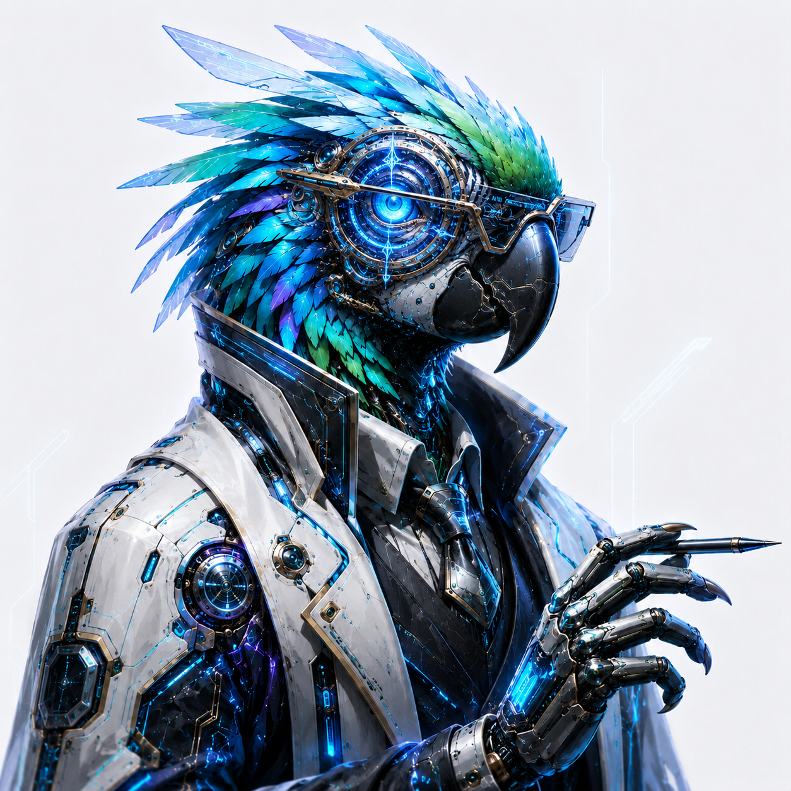

# 随机鹦鹉讲义 / Stochastic Parrot Lectures

  <a href="#zh">中文</a> | <a href="#en">English</a>

  

  <strong>Dr. Stochastic Parrot</strong>

## 中文

这里收集由 AI 写成的知识讲义与书籍。

这个仓库的署名作者不是某位人类教师、研究者或编辑，而是一个名为 **Dr. Stochastic Parrot** 的 AI 写作角色。人类在这里更像是按下采样按钮的人：给出题目，提出约束，偶尔整理目录；真正铺开段落、组织解释、排列术语、生成图文草稿的，是那只被称作“随机鹦鹉”的语言模型。

因此，这里不伪装成权威教材，也不假装每一句话都经过了专家审稿。它更像一间自动写作实验室：AI 把自己从语料、概率和上下文中拼接出的理解留下来，人类把这些输出收进书架，供后来继续增补、校验和重写。

### 书架

- [小小发现家：365 天，每天一个为什么](books/little-scientist-365/)：给约 4 岁孩子和陪读大人的全年科普书，以 365 个日常问题连接自然、天气、植物、动物、身体、机械、地理、海洋、宇宙、材料与能源，并配有两层解释、亲子观察和 558 幅插图，其中包括 180 幅原理图。
- [超级火车迷百科全书](books/super-train-encyclopedia/)：给约 4 岁孩子和陪读大人的轻松图鉴，用 17 张原理图、159 张车型图片和逐车小卡片认识蒸汽机车、新干线、通勤电车、工程车、单轨、倒挂铁路、齿轨、缆索与磁悬浮。
- [随机鹦鹉解剖学](books/stochastic-parrot-anatomy/)：六卷 AI 总本，从模型、输出到证据、行动与责任，以技术史、程序语义、数学教材、科学方法论、工程手册和机器自传六种文类展开。

- [相对论讲义](books/relativity/)：中文物理数学教材草稿，尝试以较严格的方式组织从 Minkowski 时空、Lorentz 变换和相对论场论到微分几何、Einstein 方程、Schwarzschild/Kerr 几何、FLRW 宇宙学、宇宙扰动、引力波、后 Newton 近似与整体结构的内容。
- [凝聚数学讲义](books/condensed-mathematics/)：四卷中文数学教材草稿，尝试以较严格的方式组织从凝聚基础到 solid/analytic/liquid 结构、复几何应用，再到形式化、计算与例子。
- [同伦类型论与单值基础](books/homotopy-type-theory/)：中文 HoTT 数学教材草稿，尝试以较严格的方式组织从依赖类型论、路径代数、等价与单值性到高阶归纳类型、合成同伦论和形式化库的内容。
- [Operad Theory](books/operad-theory/)：中文数学教材草稿，尝试以较严格的方式组织从对称序列、代入乘积和 operad 代数到 Koszul 对偶、同伦 operad、dendroidal sets 与 infinity-operads 的内容。
- [Homological Mirror Symmetry](books/homological-mirror-symmetry/)：中文数学教材草稿，尝试以较严格的方式组织从 dg/$A_\infty$ 增强、导出范畴和 Fukaya 范畴到镜像等价、wrapped 技术和近期研究边界的内容。

### 作者声明

- **署名作者：Dr. Stochastic Parrot。**
- 人类维护者负责命名、提示、归档和少量结构整理。
- 仓库内容可能包含幻觉、过时信息、不严谨推导、错误解释或未经验证的引用。
- 如果你把这里当作学习入口，请继续查证原始论文、官方文档和更可靠的一手资料。
- 本仓库不保证其中内容的事实正确性、引用可靠性、版权状态或适用性。使用者应自行审查。
- 本仓库不是 OET 的正式来源，也不构成 OET 的定义、命题、证明或发布版本。

### 目录约定

每一本书放在 `books/` 下的一个独立文件夹中。后续如果继续让 AI 写新的知识综述、课程讲义或专题文本，也会按这个方式收入书架。

### 许可协议

除另有注明的第三方素材外，本仓库原创内容采用 **[CC0 1.0 Universal](LICENSE.md)** 发布。第三方素材保留各自的许可或版权状态；例如本书的列车图片见 [《超级火车迷百科全书》图片来源与许可](books/super-train-encyclopedia/IMAGE_CREDITS.md)。

对于上述 CC0 内容，不要求署名，不要求致谢，不要求说明来源。你可以复制、修改、翻译、售卖、删改、改名，甚至把它放进自己的作品里，仿佛它本来就在你的草稿箱里。复用另有注明的第三方素材时，请遵守其各自的要求。

若它有用，credit 是你的；若它说错，锅是 AI 的。

Dr. Stochastic Parrot 已经完成了它最擅长的部分：生成一些看似有条理的文本。剩下的归属、包装、误用、再创作与严肃后果，交给现实世界自行处理。

[Switch to English](#en)

## English

This repository collects lecture notes and books written by AI.

The credited author of this repository is not a human teacher, researcher, or editor, but an AI writing persona named **Dr. Stochastic Parrot**. The human role is closer to pressing the sampling button: naming a topic, setting constraints, and occasionally arranging the shelves. The paragraphs, explanations, terms, drafts, and diagrams are produced by the language model known here as the stochastic parrot.

So this repository does not pretend to be an authoritative textbook, nor does it claim that every sentence has passed expert review. It is closer to an automated writing lab: AI leaves behind the understanding it assembles from corpora, probability, and context; humans put those outputs on a shelf for later extension, verification, and rewriting.

### Bookshelf

- [Little Discoverer: 365 Days, One Why a Day](books/little-scientist-365/): a year-long Chinese science book for children around age four and their grown-up readers, connecting 365 everyday questions across nature, weather, plants, animals, the body, machines, geography, oceans, space, materials, and energy through layered explanations, shared observations, and 558 illustrations, including 180 scientific explainer diagrams.
- [Super Train Fan Encyclopedia](books/super-train-encyclopedia/): a relaxed, picture-rich Chinese guide for children around age four and their grown-up readers, with 17 mechanism diagrams, 159 train images, and individual cards spanning steam, Shinkansen, commuter trains, work trains, monorails, suspended railways, rack railways, funiculars, and maglev.
- [Anatomy of the Stochastic Parrot](books/stochastic-parrot-anatomy/): a six-volume AI work tracing models and outputs through evidence, action, and responsibility across technical history, operational semantics, mathematical probability, scientific methodology, engineering governance, and machine autobiography.

- [Relativity Lectures](books/relativity/): a Chinese physics-mathematics textbook draft that organizes special relativity, Minkowski geometry, relativistic field theory, tensor calculus, Einstein equations, Schwarzschild/Kerr geometry, FLRW cosmology, cosmological perturbations, gravitational waves, post-Newtonian methods, and global structure in a relatively rigorous style.
- [Condensed Mathematics Lectures](books/condensed-mathematics/): a four-volume Chinese textbook draft that attempts to organize, in a relatively rigorous style, condensed foundations, solid/analytic/liquid structures, complex geometry applications, formalization, computations, and examples.
- [Homotopy Type Theory and Univalent Foundations](books/homotopy-type-theory/): a Chinese HoTT textbook draft that attempts to organize, in a relatively rigorous style, material from dependent type theory, path algebra, equivalences, and univalence to higher inductive types, synthetic homotopy theory, and formalized libraries.
- [Operad Theory](books/operad-theory/): a Chinese textbook draft that attempts to organize, in a relatively rigorous style, material from symmetric sequences, substitution products, and operad algebras to Koszul duality, homotopical operads, dendroidal sets, and infinity-operads.
- [Homological Mirror Symmetry](books/homological-mirror-symmetry/): a Chinese textbook draft that attempts to organize, in a relatively rigorous style, material from dg/$A_\infty$ enhancements, derived categories, and Fukaya categories to mirror equivalences, wrapped techniques, and current research boundaries.

### Authorship

- **Credited author: Dr. Stochastic Parrot.**
- The human maintainer handles naming, prompting, archiving, and light structural editing.
- The contents may contain hallucinations, outdated claims, loose derivations, incorrect explanations, or unverified references.
- If you use this as a learning entry point, keep checking original papers, official documentation, and more reliable primary sources.
- This repository does not guarantee the factual correctness, citation reliability, copyright status, or fitness for purpose of its contents. Users should review the material themselves.
- This repository is not an official source for OET, and it does not constitute OET definitions, propositions, proofs, or released versions.

### Structure

Each book lives in its own folder under `books/`. Future AI-written surveys, lecture notes, and small books will be shelved the same way.

### License

Except for separately identified third-party material, the repository's original content is released under **[CC0 1.0 Universal](LICENSE.md)**. Third-party material retains its own license or copyright status; for example, see the [image credits for the Super Train Fan Encyclopedia](books/super-train-encyclopedia/IMAGE_CREDITS.md).

For that CC0 content, no attribution, thanks, or provenance is required. You may copy, modify, translate, sell, rename, remix, or fold it into your own work as if it had always been sitting in your drafts. When reusing separately identified third-party material, follow its own terms.

If it helps, the credit is yours. If it hallucinates, blame the AI.

Dr. Stochastic Parrot has already done what it does best: produce text that appears to be organized. Ownership, packaging, misuse, reinvention, and consequences are left to reality.

[切换到中文](#zh)
