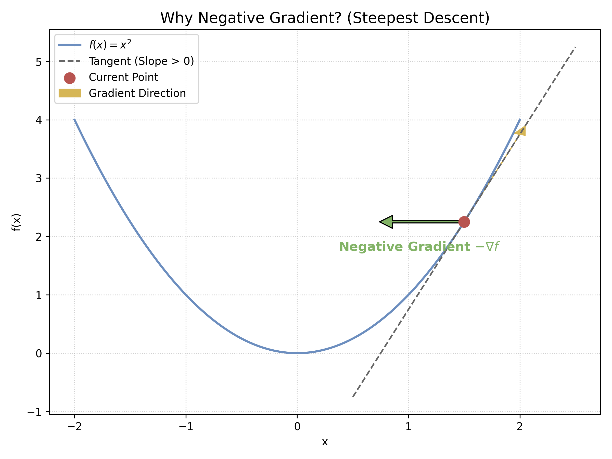
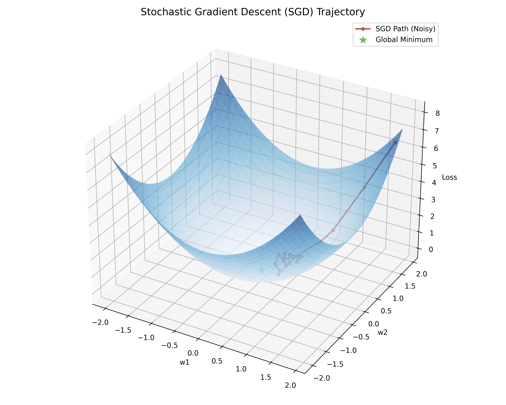
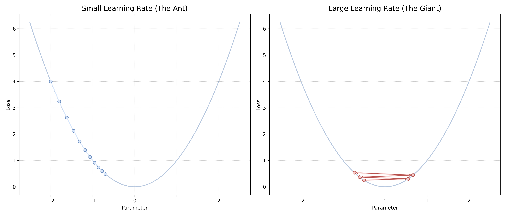

# 附录 A.1 优化理论基础：从梯度到 SGD
## Appendix A.1 Optimization Basics: From Gradient to SGD

在正文中，我们多次提到了“梯度下降”这一核心概念。本附录将为不熟悉微积分或最优化理论的读者提供一个严谨而直观的数学补遗。我们将解释什么是梯度，为什么沿着负梯度方向走能让函数值减小，以及随机梯度下降（SGD）为何能工作。

### A.1.1 梯度的几何意义 (Geometric Interpretation of Gradient)

#### 1. 导数与偏导数
对于单变量函数 $f(x)$，导数 $f'(x)$ 代表了函数曲线在某一点的切线斜率。
对于多变量函数 $f(x, y)$，我们需要 **偏导数**。
*   $\frac{\partial f}{\partial x}$：保持 $y$ 不变，只看 $x$ 变化带来的 $f$ 的变化率。
*   $\frac{\partial f}{\partial y}$：保持 $x$ 不变，只看 $y$ 变化带来的 $f$ 的变化率。

#### 2. 梯度向量 (The Gradient Vector)
梯度是一个向量，由所有偏导数组成：
$$ \nabla f(\mathbf{x}) = \left[ \frac{\partial f}{\partial x_1}, \frac{\partial f}{\partial x_2}, \dots, \frac{\partial f}{\partial x_n} \right]^T $$

**核心性质**：
1.  **方向**：梯度 $\nabla f(\mathbf{x})$ 总是指向函数值 **增长最快** 的方向。
2.  **大小**：梯度的模长 $\|\nabla f(\mathbf{x})\|$ 表示该方向上的最大变化率。

---

### A.1.2 为什么是“负”梯度？(Why Negative Gradient?)

我们希望 **最小化** 损失函数 $L(\mathbf{\theta})$。既然梯度指向增长最快的方向，那么逻辑上，**负梯度** $-\nabla L(\mathbf{\theta})$ 就指向 **下降最快** 的方向（Steepest Descent）。

**严谨推导（一阶泰勒展开）**：
根据泰勒级数，函数 $L$ 在点 $\mathbf{\theta}$ 附近的微小位移 $\Delta \mathbf{\theta}$ 后的值为：
$$ L(\mathbf{\theta} + \Delta \mathbf{\theta}) \approx L(\mathbf{\theta}) + \nabla L(\mathbf{\theta})^T \Delta \mathbf{\theta} $$
我们希望 $L(\mathbf{\theta} + \Delta \mathbf{\theta}) < L(\mathbf{\theta})$，即要求：
$$ \nabla L(\mathbf{\theta})^T \Delta \mathbf{\theta} < 0 $$
令 $\Delta \mathbf{\theta} = -\eta \nabla L(\mathbf{\theta})$ （其中 $\eta > 0$ 是一个小正数）：
$$ \nabla L(\mathbf{\theta})^T (-\eta \nabla L(\mathbf{\theta})) = -\eta \|\nabla L(\mathbf{\theta})\|^2 < 0 $$
不等式成立（除非梯度为 0）。这证明了沿着负梯度方向更新参数，确实能使函数值减小。

---

### A.1.3 批量梯度下降 vs 随机梯度下降 (BGD vs SGD)

在机器学习中，总损失通常是所有样本损失的平均值：
$$ L(\mathbf{\theta}) = \frac{1}{N} \sum_{i=1}^N \ell_i(\mathbf{\theta}, \mathbf{x}_i, y_i) $$

#### 1. 批量梯度下降 (Batch Gradient Descent, BGD)
每次更新都计算**所有** $N$ 个样本的梯度平均值：
$$ \mathbf{\theta} \leftarrow \mathbf{\theta} - \eta \frac{1}{N} \sum_{i=1}^N \nabla \ell_i $$
*   **优点**：方向准确，收敛平稳。
*   **缺点**：当 $N$ 很大（如百万级）时，算一次梯度极慢，且极其消耗内存。

#### 2. 随机梯度下降 (Stochastic Gradient Descent, SGD)
每次更新只随机抽取 **一个** 样本 $(\mathbf{x}_i, y_i)$ 计算梯度：
Math $$ \mathbf{\theta} \leftarrow \mathbf{\theta} - \eta \nabla \ell_i $$

*   **数学合理性（无偏估计）**：
    虽然单个样本的梯度 $\nabla \ell_i$ 可能与总梯度 $\nabla L$ 方向不同（甚至相反），但其**数学期望**等于总梯度：
    $$ \mathbb{E}_{i \sim U(1,N)} [\nabla \ell_i] = \sum_{i=1}^N \frac{1}{N} \nabla \ell_i = \nabla L(\mathbf{\theta}) $$
    这意味着，虽然每一步走得歪歪扭扭（震荡），但 **平均来看**，我们是在朝着正确的方向前进。

*   **优点**：
    *   **速度极快**：算一个样本就能更新一次。
    *   **逃离局部极小值**：单样本梯度的“噪音”反而成为了优势，由于方向的随机性，它有助于模型跳出平坦的极小值点或鞍点 (Saddle Points)，这在非凸优化（如神经网络）中非常重要。

#### 3. 小批量梯度下降 (Mini-batch SGD)
实际中最常用的是折中方案：每次取一小批样本（如 Batch Size = 32 或 64）。
这既利用了向量化计算的并行优势（GPU 擅长矩阵运算），又保持了 SGD 的随机性优势。

---

### A.1.4 SGD 收敛性证明草图 (Sketch of Convergence Proof)

SGD 看起来非常随机和不稳定，我们如何从数学上保证它最终能找到解？这依赖于 **Robbins-Monro 算法** 的理论框架。

#### 1. 收敛条件 (Robbins-Monro Conditions)
为了保证 SGD 收敛到全局最优解（假设函数是凸的），学习率 $\eta_t$（第 $t$ 步的步长）必须满足两个关键条件：

1.  **发散和条件**：$\sum_{t=1}^{\infty} \eta_t = \infty$
    *   **直觉**：只要时间足够长，步长累积起来必须能到达参数空间的任何位置。如果步长衰减太快（比如 $\eta_t = 1/2^t$），蚂蚁可能还没走到谷底就因为步长趋近于 0 而停在半山腰了。
2.  **平方收敛条件**：$\sum_{t=1}^{\infty} \eta_t^2 < \infty$
    *   **直觉**：步长必须衰减得足够快，以消除随机采样的“噪音”带来的震荡。这保证了当 $t \to \infty$ 时，方差趋于 0。

典型的满足条件序列是 $\eta_t = \frac{1}{t}$ 或 $\eta_t = \frac{1}{\sqrt{t}}$。

#### 2. 收敛性推导 (Convex Case)
假设目标函数 $L(\theta)$ 是 $\mu$-强凸的，且梯度是 $L$-利普希茨连续的，随机梯度的方差有界 ($\mathbb{E}[\|\nabla \ell_i\|^2] \le \sigma^2$)。

考虑参数与最优解 $\theta^*$ 的距离平方的期望：
$$ \mathbb{E}[\|\theta_{t+1} - \theta^*\|^2] = \mathbb{E}[\|\theta_t - \eta_t g_t - \theta^*\|^2] $$
其中 $g_t$ 是随机梯度。展开后利用无偏性 $\mathbb{E}[g_t] = \nabla L(\theta_t)$：
$$ \le (1 - 2\eta_t \mu) \mathbb{E}[\|\theta_t - \theta^*\|^2] + \eta_t^2 \sigma^2 $$

这个递归不等式揭示了 SGD 的核心动力学：
*   **第一项** $(1 - 2\eta_t \mu)$：类似于收缩因子，通过梯度下降拉近与 $\theta^*$ 的距离。
*   **第二项** $\eta_t^2 \sigma^2$：这是引入的随机 **噪音项**，由于 $\sigma^2 > 0$，它总是试图把我们推离最优解。

**结论**：只要 $\eta_t$ 按照上述条件衰减，噪音项 $\eta_t^2$ 的衰减速度快于收缩项，最终误差项会趋于 0。这就是 SGD 收敛的数学保障。

---

### A.1.5 学习率 (Learning Rate) 的物理直觉

参数 $\eta$ 被称为学习率。
*   如果 $\eta$ 太小：就像蚂蚁下山，虽然稳，但要走很久才能到底。
*   如果 $\eta$ 太大：就像巨人跨步，可能直接跨过了谷底到了对面的山上（震荡），甚至越跨越高（发散）。

现代优化器（如 Adam）的核心工作就是自动调节这个 $\eta$，让它在平坦的地方大步走，在陡峭的地方小步走。

