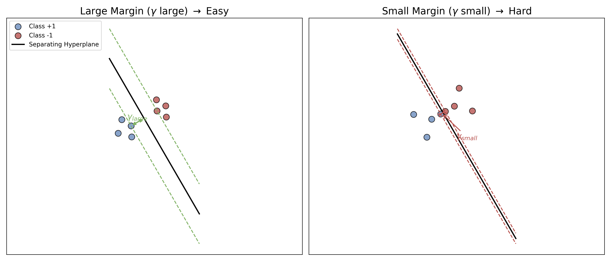
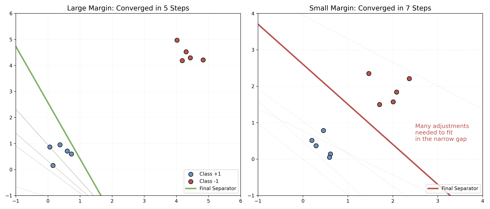
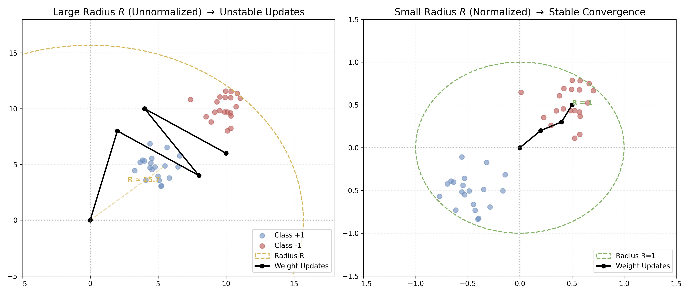

# 附录 A.2 感知机收敛性定理 (Perceptron Convergence Theorem)

本附录为 **[Chapter 1.2](../chapter_01/1.2_perceptron_and_limits.md)** 中提到的感知机学习算法 (PLA) 的收敛性提供严格的数学证明。

这一著名的证明由 **Novikoff (1962)** 提出。它从数学上保证了：只要数据是线性可分的，感知机算法就一定能在有限步内停下来，找到一个完美的分类超平面。

---

## A.2.1 定理前置假设 (Assumptions)

在开始证明之前，我们需要对问题进行严格的数学定义。

### 1. 线性可分性 (Linear Separability)
假设训练数据集 $D = \{(\mathbf{x}_1, y_1), (\mathbf{x}_2, y_2), ..., (\mathbf{x}_N, y_N)\}$ 是线性可分的。
这意味着存在一个理想的权重向量 $\mathbf{w}^*$（为简化推导，我们将偏置 $b$ 并入权重向量 $\mathbf{w}$，将 $1$ 并入输入向量 $\mathbf{x}$），使得对所有的样本 $i=1...N$：

$$ y_i (\mathbf{w}^{*T} \mathbf{x}_i) > 0 $$

为了方便后续计算，我们可以缩放 $\mathbf{w}^*$ 使得其模长 $\|\mathbf{w}^*\| = 1$，且满足：

$$ y_i (\mathbf{w}^{*T} \mathbf{x}_i) \ge \gamma $$

其中 $\gamma > 0$ 被称为 **几何间隔 (Geometric Margin)**。$\gamma$ 代表了超平面与最近的数据点之间的距离，它衡量了分类的“难易程度”（$\gamma$ 越大，缝隙越宽，越好分）。

### 2. 数据有界性 (Bounded Data)
假设所有输入向量的模长是有界的，即存在一个常数 $R$，使得对所有的样本 $i$：

$$ \|\mathbf{x}_i\| \le R $$

---

## A.2.2 Novikoff 定理 (Novikoff's Theorem)

**定理内容**：
对于线性可分的数据集，感知机学习算法 (PLA) 在从零向量 $\mathbf{w}_0 = \mathbf{0}$ 开始训练时，发生误分类（即权重更新）的总次数 $k$ 满足以下上界：

Conclusion
$$ k \le \left( \frac{R}{\gamma} \right)^2 $$

这意味算法**必然收敛**。更新次数 $k$ 取决于数据范围 $R$ 和分类间隔 $\gamma$，而与样本数量 $N$ 无直接关系。

---

## A.2.3 证明过程 (Proof)

我们通过分析权重向量 $\mathbf{w}_k$ 的两个性质来完成证明。假设第 $k$ 次误分类发生由于样本 $(\mathbf{x}, y)$，我们有更新规则（设学习率 $\eta=1$）：

$$ \mathbf{w}_{k} = \mathbf{w}_{k-1} + y\mathbf{x} $$

### 步骤 1: 寻找 $\mathbf{w}_k$ 与理想向量 $\mathbf{w}^*$ 内积的下界

我们考察 $\mathbf{w}_k$ 在理想方向 $\mathbf{w}^*$ 上的投影长度：

$$
\begin{aligned}
\mathbf{w}_k^T \mathbf{w}^* &= (\mathbf{w}_{k-1} + y\mathbf{x})^T \mathbf{w}^* \\
&= \mathbf{w}_{k-1}^T \mathbf{w}^* + y (\mathbf{x}^T \mathbf{w}^*)
\end{aligned}
$$

根据假设 $y (\mathbf{x}^T \mathbf{w}^*) \ge \gamma$，所以：

$$ \mathbf{w}_k^T \mathbf{w}^* \ge \mathbf{w}_{k-1}^T \mathbf{w}^* + \gamma $$

这是一个递推公式。由于初始权重 $\mathbf{w}_0 = \mathbf{0}$，经过 $k$ 次更新后：

Eq. 1
$$ \mathbf{w}_k^T \mathbf{w}^* \ge k \gamma $$

这说明：随着更新次数增加，$\mathbf{w}_k$ 在理想方向上的分量**至少以线性速度增长**。

### 步骤 2: 寻找 $\mathbf{w}_k$ 模长平方的上界

我们考察 $\mathbf{w}_k$ 自身长度的增长情况：

$$
\begin{aligned}
\|\mathbf{w}_k\|^2 &= \|\mathbf{w}_{k-1} + y\mathbf{x}\|^2 \\
&= \|\mathbf{w}_{k-1}\|^2 + \|y\mathbf{x}\|^2 + 2y(\mathbf{w}_{k-1}^T \mathbf{x})
\end{aligned}
$$

这里有两个关键点：
1.  由于是误分类样本，根据定义，预测结果与真实标签相反，即 $y(\mathbf{w}_{k-1}^T \mathbf{x}) \le 0$。因此 $2y(\mathbf{w}_{k-1}^T \mathbf{x}) \le 0$。
2.  $\|y\mathbf{x}\|^2 = y^2 \|\mathbf{x}\|^2 = \|\mathbf{x}\|^2 \le R^2$（因为 $y \in \{+1, -1\}$）。

代入不等式：

$$ \|\mathbf{w}_k\|^2 \le \|\mathbf{w}_{k-1}\|^2 + R^2 $$

同样是一个递推公式。从 $\mathbf{w}_0 = \mathbf{0}$ 开始，经过 $k$ 次更新：

Eq. 2
$$ \|\mathbf{w}_k\|^2 \le k R^2 $$

这说明：$\mathbf{w}_k$ 的长度增长**最多是线性的**，受到误差修正机制的限制。

### 步骤 3: 结合两式得出结论

现在我们利用柯西-施瓦茨不等式 (Cauchy-Schwarz Inequality)：

$$ (\mathbf{w}_k^T \mathbf{w}^*)^2 \le \|\mathbf{w}_k\|^2 \|\mathbf{w}^*\|^2 $$

因为我们设定了 $\|\mathbf{w}^*\| = 1$，所以：

$$ (\mathbf{w}_k^T \mathbf{w}^*)^2 \le \|\mathbf{w}_k\|^2 $$

将之前的 **Eq. 1** 和 **Eq. 2** 代入：

$$ (k \gamma)^2 \le \|\mathbf{w}_k\|^2 \le k R^2 $$

$$ k^2 \gamma^2 \le k R^2 $$

两边消去 $k$（假设 $k>0$）：

$$ k \gamma^2 \le R^2 $$

$$ k \le \frac{R^2}{\gamma^2} = \left( \frac{R}{\gamma} \right)^2 $$

**证毕 (Q.E.D.)**

---

## A.2.4 物理意义与洞察

这个不等式 $k \le (R/\gamma)^2$ 告诉了我们要想让模型学得快（$k$ 小），需要满足两个条件：

1.  **间隔 $\gamma$ 要大**：如果数据分得越开，两类之间有一条宽宽的大河，模型就能很容易找到分界线，很快收敛。如果两类数据挤在一起（$\gamma$ 很小），模型就要反复微调，收敛很慢。

2.  **半径 $R$ 要小**：如果数据分布非常散乱（$R$ 很大），梯度的方差可能很大，导致更新震荡。这也解释了为什么在深度学习中，我们通常要进行 **数据归一化 (Data Normalization)** 或 **标准化 (Standardization)**，将数据限制在一个较小的半径内，有助于加速收敛。

