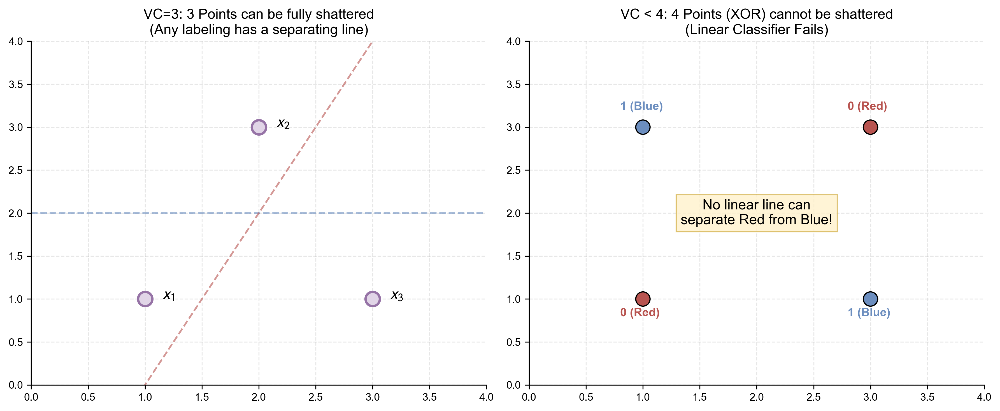

# 附录 A.3 统计学习理论 (Statistical Learning Theory)
## Appendix A.3 Statistical Learning Theory

本附录将为 1.4 节中的机器学习核心概念提供严谨的数学推导，重点涵盖偏差-方差分解的完整证明以及 VC 维理论简介。

### A.3.1 偏差-方差分解 (Bias-Variance Decomposition) 的完整推导

我们在正文中提到了泛化误差可以分解为偏差、方差和噪音。这里给出严格的推导。

#### 1. 问题设定
假设真实数据生成模型为 $y = f(\mathbf{x}) + \epsilon$，其中噪音 $\epsilon$ 满足 $\mathbb{E}[\epsilon] = 0, \text{Var}(\epsilon) = \sigma^2$。
我们用数据集 $\mathcal{D}$ 训练了一个模型 $\hat{f}(\mathbf{x}; \mathcal{D})$。
我们需要计算在测试点 $\mathbf{x}$ 处的期望均方误差（Expected MSE），期望是针对所有可能的训练集 $\mathcal{D}$ 而言的。

$$ \text{Error}(\mathbf{x}) = \mathbb{E}_{\mathcal{D}} \left[ (y - \hat{f}(\mathbf{x}; \mathcal{D}))^2 \right] $$

#### 2. 推导步骤
为了简化符号，简写 $\hat{f}(\mathbf{x}; \mathcal{D})$ 为 $\hat{f}$。
利用 $y = f + \epsilon$，展开平方项：

Math
$$
\begin{aligned}
\text{Error}(\mathbf{x}) &= \mathbb{E}_{\mathcal{D}} \left[ (f + \epsilon - \hat{f})^2 \right] \\
&= \mathbb{E}_{\mathcal{D}} \left[ (f - \hat{f})^2 + \epsilon^2 + 2\epsilon(f - \hat{f}) \right]
\end{aligned}
$$

由于 $\epsilon$ 与 $\mathcal{D}$ 独立且 $\mathbb{E}[\epsilon]=0$，交叉项期望为 0：
$$ \mathbb{E}_{\mathcal{D}}[2\epsilon(f - \hat{f})] = 2\mathbb{E}[\epsilon] \mathbb{E}_{\mathcal{D}}[f - \hat{f}] = 0 $$
且 $\mathbb{E}[\epsilon^2] = \sigma^2$。

现在关注主要项 $\mathbb{E}_{\mathcal{D}} \left[ (f - \hat{f})^2 \right]$。
这是一个关于随机变量 $\hat{f}$ 的二阶矩。我们利用恒等式 $\mathbb{E}[X^2] = (\mathbb{E}[X])^2 + \text{Var}(X)$ 的变体。
在此，我们在公式中人为引入 $\mathbb{E}_{\mathcal{D}}[\hat{f}]$（记为 $\bar{f}$，即模型的平均预测）：

$$
\begin{aligned}
\mathbb{E}_{\mathcal{D}} \left[ (f - \hat{f})^2 \right] &= \mathbb{E}_{\mathcal{D}} \left[ (f - \bar{f} + \bar{f} - \hat{f})^2 \right] \\
&= \mathbb{E}_{\mathcal{D}} \left[ (f - \bar{f})^2 + (\bar{f} - \hat{f})^2 + 2(f - \bar{f})(\bar{f} - \hat{f}) \right]
\end{aligned}
$$

*   第一项 $(f - \bar{f})^2$ 是常数（相对于 $\mathcal{D}$），即 **偏差平方 ($\text{Bias}^2$)**。
*   第二项 $\mathbb{E}_{\mathcal{D}}[(\bar{f} - \hat{f})^2]$ 正是 $\hat{f}$ 的方差，即 **方差 (Variance)**。
*   第三项交叉项：$2(f - \bar{f}) \mathbb{E}_{\mathcal{D}}[\bar{f} - \hat{f}] = 2(f - \bar{f})(\bar{f} - \bar{f}) = 0$。

#### 3. 最终结果
将所有项合并：
$$ \text{Error}(\mathbf{x}) = \underbrace{(f(\mathbf{x}) - \mathbb{E}[\hat{f}(\mathbf{x})])^2}_{\text{Bias}^2} + \underbrace{\mathbb{E}[(\hat{f}(\mathbf{x}) - \mathbb{E}[\hat{f}(\mathbf{x})])^2]}_{\text{Variance}} + \underbrace{\sigma^2}_{\text{Noise}} $$

这一数学分解清晰地揭示了**偏差-方差权衡 (Bias-Variance Tradeoff)**：试图降低偏差（通过增加模型复杂度）往往会导致方差增加。下图直观展示了这三者随模型复杂度变化的博弈关系：

---

### A.3.2 VC 维与泛化界 (Statistical Learning Theory: VC Dimension & Generalization Bounds)

为什么在训练集上表现好 ($E_{in} \approx 0$)，就意味着在测试集上也表现好 ($E_{out} \approx 0$)？这并非理所当然。统计学习理论（Statistical Learning Theory, SLT）通过引入 **VC 维** 回答了这个问题。

#### 1. 学习的可行性：从霍夫丁不等式开始

对于一个 **固定** 的假设模型 $h$，**霍夫丁不等式 (Hoeffding's Inequality)** 告诉我们，训练误差 $E_{in}(h)$ 和泛化误差 $E_{out}(h)$ 之间的差距大于 $\epsilon$ 的概率是非常小的：

$$ P(|E_{in}(h) - E_{out}(h)| > \epsilon) \le 2 \exp(-2N\epsilon^2) $$

这意味着对于单个模型，只要样本量 $N$ 足够大，$E_{in}$ 就是 $E_{out}$ 的良好估计。

但是，机器学习是 **从假设空间 $\mathcal{H}$ 中挑选** 一个最好的 $h$。如果 $\mathcal{H}$ 包含无数个模型，我们如何保证我们选出来的那个 $g$ 不是恰好在训练集上“撞大运”表现好（Bad Sample），而在测试集上表现差的呢？

#### 2. 增长函数与打散 (Growth Function & Shattering)

为了解决无限个假设的问题，Vapnik 和 Chervonenkis 提出了一个天才的想法：**虽然参数是连续无穷的，但模型对 $N$ 个数据点的分类结果（Labeling）是有限的。**

对于二分类问题，N 个数据点最多有 $2^N$ 种标签组合。
定义 **增长函数 (Growth Function)** $m_{\mathcal{H}}(N)$：假设空间 $\mathcal{H}$ 在 $N$ 个数据点上能产生的 **最大不同二分（分类组合）数量**。

*   **打散 (Shattering)**：如果 $\mathcal{H}$ 能对 $N$ 个点的 **所有** $2^N$ 种可能性都进行分类，我们称 $\mathcal{H}$ 能 **打散** 这 $N$ 个点。此时 $m_{\mathcal{H}}(N) = 2^N$。

#### 3. VC 维 (VC Dimension) 的定义

**VC 维 ($d_{VC}$)** 是衡量假设空间 $\mathcal{H}$ 容量（复杂度）的核心指标。

> **定义**：$d_{VC}$ 是满足“增长函数 $m_{\mathcal{H}}(N) = 2^N$”的 **最大** $N$。
> 换句话说，它是模型能够完全打散的 **最大样本数量**。

*   如果 $N \le d_{VC}$，模型有可能打散这 $N$ 个点。
*   如果 $N > d_{VC}$，模型 **一定** 无法打散这 $N$ 个点（即总存在某种标签组合，模型学不会）。

**经典案例：2D 感知机 (Linear Classifier)**
*   **N=3**：我们可以任意放置 3 个点（非共线），无论怎么把它们标记为红/蓝，都能画一条直线把它们分开。所以 2D 感知机能打散 3 个点。
*   **N=4**：对于 XOR 形状的 4 个点（对角线同色），无法用一条直线分开。所以 2D 感知机不能打散 4 个点。
*   **结论**：2D 感知机的 $d_{VC} = 3$。推而广之，$d$ 维感知机的 $d_{VC} = d+1$。

#### 4. 关键引理：Sauer's Lemma

我们已经知道，当 $N \le d_{VC}$ 时，$m_{\mathcal{H}}(N) = 2^N$。那么当 $N > d_{VC}$ 时，增长函数会发生什么变化呢？

**Sauer's Lemma** 给出了增长函数的上界：
如果 $d_{VC}$ 有限，则对于任意 $N$：
$$ m_{\mathcal{H}}(N) \le \sum_{i=0}^{d_{VC}} \binom{N}{i} $$

*   **多项式上界**：当 $N > d_{VC}$ 时，我们可以利用不等式 $\binom{N}{i} \le N^i$，得到一个更宽松但直观的界：
    $$ m_{\mathcal{H}}(N) \le (N+1)^{d_{VC}} $$

这意味着：
1.  **Break Point**：一旦 $N$ 超过了 $d_{VC}$，增长函数 $m_{\mathcal{H}}(N)$ 就从 **指数级增长** ($2^N$) 突然“折断”为 **多项式级增长** ($N^{d_{VC}}$)。
2.  **意义**：这一性质至关重要。因为在霍夫丁不等式中，右边是 $M \cdot \exp(-N)$。如果 $M$ 是指数级增长的 ($2^N$)，它会抵消掉 $\exp(-N)$ 的衰减，导致误差界无法收敛。但如果是多项式级增长，$\exp(-N)$ 最终会战胜 $N^{d_{VC}}$，保证概率收敛到 0。

#### 5. 泛化误差界 (Generalization Bound) 的完整推导流程

有了 Sauer's Lemma，我们可以完成最后一步证明。

**Step 1: 幽灵样本技巧 (Ghost Sample Trick)**
为了处理无限的 $E_{out}$，我们引入第二组大小为 $N$ 的“幽灵数据集” $\mathcal{D}'$。我们证明：如果 $E_{in}$ 和 $E_{out}$ 差别很大，那么 $E_{in}$ 和 $E'_{in}$ (在幽灵数据上的误差) 差别很大的概率也是有界的。
$$ P(\sup |E_{in} - E_{out}| > \epsilon) \le 2 P(\sup |E_{in} - E'_{in}| > \epsilon/2) $$

**Step 2: 有限的二分法 (Effective Hypotheses)**
现在我们只看 $2N$ 个数据点（$\mathcal{D} + \mathcal{D}'$）。在这 $2N$ 个点上，模型最多只能产生 $m_{\mathcal{H}}(2N)$ 种不同的分类结果。
我们将“无限假设空间”的问题转化为了“有限二分空间”的问题。

**Step 3: 联合界 (Union Bound) 与 Hoeffding**
应用联合界和无放回抽样的 Hoeffding 不等式：
$$ P(\dots) \le 2 \cdot m_{\mathcal{H}}(2N) \cdot 2 \exp\left( -2 \left(\frac{\epsilon}{2}\right)^2 N \right) $$
整理得：
$$ P(\sup |E_{in} - E_{out}| > \epsilon) \le 4 (2N)^{d_{VC}} \exp\left( -\frac{1}{8} N \epsilon^2 \right) $$

**Step 4: 求解 $\epsilon$**
令上述概率的上界为 $\delta$：
$$ \delta = 4 (2N)^{d_{VC}} \exp\left( -\frac{1}{8} N \epsilon^2 \right) $$
反解出 $\epsilon$，即得到我们熟悉的 **VC 泛化界**：

Math
$$ E_{out}(h) \le E_{in}(h) + \underbrace{\sqrt{\frac{8}{N} \left( d_{VC} \ln (2N) + \ln \frac{4}{\delta} \right)}}_{\text{Complexity Penalty } \Omega} $$
*(注：为简化展示，此处使用了 $m_{\mathcal{H}}(N) \approx N^{d_{VC}}$ 的近似形式，严谨形式略有差异但不影响结论)*

**核心结论**：
机器学习可行的充要条件是 **VC 维有限**。
只要 $d_{VC}$ 是有限的，随着数据量 $N \to \infty$，多项式增长被指数衰减压制，罚项 $\Omega \to 0$，我们就能保证 $E_{out} \approx E_{in}$。
