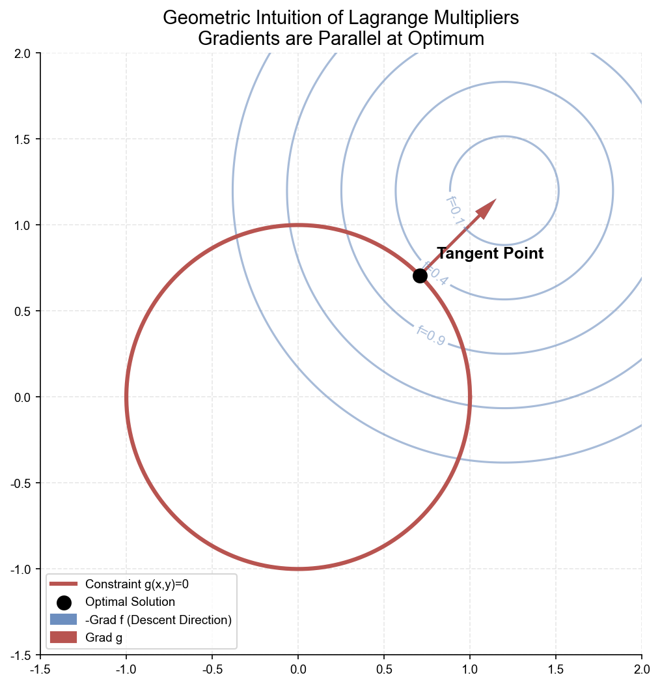
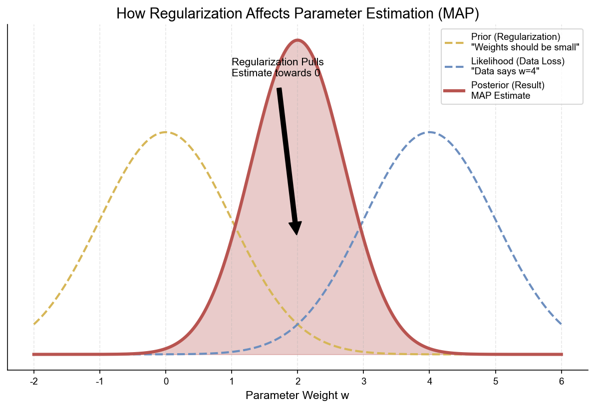
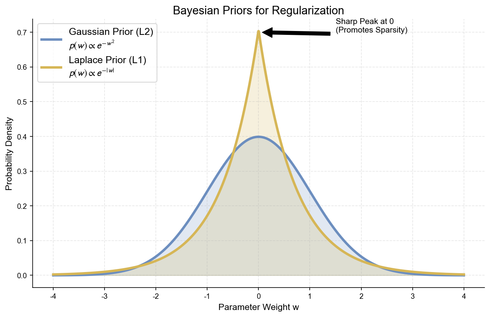

# 附录 A.4 正则化与 Dropout (Regularization & Dropout)

## A.4.1 拉格朗日乘数法 (Lagrange Multiplier) 复习

拉格朗日乘数法是解决 **带约束优化问题** 的通用数学工具。它是理解正则化“约束优化”视角的数学基础。

### 1. 形式化定义 (Formal Definition)

**原始问题 (Primal Problem)**：
假设我们需要最小化一个多元函数 $f(\mathbf{x})$，同时受到一个等式约束 $g(\mathbf{x}) = 0$ 的限制：
$$
\begin{aligned}
\min_{\mathbf{x}} \quad & f(\mathbf{x}) \\
\text{s.t.} \quad & g(\mathbf{x}) = 0
\end{aligned}
$$

**拉格朗日函数 (The Lagrangian)**：
为了将上述 **有约束** 问题转化为 **无约束** 问题，我们引入一个新的标量变量 $\lambda$（称为拉格朗日乘子），构造如下函数：
$$ \mathcal{L}(\mathbf{x}, \lambda) = f(\mathbf{x}) + \lambda g(\mathbf{x}) $$

**极值的必要条件**：
如果 $\mathbf{x}^*$ 是原始问题的局部最优解，那么它必须是拉格朗日函数 $\mathcal{L}$ 的 **驻点 (Stationary Point)**。这意味着 $\mathcal{L}$ 对所有变量的偏导数都必须为 0：

1.  **对 $\mathbf{x}$ 求偏导**：
    $$ \nabla_{\mathbf{x}} \mathcal{L} = \nabla f(\mathbf{x}) + \lambda \nabla g(\mathbf{x}) = 0 \implies \nabla f(\mathbf{x}) = -\lambda \nabla g(\mathbf{x}) $$
    *(这说明在最优解处，目标函数的梯度与约束函数的梯度平行)*

2.  **对 $\lambda$ 求偏导**：
    $$ \nabla_{\lambda} \mathcal{L} = g(\mathbf{x}) = 0 $$
    *(这确保了约束条件被满足)*

**必要条件的推导 (Derivation)**
为什么最优解必须满足上述条件？我们可以通过 **正交分解** 来证明。

1.  **切向量与梯度垂直**：
    假设我们在约束曲面 $g(\mathbf{x})=0$ 上移动，路径为 $\mathbf{x}(t)$，且 $\mathbf{x}(0)=\mathbf{x}^*$。
    由于始终在约束面上，$g(\mathbf{x}(t)) \equiv 0$。对 $t$ 求导：
    $$ \frac{d}{dt} g(\mathbf{x}(t)) = \nabla g(\mathbf{x}) \cdot \mathbf{x}'(t) = 0 $$
    这说明：**约束函数的梯度 $\nabla g$ 垂直于约束曲面上任意切向量 $\mathbf{v} = \mathbf{x}'(0)$**。

2.  **目标函数的极值性**：
    如果 $\mathbf{x}^*$ 是 $f(\mathbf{x})$ 的局部极小值点，那么沿着约束曲面的任何方向移动，目标函数的值都不应该减小（一阶变化率为0）。
    $$ \frac{d}{dt} f(\mathbf{x}(t)) \bigg|_{t=0} = \nabla f(\mathbf{x}^*) \cdot \mathbf{x}'(0) = \nabla f(\mathbf{x}^*) \cdot \mathbf{v} = 0 $$
    这说明：**目标函数的梯度 $\nabla f$ 也垂直于约束曲面上任意切向量 $\mathbf{v}$**。

3.  **梯度共线**：
    既然 $\nabla f$ 和 $\nabla g$ 都垂直于同一个切平面（即垂直于所有的 $\mathbf{v}$），在几何上它们必须 **共线**（假设 $\nabla g \neq 0$）。
    因此，一定存在一个标量 $\lambda$，使得：
    $$ \nabla f(\mathbf{x}^*) = -\lambda \nabla g(\mathbf{x}^*) $$
    移项即得 $\nabla f + \lambda \nabla g = 0$，这正是 $\nabla_{\mathbf{x}} \mathcal{L} = 0$。

### 2. 几何直觉 (Geometric Intuition)

理解了公式后，我们再看图：

*   **登山的比喻**：
    想象我们在爬山（寻找 $f(\mathbf{x})$ 的最低点），但被限制只能在一条特定的小路上行走（约束 $g(\mathbf{x})=0$，即上图中的红线）。
*   **相交 (Intersecting) vs 相切 (Tangent)**：
    *   如果我们走在红线上的某点，发现 $f(\mathbf{x})$ 的等高线（蓝圈）与红线 **相交** (Cross)，说明红线穿过了等高线，我们一定可以顺着红线往“圈内”走，找到更低的点。
    *   只有当 $f(\mathbf{x})$ 的等高线与红线 **相切** (Touch) 时，我们才没法再通过沿红线移动来降低 $f$ 的值了。这时我们就找到了极值点。
*   **梯度的关系**：
    “相切”在数学上就意味着两条曲线在接触点有相同的法线方向。函数的法线方向就是梯度方向。因此，**最优解处，两个梯度方向平行**。

### 3. 对应到机器学习正则化
正则化本质上也是一个约束优化问题：
*   **原问题**：最小化 Loss，约束是权重范数 $\|\mathbf{w}\| \le C$（限制模型复杂度）。
*   **拉格朗日函数**：$\mathcal{L} = \text{Loss} + \lambda (\|\mathbf{w}\| - C)$。
*   由于 $C$ 是常数，优化时可以忽略，最终形式变为：
    $$ J(\mathbf{w}) = \text{Loss} + \lambda \|\mathbf{w}\| $$
    这就解释了为什么我们可以直接把正则化项加到 Loss 后面进行训练。$\lambda$ 控制了约束的强弱：$\lambda$ 越大，相当于要求 $C$ 越小（模型越简单）。

---

## A.4.2 正则化的贝叶斯视角 (Bayesian View of Regularization)

除了上述的“约束优化”视角，正则化还可以从概率统计的视角——即贝叶斯推断中 **先验知识 (Prior Knowledge)** 的自然体现——来理解。

### 1. 频率派 vs 贝叶斯派 (Frequentist vs Bayesian)
*   **频率派**认为参数 $\mathbf{w}$ 是客观存在的固定常数，只是我们不知道。我们的目标是通过数据找出这个最优的 $\mathbf{w}$ (即 **MLE**)。
*   **贝叶斯派**认为参数 $\mathbf{w}$ 本身是一个 **随机变量**，服从某个概率分布。我们对 $\mathbf{w}$ 有一个初始的信仰（先验分布），然后通过观测数据来更新这个信仰，得到最终的分布（后验分布）。

### 2. MAP (极大后验估计) 推导
贝叶斯公式的核心是：
$$ \text{Posterior} \propto \text{Likelihood} \times \text{Prior} $$
$$ P(\mathbf{w}|\mathcal{D}) \propto P(\mathcal{D}|\mathbf{w}) P(\mathbf{w}) $$

我们的目标是寻找最可能的 $\mathbf{w}$，即最大化后验概率（MAP）：
$$
\begin{aligned}
\mathbf{w}_{MAP} &= \arg\max_{\mathbf{w}} \log P(\mathbf{w}|\mathcal{D}) \\
&= \arg\max_{\mathbf{w}} \left( \underbrace{\log P(\mathcal{D}|\mathbf{w})}_{\text{Log-Likelihood}} + \underbrace{\log P(\mathbf{w})}_{\text{Log-Prior}} \right) \\
&= \arg\min_{\mathbf{w}} \left( \underbrace{-\log P(\mathcal{D}|\mathbf{w})}_{\text{Loss Function}} \underbrace{- \log P(\mathbf{w})}_{\text{Regularization}} \right)
\end{aligned}
$$

*   **直观解释**：
    *   **Likelihood** 代表“数据说了算”：数据希望参数变成什么样（通常为了拟合数据，参数会变大、变复杂）。
    *   **Prior** 代表“先验信仰”：在没看数据前，我们认为参数应该是什么样（通常我们认为世界是简单的，参数应该接近 0）。
    *   **Posterior** 是两者的博弈与平衡。

上图展示了一个一维参数 $w$ 的更新过程：
*   **Likelihood (蓝色虚线)**：数据告诉我们要把 $w$ 设在 4 附近。
*   **Prior (黄色虚线)**：我们预设 $w$ 应该在 0 附近。
*   **Posterior (红色实线)**：最终的估计值在 0 和 4 之间。正则化就像一根橡皮筋，把参数从数据拟合的“过拟合点”往回拉，拉向 0 点。

### 3. 为什么 L2 对应高斯，L1 对应拉普拉斯？

不同的正则化项对应了不同的先验假设。

**Case 1: L2 正则化 $\iff$ 高斯先验 (Gaussian Prior)**
假设我们认为权重 $\mathbf{w}$ 服从正态分布 $\mathcal{N}(0, \tau^2)$：
$$ P(\mathbf{w}) \propto \exp\left( -\frac{\|\mathbf{w}\|^2}{2\tau^2} \right) $$
取负对数后：
$$ -\log P(\mathbf{w}) \propto \|\mathbf{w}\|^2 $$
这正是 **L2 正则化**。高斯分布在 0 附近是平滑的凸起，它希望权重集中在 0 附近，但对于稍微偏离 0 的小权重也能容忍。

**Case 2: L1 正则化 $\iff$ 拉普拉斯先验 (Laplace Prior)**
假设我们认为权重 $\mathbf{w}$ 服从拉普拉斯分布 $\text{Laplace}(0, b)$：
$$ P(\mathbf{w}) \propto \exp\left( -\frac{\|\mathbf{w}\|}{b} \right) $$
取负对数后：
$$ -\log P(\mathbf{w}) \propto \|\mathbf{w}\|_1 $$
这正是 **L1 正则化**。

**由图可见区别**：
*   **高斯分布 (蓝色)**：在 $x=0$ 处是圆滑的。它虽然通过概率密度“压制”大权重，但不会强制权重为 0。
*   **拉普拉斯分布 (黄色)**：在 $x=0$ 处有一个 **尖峰 (Sharp Peak)**。这使得在 $w=0$ 这个点上的概率密度极高。在优化过程中，这股强大的“吸力”极其容易把权重直接吸死在 0 上，从而产生 **稀疏解**。

---

## A.4.3 优化视角：权重衰减与梯度更新 (Weight Decay in Optimization)

在正文 2.1.2 节中，我们提到了工程上常用的 **Weight Decay**。本节从微积分的角度严格推导它与 L2 正则化的等价性。

### 1. L2 正则化 $\Leftrightarrow$ 权重比例衰减 (Proportional Decay)
假设目标函数包含 L2 正则项：
$$ J(w) = J_{orig}(w) + \frac{1}{2}\lambda \|w\|^2 $$

**梯度计算**：
$$ \nabla J(w) = \nabla J_{orig}(w) + \lambda w $$

**SGD 更新规则**：
我们将梯度代入 SGD 更新公式：
$$
\begin{aligned}
w_{t+1} &= w_t - \eta \nabla J(w) \\
        &= w_t - \eta (\nabla J_{orig}(w) + \lambda w_t) \\
        &= w_t - \eta \nabla J_{orig}(w) - \eta \lambda w_t \\
        &= \underbrace{(1 - \eta \lambda)}_{\text{Decay Factor}} w_t - \eta \nabla J_{orig}(w)
\end{aligned}
$$
**结论**：L2 正则化在 SGD 优化中，等价于在每次更新梯度前，先将权重 **按比例缩小**（例如乘以 0.99）。这就是 **Weight Decay** 名称的由来。

### 2. L1 正则化 $\Leftrightarrow$ 符号衰减 (Sign Decay)
假设目标函数包含 L1 正则项：
$$ J(w) = J_{orig}(w) + \lambda \|w\|_1 $$

**梯度计算**：
由于 $|w|$ 的导数是符号函数 $\text{sign}(w)$（在 0 处不可导，通常取次梯度）：
$$ \nabla J(w) = \nabla J_{orig}(w) + \lambda \text{sign}(w) $$

**SGD 更新规则**：
$$
\begin{aligned}
w_{t+1} &= w_t - \eta (\nabla J_{orig}(w) + \lambda \text{sign}(w)) \\
        &= w_t - \eta \nabla J_{orig}(w) - \eta \lambda \text{sign}(w)
\end{aligned}
$$
**直观对比**：
*   **L2 (Weight Decay)**：$w \leftarrow w - \alpha w$。减去的是 $w$ 的一部分。$w$ 越大，减得越多；$w$ 越小，减得越少。这导致权重会无限接近 0，但很难真正变成 0。
*   **L1 (Sign Decay)**：$w \leftarrow w - C$。减去的是一个常数。无论 $w$ 多大，都减固定的量。这导致权重会以恒定速度归零，并在到达 0 时因截断而真正变成 0（稀疏解）。

---

## A.4.4 Dropout 的数学机制详解 (Mathematics of Dropout)

本节详细拆解 Dropout 在前向传播、反向传播及测试阶段的数学细节，帮助理解“掩码”与“缩放”的本质。

### 1. 伯努利掩码 (Bernoulli Mask)
在 Dropout 中，核心操作是生成一个 **掩码向量 (Mask Vector)** $\mathbf{r} \in \{0, 1\}^d$。这个向量的每一个元素 $r_j$ 都是独立从伯努利分布中采样的：
$$ r_j \sim \text{Bernoulli}(1-p) $$
这意味着：
*   $P(r_j=1) = 1-p$ （保留）
*   $P(r_j=0) = p$ （丢弃）

### 2. 训练阶段 (Training Phase)
假设某层神经元的原始输出向量为 $\mathbf{h} = [h_1, h_2, \dots, h_d]^T$。
应用 Dropout 后的输出 $\tilde{\mathbf{h}}$ 是 $\mathbf{h}$ 与 $\mathbf{r}$ 的 **Hadamard 积 (Element-wise Product)**，记作 $\odot$。

**操作公式**：
$$ \tilde{\mathbf{h}} = \mathbf{r} \odot \mathbf{h} $$

**数值示例**：
假设 $\mathbf{h} = [10, 20, 30, 40]$，丢弃率 $p=0.5$。
我们随机采样得到掩码 $\mathbf{r} = [1, 0, 1, 0]$。
则应用计算如下：
$$
\tilde{\mathbf{h}} =
\begin{bmatrix} 1 \\ 0 \\ 1 \\ 0 \end{bmatrix} \odot
\begin{bmatrix} 10 \\ 20 \\ 30 \\ 40 \end{bmatrix} =
\begin{bmatrix} 1 \times 10 \\ 0 \times 20 \\ 1 \times 30 \\ 0 \times 40 \end{bmatrix} =
\begin{bmatrix} 10 \\ 0 \\ 30 \\ 0 \end{bmatrix}
$$
可以看到，第 2 和第 4 个神经元的输出被强制置为 0，相当于它们在本次迭代中“消失”了。

### 3. 缩放的必要性 (Scaling)
为什么测试时需要缩放？让我们看期望值。
在训练时，$\tilde{h}_i$ 的期望是：
$$ \mathbb{E}[\tilde{h}_i] = \mathbb{E}[r_i \cdot h_i] = P(r_i=1) h_i + P(r_i=0) \cdot 0 = (1-p)h_i $$

这意味着，下一层神经元接收到的信号总强度（期望值）只有原来的 $(1-p)$ 倍。
如果测试时我们全开（所有神经元都工作），信号强度会恢复为 $1$ 倍（$h_i$）。
这种 **训练/测试时的信号强度不匹配** 会导致网络预测失效。

**解决方案：Inverted Dropout**
为了避免在测试时修改代码，现代框架（如 PyTorch）通常采用 **Inverted Dropout**：**在训练时就提前把信号放大**。

*   **训练时**：$\tilde{\mathbf{h}} = \frac{1}{1-p} (\mathbf{r} \odot \mathbf{h})$
*   **测试时**：直接使用 $\mathbf{h}$，**不做任何改动**。

**验证期望**：
此时训练时的期望变为：
$$ \mathbb{E}[\tilde{h}_i] = \mathbb{E}\left[ \frac{r_i}{1-p} h_i \right] = \frac{1-p}{1-p} h_i = h_i $$
这样，训练时的期望输出就和测试时完全一致了！

### 4. 反向传播 (Backpropagation)
Dropout 不仅影响前向传播，也影响反向传播。（关于反向传播的详细数学原理，请参考 **[附录 A.6 反向传播 (Backpropagation)](appendix/a.6_backpropagation.md)**）。
设 Loss 对输出 $\tilde{\mathbf{h}}$ 的梯度为 $\frac{\partial L}{\partial \tilde{\mathbf{h}}}$。
根据链式法则，Loss 对原始 $\mathbf{h}$ 的梯度为：

$$ \frac{\partial L}{\partial \mathbf{h}} = \frac{\partial L}{\partial \tilde{\mathbf{h}}} \odot \mathbf{r} $$

**直观含义**：
如果 $r_i=0$（神经元被 Drop），那么梯度乘以 0 也会变成 0。
这意味着：**被丢弃的神经元，既没有输出，也不会在反向传播中更新权重**。它们在这一轮迭代中是彻底“冻结”的。
