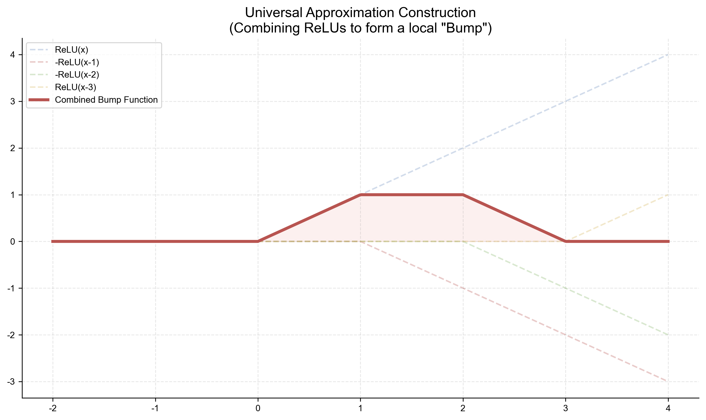

# 附录 A.5 通用近似定理 (Universal Approximation Theorem)
## Appendix A.5 Proof of Universal Approximation Theorem

本附录将提供通用近似定理（Universal Approximation Theorem, UAT）的数学证明概要。该定理是深度学习的理论基石，证明了神经网络具有拟合任意复杂函数的潜力。

### A.5.1 定理陈述 (Statement of the Theorem)

**Cybenko (1989)** 和 **Hornik (1991)** 给出的经典形式如下：

设 $\sigma(\cdot)$ 是一个非线性、连续且单调递增的激活函数（例如 Sigmoid 或 ReLU）。
对于任意紧致集合 (Compact Set) $K \subset \mathbb{R}^n$（例如一个闭区间 $[0,1]^n$）上的连续函数 $f: K \to \mathbb{R}$，以及任意误差 $\epsilon > 0$，都存在一个单隐藏层神经网络 $g(\mathbf{x})$，包含有限个隐藏单元 $N$，使得：

$$ \sup_{\mathbf{x} \in K} |f(\mathbf{x}) - g(\mathbf{x})| < \epsilon $$

其中神经网络形式为：
$$ g(\mathbf{x}) = \sum_{i=1}^{N} v_i \sigma(\mathbf{w}_i^T \mathbf{x} + b_i) $$

简单来说，**只要隐藏层神经元足够多，单层神经网络可以以任意精度逼近任何连续函数。**

---

### A.5.2 基于 Hahn-Banach 定理的证明思路 (Proof Outline)

这里我们采用一种基于泛函分析的证明思路（Cybenko 的原始证明思路），利用 **Hahn-Banach 定理** 和 **Riesz 表示定理**。

#### 1. 定义函数空间
记 $C(K)$ 为定义在紧致集合 $K$ 上的所有连续函数的集合，赋予上确界范数（Sup-Norm）：
$$ \|f\| = \sup_{\mathbf{x} \in K} |f(\mathbf{x})| $$

我们定义神经网络能够表示的函数子空间为 $S$：
$$ S = \text{span} \{ \sigma(\mathbf{w}^T \mathbf{x} + b) \mid \mathbf{w} \in \mathbb{R}^n, b \in \mathbb{R} \} $$
即所有可能的单层神经网络函数的线性组合。

我们需要证明：$S$ 在 $C(K)$ 中是**稠密 (Dense)** 的。也就是说，对于 $C(K)$ 中的任意 $f$，都在 $S$ 的闭包 $\bar{S}$ 中。

#### 2. 反证法 (Proof by Contradiction)
假设 $S$ 不是稠密的，即 $\bar{S} \neq C(K)$。
根据泛函分析中的推论，如果 $\bar{S} \neq C(K)$，那么一定存在一个非零的**有界线性泛函 (Bounded Linear Functional)** $L$，使得 $L$ 在子空间 $S$ 上的作用全为 0，但 $L$ 本身不为 0（即存在某个 $f$ 使 $L(f) \neq 0$）。
这利用了 Hahn-Banach 定理的一个推论。

根据 **Riesz 表示定理 (Riesz Representation Theorem)**，在紧致集 $K$ 上的连续函数空间 $C(K)$ 上的任意有界线性泛函 $L$，都可以表示为一个正则波莱尔测度 (Regular Borel Measure) $\mu$ 的积分：
$$ L(h) = \int_K h(\mathbf{x}) d\mu(\mathbf{x}) $$

因此，我们的假设等价于：存在一个非零测度 $\mu$，使得对于所有 $h \in S$，都有：
$$ \int_K \sigma(\mathbf{w}^T \mathbf{x} + b) d\mu(\mathbf{x}) = 0, \quad \forall \mathbf{w}, b $$

#### 3. 利用 Sigmoid 的判别性质 (Discriminatory Property)
Cybenko 证明了对于 Sigmoid 类的 Sigmoidal 函数（$x \to -\infty$ 时 $\sigma \to 0$，$x \to +\infty$ 时 $\sigma \to 1$），它是**判别性 (Discriminatory)** 的。

这意味着，如果对于所有 $\mathbf{w}, b$ 都有：
$$ \int_K \sigma(\mathbf{w}^T \mathbf{x} + b) d\mu(\mathbf{x}) = 0 $$
那么必然蕴含 $\mu = 0$。

这主要通过傅里叶变换或特定的积分变换来证明。直观上，通过调节 $\mathbf{w}$ 和 $b$，我们可以让 $\sigma(\mathbf{w}^T \mathbf{x} + b)$ 逼近任意的示性函数 (Indicator Function) 或阶跃函数。如果你能对所有的阶跃函数积分为 0，那么你对这个空间里的所有函数积分都必须为 0。

#### 4. 矛盾
如果你能证明 $\mu = 0$，这就与“存在非零泛函 $L$”矛盾了。
因此，假设不成立，$S$ 在 $C(K)$ 中是稠密的。证毕。

---

### A.5.3 直观构造法 (Constructive Proof using Bump Functions)

对于 ReLU 激活函数，我们可以给出更直观的构造性证明。

1.  **构造小凸起 (Bump Function)**
    利用两个 ReLU 函数可以构造一个“梯形”或“矩形”凸起。
    $$ g(x) = \text{ReLU}(x) - \text{ReLU}(x-a) - \text{ReLU}(x-b) + \text{ReLU}(x-c) $$
    这可以在一维上形成一个局部的凸起。在多维情况下，可以通过 $g(\mathbf{x}) = \sum g_i(x_i)$ 或其他组合方式构造。

2.  **黎曼积分逼近**
    任何连续函数都可以用一系列的小矩形（阶梯函数）来逼近（黎曼和）。
    既然神经网络可以构造出任意位置、任意高度、任意宽度的“小矩形”，那么它自然可以逼近任意连续函数。

*(注：该图在 Chapter 2.1 的可视化代码中需涵盖或单独生成)*

---

### A.5.4 局限性 (Limitations)

通用近似定理虽然保证了**存在性**，但没有告诉我们：
1.  **如何找到**这个网络（优化问题）。
2.  需要**多少**神经元（效率问题）。通常为了逼近复杂函数，单层网络需要的神经元数量是指数级增长的（Curse of Dimensionality）。这也是为什么我们需要**深度**（Deep Learning）的原因——深度网络可以用更少的参数更高效地表示复杂函数。
