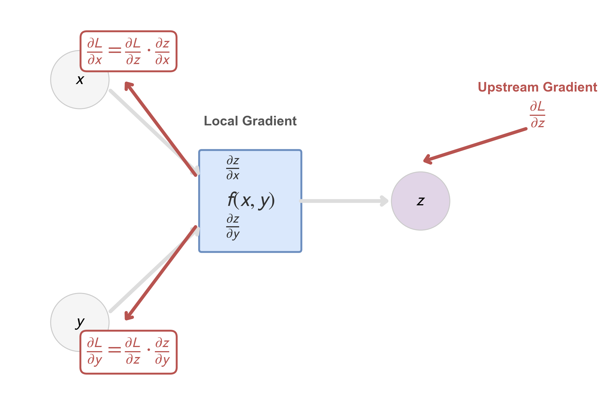
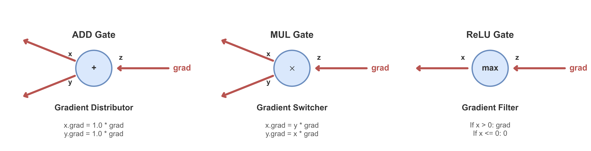

# 附录 A.6 反向传播 (Backpropagation) 的数学推导
## Appendix A.6 Mathematical Derivation of Backpropagation

反向传播（Backpropagation）是深度学习中计算梯度的核心算法。本附录将从“计算图”的局部视角出发，逐步深入到全连接层的完整矩阵推导，最后补充卷积层梯度的数学证明。

### A.6.1 核心心法：链式法则的局部视角 (The Local View)

反向传播的本质不是死记硬背复杂的公式，而是 **链式法则 (Chain Rule)** 在计算图上的递归应用。

#### 1. 局部梯度与上游梯度
想象计算图中的任何一个节点 $f$，它接收输入 $x, y$，输出 $z$。
在反向传播过程中，我们的最终目标是求 Loss $L$ 对输入 $x, y$ 的导数。

当我们在这个节点 $f$ 处进行计算时，我们只需要关注两件事：
1.  **上游梯度 (Upstream Gradient)**：$\frac{\partial L}{\partial z}$。这是从终点 $L$ 一路传回来的，告诉我们 $z$ 的变化会如何影响 $L$。对于当前节点来说，这是一个**已知量**。
2.  **局部梯度 (Local Gradient)**：$\frac{\partial z}{\partial x}$ 和 $\frac{\partial z}{\partial y}$。这是当前节点 $f$ 自身的导数性质（例如，如果 $z=x+y$，则局部梯度为 1；如果 $z=xy$，则局部梯度为 $y$）。

根据链式法则，**下游梯度 (Downstream Gradient)** 等于：
$$ \frac{\partial L}{\partial x} = \underbrace{\frac{\partial L}{\partial z}}_{\text{Upstream}} \cdot \underbrace{\frac{\partial z}{\partial x}}_{\text{Local}} $$

这意味着：**每个节点只负责计算自己的局部梯度，然后乘以上游传来的梯度，再甩给前面的节点。** 这种模块化的设计使得我们能够搭建任意复杂的网络。

#### 2. 常见门的梯度行为 (Gradient Flow in Gates)
通过上述视角，我们可以总结出常用运算节点的梯度行为（如上图右侧所示）：

*   **加法门 (Add Gate)**：$z = x + y$。局部梯度 $\frac{\partial z}{\partial x} = 1$。
    *   **行为**：**梯度分发器 (Distributor)**。它将上游梯度原封不动地复制给所有输入分支。
*   **乘法门 (Mul Gate)**：$z = x \cdot y$。局部梯度 $\frac{\partial z}{\partial x} = y$。
    *   **行为**：**梯度交换器 (Switcher)**。$x$ 的梯度会被缩放 $y$ 倍；$y$ 的梯度会被缩放 $x$ 倍。这也解释了为什么输入数据过大或过小会导致梯度爆炸或消失。
*   **ReLU 门 (ReLU Gate)**：$z = \max(0, x)$。
    *   **行为**：**梯度开关 (Filter)**。如果前向传播时 $x > 0$，梯度原样通过；如果 $x \le 0$，梯度被“杀死”（置 0）。

---

### A.6.2 全连接层的矩阵推导 (Matrix Derivation)

掌握了局部视角后，我们现在来推导全连接层（Linear + Activation）的完整矩阵公式。

#### 1. 符号定义
*   **输入**：$\mathbf{x}$ (维度 $D_{in} \times 1$)
*   **权重**：$\mathbf{W}$ (维度 $D_{out} \times D_{in}$)
*   **偏置**：$\mathbf{b}$ (维度 $D_{out} \times 1$)
*   **线性输出**：$\mathbf{z} = \mathbf{W}\mathbf{x} + \mathbf{b}$ (维度 $D_{out} \times 1$)
*   **激活输出**：$\mathbf{a} = \sigma(\mathbf{z})$ (维度 $D_{out} \times 1$)
*   **最终标量损失**：$L$

#### 2. 目标
我们需要计算 $L$ 对 $\mathbf{W}, \mathbf{b}, \mathbf{x}$ 的梯度。
假设我们已经知道了从后面层传回来的关于 $\mathbf{z}$ 的梯度，记为 **误差项 $\boldsymbol{\delta}$**：
$$ \boldsymbol{\delta} = \frac{\partial L}{\partial \mathbf{z}} \quad (\text{Shape: } D_{out} \times 1) $$
*(注：严格的矩阵微积分中，标量对向量求导应为行向量，但为了符合编程习惯，我们这里统一使用列向量表示梯度)*

#### 3. 推导步骤

**Step 1: 偏置梯度 $\frac{\partial L}{\partial \mathbf{b}}$**
由于 $\mathbf{z} = \mathbf{W}\mathbf{x} + \mathbf{b}$，显然 $\frac{\partial \mathbf{z}}{\partial \mathbf{b}}$ 是单位矩阵 $\mathbf{I}$。
根据链式法则：
$$ \frac{\partial L}{\partial \mathbf{b}} = \frac{\partial L}{\partial \mathbf{z}} \cdot \frac{\partial \mathbf{z}}{\partial \mathbf{b}} = \boldsymbol{\delta} \cdot 1 = \boldsymbol{\delta} $$
结论：**偏置的梯度直接等于该层的误差项。**

**Step 2: 权重梯度 $\frac{\partial L}{\partial \mathbf{W}}$**
这是一个标量对矩阵的求导。我们可以看其中一个元素 $W_{ij}$。
前向公式中，$z_i = \sum_k W_{ik} x_k + b_i$。
只有 $z_i$ 这一项包含了 $W_{ij}$ (当 $k=j$ 时)。
$$ \frac{\partial z_i}{\partial W_{ij}} = x_j $$
链式法则：
$$ \frac{\partial L}{\partial W_{ij}} = \frac{\partial L}{\partial z_i} \cdot \frac{\partial z_i}{\partial W_{ij}} = \delta_i \cdot x_j $$
将所有元素组合回矩阵形式，这就相当于列向量 $\boldsymbol{\delta}$ 与行向量 $\mathbf{x}^T$ 的 **外积 (Outer Product)**：
$$
\frac{\partial L}{\partial \mathbf{W}} = 
\begin{bmatrix} 
\delta_1 \\ \delta_2 \\ \vdots \\ \delta_m 
\end{bmatrix} 
\begin{bmatrix} x_1 & x_2 & \dots & x_n \end{bmatrix} 
= 
\begin{bmatrix} 
\delta_1 x_1 & \delta_1 x_2 & \dots & \delta_1 x_n \\
\delta_2 x_1 & \delta_2 x_2 & \dots & \delta_2 x_n \\
\vdots & \vdots & \ddots & \vdots \\
\delta_m x_1 & \delta_m x_2 & \dots & \delta_m x_n 
\end{bmatrix}
= \boldsymbol{\delta} \mathbf{x}^T 
$$
*(维度检查：$D_{out} \times 1$ 乘 $1 \times D_{in}$ 得到 $D_{out} \times D_{in}$，与 $\mathbf{W}$ 维度一致，正确)*

**Step 3: 输入梯度 $\frac{\partial L}{\partial \mathbf{x}}$ (即传给上一层的误差)**

我们需要求 $\frac{\partial L}{\partial \mathbf{x}}$ 以便继续向前传播。
同样看 $x_j$，它通过权重矩阵连接到了所有的下一层神经元 $z_i$ ($i=1 \dots m$)。根据多元复合函数的链式法则，我们需要将所有路径的贡献累加：

$$ \frac{\partial L}{\partial x_j} = \sum_{i=1}^{m} \frac{\partial L}{\partial z_i} \cdot \frac{\partial z_i}{\partial x_j} $$

已知 $\frac{\partial L}{\partial z_i} = \delta_i$，且 $z_i = \sum_k W_{ik} x_k + b_i$，故 $\frac{\partial z_i}{\partial x_j} = W_{ij}$。代入得：

$$ \frac{\partial L}{\partial x_j} = \sum_{i=1}^{m} \delta_i W_{ij} = \delta_1 W_{1j} + \delta_2 W_{2j} + \dots + \delta_m W_{mj} $$

为了看清这是矩阵乘法的哪一部分，我们将完整的梯度向量 $\frac{\partial L}{\partial \mathbf{x}}$ 展开：

$$
\frac{\partial L}{\partial \mathbf{x}} = 
\begin{bmatrix} \frac{\partial L}{\partial x_1} \\ \vdots \\ \frac{\partial L}{\partial x_n} \end{bmatrix} = 
\begin{bmatrix} 
\sum_i W_{i1} \delta_i \\ 
\vdots \\ 
\sum_i W_{in} \delta_i 
\end{bmatrix}
$$

观察 $\mathbf{W}^T \boldsymbol{\delta}$ 的运算过程：
$\mathbf{W}$ 为 $m \times n$ 矩阵，$\mathbf{W}^T$ 为 $n \times m$ 矩阵。
$$
\mathbf{W}^T \boldsymbol{\delta} = 
\begin{bmatrix} 
W_{11} & W_{21} & \dots & W_{m1} \\
W_{12} & W_{22} & \dots & W_{m2} \\
\vdots & \vdots & \ddots & \vdots \\
W_{1n} & W_{2n} & \dots & W_{mn}
\end{bmatrix}
\begin{bmatrix} \delta_1 \\ \delta_2 \\ \vdots \\ \delta_m \end{bmatrix}
=
\begin{bmatrix} 
W_{11}\delta_1 + W_{21}\delta_2 + \dots + W_{m1}\delta_m \\
W_{12}\delta_1 + W_{22}\delta_2 + \dots + W_{m2}\delta_m \\
\vdots \\
W_{1n}\delta_1 + W_{2n}\delta_2 + \dots + W_{mn}\delta_m
\end{bmatrix}
$$

这与我们逐元素推导的结果完全一致。
结论：
$$ \frac{\partial L}{\partial \mathbf{x}} = \mathbf{W}^T \boldsymbol{\delta} $$

---

### A.6.3 误差项 $\boldsymbol{\delta}$ 的递推 (Error Term Recurrence)

#### 1. 符号与设定 (Notation & Setup)
为了将上述单层推导扩展到多层网络，我们需要引入层索引 $l$ 来明确各个变量的定义：

*   **层索引**：用 $l$ 表示当前层数，范围 $l=1, 2, \dots, L$（$L$ 为输出层）。
*   **权重矩阵 $\mathbf{W}^{(l)}$**：连接第 $l-1$ 层到第 $l$ 层的权重。
*   **偏置向量 $\mathbf{b}^{(l)}$**：第 $l$ 层的偏置。
*   **线性输入 (Pre-activation) $\mathbf{z}^{(l)}$**：第 $l$ 层未经过激活函数的加权和。
    $$ \mathbf{z}^{(l)} = \mathbf{W}^{(l)}\mathbf{a}^{(l-1)} + \mathbf{b}^{(l)} $$
*   **激活输出 (Activation) $\mathbf{a}^{(l)}$**：第 $l$ 层经过激活函数后的输出。其中 $\mathbf{a}^{(0)}$ 即为网络输入 $\mathbf{x}$。
    $$ \mathbf{a}^{(l)} = \sigma(\mathbf{z}^{(l)}) $$

#### 2. 递推公式推导
现在我们只差最后一步：如何计算当前层的 $\boldsymbol{\delta}^{(l)}$？
根据定义：
$$ \boldsymbol{\delta}^{(l)} = \frac{\partial L}{\partial \mathbf{z}^{(l)}} = \frac{\partial L}{\partial \mathbf{a}^{(l)}} \cdot \frac{\partial \mathbf{a}^{(l)}}{\partial \mathbf{z}^{(l)}} $$
1.  $\frac{\partial L}{\partial \mathbf{a}^{(l)}}$ 其实就是下一层传回来的“对输入的梯度”，即我们刚才推导的 Step 3 结果：$(\mathbf{W}^{(l+1)})^T \boldsymbol{\delta}^{(l+1)}$。
2.  $\frac{\partial \mathbf{a}^{(l)}}{\partial \mathbf{z}^{(l)}}$ 是激活函数的 Jacobian 矩阵。
    由于激活函数 $\mathbf{a} = \sigma(\mathbf{z})$ 是逐元素 (Element-wise) 运算，$a_i$ 只与 $z_i$ 有关，与其他 $z_k (k \ne i)$ 无关。
    这意味着 Jacobian 矩阵是一个 **对角矩阵 (Diagonal Matrix)**：
    $$
    \mathbf{J} = \frac{\partial \mathbf{a}}{\partial \mathbf{z}} = 
    \begin{bmatrix}
    \sigma'(z_1) & 0 & \dots & 0 \\
    0 & \sigma'(z_2) & \dots & 0 \\
    \vdots & \vdots & \ddots & \vdots \\
    0 & 0 & \dots & \sigma'(z_m)
    \end{bmatrix}
    $$
    
    现在应用链式法则：
    $$ \boldsymbol{\delta}^{(l)} = \mathbf{J}^T \cdot \left( \frac{\partial L}{\partial \mathbf{a}^{(l)}} \right) $$
    这里 $\frac{\partial L}{\partial \mathbf{a}^{(l)}}$ 是一个列向量（来自 Step 3 的反传梯度）。
    对角矩阵与向量相乘，在数学上等价于向量的 **逐元素乘积 (Hadamard Product)**，记作 $\odot$。
    
    $$
    \begin{bmatrix}
    \sigma'(z_1) & 0 & \dots \\
    0 & \sigma'(z_2) & \dots \\
    \vdots & \vdots & \ddots 
    \end{bmatrix}
    \begin{bmatrix} v_1 \\ v_2 \\ \vdots \end{bmatrix}
    =
    \begin{bmatrix} \sigma'(z_1) v_1 \\ \sigma'(z_2) v_2 \\ \vdots \end{bmatrix}
    = \sigma'(\mathbf{z}) \odot \mathbf{v}
    $$

    合并 Step 3 的结果 $\mathbf{v} = (\mathbf{W}^{(l+1)})^T \boldsymbol{\delta}^{(l+1)}$，即得到**BP 核心递推公式**：
    $$ \boldsymbol{\delta}^{(l)} = \left[ (\mathbf{W}^{(l+1)})^T \boldsymbol{\delta}^{(l+1)} \right] \odot \sigma'(\mathbf{z}^{(l)}) $$

这就是正文中四大公式的完整数学来源。

*(关于 Softmax 与 Cross-Entropy 这对“黄金搭档”的详细梯度推导与数学魔力，由于篇幅较长，请移步 **[附录 A.7](../appendix/a.7_softmax_crossentropy.md)**)*
