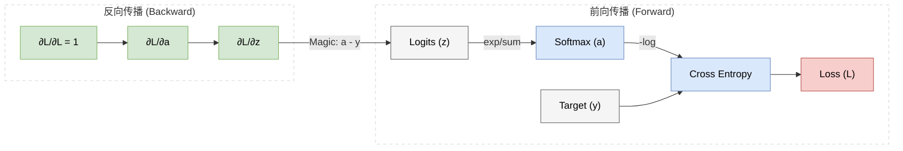

# 附录 A.7 Softmax 与 Cross-Entropy：分类问题的黄金搭档
## Appendix A.7 Softmax and Cross-Entropy: The Golden Couple of Classification

在深度学习的分类任务中，**Softmax 激活函数** 与 **交叉熵 (Cross-Entropy) 损失函数** 几乎总是形影不离。这对组合并非偶然，而是数学上精心设计的“黄金搭档”。

本附录将深入剖析它们的数学原理、设计哲学，以及为什么它们组合在一起能产生美妙的化学反应。

### A.7.1 Softmax：从 Logits 到概率 (From Logits to Probabilities)

神经网络的最后一层线性输出通常被称为 **Logits**（$\mathbf{z}$），它们的值域是 $(-\infty, +\infty)$ 的实数。但这不符合我们需要输出“概率”的要求（非负且和为1）。Softmax 函数正是为了解决这个问题而生。

#### 0. 缺失的一环：为什么是 Logits？ (The Missing Link: Why Logits?)

你可能会问：**既然通用近似定理说神经网络可以拟合任意函数，为什么不直接让它输出概率，而是输出 Logits？**

这是一个深刻的工程与数学选择：
*   **无约束 vs 有约束**：通用近似定理通常针对的是**无约束**的实数空间 $\mathbb{R}^n$。如果要直接输出概率，神经网络的输出层必须满足严格约束（$y \in [0,1], \sum y=1$）。强行让网络直接学习这些约束会极大增加优化难度。
*   **分工明确**：我们让神经网络专注于它最擅长的事——**“打分”**。它输出的 Logits $z_i$ 可以理解为对类别 $i$ 的某种“置信度得分”或“能量值”，这个得分是无约束的（可正可负，可大可小）。
*   **投影映射**：Softmax 则扮演了**“投影仪”**的角色，将这个无约束的 Logits 空间投影到了概率单纯形 (Probability Simplex) 上。

$$ \underbrace{\mathbb{R}^K}_{\text{NN Output (Logits)}} \xrightarrow{\text{Softmax}} \underbrace{\Delta^{K-1}}_{\text{Probability Dist.}} $$

因此，神经网络实际上拟合的是 **Log-Probability**（未归一化的对数概率），这在数学上是最自然的参数化方式。

#### 1. 定义与性质
对于一个 $K$ 维向量 $\mathbf{z}$，Softmax 函数定义为：

$$ a_i = \text{Softmax}(\mathbf{z})_i = \frac{e^{z_i}}{\sum_{j=1}^K e^{z_j}} $$

它具有以下关键性质：
*   **归一化 (Normalization)**：$\sum a_i = 1$，这使得输出可以被解释为概率分布。
*   **非负性 (Positivity)**：由于 $e^x > 0$，所以 $a_i > 0$。
*   **放大差异 (Winner-Take-All)**：指数函数的增长极快，稍微大一点的 $z_i$ 会产生显著大的概率 $a_i$。这鼓励模型做出“果断”的决策。

#### 2. 为什么是指数函数 $e^x$？
为什么不用平方、绝对值或者其他正数函数？
*   **信息论/统计力学视角**：Softmax 分布本质上是 **Boltzmann 分布**（或 Gibbs 分布）。在给定能量（Logits）的情况下，它是熵最大的分布（最无偏的猜测）。
*   **数学便利性**：指数函数的导数是其自身，这在求导时会带来巨大的便利（见后文梯度推导）。

#### 3. 补充证明：为什么是最大熵分布？ (Proof of Maximum Entropy)
这是一个来自统计力学的优美结论：**Softmax 是在满足均值约束下，熵最大的分布。**

假设我们有一些能量状态 $z_i$，我们想找到一个概率分布 $P(x)$。
*   **目标**：最大化熵 $H(P) = - \sum p_i \log p_i$（保持最无偏，不做额外假设）。
*   **约束 1（概率和为 1）**：$\sum p_i = 1$。
*   **约束 2（期望能量固定）**：$\sum p_i z_i = E$（系统总能量守恒，或者说我们观测到了某些特征的均值）。

我们构建拉格朗日函数：
$$ \mathcal{L} = - \sum p_i \log p_i + \lambda (\sum p_i - 1) + \beta (\sum p_i z_i - E) $$
对 $p_i$ 求偏导并令其为 0：
$$ \frac{\partial \mathcal{L}}{\partial p_i} = - (1 + \log p_i) + \lambda + \beta z_i = 0 $$
$$ \log p_i = \lambda + \beta z_i - 1 $$
$$ p_i = e^{\lambda-1} e^{\beta z_i} \propto e^{\beta z_i} $$
归一化后：
$$ p_i = \frac{e^{\beta z_i}}{\sum e^{\beta z_j}} $$
这就是 Softmax 的形式（$\beta$ 通常被吸收到 $z$ 中或设为 1/T）。
**结论**：Softmax 不是拍脑袋想出来的，它是大自然处理不确定性时的**最优解**——在已知信息（Logits）之外，它保持了最大的不确定性（熵）。

### A.7.2 交叉熵：衡量分布的距离 (Cross-Entropy)

#### 1. 历史与动机：为什么不用 MSE？
在回归问题中，我们常用 **均方误差 (MSE)**：$L = \frac{1}{2}(y - a)^2$。但在分类问题中，如果使用 MSE 配合 Sigmoid/Softmax，会出现严重的 **梯度消失** 问题。
MSE 的梯度包含 $\sigma'(z)$ 项。当预测完全错误（例如 $y=1$ 但 $a \approx 0$）时，$\sigma'(z)$ 趋近于 0，导致梯度消失，模型无法纠正错误。

#### 2. 信息论视角
我们希望衡量“预测分布 $P$”与“真实分布 $Q$”之间的距离。
*   **KL 散度 (Kullback-Leibler Divergence)**：衡量两个概率分布 $P$ 和 $Q$ 的差异。
    $$ D_{KL}(P || Q) = \sum P(x) \log \frac{P(x)}{Q(x)} = \sum P(x) \log P(x) - \sum P(x) \log Q(x) $$
*   **交叉熵 (Cross-Entropy)**：由于真实分布 $P$ 是固定的（One-hot 标签），其熵 $\sum P \log P$ 是常数。最小化 KL 散度等价于最小化交叉熵：
    $$ H(P, Q) = - \sum_{k} y_k \log(a_k) $$

这里 $y_k$ 是真实标签（One-hot，仅在正确类别位置为 1），$a_k$ 是预测概率。公式可简化为：
$$ L = - \log(a_{correct}) $$
即：**最大化正确类别的对数似然**。

### A.7.3 黄金搭档的数学魔力 (Mathematical Magic)

Softmax 和 Cross-Entropy 的结合之所以被称为“黄金搭档”，是因为它们在反向传播时，能够完美消除复杂的导数项，留下极其简洁的梯度。

#### 1. 梯度推导
我们需要求 Loss 对 Logits $z_i$ 的梯度 $\frac{\partial L}{\partial z_i}$。

根据链式法则：
$$ \frac{\partial L}{\partial z_i} = \sum_{k} \frac{\partial L}{\partial a_k} \frac{\partial a_k}{\partial z_i} $$

**(1) Loss 对 $a$ 的导数**：
$$ \frac{\partial L}{\partial a_k} = - \frac{y_k}{a_k} $$

**(2) Softmax 的 Jacobian 矩阵 $\frac{\partial a_k}{\partial z_i}$**：
这是最复杂的一步。根据除法求导法则 $(u/v)' = (u'v - uv')/v^2$：
*   当 $k=i$ 时：
    $$ \frac{\partial a_i}{\partial z_i} = \frac{\partial}{\partial z_i} \left( \frac{e^{z_i}}{\sum e^{z_j}} \right) = \frac{e^{z_i}(\sum e^{z_j}) - e^{z_i}e^{z_i}}{(\sum e^{z_j})^2} = \frac{e^{z_i}}{\sum e^{z_j}} \left( 1 - \frac{e^{z_i}}{\sum e^{z_j}} \right) = a_i(1-a_i) $$
*   当 $k \neq i$ 时：
    $$ \frac{\partial a_k}{\partial z_i} = \frac{\partial}{\partial z_i} \left( \frac{e^{z_k}}{\sum e^{z_j}} \right) = \frac{0 - e^{z_k}e^{z_i}}{(\sum e^{z_j})^2} = - \frac{e^{z_k}}{\sum e^{z_j}} \frac{e^{z_i}}{\sum e^{z_j}} = -a_k a_i $$

**(3) 合并求解**：
将上述两步代入链式法则求和公式：
$$
\begin{aligned}
\frac{\partial L}{\partial z_i} &= \sum_{k} \left( - \frac{y_k}{a_k} \right) \frac{\partial a_k}{\partial z_i} \\
&= \left( - \frac{y_i}{a_i} \right) a_i(1-a_i) + \sum_{k \neq i} \left( - \frac{y_k}{a_k} \right) (-a_k a_i) \\
&= -y_i(1-a_i) + \sum_{k \neq i} y_k a_i \\
&= -y_i + y_i a_i + a_i \sum_{k \neq i} y_k \\
&= -y_i + a_i \underbrace{\left( y_i + \sum_{k \neq i} y_k \right)}_{\text{Sum of all } y_k = 1}
\end{aligned}
$$

#### 2. 最终结论：美妙的减法
$$ \frac{\partial L}{\partial z_i} = a_i - y_i $$
或者写成向量形式：
$$ \boldsymbol{\delta}^{(L)} = \mathbf{a} - \mathbf{y} = \text{Pred} - \text{Target} $$

**直观意义**：
无论 Softmax 的指数运算多复杂，无论 Cross-Entropy 的对数运算多繁琐，它们组合后的反向传播梯度竟然就是简单的 **“预测值减去真实值”**！

*   **没有 $\sigma'(z)$ 项**：这意味着不存在梯度消失问题。只要预测值 $a$ 与真实值 $y$ 有差距，梯度就会一直存在，推着模型去学习。这正是我们抛弃 MSE 选择 Cross-Entropy 的根本原因。

### A.7.4 数值稳定性技巧：Log-Sum-Exp

在工程实现（如 PyTorch/TensorFlow）中，我们通常不会直接计算 $e^{z_i}$，因为当 $z_i$ 很大时（例如 $z_i=1000$），$e^{1000}$ 会直接导致浮点数溢出 (NaN)。

解决方案是利用 **Log-Sum-Exp** 技巧：
$$ \log\left(\sum e^{z_i}\right) = \log\left(\sum e^{z_i - c} e^c\right) = c + \log\left(\sum e^{z_i - c}\right) $$
通常取 $c = \max(\mathbf{z})$。
这样可以将所有指数项的幂次控制在 0 或负数范围内，彻底避免上溢出。

这也是为什么深度学习框架推荐直接使用 `torch.nn.CrossEntropyLoss`（它内部集成了 `LogSoftmax` + `NLLLoss` 并做了数值优化），而不是自己手动拼凑 `Softmax` + `log` + `mean` 的原因。
