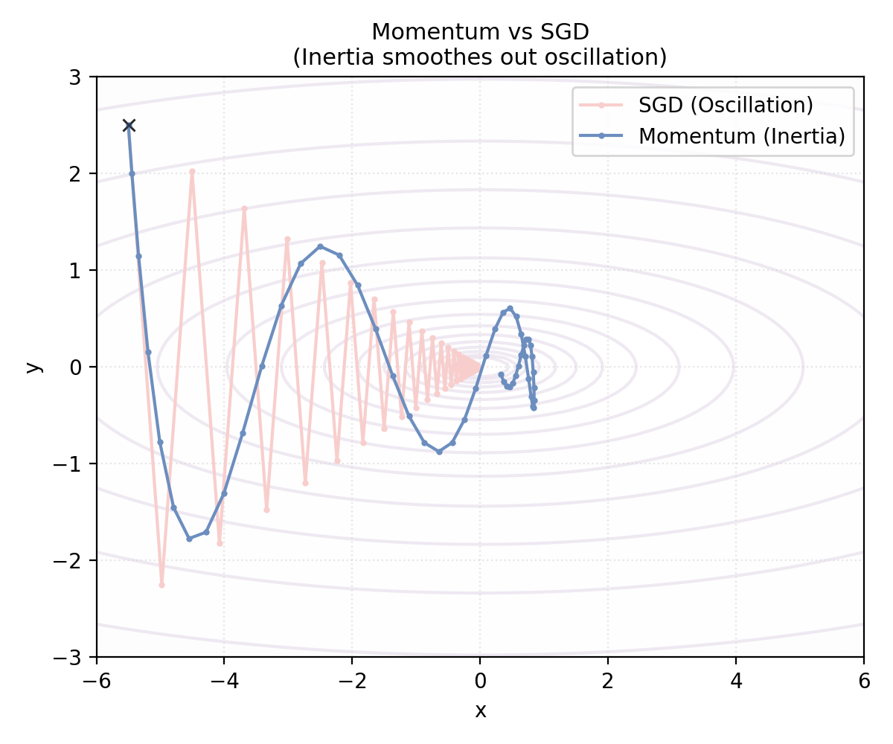
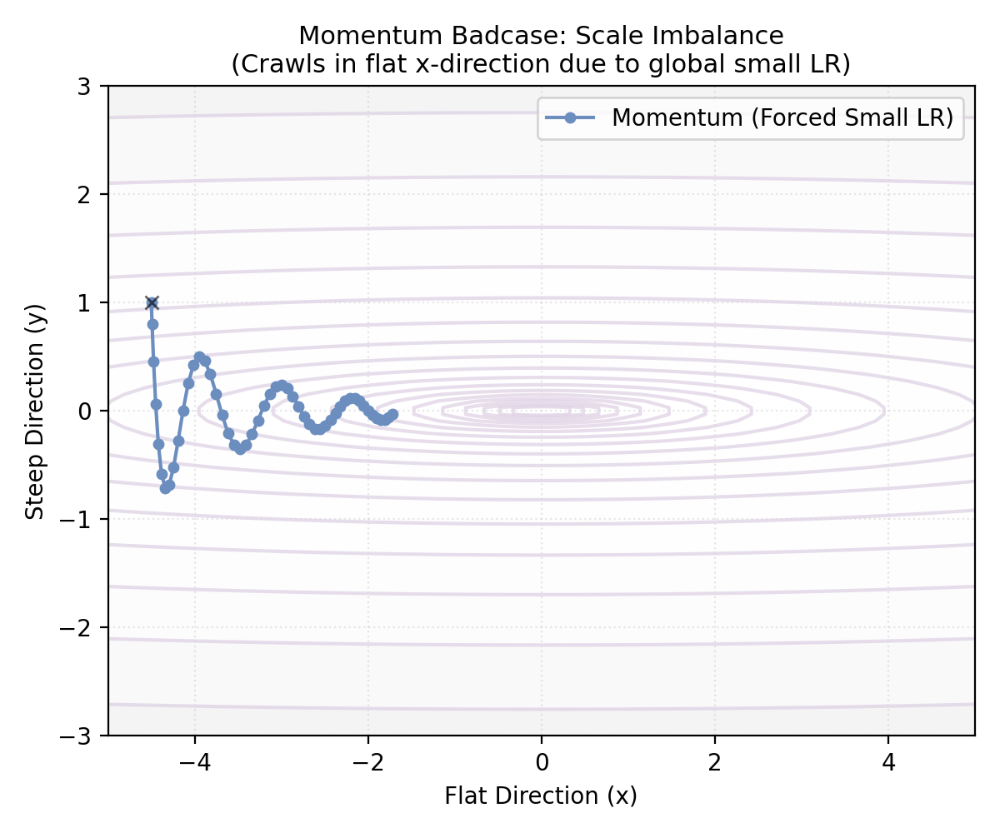
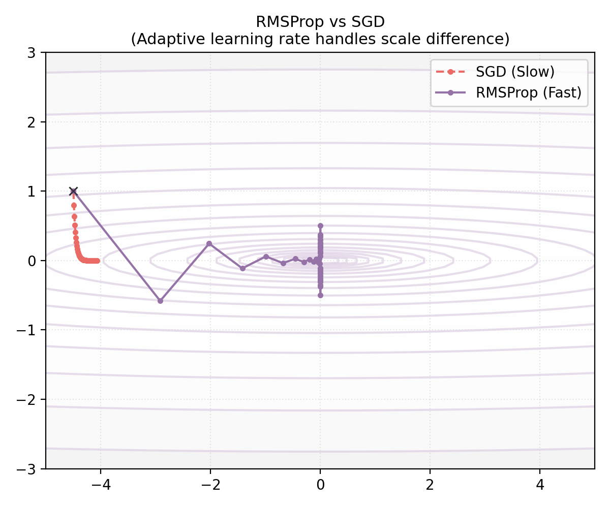
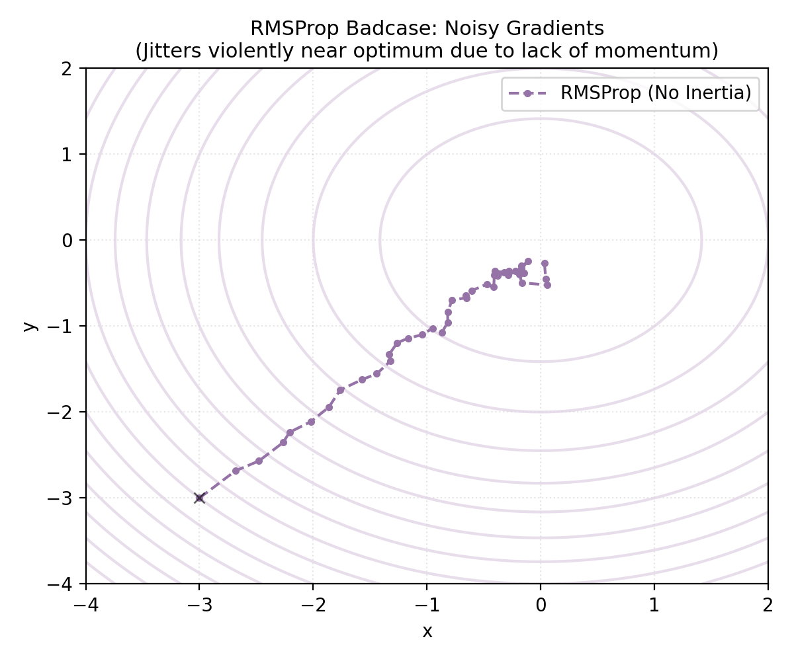
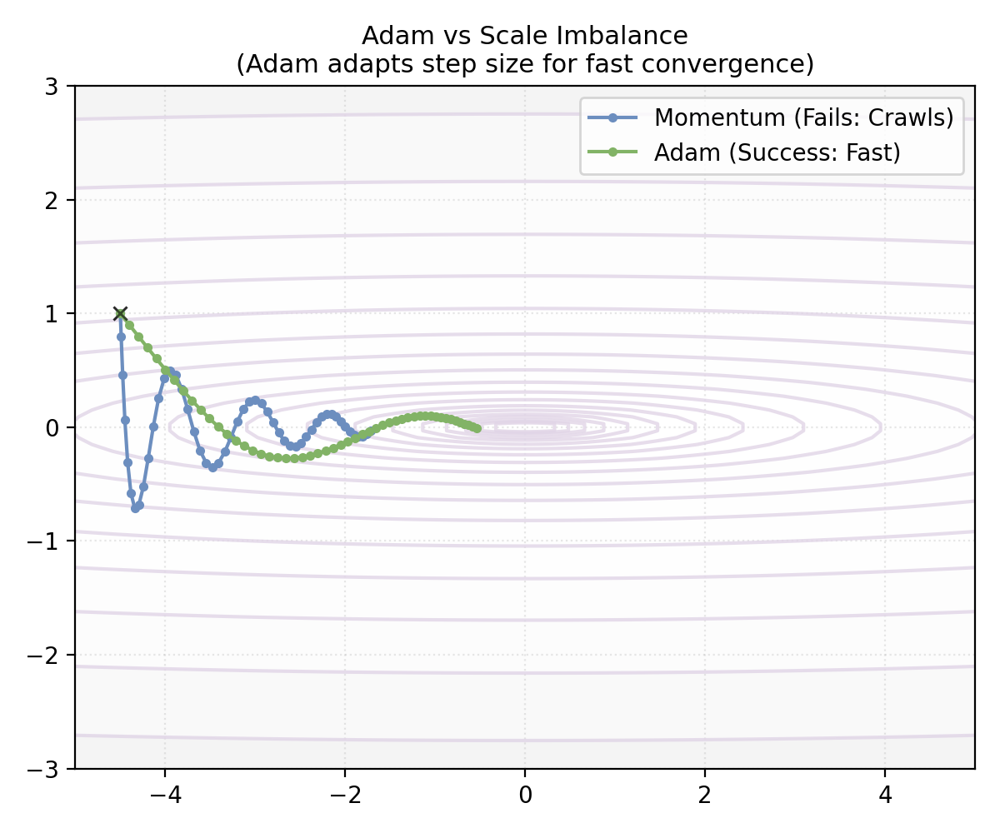
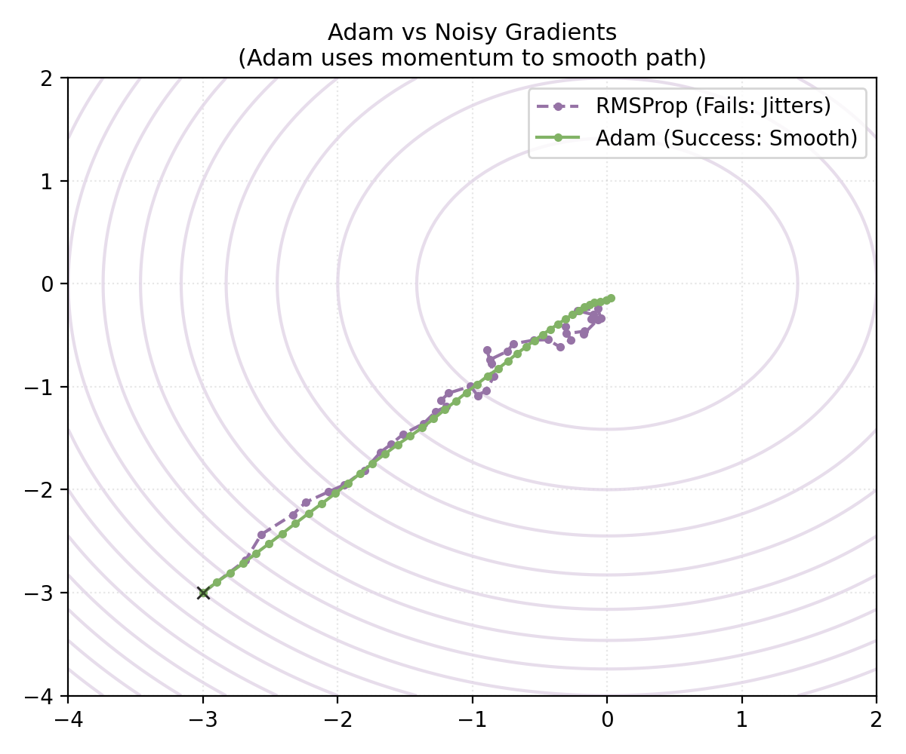

# 附录 A.8 进阶优化算法：从 Momentum 到 Adam
## Appendix A.8 Advanced Optimization: From Momentum to Adam

本附录将对正文 2.1 节中提到的高级优化器进行详细的数学补充。现代优化算法的发展并非单线进化，而是沿着 **“动量 (Momentum)”** 和 **“自适应 (Adaptive)”** 两条主线独立发展，最终在 **Adam** 处实现了殊途同归。

### A.8.1 优化分支一：动量法 (Momentum)

**核心目标**：解决“方向”问题（消除震荡，加速收敛）。

#### 1. 痛点：SGD 的短视与震荡
SGD 每一步更新完全依赖当前的瞬间梯度。这导致了两个严重问题：
*   **震荡 (Oscillation)**：在峡谷（Valley）地形中，梯度在峡谷壁之间来回反跳，而在谷底方向分量很小，导致收敛路径呈“之”字形。
*   **局部极小 (Local Minima)**：一旦遇到梯度为 0 的平原或鞍点，SGD 会立即停止更新。

#### 2. 解决方案：引入惯性
**动量法**模拟了物理学中的“重球”。它引入了一个速度变量 $v$，即使当前梯度改变方向，小球仍会靠惯性继续沿原来的大方向前进。

**数学形式 (EMA)**：
$$
\begin{aligned}
v_t &= \beta v_{t-1} + (1-\beta) g_t \\
w_{t+1} &= w_t - \eta v_t
\end{aligned}
$$
*   $\beta$ (通常 0.9) 是动量系数。
*   $v_t$ 本质上是梯度的**指数移动平均 (EMA)**。它能抵消掉震荡方向的梯度（正负相加为 0），并累积一致方向的梯度（如谷底方向）。
    *(关于 EMA 的数学原理、有效窗口大小及偏差修正推导，详见本文末尾 [A.8.5 数学工具箱：指数移动平均](#a75-数学工具箱指数移动平均-exponential-moving-average-ema))*

#### 3. 效果与局限性
*   **效果**：如下图所示，相比 SGD（红色），Momentum（蓝色）成功抑制了纵向震荡，并加速了横向移动。

*   **局限性 (Badcase)**：**单一学习率的困境**。
    Momentum 虽然修正了方向，但它对所有参数使用同一个全局学习率 $\eta$。
    **场景**：假设有一个极度拉伸的峡谷（如下图），$y$ 轴极陡（梯度大），$x$ 轴极缓（梯度小）。
    *   如果 $\eta$ 设得大，在 $y$ 轴会爆炸。
    *   如果 $\eta$ 设得小（为了迁就 $y$ 轴），在 $x$ 轴就会像蜗牛一样爬行。
    *   **结果**：如下图蓝色轨迹所示，Momentum 虽然没有震荡，但在 $x$ 轴方向的移动速度令人绝望地缓慢。

  
   
  <em>图注：Momentum (蓝色) 为了不爆炸被迫使用小学习率，导致在平缓方向（x轴）几乎停滞。</em>

### A.8.2 优化分支二：自适应学习率 (Adaptive Learning Rate)

**核心目标**：解决“步长”问题（应对多尺度差异）。

这一分支从**统计学**和**特征频率**的角度出发，解决了一个全新的挑战：在处理高维数据时，不同参数的梯度往往具有截然不同的稀疏度和量级。对于频繁出现的特征（如常见词），我们希望学习率小一些以保持稳定；而对于稀疏特征（如罕见词），我们则希望学习率大一些以捕捉仅有的信息。单一的全局学习率（Global Learning Rate）显然无法同时满足这两个需求。这促生了 **自适应学习率（Adaptive Learning Rate）** 这一独立的研究分支。

#### 1. 早期尝试：Adagrad
**Adagrad** 的策略是：梯度越大的参数，其后续学习率应越小（阻尼）；梯度越小的参数，其学习率应越大（激励）。
它通过累积**历史梯度的平方和**来调整步长：
$$ s_t = s_{t-1} + g_t^2, \quad w_{t+1} = w_t - \frac{\eta}{\sqrt{s_t + \epsilon}} g_t $$

**机制解析：为什么它能生效？**
*   **自适应缩放**：$s_t$ 位于分母，且随着梯度的累积而增大。
    *   **频繁特征（常见词）**：$g_t$ 经常不为 0，$s_t$ 累积得很快，分母大，导致有效学习率 $\frac{\eta}{\sqrt{s_t}}$ 迅速减小。这很合理，因为常见特征信息量低，我们已经学得差不多了，步子要稳。
    *   **稀疏特征（生僻词）**：$g_t$ 绝大多数时候是 0，$s_t$ 累积得很慢，分母小，导致有效学习率保持较大值。一旦该特征偶尔出现，模型能以大步长迅速捕捉到这珍贵的信息。

**致命缺陷**：
$g_t^2$ 永远是正数，这意味着 $s_t$ 只能**单调递增**。
*   随着训练的进行，分母 $\sqrt{s_t}$ 会无限变大。
*   有效学习率 $\frac{\eta}{\sqrt{s_t}} \to 0$。
*   **后果**：模型往往还没收敛，学习率就已经衰减到微乎其微，导致训练提前停止（Premature Stop）。

#### 2. 修正方案：RMSProp
**RMSProp** (由 Geoffrey Hinton 在其 Coursera 课程中提出，非正式发表) 在 Adagrad 的基础上引入了 **EMA**（指数移动平均）。它只关注“最近”一段时间的梯度量级，遗忘久远的历史。
$$ s_t = \gamma s_{t-1} + (1-\gamma) g_t^2 $$
$$ w_{t+1} = w_t - \frac{\eta}{\sqrt{s_t + \epsilon}} g_t $$
*   **物理意义**：$\sqrt{s_t}$ 是梯度的均方根（RMS）。如果某参数最近震荡很大（RMS 大），就除以一个大数来减速；反之则加速。
*   **参数选择 ($\gamma$)**：$\gamma$ 被称为**衰减率 (Decay Rate)**，Hinton 建议将其设置为 **0.9**。
    *   它控制了历史信息的**遗忘速度**（或称“记忆长度”）。
    *   **数学直觉**：指数移动平均 (EMA) 的有效观测窗口大小约为 $\frac{1}{1-\gamma}$。
        *   若 $\gamma = 0.9$，则 $s_t$ 主要受最近 **10** 步 ($1/(1-0.9)$) 梯度的影响。
        *   若 $\gamma = 0.99$，则窗口扩大到 **100** 步，对瞬间梯度的反应变慢，变化更加平滑。

**机制解析：学习率如何动态变化？**
与 Adagrad 的单调递增不同，RMSProp 的 $s_t$ 就像一个**滑动窗口**：
*   **当进入剧烈震荡区（梯度大）**：$g_t^2$ 变大，$s_t$ 随之变大，分母变大，学习率自动**减小**（刹车保稳）。
*   **当进入平缓区（梯度小）**：$g_t^2$ 变小，由于 EMA 的遗忘机制，旧的大梯度被遗忘，$s_t$ 随之变小，分母变小，学习率自动**增大**（加速通行）。
这种机制使得 RMSProp 不会像 Adagrad 那样“窒息”，而是能够持续地适应地形变化。

#### 3. 效果与局限性
*   **效果**：回到刚才的尺度失衡场景。相比于 SGD（红色虚线）只能小心翼翼地移动，RMSProp（紫色实线）能够自动识别出 $y$ 轴陡峭、$x$ 轴平缓。它抑制了 $y$ 轴更新，放大了 $x$ 轴更新，使得更新轨迹沿着对角线直奔终点。

  
   
  <em>图注：RMSProp (紫色) 通过自适应调整步长，效率远超 SGD (红色)。</em>

*   **局限性 (Badcase)**：**对噪声敏感**。
    RMSProp 只有“缩放”能力，没有“惯性”。
    **场景**：在 Mini-batch 训练中，梯度包含大量随机噪声。
    **结果**：如下图紫色虚线所示，在接近终点（梯度变小）时，RMSProp 容易受到随机噪声的干扰，在最优点附近剧烈抖动，无法稳定收敛。

  
   
  <em>图注：RMSProp (紫色虚线) 因缺乏动量，在终点附近受噪声影响剧烈抖动。</em>

### A.8.3 殊途同归：Adam (The Grand Synthesis)

**核心目标**：集大成（同时拥有 Momentum 的稳健方向与 RMSProp 的精准步长）。

**Adam (Adaptive Moment Estimation)** 结合了上述两个分支的优点，同时维护两个状态：

1.  **一阶矩 $m_t$ (Momentum)**：累积梯度，提供**惯性**，平滑噪声，解决震荡。
    $$ m_t = \beta_1 m_{t-1} + (1-\beta_1) g_t $$
2.  **二阶矩 $v_t$ (RMSProp)**：累积梯度平方，提供**自适应缩放**，解决尺度不均。
    $$ v_t = \beta_2 v_{t-1} + (1-\beta_2) g_t^2 $$

3.  **偏差修正 (Bias Correction)**：
    由于 $m_0, v_0$ 初始化为 0，初期估计会严重偏向 0（尤其是在 $\beta$ 接近 1 时）。我们需要引入修正项来放大它们，使其在初期也能无偏地估计梯度期望：
    $$ \hat{m}_t = \frac{m_t}{1 - \beta_1^t}, \quad \hat{v}_t = \frac{v_t}{1 - \beta_2^t} $$
    *(关于修正项来源的数学推导，详见本文末尾 [A.8.5 EMA 数学工具箱](#a85-数学工具箱指数移动平均-exponential-moving-average-ema))*

**最终更新**：
$$ w_{t+1} = w_t - \eta \frac{\hat{m}_t}{\sqrt{\hat{v}_t} + \epsilon} $$

#### 效果展示：Adam 的完美表现

**1. 对比 Momentum 的痛点（尺度不均）**
面对 Momentum 束手无策的“长峡谷”问题，Adam 利用 $\sqrt{v_t}$ 进行了自适应缩放。它自动放大了 $x$ 轴的学习率，使得收敛速度极大提升。

  

**2. 对比 RMSProp 的痛点（噪声抖动）**
面对 RMSProp 无法处理的“随机噪声”问题，Adam 利用 $m_t$ 的惯性平滑了路径。即使梯度方向随机跳动，累积的动量依然指向正确的方向，使得轨迹平滑且稳定。

  

### A.8.4 AdamW：权重衰减的修正 (Decoupled Weight Decay)

标准的 Adam 在结合 L2 正则化时存在一个被长期忽视的理论缺陷。这导致了 Adam 在某些任务（如图像分类）上泛化能力不如 SGD+Momentum。**AdamW** 的提出修复了这个问题。

**1) 问题来源：L2 正则化在自适应算法下的变形**

我们在 **[附录 A.4.3](../appendix/a.4_regularization.md#a43-优化视角权重衰减与梯度更新-weight-decay-in-optimization)** 中已经证明：在 SGD 优化器下，**L2 正则化**（Loss 中加罚项）与**权重衰减**（更新公式中减权重）在数学上是完全等价的。

**然而，在 Adam 中，这种等价性破灭了**。
在 Adam 中，梯度 $g_t$ 会被除以 $\sqrt{v_t}$（自适应缩放）。如果我们把 L2 正则化的梯度 $\lambda w$ 加进 $g_t$ 里：
$$ \hat{g}_t = \nabla J_{orig}(w) + \lambda w $$
那么最终的更新量会变成：
$$ w_{t+1} \approx w_t - \eta \frac{\hat{g}_t}{\sqrt{v_t}} = w_t - \frac{\eta}{\sqrt{v_t}} \nabla J_{orig}(w) - \underbrace{\frac{\eta}{\sqrt{v_t}} \lambda w}_{\text{Deformed Decay}} $$

注意看最后一项：原本应该是固定的衰减力度 $\eta \lambda w$，现在却被 $\frac{1}{\sqrt{v_t}}$ 给扭曲了！
*   **这就产生了“正则化力度不均”的问题**：
    *   **对于梯度很大的参数**（$v_t$ 大）：$\frac{1}{\sqrt{v_t}}$ 很小，正则化力度被**削弱**了。
    *   **对于梯度很小的参数**（$v_t$ 小）：$\frac{1}{\sqrt{v_t}}$ 很大，正则化力度被**放大**了。
    *   这完全违背了 L2 正则化的初衷（对所有参数施加均匀的高斯先验约束）。

**2) 解决方案：解耦权重衰减 (Decoupling)**

**AdamW (Adam with Weight Decay)** 提出将权重衰减项从梯度更新中**剥离**出来，不再参与 $m_t$ 和 $v_t$ 的计算，也不受自适应缩放的影响，而是直接作用于参数。

**AdamW 更新公式**：
$$ w_{t+1} = \underbrace{w_t - \eta \frac{\hat{m}_t}{\sqrt{\hat{v}_t} + \epsilon}}_{\text{Standard Adam on Loss}} - \underbrace{\eta \lambda w_t}_{\text{Decoupled Weight Decay}} $$

*   第一项：仅使用原始 Loss 的梯度进行自适应更新。
*   第二项：以固定的力度 $\eta \lambda$ 对参数进行衰减（这才是真正的 L2 正则化效果）。

通过这种解耦，AdamW 既保留了 Adam 快速收敛的优势，又恢复了 SGD 中权重衰减的良好泛化性能。这也是为什么在 Transformer (BERT, GPT) 等大模型训练中，**AdamW** 成为了事实上的标准优化器。

### A.8.5 数学工具箱：指数移动平均 (Exponential Moving Average, EMA)

在动量法、RMSProp 和 Adam 中，核心数学组件都是 **EMA**。为什么它被称为“移动平均”？为什么它能代替过去 $N$ 步的平均值？

#### 1. 定义与展开
给定序列 $x_1, x_2, \dots$ 和衰减系数 $\beta \in [0, 1)$，EMA 定义为：
$$ v_t = \beta v_{t-1} + (1-\beta) x_t $$
假设 $v_0 = 0$，我们可以将 $v_t$ 展开：
$$
\begin{aligned}
v_t &= (1-\beta) x_t + \beta v_{t-1} \\
    &= (1-\beta) x_t + \beta ((1-\beta) x_{t-1} + \beta v_{t-2}) \\
    &= (1-\beta) \left( x_t + \beta x_{t-1} + \beta^2 x_{t-2} + \dots + \beta^{t-1} x_1 \right)
\end{aligned}
$$
这表明，$v_t$ 是过去所有观测值 $x_i$ 的**加权和**。权重随时间间隔以指数级衰减 ($\beta^k$)。离得越近，权重越大。

#### 2. 有效窗口大小 (Effective Window Size)
虽然理论上 EMA 包含了无穷远的历史，但权重衰减得非常快。我们通常借用物理学中**时间常数 (Time Constant)** 的概念，定义权重衰减到初始值的 $\frac{1}{e} (\approx 37\%)$ 时所经历的步数为“有效记忆长度”。

**推导**：
权重 $\beta^k$ 衰减到 $\frac{1}{e}$ 时，经历了多少步？
$$ \beta^k \approx \frac{1}{e} $$
两边取自然对数：
$$ k \ln \beta \approx -1 \implies k \approx \frac{-1}{\ln \beta} $$
利用泰勒展开 $\ln(1-\epsilon) \approx -\epsilon$ (当 $\epsilon \to 0$ 时)，设 $\beta = 1 - \epsilon$：
$$ k \approx \frac{-1}{-\epsilon} = \frac{1}{\epsilon} = \frac{1}{1-\beta} $$
**结论**：EMA 的有效窗口大小约为 **$\frac{1}{1-\beta}$**。

*   **$\beta = 0.9$**：有效窗口 $\approx 10$ 步。
*   **$\beta = 0.999$**：有效窗口 $\approx 1000$ 步。

#### 3. 偏差修正 (Bias Correction)
Adam 算法中引入了 $\hat{v}_t = \frac{v_t}{1-\beta^t}$，这是为了解决**零初始化 (Zero Initialization)** 带来的冷启动问题。

**案例直观对比**：
假设我们有一个恒定的梯度序列 $x_t \equiv 1$，衰减系数 $\beta = 0.9$。
*   **真实期望**：平均值应该始终是 **1**。
*   **未修正 EMA ($v_t$)**：
    *   $t=1$: $v_1 = 0.9 \times 0 + 0.1 \times 1 = \mathbf{0.1}$ (严重偏低，只有真实值的 10%)
    *   $t=2$: $v_2 = 0.9 \times 0.1 + 0.1 \times 1 = \mathbf{0.19}$
    *   ... 需要很多步才能爬升到 1。
*   **修正后 EMA ($\hat{v}_t$)**：
    *   $t=1$: 修正系数 $1 - 0.9^1 = 0.1$。$\hat{v}_1 = 0.1 / 0.1 = \mathbf{1.0}$ (**完美修正！**)
    *   $t=2$: 修正系数 $1 - 0.9^2 = 0.19$。$\hat{v}_2 = 0.19 / 0.19 = \mathbf{1.0}$

**副作用分析**：
*   **初期**：修正系数 $1-\beta^t$ 很小，导致 $\hat{v}_t$ 被放大。这在梯度本身由于初始化原因可能很大的时候，可能会进一步放大学习步长（对于 $m_t$）。但对于二阶矩 $v_t$（在分母），修正后的值变大意味着分母变大，反而起到了**预热 (Warmup)** 的约束作用，防止初期步长过大。
*   **后期 ($t \to \infty$)**：$\beta^t \to 0$，修正系数 $1-\beta^t \to 1$。这意味着随着训练进行，修正项自动失效，算法平滑过渡到标准的 EMA。因此，**几乎没有副作用**。

**修正原理推导**：
我们计算权重的总和。
$$ \sum_{i=0}^{t-1} (1-\beta)\beta^i = (1-\beta) \frac{1-\beta^t}{1-\beta} = 1 - \beta^t $$
因此，我们将 $v_t$ 除以这个系数 $1-\beta^t$，即可将权重的和归一化为 1，从而还原真实的平均值量级。
