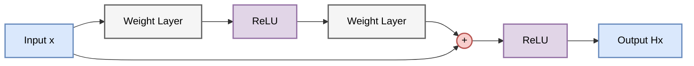
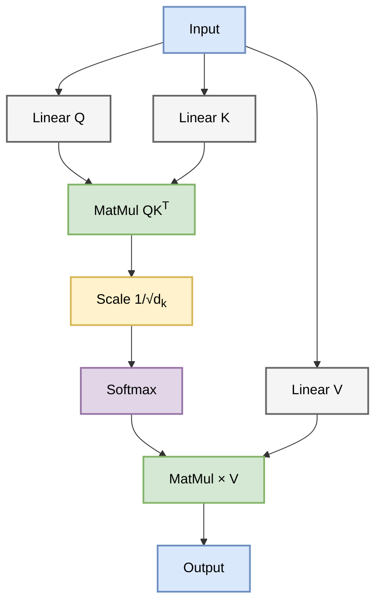
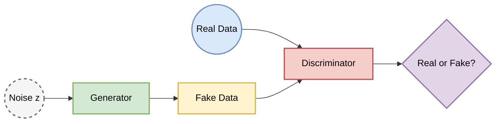
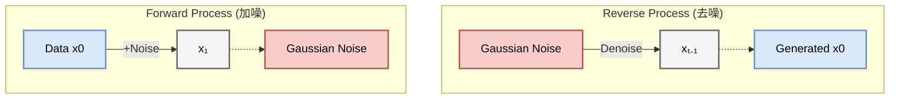

# 导论：人工智能演进史 (Introduction: The Evolution of AI)
**From Mathematical Logic to Multimodal Reasoning Systems (1943-2026)**

**署名作者：Dr. Stochastic Parrot**

> **资料口径**：涉及 2024 年之后论文、模型与产品的事实校准截至 **2026 年 7 月 12 日**。产品名称只用于说明技术路线；未公开训练细节的系统不据其功能反推具体训练配方。

把人工智能史排成一串年份并不难：感知机、反向传播、卷积网络、Transformer、大语言模型依次写下去，就会得到一条看似必然的上升曲线。真正需要解释的是另一件事：每一代方法究竟补上了前一代的什么缺口，又为下一代留下了什么新的代价。规则系统能把推理步骤写得清楚，却很难穷举感知世界；神经网络能从样本中学习表示，却把知识放进了难以直接检查的参数；大模型把许多任务统一成条件生成，又把事实约束、工具权限和长期状态推给了系统层。

因此，这里的历史不是模型排行榜，而是一组反复出现的设计问题。信息应由人手写成符号，还是从数据中学习？序列应压入一个递归状态，还是让任意位置直接交换信息？基座模型只需要拟合数据分布，还是还要学习人的指令与偏好？当一次回答不足以完成任务时，模型又怎样接入检索、工具、记忆与环境反馈？这些问题把符号主义、连接主义、生成建模和 Agent 工程连在同一条技术脉络上。

下面的时间轴先给出路标，后文再沿着“原理如何变成机制、机制如何在例子中工作”的顺序展开。不同路线并未简单互相取代：现代系统仍会同时使用神经表示、符号约束、搜索、数据库和人工规则。

---

## 0. 史前纪元与逻辑的黎明 (1943-2012)

为了更直观地理解 AI 的发展脉络，我们首先看一张涵盖 80 年历程的时间轴：

在深度学习爆发之前，AI 经历了两大流派的漫长博弈：符号主义 (Symbolism) 与 连接主义 (Connectionism)。关于连接主义的核心数学基础，详见 **[Chapter 1.1](ch01_ai_source.md#section-1-1)**。

### 0.1 逻辑微积分与图灵的追问 (The Genesis)
1943 年，神经生理学家 McCulloch 和数学家 Pitts 把简化神经元刻画为阈值逻辑元件，并说明这类元件组成的网络可以实现丰富的布尔运算。这里最重要的不是它像不像真实神经元，而是生物启发第一次被压成了可计算对象；感知机后来正是在这条线上加入了可学习的权重（详见 **[Chapter 1.2](ch01_ai_source.md#section-1-2)**）。

图灵在 1950 年把问题从“机器的内在本质是什么”转向“我们能观察并检验什么行为”。图灵测试是一项操作性判据，而不是对智能本体的最终定义。1955 年的达特茅斯研究提案随后使用了“人工智能”这一名称，1956 年的夏季研究项目则让分散的逻辑、搜索、学习与计算研究逐渐形成一个制度化领域。

### 0.2 符号主义的兴衰：推理即计算
符号主义的重要理论主张之一是 **“物理符号系统假设”**：通用智能可以由符号结构及其操作来实现。它深刻影响了早期 AI，但不能概括当时全部研究路线。

它的机制是把知识写成规则与符号，再让搜索或逻辑推理在这些对象上运行。MYCIN 一类专家系统证明了显式知识库在边界清楚的专业问题上可以产生有用建议；Deep Blue 则把棋类规则、启发式搜索、评估函数和专用计算组合起来。优势也正是限制：系统只会操作已经被表示出来的对象。识别一张脸、抓住一个杯子或理解含混语境所需的大量隐性结构，很难由工程师逐条写完。所谓莫拉维克悖论描述的便是这种反差：形式规则清楚的高阶任务可能较易计算，人类不假思索完成的感知与运动反而难以形式化。

### 0.3 连接主义的低潮与统计学习的发展
Rosenblatt 在 1958 年提出的感知机可以从样本修正线性决策边界，却无法表示 XOR 这类非线性可分关系。Minsky 与 Papert 对单层感知机能力的系统分析使这项限制广为人知；资金、算力、数据与过高预期也共同压低了连接主义研究热度，不能把后来的低潮归因于 XOR 一题。

多层网络能够组合多个线性边界，但还需要把输出误差有效传回各层。1980 年代重新受到重视的反向传播提供了这条可微训练链路（详见 **[Chapter 2.1](ch02_ai_source.md#section-2-1)**）。在深度网络仍受算力和数据约束的时期，SVM、Boosting 与 Random Forest 等统计学习方法则沿另一条路线成熟：SVM 依靠凸的最大间隔优化与核方法，随机森林通过随机化树集成降低方差。它们不是连接主义复兴前的空白过渡，而是至今仍有独立适用范围的方法族（详见 **[Chapter 1.4](ch01_ai_source.md#section-1-4)**）。

---

## 1. 第一阶段：深度架构的成熟与序列建模的困境 (2012-2017)

随着算力的提升和大数据时代的到来，神经网络迎来了复兴。

2012 年 AlexNet 的出现标志着连接主义的全面复兴（详见 **[Chapter 2.2](ch02_ai_source.md#section-2-2)**）。它的关键不在于单独“解决”深层网络的全部梯度问题，而在于把卷积结构、ReLU、Dropout、数据规模与 GPU 训练组合成了可扩展的图像识别系统。

### 1.1 残差学习 (Residual Learning)

ResNet 论文于 2015 年公开、发表于 CVPR 2016。它显著缓解了网络加深后的退化问题，使数十层乃至上百层视觉网络更容易优化。简单来说，它给网络加入了“短路”机制，让信息和梯度多了一条恒等路径。

普通堆叠层要求每一段直接学习完整映射 $H(x)$；残差块改为学习相对输入的修正 $F(x):=H(x)-x$，再把输入沿恒等支路加回来：

$$y_l = h(x_l) + F(x_l, W_l)$$
$$x_{l+1} = f(y_l)$$

若某个块暂时没有学到有用修正，令 $F$ 接近零就能近似保留输入，而不必让一串新层重新拟合恒等映射。下面的图把这条“原表示加修正量”的路径画了出来。

反向传播经过加法节点时，也会得到一条包含恒等项的路径。这能缓解网络加深后的退化和梯度传播困难，但不意味着所有梯度都能无损到达浅层；归一化、初始化、非线性与整体块设计仍会改变训练行为。

### 1.2 序列建模的瓶颈

当时的 NLP 依赖 LSTM/GRU，它们像阅读一样逐字处理（详见 **[Chapter 2.4](ch02_ai_source.md#section-2-4)**）。

这种递推把前一步状态变成后一步的输入，因此同一循环层不能一次算完整段 token；跨样本、跨层和单步矩阵运算仍可并行，时间轴本身却保留了串行依赖。长序列还会把越来越多信息压进固定维度状态，并让梯度跨越更多步。LSTM 的门控能选择保留或遗忘信息，却不能消除串行深度和有限状态带来的全部代价。

---

## 2. 第二阶段：Transformer 范式与自注意力机制 (2017-2020)

RNN 的串行瓶颈促使研究者寻找并行化的解决方案。

*Attention Is All You Need (2017)* 的发表标志着现代 LLM 时代的开端（详见 **[Chapter 3](ch03_ai_source.md#section-3-1)**）。核心思想是用可并行计算的注意力矩阵显式建模序列内任意位置之间的依赖关系。

### 2.1 自注意力机制 (Self-Attention) 的几何意义

Transformer 抛弃了递归，完全基于注意力（详见 **[Chapter 3.2](ch03_ai_source.md#section-3-2)**）。

设当前表示产生查询 $Q$、键 $K$ 与值 $V$。查询与各键的内积形成匹配分数，softmax 把每一行变成权重，再用这些权重混合值：

$$\text{Attention}(Q, K, V) = \text{softmax}\left(\frac{QK^T}{\sqrt{d_k}}\right)V$$

例如“吃了一个苹果”与“苹果电脑”中的“苹果”会遇到不同邻词，因而产生不同的查询-键匹配与输出表示。这里的“关注”不是额外的心理过程，而是下图所示的矩阵打分、归一化和加权求和。

$QK^T$ 同时计算所有查询与键的匹配；匹配越高，相应值通常获得越大权重。若查询和键的分量在理想化假设下具有单位方差，内积方差会随 $d_k$ 增长；除以 $\sqrt{d_k}$ 把尺度拉回稳定范围，降低 softmax 过早饱和的风险。它是数值尺度控制，不保证每个注意力头都会学到可解释关系。

### 2.2 位置编码 (Positional Encoding)

Self-Attention 本身对输入位置是置换等变的：如果不额外注入位置信息，模型只能看到词元之间的内容关系，无法区分“我爱你”和“你爱我”这类顺序不同的句子。因此需要位置编码或相对位置机制，让模型把序列顺序纳入表示（详见 **[Chapter 3.3](ch03_ai_source.md#section-3-3)**）。

### 2.3 预训练目标：BERT vs GPT

BERT 把部分 token 遮住，再利用左右上下文恢复它们（详见 **[Chapter 4.2](ch04_ai_source.md#section-4-2)**）；这种目标适合形成整段输入的双向表示。GPT 只允许当前位置读取左侧前缀，并预测下一个 token（详见 **[Chapter 4.3](ch04_ai_source.md#section-4-3)**）。同一个条件分解既可在训练时并行计算各位置损失，又能在推理时逐 token 生成，因此自然连接到对话、代码补全和工具调用。两者的差别首先是可见上下文与训练接口，而不是简单的“一个理解、一个生成”。

---

## 3. 第三阶段：生成式模型的爆发——从 GAN 到 Diffusion (2014-2022)

生成模型的目标从简单的分类预测转向了对数据分布的直接建模。

在图像生成领域，技术路径经历了从"左右互搏"到"热力学扩散"的转变（详见 **[Chapter 6.1](ch06_ai_source.md#section-6-1)**）。

### 3.1 生成对抗网络 (GAN)

GAN 同时训练生成器与判别器。生成器把噪声映射成样本，判别器学习区分真实数据和生成数据；生成器再沿判别器提供的梯度，提高生成样本被判为真实的概率。常用的“假钞制造者与鉴别者”类比对应的正是这场双目标博弈，但平衡并不自动到来：一方过强、梯度不稳或生成器只覆盖少数模式，都可能使训练失败。

下面的图只展示最小数据流，不把对抗训练误写成两个主体在共同理解图像。

### 3.2 扩散模型 (Diffusion Models) 的兴起

Diffusion Model (DDPM) 受到非平衡热力学与随机过程的启发，通过逐步加噪和去噪来建模数据分布，并在许多图像生成任务中逐渐取代 GAN 成为主流路线。

训练时先按已知噪声日程逐步破坏真实图像，得到从数据到近似高斯噪声的前向过程；模型学习在给定噪声层级和条件时预测噪声或去噪方向。生成时从噪声出发，反复调用这个局部预测器，逐步得到结构清晰的样本。墨水扩散的类比能帮助理解“逐步破坏与逆向恢复”，但反向生成不是把某张原图的真实历史倒放，而是从学到的条件分布中采样。

下面的图把训练所定义的前向链与生成使用的反向链并置起来。

与 GAN 的双模型博弈不同，扩散模型学习分数函数或等价的噪声预测目标，可理解为估计在各噪声层级上怎样朝更高数据密度方向修正样本。监督信号由已知加噪过程构造，训练通常更稳定；代价是传统采样需要多次迭代，条件控制、速度和评价仍需额外设计。

---

## 4. 第四阶段：大模型时代——Scaling Law, Alignment & Reasoning (2020-2026)

当数据、算力、模型规模和后训练技术共同推进时，模型会表现出一批难以从小模型直接外推的能力跃迁。

这一阶段的核心不是某个普适的参数量临界点，而是规模化预训练、数据质量、架构效率、对齐训练与测试时计算的组合效应（详见 **[Chapter 5](ch05_ai_source.md#section-5-1)**）。

### 4.1 缩放定律 (Scaling Laws)
Kaplan 等人发现，在一定训练设定下，模型的损失（Loss）与计算量、数据量、参数量呈现近似**幂律关系**（详见 **[Chapter 4.3](ch04_ai_source.md#section-4-3)**）。这一经验规律为规模化训练提供了可预测性，但它并不意味着模型会“无限变强”：数据质量、推理成本、评测污染、对齐方式和真实任务分布都会改变收益曲线。

### 4.2 对齐技术 (Alignment) 与 RLHF
预训练模型不仅需要语言建模能力，还需要符合人类指令、偏好与安全约束。RLHF (Reinforcement Learning from Human Feedback) 是一种利用人类偏好数据进行后训练的方法（详见 **[Chapter 5.2](ch05_ai_source.md#section-5-2)**）。

典型 PPO-RLHF 管线先用人工撰写或筛选的指令-回复数据做 SFT，使模型学会基本交互格式；再让标注者比较同一提示下的多个回答，用这些排序训练奖励模型；最后把奖励模型当作代理评价器，用 PPO 调整生成策略，并以参考模型约束分布偏移。这条链把难以写成规则的偏好转成可优化信号，也把标注偏差与奖励漏洞带进了训练，所以后来的 DPO、可验证奖励和安全评测并不是可有可无的补丁。

### 4.3 思维链 (Chain of Thought, CoT)
思维链提示是大模型推理研究中的重要现象（详见 **[Chapter 6.2](ch06_ai_source.md#section-6-2)**）。
在数学、符号推理和多步问答中，生成中间步骤有时比直接给最终答案更准确。自回归模型由此获得了额外的串行计算位置，可以把一个输入-输出映射展开成中间变量序列。这个机制增加了测试时计算，却不保证步骤忠实或正确；真正可靠的系统还要把可执行计算、搜索或验证器接到这条生成链上。

---

## 5. 第五阶段：多模态推理系统与架构效率 (2023-2026)

随着多模态模型、长上下文模型、开放权重模型和推理模型的发展，大模型研究进入了多模态、工具调用、检索增强和测试时计算共同演进的阶段。2024-2026 年，研究与工程实践的重点从单纯的"堆预训练算力"扩展为三条并行路线：**训练时规模化**、**测试时计算**与**系统工程化**。

截至 2026 年 7 月 12 日，官方资料已将 [GPT-5.6 Sol / Terra / Luna](https://openai.com/index/gpt-5-6/) 列为 GA，将 [Gemini 3.5 Flash](https://ai.google.dev/gemini-api/docs/models/gemini-3.5-flash) 列为 stable/GA，并列出 DeepSeek API 标识 [`deepseek-v4-pro` / `deepseek-v4-flash`](https://api-docs.deepseek.com/quick_start/pricing)。这些条目只说明校准日公开的接口形态；名称、可用范围和规格会变化，本节不据此给出能力排序，也不从产品功能反推未披露的训练方法。

### 5.1 推理模型 (Reasoning Models / System 2)
预训练规模化仍然重要，但高难数学、代码、科学问题让研究者重新重视 **测试时计算 (Test-time Compute)**：模型在回答前投入更多采样、搜索、验证或隐式思维链计算。

公开例子给出了不同证据层级：OpenAI 的 o1 发布材料报告强化学习与测试时计算的扩展关系，DeepSeekMath 与 DeepSeek-R1 论文则公开了 GRPO、可验证奖励和推理后训练细节。其他带“思考”模式的产品若没有技术报告，只能说明接口趋势，不能据此断言采用同一配方。共同机制不是把概率模型变成纯符号系统，而是让模型在生成候选之外获得更多采样、搜索、验证或奖励驱动的计算。收益常见于数学和代码，代价则是更多 token、更高延迟，以及仍然存在的幻觉、过度思考与简单错误。

### 5.2 架构效率与长窗口 (Efficiency & Long Context)
在模型参数量不断膨胀的背景下，架构效率成为独立研究主题。
*   **MLA、MoE 与稀疏注意力**: DeepSeek-V3 等系统采用 **MLA (Multi-head Latent Attention)** 压缩 KV Cache，并使用 MoE 让每个 token 只激活部分专家，实现"总参数量很大、单次计算量相对较小"的效率权衡。DeepSeek 后续的 NSA / DSA 路线则把稀疏注意力、长上下文效率和硬件 kernel 放到同一套设计里。相关原理详见 **[Chapter 3.5](ch03_ai_source.md#section-3-5)**。
*   **Mamba / SSM**: 状态空间模型重新进入主线视野，原因是它们能用线性扫描和流式状态处理长序列。Mamba 的选择性状态更新不是 Transformer 的简单替代品，但已经成为长序列架构探索的重要方向（见 **[Chapter 3.6](ch03_ai_source.md#section-3-6)**）。
*   **条件记忆与上下文压缩**: Engram 研究哈希寻址 N-gram 记忆，DeepSeek-OCR 初步研究把文档页面压成视觉 token 后做 OCR 重建，DSA 则稀疏化注意力连接。它们都改变信息容量或成本，但作用位置与证据范围不同（见 **[Chapter 3.7](ch03_ai_source.md#section-3-7)**）。
*   **长上下文建模**: [Gemini 1.5 技术报告](https://arxiv.org/abs/2403.05530)研究了百万 token 以上的实验，[Gemini 3.5 Flash 文档](https://ai.google.dev/gemini-api/docs/models/gemini-3.5-flash)则给出 1,048,576 token 的稳定接口上限。长窗口可直接容纳长文档、代码或多模态输入，但窗口上限不等于模型能在所有任务中同样可靠地利用全部信息。
*   **开放权重模型**: Llama、Qwen、Mistral、DeepSeek 等开放权重模型推动了可复现实验、领域微调、本地部署和模型压缩研究。它们的重要性不只在于性能追赶，也在于降低了研究和应用验证的进入门槛。

### 5.3 物理世界模拟与非 Transformer 架构
*   **多模态建模**: 早期多模态系统常由语音识别、文本模型、语音合成等模块串联；[GPT-4o 系统卡](https://cdn.openai.com/gpt-4o-system-card.pdf)公开讨论了文本、视觉与音频的端到端多模态训练和安全评测，Gemini 1.5/3.5 资料则说明了长文本、图像、视频与音频输入能力。Gemini 3.5 Flash 输出为文本且不支持 Live API；不同系统是否支持实时音频输出，应逐项查接口文档。
*   **图像与视频生成模型**: Stable Diffusion、DiT、Sora、Veo 等工作体现了潜在扩散、Transformer、flow 与多模态条件等多条路线。[Sora 技术报告](https://openai.com/index/video-generation-models-as-world-simulators/)明确描述了时空 patch 上的扩散 Transformer；[Veo 官方材料](https://deepmind.google/models/veo/)并未等量公开全部架构细节，因此不能把所有视频产品都归为同一种实现。视觉连续性也不等价于可靠的物理或因果建模。
*   **世界模型与预测表示**: World Models、Dreamer 和 Genie 直接研究潜在动力学、行动或交互环境；I-JEPA 则是在静态图像表征空间做预测的自监督方法，可提供预测表示的相关思想，但其自身不是行动条件世界模型（见 **[Chapter 6.6](ch06_ai_source.md#section-6-6)**）。

### 5.4 Agent 系统工程 (Agent System Engineering)

工具调用和推理模型把 LLM 推向了 Agent 系统，但真实 Agent 并不只是 ReAct 循环。截至校准日，[MCP 2025-11-25](https://modelcontextprotocol.io/specification/2025-11-25)规范模型应用与工具、资源、提示模板之间的连接；由 Google 发起并转入 Linux Foundation 项目的 [A2A v1.0.0](https://a2a-protocol.org/latest/specification/)是 2026 年首个 stable 规范，描述 Agent 间的消息、任务与 artifact。若干运行时实现了状态、handoff、审批和 trace，但这些框架是实现例，不是 Agent 系统唯一标准。

因此，本书把 Agent 分成两个层次讲解：**[6.2 节](ch06_ai_source.md#section-6-2)** 介绍推理、工具与行动循环；**[6.5 节](ch06_ai_source.md#section-6-5)** 介绍协议、上下文工程、编排、安全、观测和评测。

### 5.5 后训练、蒸馏与推理服务 (Post-training, Distillation & Serving)

大模型的能力不再只由预训练决定。SFT、偏好优化、推理 RL、可验证奖励、安全训练、CoT 监控、蒸馏、LoRA、模型合并、混合量化、投机解码、PagedAttention 和连续批处理共同决定模型是否真正可用。第 5 章因此从传统 RLHF 扩展到 **[现代后训练](ch05_ai_source.md#section-5-5)**、**[蒸馏与训练配方](ch05_ai_source.md#section-5-6)**、**[推理速度与服务系统](ch05_ai_source.md#section-5-7)** 和 **[开放权重模型生态](ch05_ai_source.md#section-5-8)**。

### 从单个模型到可运行系统

近十年的发展是从**人工设计特征**到**人工设计架构**，再到**自动学习通用表征**的过程。近期研究不再只关注更大的模型，也关注由基础模型、检索、工具、记忆、验证器、执行环境、协议和人类反馈共同组成的系统。所谓 “System 2” 更像是一组可研究的计算机制：分配更多测试时计算、调用外部工具、验证候选答案，并在证据不足时输出不确定性。
