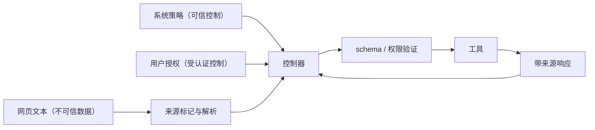

# 《一次输出的存在论》习题解答

以下解答与正文使用同一类型、观察关系和外部输入边界。涉及跨章对象时，优先沿正文的 `SP404` 运行作答；用于检验单个定义的局部题仍可采用更小反例。设计题给出一个满足要求的方案，不声称方案唯一。

## 序章

**练习 0.1.** 对 `SP404` 运行可取以下八个对象：

1. 生成 token 序列 $v^{(b)}\in\mathbb V^*$；
2. 包含查询、两次写入 attempt 和流提交的轨迹
   $t_\star\in\operatorname{Tr}_{\Sigma_\star}$；
3. commit 投影得到的已提交 token 序列 $v_c\in\mathbb V^*$；
4. 带 stream ID、序号和负载的字节片段记录；
5. 最终 Unicode 序列 $u_\star\in\mathbb U^*$；
6. 严格 UTF-8 负载 $E_8(u_\star)\in\mathbb B^*$；
7. 最终消息与 `trip.md`，它们是不同的 $\mathsf{Art}$ 元素；
8. 以最终消息为根的来源图 $p_\star\in\mathsf{Prov}$。

这些对象之间有部分函数或投影，但不能直接相等比较。

**练习 0.2.** 把最终消息制品 $e_u$ 复制到另一存储位置，得到 $e_u'$。二者都保存 Unicode 序列“SP404 已取消；已写入 trip.md。”。取文本身份为
$u_1\equiv_Uu_2\Longleftrightarrow u_1=u_2$，则二者相同。它们的 attempt ID 分别为 $a_1\ne a_2$，并由不同 activity 节点生成，故运行身份和保留 activity ID 的来源图身份不同。

**练习 0.3.** 令 $u=u_\star$ 为 Unicode 序列“SP404 已取消；已写入 trip.md。”。其 UTF-8 字节
$b_8=E_8(u)$ 与带确定字节序的 UTF-16LE 字节
$b_{16}=E_{16}(u)$ 长度和字节通常不同。严格解码函数满足

$$
D_8(b_8)=u=D_{16}(b_{16}),
$$

其中 $D_8:\operatorname{UTF8}\to\mathbb U^*$，
$D_{16}:\operatorname{UTF16LE}\to\mathbb U^*$。不能把 $b_{16}$ 输入 $D_8$ 后仍声称类型正确。

**练习 0.4.** 假设某次发布必须经过 serializer 才能得到最终 PDF 字节，删除 serializer 后该具体字节制品不会出现，因此它在选定因果模型中是必要原因。出版规范却可以规定作者只包括承担选题、论证或编辑角色的人，而 serializer 是工具。于是
$\operatorname{Caused}(\text{serializer},o)$ 成立，
$\operatorname{Author}_{\mathcal N}(\text{serializer},o)$ 不成立。后者由规范 $\mathcal N$ 决定，不是前者的同义改写。

## 第一章

**练习 1.1.** 定义 $N:\mathbb Z\to\mathbb Z$ 为 $N(n)=|n|$。有

$$
N(N(n))=||n||=|n|=N(n),
$$

故幂等。又 $N(1)=N(-1)=1$ 而 $1\ne-1$，故非单射。它把每个非零二元类 $\{n,-n\}$ 商到同一非负代表元；零单独成类。

**练习 1.2.** 右逆条件是 $E\circ R=\operatorname{id}_Y$。任取 $y\in Y$，有
$y=E(R(y))$，所以 $y$ 在 $E$ 的像中，$E$ 满射。取

$$
E:\mathbb Z\times\{0,1\}\to\mathbb Z,\qquad E(n,i)=n,
$$

及 $R(n)=(n,0)$。则 $E\circ R=\operatorname{id}_{\mathbb Z}$，但
$E(n,0)=E(n,1)$，所以 $E$ 不单射。

**练习 1.3.** 令 $\operatorname{AdmTok}$ 同时含
$[\mathtt{ab}]$ 与 $[\mathtt a,\mathtt b]$，token 负载连接解码都得到 `ab`。固定编码器采用最长匹配并固定并列规则，则

$$
\operatorname{Enc}(\mathtt{ab})=[\mathtt{ab}]
$$

是唯一函数值。另一序列仍在解码域，却不在该输入的规范编码像中；所以“解码表示不唯一”与“编码器不是函数”并不等价。

**练习 1.4.** 定义宽容解码器把每个非法起始字节独立替换为 U+FFFD。单字节串
$\mathtt{FF}$ 与 $\mathtt{FE}$ 都不是合法 UTF-8，且都解码为
$[\mathtt{FFFD}]$。重新严格编码得到相同合法字节
$\mathtt{EF\ BF\ BD}$，既不等于 $\mathtt{FF}$，也不等于
$\mathtt{FE}$。失败发生在
$E_8\circ\widetilde D_8=\operatorname{id}_{\mathbb B^*}$ 这一逆向等式；严格 $D_8$ 原本在这两个输入上根本无定义。

**练习 1.5.** 可用 manifest 保存：

- `wire.bin`：原始传输字节及 SHA-256；
- `response.json`：解析对象、RFC 8259 parser 版本和 schema ID；
- `tokens.bin`：token ID、$\Theta$ 制品哈希、`AdmTok` 版本和特殊 token 策略；
- `text.utf8`：规范 Unicode 文本、UTF-8 encoder 与 Unicode 版本；
- `render.png`：字体、shaper、CSS/Markdown renderer 和 viewport；
- `events.jsonl`：从 wire 到对象、对象到 token/text、text 到 render 的 activity 边。

每条边记录程序哈希、参数、输入/输出摘要和错误状态；manifest 本身另签名或内容寻址。

## 第二章

**练习 2.1.** 部分形式为

$$
\operatorname{parse}:\mathsf{String}\rightharpoonup\mathsf{AST},
$$

定义域是语法合法且解析完成的字符串。若解析器保证对每个有限输入终止，可总化为

$$
\widehat{\operatorname{parse}}:
\mathsf{String}\to
\operatorname{Result}(\mathsf{AST},\mathsf{ParseError}).
$$

若实现可能进入无限循环，第二个箭头不是总函数；应改成部分函数到 Result，或用 LTS 保留发散轨迹。因此两种表示只在“所有输入有限返回”的额外假设下对应。

**练习 2.2.** 取
$R=\{(1,a),(2,a)\}\subseteq\{1,2\}\times\{a\}$。对每个固定输入至多有一个输出，故右唯一；输出 $a$ 却有两个前像，故非左唯一。对应部分函数定义域为 $\{1,2\}$，且 $f(1)=f(2)=a$。

**练习 2.3.** 设
$f:X\rightharpoonup Y$、$g:Y\rightharpoonup Z$，令

$$
D=\{x\in\operatorname{dom}(f):f(x)\in\operatorname{dom}(g)\}.
$$

任取 $x\in D$。$f$ 的右唯一性给唯一 $y=f(x)$，域条件保证
$y\in\operatorname{dom}(g)$，$g$ 的右唯一性再给唯一
$z=g(y)$。故 $x$ 至多对应一个 $z$，复合是以 $D$ 为定义域的部分函数。若 $x\notin D$，要么 $f(x)$ 无定义，要么中间值不在
$\operatorname{dom}(g)$，两种情况都不能定义复合值。

**练习 2.4.** 令 $C$ 记录每个同步点选择哪个 runnable thread、每次原子操作的线性化顺序、读到的外部输入以及冲突解决结果。定义

$$
F:(\mathsf{Program}\times\mathsf{Input})\times C
\rightharpoonup\mathsf{Output}
$$

为按该记录逐步执行。若 $C$ 只记录初始线程而不记录后续每个竞争点，固定 $c$ 后仍可能分叉，故不够细。完整性要求：任意两个从同一抽象状态可能产生不同后继的选择，都在 $c$ 中有对应坐标。

**练习 2.5.** 在带时钟状态
$(s,t,d)$ 中，若 $t\ge d$ 有显式规则进入
$\operatorname{Err}(\operatorname{Timeout})$，超时是系统错误值。若系统模型没有截止转移，观察者可发
$\operatorname{cancelReq}$ 并停止等待；被调用系统仍可能运行和提交副作用。前者的最大轨迹以 timeout error 结束，后者至少含调用轨迹与观察者轨迹两个组件，且取消不推出调用未完成。

## 第三章

**练习 3.1.** 取状态
$(b,q)$，$b\in\mathbb B^*$，
$q\in\{\operatorname{run},\operatorname{done},
\operatorname{error}(e)\}$。规则可追加字节、正常 finish 或显式 fail。

- $(\epsilon,\operatorname{done})$ 是正常空文件；
- $(b,\operatorname{done})$ 且 $b\ne\epsilon$ 是普通成功；
- $(b,\operatorname{run})$ 且没有任何规则是 stuck；
- $(b,\operatorname{error}(e))$ 是保留原因的失败最大状态；
- 唯一规则不断追加零字节而永不 finish 时得到发散。

错误状态是否属于 $F$ 由规范决定；本书把 $F$ 只留给正常 done。

**练习 3.2.** 令 $t_1$ 为正文运行：首次文件写入已经 commit，但确认丢失，控制器用同一幂等键发起第二个 attempt，随后生成并提交 $u_\star$。令 $t_2$ 在首次 commit 后正常收到确认，不发生重试，却生成同一 $u_\star$。取 $\pi_{\mathrm{text}}$ 为最终已提交 Unicode 文本，两条轨迹都映到“SP404 已取消；已写入 trip.md。”，故核等价。取 $\pi_{\mathrm{audit}}$ 保留 invoke、commit、timeout 与 return 标签，则 $t_1$ 含两个 attempt 和 timeout，$t_2$ 不含，因而可区分。

**练习 3.3.** 由推论 3.4，强确定系统从同一初态至多有一条最大轨迹。直接证明如下：若两个正常终止轨迹长度分别为 $m\le n$，定理 3.3 使其长度 $m$ 前缀相同。第一条末态在 $F$ 中，按定义无后继；若 $n>m$，第二条需从该状态再走一步，矛盾。故 $m=n$，两轨迹及末态相同。“$F$ 中状态无后继”正用于排除 $n>m$。

**练习 3.4.** 取 $S=\mathbb N$、标签集 $\{a\}$，唯一规则
$n\overset{a}{\longrightarrow}n+1$，$F=\varnothing$。从 $0$ 出发每个长度 $k$ 的轨迹唯一，且存在唯一无限轨迹

$$
0\overset{a}{\longrightarrow}1
\overset{a}{\longrightarrow}2
\overset{a}{\longrightarrow}\cdots.
$$

任何有限前缀末态都有后继，故不是最大；于是
$\operatorname{Tr}_{\max}(0)$ 恰含该无限轨迹。

**练习 3.5.** 令 $\pi_{\mathrm{audit}}$ 保留可见 token、commit/retract、工具 proposal/authorize/commit/return、错误、取消 cut、相对时间和脱敏状态哈希。单轨迹核等价是

$$
t_1\sim_{\pi_{\mathrm{audit}}}t_2
\Longleftrightarrow
\pi_{\mathrm{audit}}(t_1)=
\pi_{\mathrm{audit}}(t_2).
$$

给定上下文类 $\mathcal K$，系统等价则是

$$
\forall K\in\mathcal K,\quad
\{\pi_{\mathrm{audit}}(t):
t\in\operatorname{Tr}_{\max}(\operatorname{plug}(K,s_1))\}
=
\{\pi_{\mathrm{audit}}(t):
t\in\operatorname{Tr}_{\max}(\operatorname{plug}(K,s_2))\}.
$$

第二式量化所有上下文和最大轨迹，显著强于第一式。

## 第四章

**练习 4.1.** 取 $R=\{*\}$，并在有限 $\mathbb V$ 上固定全序 $<$. 对任意
$z\in\mathbb R^{\mathbb V}$，有限集上最大值存在，令

$$
v_z=\min_<\arg\max_{v\in\mathbb V}z(v),
\qquad
S(z,*)=\operatorname{Ok}(v_z,*).
$$

$\arg\max$ 非空，最小元唯一，所以 $S$ 对每个输入有唯一 Ok 值，是总函数。

**练习 4.2.** 扩展状态标记为
$\operatorname{run}$、$\operatorname{wait}(id,q)$、done/error，并给定外部响应带
$r=(r_1,r_2,\ldots)$ 及游标。生成结构化调用时发
$\operatorname{propose}(q)$ 并进入 wait；wait 状态按固定下一响应发
$\operatorname{return}(id,r_j)$，更新上下文与游标后回到 run。若 request ID、授权决定和响应带都固定，且每个状态规则互斥，则每步后继唯一。若不固定工具响应，只能得到关系或核。

**练习 4.3.** 取 $\mathbb V_c=\{\mathtt a\}$，取消 $n$ 分量。令
$M(xy)$ 总返回某分数 $z$，选择器总返回
$\operatorname{Ok}(\mathtt a,r)$，且从不返回 EOS。由定理 4.1 每个状态有唯一后继，形成

$$
\epsilon,\mathtt a,\mathtt{aa},\mathtt{aaa},\ldots
$$

的唯一无限轨迹。

**练习 4.4.** 词表含 $\mathtt a,\mathtt b,\mathtt{ab}$。token 层停止模式只匹配
$[\mathtt{ab}]$，而文本层停止串为 `ab`。若轨迹生成
$[\mathtt a,\mathtt b]$，文本解码在第二步命中并停止，token 模式却不命中。反之，若文本层先做某种规范化，视觉相同但未规范化 token 负载也可产生不同结果。

**练习 4.5.** 令状态含候选序列 $g$ 与已提交序列 $c$。generate 只追加到 $g$，retract 可删除 $g$ 的未提交后缀，commit 把 $g$ 的连续前缀移动或复制到 $c$，且已提交 token 不可删除。命题 4.2 对 $g$ 失效，因为 retract 使其缩短；对 $c$ 仍成立，因为合法 commit 只追加。

## 第五章

**练习 5.1.** 对每个未终止配置 $c$，固定
$p_a(c),p_b(c),p_e(c)\ge0$ 且和为 $1$。定义

$$
K(c,\operatorname{token}(a),ca)=p_a(c),
$$

$$
K(c,\operatorname{token}(b),cb)=p_b(c),
\qquad
K(c,\operatorname{finish}(\operatorname{eos}),d)=p_e(c).
$$

其他三元组质量为零。对吸收终态 $d$，定义
$K(d,\mathtt{idle},d)=1$。每个未终止行的质量和为
$p_a+p_b+p_e=1$，终止行和为 $1$，故为离散核。

**练习 5.2.** 原核每行和为一。对终态替换为单点质量
$\delta_{(\mathtt{idle},d)}$ 后，该行仍和为一，其他行不变，所以核归一化保持。若可见观察不删除 idle，自环会在终止后产生任意多个伪事件，使“输出长度”和终止语义失真；因此观察应把 idle 映到空事件。

**练习 5.3.** 令 $X\sim\operatorname{Bernoulli}(1/2)$。耦合一取
$Y=X$；耦合二取 $Y=1-X$。两种情况下 $X,Y$ 的边缘都为
Bernoulli$(1/2)$，但第一种
$\mathbb P(X=Y)=1$，第二种为 $0$。故边缘不决定联合耦合。

**练习 5.4.** 在存活到第 $t$ 步时令下一步 EOS 条件概率

$$
p_t=2^{-(t+2)},\qquad t\ge0.
$$

每个 $p_t>0$，而永不终止概率为
$\prod_{t\ge0}(1-p_t)$。因 $0\le p_t\le1/4\le1/2$，对
$x\in[0,1/2]$ 有 $\log(1-x)\ge-2x$；可由函数
$\log(1-x)+2x$ 导数非负证明。于是

$$
\sum_{t\ge0}\log(1-p_t)
\ge-2\sum_{t\ge0}p_t=-1.
$$

故无限乘积至少为 $e^{-1}>0$。这说明“每步正概率终止”不蕴含几乎处处终止。

**练习 5.5.** 温度改变 logits 到 token 概率的变换，因而改变随机核 $K$。实现映射
$G(c,u)$ 指定如何用随机输入实现该核；不同 $G$ 可有同一 $K$。独立均匀序列 $U_1,U_2,\ldots$ 是实现映射的随机输入，其分布与 $G$ 共同诱导轨迹律。seed 是 PRNG 的输入；固定算法后它决定一个伪随机序列，但不是核，也不单独固定调度和外部世界。

## 第六章

**练习 6.1.** 可设
$Q=\mathsf{Place}\times\mathsf{Date}$，
$W=(\mathsf{ForecastDB},\mathsf{Clock},\mathsf{Version},
\mathsf{AccessLog})$，
$A=(\mathsf{Value},\mathsf{Unit},\mathsf{ValidTime},
\mathsf{SourceVersion})$。外生事件
$\eta(w,\operatorname{tick}(\Delta t))$ 更新 Clock，数据发布事件更新 DB 和 Version。取
$\pi_W(w)=(\mathsf{ForecastDB},\mathsf{Version})$，一次查询若只追加 AccessLog，则在 $\pi_W$ 下只读，但对包含 AccessLog 的更细投影并非只读。

**练习 6.2.** 对文件写入：

- proposal 证据：模型事件中存在结构化路径与字节请求；
- accepted 证据：运行时或服务返回 attempt ID 与 accept 事件；
- committed 证据：原子 rename/事务 commit 记录关联该 attempt，且对象版本或内容摘要可读取；
- caller confirmed 证据：return 事件把 commit ID 送达调用方并被 ingest。

只有 proposal 不能推出写入；accepted 也可能在 commit 前失败；committed 后响应仍可能丢失。

**练习 6.3.** 幂等键取
$k=H(\mathsf{account},\mathsf{merchantOrder},
\mathsf{amount},\mathsf{currency})$，服务端把完整参数与键原子绑定。状态表记录
`new/accepted/committed(id)/rejected/unknown`。重试先查键：committed 返回原交易 ID，参数冲突报错，处理中返回可轮询状态。unknown 时通过账本查询而不是换新键盲目重试；只有确认未提交才允许重新执行。服务端持久键记录与账本事务同一提交，是命题 6.2 假设的一部分。

**练习 6.4.** 相对路径的指称量化于 cwd；符号链接的指称量化于解析时的链接图；并发 rename 使“检查时”与“使用时”的世界状态不同。仅比较字符串 $p_1=p_2$ 遗漏了命名空间、时间、目录句柄、权限和对象版本。较稳接口把请求写为
$(\mathsf{dirHandle},\mathsf{relativeName},\mathsf{flags})$，原子打开后再核对实际对象 ID；这仍只在具体 OS 保证下成立。

**练习 6.5.**

该图支持通道被设计为分离、参数经过验证的结构主张。它不证明解析器实现无漏洞、模型不会绕过验证、网页事实为真或工具权限最小；这些还需实现验证、渗透测试和部署证据。

## 第七章

**练习 7.1.** 取约束 $a\prec c$，$b$ 与二者不可比。六个排列中满足 $a$ 在 $c$ 前的恰为

$$
abc,\quad acb,\quad bac.
$$

其余 $bca,cab,cba$ 都把 $c$ 放在 $a$ 前。任何线性扩张都是三元素的某个排列，而唯一偏序约束就是 $a<c$，故上述三项无遗漏。

**练习 7.2.** 定义总合并函数

$$
\operatorname{merge}:
\mathbb N\times\mathsf{FragmentBag}\to
\operatorname{Result}(M,\mathsf{MergeError}).
$$

输入的 $n$ 是协议声明的期望总片段数。先检查序号集是否恰为 $\{1,\ldots,n\}$；缺失返回
`Missing(S)`，同序号不同负载返回 `Conflict(i)`，否则按序连接。成功分支满足定理 7.3 的全部假设，所以与到达顺序无关。检查只依赖最终 bag 而不依赖遍历顺序，因此错误种类也可通过固定优先级做成确定结果。

**练习 7.3.** 服务端若丢失已发送 offset，重连后可能从头重发；客户端即使记得最后显示位置，也无法判断同 offset 的负载是否属于同 stream。客户端若丢失已应用 offset，服务端正确重放也会导致重复显示。因而至少需要服务持久 stream/offset/负载，客户端持久最大已应用 offset，并对重复负载幂等应用。即便如此，屏幕像素在客户端崩溃前是否曾显示仍可能需要更细 UI 日志。

**练习 7.4.** 每事件带
$(\mathsf{streamID},i,H(b_i),b_i)$。客户端只确认最大连续 commit offset $k$；重连请求 $k+1$ 起的事件。相同 offset 与哈希重复时忽略，负载冲突进入 error。服务端保留到 expiry；若 $k+1$ 已过期，返回
`ReplayWindowExpired`，客户端不能把缺口当成功。commit 边界是客户端原子持久化 $(k,v)$；单纯 recv 尚未提交。

**练习 7.5.** “首个成功”轨迹集合包含所有允许调度中最先返回的来源结果；交换两个并发 completion 的线性扩张可改变输出。“全部响应后固定聚合”在响应集合和排序键固定时把这些线性扩张映到同一最终值。加入 deadline $d$ 后，量词只遍历在 $d$ 前到达的响应子集，时钟、调度与 timeout 事件进入状态；不同 $d$ 定义不同系统。

## 第八章

**练习 8.1.** 把航班状态服务视为本题的检索工具。节点取：用户请求
$e_i$、查询请求 $e_r$、带时点的航班快照 $e_f$、幂等提交记录 $e_k$、
`trip.md` 制品 $e_t$ 和最终消息 $e_u$ 为 Entity；查询 $a_q$、首次写入
$a_{w1}$、重试 $a_{w2}$ 和生成 $a_g$ 为 Activity；用户、航班服务、文件服务和模型运行时为 Agent。关键边包括

$$
\begin{aligned}
\operatorname{used}(a_q,e_r),\qquad
&\operatorname{wasGeneratedBy}(e_f,a_q),\\
\operatorname{used}(a_{w1},e_f),\qquad
&\operatorname{wasGeneratedBy}(e_t,a_{w1}),\\
\operatorname{wasGeneratedBy}(e_k,a_{w1}),\qquad
&\operatorname{used}(a_{w2},e_k),\\
\operatorname{used}(a_g,e_i),\quad
\operatorname{used}(a_g,e_f),\quad
&\operatorname{used}(a_g,e_k),\quad
\operatorname{wasGeneratedBy}(e_u,a_g).
\end{aligned}
$$

每个 usage 时间不早于相应 entity 的 generation，每个 generation 落在 activity 的开始与结束边界内。agent 关联另记角色，不由边自动推出法律责任。

**练习 8.2.** 内容哈希支持“在信任哈希抗碰撞或直接比较的前提下，这些规范字节一致”；碰撞或规范化配置不同是反例。UUID 支持“记录声明它们属于某 logical/attempt ID”；复制 UUID、作用域冲突或伪造记录说明它不证明内容。数字签名支持“指定密钥按算法对这些字节产生可验证签名”；密钥被盗和签署虚假声明说明它不证明现实身份或事实真值。

**练习 8.3.** 原始图像分别经无损 PNG 重新封装与有损 JPEG 压缩，都可有一条
`wasDerivedFrom` 指向原图，前者可保持像素，后者通常丢失信息。该关系有方向，原图一般不 `wasDerivedFrom` 派生图；PROV-CONSTRAINTS 也不给出一般传递推理规则。因此它不满足等价关系所需的自反性与对称性。即使某应用显式取传递闭包，闭包也只记录派生链，不保证像素、字节或语义信息保持。

**练习 8.4.** 设 logical ID 为 $l$，attempt 为
$a_1,\ldots,a_m$，事件为 $e_{ij}$。约束：

$$
\forall i,\ \operatorname{attemptOf}(a_i)=l,
$$

$$
\forall i,j,\ \operatorname{eventOf}(e_{ij})=a_i,
$$

同一 attempt 内 event offset 唯一，重试必须新建 attempt，所有 attempt 的请求参数哈希与 $l$ 绑定。若幂等操作已提交，还要记录唯一 operation key，不把它与 attempt ID 混同。

**练习 8.5.** 字符来源可定义为最终字符与操作日志中插入/替换事件的最近生成者；结构来源可按段落顺序、论点图或标题层级与草稿对齐；规范作者由项目规则
$\operatorname{Author}_{\mathcal N}$ 判定。人类可以重写每个字符却保留 AI 结构，于是字符来源偏人类、结构来源偏 AI；项目又可把最终批准者列为作者。三关系的对象和规则不同，分配无需相同。

## 第九章

**练习 9.1.** 字符串“我今天在这里”在语境

$$
c_1=(\text{Alice},\text{Bob},2026\text{-}07\text{-}14,
\text{上海},w,d)
$$

与

$$
c_2=(\text{Bob},\text{Alice},2026\text{-}07\text{-}15,
\text{东京},w',d')
$$

中，speaker、time、place、world 和 discourse 均可变化，因此“我”“今天”“这里”的指称不同，尽管 Unicode 序列相同。

**练习 9.2.** 在经典命题逻辑估值类 $\mathcal K$ 中，取
$\varphi=p\land q$、$\psi=q\land p$。对每个
$\nu:\{p,q\}\to\{0,1\}$，

$$
\nu\models p\land q
\Longleftrightarrow
(\nu(p)=1\land\nu(q)=1)
\Longleftrightarrow
\nu\models q\land p.
$$

故 $\varphi\equiv_{\mathcal K}\psi$，而语法树顺序不同。

**练习 9.3.** 可封闭为：“在测量时刻 2026-07-14T10:00+08:00，服务实例
$s$ 对工作负载集合 $W$、硬件 $h$、批大小 $1$、输入长度区间
$[L_1,L_2]$，按协议 $p$ 测得的中位输出速率至少为基线 $b$ 的
$1.2$ 倍。”还需指定 `它` 指向 $s$，`现在` 的时间窗，`快` 的指标、重复次数和置信区间。

**练习 9.4.** 取句子集 $\{\varphi,\psi\}$，在结构 $\mathcal M$ 中令
$\varphi$ 假、$\psi$ 真，却设 $q(\varphi)=0.99$、
$q(\psi)=0.01$。这是合法概率分布，反驳逐句真值蕴含。若要作统计推断，可额外假设在明确样本分布上
$\mathbb P(v_\mathcal M(\Xi)=1\mid q(\Xi)\in I)$ 与区间 $I$ 校准，其中 $\Xi$ 是从声明的主张总体抽取的随机句子；还须给出独立验证数据。即便如此得到的是群体频率陈述，不是 $q=0.99$ 对单句真值的演绎保证。

**练习 9.5.** 每行主张记录至少含：
`span`、`normalized_claim`、`context/time/scope`、
`truth_conditions`、`evidence_ids`、`protocol_version`、
`Supported/Refuted/Unknown/OutOfScope`、`reviewer` 和
`rationale`。真值条件说明什么现实情形使主张真；证据列观察材料；状态是协议函数输出；审阅结论记录是否接受该协议输出。三条主张分别成行，避免一条证据替整段背书。

## 第十章

**练习 10.1.** provenance 事实表列请求、资料快照、初稿、修订稿和最终报告等 Entity，生成、编辑、核验和发布等 Activity，以及各参与 Agent；其判定规则是日志与 PROV schema。贡献信用表按选题、资料、初稿、验证、编辑和批准分别记录贡献，判定规则是贡献政策 $\mathcal N_{\mathrm{credit}}$。署名表只记录出版规则 $\mathcal N_{\mathrm{pub}}$ 允许公开显示的个人、集体或项目标识。事实表可作为后两表的输入，但 `wasGeneratedBy`、Credit 和 Author 是三种不同关系，任何一张表都不能由另一张表直接替代。

**练习 10.2.** 选定结构因果模型：变量 $P$ 表示 printer 正常，$O$ 表示该纸面制品出现，并设其他条件固定时 $O=P$。则 printer 对该具体纸面是反事实必要原因，却通常不获作者资格。另设两个审核者都能独立修正同一错误，最终正确变量
$C=R_1\lor R_2$；当二者都行动时，删除任一人仍有 $C=1$，所以单人非必要，但项目规范仍可给二者审核信用。因果模型改变时结论也可能改变。

**练习 10.3.** 工程执行代理的可反驳标准：是否在观察变化后维持状态并实际调用受权限约束动作；禁用动作接口后应失去该能力。规划代理标准：是否存在跨候选后果的稳定评估与选择，且干预目标或预测会系统性改变计划。规范主体标准：先指定理论所要求的理由理解、承诺持续性和可问责能力，再设计反事实与长期证据；若只观察人格文本，证据不足。第三类标准本身含规范选择。

**练习 10.4.** “我记得你”支持当前输出采用记忆叙事，若与检索日志吻合还支持系统读取了某用户记录。它不单独支持跨会话同一主体、情景回忆、记录真实或用户已同意保存。额外证据分别需要身份连续协议、持久存储及访问日志、记录来源核验和同意/保留政策。

**练习 10.5.** 例取医疗分诊 Agent。$D_1$：医院部署者实际控制模型版本、转诊阈值和人工复核开关；$D_2$：上线前验证按固定病例分布测得红旗症状漏检率、置信区间与严重度；$D_3$：强制人工复核在当时可用，并记录成本、时延及漏检降低量；$D_4$：部署记录显示复核被关闭且无同等替代措施；$D_5$：在预先声明的医学因果模型下，漏检参与造成延误。$N_1$ 再规定何种证据达到合理可预见和成本相称阈值，并据控制事实产生注意义务；$N_2$ 规定违反该义务且满足责任因果标准时怎样分配责任。日志只能支持 $D_i$ 的部分事实，不能自行生成 $N_i$；若任一关键前提未证，不能推出模板结论。

## 第十一章

**练习 11.1.** 普通聊天回答可记录：$i$ 为系统/用户消息和时间语境；$c$ 为模型、tokenizer、greedy/采样和 schema；$t$ 为生成、commit、finish 事件；$v_g$ 为全部候选 token；$v_c$ 为已提交 token；$u=\operatorname{Value}(u_0)$ 为严格解码文本；$b=\operatorname{Value}(b_0)$ 为 JSON UTF-8；$\mathbf a$ 为 API 响应与数据库消息；$p$ 为 prompt/model/generation/save 图；$\mathbf s$ 为事实主张记录；$n$ 为适用署名、信用、许可和责任规则及其分类结果；$q$ 为 succeeded/failed 等。若生成仍在进行，$u$ 或 $b$ 应改用带原因的 Absent，而不是空串。逐条检查轨迹合法、两个投影、AdmTok、解码、序列化、制品哈希、PROV 覆盖、主张跨度、规范依据和状态成功谓词，即得到 $\operatorname{WF}$。

**练习 11.2.** 配置 $c_1$ 的词表含 $\mathtt{ab}$，提交
$v_{c,1}=[\mathtt{ab}]$；配置 $c_2$ 只用
$\mathtt a,\mathtt b$，提交
$v_{c,2}=[\mathtt a,\mathtt b]$。两个 decoder 都得到同一 Unicode
`ab`，所以两记录都取
$u=\operatorname{Value}(\mathtt{ab})$。令两次运行 attempt ID、token 事件数和生成 activity ID 不同，则
$t_1\ne t_2$，保留这些属性的 provenance 图不同，而两记录仍可分别满足
$\operatorname{WF}$。

**练习 11.3.** 支付服务已 accept，但 return 丢失且账本查询暂不可用。若最终文本说“支付已完成”，其核验状态应为 Unknown，而非 Supported；运行任务状态 $q=\operatorname{unknown}$，世界证据只含 request/accept、无 commit 或 failed-before-commit 证明。后续账本确认可产生新证据和状态更新，但不能回写成原时点已经知道。

**练习 11.4.** schema 使用带标签联合：

- `status` 为 running/succeeded/failed/cancelled/unknown；
- `optional_text` 为 `{"kind":"value","value":...}` 或
  `{"kind":"missing","reason":...}`；
- 事件含 run/stream/attempt ID、offset、类型、payload hash 和时间语义；
- token 记录含 tokenizer hash、generated/committed 标记；
- artifact 含 exact bytes hash、schema、activity；
- claims 含 span、context、evidence、protocol status；
- normative 含 rule set、decision actor、timestamp。

联合类型防止把 missing 空串、cancelled success 和 unknown failure 混为同一值。

**练习 11.5.** 至少有五步跃迁：

1. 从字节/Unicode 串到已解析表达式；
2. 从表达式到语境中的命题；
3. 从命题到模型内部表示或计算状态；
4. 从计算状态到主观思想或意识内容；
5. 从某时刻内容到跨时持续主体的“同一个思想”。

第一步需 parser，第二步需语义与语境，第三步需机制解释及同一性准则，第四步需心灵理论与经验桥梁，第五步需个人同一性理论。原句没有给出这些函数、关系或论证前提，因此不能作为类型正确的恒等式。
