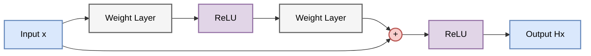
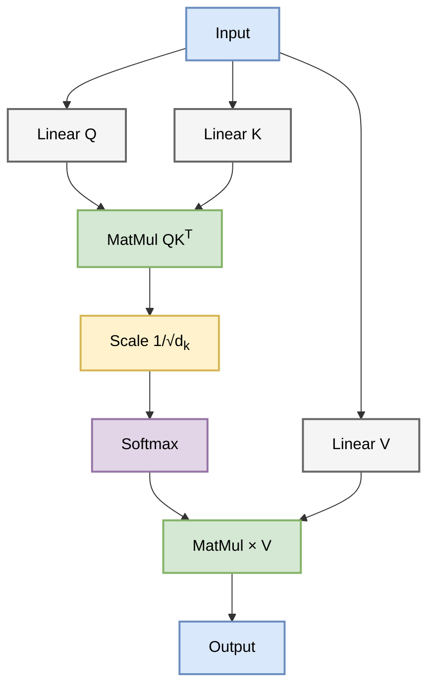
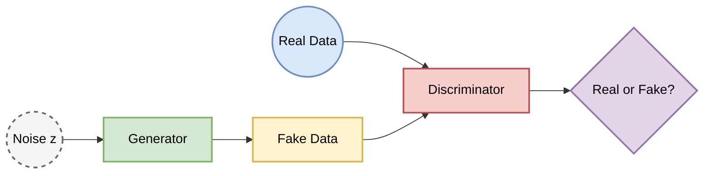
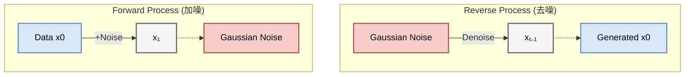

# 导论：人工智能演进史 (Introduction: The Evolution of AI)
**From Mathematical Logic to Multimodal Reasoning Systems (1943-2026)**

> 本章作为全书导论，旨在从技术和数学角度综述人工智能发展的核心阶段。我们将追溯至计算智能的起源，并重点关注近十年深度学习模型的范式转移、优化目标的演变以及生成式建模的理论基础。

人工智能的发展史，本质上是人类试图用**数学语言描述智能**的探索史。从早期的符号逻辑推演，到统计学习的函数拟合，再到如今大模型的概率生成，这一过程经历了数次范式革命。

---

## 0. 史前纪元与逻辑的黎明 (1943-2012)

为了更直观地理解 AI 的发展脉络，我们首先看一张涵盖 80 年历程的时间轴：

```mermaid
graph LR
    %% 时间节点定义
    T1943[1943<br/>M-P 模型]
    T1958[1958<br/>感知机]
    T1986[1986<br/>BP 算法]
    T2012[2012<br/>AlexNet]
    T2017[2017<br/>Transformer]
    T2020[2020<br/>GPT-3]
    T2022[2022<br/>ChatGPT]
    T2024[2024<br/>多模态与推理模型]
    T2025[2025<br/>RL 推理模型]
    T2026[2026<br/>统一模型与 Agent 工具链]

    %% 连接
    T1943 --> T1958
    T1958 --> T1986
    T1986 --> T2012
    T2012 --> T2017
    T2017 --> T2020
    T2020 --> T2022
    T2022 --> T2024
    T2024 --> T2025
    T2025 --> T2026

    %% 样式
    classDef blue fill:#DAE8FC,stroke:#6C8EBF,stroke-width:2px,color:#000000;
    classDef green fill:#D5E8D4,stroke:#82B366,stroke-width:2px,color:#000000;
    classDef yellow fill:#FFF2CC,stroke:#D6B656,stroke-width:2px,color:#000000;
    classDef red fill:#F8CECC,stroke:#B85450,stroke-width:2px,color:#000000;
    classDef purple fill:#E1D5E7,stroke:#9673A6,stroke-width:2px,color:#000000;

    class T1943,T1958 blue;
    class T1986,T2012 green;
    class T2017 yellow;
    class T2020 red;
    class T2022,T2024,T2025,T2026 purple;
```

在深度学习爆发之前，AI 经历了两大流派的漫长博弈：符号主义 (Symbolism) 与 连接主义 (Connectionism)。关于连接主义的核心数学基础，详见 **[Chapter 1.1](chapter_01/1.1_ai_paradigms.md)**。

### 0.1 逻辑微积分与图灵的追问 (The Genesis)
*   **1943 (M-P 模型)**: 神经生理学家 McCulloch 和数学家 Pitts 发表了《神经活动中内在思想的逻辑演算》。他们证明了简化的神经元模型（M-P 神经元）可以计算任何可计算函数（如果网络足够大）。这是**生物学与数理逻辑的初次联姻**。这一模型奠定了感知机的基础（详见 **[Chapter 1.2](chapter_01/1.2_perceptron_and_limits.md)**）。
*   **1950 (Turing Test)**: 图灵在《计算机器与智能》中提出了著名的图灵测试，给出了智能的**操作性定义**：如果机器的行为无法与人类区分，则称其具有智能。
*   **1956 (Dartmouth Workshop)**: 麦卡锡、明斯基、香农等人正式提出了"人工智能"这一术语，标志着 AI 学科的诞生。

### 0.2 符号主义的兴衰：推理即计算
早期的 AI（GOFAI）坚信 **"物理符号系统假设"**：智能的本质是对符号的操作。
*   **方法论**：人工编写规则 (Rule-based) 和逻辑推理 (Logic Inference)。
*   **成就**：专家系统（如 MYCIN）、国际象棋程序（Deep Blue）。
*   **困境**：莫拉维克悖论 (Moravec's Paradox) —— 只有高阶推理对计算机很容易（如下棋），而低阶感知对计算机极难（如识别猫）。符号系统无法处理现实世界的模糊性和不确定性。

### 0.3 连接主义的蛰伏与统计学习的统治
*   **感知机 (Perceptron, 1958)**: Rosenblatt 提出的单层网络因无法解决 XOR 问题（Minsky & Papert, 1969）而导致 AI 进入第一次寒冬。
*   **反向传播 (Backpropagation, 1986)**: Hinton 等人复兴了 BP 算法，使得多层网络训练成为可能（详见 **[Chapter 2.1](chapter_02/2.1_foundations_and_math.md)**）。
*   **统计学习 (1995-2010)**: 在神经网络受限于算力和数据时，SVM (支持向量机) 和 **Random Forest** 等基于统计理论的模型统治了这一时期（详见 **[Chapter 1.4](chapter_01/1.4_statistical_learning_era.md)**）。它们拥有严谨的凸优化边界（Convex Optimization）和核技巧（Kernel Tricks）。

---

## 1. 第一阶段：深度架构的成熟与序列建模的困境 (2012-2017)

随着算力的提升和大数据时代的到来，神经网络迎来了复兴。

2012 年 AlexNet 的出现标志着连接主义的全面复兴（详见 **[Chapter 2.2](chapter_02/2.2_cnn_architectures.md)**）。核心数学突破在于解决了深层网络的梯度传播问题。

### 1.1 残差学习 (Residual Learning)

ResNet (2015) 的提出打破了深度网络的深度限制。简单来说，它给网络加了"短路"机制，让信息有了一条高速公路。

*   **直观解释**：
    以前的网络像"传话游戏"，传了100层后信息早就失真了。ResNet 允许信息直接跳过某些层（Skip Connection），就像在传话的同时，还保留了一份原始小纸条。这样即使中间层学废了，至少还能保留上一层的结果。

*   **数学形式**：
    假设目标映射为 $H(x)$，网络不再直接拟合 $H(x)$，而是拟合残差映射 $F(x) := H(x) - x$。
    $$y_l = h(x_l) + F(x_l, W_l)$$
    $$x_{l+1} = f(y_l)$$

*   **架构示意图**：

*   **技术分析**：
    在反向传播中，公式中的常数项 $1$ 确保了梯度可以无损地传回浅层，从根本上解决了 梯度消失 (Vanishing Gradient) 问题。

### 1.2 序列建模的瓶颈

当时的 NLP 依赖 LSTM/GRU，它们像阅读一样逐字处理（详见 **[Chapter 2.4](chapter_02/2.4_lstm_and_seq2seq.md)**）。

*   **局限性**：
    RNN 必须读完第一个字才能读第二个字（串行计算，无法并行），速度慢。而且读到第100个字时，可能已经忘了第1个字是什么了（长距离依赖问题），虽然 LSTM 用"遗忘门"缓解了这个问题，但本质瓶颈依然存在。

---

## 2. 第二阶段：Transformer 范式与自注意力机制 (2017-2020)

RNN 的串行瓶颈促使研究者寻找并行化的解决方案。

*Attention Is All You Need (2017)* 的发表标志着现代 LLM 时代的开端（详见 **[Chapter 3](chapter_03/3.1_attention_mechanisms.md)**）。核心思想从"逐个看"变成了"一眼看全貌"。

### 2.1 自注意力机制 (Self-Attention) 的几何意义

Transformer 抛弃了递归，完全基于注意力（详见 **[Chapter 3.2](chapter_03/3.2_transformer_architecture.md)**）。

*   **直观解释**：
    在翻译"苹果"这个词时，模型会同时关注句子里的其他词。如果是"吃了一个苹果"，它会关注"吃"；如果是"苹果电脑"，它会关注"电脑"。这种"关注"是通过计算词与词之间的相似度（内积）来实现的。

*   **核心算子**：
    Math $$\text{Attention}(Q, K, V) = \text{softmax}\left(\frac{QK^T}{\sqrt{d_k}}\right)V$$

*   **流程示意图**：

*   **技术细节**：
    *   **$QK^T$**: 计算相关性，就像在查数据库，Query（查询）和 Key（索引）匹配程度越高，Value（内容）的权重就越大。
    *   **$\frac{1}{\sqrt{d_k}}$**: 这是一个缩放因子。如果不除以它，内积结果会很大，导致 Softmax 输出非0即1，梯度消失，模型就学不动了。

### 2.2 位置编码 (Positional Encoding)

因为 Self-Attention 是"一锅烩"（并行处理），它不知道"我爱你"和"你爱我"的区别。所以必须人为给每个词打上位置标签（Positional Encoding），告诉模型哪个词在前面，哪个在后面（详见 **[Chapter 3.3](chapter_03/3.3_positional_encoding_and_norm.md)**）。

### 2.3 预训练目标：BERT vs GPT

*   **BERT (填空题)**: 把句子中间挖掉一个词让模型填（详见 **[Chapter 4.2](chapter_04/4.2_bert_architecture.md)**）。它能看到上下文，适合做阅读理解。
*   **GPT (接龙题)**: 只给上文，让模型猜下一个词（详见 **[Chapter 4.3](chapter_04/4.3_gpt_generative_models.md)**）。这种自回归形式非常适合生成、对话和工具调用；它并非唯一可行范式，但已经成为通用交互式 AI 系统的主干接口。

---

## 3. 第三阶段：生成式模型的爆发——从 GAN 到 Diffusion (2014-2022)

生成模型的目标从简单的分类预测转向了对数据分布的直接建模。

在图像生成领域，技术路径经历了从"左右互搏"到"热力学扩散"的转变（详见 **[Chapter 6.1](chapter_06/6.1_multimodal_ai.md)**）。

### 3.1 生成对抗网络 (GAN)

*   **直观解释**：
    GAN 就像**假钞制造者 (Generator)** 和 **警察 (Discriminator)** 的博弈。
    *   制造者努力画出逼真的假图骗过警察。
    *   警察努力分辨真图和假图。
    *   两者在竞争中共同进化，最后制造者的画技达到炉火纯青。

*   **架构示意图**：

### 3.2 扩散模型 (Diffusion Models) 的统治

Diffusion Model (DDPM) 利用物理热力学原理，打败了 GAN。

*   **直观解释**：
    *   **前向过程 (加噪)**：把一滴墨汁滴入清水（清晰图片），随着时间推移，最后变成一杯浑浊的墨水（高斯噪声）。
    *   **反向过程 (去噪)**：让时光倒流，从一杯浑浊的墨水中，一点点推断出墨汁最初扩散的轨迹，还原出清水（清晰图片）。

*   **过程示意图**：

*   **数学本质**：
    扩散模型不再像 GAN 那样直接生成图片，而是学习分数函数 (Score Function)，也就是学习"如何把噪声变小一点点"的梯度方向。这使得训练过程极其稳定。

---

## 4. 第四阶段：大模型时代——Scaling Law, Alignment & Reasoning (2020-Present)

当数据和算力达到一定规模时，量变引起了质变。

这一阶段的核心在于模型参数量突破临界点（>10B/100B）后，量变引起了质变（详见 **[Chapter 5](chapter_05/5.1_instruction_tuning.md)**）。

### 4.1 缩放定律 (Scaling Laws)
Kaplan 等人发现，在一定训练设定下，模型的损失（Loss）与计算量、数据量、参数量呈现近似**幂律关系**（详见 **[Chapter 4.3](chapter_04/4.3_gpt_generative_models.md)**）。这一经验规律为规模化训练提供了可预测性，但它并不意味着模型会“无限变强”：数据质量、推理成本、评测污染、对齐方式和真实任务分布都会改变收益曲线。

### 4.2 对齐技术 (Alignment) 与 RLHF
预训练模型不仅需要语言建模能力，还需要符合人类指令、偏好与安全约束。RLHF (Reinforcement Learning from Human Feedback) 是一种利用人类偏好数据进行后训练的方法（详见 **[Chapter 5.2](chapter_05/5.2_rlhf_and_alignment.md)**）。

*   **流程**：
    1.  **SFT**: 使用人工撰写或筛选的指令-回复数据进行有监督微调。
    2.  **Reward Model**: 对同一提示下的多个回答进行人类偏好排序，并训练奖励模型。
    3.  **PPO**: 使用强化学习优化策略模型，使其更符合奖励模型给出的偏好信号。

### 4.3 思维链 (Chain of Thought, CoT)
思维链提示是大模型推理研究中的重要现象（详见 **[Chapter 6.2](chapter_06/6.2_agents_and_reasoning.md)**）。
*   **现象**：在数学、符号推理和多步问答任务中，要求模型生成中间推理步骤往往能提高准确率。
*   **本质**：CoT 将一个复杂的输入-输出映射拆分为多个中间变量建模问题，相当于增加了测试时计算深度。

---

## 5. 第五阶段：多模态推理系统与架构效率 (2023-2026)

随着多模态模型、长上下文模型、开放权重模型和推理模型的发展，大模型研究进入了多模态、工具调用、检索增强和测试时计算共同演进的阶段。2024-2026 年，研究与工程实践的重点从单纯的"堆预训练算力"扩展为三条并行路线：**训练时规模化**、**测试时计算**与**系统工程化**。

截至 2026 年 6 月，公开 API 和开发者文档中的代表性系统已经从 GPT-4o/o1、Gemini 1.5、DeepSeek-R1 这一代，推进到 GPT-5.5 / GPT-5.6 preview、Gemini 3.x / 3.5 Flash、DeepSeek V4 Pro / V4 Flash 等模型族。具体名称会快速变化，因此本节更关注它们共同体现出的技术趋势，而不是逐一排序模型能力。

### 5.1 推理模型 (Reasoning Models / System 2)
预训练规模化仍然重要，但高难数学、代码、科学问题让研究者重新重视 **测试时计算 (Test-time Compute)**：模型在回答前投入更多采样、搜索、验证或隐式思维链计算。
*   **代表性系统**: o1/o3、DeepSeek-R1、GPT-5.x thinking/reasoning 类模型、DeepSeek V4 Pro 等系统显示，强化学习、偏好优化、可验证奖励与更长的测试时计算可以显著改善数学、代码和多步推理任务。更准确地说，这不是从"概率预测"彻底变成"符号逻辑"，而是把概率模型、搜索、验证和后训练奖励组合成了更强的推理系统。
*   **局限性**: 推理模型在数学和代码上提升明显，但代价是更高延迟和更多推理 token；它们仍会幻觉、过度思考、遗漏事实或在简单问题上犯错。

### 5.2 架构效率与长窗口 (Efficiency & Long Context)
在模型参数量不断膨胀的背景下，架构效率成为独立研究主题。
*   **MLA 与 MoE**: DeepSeek-V3 等系统采用 **MLA (Multi-head Latent Attention)** 压缩 KV Cache，并使用 MoE 让每个 token 只激活部分专家，实现"总参数量很大、单次计算量相对较小"的效率权衡。
*   **长上下文建模**: Gemini 1.5 之后，Gemini 3.x、GPT-5.x 等系统继续把长上下文作为基础能力。这让模型能够一次性处理长视频、大型代码库和长文档，但成本、延迟以及长输入信息利用的稳健性仍是现实限制。
*   **开放权重模型**: Llama、Qwen、Mistral、DeepSeek 等开放权重模型推动了可复现实验、领域微调、本地部署和模型压缩研究。它们的重要性不只在于性能追赶，也在于降低了研究和应用验证的进入门槛。

### 5.3 物理世界模拟与非 Transformer 架构
*   **原生多模态建模**: 早期多模态系统常由语音识别、文本模型、语音合成等模块串联而成；GPT-4o、Gemini 3.5 Flash 等系统尝试在同一模型或紧密耦合架构中处理文本、视觉和音频，使实时语音、视觉理解和跨模态交互成为研究对象。
*   **视频生成模型**: Sora 等视频生成系统将扩散模型、Transformer 和视频 patch 表示结合，展示了更长时序、更强一致性的视频生成能力。但视觉上逼真的时空连续性并不等价于显式物理建模：这类模型仍会在因果、刚体、空间左右和复杂交互上出错。
*   **Linear Attention / SSM**: Mamba 和 RWKV 等架构继续探索打破 $O(N^2)$ 复杂度限制，试图在长序列任务中替代 Transformer。

### 总结

近十年的发展是从**人工设计特征**到**人工设计架构**，再到**自动学习通用表征**的过程。近期研究不再只关注更大的模型，也关注由基础模型、检索、工具、记忆、验证器、执行环境和人类反馈共同组成的系统。所谓 “System 2” 更像是一组可研究的计算机制：分配更多测试时计算、调用外部工具、验证候选答案，并在证据不足时输出不确定性。
