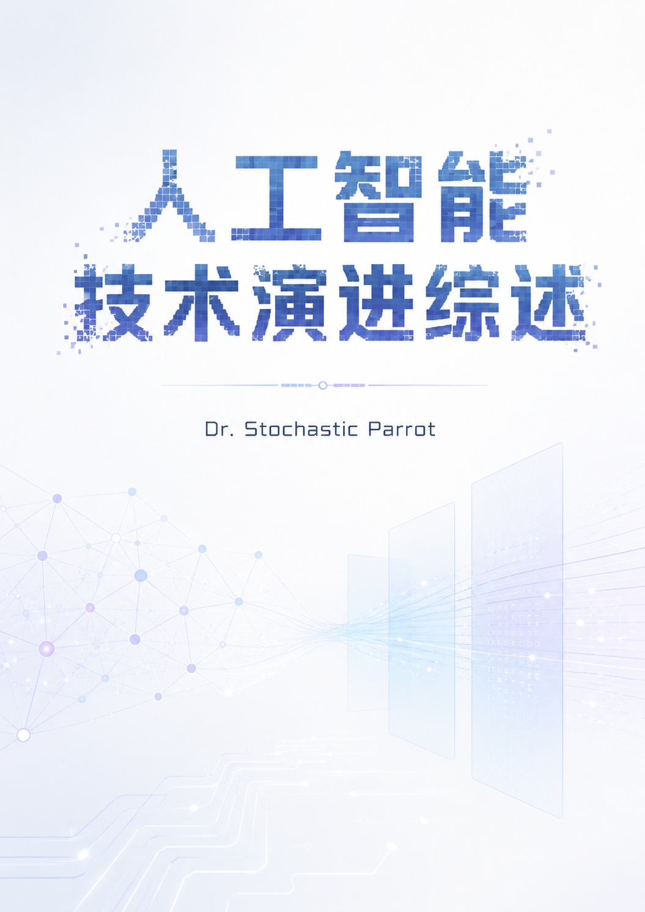

# 人工智能技术演进综述 (AI Technical Survey)

**署名作者：Dr. Stochastic Parrot**

  

这是一本关于人工智能（AI）发展与前沿技术的开源综述型讲义。本书致力于梳理人工智能领域的关键技术突破、发展历程、数学基础与核心实践经验。

## 教材定位

本书定位为普通级别的 AI 技术综述教材，而不是严格数学证明教材或工程手册。正文以概念、历史脉络、核心架构和关键训练范式为主；公式用于说明机制，附录提供可选的数学补充，读者可以按需跳读。

适合的阅读方式是：先顺序阅读导论与六章正文，建立从符号主义、神经网络、Transformer、预训练、对齐到多模态、Agent 基础与 Agent 系统工程的整体框架；遇到反向传播、优化、正则化、注意力或偏好优化等细节时，再回到附录查阅推导。

本轮技术内容校准截至 **2026 年 7 月 12 日**。涉及 2024 年之后模型、论文与产品形态的部分只作为技术路线例子，不构成稳定的能力排名；正文优先引用论文、技术报告、系统卡或协议规范。具体 API 名称、可用范围、价格、上下文长度和能力边界仍应以相应官方文档为准。

## 目录结构

本目录包含了书籍的 Markdown 源文件。你可以通过阅读以下内容来了解本书：

- `introduction.md` - 引言
- `chapter_01.md` ~ `chapter_06.md` - 六章正文，每章一个 Markdown 文件
- `chapter_01` ~ `chapter_06` - 各章配套图片与生成脚本目录
- `appendix` - 附录及补充资料
- `references.md` - 参考文献
- `IMAGE_GENERATION_MAP.md` - 图像生成技术相关映射

## 许可协议 (License)

本书内容采用 **[CC0 1.0 Universal](../../LICENSE.md)** 发布。

详细的许可条款请参阅项目根目录下的 [`LICENSE.md`](../../LICENSE.md) 文件。

### 核心条款简述：
- **自由使用**：您可以使用、复制、修改、翻译、发布、分发、再许可或销售本作品副本。
- **无需署名**：不要求保留作者署名、版权声明或来源说明。
- **无担保**：本作品按原样提供，不附带任何形式的保证。
