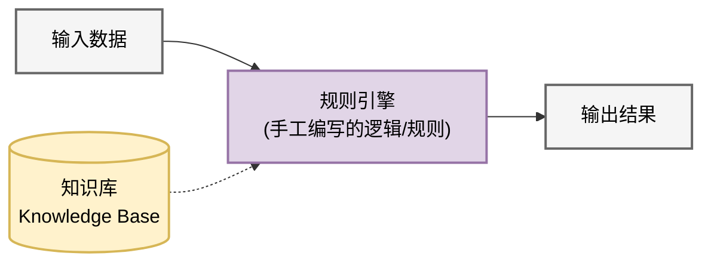
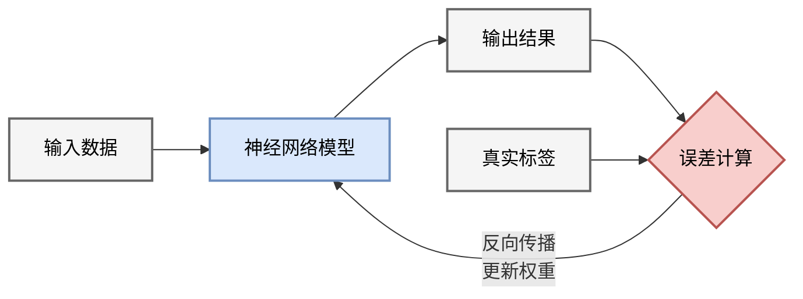
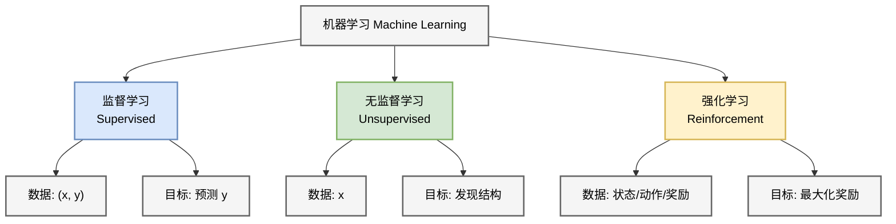
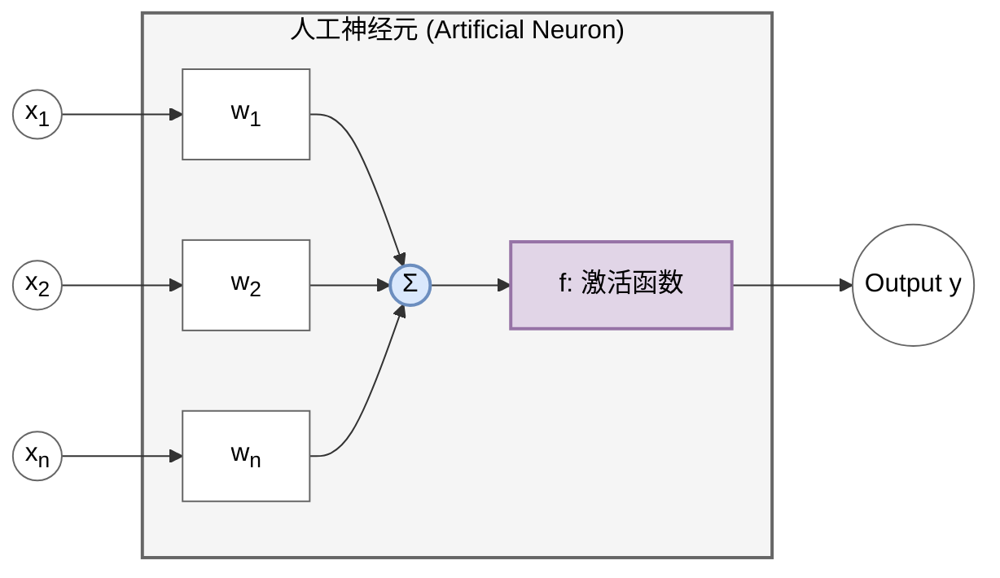
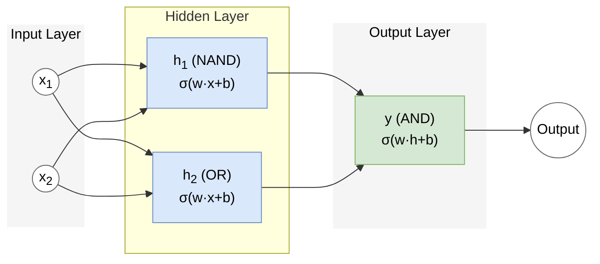
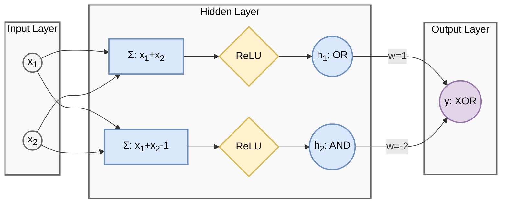
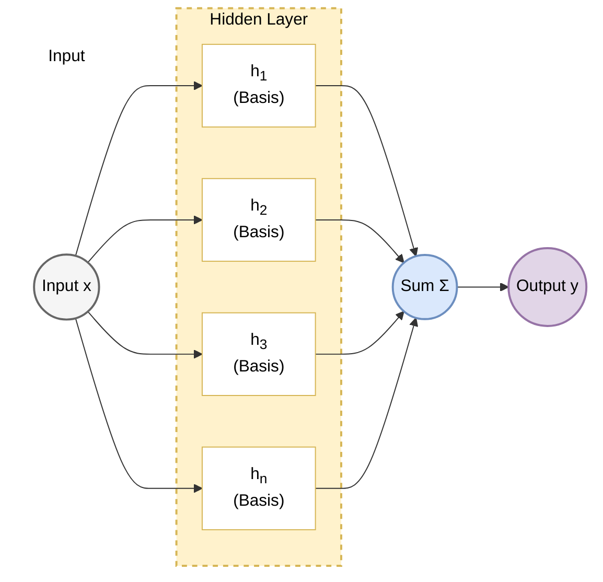
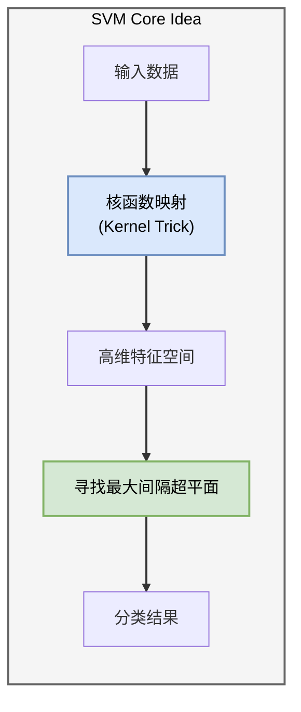
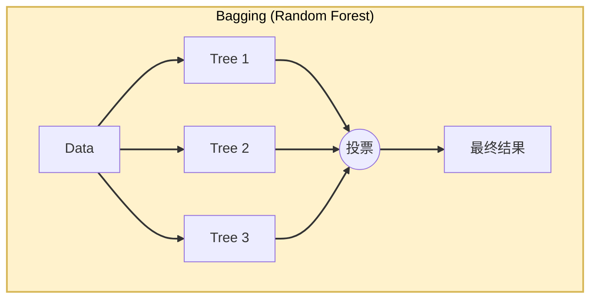
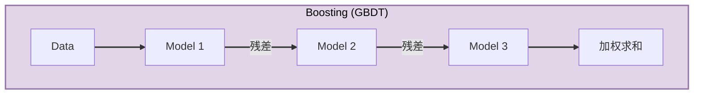

# 第一章 AI 范式、感知机与早期连接主义

## 1.1 人工智能的两大范式：符号主义与连接主义
### 1.1 The Two Paradigms: Symbolism vs Connectionism

在深入现代深度学习之前，理解人工智能（AI）的历史与哲学根基至关重要。AI 的发展史并非线性上升，而是 **符号主义** 与 **连接主义** 两大流派长达半个世纪的博弈与融合。

#### 1.1.1 符号主义 (Symbolism)：逻辑与推理的殿堂

符号主义（又称逻辑主义、GOFAI - Good Old-Fashioned AI）在 20 世纪 50 年代至 80 年代占据统治地位。

*   **直观类比 (Intuition)**：
    符号主义就像**查字典**或**遵循法律条文**。即使你不懂“法外狂徒”是什么意思，只要字典里写着“法外狂徒=张三”，你就能通过逻辑推导出“抓捕法外狂徒”等于“抓捕张三”。所有的规则都是人写好的，机器只是在执行严密的逻辑演绎。

*   **核心假设**：人类智能的本质是对物理符号系统的操作 (Physical Symbol System Hypothesis)。
*   **处理流程示意**：

*   **方法论**：
    1.  将世界知识形式化为显式的 **规则 (Rules)** 和 **符号 (Symbols)**。
    2.  利用形式逻辑（如一阶逻辑）进行推理和搜索。
*   **代表成果**：
    *   **逻辑理论家 (Logic Theorist, 1956)**：证明了罗素《数学原理》中的定理。
    *   **专家系统 (Expert Systems, 1980s)**：如 MYCIN（医疗诊断）和 Deep Blue（国际象棋）。
*   **数学基础**：集合论、图论、数理逻辑。
*   **局限性**：
    *   知识获取瓶颈：难以将隐性知识（如如何识别一张脸、如何骑自行车）形式化为规则。
    *   脆性 (Brittleness)：遇到规则之外的情况系统会直接崩溃，缺乏泛化能力。
    *   符号落地问题 (Symbol Grounding Problem)：符号本身没有内在含义，只能与其他符号相关联，无法与真实物理世界对应。

#### 1.1.2 连接主义 (Connectionism)：大脑的模拟

连接主义（即神经网络学派）受神经科学启发，认为智能涌现于大量简单单元的并行连接中。

*   **直观类比 (Intuition)**：
    连接主义就像**教小孩骑自行车**。你没法写一套“如果车身向左倾斜30度，则右手施加5牛顿力”的规则给他。你只能让他不断尝试，摔倒了就调整姿势（更新权重），骑稳了就记住这种感觉（强化连接）。智能不是被灌输的，而是从经验中“生长”出来的。

*   **核心假设**：智能源通过 **调整连接权重 (Weight Adjustment)** 从数据中 **学习 (Learning)** 得到，而非人工预设。
*   **处理流程示意**：

*   **方法论**：
    1.  构建模拟生物神经元的计算模型。
    2.  定义目标函数（Loss Function）。
    3.  通过优化算法（如梯度下降）自动调整权重。
*   **发展历程**：
    *   **起步 (1943-1969)**：McCulloch-Pitts 神经元，Rosenblatt 感知机。
    *   **寒冬 (1969-1986)**：Minsky 指出感知机无法解决异或 (XOR) 问题。
    *   **复兴 (1986-1995)**：Hinton 等人推广反向传播 (Backpropagation)，多层感知机 (MLP) 兴起。
    *   **爆发 (2012-Present)**：深度学习 (Deep Learning) 结合大数据与算力，在视觉、语音、自然语言和生成建模等领域成为主流方法。

#### 1.1.3 现代视角的融合：神经符号系统 (Neuro-Symbolic AI)

当前的 GPT-4 以及后续多模态/推理模型虽然主要基于连接主义（Transformer 及其变体），但已经能通过提示、工具调用、搜索和后训练表现出相当强的推理能力。未来的方向很可能不是回到纯符号主义，而是在神经网络主干外接可验证的符号工具、检索系统和规划器：
*   **系统 1 (System 1)**：基于直觉、快速、无意识的模式识别（连接主义擅长）。
*   **系统 2 (System 2)**：基于逻辑、慢速、有意识的顺序推理（符号主义擅长）。

#### 1.1.4 机器学习分类

在连接主义范式下，我们通常根据**信号反馈**的不同将机器学习分为三类：

1.  **监督学习 (Supervised Learning)**：
    *   数据：$(\mathbf{x}, y)$ 对，有明确标签。
    *   目标：学习映射 $f: \mathbf{x} \to y$。
    *   应用：图像分类、机器翻译。
2.  **无监督学习 (Unsupervised Learning)**：
    *   数据：只有 $\mathbf{x}$，无标签。
    *   目标：发现数据内部结构（聚类、降维、生成）。
    *   应用：用户画像、异常检测、生成式 AI (GenAI)。
3.  **强化学习 (Reinforcement Learning)**：
    *   数据：状态 $\mathbf{s}$、动作 $\mathbf{a}$、奖励 $r$ 的序列。
    *   目标：学习策略 $\pi(\mathbf{a}|\mathbf{s})$ 以最大化长期累积奖励。
    *   应用：AlphaGo、机器人控制、大模型对齐 (RLHF)。

---

本章后续将聚焦于**连接主义**的基础组件，从最简单的神经元开始，一步步构建出深度学习的宏伟大厦。

## 1.2 感知机与异或危机：神经网络的黎明
### 1.2 The Perceptron and The XOR Crisis

所有的复杂网络都始于一个简单的单元。本节我们将解剖深度学习的“原子”——神经元模型，并回顾 AI 历史上的第一次重大挫折，理解**线性可分性**这一关键概念。

#### 1.2.1 生物神经元与人工神经元 (M-P Neuron)

1943 年，心理学家 McCulloch 和数学家 Pitts 提出了第一个人工神经元模型（M-P 模型）。

*   **生物原型**：
    *   **树突 (Dendrites)**：接收来自其他神经元的电化学信号。
    *   **细胞体 (Soma)**：汇总所有输入信号。
    *   **轴突 (Axon)**：当信号总和超过阈值时，发放脉冲（Action Potential）。
*   **数学抽象**：
    Math $$ y = f(\sum_{i=1}^n w_i x_i - \theta) $$
    *   $x_i$：输入信号。
    *   $w_i$：突触权重（正值为兴奋性，负值为抑制性）。
    *   $\theta$：阈值 (Threshold)。
    *   $f$：激活函数，当时为阶跃函数 (Step Function)。

#### 1.2.2 Rosenblatt 感知机 (Perceptron)

1958 年，Frank Rosenblatt 提出了感知机，并设计了首个训练算法，使得机器能够“学习”权重。

*   **直观类比 (Intuition)**：
    想象你在决定**是否去相亲**。你心里有几个衡量标准（输入 $x$）：长相、收入、性格。但每个标准在你心里的分量（权重 $w$）不同。
    *   长相（权重 0.8）：很重要。
    *   收入（权重 0.5）：还行。
    *   性格（权重 0.2）：不太在乎。
    如果 $0.8 \times \text{长相} + 0.5 \times \text{收入} + 0.2 \times \text{性格}$ 超过了你心里的门槛（阈值 $\theta$），你就去（输出 1），否则就不去（输出 0）。感知机的学习过程，就是通过一次次相亲的成败，不断调整这些权重和门槛的过程。

*   **模型定义 (Mathematical Definition)**：
    Math $$ y = \text{sign}(\mathbf{w}^T \mathbf{x} + b) $$
    其中 $b = -\theta$ 为偏置项 (Bias)，$\mathbf{w}$ (Weights) 和 $\mathbf{x}$ (Inputs) 均为向量。

*   **几何意义 (Geometric Interpretation)**：
    在二维空间中，$w_1 x_1 + w_2 x_2 + b = 0$ 定义了一条直线（高维空间中为超平面 Hyperplane）。感知机实际上是一个**线性分类器 (Linear Classifier)**，将空间切分为正类 ($y=1$) 和负类 ($y=-1$)。

    

#### 1.2.3 感知机学习算法 (PLA)

Rosenblatt 提出的 PLA (Perceptron Learning Algorithm) 极其直观：**知错能改**。本节我们将通过几何直觉和梯度下降两种视角来推导其更新公式。

##### 1. 几何直觉视角 (Geometric View)

*   **直观类比 (Intuition)**：
    假设你在玩“盲人摸象”的游戏，试图划一条线把苹果和梨分开。
    *   你随便划了一条线（初始化）。
    *   你拿起一个水果，发现它在线的左边，但它其实是应该在右边的梨（预测错误）。
    *   你就把线往梨的方向挪一点点（更新权重）。
    *   重复这个过程，直到所有水果都分对了。

1.  初始化权重 $\mathbf{w}$ 为 0 或随机值。
2.  对每一个训练样本 $(\mathbf{x}, y)$：
    *   如果预测正确 ($\text{sign}(\mathbf{w}^T \mathbf{x}) == y$)，不做改变。
    *   如果预测错误（例如 $y=+1$ 但预测为 $-1$），说明 $\mathbf{w}^T \mathbf{x}$ 太小了，甚至为负数。我们需要调整 $\mathbf{w}$ 使得它更接近 $\mathbf{x}$ 的方向（增大内积）。
        $$ \mathbf{w} \leftarrow \mathbf{w} + \eta y \mathbf{x} $$
        （其中 $\eta$ 为学习率 Learning Rate）
3.  重复直到所有样本都被正确分类。

##### 2. 数学推导视角：随机梯度下降 (SGD)

PLA 本质上是基于特定损失函数的**随机梯度下降 (Stochastic Gradient Descent, SGD)** 算法。

**Step 1: 定义损失函数 (Loss Function)**

我们如何定义“错误”？直接计算误分类点的数量是离散且不可导的。感知机采用的策略是：最小化**误分类点到超平面的总距离**（忽略常数分母 $\|\mathbf{w}\|$）。

对于误分类点集合 $\mathcal{M}$，损失函数定义为：
$$ L(\mathbf{w}, b) = - \sum_{\mathbf{x}_i \in \mathcal{M}} y_i (\mathbf{w}^T \mathbf{x}_i + b) $$
*   **分析**：
    *   对于正确分类点， $y_i (\mathbf{w}^T \mathbf{x}_i + b) > 0$，不计入损失。
    *   对于误分类点， $y_i$ 与预测值 $(\mathbf{w}^T \mathbf{x}_i + b)$ 符号相反，故乘积为负，取负号后 $L$ 为正数。
    *   我们的目标是最小化这个正数。

**Step 2: 计算梯度 (Gradient Calculation)**

我们要通过调整 $\mathbf{w}$ 来最小化 $L$。计算 $L$ 对 $\mathbf{w}$ 的梯度：
$$ \nabla_{\mathbf{w}} L = - \sum_{\mathbf{x}_i \in \mathcal{M}} y_i \mathbf{x}_i $$

**Step 3: 参数更新 (Parameter Update)**

使用 SGD（关于 SGD 的详细数学推导请参阅 [附录 A.1](appendix/a.1_optimization_basics.md)），每次随机选取一个误分类点 $(\mathbf{x}_i, y_i)$ 进行更新。
按照梯度下降规则 $\mathbf{w} \leftarrow \mathbf{w} - \eta \nabla_{\mathbf{w}} L_{sample}$：
$$ \mathbf{w} \leftarrow \mathbf{w} - \eta (- y_i \mathbf{x}_i) $$
$$ \mathbf{w} \leftarrow \mathbf{w} + \eta y_i \mathbf{x}_i $$

这正是 PLA 的更新公式！它从数学上严谨地证明了算法是在沿着减少误差的方向前进。

**收敛性定理 (Convergence Theorem)**：
如果数据是**线性可分 (Linearly Separable)** 的，PLA 保证在有限步内收敛找到一个解。（详细数学证明请见 **[附录 A.2](appendix/a.2_perceptron_convergence.md)**）。

#### 1.2.4 异或 (XOR) 危机与第一次 AI 寒冬

1969 年，Minsky 和 Papert 出版了《Perceptrons》一书，指出了单层感知机的致命缺陷：**无法处理非线性可分问题**。

最经典的例子就是 **异或 (XOR)** 逻辑。

##### 1. 逻辑门的几何直观 (Geometric Intuition)

让我们将逻辑门的输入 $(x_1, x_2)$ 看作二维平面上的点，输出 $y$ 看作点的颜色（红色为 0，蓝色为 1）。

*   **AND 门**：只有当 $(1,1)$ 时输出 1。可以用一条直线完美分割。
*   **OR 门**：只要有一个 1 就输出 1。同样可以用一条直线分割。
*   **XOR 门**：当输入不同时输出 1。你会发现，无论如何都无法画出**一条直线**将红色点和蓝色点分开。

##### 2. 为什么这是个大问题？

单层感知机本质上是一个**线性分类器**（$w_1 x_1 + w_2 x_2 + b = 0$ 是一条直线）。XOR 问题的不可解，意味着感知机连最简单的逻辑运算都无法完全覆盖。

这个看似简单的结论（实际上 Minsky 同时也讨论了当时简单多层网络的训练困难）显著削弱了连接主义路线的吸引力。再叠加算力、数据、资金与符号主义预期落空等因素，AI 研究进入了长达十余年的低潮。

##### 3. 破局：多层感知机 (MLP)

直到 80 年代，人们才意识到：**增加一层隐藏层**，并配合 **非线性激活函数**，就可以解决 XOR 问题。这也标志着深度学习（Deep Learning）雏形的诞生。

> **关键点**：如果仅有隐藏层而没有非线性激活函数，多层网络在数学上等价于单层网络（线性变换的叠加仍是线性变换），依然无法解决问题。正是**非线性**的引入，让神经网络具备了“扭曲”空间的能力。

我们可以用组合逻辑来理解：$ \text{XOR}(x_1, x_2) = \text{OR}(x_1, x_2) \text{ AND } \text{NAND}(x_1, x_2) $。这里逻辑门的**阶跃函数**特性提供了必要的非线性。

通过引入**隐藏层**，我们将原始的线性不可分空间，扭曲/映射到了一个新的高维空间，在那个空间里，数据变得线性可分了。这正是深度学习的核心魅力所在。

## 1.3 多层感知机与激活函数：弯曲空间的艺术
### 1.3 Multilayer Perceptron (MLP) and Activation Functions

单层感知机的线性局限性将 AI 推入了寒冬。本节我们将展示如何通过引入 **隐藏层** 和 **非线性激活函数**，让神经网络获得“弯曲空间”的能力，从而解决异或（XOR）等复杂非线性问题。

解决 XOR 问题的关键在于**空间变换**。本节我们将探讨如何通过堆叠神经元来构建多层感知机 (MLP)，以及为什么非线性激活函数是深度学习的灵魂。

#### 1.3.1 隐藏层的魔力 (The Magic of Hidden Layers)

单层感知机只能画直线。如果我们有两层呢？

*   **直观类比 (Intuition)**：
    想象你在折纸。XOR 问题就像纸上有两类点（比如四个角，对角线是一类），不论怎么画直线都分不开。
    隐藏层的作用就是**把纸折叠起来**。通过折叠，原本相隔很远的点可能叠在了一起，或者原本纠缠的点被分到了不同的平面。在新的立体形状上，你只需要一刀（线性分割）就能把它们切开。

**解决 XOR 的数学构造**：

我们可以显式构造一个包含隐藏层的网络来解决 XOR 问题。假设输入 $\mathbf{x} = [x_1, x_2]^T \in \{0, 1\}^2$。

为了引入非线性，我们使用 **ReLU (Rectified Linear Unit)** 激活函数，其定义非常简单：
Math $$ \sigma(x) = \max(0, x) $$
即：正数保持不变，负数置为 0。

我们需要构建逻辑：$x_1 \text{ XOR } x_2 = (x_1 \text{ OR } x_2) \text{ AND } \text{ NOT } (x_1 \text{ AND } x_2)$。

定义隐藏层权重 $\mathbf{W}_1$ 和偏置 $\mathbf{b}_1$（构造两个神经元）：
*   神经元 1（模拟 OR）：$h_1 = \sigma(x_1 + x_2)$。如果 $x$ 有一个为 1，则 $h_1 \ge 1$。
*   神经元 2（模拟 AND）：$h_2 = \sigma(x_1 + x_2 - 1)$。只有 $x$ 全为 1，则 $h_2 \ge 1$。
    $$ \mathbf{W}_1 = \begin{bmatrix} 1 & 1 \\ 1 & 1 \end{bmatrix}, \quad \mathbf{b}_1 = \begin{bmatrix} 0 \\ -1 \end{bmatrix} $$
    $$ \mathbf{h} = \text{ReLU}(\mathbf{W}_1 \mathbf{x} + \mathbf{b}_1) $$

定义输出层权重 $\mathbf{w}_2$ 和偏置 $b_2$（模拟 $h_1 - h_2$）：
    $$ \mathbf{w}_2 = \begin{bmatrix} 1 \\ -2 \end{bmatrix}, \quad b_2 = 0 $$
    $$ y = \mathbf{w}_2^T \mathbf{h} + b_2 $$

**验证**：
1.  **[0, 0]**: $\mathbf{z} = [0, -1]^T \xrightarrow{\text{ReLU}} \mathbf{h} = [0, 0]^T \Rightarrow y = 0$ (正确)
2.  **[0, 1]**: $\mathbf{z} = [1, 0]^T \xrightarrow{\text{ReLU}} \mathbf{h} = [1, 0]^T \Rightarrow y = 1$ (正确)
3.  **[1, 0]**: $\mathbf{z} = [1, 0]^T \xrightarrow{\text{ReLU}} \mathbf{h} = [1, 0]^T \Rightarrow y = 1$ (正确)
4.  **[1, 1]**: $\mathbf{z} = [2, 1]^T \xrightarrow{\text{ReLU}} \mathbf{h} = [2, 1]^T \Rightarrow y = 1(2) - 2(1) = 0$ (正确)

**关键点：非线性的作用**
请注意神经元 2 在输入为 [0, 0] 时的表现：
*   线性组合结果：$0 + 0 - 1 = -1$。
*   ReLU 输出：$\max(0, -1) = 0$。
正是这个截断（非线性变换） 至关重要。
**如果去掉 ReLU（即使用线性网络）**：
$$ y_{linear} = 1 \cdot (x_1+x_2) - 2 \cdot (x_1+x_2-1) = -x_1 - x_2 + 2 $$
代入 [0, 0] 得到 $y=2 \ne 0$。这就是线性模型失败的原因——它无法在保持其他点正确的同时，单独把 [0, 0] 点的输出“压”下去。ReLU 的非线性“折叠”了空间，使得这成为可能。

**几何解释**：
隐藏层的作用是将原始输入空间（XOR 中扭曲在一起的点）映射到一个**新的特征空间** $\mathbf{h}$。

*   **左图（原始空间）**：红蓝点交错，无法用一条直线分开（线性不可分）。
*   **右图（隐藏空间）**：经过 ReLU 变换后，点 $(0,1)$和$(1,0)$ 被合并/映射到了同一个位置。在新的空间里，我们只需要画一条直线（$h_1 - 2h_2 = 0.5$）就能完美分割红蓝两类（线性可分）。

这就像把一张揉皱的纸（原始空间）展开，使得原来纠缠在一起的点可以被一刀（线性超平面）切开。

#### 1.3.2 为什么必须要有非线性激活函数？

如果我们简单地堆叠多层线性神经元：
$$ \mathbf{y} = \mathbf{W}_2 (\mathbf{W}_1 \mathbf{x} + \mathbf{b}_1) + \mathbf{b}_2 $$
$$ \mathbf{y} = (\mathbf{W}_2 \mathbf{W}_1) \mathbf{x} + (\mathbf{W}_2 \mathbf{b}_1 + \mathbf{b}_2) $$
$$ \mathbf{y} = \mathbf{W}_{new} \mathbf{x} + \mathbf{b}_{new} $$

**结论**：
**线性变换的组合仍然是线性变换**。无论你堆叠多少层线性层，它本质上等价于一个单层网络。它永远无法解决 XOR 问题。

因此，每一层之后必须引入一个非线性函数 $\sigma(\cdot)$：
Math $$ \mathbf{y} = \mathbf{W}_2 \sigma(\mathbf{W}_1 \mathbf{x} + \mathbf{b}_1) + \mathbf{b}_2 $$
这个 $\sigma$ 就是**激活函数**。它是神经网络能够拟合任意复杂曲线（万能近似）的关键。

#### 1.3.3 常见激活函数图鉴

1.  **Sigmoid / Logistic**

    

    *   **公式**：$\sigma(x) = \frac{1}{1+e^{-x}}$
    *   **导数性质**：$\sigma'(x) = \sigma(x)(1 - \sigma(x))$。
        *   推导：$\frac{d}{dx}(1+e^{-x})^{-1} = -(1+e^{-x})^{-2}(-e^{-x}) = \frac{1}{1+e^{-x}} \frac{e^{-x}}{1+e^{-x}} = \sigma(1-\sigma)$。
        *   当 $x=0$ 时导数最大为 0.25。这意味着每过一层 Sigmoid，梯度至少衰减 75%。这是梯度消失的数学根源。
    *   **优点**：将输出压缩到 (0,1)，适合做概率解释。
    *   **缺点**：
        *   **梯度消失**：如上所述，深层网络无法训练。
        *   **非零中心 (Non-zero-centered)**：输出恒为正，导致后续神经元的输入恒为正。这会使得反向传播时梯度方向呈现“Zigzag”形状（要么全正要么全负），收敛效率低。
        *   **指数运算昂贵**：在嵌入式设备上计算 $e^x$ 较慢。

2.  **Tanh (双曲正切)**

    

    *   **公式**：$\sigma(x) = \frac{e^x - e^{-x}}{e^x + e^{-x}}$
    *   **导数性质**：$\sigma'(x) = 1 - \sigma(x)^2$。
        *   导数最大值为 1 (在 $x=0$)。相比 Sigmoid 缓解了梯度消失，但深层网络中依然存在。
    *   **优点**：输出范围 (-1, 1)，以 0 为中心，优于 Sigmoid。
    *   **缺点**：
        *   **梯度消失**：当 $|x|$ 很大时（饱和区），导数趋近于 0。例如输入 $x=10$，梯度几乎为 0，网络停止学习。

3.  **ReLU (Rectified Linear Unit)**

    

    *   **公式**：$\sigma(x) = \max(0, x)$
    *   **现代标配**。（注：虽然其形式简单，但直到 2011 年左右，随着 Deep Learning 的复兴，它才真正取代 Sigmoid 成为主流。在此之前的寒冬期，学术界普遍认为激活函数必须是光滑且有界的。）
    *   **优点**：
        *   **计算简单**：只需判断正负。
        *   **缓解梯度消失**：正区间导数恒为 1，有助于梯度在深层网络中传播；但它不能单独解决所有深层训练问题。
        *   **稀疏激活**：负区间为 0，模拟了生物神经元的稀疏发放特性。
    *   **缺点**：
        *   **Dead ReLU (神经元死亡)**：如果某个神经元在一次更新后，其权重使得对于所有训练样本的输入都 $<0$，那么该神经元输出永远是 0，梯度也永远是 0。它从此“死”了，再也不会更新。这通常发生在使用大学习率时。

4.  **Leaky ReLU**

    

    *   **公式**：$\sigma(x) = \max(\alpha x, x)$，其中 $\alpha$ 是一个小常数（如 0.01）。
    *   **改进点**：
        *   在负区间给予一个很小的梯度（$\alpha$），保证神经元“虽死犹生”，总有机会复活（解决 Dead ReLU）。

5.  **GELU (Gaussian Error Linear Unit)**

    

    *   **公式**：$\text{GELU}(x) = x \Phi(x) = x \cdot \frac{1}{2}\left[1 + \text{erf}\left(\frac{x}{\sqrt{2}}\right)\right]$
        其中 $\Phi(x)$ 是标准正态分布的累积分布函数。
    *   **Transformer (BERT/GPT) 的标配**。
    *   **直觉**：它不是像 ReLU 那样硬性截断，而是根据 $x$ 的值以概率 $\Phi(x)$ 保持输入。当 $x$ 很大时，保持原值；当 $x$ 很小时，趋近于 0。
    *   **优势**：在 0 附近比 ReLU 更平滑（处处可导），允许微小的负值，这在训练深层 Transformer 时能提供更稳定的梯度。

6.  **Swish**

    

    *   **公式**：$\text{Swish}(x) = x \cdot \sigma(\beta x)$，其中 $\sigma$ 是 Sigmoid 函数。
    *   **背景**：由 Google 团队通过自动搜索技术（AutoML）发现的激活函数。
    *   **特性**：
        *   与 GELU 形态相近，都具备无上界、有下界、平滑、非单调的特性。
        *   在深层网络中通常能取得比 ReLU 更好的效果。

#### 1.3.4 通用近似定理：直观理解 (Universal Approximation Theorem)

了解了各种各样的激活函数后，一个自然的问题浮出水面：**如果我们把足够多的非线性神经元堆叠在一起，这个网络到底能表示多么复杂的函数？**

经典回答是：在紧致定义域上，只要隐藏单元足够多，带非线性激活的前馈网络可以以任意精度逼近任意连续函数。这就是著名的**通用近似定理**。

在此，我们暂且不从数学推导的视角切入（相关数学构造将在 **2.1.3 节** 详细展开），而是诉诸直觉来理解其成立的依据：连续函数可以用足够细的简单基函数组合来近似，这呼应了微积分中的“积分逼近”思想。

##### 1. 矩形逼近（基于阶跃函数）
为了最直观地理解，我们可以假设激活函数是 **阶跃函数 (Step Function)**。

1.  **构造台阶**：一个神经元 $h = \text{Step}(w x + b)$ 可以产生一个“台阶”。
2.  **构造矩形**：两个相反的台阶相减（$h_1 - h_2$），就可以形成一个“凸起”（矩形）。
3.  **黎曼和逼近**：任意连续曲线都可以看作是无数个这种矩形的叠加（微积分的基本思想）。

##### 2. 分段线性逼近（基于 ReLU）
在现代深度学习中，我们常用 **ReLU**。原理是类似的，只是 ReLU 产生的是“折线”而非“台阶”。
*   ReLU 的组合会形成**分段线性函数 (Piecewise Linear Function)**。
*   例如，两个 ReLU 相减（$h_1 - h_2$）可以形成一个“软台阶”（先上升后平坦）。
*   只要折线段足够多（神经元足够多），我们就能以任意精度逼近光滑曲线。

因此，只要有足够多的神经元，网络就可以在紧致区域上逼近任意连续函数。深度（层数）的增加则进一步提高了参数的使用效率（用更少的积木搭出更复杂的形状）。

我们也可以用图示来理解这个“组合”的过程：输入 $x$ 并行进入多个神经元（每个神经元代表一个基函数），它们的加权和最终形成了复杂的输出曲线 $y$。

#### 1.3.5 从理论到实践：神经网络到底输出什么？ (From Theory to Practice: What Does a Neural Network Actually Output?)

在结束本章之前，我们需要厘清一个经常困扰初学者的问题：**通用近似定理告诉我们要拟合目标函数 $y$，但神经网络的最后一层到底输出了什么？**

##### 1. 理想 vs 现实
*   **理想情况**：在分类问题（如猫 vs 狗）中，我们希望网络直接输出一个概率 $P(\text{Cat}|x) \in [0, 1]$。
*   **工程现实**：强行限制神经网络的输出在 $[0, 1]$ 区间内是一个**带约束的优化问题**，这会极大增加训练的难度。

##### 2. 解决方案：Logits
因此，在深度学习的实际实现中，我们通常**不直接**让神经网络拟合概率，而是让它输出一个无约束的实数值，称为 **Logits** (或者 Scores, Energies)。

*   **Logits ($\mathbf{z}$)**：值域为 $(-\infty, +\infty)$。它代表了模型对某一类别的“原始打分”。分值越高，置信度越高。
*   **Universal Approximation 的真正含义**：神经网络作为一个通用函数拟合器，它实际上拟合的是 **Log-Odds** (对数几率) 或 **Unnormalized Log-Probability**。

##### 3. 最后的转换
为了得到我们需要的结果，我们在网络的**最末端**挂接一个特定的“适配器”函数：

*   **回归问题**：直接输出 Logits（恒等映射）。
*   **二分类问题**：使用 **Sigmoid** 函数将 Logits 映射到 $(0, 1)$。
*   **多分类问题**：使用 **Softmax** 函数将 Logits 映射到概率分布。

$$ \underbrace{\text{Neural Network}}_{\text{Universal Approximator}} \xrightarrow{\text{Logits } z} \underbrace{\text{Activation}}_{\text{Adapter}} \xrightarrow{\text{Prob } p} \text{Target} $$

这种 **“无约束打分 + 归一化映射”** 的范式，是现代深度学习的标准设计。它让神经网络可以专注于它最擅长的事情——在无约束的空间中自由地拟合复杂的函数曲面。

*(关于 Logits 如何转化为概率的详细数学机制，请参阅 **[附录 A.7 Softmax 与 Cross-Entropy](appendix/a.7_softmax_crossentropy.md)**)*

#### 1.3.6 思考：从分类到生成——生成式 AI 的两种形态 (Reflection: From Classification to Generation)

既然你已经理解了 **Logits** 和 **Softmax**，你实际上已经掌握了现代**生成式 AI** 的核心机制之一。

但值得注意的是，生成式 AI 并非只有一种形态。我们常说的 ChatGPT (文本生成) 和 Midjourney (图像生成) 走的是两条截然不同的数学路径：**离散分类** vs **连续回归**。

##### 1. 文本生成：离散的接龙游戏 (LLM as Classification)

从输出层看，ChatGPT 等大语言模型 (LLM) 在每一步都像一个 **超大规模词表分类器**：它们给出下一个 token 的概率分布。
*   **离散空间**：语言由一个个离散的单词（Token）组成。我们有一个固定的词表（如 50,000 个词）。
*   **任务**：根据上文，从这 50,000 个选项中**分类**出下一个词。
*   **流程**：
    $$ \text{Context} \xrightarrow{\text{LLM}} \text{Logits} \xrightarrow{\text{Softmax}} \text{Probability} \xrightarrow{\text{Sampling}} \text{Next Token} $$
*   **创造力来源**：**采样 (Sampling)**。模型并不总是选概率最大的词（Argmax），而是根据概率“掷骰子”。这种随机性赋予了 AI 写作的多样性。

##### 2. 图像生成：连续的去噪过程 (Diffusion as Regression)

图像生成（如 Stable Diffusion）则完全不同。
*   **连续空间**：图像由像素组成，每个像素的 RGB 值是连续变化的（[0, 255] 或归一化后的实数）。这里不存在一个包含所有可能像素组合的“字典”。
*   **任务**：**去噪 (Denoising)**。模型不再是做分类，而是做 **回归 (Regression)**。
*   **原理**：
    1.  我们在训练时，给清晰图片加噪声（Noise）。
    2.  让模型学习预测**“加了多少噪声”**（这是一个具体的数值）。
    3.  生成时，我们从纯噪声开始，让模型一步步预测并减去噪声，最终还原出清晰的图像。
*   **损失函数**：这里不再用 Cross-Entropy，而是用 **MSE (均方误差)**，因为我们要预测的是准确的像素值（或 Latent 值），而非类别概率。

##### 3. 总结对比

| 特性 | 文本生成 (LLM) | 图像生成 (Diffusion) |
| :--- | :--- | :--- |
| **数学本质** | **分类 (Classification)** | **回归 (Regression)** |
| **数据空间** | **离散 (Discrete)**   (有限的词表) | **连续 (Continuous)**   (无限的像素值) |
| **核心输出** | **概率分布 (Softmax)** | **预测噪声/像素值 (Linear)** |
| **损失函数** | Cross-Entropy | MSE (Mean Squared Error) |
| **生成方式** | 逐词递归 (Autoregressive) | 逐步去噪 (Denoising) |

理解了这一点，你就明白了为什么我们在讲 Softmax 时主要针对文本和分类任务，而未来的章节（如图像生成）将更多地从几何和能量函数的角度切入。

#### 1.3.7 黎明前的黑暗：第二次 AI 寒冬 (The Darkness Before Dawn: The Second AI Winter)

**“如果我们已经拥有了如此强大的理论（如通用近似），为什么神经网络在 20 世纪 90 年代没有直接统治世界，反而跌入了谷底？”**

这是每个学习 AI 历史的人都会产生的疑问。如今我们知道神经网络最终胜出了（看看现在的 ChatGPT 和 Stable Diffusion），但在当时，**理论的完备性并不等于工程的可行性**。这就像我们在 20 世纪初就知道核聚变的原理，但直到今天，可控核聚变依然是难以攻克的工程难题。

尽管 MLP 在理论上证明了其潜力，但当时的工程实践却狠狠打了理想主义者的脸。神经网络很快迎来了长达近 20 年的沉寂（约 1995-2010），这被称为“第二次 AI 寒冬”。

主要原因有三点：
1.  **梯度消失与激活函数的误区**：当时的研究者普遍坚持使用 **Sigmoid** 或 **Tanh**（认为模拟生物神经元必须有界且光滑）。如 1.3.3 所述，这些函数容易饱和，导致深层网络梯度消失。虽然 ReLU 能解决这个问题，但当时被认为过于简单粗暴，并未被主流采纳。
2.  **局部最优的恐慌 (Fear of Local Minima)**：当时的理论学家认为非凸优化充满了局部陷阱，难以找到全局最优解。虽然现代研究表明在高维空间中这主要体现为**鞍点 (Saddle Points)** 而非局部极小值，但在当时，这引发了巨大的理论恐慌。
3.  **算力与数据的匮乏**：训练大网络需要海量数据和算力，而当时的 CPU 难以胜任，互联网的大数据时代也尚未到来。

这导致了人们对“黑盒”且难以训练的神经网络失去了耐心。与此同时，基于统计学习理论的模型（如 **SVM**）凭借其 **严谨的数学边界** 和 **稳定的表现** 迅速接管了舞台。

在下一节（1.4），我们将看到统计学习如何在寒冬中通过数学严谨性挽救了 AI 的声誉，直到深度学习的再次觉醒。

## 1.4 统计学习的黄金时代：SVM 与随机森林
### 1.4 The Golden Age of Statistical Learning: SVM & Random Forests

在神经网络因为“梯度消失”和“算力匮乏”而陷入第二次寒冬（1995-2010）时，AI 领域并没有停滞。相反，这是**统计学习理论 (Statistical Learning Theory)** 的黄金时代。

以 **SVM (支持向量机)** 和 **Random Forest (随机森林)** 为代表的模型，凭借其 **严谨的数学理论**、**高效的训练速度** 和 **优秀的小样本性能**，统治了学术界和工业界长达 15 年。

#### 1.4.1 支持向量机 (SVM)：寻找最宽的街道

感知机只要找到一条线把两类分开就行，但 SVM 说：“不，我要找到**最好**的那条线。”

*   **直观理解 (Max Margin)**：
    最好的分界线，应该是离两边最近的数据点（支持向量 Support Vectors）都**最远**的那条线。这就像在两类数据之间修一条马路，我们希望马路越宽越好（Margin 最大化）。
*   **数学本质**：
    感知机是最小化误差，SVM 是最大化几何间隔。这是一个**凸优化问题 (Convex Optimization)**，这意味着它有**唯一全局最优解**（不像神经网络容易陷入局部最优）。

**核技巧 (Kernel Trick)**：
SVM 的另一大杀器。当数据在低维不可分时（如 XOR），SVM 通过核函数 $K(x, y)$ 隐式地将数据映射到高维空间。
*   **神经网络**通过**隐藏层**显式地提取特征。
*   **SVM** 通过**核函数**隐式地计算高维相似度。

#### 1.4.2 集成学习 (Ensemble Learning)：三个臭皮匠

如果一个模型不够强，那就用一百个！集成学习的思想直接启发了后来的深度学习（如 Dropout）。

1.  **Bagging (如 Random Forest)**：
    *   **并行**训练很多棵决策树，每棵树看不同的数据子集。
    *   最后**投票**决定结果。
    *   **优点**：极大降低了方差 (Variance)，不易过拟合。

2.  **Boosting (如 XGBoost, GBDT)**：
    *   **串行**训练，后一个模型专门修正前一个模型的错误。
    *   **优点**：极大降低了偏差 (Bias)，精度极高。

#### 1.4.3 统计学习的“天花板”与深度学习的破局

尽管 SVM 和随机森林在数学上呈现出一种令人舒适的“洁癖感”——有唯一解、收敛有保证、可解释性强——但它们最终撞上了一道看不见的天花板：**特征表示 (Representation)**。

在统计学习的黄金时代，解决问题的流程通常是割裂的：
1.  **特征工程 (Feature Engineering)**：由人类专家手工设计特征（如提取图像的边缘、纹理，或文本的关键词）。
2.  **分类器学习**：将提取好的特征喂给 SVM 或 RF 进行分类。

这意味着，模型的上限被**人类对数据的理解**锁死了。对于 Excel 表格这类结构化数据，人类还能应付；但面对图像、语音、自然语言等高维感知数据，人类手工设计的特征在无穷的变化面前显得捉襟见肘。

**深度学习的回归，本质上是“端到端 (End-to-End)”哲学的胜利。** 它不再需要人类做保姆，而是直接从原始像素（Raw Pixels）到最终输出，连同“特征提取”这一步也一起学了。

我们可以通过下表，清晰地看到这两种范式在核心理念上的决裂：

| 维度 | 统计学习 (SVM/RF) | 深度学习 (Deep Learning) |
| :--- | :--- | :--- |
| **核心哲学** | **分而治之** (人工特征 + 机器分类) | **端到端** (特征与分类联合学习) |
| **性能曲线** | 数据量大时性能**趋于饱和** | 性能随数据量**指数增长** |
| **最佳战场** | 结构化数据 (金融风控、推荐系统) | 感知数据 (CV, NLP, Speech) |
| **算力依赖** | CPU 即可，训练快 | 极度依赖 GPU，训练昂贵 |

这一范式的转移，在 2012 年 ImageNet 大赛上迎来了决定性的瞬间。AlexNet 以显著优势超过了依赖手工特征的传统方法，历史的钟摆终于再次摆回了神经网络一侧。

> **本章总结**：
> 至此，我们走过了 AI 的史前时代与黄金时代。从感知机的单层局限，到 MLP 的异或突破，再到 SVM 的数学统领。
>
> 历史告诉我们，没有完美的算法，只有适合时代的算法。当数据与算力就位，深度学习的复兴已不可阻挡。在下一章，我们将正式推开深度学习的大门，去拆解那些改变世界的现代架构。
