# 第一章 AI 范式、感知机与早期连接主义

把四个点放在正方形四角，并让两条对角线上的点各属一类。人可以一眼看出这种“异或”规律，单条直线却无论怎样转动都不能把两类分开。这个小例子把早期人工智能的一项根本选择压缩在平面上：规则应由人显式写出，还是应由机器从样本中调整参数；一个模型失败时，又该增加规则、改变特征，还是改变表示空间本身？

感知机把分类写成可学习的线性边界，也因此把能力边界暴露得十分清楚。多层网络随后用隐藏表示把原空间重新组织，SVM 与树集成则沿统计学习路线给出不同的归纳偏置。理解这些早期方法，不只是为了排列历史名词，而是为了看清现代深度学习仍在回答的三个问题：表示从哪里来，目标如何训练，以及模型容量怎样受到结构限制。

## 1.1 人工智能的两大范式：符号主义与连接主义
### 1.1 The Two Paradigms: Symbolism vs Connectionism

在深入现代深度学习之前，理解人工智能（AI）的历史与哲学根基至关重要。AI 的发展史并非线性上升，而是 **符号主义** 与 **连接主义** 两大流派长达半个世纪的博弈与融合。

#### 1.1.1 符号主义 (Symbolism)：逻辑与推理的殿堂

符号主义（又称逻辑主义；GOFAI 通常指其经典形态）在 20 世纪 50 年代至 80 年代是 AI 的重要主流路线。

它把对象表示成符号，把知识表示成规则，再用逻辑演绎或搜索得到新结论。若知识库给出“法外狂徒是张三”和“应抓捕法外狂徒”，推理引擎可以通过代换得到“应抓捕张三”。这类计算的优势是中间步骤可检查；代价是名称、关系与规则必须先由人或其他系统可靠地写进知识库。物理符号系统假设把这种符号操作提升为关于通用智能的核心主张，下面的图则只展示其最小工程流程。

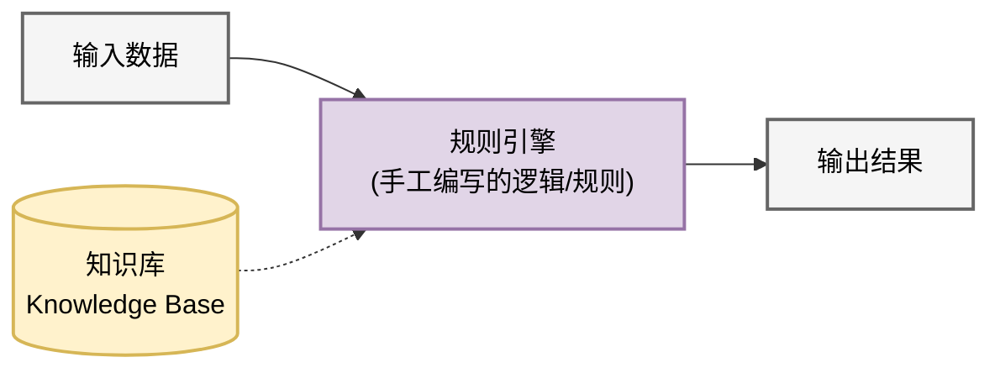

逻辑理论家曾在形式化公理与规则上搜索证明，MYCIN 则把医学知识编码为可追踪的咨询规则；Deep Blue 使用的是棋类搜索、评估函数、专用硬件和人工知识的组合，并非典型专家系统。集合论、图论和数理逻辑为这些系统提供精确对象，但现实输入不会自动变成符号。识别人脸或保持自行车平衡所依赖的隐性结构很难逐条形式化，知识库覆盖外的前提变化也容易产生脆性。更深的符号落地问题还要求说明：内部符号怎样通过感知、行动或社会使用与外部对象建立联系，而不只是在定义之间循环。

#### 1.1.2 连接主义 (Connectionism)：大脑的模拟

连接主义（即神经网络学派）受神经科学启发，把能力放在大量简单单元及其可调连接中。工程师不再为每种输入写完规则，而是定义网络结构和损失，让样本误差通过优化算法改变权重。教人骑自行车的类比抓住了“从反馈中调整”这一点，却不能省略人工设计：网络结构、目标函数、数据采集和训练流程仍然规定了模型能学什么以及怎样学。

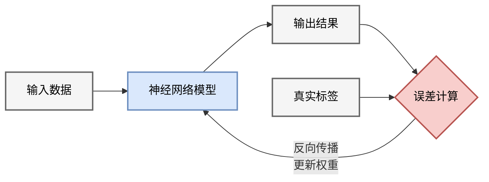

McCulloch-Pitts 神经元先把单元写成阈值计算，Rosenblatt 感知机再让线性权重从分类错误中更新。单层表示限制、算力与数据不足以及整个领域的预期落差带来低潮；反向传播随后让多层网络能够按输出误差共同调整内部表示。2012 年以后，数据、加速器和训练工程把这套机制扩展到视觉、语音、自然语言与生成建模。历史变化很大，主循环始终可辨：输入经过参数化模型得到输出，输出与目标形成损失，梯度再修正参数。

#### 1.1.3 现代视角的融合：神经符号系统 (Neuro-Symbolic AI)

现代多模态/推理模型主要由神经网络实现，也常与搜索、代码执行、定理证明器、数据库和规划器组合。借用 System 1 / System 2 时，只能把它们视为**计算预算类比**：短模型调用较快，搜索与验证循环较慢；不能据此把连接主义/符号主义分别等同于人类的无意识/有意识机制。

#### 1.1.4 机器学习分类

在连接主义范式下，我们通常根据**信号反馈**的不同将机器学习分为三类：

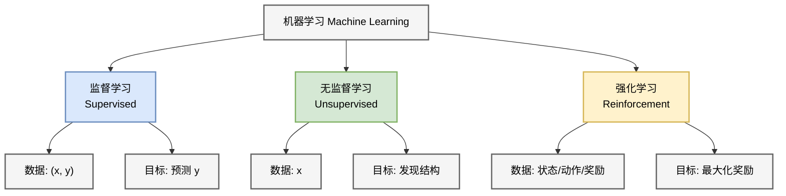

监督学习观察带标签的 $(\mathbf x,y)$ 对，直接学习从输入到目标的映射，图像分类是典型例子。无监督或自监督学习只从 $\mathbf x$ 本身构造结构信号，聚类、降维和语言模型的遮盖/预测目标都属于这条广义路线。强化学习面对的是状态、动作与奖励序列，策略 $\pi(\mathbf a\mid\mathbf s)$ 必须考虑动作如何改变后续状态与长期回报；AlphaGo、机器人控制以及部分大模型后训练使用的都是这种反馈形式。三类名称描述监督信号，不保证算法只能落在一个格子里。

---

下面转向**连接主义**的基础组件。感知机先把线性分类写成可训练单元，异或问题再迫使模型引入隐藏层与非线性；这条线索会自然通向多层网络。

## 1.2 感知机与异或危机：神经网络的黎明
### 1.2 The Perceptron and The XOR Crisis

感知机把加权求和、阈值判定和参数更新压缩进一个最小模型。它足以精确说明**线性可分性**，也足以暴露单层网络在异或问题上的结构限制。

#### 1.2.1 生物神经元与人工神经元 (M-P Neuron)

1943 年，心理学家 McCulloch 和数学家 Pitts 提出了第一个人工神经元模型（M-P 模型）。

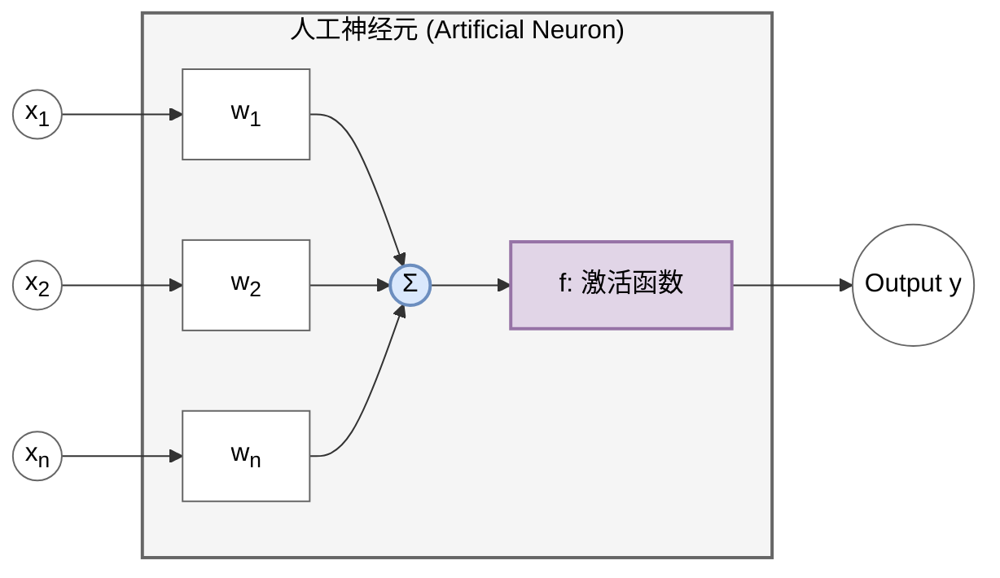

生物神经元由树突接收信号、细胞体整合信号，并在条件满足时沿轴突发放脉冲。M-P 模型只保留了“加权汇总后过阈值”这一计算抽象：

$$ y = f\left(\sum_{i=1}^n w_i x_i - \theta\right). $$

输入 $x_i$ 经权重 $w_i$ 加权，阈值 $\theta$ 决定何时激活，早期 $f$ 取阶跃函数。这个公式不是生物神经元的完整模型，却把多个输入怎样共同决定一个二值输出写成了可组合元件。

#### 1.2.2 Rosenblatt 感知机 (Perceptron)

1958 年，Frank Rosenblatt 提出了感知机，并设计了首个训练算法，使得机器能够“学习”权重。

*   **直观类比 (Intuition)**：
    想象你在决定**是否去相亲**。你心里有几个衡量标准（输入 $x$）：长相、收入、性格。但每个标准在你心里的分量（权重 $w$）不同。
    *   长相（权重 0.8）：很重要。
    *   收入（权重 0.5）：还行。
    *   性格（权重 0.2）：不太在乎。
    如果 $0.8 \times \text{长相} + 0.5 \times \text{收入} + 0.2 \times \text{性格}$ 超过了你心里的门槛（阈值 $\theta$），你就去（输出 1），否则就不去（输出 0）。感知机的学习过程，就是通过一次次相亲的成败，不断调整这些权重和门槛的过程。

*   **模型定义 (Mathematical Definition)**：
    $$ y = \text{sign}(\mathbf{w}^T \mathbf{x} + b) $$
    其中 $b = -\theta$ 为偏置项 (Bias)，$\mathbf{w}$ (Weights) 和 $\mathbf{x}$ (Inputs) 均为向量。

*   **几何意义 (Geometric Interpretation)**：
    在二维空间中，$w_1 x_1 + w_2 x_2 + b = 0$ 定义了一条直线（高维空间中为超平面 Hyperplane）。感知机实际上是一个**线性分类器 (Linear Classifier)**，将空间切分为正类 ($y=1$) 和负类 ($y=-1$)。

    

#### 1.2.3 感知机学习算法 (PLA)

Rosenblatt 的 PLA (Perceptron Learning Algorithm) 只在样本被误分类时更新参数。下面分别从分离超平面的几何方向和损失函数的下降方向推导更新公式。

##### 1. 几何直觉视角 (Geometric View)

*   **直观类比 (Intuition)**：
    假设你在玩“盲人摸象”的游戏，试图划一条线把苹果和梨分开。
    *   你随便划了一条线（初始化）。
    *   你拿起一个水果，发现它在线的左边，但它其实是应该在右边的梨（预测错误）。
    *   你就把线往梨的方向挪一点点（更新权重）。
    *   重复这个过程，直到所有水果都分对了。

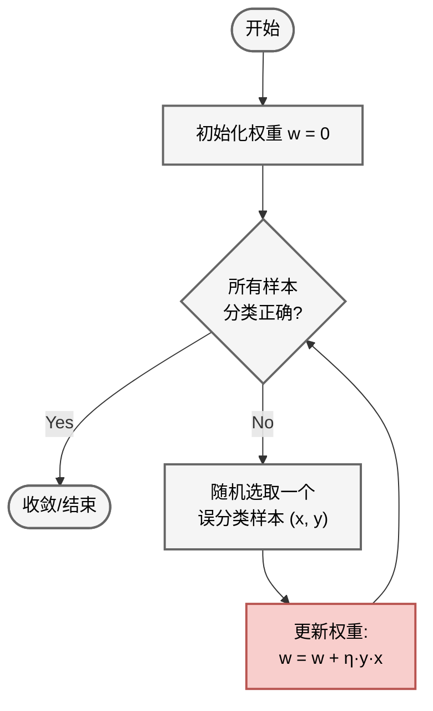

1.  初始化权重 $\mathbf{w}$ 为 0 或随机值。
2.  对每一个训练样本 $(\mathbf{x}, y)$：
    *   如果预测正确 ($\text{sign}(\mathbf{w}^T \mathbf{x}) == y$)，不做改变。
    *   如果预测错误（例如 $y=+1$ 但预测为 $-1$），说明 $\mathbf{w}^T \mathbf{x}$ 太小了，甚至为负数。我们需要调整 $\mathbf{w}$ 使得它更接近 $\mathbf{x}$ 的方向（增大内积）。
        $$ \mathbf{w} \leftarrow \mathbf{w} + \eta y \mathbf{x} $$
        （其中 $\eta$ 为学习率 Learning Rate）
3.  重复直到所有样本都被正确分类。

##### 2. 数学推导视角：随机梯度下降 (SGD)

PLA 本质上是基于特定损失函数的**随机梯度下降 (Stochastic Gradient Descent, SGD)** 算法。

**Step 1: 定义损失函数 (Loss Function)**

我们如何定义“错误”？直接计算误分类点的数量是离散且不可导的。感知机采用的策略是：最小化**误分类点到超平面的总距离**（忽略常数分母 $\|\mathbf{w}\|$）。

对于误分类点集合 $\mathcal{M}$，损失函数定义为：
$$ L(\mathbf{w}, b) = - \sum_{\mathbf{x}_i \in \mathcal{M}} y_i (\mathbf{w}^T \mathbf{x}_i + b) $$
*   **分析**：
    *   对于正确分类点， $y_i (\mathbf{w}^T \mathbf{x}_i + b) > 0$，不计入损失。
    *   对于误分类点， $y_i$ 与预测值 $(\mathbf{w}^T \mathbf{x}_i + b)$ 符号相反，故乘积为负，取负号后 $L$ 为正数。
    *   我们的目标是最小化这个正数。

**Step 2: 计算梯度 (Gradient Calculation)**

我们要通过调整 $\mathbf{w}$ 来最小化 $L$。计算 $L$ 对 $\mathbf{w}$ 的梯度：
$$ \nabla_{\mathbf{w}} L = - \sum_{\mathbf{x}_i \in \mathcal{M}} y_i \mathbf{x}_i $$

**Step 3: 参数更新 (Parameter Update)**

使用 SGD（关于 SGD 的详细数学推导请参阅 [附录 A.1](appendix/a.1_optimization_basics.md)），每次随机选取一个误分类点 $(\mathbf{x}_i, y_i)$ 进行更新。
按照梯度下降规则 $\mathbf{w} \leftarrow \mathbf{w} - \eta \nabla_{\mathbf{w}} L_{sample}$：
$$ \mathbf{w} \leftarrow \mathbf{w} - \eta (- y_i \mathbf{x}_i) $$
$$ \mathbf{w} \leftarrow \mathbf{w} + \eta y_i \mathbf{x}_i $$

这正是 PLA 的更新公式：对当前误分类样本，它等价于感知机损失的一个次梯度更新。单步更新降低的是这个样本的损失方向，并不保证任意有限数据集上的总误分类数每一步都单调下降；线性可分情形的有限步结论来自下面的感知机收敛定理。

**收敛性定理 (Convergence Theorem)**：
如果数据是**线性可分 (Linearly Separable)** 的，PLA 保证在有限步内收敛找到一个解。（详细数学证明请见 **[附录 A.2](appendix/a.2_perceptron_convergence.md)**）。

#### 1.2.4 异或 (XOR) 危机与第一次 AI 寒冬

1969 年，Minsky 和 Papert 出版了《Perceptrons》一书，指出了单层感知机的致命缺陷：**无法处理非线性可分问题**。

最经典的例子就是 **异或 (XOR)** 逻辑。

##### 1. 逻辑门的几何直观 (Geometric Intuition)

把逻辑门的输入 $(x_1, x_2)$ 看作二维平面上的点，并用颜色表示输出 $y$（红色为 0，蓝色为 1）。

*   **AND 门**：只有当 $(1,1)$ 时输出 1。可以用一条直线完美分割。
*   **OR 门**：只要有一个 1 就输出 1。同样可以用一条直线分割。
*   **XOR 门**：当输入不同时输出 1。你会发现，无论如何都无法画出**一条直线**将红色点和蓝色点分开。

##### 2. 为什么这是个大问题？

单层感知机本质上是一个**线性分类器**（$w_1 x_1 + w_2 x_2 + b = 0$ 是一条直线）。XOR 问题的不可解，意味着感知机连最简单的逻辑运算都无法完全覆盖。

这个看似简单的结论（实际上 Minsky 同时也讨论了当时简单多层网络的训练困难）显著削弱了连接主义路线的吸引力。再叠加算力、数据、资金与符号主义预期落空等因素，AI 研究进入了长达十余年的低潮。

##### 3. 破局：多层感知机 (MLP)

多层网络能够表示 XOR 早已有明确构造；20 世纪 80 年代的重要进展，是反向传播被广泛用于有效训练多层网络。**增加一层隐藏层**并配合**非线性激活函数**即可表示 XOR，这成为理解多层表示能力的经典例子。

> **关键点**：如果仅有隐藏层而没有非线性激活函数，多层网络在数学上等价于单层网络（线性变换的叠加仍是线性变换），依然无法解决问题。正是**非线性**的引入，让神经网络具备了“扭曲”空间的能力。

我们可以用组合逻辑来理解：$ \text{XOR}(x_1, x_2) = \text{OR}(x_1, x_2) \text{ AND } \text{NAND}(x_1, x_2) $。这里逻辑门的**阶跃函数**特性提供了必要的非线性。

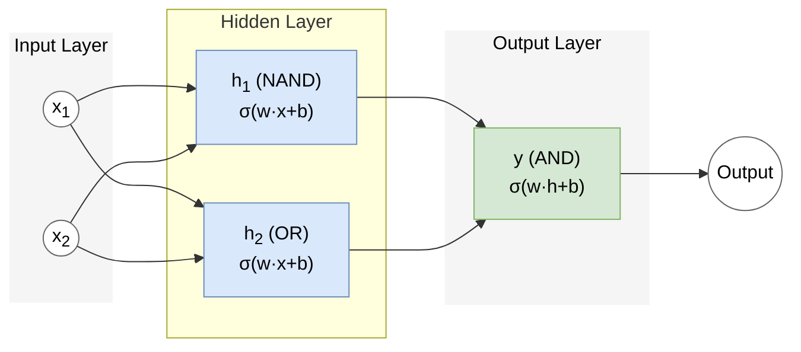

隐藏层先把原始输入映射到新的表示空间，输出层再在该空间中完成线性分割。对 XOR，这个过程可以完全写成两个隐藏单元与一个输出单元的组合，而不必诉诸含混的“空间扭曲”。

## 1.3 多层感知机与非线性表示
### 1.3 Multilayer Perceptron (MLP) and Activation Functions

单层感知机只能给出一个线性判别面，XOR 则需要把多个判别区域组合起来。隐藏层提供中间表示，非线性激活阻止相邻线性层塌缩成一次线性变换；二者共同构成多层感知机 (MLP) 的表示机制。

#### 1.3.1 隐藏层的组合表示

单层感知机只能画直线。如果我们有两层呢？

*   **直观类比 (Intuition)**：
    想象你在折纸。XOR 问题就像纸上有两类点（比如四个角，对角线是一类），不论怎么画直线都分不开。
    隐藏层的作用就是**把纸折叠起来**。通过折叠，原本相隔很远的点可能叠在了一起，或者原本纠缠的点被分到了不同的平面。在新的立体形状上，你只需要一刀（线性分割）就能把它们切开。

**解决 XOR 的数学构造**：

我们可以显式构造一个包含隐藏层的网络来解决 XOR 问题。假设输入 $\mathbf{x} = [x_1, x_2]^T \in \{0, 1\}^2$。

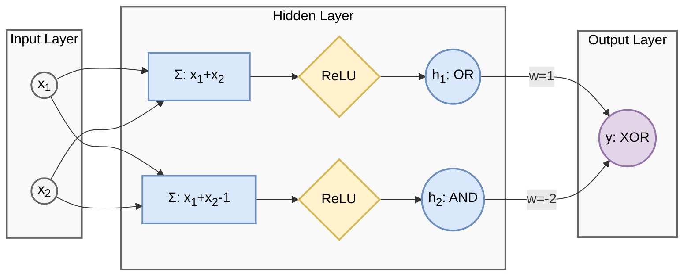

为了引入非线性，我们使用 **ReLU (Rectified Linear Unit)** 激活函数，其定义非常简单：
$$ \sigma(x) = \max(0, x) $$
即：正数保持不变，负数置为 0。

我们需要构建逻辑：$x_1 \text{ XOR } x_2 = (x_1 \text{ OR } x_2) \text{ AND } \text{ NOT } (x_1 \text{ AND } x_2)$。

定义隐藏层权重 $\mathbf{W}_1$ 和偏置 $\mathbf{b}_1$（构造两个神经元）：
*   神经元 1（模拟 OR）：$h_1 = \sigma(x_1 + x_2)$。如果 $x$ 有一个为 1，则 $h_1 \ge 1$。
*   神经元 2（模拟 AND）：$h_2 = \sigma(x_1 + x_2 - 1)$。只有 $x$ 全为 1，则 $h_2 \ge 1$。
    $$ \mathbf{W}_1 = \begin{bmatrix} 1 & 1 \\ 1 & 1 \end{bmatrix}, \quad \mathbf{b}_1 = \begin{bmatrix} 0 \\ -1 \end{bmatrix} $$
    $$ \mathbf{h} = \text{ReLU}(\mathbf{W}_1 \mathbf{x} + \mathbf{b}_1) $$

定义输出层权重 $\mathbf{w}_2$ 和偏置 $b_2$（模拟 $h_1 - h_2$）：
    $$ \mathbf{w}_2 = \begin{bmatrix} 1 \\ -2 \end{bmatrix}, \quad b_2 = 0 $$
    $$ y = \mathbf{w}_2^T \mathbf{h} + b_2 $$

**验证**：
1.  **[0, 0]**: $\mathbf{z} = [0, -1]^T \xrightarrow{\text{ReLU}} \mathbf{h} = [0, 0]^T \Rightarrow y = 0$ (正确)
2.  **[0, 1]**: $\mathbf{z} = [1, 0]^T \xrightarrow{\text{ReLU}} \mathbf{h} = [1, 0]^T \Rightarrow y = 1$ (正确)
3.  **[1, 0]**: $\mathbf{z} = [1, 0]^T \xrightarrow{\text{ReLU}} \mathbf{h} = [1, 0]^T \Rightarrow y = 1$ (正确)
4.  **[1, 1]**: $\mathbf{z} = [2, 1]^T \xrightarrow{\text{ReLU}} \mathbf{h} = [2, 1]^T \Rightarrow y = 1(2) - 2(1) = 0$ (正确)

**关键点：非线性的作用**
请注意神经元 2 在输入为 [0, 0] 时的表现：
*   线性组合结果：$0 + 0 - 1 = -1$。
*   ReLU 输出：$\max(0, -1) = 0$。
正是这个截断（非线性变换） 至关重要。
**如果去掉 ReLU（即使用线性网络）**：
$$ y_{linear} = 1 \cdot (x_1+x_2) - 2 \cdot (x_1+x_2-1) = -x_1 - x_2 + 2 $$
代入 [0, 0] 得到 $y=2 \ne 0$。这就是线性模型失败的原因——它无法在保持其他点正确的同时，单独把 [0, 0] 点的输出“压”下去。ReLU 的非线性“折叠”了空间，使得这成为可能。

**几何解释**：
隐藏层的作用是将原始输入空间（XOR 中扭曲在一起的点）映射到一个**新的特征空间** $\mathbf{h}$。

*   **左图（原始空间）**：红蓝点交错，无法用一条直线分开（线性不可分）。
*   **右图（隐藏空间）**：经过 ReLU 变换后，点 $(0,1)$和$(1,0)$ 被合并/映射到了同一个位置。在新的空间里，我们只需要画一条直线（$h_1 - 2h_2 = 0.5$）就能完美分割红蓝两类（线性可分）。

这就像把一张揉皱的纸（原始空间）展开，使得原来纠缠在一起的点可以被一刀（线性超平面）切开。

#### 1.3.2 为什么必须要有非线性激活函数？

如果我们简单地堆叠多层线性神经元：
$$ \mathbf{y} = \mathbf{W}_2 (\mathbf{W}_1 \mathbf{x} + \mathbf{b}_1) + \mathbf{b}_2 $$
$$ \mathbf{y} = (\mathbf{W}_2 \mathbf{W}_1) \mathbf{x} + (\mathbf{W}_2 \mathbf{b}_1 + \mathbf{b}_2) $$
$$ \mathbf{y} = \mathbf{W}_{new} \mathbf{x} + \mathbf{b}_{new} $$

**结论**：
**线性变换的组合仍然是线性变换**。无论你堆叠多少层线性层，它本质上等价于一个单层网络。它永远无法解决 XOR 问题。

因此，每一层之后必须引入一个非线性函数 $\sigma(\cdot)$：
$$ \mathbf{y} = \mathbf{W}_2 \sigma(\mathbf{W}_1 \mathbf{x} + \mathbf{b}_1) + \mathbf{b}_2 $$
这个 $\sigma$ 就是**激活函数**。非线性使多层组合不再退化为单个仿射映射；对满足相应条件的常见激活函数，通用近似定理进一步给出连续函数逼近的存在性结论，但不意味着有限网络能无条件拟合“任意”对象。

#### 1.3.3 常见激活函数图鉴

1.  **Sigmoid / Logistic**

    

    *   **公式**：$\sigma(x) = \frac{1}{1+e^{-x}}$
    *   **导数性质**：$\sigma'(x) = \sigma(x)(1 - \sigma(x))$。
        *   推导：$\frac{d}{dx}(1+e^{-x})^{-1} = -(1+e^{-x})^{-2}(-e^{-x}) = \frac{1}{1+e^{-x}} \frac{e^{-x}}{1+e^{-x}} = \sigma(1-\sigma)$。
        *   当 $x=0$ 时导数最大为 0.25；进入饱和区后导数更接近 0。反向传播的总增益还会乘上权重矩阵，不能据此断言“每层固定衰减 75%”，但连续的饱和导数因子确实会促成梯度消失。
    *   **优点**：将输出压缩到 (0,1)，适合做概率解释。
    *   **缺点**：
        *   **梯度消失风险**：多层饱和单元会使深层网络更难训练，但初始化、归一化和残差结构也会影响实际梯度流。
        *   **非零中心 (Non-zero-centered)**：激活值恒为正；对同一样本，权重梯度的各分量会受到同号输入因子约束，可能带来低效的曲折更新。后续层的预激活仍可因权重有正有负而取任意符号。
        *   **指数运算昂贵**：在嵌入式设备上计算 $e^x$ 较慢。

2.  **Tanh (双曲正切)**

    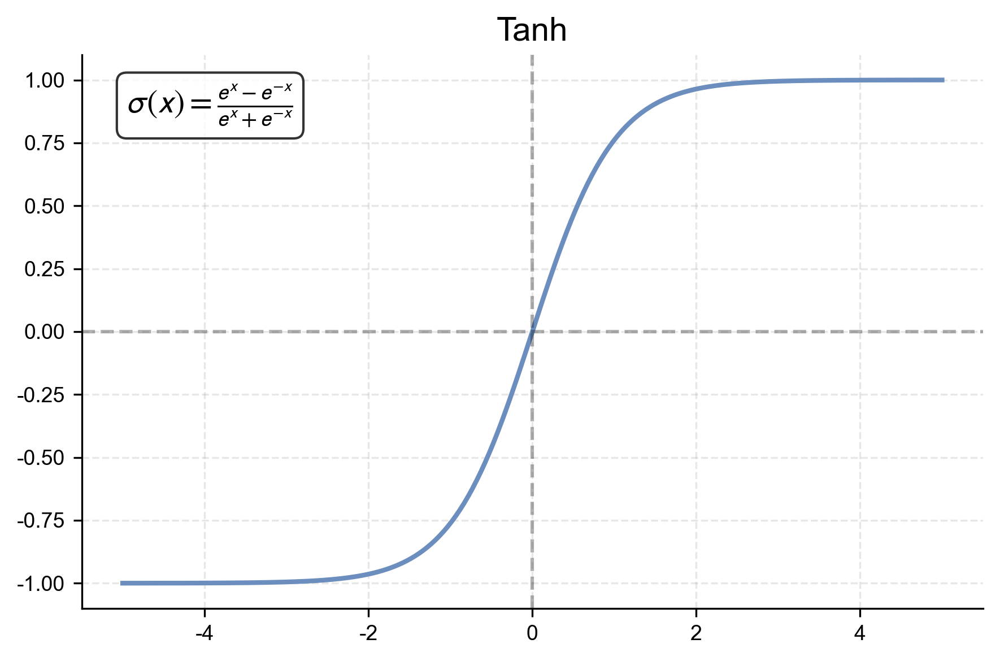

    *   **公式**：$\sigma(x) = \frac{e^x - e^{-x}}{e^x + e^{-x}}$
    *   **导数性质**：$\sigma'(x) = 1 - \sigma(x)^2$。
        *   导数最大值为 1 (在 $x=0$)。相比 Sigmoid 缓解了梯度消失，但深层网络中依然存在。
    *   **优点**：输出范围 (-1, 1)，以 0 为中心，优于 Sigmoid。
    *   **缺点**：
        *   **梯度消失**：当 $|x|$ 很大时（饱和区），导数趋近于 0。例如输入 $x=10$，梯度几乎为 0，网络停止学习。

3.  **ReLU (Rectified Linear Unit)**

    

    *   **公式**：$\sigma(x) = \max(0, x)$
    *   **常用基础激活**。（注：整流单元有更早历史；Nair 与 Hinton 2010 等工作推动了 ReLU 在现代深度网络中的广泛采用。其流行来自优化与计算效果，不能简化为此前研究者普遍要求激活函数必须光滑有界。）
    *   **优点**：
        *   **计算简单**：只需判断正负。
        *   **缓解梯度消失**：正区间导数恒为 1，有助于梯度在深层网络中传播；但它不能单独解决所有深层训练问题。
        *   **稀疏激活**：负区间为 0，模拟了生物神经元的稀疏发放特性。
    *   **缺点**：
        *   **Dead ReLU (神经元死亡)**：如果某个神经元在一次更新后，其权重使得对于所有训练样本的输入都 $<0$，那么该神经元输出永远是 0，梯度也永远是 0。它从此“死”了，再也不会更新。这通常发生在使用大学习率时。

4.  **Leaky ReLU**

    

    *   **公式**：$\sigma(x) = \max(\alpha x, x)$，其中 $\alpha$ 是一个小常数（如 0.01）。
    *   **改进点**：
        *   在负区间保留斜率 $\alpha$，从而降低出现永久零梯度单元的风险，但不保证解决所有优化问题。

5.  **GELU (Gaussian Error Linear Unit)**

    

    *   **公式**：$\text{GELU}(x) = x \Phi(x) = x \cdot \frac{1}{2}\left[1 + \text{erf}\left(\frac{x}{\sqrt{2}}\right)\right]$
        其中 $\Phi(x)$ 是标准正态分布的累积分布函数。
    *   **Transformer 中常见**：BERT、GPT-2/3 等采用 GELU；其他模型也常用 SiLU/Swish 或门控变体（如 SwiGLU）。
    *   **直觉**：它不是像 ReLU 那样硬性截断，而是根据 $x$ 的值以概率 $\Phi(x)$ 保持输入。当 $x$ 很大时，保持原值；当 $x$ 很小时，趋近于 0。
    *   **特性**：在 0 附近比 ReLU 更平滑并允许小的负输出；是否带来更好优化或任务结果需要结合架构和实验证据判断。

6.  **Swish**

    

    *   **公式**：$\text{Swish}(x) = x \cdot \sigma(\beta x)$，其中 $\sigma$ 是 Sigmoid 函数。
    *   **背景**：Swish 由自动搜索工作系统研究；$\beta=1$ 的形式也称 SiLU，相关函数在更早工作中已出现。
    *   **特性**：
        *   与 GELU 形态相近，都具备无上界、有下界、平滑、非单调的特性。
        *   在若干深层架构中优于 ReLU，但收益依赖任务、初始化和网络结构。

#### 1.3.4 通用近似定理：直观理解 (Universal Approximation Theorem)

了解了各种各样的激活函数后，一个自然的问题浮出水面：**如果我们把足够多的非线性神经元堆叠在一起，这个网络到底能表示多么复杂的函数？**

经典回答是：在紧致定义域和相应激活条件下，足够宽的单隐层前馈网络可一致逼近连续函数。Cybenko 的原始结果使用连续 sigmoidal/discriminatory 激活；ReLU 由后续非多项式激活结论覆盖。这类结果统称为**通用近似定理**。

在此先用一维直观说明；正式定理条件、Cybenko 证明概要与 ReLU 分段线性构造见 **[附录 A.5](appendix/a.5_universal_approximation.md)**。连续函数可由足够细的简单基函数或分段线性插值近似，但多维结论仍需正式密度定理。

##### 1. 矩形逼近（基于阶跃函数）
为了最直观地理解，我们可以假设激活函数是 **阶跃函数 (Step Function)**。

1.  **构造台阶**：一个神经元 $h = \text{Step}(w x + b)$ 可以产生一个“台阶”。
2.  **构造矩形**：两个相反的台阶相减（$h_1 - h_2$），就可以形成一个“凸起”（矩形）。
3.  **黎曼和逼近**：任意连续曲线都可以看作是无数个这种矩形的叠加（微积分的基本思想）。

##### 2. 分段线性逼近（基于 ReLU）
在现代深度学习中，我们常用 **ReLU**。原理是类似的，只是 ReLU 产生的是“折线”而非“台阶”。
*   ReLU 的组合会形成**分段线性函数 (Piecewise Linear Function)**。
*   例如，两个 ReLU 相减（$h_1 - h_2$）可以形成一个“软台阶”（先上升后平坦）。
*   在一维紧区间上，只要折线段足够多，就能一致逼近连续曲线；这不直接构成多维证明。

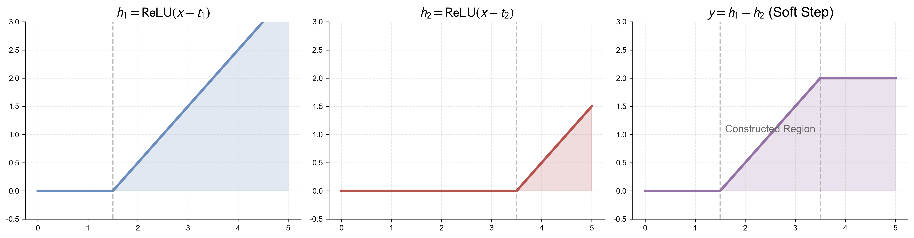

因此，在相应激活与定义域条件下，足够宽的网络可以逼近连续函数。对具有组合、层级或局部结构的某些函数族，增加深度可显著提高表示效率；这不是“层数越多，参数效率必然单调提高”的普遍定理。

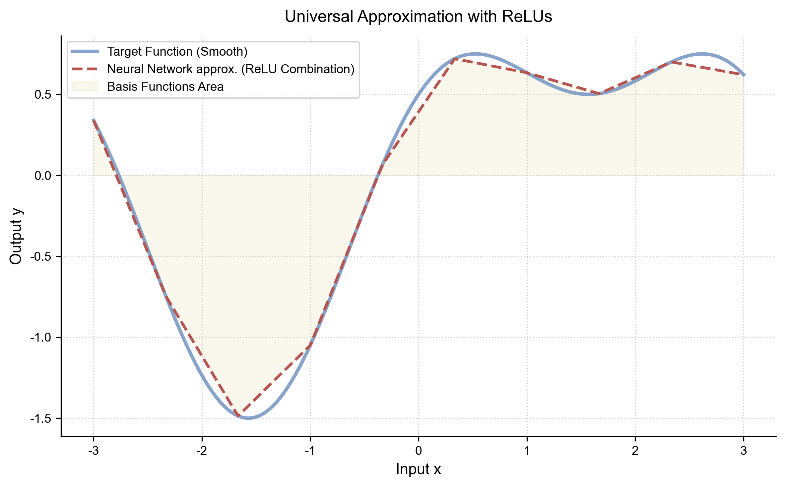

我们也可以用图示来理解这个“组合”的过程：输入 $x$ 并行进入多个神经元（每个神经元代表一个基函数），它们的加权和最终形成了复杂的输出曲线 $y$。

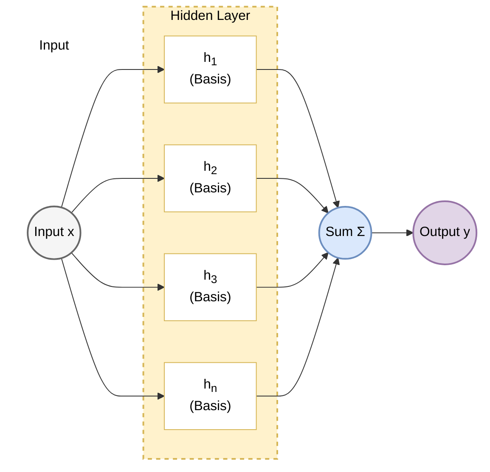

#### 1.3.5 从理论到实践：神经网络到底输出什么？ (From Theory to Practice: What Does a Neural Network Actually Output?)

在结束本章之前，我们需要厘清一个经常困扰初学者的问题：**通用近似定理告诉我们要拟合目标函数 $y$，但神经网络的最后一层到底输出了什么？**

##### 1. 目标量与参数化
*   **任务目标**：分类模型通常需要表示条件类别分布，例如 $P(\text{Cat}\mid x)\in[0,1]$。
*   **常用参数化**：网络先输出无约束分数，再用 Sigmoid 或 Softmax 映射到概率空间。这样自动满足概率约束，也便于写成对数似然目标；它不是唯一可用参数化。

##### 2. 解决方案：Logits
在分类实现中，输出层常先产生无约束实数，称为 **logits** 或 scores，再交给概率链接函数。

*   **Logits ($\mathbf{z}$)**：是类别的相对分数；较高 logit 会得到较高 Softmax 概率，但概率是否校准还需单独评测。
*   **与通用近似定理的关系**：通用近似定理说明特定网络族对连续函数的表示能力，并不规定网络必须拟合 log-odds。采用 Sigmoid/Softmax 时，可以把 logits 解释为 log-odds 或未归一化对数概率的参数化。

##### 3. 最后的转换
为了得到我们需要的结果，我们在网络的**最末端**挂接一个特定的“适配器”函数：

*   **回归问题**：可用恒等或其他符合目标支持集的输出链接；连续预测通常不称为 logits。
*   **二分类问题**：使用 **Sigmoid** 函数将 Logits 映射到 $(0, 1)$。
*   **多分类问题**：使用 **Softmax** 函数将 Logits 映射到概率分布。

$$ \underbrace{\text{Neural Network}}_{\text{Universal Approximator}} \xrightarrow{\text{Logits } z} \underbrace{\text{Activation}}_{\text{Adapter}} \xrightarrow{\text{Prob } p} \text{Target} $$

这种 **“无约束打分 + 概率链接函数”** 是分类模型的常见设计。链接函数、似然与损失需要匹配任务假设，而不是由通用近似定理单独决定。

*(关于 Logits 如何转化为概率的详细数学机制，请参阅 **[附录 A.7 Softmax 与 Cross-Entropy](appendix/a.7_softmax_crossentropy.md)**)*

#### 1.3.6 思考：从分类到生成——生成式 AI 的两种形态 (Reflection: From Classification to Generation)

既然你已经理解了 **Logits** 和 **Softmax**，你实际上已经掌握了现代**生成式 AI** 的核心机制之一。

生成模型可以处理离散 token，也可以在连续像素或潜在空间中建模。下面比较典型的自回归文本模型与扩散图像模型；图像也可离散 token 自回归生成，文本之外的连续模态也可使用 diffusion 或 flow，因此这不是模态的唯一划分。

##### 1. 文本生成：离散的接龙游戏 (LLM as Classification)

从输出层看，ChatGPT 等大语言模型 (LLM) 在每一步都像一个 **超大规模词表分类器**：它们给出下一个 token 的概率分布。
*   **离散空间**：文本经 tokenizer 转成离散 token，词表大小和 token 粒度因模型而异。
*   **任务**：根据前缀给出下一个 token 的条件分布，再按解码策略选择输出。
*   **流程**：
    $$ \text{Context} \xrightarrow{\text{LLM}} \text{Logits} \xrightarrow{\text{Softmax}} \text{Probability} \xrightarrow{\text{Sampling}} \text{Next Token} $$
*   **能力与多样性**：模型参数和上下文共同定义条件分布，决定它能组合出什么内容；采样只是在这个分布中选择输出，主要增加结果的多样性。低温采样或贪心解码也可能生成训练集中未逐字出现的新组合，因此不能把“创造力”单独归因于随机性。

##### 2. 图像生成：连续的去噪过程 (Diffusion as Regression)

以 Stable Diffusion 一类潜在扩散模型为例，主要建模对象是连续潜变量。
*   **连续空间**：图像可在像素或自编码器潜在空间表示；实现通常使用浮点张量。
*   **任务**：模型按所选参数化预测噪声 $\epsilon$、去噪样本 $x_0$、速度 $v$ 或 score，并通过迭代采样得到样本。
*   **原理**：
    1.  我们在训练时，给清晰图片加噪声（Noise）。
    2.  让模型学习条件去噪目标；经典 DDPM 常用噪声预测的 MSE，其他参数化可使用不同加权目标。
    3.  生成时从噪声出发，按离散去噪步或连续 ODE/SDE 求解逐步得到图像潜变量，再由解码器还原图像。
*   **损失函数**：经典噪声预测常使用 MSE，但目标通常不是直接拟合“准确像素值”；现代 diffusion、score matching 与 flow matching 的目标口径也不完全相同。

##### 3. 总结对比

| 特性 | 文本生成 (LLM) | 图像生成 (Diffusion) |
| :--- | :--- | :--- |
| **典型条件分布** | 离散 categorical | 连续去噪转移或速度场 |
| **表示空间** | 有限 token 词表 | 像素或连续潜变量 |
| **核心输出** | 下一 token logits | $\epsilon$、$x_0$、$v$、score 等参数化 |
| **常见损失** | Token Cross-Entropy | 加权 MSE、score/flow matching 目标等 |
| **典型生成方式** | 逐 token 自回归 | 多步去噪或 ODE/SDE 采样 |

理解了这一点，你就明白了为什么我们在讲 Softmax 时主要针对文本和分类任务，而未来的章节（如图像生成）将更多地从几何和能量函数的角度切入。

#### 1.3.7 从第二次 AI 寒冬到神经网络的再度升温

**“如果我们已经拥有了如此强大的理论（如通用近似），为什么神经网络在 20 世纪 90 年代没有直接统治世界，反而跌入了谷底？”**

通用近似只给出表示能力的存在性，**不等于有限数据、有限算力下可训练或可泛化**。20 世纪 90 年代的优化方法、数据规模、计算硬件和评测任务都限制了深层网络的实际效果。

通常所说的**第二次 AI 寒冬**主要指 20 世纪 80 年代末至 90 年代初，专家系统市场退潮与研究资助收缩；不能把 1995-2010 整段机器学习发展都称为 AI 寒冬。对神经网络而言，90 年代后期到 2000 年代在许多主流任务中的影响相对有限，但 CNN、语音识别和表示学习等研究并未停止。

主要原因有三点：
1.  **梯度与优化困难**：Sigmoid、Tanh 的饱和区会促成梯度消失；当时还缺少今天常用的初始化、归一化、残差连接、优化器和大规模训练经验。ReLU 缓解了一部分问题，但不是单独的完整答案。
2.  **非凸优化理解不足**：深层网络目标含有局部极小值、鞍点和平坦方向。后续研究表明鞍点在高维非凸问题中很重要，但不能据此断言局部极小值普遍无关。
3.  **算力与数据的匮乏**：训练大网络需要海量数据和算力，而当时的 CPU 难以胜任，互联网的大数据时代也尚未到来。

这些限制使神经网络在不少领域让位于更易训练、在中小规模数据上表现稳定的方法。与此同时，SVM、核方法、Boosting 和随机森林等统计学习方法在许多任务中成为强基线或主流方案。

下一节（1.4）介绍同期快速发展的统计学习理论、核方法与树集成，并比较它们和表示学习的不同归纳偏置。

## 1.4 统计学习的黄金时代：SVM 与随机森林
### 1.4 The Golden Age of Statistical Learning: SVM & Random Forests

在神经网络尚未成为多数应用的主干时，1990 年代中后期至 2000 年代是**统计学习理论 (Statistical Learning Theory)** 与核方法、集成学习快速发展的时期。

以 **SVM (支持向量机)** 和 **Random Forest (随机森林)** 为代表的方法，在中小规模数据、结构化特征和若干感知任务中长期具有竞争力。SVM 的最大间隔理论与随机森林的随机化集成分析不同，训练速度和小样本表现也取决于数据维度与超参数。

#### 1.4.1 支持向量机 (SVM)：寻找最宽的街道

感知机只要找到一条线把两类分开就行，但 SVM 说：“不，我要找到**最好**的那条线。”

*   **直观理解 (Max Margin)**：
    最好的分界线，应该是离两边最近的数据点（支持向量 Support Vectors）都**最远**的那条线。这就像在两类数据之间修一条马路，我们希望马路越宽越好（Margin 最大化）。
*   **数学本质**：
    感知机只要求找到可分超平面，软间隔 SVM 则优化间隔与违约损失。这是一个**凸优化问题 (Convex Optimization)**，因此任意局部最优都是全局最优；参数解是否唯一还取决于目标的严格凸性、偏置与数据退化情形。

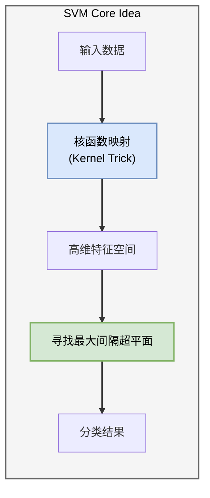

**核技巧 (Kernel Trick)**：
核技巧是 SVM 的另一项关键机制。当数据在原特征空间不可线性分时（如 XOR），核函数 $K(x, y)$ 可隐式计算某个特征空间中的内积，而无需显式构造全部高维坐标。
*   **神经网络**通过**隐藏层**显式地提取特征。
*   **SVM** 通过**核函数**隐式地计算高维相似度。

#### 1.4.2 集成学习 (Ensemble Learning)：三个臭皮匠

集成学习组合多个基学习器以改善泛化。Dropout 可以从近似模型平均的角度理解，但它并不是普通 Bagging 或 Boosting 的直接等价实现。

1.  **Bagging (如 Random Forest)**：
    *   **并行**训练多棵决策树；典型随机森林同时使用 bootstrap 样本和节点处分裂特征的随机子集。
    *   最后**投票**决定结果。
    *   **优点**：相较单棵高方差决策树通常能降低方差；它仍可能因数据泄漏、树相关性或超参数不当而过拟合。

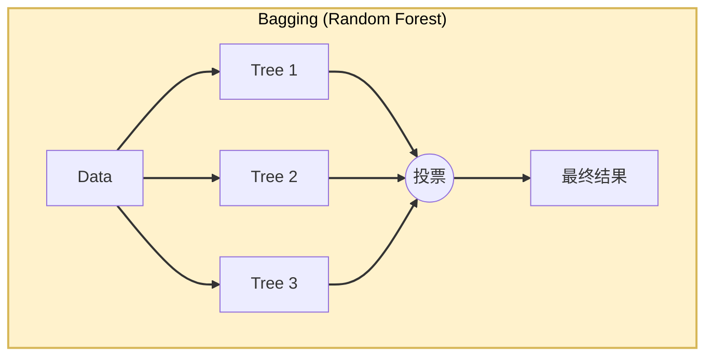

2.  **Boosting (如 AdaBoost、GBDT/XGBoost)**：
    *   **串行**加入基学习器，但“修正错误”的机制因算法而异：AdaBoost 提高被误分样本的权重；gradient boosting 在函数空间中拟合当前经验目标的负梯度，平方损失下才可直观称为拟合残差。
    *   **效果边界**：迭代通常旨在改善训练经验目标；对偏差、方差、噪声和最终泛化的影响取决于基学习器、损失、步长、正则化、数据与停止轮数，不保证“极大降偏差”或“精度极高”。

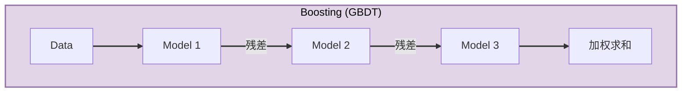

#### 1.4.3 从人工特征管线到表示学习

SVM 与随机森林代表不同机制：前者通常求解凸的间隔目标，后者通过随机化树集成降低预测方差。SVM 的参数解未必唯一，随机森林训练也不是凸优化；二者的可解释性和收敛性质都依赖具体实现。深度学习带来的主要变化，不是宣告这些方法失效，而是把 **表示学习 (Representation Learning)** 推到大规模感知任务的中心。

在深度视觉普及前，许多感知系统采用分阶段管线：
1.  **特征工程 (Feature Engineering)**：由专家设计图像边缘、纹理或文本词项等特征。
2.  **预测器学习**：再用线性模型、核方法或其他分类器学习决策边界。树模型则会从给定变量中自动学习切分，不能简单归为“固定特征 + SVM”管线。

人工特征会把领域知识直接编码进系统，在中小规模结构化数据上仍很有效；但在图像、语音和自然语言等高维感知数据中，设计能覆盖大量变化的特征往往成本很高，也限制了任务间迁移。

深度学习的重要转变是让特征提取与预测目标能够 **端到端 (End-to-End)** 联合训练。它减少了部分手工特征工程，但仍依赖数据选择、架构先验、目标函数、标注和评测等人工设计。

我们可以通过下表，清晰地看到这两种范式在核心理念上的决裂：

| 维度 | 统计学习 (SVM/RF) | 深度学习 (Deep Learning) |
| :--- | :--- | :--- |
| **核心哲学** | **分而治之** (人工特征 + 机器分类) | **端到端** (特征与分类联合学习) |
| **表示方式** | 常依赖人工或固定特征；树模型可直接处理结构化变量 | 通过多层表示学习联合获得特征与预测器 |
| **常见优势场景** | 中小规模结构化数据、强先验特征、资源受限场景 | 大规模感知数据、序列与生成建模 |
| **计算特征** | 许多方法可高效使用 CPU；核方法也可能随样本数变贵 | 大规模训练常依赖 GPU/加速器；小模型也可在 CPU 运行 |

2012 年 ImageNet 竞赛中的 AlexNet 是这一转移的重要实证节点：卷积网络、ReLU、数据增强、Dropout 与 GPU 训练的组合显著降低了图像分类错误率，并推动表示学习在视觉研究中快速普及。

> **本章总结**：
> 至此，我们回顾了从感知机的线性局限、MLP 的非线性表示，到 SVM、树集成与端到端表示学习的演进。
>
> 不同方法的适用性取决于数据、算力、先验、风险和评测口径。下一章将具体分析深度网络的训练机制、CNN 与序列模型。
