# 第二章 深度学习基础：训练、CNN 与序列模型

## 2.1 深度学习的理论基石：从泛化到反向传播
### 2.1 Theoretical Foundations: From Generalization to Backpropagation

在第一章的末尾，我们见证了深度学习凭借“端到端”的特征提取能力，终结了统计学习的黄金时代。当大门被推开，摆在我们面前的是一个由数亿参数构成的复杂宇宙。

在这一章，我们将深入探索现代神经网络的核心架构（CNN, RNN, LSTM）。但在拆解这些复杂的精密仪器之前，我们必须先掌握支配它们运作的**“第一性原理”**。

深度学习并非黑魔法，它的本质是 **微积分** (Backpropagation) 在 **统计学** (Generalization) 约束下的 **最优化** (Optimization) 过程。本节将为你构建这套完整的数学心法：从衡量模型好坏的“泛化理论”，到防止其误入歧途的“正则化”，最后是驱动其学习的引擎——“反向传播”与“优化器”。

这些理论如同物理定律一样，并不随架构的更新而过时。无论是 ResNet 还是 Transformer，都运行在这套基石之上。

#### 2.1.1 机器学习的铁律：泛化与过拟合 (Generalization & Overfitting)

我们训练模型的终极目标从来不是在 **训练集** 上拿满分，而是在未见过的 **测试集** 上表现良好。这种举一反三的能力被称为 **泛化 (Generalization)**。

##### 1. 经验风险与期望风险
从数学上讲，我们试图最小化所有可能数据的**期望风险 (Expected Risk)** $R(f)$，但上帝视角的真实分布 $P(x,y)$ 是不可知的。因此，我们只能退而求其次，最小化在训练集上的**经验风险 (Empirical Risk)** $\hat{R}(f)$：

$$ \hat{R}(f) = \frac{1}{N} \sum_{i=1}^N L(y_i, f(x_i)) $$

**过拟合 (Overfitting)** 的本质就是：模型过度优化了 $\hat{R}(f)$，导致它开始“死记硬背”训练样本中的噪声，从而使得 $\hat{R}(f)$ 很低，但真实的泛化误差 $R(f)$ 却激增。

##### 2. 偏差-方差分解 (Bias-Variance Decomposition)
泛化误差可以数学分解为三部分（详细推导见 [附录 A.3](appendix/a.3_statistical_learning_theory.md)）：

$$ \text{Error} = \text{Bias}^2 + \text{Variance} + \text{Noise} $$

*   **偏差 (Bias)**：模型的**拟合能力**。偏差高意味着模型太简单（欠拟合），连训练集都学不会（如用直线拟合正弦曲线）。
*   **方差 (Variance)**：模型的**敏感度**。方差高意味着模型太复杂（过拟合），稍微换一组训练数据，模型就会发生剧烈变化。
*   **不可约误差 (Noise)**：数据本身的固有噪声，这是性能的上限。

我们用下图来直观展示这三者的博弈关系：随着模型变得越来越复杂，偏差逐渐降低，但方差却急剧上升。

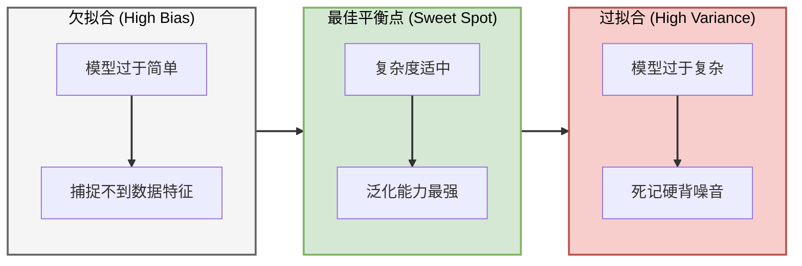

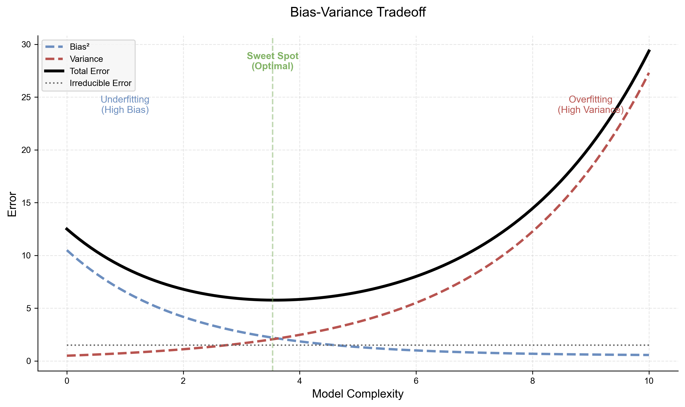

##### 3. 复杂度的度量：VC 维 (VC Dimension)
在上图中，横轴代表“Model Complexity”。但如何从数学上定量描述一个模型的复杂度？统计学习理论引入了 **VC 维 (Vapnik-Chervonenkis Dimension)** 的概念。

*   **直观定义**：VC 维衡量了模型能够“打散” (Shatter) 多少个样本。
    *   例如，二维平面上的直线分类器（感知机）可以打散 3 个点（任意红蓝组合都能分开），但无法打散 4 个点（XOR 问题），所以其 VC 维为 3。
*   **泛化界 (Generalization Bound)**：
    VC 维越高，模型越复杂，泛化界就越“松”。这意味着训练误差与测试误差之间的差距可能非常大，极易过拟合。

$$ E_{out} \le E_{in} + \Omega(N, d_{VC}) $$

这为“奥卡姆剃刀”原则提供了统计学习意义上的解释：**在训练误差相近且候选模型都能解释数据时，更低复杂度的模型通常具有更紧的泛化界**。但现代深度学习还受到优化隐式偏置、数据规模和模型结构的影响，不能把 VC 维较低简单等同于一定更好。（关于 VC 维的详细定义与泛化误差界公式，详见 **[附录 A.3](appendix/a.3_statistical_learning_theory.md)**）

#### 2.1.2 应对过拟合：正则化 (Regularization)

深度神经网络通常拥有百万级甚至亿级的参数，天然处于高方差（过拟合）的风险区。为什么它们还能工作？因为我们有**正则化**——即在损失函数中引入“约束”或“先验知识”，强迫模型学习更平滑、更简单的解。（关于正则化的贝叶斯解释与详细推导，请见 **[附录 A.4](appendix/a.4_regularization.md)**）

##### 1. L1 与 L2 正则化 (Mathematical Definition)

最经典的正则化方法是通过修改**损失函数**，在其中加入对参数规模的惩罚项（Penalty Term）。
$$ J(\mathbf{w}) = \text{Loss}(\mathbf{w}) + \lambda \cdot \Omega(\mathbf{w}) $$
其中 $\lambda$ 是控制约束强度的超参数。

*   **L2 正则化 (Ridge)**：
    $$ \Omega(\mathbf{w}) = \frac{1}{2} \|\mathbf{w}\|^2_2 = \frac{1}{2} \sum w_i^2 $$
    它倾向于让参数**整体变小且分布均匀**，防止任何一个权重过大主导决策。
*   **L1 正则化 (Lasso)**：
    $$ \Omega(\mathbf{w}) = \|\mathbf{w}\|_1 = \sum |w_i| $$
    它倾向于让参数**变得稀疏**（许多 $w_i$ 直接变成 0）。

**几何直观 (Geometric Intuition)**：
如下图所示，我们将 Loss 的等高线（同心椭圆）和约束区域（阴影部分）画在同一个平面上。最优解是 Loss 等高线与约束边界的**切点**。
*   **L2 (圆形)**：切点通常在圆周上，$w$ 变小但不为 0。
*   **L1 (菱形)**：切点极大概率落在坐标轴的**尖角 (Corner)** 上，导致某些维度 $w=0$（稀疏解）。

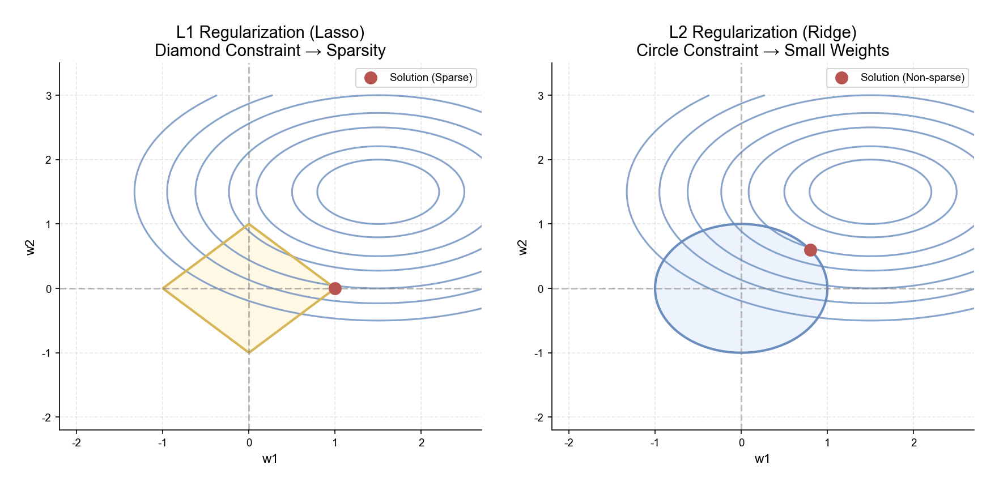

##### 2. 工程视角：权重衰减 (Weight Decay)

在实际的深度学习框架（如 PyTorch）中，我们通常不直接修改 Loss 函数公式，而是设置优化器的 **`weight_decay`** 参数。为什么？

*   **L2 正则化与权重衰减**
    如果我们对 L2 正则化的 Loss 求导并代入 SGD 更新公式，会发现：
    $$ w_{t+1} = w_t - \eta (\nabla Loss + \lambda w_t) = \underbrace{(1 - \eta\lambda)}_{\text{Decay}}w_t - \eta \nabla Loss $$
    这意味着：在普通 SGD 中，**L2 正则化等价于在每次更新时将权重“衰减”一小部分**。对 Adam 这类自适应优化器，这个等价关系一般不再严格成立，因此现代大模型训练常使用 AdamW 形式的解耦权重衰减。这也解释了术语 **Weight Decay** 的由来。

*   **谁更常用？**
    *   **L2 / Weight Decay** 是现代深度学习中最常见的基础正则化之一，尤其在 ResNet、Transformer、BERT 等架构中常与优化器、数据增强、归一化和早停等策略配合使用。
    *   **L1** 仅用于明确需要进行**特征选择**（剔除无用输入）的特殊场景。

##### 3. Dropout：随机失活
**Dropout** 是深度学习特有的正则化技巧。虽然直观上是“随机让神经元罢工”，但其背后有严谨的数学定义。

**数学定义 (Mathematical Formulation)**：
设 $\mathbf{h}$ 为隐藏层输出，$p$ 为**丢弃概率 (Dropout Rate)**。我们引入一个服从伯努利分布的随机掩码向量 $\mathbf{r}$：
$$ \mathbf{r} \sim \text{Bernoulli}(1-p) $$

*   **训练时**：应用掩码 $\tilde{\mathbf{h}} = \mathbf{r} \odot \mathbf{h}$。
*   **测试时**：为了平衡期望值 ($E_{train}[\tilde{\mathbf{h}}] = (1-p)\mathbf{h}$)，我们需要对权重或输出进行缩放，这就是 **Weight Scaling**。
    $$ \mathbf{h}_{test} = (1-p) \mathbf{h} $$
    *(注：现代框架常采用 **Inverted Dropout**，即在训练时直接除以 $1-p$，从而免去测试时的缩放)*

（关于掩码向量的生成、数值计算示例及反向传播细节，请见 **[附录 A.4.4](appendix/a.4_regularization.md#a44-dropout-的数学机制详解-mathematics-of-dropout)**）

**集成学习视角 (Ensemble View)**：
*   **训练时 (Ensemble)**：每次 Iteration，我们都在训练一个新的、更稀疏的子网络。由于网络参数是共享的，这相当于我们在同时训练指数级个 ($2^N$) 不同的神经网络。
*   **测试时 (Averaging)**：所有神经元开启。上述的 Weight Scaling 或 Inverted Dropout 近似于对大量共享参数的稀疏子网络做模型平均。对特定损失和近似假设下可以得到几何平均式的解释，但在一般深度网络中，更稳妥的说法是：Dropout 提供了一种高效的随机集成近似。

从这个角度看，Dropout 并非简单的“扔掉”信息，而是一种极其高效的**集成学习 (Ensemble Learning)**。

  

#### 2.1.3 通用近似定理 (Universal Approximation Theorem)

在 1.3.4 节中，我们从直观的维度介绍了**通用近似定理**，阐述了它如何证明多层感知机（MLP）具备解决非线性问题（如 XOR）的能力。本章我们将转入**数学构造**的严谨视角，深入探讨这一性质背后的机理：神经网络**为什么**能够逼近任意函数？

在通过正则化解决了“不敢学”（过拟合）的问题后，我们需要回到原点，从数学机理上确认神经网络到底“能不能学”（表达能力）。

**定理陈述**：
> 一个包含足够多隐藏神经元且具有非线性激活函数（如 Sigmoid, ReLU）的**单层前馈神经网络**，能够以任意精度逼近任何定义在紧致集合上的连续函数。

**数学表达 (Cybenko, 1989)**：
设 $\sigma(\cdot)$ 为任意非线性激活函数，对于任意连续函数 $f(x)$ 和 误差 $\epsilon > 0$，存在整数 $N$ 和参数 $v_i, w_i, b_i$，使得：
$$ F(x) = \sum_{i=1}^{N} v_i \sigma(w_i x + b_i) $$
$$ |F(x) - f(x)| < \epsilon, \quad \forall x \in [0, 1]^n $$

这表明，单隐层神经网络在连续函数空间中是**稠密 (Dense)** 的。

**直观证明 (Bump Function 构造法)**：

我们可以通过构造“积木”来逼近任意形状。
想象一个 ReLU 对 $\sigma(x)$。通过组合两个偏移的 ReLU，我们可以构造出一个“凸起” (Bump)。无数个不同高度、不同位置的“凸起”通过线性组合，可以拼凑出任意复杂的曲线（这本质上就是黎曼积分的思想）。

这意味着：在连续函数、紧致定义域和足够宽的网络等条件下，神经网络具有很强的函数逼近能力。它说明的是表达能力的存在性，不保证有限数据下的可学习性、可优化性或泛化能力。（详细数学证明请见 **[附录 A.5](appendix/a.5_universal_approximation.md)**）

#### 2.1.4 训练引擎：反向传播 (Backpropagation)

有了模型和目标，如何求出那几百万个参数的最优解？答案是**梯度下降**。而计算梯度的核心算法，就是 1986 年由 Hinton 等人推广的**反向传播 (Backpropagation)**。

##### 1. 核心思想：计算图与链式法则
反向传播的本质是**链式法则 (Chain Rule)** 在**计算图 (Computational Graph)** 上的高效应用。
想象整个神经网络是一个巨大的管道系统（计算图）。
*   **前向传播 (Forward Pass)**：数据像水流一样，从输入层流向输出层，经过层层加权和激活，最终计算出 Loss。
*   **反向传播 (Backward Pass)**：**误差信号**（梯度）像水流回溯一样，从 Loss 出发，沿着原本的路径逆流而上，计算每个阀门（权重）对总误差的“贡献度”。

我们可以用下图直观对比这两股“水流”：

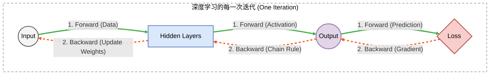

##### 2. 矩阵版反向传播推导 (The Four Fundamental Equations)
为了高效计算，现代深度学习框架（如 PyTorch）都采用**矩阵运算**。我们定义第 $l$ 层的加权输入为 $\mathbf{z}^{(l)}$，激活输出为 $\mathbf{a}^{(l)}$。
$$ \mathbf{z}^{(l)} = \mathbf{W}^{(l)} \mathbf{a}^{(l-1)} + \mathbf{b}^{(l)}, \quad \mathbf{a}^{(l)} = \sigma(\mathbf{z}^{(l)}) $$

我们需要求 Loss 对权重 $\mathbf{W}^{(l)}$ 和偏置 $\mathbf{b}^{(l)}$ 的梯度。这就引入了一个中间量——**误差项 (Error Term) $\boldsymbol{\delta}^{(l)}$**，它表示“第 $l$ 层神经元的加权输入 $\mathbf{z}^{(l)}$ 对最终 Loss 的敏感程度”：
$$ \boldsymbol{\delta}^{(l)} \equiv \frac{\partial L}{\partial \mathbf{z}^{(l)}} $$

有了这个定义，反向传播可以概括为四个简洁优美的公式（BP 四大公式）：

**(1) 输出层误差 (Output Layer Error)**
计算最后一层 $L$ 的误差。这取决于损失函数的导数 $\nabla_{\mathbf{a}}L$ 和激活函数的导数 $\sigma'$。
$$ \boldsymbol{\delta}^{(L)} = \nabla_{\mathbf{a}}L \odot \sigma'(\mathbf{z}^{(L)}) $$
*   $\odot$ 代表 Hadamard 积（逐元素相乘）。这告诉我们：如果激活函数进入饱和区（$\sigma' \approx 0$），梯度就会在这里消失。

**(2) 误差反向传播 (Error Backpropagation)**
如何从第 $l+1$ 层的误差推导出第 $l$ 层的误差？误差通过权重矩阵的**转置** $(\mathbf{W}^{(l+1)})^T$ 往回传。
$$ \boldsymbol{\delta}^{(l)} = \left[ (\mathbf{W}^{(l+1)})^T \boldsymbol{\delta}^{(l+1)} \right] \odot \sigma'(\mathbf{z}^{(l)}) $$
*   **直观理解**：第 $l+1$ 层的误差 $\boldsymbol{\delta}^{(l+1)}$ 被权重矩阵 $W$ “加权分配”回了第 $l$ 层。

**(3) 权重的梯度 (Gradient w.r.t Weights)**
有了本层的误差 $\boldsymbol{\delta}^{(l)}$，权重的梯度就是“误差”乘以“上一层的输入”。
$$ \frac{\partial L}{\partial \mathbf{W}^{(l)}} = \boldsymbol{\delta}^{(l)} (\mathbf{a}^{(l-1)})^T $$
*   这解释了为什么输入 $\mathbf{a}^{(l-1)}$ 也不能过大或过小，因为它直接充当了梯度的系数。

**(4) 偏置的梯度 (Gradient w.r.t Bias)**
$$ \frac{\partial L}{\partial \mathbf{b}^{(l)}} = \boldsymbol{\delta}^{(l)} $$

（关于这四个公式的详细数学推导、矩阵维度分析及计算图的局部梯度视角，请见 **[附录 A.6 反向传播的数学推导](appendix/a.6_backpropagation.md)**）

##### 3. 完整的动态流程图
下图展示了一个包含两层网络的完整前向与反向过程。前向传播计算 Loss，反向传播计算梯度并更新参数。

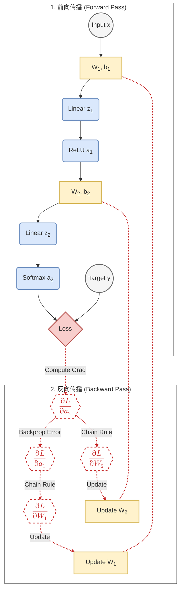

> **核心概念说明：Softmax 函数**
>
> 在上图中，我们看到输出层使用了 `Softmax`。这是多分类任务（如识别 1000 种物体）的标准配置。
> 它将神经网络输出的任意实数（Logits）转换为**概率分布**：
> 1.  所有概率非负 ($p_i \ge 0$)。
> 2.  所有概率之和为 1 ($\sum p_i = 1$)。
>
> **公式**：
> $$ \text{Softmax}(z_i) = \frac{e^{z_i}}{\sum_{j} e^{z_j}} $$
>
> *（关于 Softmax 及其与交叉熵损失函数的常见配合与求导推导，请详见 **[附录 A.7 Softmax 与 Cross-Entropy](appendix/a.7_softmax_crossentropy.md)**）*

#### 2.1.5 优化器：从 SGD 到 Adam

计算出梯度 $g$ 后，如何更新参数 $w$？朴素的 **SGD (Stochastic Gradient Descent)** 遵循最陡下降原则：
$$ w_{t+1} = w_t - \eta g_t $$
但在面对复杂的非凸优化曲面（如狭长的峡谷或鞍点）时，SGD 往往表现不佳：它会在峡谷壁之间剧烈震荡（Zig-Zag），收敛极慢。现代优化器引入了**动量 (Momentum)** 和**自适应 (Adaptivity)** 两个核心概念来解决这一问题。（关于优化器的详细数学推导与进阶分析，请见 **[附录 A.8](appendix/a.8_advanced_optimization.md)**）

##### 1. Momentum (动量法)
**直观理解**：模拟物理中的小球滚下山坡。小球不会时刻顺着当前的坡度切线方向（梯度）走，而是拥有**惯性**。如果梯度方向改变（震荡），惯性会平滑路径；如果梯度方向一致（下坡），小球会不断加速。

**数学定义**：
我们引入速度变量 $v$，它是梯度的**指数移动平均 (Exponential Moving Average, EMA)**：
$$ v_t = \beta v_{t-1} + (1-\beta) g_t $$
$$ w_{t+1} = w_t - \alpha v_t $$
*   $\beta$ (通常约 0.9) 类似于“摩擦系数”，决定了惯性的大小。
*   **效果**：在峡谷中，垂直于谷底的震荡分量互相抵消，而平行于谷底的加速分量互相叠加，从而加速收敛。

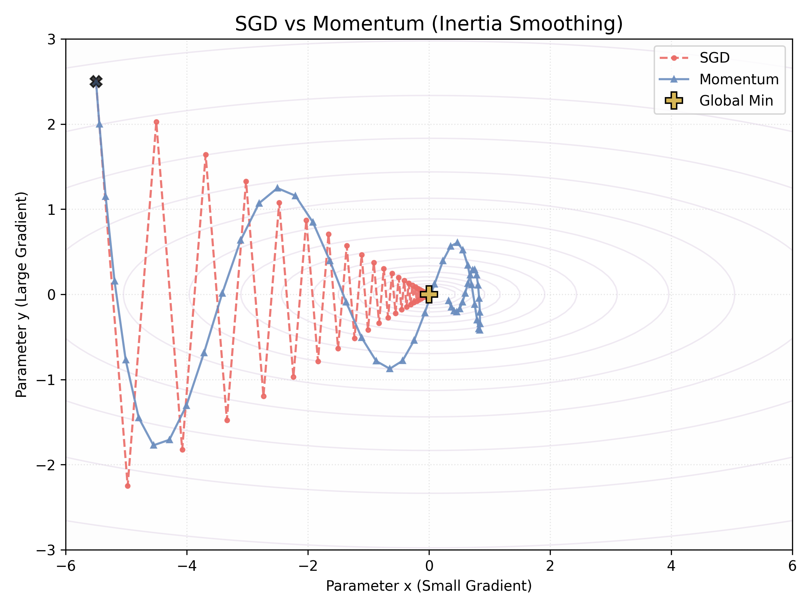

##### 2. Adaptive Learning Rate (自适应学习率)
**直观理解**：不同的参数扮演不同的角色。对于经常更新的参数（如常见词的 Embedding），我们希望步长小一点以微调；对于很少更新的稀疏参数（如生僻词），一旦出现，我们希望步长大一点以抓住机会。
**RMSProp** 通过衡量梯度的“大小”来动态调整每个参数的学习率。

**数学定义**：
我们计算梯度平方的移动平均 $s_t$（即二阶矩估计）：
$$ s_t = \beta s_{t-1} + (1-\beta) g_t^2 $$
$$ w_{t+1} = w_t - \frac{\eta}{\sqrt{s_t + \epsilon}} g_t $$
*   当梯度很大（陡峭）时，$s_t$ 变大，分母变大，有效学习率减小（防止震荡）。
*   当梯度很小（平坦）时，$s_t$ 变小，分母变小，有效学习率增大（加速通过平原）。

##### 3. Adam (Adaptive Moment Estimation)
这是目前的默认选择（Default Go-to Optimizer）。

**为什么需要 Adam？**
*   **动量法的局限**：虽然解决了震荡，但在极度拉伸的峡谷中，单一的全局学习率可能导致在平缓方向上移动极其缓慢。
*   **自适应法的局限**：虽然解决了尺度问题，但 RMSProp 缺乏惯性，在接近收敛时容易受随机噪声影响而在最优点附近抖动。

**Adam 的集大成之道**：
Adam 优雅地结合了二者。它同时维护**一阶矩 $m_t$**（动量，提供惯性）和**二阶矩 $v_t$**（自适应缩放，调整步长）。

**数学定义**：
1.  **一阶矩与二阶矩**：
    $$ m_t = \beta_1 m_{t-1} + (1-\beta_1) g_t \quad \text{(Momentum)} $$
    $$ v_t = \beta_2 v_{t-1} + (1-\beta_2) g_t^2 \quad \text{(RMSProp)} $$
2.  **参数更新**：
    $$ w_{t+1} = w_t - \eta \frac{\hat{m}_t}{\sqrt{\hat{v}_t} + \epsilon} $$
    *(注：$\hat{m}, \hat{v}$ 为偏差修正后的值。典型参数：$\beta_1=0.9, \beta_2=0.999$)*

**优化器轨迹总览 (The Grand Comparison)**：
我们将所有优化器的轨迹绘制在同一张图上，可以清晰地看到进化的脉络：

*   **SGD (红色)**：受困于峡谷的陡峭壁面，剧烈震荡，寸步难行。
*   **Momentum (蓝色)**：引入惯性，冲破了震荡，但步长单一。
*   **RMSProp (紫色)**：自适应调整步长，能够快速穿越平缓区，但路径有抖动。
*   **Adam (绿色)**：结合了一阶动量与二阶自适应缩放，在许多非凸问题上更快、更稳；但它并不保证总是优于 SGD，最终效果仍取决于学习率、正则化、数据规模和目标函数形状。

#### 2.1.6 权重初始化：打破对称与保持方差

在构建好深度神经网络的架构后，我们需要给每个参数赋一个初始值。这一步看似随意，实则决定了训练的生死。如果不恰当的初始化，反向传播时梯度信号会迅速衰减至死（梯度消失）或无限放大（梯度爆炸）。

##### 1. 直观理解：传声筒游戏 (Telephone Game)
想象深度网络是一个有 100 层接力者的传声筒游戏。
*   **输入信号**（数据）就像初始的悄悄话。
*   **层与层之间**的传递，就是将信号乘以权重 $W$。
*   **如果 $W$ 太小 (比如 0.01)**：声音会越来越小，传到第 10 层时已经听不见了（**梯度消失**）。
*   **如果 $W$ 太大 (比如 1.5)**：声音会越来越大，传到第 10 层时变成了震耳欲聋的噪音（**梯度爆炸**）。
*   **全零初始化**：如果所有人都被告知“保持沉默”（$W=0$），那么无论输入什么，输出都是 0。更糟糕的是，反向传播时所有神经元收到的梯度完全相同，它们将永远同步更新，网络退化为一个单神经元模型（**对称性陷阱**）。

##### 2. 数学原理：方差守恒 (Variance Preservation)
为了让信号在深层网络中健康传播，我们需要保证每一层的**输出方差**与**输入方差**一致。
设 $y = w_1 x_1 + \dots + w_n x_n$，假设 $w$ 和 $x$ 相互独立且均值为 0，根据方差性质：
$$ \text{Var}(y) = \text{Var}\left(\sum w_i x_i\right) = \sum \text{Var}(w_i x_i) = \sum \text{Var}(w_i)\text{Var}(x_i) $$
$$ \text{Var}(y) = n \cdot \text{Var}(w) \cdot \text{Var}(x) $$
为了保持信号不衰减也不爆炸，我们要令 $\text{Var}(y) = \text{Var}(x)$，这导出了初始化的黄金法则：
$$ n \cdot \text{Var}(w) = 1 \implies \text{Var}(w) = \frac{1}{n} $$

##### 3. 初始化的演进
下图展示了一个 10 层网络在不同初始化策略下的激活值分布演变：

*   **Small Random (0.01)**：激活值迅速向 0 坍缩，信号丢失。
*   **Large Random (1.0)**：激活值迅速向 -1 和 1 两端饱和（对于 Tanh），导致梯度为 0。
*   **Xavier Initialization (Glorot Init)**:
    *   **适用**：Sigmoid / Tanh 激活函数。
    *   **公式**：$W \sim U(-\sqrt{6/(n_{in}+n_{out})}, \sqrt{6/(n_{in}+n_{out})})$
    *   **效果**：如上图第三行所示，激活值在所有层都保持了良好的正态分布，信号稳定传播。
*   **He Initialization (Kaiming Init)**:
    *   **适用**：ReLU 及其变种。
    *   **原理**：ReLU 会将负半轴的信号置为 0，相当于砍掉了一半的方差。为了补偿，初始权重的方差需要加倍 ($\times 2$)。
    *   **公式**：$W \sim N(0, \sqrt{2/n_{in}})$。这是训练深层 ResNet 的关键。
    *   **效果**：如上图第四行所示，即使经过 10 层 ReLU，信号强度依然保持稳定。

------------------------------------------------------------------------------------------------

至此，我们已经完成了深度学习“内功心法”的修炼。
*   我们理解了**泛化**是目标，**过拟合**是宿敌，**正则化**是武器；
*   我们解释了神经网络在紧致集上逼近连续函数的**通用近似**能力及其存在性意义；
*   我们掌握了**反向传播**如何计算梯度，**优化器**如何利用梯度穿越险阻，**初始化**如何让网络赢在起跑线上。

这就好比我们已经掌握了物理学中的牛顿定律和微积分。接下来，我们将运用这些基本原理去构建精密的机器，处理真实世界中两类最重要的数据：
1.  **空间数据（图像）**：我们将看到 CNN 如何通过“卷积”捕捉局部特征，解决计算机视觉问题。
2.  **时间数据（序列）**：我们将看到 RNN 及其进化体 LSTM 如何通过“记忆”捕捉时序依赖，解决自然语言处理问题。

让我们翻开下一页，进入架构的魔法世界。

## 2.2 卷积神经网络：视觉皮层的数学抽象
### 2.2 Convolutional Neural Networks (CNN)

人类的视觉系统是一个奇迹。当你看到一只猫时，你不需要逐个像素地扫描，而是瞬间捕捉到边缘、纹理、形状，最终组合成“猫”的概念。这种层级化的特征提取机制，最早由 Hubel 和 Wiesel 在 1959 年对猫的视皮层研究中发现。

卷积神经网络 (CNN) 正是这一生物机制的数学抽象。本节我们将深入这一架构的核心，解析其背后的 **归纳偏置**、**算术原理** 以及 **架构演进** 的哲学。

#### 2.2.1 归纳偏置：为什么是卷积？ (The Inductive Bias)

全连接网络 (MLP) 在处理图像时面临两个致命问题：
1.  **参数爆炸**：一张 $1000 \times 1000$ 的图片输入到 1000 个神经元的隐层，参数量高达 $10^{9}$ (10亿)，这几乎不可训练。
2.  **结构丢失**：将图像拉平成向量后，像素间的空间邻域关系不再被模型显式保留。

CNN 引入了两个强有力的 **归纳偏置 (Inductive Bias)** 来解决这些问题：

*   **局部连接 (Local Connectivity)**：
    图像中的相关性通常是局部的。一个像素与其周围的像素关系最密切，而与远处的像素关系较弱。因此，神经元只需连接输入的一个小局部（感受野）。
*   **平移等变性 (Translation Equivariance)**：
    一只猫在图片左上角还是右下角，它都是一只猫。这意味着特征检测器（卷积核）应该在整个图像上**共享参数**。

这两点使得 CNN 的参数量与图像尺寸无关，而只与卷积核大小相关，从而极大地提升了效率。

#### 2.2.2 卷积的算术原理 (The Arithmetic of Convolution)

虽然名为“卷积”，但在深度学习中，我们实际使用的是**互相关 (Cross-Correlation)** 运算（不涉及卷积核的翻转）。

##### 1. 离散卷积公式 (Matrix View)
对于单通道图像 $I$ 和卷积核 $K$，在局部窗口内的运算本质上就是两个矩阵的**点积**（Frobenius Inner Product）。
假设局部输入窗口为 $\mathbf{X}_{local}$，卷积核为 $\mathbf{K}$：
$$
\mathbf{X}_{local} = \begin{bmatrix} x_{11} & x_{12} \\ x_{21} & x_{22} \end{bmatrix}, \quad
\mathbf{K} = \begin{bmatrix} k_{11} & k_{12} \\ k_{21} & k_{22} \end{bmatrix}
$$
则输出值 $y$ 为对应元素相乘求和：
$$
y = \langle \mathbf{X}_{local}, \mathbf{K} \rangle = \sum \sum x_{ij} k_{ij} = x_{11}k_{11} + x_{12}k_{12} + x_{21}k_{21} + x_{22}k_{22}
$$
*   **物理意义**：这衡量了输入局部区域 $\mathbf{X}_{local}$ 与卷积核 $\mathbf{K}$ 的**相似度**。如果输入模式（如垂直边缘）与卷积核（垂直边缘检测器）吻合，结果 $y$ 就会很大（激活）。

##### 2. 核心超参数与几何维度
一个卷积层由四个关键维度定义：
*   **$C_{in} / C_{out}$**：输入与输出通道数。
*   **$K$ (Kernel Size)**：卷积核大小（通常为 $3 \times 3$ 或 $5 \times 5$）。
*   **$P$ (Padding)**：填充大小，用于保持尺寸。
*   **$S$ (Stride)**：步长，控制滑动窗口的跳跃幅度。

下图直观展示了卷积、填充和步长的几何关系：

##### 3. 输出尺寸公式 (The Magic Formula)
给定输入尺寸 $H_{in} \times W_{in}$，输出特征图的尺寸可以通过以下公式计算：

$$ H_{out} = \left\lfloor \frac{H_{in} + 2P - K}{S} \right\rfloor + 1 $$
$$ W_{out} = \left\lfloor \frac{W_{in} + 2P - K}{S} \right\rfloor + 1 $$

*   **Same Padding**：若希望输出尺寸不变 ($H_{out} = H_{in}$)，且 $S=1$，需设置 $P = \frac{K-1}{2}$（要求 $K$ 为奇数）。
*   **Valid Padding**：$P=0$，不填充，尺寸会逐层减小。
*   **下采样 (Downsampling)**：当 $S=2$ 时，特征图尺寸减半 ($H_{out} \approx H_{in}/2$)，常用于替代池化层。

##### 4. 通道视角的卷积 (Channel View: The 3D Nature)
初学者常误以为卷积是 2D 运算，实际上它是 **3D 运算**。
假设输入是 RGB 图像 ($C_{in}=3$)，卷积核的形状实际上是 $K \times K \times C_{in}$（如 $3 \times 3 \times 3$）。

$$ \text{Output}(x,y) = \sum_{c=1}^{C_{in}} \sum_{i,j} \text{Input}(x+i, y+j, c) \cdot \text{Kernel}(i, j, c) + \text{Bias} $$

**关键性质**：
*   **聚合通道**：一个卷积核会“看遍”所有输入通道，将它们的信息加权求和，坍缩为一个**单通道**的特征图 (2D Feature Map)。
*   **扩展通道**：为了得到 $C_{out}$ 个输出通道，我们需要 $C_{out}$ 个独立的卷积核（Filters）。
*   **总参数量**：$\text{Params} = (K \times K \times C_{in} + 1) \times C_{out}$。注意参数量与输入图片大小 $H \times W$ 无关！

#### 2.2.3 池化层：信息的压缩与筛选 (Pooling Layers)

卷积层负责提取特征，而池化层负责**压缩特征**。它通常跟在卷积层之后。

##### 1. 为什么需要池化？
*   **降低计算量**：通过减小特征图尺寸，显著减少后续层的计算开销。
*   **平移不变性 (Translation Invariance)**：这是池化最重要的数学性质。如果输入图像向右移动一个像素，最大池化（Max Pooling）的输出可能保持不变。这意味着网络对物体微小的位置变化不敏感。
*   **扩大感受野**：通过下采样，后续卷积核能“看到”更大的原图区域。

##### 2. 常见操作
*   **最大池化 (Max Pooling)**：选出局部窗口内的最大值。
    *   *直觉*：只保留最显著的特征（如最亮的边缘），丢弃背景噪声。
*   **平均池化 (Average Pooling)**：计算局部窗口的平均值。
    *   *直觉*：平滑特征，保留背景信息。

$$
\text{Input: } \begin{bmatrix} 1 & 3 \\ 2 & 9 \end{bmatrix} \quad \xrightarrow{\text{Max}} 9, \quad \xrightarrow{\text{Avg}} 3.75
$$

*   **全局平均池化 (Global Average Pooling, GAP)**：将整个 $H \times W$ 的特征图取平均，得到一个数值。这在现代网络（如 ResNet）中常用于替代全连接层。

#### 2.2.4 训练与学习动力学 (Training and Learning Dynamics)

很多初学者容易误解一点：以为卷积核（Kernel）是像 Photoshop 滤镜一样，由工程师预先定义好的（如 Sobel 算子）。

**事实并非如此。** 在 CNN 中，卷积核 $\mathbf{K}$ 就是神经网络的**权重 (Weights)**。它们初始化时是随机噪声，通过**端到端 (End-to-End)** 的训练，网络自动“学会”了应该长成什么样来提取有用的特征。

##### 1. 架构全景图：从像素到决策 (The Architecture Panorama)

从宏观视角看，标准的 CNN 分类器在结构上正是由 **前端的“卷积特征提取器”** 和 **后端的“传统 MLP 分类器”** 串联而成的。

这一架构把 **前端感知 (Perception)** 与 **后端决策 (Decision)** 组织成一个端到端系统，并通过 **特征提取 (Feature Extraction)**、**空间压缩 (Spatial Compression)** 与 **逻辑决策 (Logical Decision)** 这三个功能阶段层层递进：

我们以经典的 ResNet-50 为例，追踪张量 (Tensor) 在这三个阶段中的形态演变：

```mermaid
graph LR
    %% 样式定义
    classDef tensor fill:#F5F5F5,stroke:#666666,color:#000000,shape:rect;
    classDef op fill:#DAE8FC,stroke:#6C8EBF,color:#000000,shape:rounded;
    classDef vector fill:#FFF2CC,stroke:#D6B656,color:#000000,shape:rect;

    subgraph FrontEnd ["Part 1: 卷积前端 (The Convolutional Eye)"]
        style FrontEnd fill:#FFFFFF,stroke:#6C8EBF,stroke-width:2px,stroke-dasharray: 5 5
        direction TB

        subgraph Stage1 ["Stage 1: 特征提取 (Body)"]
            direction TB
            Input["Raw Image<br/>(H, W, 3)"]:::tensor --> Conv1["Conv Layers"]:::op
            Conv1 --> Feats["Feature Maps<br/>(H/32, W/32, 2048)"]:::tensor
        end

        subgraph Stage2 ["Stage 2: 空间压缩 (Neck)"]
            direction TB
            Feats --> GAP["Global Avg Pool"]:::op
            GAP --> Vector["Feature Vector<br/>(1, 2048)"]:::vector
        end
    end

    subgraph BackEnd ["Part 2: MLP 后端 (The MLP Brain)"]
        style BackEnd fill:#FFFFFF,stroke:#D6B656,stroke-width:2px,stroke-dasharray: 5 5
        direction TB

        subgraph Stage3 ["Stage 3: 逻辑决策 (Head)"]
            direction TB
            Vector --> FC["Linear Classifier"]:::op
            FC --> Probs["Class Probabilities<br/>(1, 1000)"]:::vector
        end
    end

    style Stage1 fill:#F9F9F9,stroke:#D6D6D6,stroke-dasharray: 0
    style Stage2 fill:#F9F9F9,stroke:#D6D6D6,stroke-dasharray: 0
    style Stage3 fill:#F9F9F9,stroke:#D6D6D6,stroke-dasharray: 0
```

**张量演变视图 (Tensor Evolution View)**：

$$
\underbrace{\begin{bmatrix} H \\ W \\ 3 \end{bmatrix}}_{\text{Image}}
\xrightarrow{\text{Conv}}
\underbrace{\begin{bmatrix} \downarrow \\ \downarrow \\ \uparrow \end{bmatrix}}_{\text{Spatial } \downarrow, \text{ Channel } \uparrow}
\xrightarrow{\text{GAP}}
\underbrace{\begin{bmatrix} 1 \\ 1 \\ C \end{bmatrix}}_{\text{Vector}}
\xrightarrow{\text{FC}}
\underbrace{\begin{bmatrix} N_{class} \end{bmatrix}}_{\text{Logits}}
$$

我们将整个流水线的功能模块（三段式）与其宏观结构（两段式）对应起来：

**Part 1: 卷积前端 (The Convolutional Front-End)**
负责“看懂”图像，承担了前两个功能阶段：
*   **Stage 1: 特征提取 (Feature Extraction)**
    *   **动作**：堆叠卷积层 (Conv) 和下采样 (Pooling/Stride)。
    *   **目的**：**"空间换语义"**。
    *   **形态变化**：空间维度 ($H, W$) 不断缩小，通道维度 ($C$) 不断增加。
*   **Stage 2: 空间压缩 (Spatial Compression / Neck)**
    *   **动作**：全局平均池化 (Global Average Pooling, GAP) 或 Flatten。
    *   **目的**：**"三维转一维"**。
    *   **直观理解**：GAP 将每个通道的特征图（如猫耳特征）坍缩为一个标量，最终形成一个语义向量。这标志着从“图像处理”到“向量处理”的质变。

**Part 2: MLP 后端 (The MLP Back-End)**
负责基于特征进行“决策”，承担了最后一个功能阶段：
*   **Stage 3: 逻辑决策 (Logical Decision / Head)**
    *   **动作**：全连接层 (Linear Layer) + Softmax。
    *   **目的**：**"特征映射到类别"**。
    *   **直观理解**：这本质上是一个简单的逻辑回归或 MLP。它基于前端提供的“体检报告”（特征向量），计算分类概率。

##### 2. 训练循环 (The Training Loop)
这是一个**监督学习 (Supervised Learning)** 过程。

1.  **初始化**：卷积核 $\mathbf{K}$ 初始化为高斯噪声。此时网络输出也是噪声。
2.  **前向传播**：图片输入，经过层层随机卷积，输出预测结果。
3.  **计算损失**：对比预测与真实标签，计算 Loss。
4.  **反向传播**：计算 Loss 对卷积核的梯度。
5.  **参数更新**：使用梯度下降更新卷积核。

##### 3. 数学推导：卷积层的反向传播 (Mathematical Derivation)

为了避开繁琐的求和符号下标 ($\sum_{i,j}$)，最直观的方法是利用 **im2col (image-to-column)** 技术，将卷积运算转换为我们熟悉的**矩阵乘法**。这也是 Caffe、PyTorch 等框架底层的加速实现方式。

**(1) 前向传播的矩阵化 (im2col)**

假设我们把输入 $X$ 中的每一个 $k \times k$ 局部感受野窗口拉平成一个 **列向量**，并将它们按顺序排列成一个大矩阵 $X_{col}$。

**直观示例 (Matrix Expansion Example)**：
假设输入 $X$ 为 $3 \times 3$，卷积核 $K$ 为 $2 \times 2$，步长 $S=1$（无填充）。

$$ X = \begin{bmatrix} x_{11} & x_{12} & x_{13} \\ x_{21} & x_{22} & x_{23} \\ x_{31} & x_{32} & x_{33} \end{bmatrix} $$

我们按行滑动提取 4 个局部窗口，并将其拉平为列向量：
1.  **左上窗口** $\to [x_{11}, x_{12}, x_{21}, x_{22}]^T$
2.  **右上窗口** $\to [x_{12}, x_{13}, x_{22}, x_{23}]^T$
3.  **左下窗口** $\to [x_{21}, x_{22}, x_{31}, x_{32}]^T$
4.  **右下窗口** $\to [x_{22}, x_{23}, x_{32}, x_{33}]^T$

拼接成 $X_{col}$ 矩阵（形状 $[k^2, N] = [4, 4]$）：

$$
X_{col} =
\begin{bmatrix}
x_{11} & x_{12} & x_{21} & x_{22} \\
x_{12} & x_{13} & x_{22} & x_{23} \\
x_{21} & x_{22} & x_{31} & x_{32} \\
x_{22} & x_{23} & x_{32} & x_{33}
\end{bmatrix}
$$
*(注：矩阵的每一列代表一个滑动窗口，每一行对应卷积核的一个权重位置)*

此时，卷积计算 $Y = X * K$ 就变成了简单的矩阵乘法：
$$ Y_{vec} = W_{row} \cdot X_{col} $$

*   $W_{row}$: 卷积核拉平后的行向量，形状 $[1, k^2]$。
*   $X_{col}$: 展开后的输入矩阵，形状 $[k^2, N]$，其中 $N$ 是输出像素的总数。
*   $Y_{vec}$: 输出特征图拉平后的向量，形状 $[1, N]$。

**(2) 反向传播 (Backward)**
现在，问题变成了对标准矩阵乘法 $Y = WX$ 求导。假设我们已知从 **后端 MLP** 或后续层回传来的误差梯度 $\delta_{vec}$，我们可以直接复用全连接层的结论（完整推导见 [附录 A.6](appendix/a.6_backpropagation.md)）：

*   **对权重的梯度 $\nabla_W \mathcal{L}$**：
    已知全连接层规则 $\frac{\partial L}{\partial W} = \delta \cdot X^T$，直接代入得：
    $$ \nabla_{W_{row}} \mathcal{L} = \delta_{vec} \cdot X_{col}^T $$
    直观含义 $\delta_{vec}$ 是误差， $X_{col}^T$ 包含了所有局部输入块。这个矩阵乘法本质上就是将**误差**与**对应的局部输入**相乘并求和。这正是**互相关**的定义。

*   **对输入的梯度 $\nabla_X \mathcal{L}$**：
    已知全连接层规则 $\frac{\partial L}{\partial X} = W^T \cdot \delta$，直接代入得：
    $$ \nabla_{X_{col}} \mathcal{L} = W_{row}^T \cdot \delta_{vec} $$
    这里求出的是“展开后矩阵 $X_{col}$”的梯度。为了得到原始图像 $X$ 的梯度，我们需要执行 **col2im** 操作（im2col 的逆过程）。
    关键点 由于输入图像中的一个像素 $x_{i,j}$ 会出现在多个滑动窗口中（即在 $X_{col}$ 中出现了多次），col2im 操作会将这些位置的梯度**累加**起来。
    *   **权重转置** ($W^T$)：意味着梯度的反向传播使用了权重的转置。
    *   **梯度累加** (col2im)：意味着误差被分摊回所有感受野。

    这个“权重翻转 + 滑动累加”的过程，在数学上严格等价于 **$\delta$ 与翻转后的卷积核 $K$ 进行互相关**（即数学上的卷积，详细证明见 **[附录 A.9](appendix/a.9_cnn_backpropagation.md)**）。

**结论总结**：
1.  $\nabla_K \mathcal{L} = X * \delta$ （输入与误差的互相关）
2.  $\nabla_X \mathcal{L} = \delta * \text{rot180}(K)$ （误差与翻转核的互相关）

通过矩阵视角，我们不需要纠结下标索引，就能清晰地看到：卷积层的反向传播，本质上就是全连接层反向传播在**权值共享**约束下的特殊形式。

##### 4. 学习动力学：从边缘到语义 (Learning Dynamics)

理解了数学机制，我们来看看通过这种机制，CNN 到底学到了什么。
我们可以把 CNN 想象成一个**搭积木**的过程。每一层都在利用上一层提供的简单积木，搭建出更复杂的积木。

*   **浅层 (Layer 1-2)：视觉原语**
    *   网络的最底层（靠近输入）通常学习到了类似于 **Gabor 滤波器** 的特征。
    *   **功能**：检测各个方向的**边缘**（横线、竖线）、**颜色斑点**、**纹理**。
    *   **直观类比**：这就像我们在画画前，先准备好各种线条和颜料。

*   **中层 (Layer 3-4)：部件组合**
    *   网络的中层开始将边缘和纹理组合成有意义的**局部部件**。
    *   **功能**：检测眼睛、耳朵、车轮、窗户等。
    *   **直观类比**：用线条画出了“圆形”、“三角形”等几何形状。

*   **深层 (Layer 5+)：语义实体**
    *   网络的深层（靠近输出）将部件组合成完整的**物体概念**。
    *   **功能**：检测人脸、猫、汽车等完整对象，甚至包括场景（卧室、海滩）。
    *   **直观类比**：将几何形状组合成了一幅完整的画作。

**特征可视化 (Feature Visualization)**：
下图展示了在 ImageNet 上训练好的 CNN，不同层级神经元被激活得最强烈的输入模式：

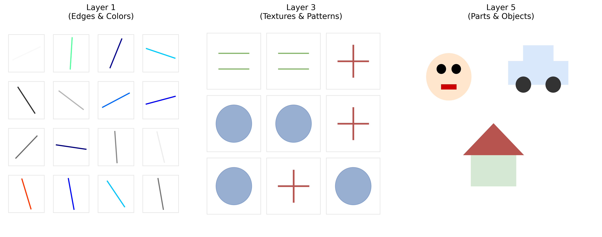
*(图注：左侧浅层关注纹理，右侧深层关注物体部件。)*

#### 2.2.5 感受野：管中窥豹 (Receptive Field)

**感受野 (Receptive Field, RF)** 是指输出特征图上的一个像素点，在原始输入图像上“看到”的区域大小。
*   **意义**：RF 决定了神经元能利用多大范围的上下文信息。如果 RF 小于目标物体（如只能看到大象的一条腿），网络就无法识别出整体。

##### 1. 感受野的逐层累积
感受野并非一成不变，而是随着网络加深而扩大。
*   **Layer 1**：$3 \times 3$ 卷积的 RF 是 $3 \times 3$。
*   **Layer 2**：在 Layer 1 的基础上再叠一个 $3 \times 3$ 卷积。Layer 2 的一个点看 Layer 1 的 $3 \times 3$，而 Layer 1 的每个点又看输入的 $3 \times 3$。最终 Layer 2 在输入上的 RF 是 $5 \times 5$。

**通项公式 (Recursive Formula)**：
令 $R_l$ 为第 $l$ 层特征图对应的输入感受野大小，$S_l, K_l$ 分别为第 $l$ 层的步长和核大小。
$$ R_l = R_{l-1} + (K_l - 1) \times \prod_{i=1}^{l-1} S_i $$
*(注：$R_0 = 1$)*

*   **直观解读**：
    *   **线性增长**：如果所有 stride $S=1$，感受野随层数线性增加 ($R_L \approx L \times K$)。
    *   **指数增长**：如果存在 stride $S=2$（下采样），累积步长 $\prod S_i$ 会迅速变大，感受野将呈指数级爆发。这就是为什么深层 CNN (如 ResNet) 能够捕捉全局语义。

##### 2. 有效感受野 (Effective Receptive Field)
理论 RF 往往非常大（甚至超过图片尺寸），但研究（Luo et al., 2016）发现，像素对输出的实际贡献并非均匀分布，而是服从**高斯分布**。
*   **中心强化**：RF 中心的像素影响最大。
*   **边缘衰减**：RF 边缘的像素影响微乎其微。
这意味着，虽然理论上神经元“看”到了全图，但它真正聚焦的还是中心区域。这解释了为什么我们需要 Attention 机制来打破这种局部聚焦的限制。

#### 2.2.6 经典架构演进：从 AlexNet 到 ResNet

卷积神经网络的发展史，就是一部不断堆叠深度、优化计算效率的历史。我们将通过几个里程碑式的模型，来看看工程师们是如何一步步突破算力和梯度的限制，将网络做深、做强的。

##### 1. AlexNet (2012)：深度的黎明
*   **深度**：8层 (5个卷积层 + 3个全连接层)。
*   **贡献**：
    *   **实证突破**：在大规模图像数据集 (ImageNet) 上清楚显示，多层卷积网络在端到端特征学习方面可以显著超过依赖手工特征 (SIFT/HOG) 的传统流程。
    *   **工程突破**：系统性使用 **ReLU** (缓解梯度饱和)、**Dropout** (降低过拟合风险) 和 **GPU 并行训练**。
*   **局限**：卷积核很大 ($11 \times 11, 5 \times 5$)，参数量巨大（大部分集中在最后的全连接层）。

##### 2. VGGNet (2014)：暴力美学的极致
*   **深度**：19层。
*   **核心思想：模块化 (Modularity)**。
    *   它抛弃了 AlexNet 中杂乱的大卷积核，全网统一使用 **$3 \times 3$** 的微小卷积核。
    *   **为什么是 $3 \times 3$？**
        *   堆叠两个 $3 \times 3$ 卷积层，感受野等于一个 $5 \times 5$。
        *   但参数量更少 ($2 \times 3^2 = 18 < 5^2 = 25$)。
        *   且多了层非线性激活，表达能力更强。
*   **局限**：全连接层依然导致参数量惊人 (138M)，且层数达到 20 层左右时，训练开始变得极其困难（梯度消失）。

##### 3. GoogLeNet (Inception) (2014)：多尺度融合
*   **深度**：22层。
*   **核心思想：宽度代替深度**。
    *   **Inception Block**：在同一层并行使用 $1 \times 1, 3 \times 3, 5 \times 5$ 卷积核，让网络自己决定该用大视野还是小视野。
    *   **$1 \times 1$ 卷积**：这是一个天才的设计。它被用来压缩通道数（降维），极大地减少了计算量，被称为“瓶颈层 (Bottleneck)”。

##### 4. ResNet (2015)：打破深度的天花板
*   **深度**：152层（甚至可达 1000 层）。
*   **背景：退化问题 (Degradation Problem)**
    研究者在继续加深普通网络时发现一个反直觉现象：**更深的网络在训练集上的误差反而更高了**。这通常不是过拟合（过拟合是训练好、测试差），而是网络优化变难，即所谓退化问题。
*   **核心创新：残差学习 (Residual Learning)**
    ResNet 引入了 **Skip Connection (跨层连接)**，将输入 $x$ 直接加到输出上，即 $H(x) = F(x) + x$。
    *   **为什么叫“残差”？**
        假设这一层的目标是拟合最优映射 $H(x)$。
        *   **传统网络**：让非线性层 $F(x)$ 直接去拟合 $H(x)$。
        *   **ResNet**：让 $F(x)$ 去拟合 $H(x) - x$。这里的 $H(x) - x$（目标值减去输入值）在数学上就叫做**残差 (Residual)**。
    *   **直观理解（微调策略）**：
        想象你要把一张模糊图片($x$)修复为清晰图片($H(x)$)。
        *   **不带残差**：你需要从白纸开始，完整地画出清晰图片。
        *   **带残差**：你直接保留模糊图片，只需要画出“丢失的细节”（即残差 $F(x)$），然后把它叠加上去。在许多层中，学习“差值”比学习“全量”更容易优化。
    *   **恒等映射 (Identity Mapping)**：
        如果某一层其实什么都不需要做（特征已经足够好），网络只需将 $F(x)$ 的权重推向 0，就能较容易地实现 $H(x) = x$。而在传统网络中，要稳定拟合 $F(x) = x$ 这种恒等变换会更困难。
    *   **梯度高速公路**：在反向传播时，Skip Connection 为梯度提供了额外的恒等传播路径，显著缓解了深层网络训练中的退化问题和梯度衰减问题，但并不意味着所有深层训练困难都被彻底消除。

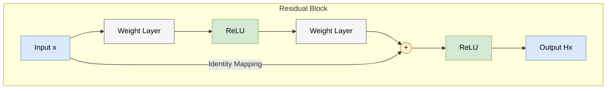

#### 2.2.7 现代设计原语 (Modern Primitives)

在 ResNet 之后，CNN 的设计转向了更高效的算子，旨在移动端部署和极大规模扩展。我们从数学角度来看这些优化是如何实现的。

##### 1. 深度可分离卷积 (Depthwise Separable Convolution) - MobileNet
标准卷积同时处理**空间信息**（$H \times W$）和**通道信息**（$C_{in} \to C_{out}$）。MobileNet 将其拆解为两步：
1.  **Depthwise Conv (DW)**：每个输入通道只由一个卷积核处理（不跨通道）。
2.  **Pointwise Conv (PW)**：用 $1 \times 1$ 卷积在通道间混合信息。

**计算量对比**：
假设输入 $H \times W \times C_{in}$，输出 $C_{out}$，核大小 $K \times K$。
*   **标准卷积**：$H \cdot W \cdot C_{in} \cdot C_{out} \cdot K^2$
*   **DW + PW**：$\underbrace{H \cdot W \cdot C_{in} \cdot K^2}_{\text{Depthwise}} + \underbrace{H \cdot W \cdot C_{in} \cdot C_{out} \cdot 1^2}_{\text{Pointwise}}$
*   **压缩比**：
    $$ \frac{\text{DW+PW}}{\text{Standard}} = \frac{K^2 C_{in} + C_{in} C_{out}}{K^2 C_{in} C_{out}} = \frac{1}{C_{out}} + \frac{1}{K^2} $$
    若 $K=3$，计算量通常能减少到原来的 **1/8** 到 **1/9**，是移动端模型的基石。

##### 2. 分组卷积 (Group Convolution) - ResNeXt
将输入通道 $C_{in}$ 分成 $g$ 组，每组独立进行卷积，最后再拼接。
*   **数学意义**：标准卷积的权重矩阵是全满的，而分组卷积强制权重矩阵为**块对角矩阵 (Block-diagonal Matrix)**。
*   **稀疏连接**：这是一种结构化的稀疏性。它减少了参数量（约减少 $g$ 倍），也可能通过限制通道间任意混合而带来一定的正则化效果。它与 Transformer 中 **Multi-head Attention** 都体现了“把表示空间分成若干子空间分别处理，再进行融合”的思想，但二者不是严格的一一对应物。

##### 3. 挤压与激励 (Squeeze-and-Excitation, SE) - SENet
这是**通道注意力 (Channel Attention)** 的鼻祖，旨在让网络自动学习“哪些通道更重要”。
过程分为三步：
1.  **Squeeze (全局池化)**：将空间信息 $H \times W$ 压缩为一个实数，得到通道描述符 $z \in \mathbb{R}^C$。
    $$ z_c = \frac{1}{H \times W} \sum_{i=1}^H \sum_{j=1}^W u_c(i,j) $$
2.  **Excitation (自适应权重)**：通过两个全连接层（降维再升维）学习通道间的非线性关系，生成权重向量 $s$。
    $$ s = \sigma(W_2 \cdot \text{ReLU}(W_1 z)) $$
3.  **Scale (加权)**：将权重 $s_c$ 乘回原特征图的对应通道。
    $$ \tilde{u}_c = s_c \cdot u_c $$
**效果**：几乎不增加计算量，却能显著提升模型对关键特征的敏感度。

---

CNN 曾统治计算机视觉十年。虽然 Vision Transformer (ViT) 如今风头正劲，但 CNN 的归纳偏置（局部性、平移等变性）在小数据集和底层特征提取上依然具有不可替代的优势。实际上，最先进的模型（如 ConvNeXt）正在重新引入 CNN 的设计哲学来优化 Transformer。

## 2.3 循环神经网络：序列动力学
### 2.3 Recurrent Neural Networks (RNN)

卷积神经网络 (CNN) 解决了图像中的空间相关性问题，而**循环神经网络 (RNN)** 则是为了解决**时间序列 (Time Series)** 和**序列数据 (Sequential Data)** 而生的。

从自然语言处理 (NLP) 到语音识别，再到股票预测，这些任务的核心特点是：**当前的输出不仅取决于当前的输入，还取决于“过去”的历史信息。**

#### 2.3.1 序列建模与参数共享 (Sequence Modeling & Parameter Sharing)

在前馈网络 (MLP/CNN) 中，我们假设样本 $x_i$ 之间是独立同分布 (i.i.d.) 的。但在序列问题中，输入是 $x^{(1)}, x^{(2)}, \dots, x^{(T)}$，它们之间存在强依赖。

RNN 的核心思想是**参数共享 (Parameter Sharing)**：我们在所有时间步 (Time Steps) 上使用**同一个**权重矩阵。这不仅大幅减少了参数量，更重要的是，它赋予了模型处理**任意长度**序列的能力。

##### 1. 计算图展开 (Unrolling the Graph)
我们可以将 RNN 视为一个在时间上无限复制自身的层。为了理解这个结构，我们先明确图中的关键符号：

*   **$\mathbf{x}_t$ (Input)**：$t$ 时刻的输入向量（例如句子中第 $t$ 个单词的词向量）。
*   **$\mathbf{h}_t$ (Hidden State)**：$t$ 时刻的隐状态向量，代表系统的**记忆**。
*   **$\mathbf{y}_t$ (Output)**：$t$ 时刻的输出向量（例如预测的下一个单词）。
*   **$\mathbf{W}_{hh}$ (Recurrent Weight)**：连接上一时刻状态与当前状态的权重矩阵。**关键点**：该矩阵在所有时间步是**共享**的（同一个 $\mathbf{W}_{hh}$）。

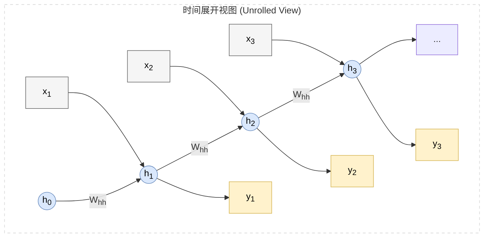

#### 2.3.2 动力学状态方程 (State Equations)

RNN 可以被看作是一个离散时间的**动力系统 (Dynamical System)**。它的核心是**隐状态 (Hidden State)** $\mathbf{h}_t$，充当系统的“记忆”。

##### 1. 状态更新方程 (State Update)
在时刻 $t$，隐状态 $\mathbf{h}_t$ 由当前的输入 $\mathbf{x}_t$ 和上一时刻的状态 $\mathbf{h}_{t-1}$ 共同决定：

$$ \mathbf{h}_t = \tanh(\mathbf{W}_{hh} \mathbf{h}_{t-1} + \mathbf{W}_{xh} \mathbf{x}_t + \mathbf{b}_h) $$

*   $\mathbf{W}_{hh} \in \mathbb{R}^{d_h \times d_h}$：**状态-状态权重** (State-to-State weights)，控制记忆如何随时间演化。
*   $\mathbf{W}_{xh} \in \mathbb{R}^{d_h \times d_x}$：**输入-状态权重** (Input-to-State weights)，将新输入写入记忆。
*   $\tanh$：**非线性激活**。选用 $\tanh$ 是因为它将值压缩在 $(-1, 1)$ 之间，能一定程度上防止状态值在多次迭代后爆炸（相比于 ReLU）。

##### 2. 输出方程 (Output Equation)
输出通常基于当前的隐状态：

$$ \mathbf{y}_t = \text{softmax}(\mathbf{W}_{hy} \mathbf{h}_t + \mathbf{b}_y) $$

##### 3. 动力学解释
如果我们将输入 $\mathbf{x}_t$ 视为外部驱动力，RNN 就是一个**非线性受迫振动系统**。
*   如果 $\mathbf{x}_t = 0$（无输入），系统行为完全由 Jacobian 矩阵 $\mathbf{W}_{hh}$ 的特征值决定。
    *   若特征值 $|\lambda| < 1$，状态 $\mathbf{h}_t$ 会逐渐衰减至 0（遗忘）。
    *   若特征值 $|\lambda| > 1$，状态可能发散（混沌）。
    *   若 $|\lambda| \approx 1$，系统处于临界状态 (Critical State)，最适合保持长期记忆。

---

#### 2.3.3 随时间反向传播 (BPTT - Backpropagation Through Time)

训练 RNN 的算法叫 BPTT。本质上，它就是将 RNN 展开成一个深层网络，然后应用标准的反向传播。但不同的是，所有层**共享**同一组权重 $\mathbf{W}_{hh}$。

##### 1. 误差项的递归推导 (Derivation of Error Term)
我们定义 $t$ 时刻隐状态的梯度为 $\delta_t = \frac{\partial \mathcal{L}}{\partial \mathbf{h}_t}$。
隐状态 $\mathbf{h}_t$ 在计算图中流向了两个分支：
1.  **当前输出**：参与计算 $\mathbf{y}_t$，产生当前时刻的损失 $\mathcal{L}_t$。
2.  **未来状态**：传递给 $\mathbf{h}_{t+1}$，影响未来所有时刻的损失。

根据多元微积分的链式法则，总梯度 $\delta_t$ 是这两部分梯度之和：

$$ \delta_t = \underbrace{\frac{\partial \mathcal{L}_t}{\partial \mathbf{h}_t}}_{\text{直接梯度}} + \underbrace{\left(\frac{\partial \mathbf{h}_{t+1}}{\partial \mathbf{h}_t}\right)^T \delta_{t+1}}_{\text{传递梯度}} $$

这是一个**时间逆序的递归公式**。这意味着我们可以从最后时刻 $T$ 开始（此时没有未来项），反向一步步算出所有时刻的 $\delta_t$。

##### 2. 参数梯度的具体计算 (Gradient Calculation)
一旦计算出 $\delta_t$，我们就可以算出各个参数在 $t$ 时刻的梯度贡献。
回顾状态方程 $\mathbf{h}_t = \tanh(\mathbf{z}_t)$，其中 $\mathbf{z}_t = \mathbf{W}_{hh} \mathbf{h}_{t-1} + \mathbf{W}_{xh} \mathbf{x}_t + \mathbf{b}_h$。
根据链式法则，先计算激活函数前的梯度 $\mathbf{d}_t$：
$$ \mathbf{d}_t = \frac{\partial \mathcal{L}}{\partial \mathbf{z}_t} = \delta_t \circ \tanh'(\mathbf{z}_t) $$
*注：$\circ$ 表示逐元素乘积 (Hadamard product)。*

由于所有时间步共享参数，总梯度是所有时刻贡献的累加：

$$ \begin{aligned} \frac{\partial \mathcal{L}}{\partial \mathbf{W}_{hh}} &= \sum_{t=1}^T \mathbf{d}_t \mathbf{h}_{t-1}^T \\ \frac{\partial \mathcal{L}}{\partial \mathbf{W}_{xh}} &= \sum_{t=1}^T \mathbf{d}_t \mathbf{x}_t^T \\ \frac{\partial \mathcal{L}}{\partial \mathbf{b}_h} &= \sum_{t=1}^T \mathbf{d}_t \end{aligned} $$

这些公式展示了 BPTT 的可计算性：通过一次反向遍历，我们收集了更新所有参数所需的信息。

##### 3. 梯度流图解 (Gradient Flow)

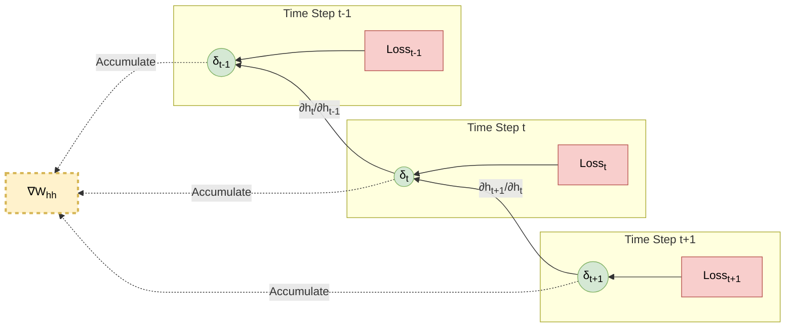

---

#### 2.3.4 数学困境：梯度消失与爆炸 (The Vanishing/Exploding Gradient Problem)

BPTT 算法虽然理论完备，但在实际应用中，处理长序列时往往力不从心。问题的根源直接隐藏在上一节的**传递梯度**中。

##### 1. 逐步推导 Jacobian 矩阵
让我们仔细审视反向传播中的核心项：$\frac{\partial \mathbf{h}_t}{\partial \mathbf{h}_{t-1}}$。
考虑状态更新公式 $\mathbf{h}_t = \tanh(\mathbf{z}_t)$，其中 $\mathbf{z}_t = \mathbf{W}_{hh} \mathbf{h}_{t-1} + \dots$。

根据链式法则，单步反向传播的 Jacobian 矩阵为：
$$ \frac{\partial \mathbf{h}_t}{\partial \mathbf{h}_{t-1}} = \underbrace{\text{diag}(\tanh'(\mathbf{z}_t))}_{\text{激活函数的导数}} \cdot \underbrace{\mathbf{W}_{hh}}_{\text{权重矩阵}} $$

##### 2. 时间轴上的连乘效应
当梯度需要从 $t$ 时刻传回遥远的 $k$ 时刻（$t \gg k$）时，我们需要将中间所有的单步 Jacobian 矩阵相乘：

$$ \frac{\partial \mathbf{h}_t}{\partial \mathbf{h}_k} = \prod_{j=k+1}^t \frac{\partial \mathbf{h}_j}{\partial \mathbf{h}_{j-1}} = \prod_{j=k+1}^t \left( \text{diag}(\tanh'(\mathbf{z}_j)) \cdot \mathbf{W}_{hh} \right) $$

这里出现了矩阵 $\mathbf{W}_{hh}$ 的 **$t-k$ 次连乘**。就像 $0.9^{100} \approx 0$ 和 $1.1^{100} \approx 13780$ 一样，这种深层连乘会导致梯度的模呈现指数级变化。

##### 3. 特征值分析
假设激活函数是线性的（忽略 $\tanh'$ 的影响），梯度的模主要由 $\mathbf{W}_{hh}$ 的**特征值**决定。令 $\lambda_{max}$ 为 $\mathbf{W}_{hh}$ 的最大特征值（谱半径）：

*   **梯度消失 ($\lambda_{max} < 1$)**：
    *   梯度按指数级衰减：$\lim_{n \to \infty} \lambda_{max}^n = 0$。
    *   **后果**：模型“遗忘”了长距离的历史信息。例如在处理长句时，句首的主语无法影响句尾的动词形式。
*   **梯度爆炸 ($\lambda_{max} > 1$)**：
    *   梯度按指数级增长：$\lim_{n \to \infty} \lambda_{max}^n = \infty$。
    *   **后果**：权重更新过大，导致 Loss 震荡甚至溢出 (NaN)。

##### 4. 解决方案
*   **梯度裁剪 (Gradient Clipping)**：
    *   解决爆炸。如果 $\|\mathbf{g}\| > \text{threshold}$，则 $\mathbf{g} \leftarrow \mathbf{g} \cdot \frac{\text{threshold}}{\|\mathbf{g}\|}$。这是一种工程上的暴力截断。
*   **合理的初始化策略 (Initialization Strategy)**：
    *   **$\mathbf{W}_{hh}$ (Recurrent Weights)**：推荐使用**正交初始化 (Orthogonal Initialization)**。将矩阵初始化为正交矩阵（特征值模为 1），使开始训练时 $\lambda \approx 1$，让梯度流能跑得更远。
    *   **$\mathbf{W}_{xh}$ (Input Weights)**：推荐使用 **Xavier/Glorot** 初始化（配合 $\tanh$）或 **Kaiming/He** 初始化（配合 ReLU），确保输入信号的方差在传播过程中保持稳定。
    *   **$\mathbf{b}_h$ (Bias)**：通常初始化为 **0**。但在使用 LSTM 的遗忘门时，有时会初始化为正数（如 1.0）以鼓励模型在训练初期“记住”信息。
*   **ReLU 激活函数**：
    *   $\text{ReLU}'(x)$ 要么是 0 要么是 1，不会像 $\tanh'$ 那样总是小于 1，有助于缓解消失。

    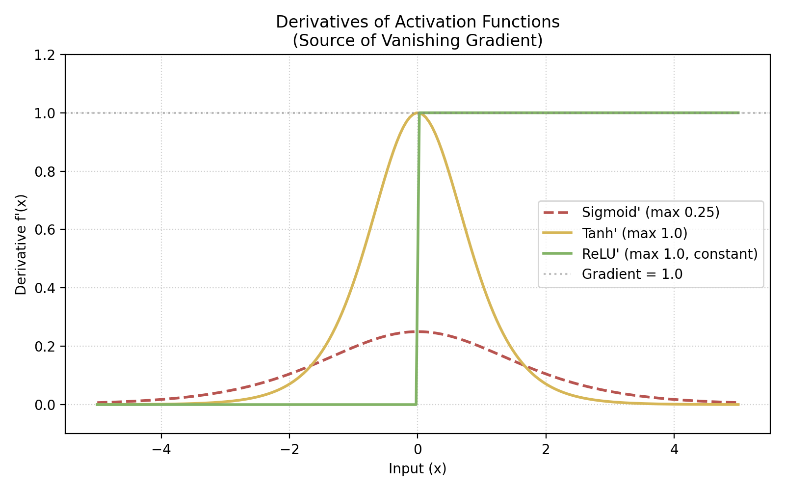

*   **门控机制 (LSTM/GRU)**：
    *   终极方案。通过加法更新 $\mathbf{C}_t = \mathbf{C}_{t-1} + \dots$ 创造“梯度高速公路”，将在 **2.4** 节详细讨论。

---

#### 2.3.5 经典变体：双向 RNN 与 深层 RNN

##### 1. 双向 RNN (Bi-directional RNN)
在很多任务中，上下文不仅来自“过去”，也来自“未来”。
例如填空题："The ___ sat on the mat."
为了填出 "cat"，我们需要看前面的 "The"，也要看后面的 "sat"。

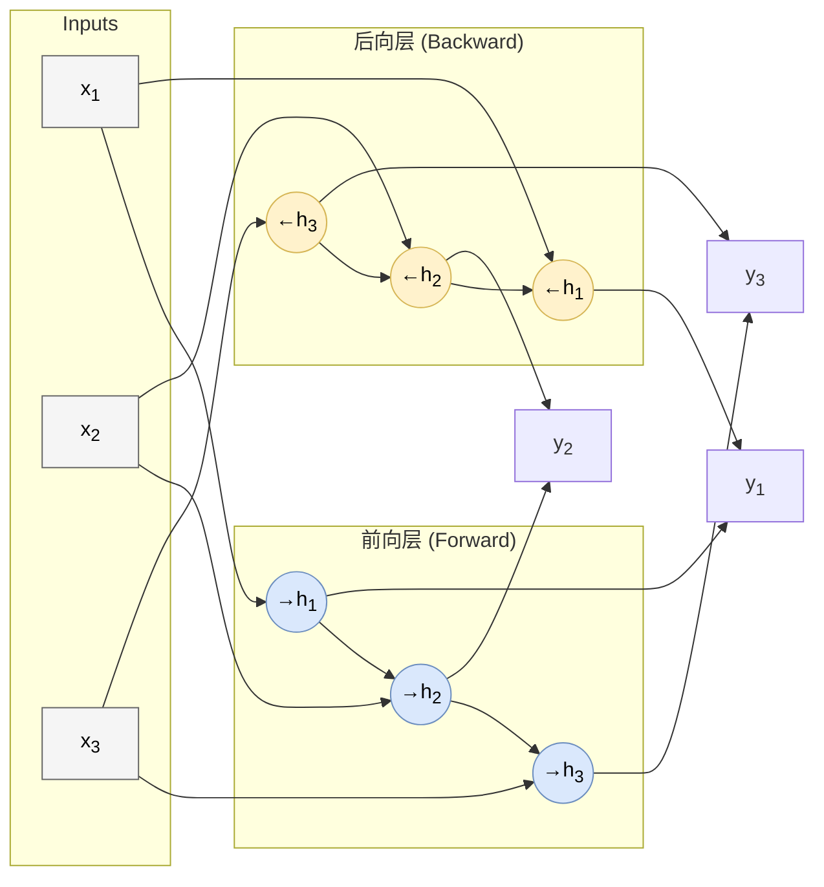

Bi-RNN 包含两个独立的层：
*   **前向层 (Forward Layer)**：$\vec{\mathbf{h}}_t$ 从 $t=1$ 读到 $T$。
*   **后向层 (Backward Layer)**：$\overleftarrow{\mathbf{h}}_t$ 从 $t=T$ 读到 $1$。
*   **输出**：通常将两者拼接 $\mathbf{y}_t = [\vec{\mathbf{h}}_t; \overleftarrow{\mathbf{h}}_t]$。

##### 2. 深层 RNN (Stacked/Deep RNN)
类似于 CNN，我们可以堆叠多个 RNN 层来提取更高层级的特征。
第 $l$ 层的输入是第 $l-1$ 层的隐状态：
$$ \mathbf{h}_t^{(l)} = \sigma(\mathbf{W}_{hh}^{(l)} \mathbf{h}_{t-1}^{(l)} + \mathbf{W}_{xh}^{(l)} \mathbf{h}_t^{(l-1)} + \mathbf{b}^{(l)}) $$

#### 2.3.6 总结与展望：RNN 在 Transformer 时代的地位

RNN 的设计初衷非常优雅（像人类一样按顺序阅读），但在工程实践中确实面临巨大的挑战。

##### 1. RNN 的两大“阿喀琉斯之踵”
*   **计算效率低（串行依赖）**：
    *   这是最致命的问题。由于 $h_t$ 必须等待 $h_{t-1}$ 计算完成，RNN **无法利用 GPU 的并行能力**进行高效训练。这使得它在处理海量数据时效率极低。
*   **信息压缩瓶颈（Memory Bottleneck）**：
    *   RNN 试图将整段历史信息“压缩”进一个固定大小的向量 $h_t$ 中。当序列非常长时，早期信息的细节不可避免地会丢失（即便使用了 LSTM）。

##### 2. Transformer 的范式转移
2017 年 Transformer 的出现基本终结了 RNN 在 NLP 主流任务中的统治地位：
*   **并行训练**：Self-Attention 机制允许同时计算序列中所有位置的关系，打破了训练阶段按时间步递推的串行限制。
*   **全局视野**：Transformer 可以在上下文窗口内直接建模任意两个位置之间的依赖，而不必把全部历史压缩进单个隐状态，因此大幅缓解了长距离依赖问题。

##### 3. RNN 还有用武之地吗？
答案是肯定的。虽然在通用大模型（LLM）领域 Transformer 仍是主流主干，但循环状态、状态空间模型和线性时间序列模型在特定场景仍有明显价值：

*   **极低资源推理 (Edge AI)**：
    *   Transformer 在推理时需要缓存历史信息 (KV Cache)，显存占用随序列长度线性增长 $O(L)$。
    *   RNN 在推理时只需要维护一个状态 $h_t$，内存占用是恒定的 $O(1)$。这使得 RNN 极适合**嵌入式设备、实时语音处理**等对延迟和内存极其敏感的场景。
*   **处理流式长序列**：
    *   RNN 天生适合处理流式数据（Streaming Data），可以持续读入新 token 并更新有限状态；不过由于状态维度有限，它也会遗忘或压缩早期信息。Transformer 则通常受限于上下文窗口长度和 KV Cache 成本。
*   **线性 RNN 的进化 (RWKV / Mamba)**：
    *   近年来，以 **RWKV** 和 **Mamba (State Space Models)** 为代表的新型架构引起了巨大关注。它们巧妙地结合了两者：**“像 Transformer 一样并行训练，像 RNN 一样恒定显存推理”**。
    *   这证明了 RNN 的核心思想——**“循环状态记忆”**——并没有过时，它只是换了一种更现代的数学形式继续存在。

## 2.4 LSTM与门控机制：驯服梯度
### 2.4 Long Short-Term Memory (LSTM)

RNN 的梯度消失问题限制了其处理长序列的能力。本节将解析 LSTM 的门控动力学，解释近似恒等路径如何改善时间维度上的梯度传播，并简述 Seq2Seq 架构的数学形式。

#### 2.4.1 核心思想：恒定误差旋转木马 (Constant Error Carousel, CEC)

标准 RNN 的梯度流经 $\tanh'$，每次迭代都会衰减。
Hochreiter & Schmidhuber (1997) 的洞察是：为了通过时间反向传播误差，我们需要一个导数为 1 的单元。
$$ \frac{\partial \mathbf{C}_t}{\partial \mathbf{C}_{t-1}} \approx \mathbf{I} $$
这就是细胞状态 $\mathbf{C}_t$ 的设计初衷。如果遗忘门长期接近 1，误差信号可以沿着 $\mathbf{C}_t$ 的线性路径保留很久；如果门值明显小于 1，衰减仍会按乘法规律累积。

#### 2.4.2 LSTM 单元的详细解剖

**关键区别：双轨道记忆 (Dual State)**
LSTM 与标准 RNN 最大的不同在于它将状态分为了两条轨道：
1.  **细胞状态 (Cell State, $\mathbf{C}_t$)**：这是图中最上方贯穿的一条线，也是 LSTM 区别于标准 RNN 的新增核心变量。它充当长时记忆的“硬盘”，信息在这里主要进行**线性传输**（加法运算），较少受到非线性饱和的干扰，从而让梯度更容易跨越长距离传播。
2.  **隐状态 (Hidden State, $\mathbf{h}_t$)**：这是 $\mathbf{C}_t$ 的“显示器”。它由 $\mathbf{C}_t$ 经过 $\tanh$ 激活和输出门过滤后得到，用于当前时刻的预测和下一时刻的计算。

LSTM 引入了三个门（Sigmoid层，输出 0~1）来保护和控制 $\mathbf{C}_t$。

**架构图解**：

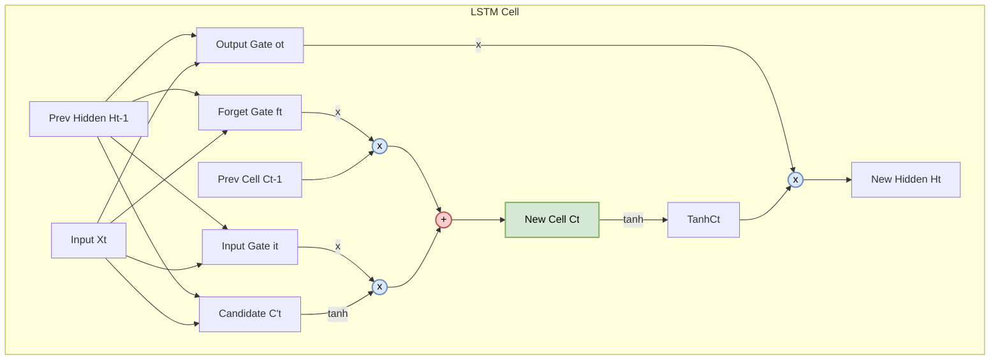

#### 2.4.3 前向传播方程组

设 $\mathbf{x}_t$ 为输入，$\mathbf{h}_{t-1}$ 为上一隐状态。所有 $\mathbf{W} \in \mathbb{R}^{d_h \times (d_x + d_h)}$。

1.  **遗忘门 (Forget Gate)**：决定 $\mathbf{C}_{t-1}$ 中多少信息被保留。
    $$ \mathbf{f}_t = \sigma(\mathbf{W}_f [\mathbf{h}_{t-1}, \mathbf{x}_t] + \mathbf{b}_f) $$
    *(矩阵展开形式)*：
    $$ \mathbf{f}_t = \sigma \left( \begin{bmatrix} \mathbf{W}_{fh} & \mathbf{W}_{fx} \end{bmatrix} \begin{bmatrix} \mathbf{h}_{t-1} \\ \mathbf{x}_t \end{bmatrix} + \mathbf{b}_f \right) $$
2.  **输入门 (Input Gate)**：决定多少新信息 $\tilde{\mathbf{C}}_t$ 被写入。
    $$ \mathbf{i}_t = \sigma(\mathbf{W}_i \cdot [\mathbf{h}_{t-1}, \mathbf{x}_t] + \mathbf{b}_i) $$
    $$ \tilde{\mathbf{C}}_t = \tanh(\mathbf{W}_C \cdot [\mathbf{h}_{t-1}, \mathbf{x}_t] + \mathbf{b}_C) $$
3.  **细胞状态更新 (Cell Update) —— 核心公式**：
    $$ \mathbf{C}_t = \mathbf{f}_t \odot \mathbf{C}_{t-1} + \mathbf{i}_t \odot \tilde{\mathbf{C}}_t $$
    *   **加法更新**：这是 LSTM 避免梯度消失的关键。相比于 RNN 的矩阵乘法更新，加法运算的导数性质更优。
4.  **输出门 (Output Gate)**：
    $$ \mathbf{o}_t = \sigma(\mathbf{W}_o \cdot [\mathbf{h}_{t-1}, \mathbf{x}_t] + \mathbf{b}_o) $$
    $$ \mathbf{h}_t = \mathbf{o}_t \odot \tanh(\mathbf{C}_t) $$

#### 2.4.4 梯度流分析 (Gradient Flow Analysis)

考虑 $\mathbf{C}_t$ 对 $\mathbf{C}_{t-1}$ 的偏导数：
$$ \frac{\partial \mathbf{C}_t}{\partial \mathbf{C}_{t-1}} = \frac{\partial}{\partial \mathbf{C}_{t-1}} (\mathbf{f}_t \odot \mathbf{C}_{t-1} + \mathbf{i}_t \odot \tilde{\mathbf{C}}_t) $$
$$ = \text{diag}(\mathbf{f}_t) + \underbrace{\mathbf{C}_{t-1} \odot \sigma'(...) \mathbf{W}_f \dots}_{term_1} + \underbrace{\mathbf{i}_t \odot \tanh'(...) \mathbf{W}_C \dots}_{term_2} + \dots $$

通常，$term_1, term_2$ 等间接项较小，主导项是 **$\mathbf{f}_t$**。
$$ \frac{\partial \mathbf{C}_T}{\partial \mathbf{C}_k} \approx \prod_{t=k+1}^T \text{diag}(\mathbf{f}_t) $$

*   当遗忘门 $\mathbf{f}_t \approx \mathbf{1}$（开启）且持续稳定时，梯度可以在较长时间跨度内保持较大幅度；但只要每一步都略小于 1，长期保留量仍会指数式下降。
*   网络可以学习在特定时刻将 $\mathbf{f}_t$ 设为 0（重置记忆），或设为 1（保持记忆）。

---

#### 2.4.5 GRU (Gated Recurrent Unit)

GRU (Cho et al., 2014) 是 LSTM 的简化版，合并了 $\mathbf{C}_t$ 和 $\mathbf{h}_t$，并将遗忘门和输入门合并为更新门 $\mathbf{z}_t$。

$$ \mathbf{z}_t = \sigma(\mathbf{W}_z \cdot [\mathbf{h}_{t-1}, \mathbf{x}_t]) $$
$$ \mathbf{r}_t = \sigma(\mathbf{W}_r \cdot [\mathbf{h}_{t-1}, \mathbf{x}_t]) $$
$$ \tilde{\mathbf{h}}_t = \tanh(\mathbf{W} \cdot [\mathbf{r}_t \odot \mathbf{h}_{t-1}, \mathbf{x}_t]) $$
$$ \mathbf{h}_t = (\mathbf{1} - \mathbf{z}_t) \odot \mathbf{h}_{t-1} + \mathbf{z}_t \odot \tilde{\mathbf{h}}_t $$

*   **优点**：参数少，训练快，在小数据集上效果相当。
*   **数学直觉**：$\mathbf{z}_t$ 在 0 和 1 之间插值，显式地建模了“保持旧状态”vs“写入新状态”的权衡。

---

#### 2.4.6 Sequence-to-Sequence (Seq2Seq) 与注意力前奏

Seq2Seq 模型是 LSTM 应用的巅峰。
目标：建模条件概率 $P(\mathbf{Y}|\mathbf{X})$，其中 $\mathbf{X}=(\mathbf{x}_1, \dots, \mathbf{x}_N), \mathbf{Y}=(\mathbf{y}_1, \dots, \mathbf{y}_M)$。

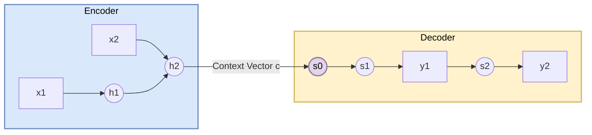

1.  **Encoder**：
    Encoder 读取输入序列 $\mathbf{X}$，并生成隐状态序列：
    $$ \mathbf{h}_t = \text{LSTM}_{enc}(\mathbf{x}_t, \mathbf{h}_{t-1}) $$
    最终的上下文向量由最后一个隐状态得到：
    $$ \mathbf{c} = \mathbf{h}_N \quad (\text{Context Vector}) $$
2.  **Decoder**：
    Decoder 根据上下文向量 $\mathbf{c}$ 和上一步输出 $\mathbf{y}_{t-1}$ 更新自身状态 $\mathbf{s}_t$：
    $$ \mathbf{s}_t = \text{LSTM}_{dec}(\mathbf{y}_{t-1}, \mathbf{s}_{t-1}, \mathbf{c}) $$
    计算当前时刻输出词的概率分布：
    $$ P(\mathbf{y}_t | \mathbf{y}_{<t}, \mathbf{X}) = \text{softmax}(\mathbf{W}_{out} \mathbf{s}_t) $$
