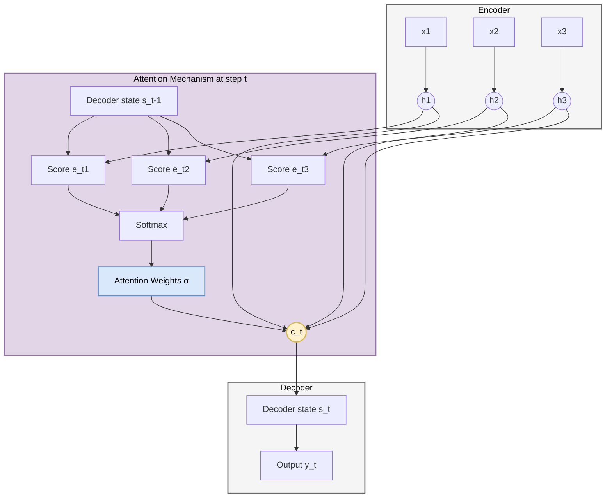
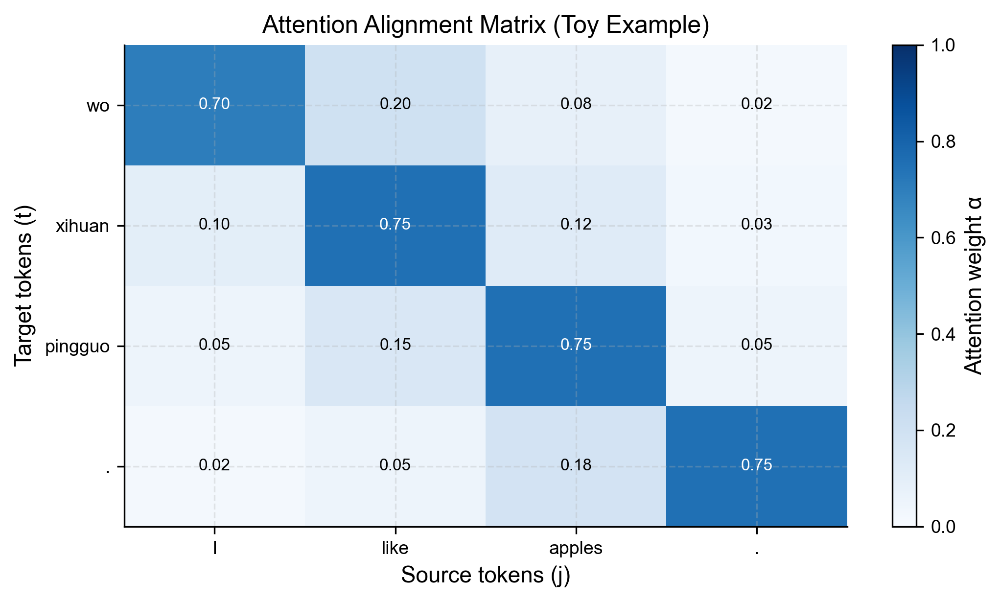
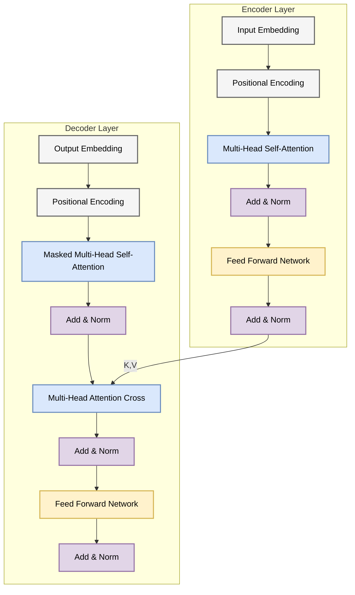
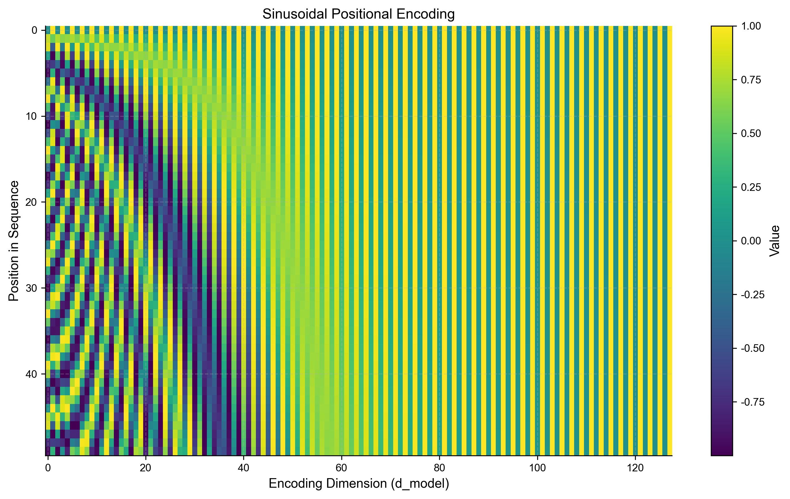
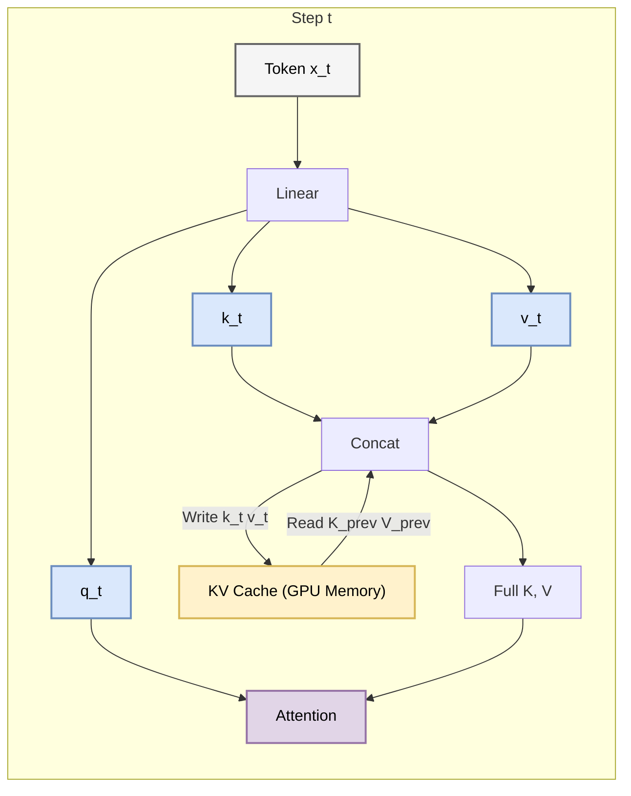
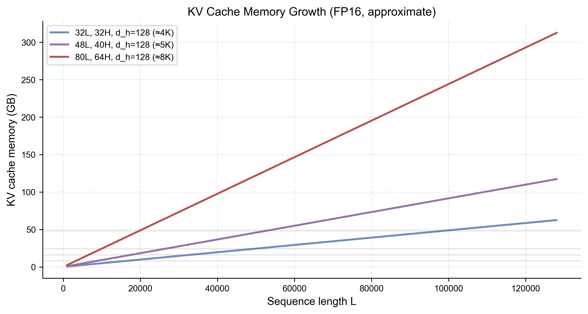
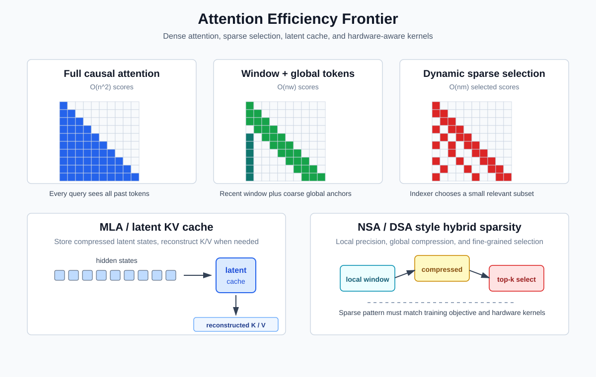
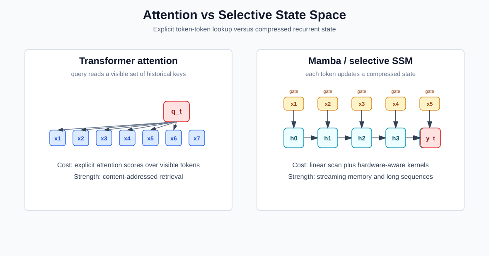

# 第三章 注意力、Transformer 与高效序列架构

## 3.1 注意力机制：从瓶颈到聚焦
### 3.1 Attention Mechanisms: From Bottleneck to Focus

第 2 章介绍的早期无注意力 Encoder-Decoder 会把整段输入压缩为固定维度上下文向量 $\mathbf{c}$。向量维度固定不意味着它数学上不能编码长输入，但有限容量与训练难度会使长句翻译质量明显下降，这通常称为 **固定上下文瓶颈 (Fixed-context Bottleneck)**。

本节介绍 **注意力机制 (Attention Mechanism)**：Decoder 在每个输出步对各 Encoder 状态重新加权，从而不再只依赖单一固定上下文向量。

#### 3.1.1 瓶颈问题 (The Bottleneck Problem)

在传统的 Encoder-Decoder 架构中：
$$ \mathbf{c} = \text{Encoder}(\mathbf{x}_1, \dots, \mathbf{x}_T) $$
$$ \mathbf{y}_t = \text{Decoder}(\mathbf{y}_{t-1}, \mathbf{s}_{t-1}, \mathbf{c}) $$

当 $T$ 增大时，模型需要把更多信息压入同一向量，经验上会出现翻译质量下降和细节丢失。固定上下文容量与循环网络中的长距离梯度问题相关但不是同一机制，应分别分析。

#### 3.1.2 Bahdanau 注意力 (Additive Attention)

Bahdanau 等人 (2014) 提出的核心思想是：**上下文向量 $\mathbf{c}$ 不应该是静态的，而应该是动态变化的 $\mathbf{c}_t$**。

在 Decoder 生成第 $t$ 个词时，它应该根据当前的隐状态 $\mathbf{s}_{t-1}$，去计算与 Encoder 所有隐状态 $\mathbf{h}_j$ 的相关性。

**数学构造**：

1.  **对齐分数 (Alignment Score)**：计算 Decoder 状态 $\mathbf{s}_{t-1}$ 与 Encoder 状态 $\mathbf{h}_j$ 的匹配度。Bahdanau 使用一个小型的神经网络（MLP）来计算：
    $$ e_{tj} = \mathbf{v}_a^T \tanh(\mathbf{W}_a \mathbf{s}_{t-1} + \mathbf{U}_a \mathbf{h}_j) $$
    这被称为 **加性注意力 (Additive Attention)**。

2.  **注意力权重 (Attention Weights)**：使用 Softmax 将分数归一化为概率分布：
    $$ \alpha_{tj} = \frac{\exp(e_{tj})}{\sum_{k=1}^T \exp(e_{tk})} $$

3.  **动态上下文向量 (Dynamic Context Vector)**：加权求和：
    $$ \mathbf{c}_t = \sum_{j=1}^T \alpha_{tj} \mathbf{h}_j $$

**直观解释**：
$\alpha_{tj}$ 就像是“目光的焦点”。如果翻译到 "apple"，模型可能会发现源句子中 "苹果" 对应的 $\mathbf{h}_j$ 的权重 $\alpha_{tj}$ 为 0.9，而其他词的权重很小。

#### 3.1.3 Luong 注意力 (Multiplicative Attention)

Luong 等人 (2015) 提出了更简单的计算对齐分数的方法，利用点积：

1.  **点积 (Dot)**: $e_{tj} = \mathbf{s}_{t-1}^T \mathbf{h}_j$
2.  **通用 (General)**: $e_{tj} = \mathbf{s}_{t-1}^T \mathbf{W}_a \mathbf{h}_j$

这种方法计算更快（矩阵乘法优化），被称为 **乘性注意力 (Multiplicative Attention)**。这正是后来 Transformer 中 Scaled Dot-Product Attention 的雏形。（关于 Transformer 中 Scaled Dot-Product Attention 的详细数学推导，请见 **[附录 A.10](appendix/a.10_transformer_math.md)**）

#### 3.1.4 架构可视化

下面的图展示了引入注意力机制后的数据流。请注意 Context Vector $\mathbf{c}_t$ 是如何随时间步 $t$ 变化的。

#### 3.1.5 注意力的本质：可微的键值查询

我们可以将注意力机制抽象为一种 **查询 (Query)** 过程。

更重要的是，这个“查询”是 **可微分的 (Differentiable)**：注意力权重 $\alpha_{tj}$ 由 Softmax 产生，整个链路可以通过反向传播学习“如何对齐”。
*   **查询 (Query, $\mathbf{q}$)**: Decoder 当前状态 $\mathbf{s}_{t-1}$（我想要什么？）
*   **键 (Key, $\mathbf{k}$)**: Encoder 隐状态 $\mathbf{h}_j$ 的特征（你有什么特征？）
*   **值 (Value, $\mathbf{v}$)**: Encoder 隐状态 $\mathbf{h}_j$ 的内容（你的内容是什么？）

在 RNN Attention 中，Key 和 Value 通常是同一个东西（即 $\mathbf{h}_j$）。但在 Transformer 中，我们将看到这三者被显式地分离开来。

**技术本质（统一形式）**：无论是加性还是乘性注意力，最终都会得到一个归一化的权重向量，并对 Value 做加权平均。

设打分函数为 $e_{tj} = \text{score}(\mathbf{s}_{t-1}, \mathbf{h}_j)$，则
$$ \alpha_{tj} = \text{softmax}_j(e_{tj}), \quad \mathbf{c}_t = \sum_{j=1}^{T} \alpha_{tj} \mathbf{h}_j $$

这也是后续 Transformer 把它“矩阵化”的原因：只要把 $\text{score}(\cdot)$ 写成矩阵乘法，就能充分利用 GPU 的并行算力。

Key Concept **软寻址 (Soft Addressing)**：
传统的数据库查询是硬寻址（要么匹配，要么不匹配）。注意力机制是软寻址，它返回所有 Value 的加权平均。因为所有操作都是可微的，我们可以通过反向传播来学习“如何查询”。

#### 3.1.6 对齐矩阵可视化：注意力到底在“看哪里”？

为了把 $\alpha_{tj}$ 变成可以“肉眼检查”的对象，我们通常把它画成一个 **对齐矩阵 (Alignment Matrix)**：
*   **横轴**：源序列位置 $j$（Encoder 的 token）。
*   **纵轴**：目标序列位置 $t$（Decoder 正在生成的 token）。
*   **像素值**：$\alpha_{tj}$，越亮表示注意力越集中。

这种可视化在早期机器翻译中非常常用：如果模型把英文单词 "apple" 对齐到中文 "苹果" 上，热力图会出现一条接近对角线的高亮带。

## 3.2 Transformer 架构解剖：以一当百
### 3.2 The Transformer Architecture

2017 年，Google 团队发表了 *Attention Is All You Need*，推动 NLP 主流架构发生了重要转向。原始 Transformer 抛弃了循环（RNN）和卷积（CNN），主要依赖注意力机制来捕捉输入和输出之间的全局依赖关系。

本节我们将深入解剖 Transformer 的内部构造，重点关注自注意力机制和多头注意力。

#### 3.2.1 整体架构概览 (Architecture Overview)

Transformer 依然遵循 Encoder-Decoder 结构，但每一层都焕然一新。

#### 3.2.2 缩放点积注意力 (Scaled Dot-Product Attention)

这是 Transformer 的核心算子。

**输入**：
*   **查询 (Query, Q)**: $\in \mathbb{R}^{n \times d_k}$
*   **键 (Key, K)**: $\in \mathbb{R}^{m \times d_k}$
*   **值 (Value, V)**: $\in \mathbb{R}^{m \times d_v}$

**计算公式**：
$$ \text{Attention}(Q, K, V) = \text{softmax}\left(\frac{QK^T}{\sqrt{d_k}}\right)V $$

1.  **$QK^T$**: 计算 Query 和 Key 的两两打分矩阵。只有在两侧向量集合相同等特殊情形下才通常称为 Gram 矩阵。
2.  **Scale ($\frac{1}{\sqrt{d_k}}$)**:
    *   **为什么要缩放？** 假设 $q, k$ 的分量独立且服从 $\mathcal{N}(0, 1)$，则 $q \cdot k = \sum_{i=1}^{d_k} q_i k_i$ 的方差为 $d_k$。当 $d_k$ 很大时，点积结果会很大，导致 Softmax 进入饱和区（梯度趋近于 0）。
    *   在这组理想化假设下，除以 $\sqrt{d_k}$ 将点积方差归一化为 1，降低 Softmax 过早饱和的风险；真实训练中的相关性、初始化和归一化仍会影响梯度。
3.  **Softmax**: 将相似度转换为概率分布。
4.  **MatMul V**: 根据概率分布加权求和 Value。

#### 3.2.3 多头注意力 (Multi-Head Attention)

单头只有一组投影和注意力分布。多头机制提供多个并行子空间，使模型有机会表示不同关系；具体头是否对应语法、指代等可解释概念是训练结果，不是结构保证。

**机制**：
将 $Q, K, V$ 投影到 $h$ 个不同的子空间，分别计算注意力，最后拼接起来。

$$ \text{head}_i = \text{Attention}(QW_i^Q, KW_i^K, VW_i^V) $$
$$ \text{MultiHead}(Q, K, V) = \text{Concat}(\text{head}_1, \dots, \text{head}_h)W^O $$

*   **直观类比**：就像你读一篇文章，用红笔划重点（关注语法），用蓝笔划重点（关注情节），用绿笔划重点（关注人物关系）。最后把所有笔记汇总。

#### 3.2.4 前馈网络 (Position-wise Feed-Forward Networks)

在 Attention 层之后，是一个全连接网络，对 **每个位置** 独立同分布地进行处理。

$$ \text{FFN}(x) = \max(0, xW_1 + b_1)W_2 + b_2 $$

这相当于两个线性变换中间夹一个 ReLU。
虽然是线性变换，但因为有 ReLU，它提供了 **非线性** 能力，增加了模型的表达力。它通常会将维度放大（例如从 512 到 2048），然后再缩放回来，这被称为 **倒瓶颈结构 (Inverted Bottleneck)**。

#### 3.2.5 为什么 Transformer 优于 RNN？

| 特性 | RNN | Transformer |
| :--- | :--- | :--- |
| **单层序列方向的串行深度** | $O(N)$ | $O(1)$（各位置可并行） |
| **任意两位置的最短信息路径** | 最坏 $O(N)$ | 单层全注意力中 $O(1)$ |
| **主要算术量（简化）** | $O(Nd^2)$ | 投影/FFN 为 $O(Nd^2)$，注意力为 $O(N^2d)$ |

Key Concept **全局视野**：
训练阶段，RNN 必须沿时间递推；全注意力 Transformer 可并行计算各位置，并在一层内建立任意位置间路径。代价是稠密注意力需要二次方数量的两两分数；总成本还包括通常占重要份额的线性投影和 FFN。

#### 3.2.6 残差连接与归一化：深层可训练的关键 (Residual & Normalization)

如果只堆叠注意力和前馈网络，深层网络会很难训练。Transformer 之所以能“越堆越深”，依赖两个工程-数学都很重要的结构：**残差连接 (Residual Connection)** 与 **层归一化 (Layer Normalization, LN)**。

在原始 Transformer（Post-Norm）里，一个子层的标准写法是：
$$ x_{out} = \text{LN}(x + \text{Sublayer}(x)) $$

而现代大模型更常见的是 Pre-Norm（更稳定）：
$$ x_{out} = x + \text{Sublayer}(\text{LN}(x)) $$

这两种写法的差别，以及正弦位置编码为何能表达相对位移，我们会在 3.3 节进一步展开。

## 3.3 位置编码与层归一化
### 3.3 Positional Encoding and Layer Normalization

Transformer 的 Self-Attention 机制本身具有 **置换等变性 (Permutation Equivariance)**：如果同时打乱输入 token 的顺序，输出表示也会以同样方式被打乱，而注意力层本身并不知道原始顺序。这对于自然语言来说是不够的（“我爱你” vs “你爱我”）。

为了弥补这一点，我们需要显式地注入位置信息。此外，为了训练深层 Transformer，归一化技术至关重要。

#### 3.3.1 正弦位置编码 (Sinusoidal Positional Encoding)

Google 团队选择了一种基于三角函数的编码方式，而不是学习 **位置嵌入 (Position Embedding)**。

**公式**：
$$
\begin{aligned}
PE_{(pos, 2i)} &= \sin(pos / 10000^{2i/d_{model}}) \\
PE_{(pos, 2i+1)} &= \cos(pos / 10000^{2i/d_{model}})
\end{aligned}
$$

*   $pos$: 单词在句子中的位置。
*   $i$: 维度索引。

**可视化**：
下图展示了 $d_{model}=128$ 时的前 50 个位置的编码。可以看到，每一个维度对应一个波长不同的正弦波。波长从 $2\pi$ 到 $10000 \cdot 2\pi$ 几何级数变化。

**数学性质**：
这种编码方式为学习 **相对位置** 提供了有用代数结构。
对于任意固定偏移 $k$，$\mathbf{PE}_{pos+k}$ 可以表示为 $\mathbf{PE}_{pos}$ 的线性函数（旋转矩阵）：
$$
\begin{bmatrix} \sin(pos+k) \\ \cos(pos+k) \end{bmatrix} =
\begin{bmatrix} \cos k & \sin k \\ -\sin k & \cos k \end{bmatrix}
\begin{bmatrix} \sin(pos) \\ \cos(pos) \end{bmatrix}
$$
这说明固定偏移在每个频率对子空间中对应线性旋转，因此模型可以利用这一结构学习相对位移关系；它不保证模型必然学会或可靠外推所有相对位置规则。

#### 3.3.2 层归一化 (Layer Normalization)

**批归一化 (Batch Normalization, BN)** 在 CNN 中很常用；它依赖跨样本/位置的批统计，面对变长序列、小批量和自回归训练/推理口径时较不方便。Transformer 因此通常采用对每个 token 特征独立计算的 **层归一化 (Layer Normalization, LN)** 或 RMSNorm 等变体。

**公式**：
对于一个样本的一个层输入向量 $\mathbf{x} \in \mathbb{R}^{d}$，计算其自身的均值和方差：
$$ \mu = \frac{1}{d} \sum_{j=1}^d x_j, \quad \sigma^2 = \frac{1}{d} \sum_{j=1}^d (x_j - \mu)^2 $$
$$ \text{LN}(\mathbf{x}) = \frac{\mathbf{x} - \mu}{\sqrt{\sigma^2 + \epsilon}} \cdot \gamma + \beta $$
其中 $\gamma, \beta$ 是可学习的仿射变换参数。

*   **BN vs LN**:
    *   **BN**: 对 Batch 维度归一化（纵向切）。不同样本之间相互依赖。
    *   **LN**: 对 Feature 维度归一化（横向切）。每个样本独立计算。

#### 3.3.3 残差连接与 Pre-Norm vs Post-Norm

Transformer 广泛使用了残差连接：$x + \text{Sublayer}(x)$。关于 LN 的位置，有两种变体：

1.  **Post-Norm (原始论文)**：
    $$ x_{out} = \text{LN}(x + \text{Sublayer}(x)) $$
    *   问题：梯度在反向传播时可能会在输出层附近激增，导致深层网络难以训练（需要 Warmup）。

2.  **Pre-Norm (现代 LLM 常见，如 GPT-2/3；LLaMA 使用同位置的 RMSNorm)**：
    $$ x_{out} = x + \text{Sublayer}(\text{LN}(x)) $$
    *   优势：梯度更容易沿恒等路径传播，深层模型通常更稳定，也能减轻对长 warmup 的依赖。

Key Takeaway
Pre-Norm 结构是现代大模型能够堆叠到很深层数的重要工程细节之一，但它仍需要与初始化、学习率、残差缩放和归一化细节共同工作。

## 3.4 训练与推理：掩码与缓存
### 3.4 Training and Inference Techniques

Transformer 的训练和推理过程有着显著的差异，特别是在 Decoder 部分。理解这些差异对于掌握大模型的高效部署至关重要。

#### 3.4.1 训练时的 Teacher Forcing 与 Masked Attention

在训练阶段，我们拥有完整的标准答案（Ground Truth）。为了加速训练，我们使用 **教师强制 (Teacher Forcing)**：一次性把整个正确句子的 Embedding 喂给 Decoder。

从损失函数角度看，这对应于“并行地”计算每个位置的负对数似然（以 Decoder-only 为例）：

$$ \mathcal{L}_{\text{CLM}} = -\sum_{t=1}^{T} \log P(x_t \mid x_{<t}) $$

**问题**：Decoder 是自回归的。如果在预测第 $t$ 个词时，它能“偷看”到第 $t+1$ 个词，那它就不用学了，直接照抄就行。这会导致测试时（没有答案可抄）性能崩塌。

**解决方案：掩码自注意力 (Masked Self-Attention)**
我们需要一个 **因果掩码 (Causal Mask)**。它是一个上三角矩阵（对应未来的位置），值为 $-\infty$。

$$ \text{Mask}(i, j) = \begin{cases} 0 & \text{if } i \ge j \\ -\infty & \text{if } i < j \end{cases} $$

在 Softmax 之前加上 Mask：
$$ \text{Attention}(Q, K, V) = \text{softmax}\left(\frac{QK^T}{\sqrt{d_k}} + M \right)V $$

这样，位置 $i$ 的 Query 就只能关注到位置 $j \le i$ 的 Key，无法关注未来的信息。

**可视化直觉**：下图展示了一个小尺寸的因果掩码矩阵（上三角为屏蔽区域）以及它对注意力权重的影响。

#### 3.4.2 推理时的自回归 (Autoregressive Generation)

在推理（Inference）阶段，模型必须一个词一个词地生成。
Step 1: 输入 `<SOS>`, 输出 `The`
Step 2: 输入 `<SOS> The`, 输出 `cat`
Step 3: 输入 `<SOS> The cat`, 输出 `sat`
...

#### 3.4.3 KV Cache：推理加速的关键

你发现了吗？在 Step 3 时，我们重新计算了 `<SOS>` 和 `The` 的 Key 和 Value。这在 Step 2 已经算过一次了！
对于 GPT 这样的大模型，重复计算是非常昂贵的。

**KV Cache 原理**：
我们将之前步骤计算好的 Key 和 Value 矩阵 **缓存** 在显存中。
在生成第 $t$ 个 token 时：
1.  只计算当前 token $\mathbf{x}_t$ 的 $q_t, k_t, v_t$。
2.  从 Cache 取出之前的 $K_{<t}, V_{<t}$。
3.  拼接得到完整的 $K_{\le t} = [K_{<t}; k_t]$。
4.  计算 Attention。
5.  将 $k_t, v_t$ 存入 Cache。

**图解**：

Tradeoff
KV Cache 是典型的 **空间换时间**。
*   **优点**：大幅减少 FLOPs，推理速度提升。
*   **缺点**：显存占用随序列长度线性增加。对于长文本（如 128k context），KV Cache 可能会撑爆显存，这催生了 **MQA (Multi-Query Attention)** 和 **GQA (Grouped-Query Attention)** 等变体（减少 K, V 的头数）。

为了建立更直观的工程感知，下图给出了一个简化的“KV Cache 显存随序列长度增长”示意。曲线假设 FP16、标准多头注意力中 KV 头数等于标注头数，且忽略 allocator、对齐和其他运行时开销；采用 MQA/GQA/MLA 或 KV 量化时数值会显著不同。

---

本节从训练与推理角度梳理了 Transformer 的关键工程机制。它是现代语言模型和大量多模态系统的核心组件，也深刻影响了扩散模型、视觉模型和长上下文系统的设计。

不过，KV Cache 也把问题推向了下一层：当上下文长度扩大到十万、百万 token 时，模型不仅要少做重复计算，还要重新设计注意力连接、缓存表示和底层 kernel。下一节我们将讨论 **[3.5 前沿注意力架构](chapter_03.md#section-3-5)**：MLA、稀疏注意力、FlashAttention 与长上下文效率。

## 3.5 前沿注意力架构：从稠密矩阵到长上下文效率
### 3.5 Frontier Attention Architectures: From Dense Matrices to Long-Context Efficiency

到 3.4 节为止，我们已经看到 Transformer 的核心矛盾：注意力机制提供了全局依赖建模能力，但它也带来了两类成本。

第一类是训练成本。对长度为 $n$ 的序列，标准自注意力需要构造 $n \times n$ 的分数矩阵：

$$
S = \frac{QK^T}{\sqrt{d_k}}, \qquad S \in \mathbb{R}^{n \times n}.
$$

如果隐藏维度和头数固定，注意力分数的算术量随 $n^2$ 增长；朴素实现还会物化二次方中间量，FlashAttention 一类精确算法则可避免将完整分数/概率矩阵写回 HBM。第二类是推理成本。自回归生成时可以用 KV Cache 避免重复计算历史 token，但缓存本身仍随上下文长度线性增长：

$$
\text{KV cache size} \propto L \cdot n_{\text{layers}} \cdot n_{\text{kv-heads}} \cdot d_{\text{head}}.
$$

长上下文模型要处理代码库、长文档、长视频和复杂 Agent 轨迹，就必须同时面对这两个问题：**训练时的二次方注意力矩阵**，以及 **推理时持续膨胀的 KV Cache**。

因此，2024 年之后的前沿架构研究不只是“把窗口拉长”，而是在寻找一组更细的工程-数学折中：哪些 token 必须被精确关注？哪些历史信息可以压缩？哪些操作需要配合 GPU/加速器的内存层级？哪些稀疏模式可以从预训练开始就让模型适应？

#### 3.5.1 稠密注意力、局部注意力与动态稀疏

设第 $i$ 个 query 可见的 key 集合为 $\mathcal{A}(i)$。在因果自注意力中，

$$
\mathcal{A}_{\text{full}}(i) = \{1,2,\dots,i\}.
$$

标准注意力为：

$$
\mathbf{o}_i
= \sum_{j \in \mathcal{A}_{\text{full}}(i)}
\frac{\exp(q_i^T k_j/\sqrt{d_k})}
{\sum_{\ell \in \mathcal{A}_{\text{full}}(i)} \exp(q_i^T k_\ell/\sqrt{d_k})}
v_j.
$$

稀疏注意力的基本思想是把可见集合替换成一个较小的集合 $\mathcal{S}(i) \subseteq \mathcal{A}_{\text{full}}(i)$：

$$
\mathbf{o}^{\text{sparse}}_i
= \sum_{j \in \mathcal{S}(i)}
\frac{\exp(q_i^T k_j/\sqrt{d_k})}
{\sum_{\ell \in \mathcal{S}(i)} \exp(q_i^T k_\ell/\sqrt{d_k})}
v_j.
$$

如果平均每个 query 只看 $m$ 个 key，注意力复杂度可从近似 $O(n^2d)$ 下降到 $O(nmd)$。关键问题是：$\mathcal{S}(i)$ 怎么选？

常见路线包括：

*   **局部窗口 (Sliding Window)**：每个位置只看最近 $w$ 个 token。复杂度约为 $O(nwd)$，适合连续局部依赖，但可能漏掉远距离证据。
*   **固定稀疏模式 (Fixed Sparse Pattern)**：例如分块、跨步、膨胀窗口、少量全局 token。OpenAI 的 Sparse Transformer 早期展示了用固定/分解稀疏模式建模长序列的可行性。
*   **动态稀疏选择 (Dynamic Sparse Selection)**：用轻量索引器或打分器为每个 query 选择最相关的历史块或 token。它更灵活，但实现难度更高，也更依赖高效 kernel。
*   **混合结构 (Hybrid Attention)**：局部窗口保证近邻精度，压缩路径提供全局轮廓，动态选择补充远距离关键证据。

下图把这些路线放在同一张图里。它不是某个具体模型的精确实现图，而是帮助理解长上下文架构的设计空间。

#### 3.5.2 OpenAI Sparse Transformer：早期先例

OpenAI 在 2019 年提出的 Sparse Transformer 已经指出，标准 Transformer 在长序列上受限于二次方注意力成本。它用稀疏分解的注意力矩阵把复杂度从 $O(n^2)$ 降到约 $O(n\sqrt{n})$，并在图像、音频和字节级文本建模上验证了长序列自回归建模的潜力。

这条路线的重要性不在于它直接等于后来的工业长上下文模型，而在于它提前暴露了一个核心判断：**长序列建模不能只看理论复杂度，还要看注意力模式是否适合硬件、是否保留任务所需的远距离信息，以及模型是否在训练阶段就学会这种稀疏结构。**

#### 3.5.3 FlashAttention：不是稀疏，但改变了注意力工程

FlashAttention 解决的是另一层问题。它不近似注意力结果，也不改变 $\mathcal{A}(i)$；它仍然计算精确注意力，但用分块和在线 softmax 方式减少 GPU 高带宽显存 (HBM) 与片上 SRAM 之间的读写。

这解释了为什么“算法复杂度”不等于“实际速度”。一个理论上更低复杂度的近似注意力，如果访存模式很差，可能没有真实 wall-clock 收益；一个仍为二次复杂度的精确注意力，如果 IO 模式更好，反而可以显著加速训练和推理。

因此，现代长上下文架构通常同时关心三件事：

*   **算术复杂度**：是否减少了需要计算的注意力分数数量。
*   **访存复杂度**：是否减少 HBM 读写和中间矩阵落盘。
*   **kernel 可实现性**：是否能在 CUDA、ROCm、NPU 或其他加速器上稳定高效执行。

#### 3.5.4 DeepSeek 路线：MLA、MoE 与稀疏注意力

DeepSeek-V3 的技术报告把效率问题拆成了几条相互配合的路径。

首先是 **MoE (Mixture-of-Experts)**。DeepSeek-V3 是一个总参数量很大的 MoE 模型，但每个 token 只激活部分专家。这样可以扩大模型容量，同时控制单个 token 的前向计算量。MoE 的主要代价是路由、负载均衡、通信和训练稳定性。

其次是 **MLA (Multi-head Latent Attention)**。标准 MHA 会为每个 token 存储每一层的 key/value。GQA/MQA 通过减少 KV 头数降低缓存；MLA 更进一步，把 key/value 信息压缩到潜在向量中。概念上可写成从潜变量恢复注意力成分：

$$
c_t^{KV} = W^{DKV} h_t, \qquad
k_t^C = W^{UK} c_t^{KV}, \qquad
v_t^C = W^{UV} c_t^{KV}.
$$

这里 $c_t^{KV}$ 是被缓存的潜在表示，$k_t^C, v_t^C$ 是概念上的 key/value 成分。实际 MLA 还缓存/处理与 RoPE 相关的解耦 key 成分；高效实现可把上投影吸收到 query 或输出侧矩阵中，不必逐 token 显式重建完整 K/V。重点是：MLA 改变缓存表示，从而降低长上下文推理显存。

再次是 **NSA / DSA 类稀疏注意力**。2025 年的 Native Sparse Attention (NSA) 论文提出硬件对齐、可端到端训练的稀疏注意力机制，结合粗粒度 token 压缩、细粒度 token 选择和局部精确路径，在长上下文场景中降低训练与推理成本。DeepSeek-V3.2-Exp 的官方模型页进一步把 DeepSeek Sparse Attention (DSA) 作为实验性架构重点，目标是在长上下文训练和推理中提高效率，同时尽量保持模型输出质量。

这条路线的关键不只是“少算一些注意力分数”，而是让稀疏结构进入模型生命周期：

*   **训练阶段**：稀疏结构需要进入预训练或后续继续训练，使模型适应受限可见集合，而不是只在推理时无训练地裁剪连接；不同工作采用的起点并不相同。
*   **推理阶段**：索引器、稀疏 kernel、KV cache 布局共同决定真实延迟。
*   **长上下文任务**：局部窗口、全局压缩和动态选择需要同时处理“最近上下文”和“远距离证据”。

#### 3.5.5 Google、Meta 与长上下文系统化

Google 的 Gemini 1.5 技术报告把长上下文能力推到了百万 token 量级，并强调跨长文档、长视频、长音频的细粒度召回与推理。这说明长上下文已经从“能塞进去更多 token”变成了多模态系统能力：模型不仅要接收长输入，还要在很长的上下文中可靠定位证据。

Meta 的 Llama 3 技术报告则代表另一条重要路线：开放权重、大规模 dense Transformer、128K 上下文、工具使用，以及围绕评测与安全的配套系统。它并不等同于稀疏注意力路线，但对于综述教材很重要，因为开放权重模型让研究者能够复现实验、检查长上下文行为、测试压缩与微调方法。

这些方向共同说明：长上下文不是单一架构技巧，而是模型架构、训练数据、位置编码、推理 kernel、缓存管理、评测任务和系统接口共同作用的结果。

#### 3.5.6 稀疏注意力的风险与边界

稀疏注意力很诱人，但它不是免费的。

*   **召回风险**：如果关键证据没有被选入 $\mathcal{S}(i)$，后续 softmax 再精确也无济于事。
*   **训练-推理不一致**：如果训练时用全注意力、推理时再稀疏化，模型可能没有学会在受限可见集合下工作。
*   **评测偏差**：needle-in-a-haystack 类任务能测试召回，但不能完全代表长文档推理、代码库修改和 Agent 轨迹分析。
*   **硬件依赖**：不规则稀疏模式可能节省 FLOPs，却增加索引、访存和 kernel 调度开销。
*   **可解释性错觉**：稀疏模式看起来像“模型选择了重点”，但它仍是训练目标和优化过程产生的中间计算结构，不能直接等同于人类注意力或理解。

所以，更稳妥的表述是：稀疏注意力、MLA、MoE、FlashAttention 和长上下文评测共同构成了 2025-2026 年架构效率研究的重要方向。它们并不推翻 Transformer，而是尝试在保留任务所需能力的同时重写注意力的成本结构；稀疏化本身仍可能丢失信息。

---

本节把 3.4 节的 KV Cache 问题推进到当前前沿：长上下文模型需要同时压缩缓存、减少注意力连接、优化访存路径，并在训练阶段就让模型适应这些结构。下一节转向另一条长序列路线：**[Mamba 与状态空间模型](chapter_03.md#section-3-6)**。

## 3.6 Mamba 与状态空间模型：注意力之外的长序列路线
### 3.6 Mamba and State Space Models: A Long-Sequence Route Beyond Attention

Transformer 的成功来自注意力机制：每个 token 都可以直接访问历史 token。但这种全局访问也带来了 $O(n^2)$ 的注意力矩阵和随长度增长的 KV Cache。于是，一个自然问题是：能不能保留长距离建模能力，同时回到近似线性的序列计算？

**状态空间模型 (State Space Model, SSM)** 是这条路线的核心。它并不是 2020 年代才出现的概念；控制论、信号处理和时间序列分析早就使用状态空间方程。现代 SSM 的新意在于：把状态空间递推做成可训练、可并行、适合 GPU 的深度学习层。

#### 3.6.1 最小状态空间方程

离散时间下，一个线性状态空间模型可以写成：

$$
h_t = A h_{t-1} + B x_t,\qquad
y_t = C h_t + D x_t.
$$

其中：

*   $x_t$ 是当前位置输入。
*   $h_t$ 是隐状态，负责携带历史信息。
*   $y_t$ 是输出。
*   $A,B,C,D$ 是可学习参数或由参数生成的结构。

这个形式看起来像 RNN，但有两个关键差异。

第一，现代 SSM 通常对 $A$ 做结构化参数化，使长序列递推更稳定。第二，在训练时，线性递推可以转写成卷积或 scan，从而并行计算，不必像传统 RNN 那样严格逐 token 串行。

如果 $A,B,C,D$ 固定，SSM 对历史的读写是内容无关的；这正是早期 SSM 在语言任务上不如注意力的原因之一。语言序列需要根据当前 token 决定“记住什么、忘掉什么、输出什么”。

更完整一点，许多 SSM 从连续时间方程出发：

$$
\frac{d h(t)}{dt} = A h(t) + B x(t),\qquad
y(t) = C h(t) + D x(t).
$$

为了处理离散 token 序列，需要用步长 $\Delta$ 离散化。常见写法是：

$$
\bar{A} = \exp(\Delta A),\qquad
\bar{B} = \left(\int_0^\Delta \exp(\tau A)\,d\tau\right)B.
$$

于是递推变成：

$$
h_t = \bar{A}h_{t-1} + \bar{B}x_t.
$$

如果 $\bar{A},\bar{B},C$ 固定，输出可以展开成卷积：

$$
y_t = C h_t + D x_t
= \sum_{i=0}^{t} C\bar{A}^{i}\bar{B}x_{t-i} + D x_t.
$$

因此 SSM 同时有两种视角：

*   **递推视角**：推理时维护一个状态 $h_t$，每来一个 token 更新一次。
*   **卷积视角**：训练时把历史影响写成卷积核 $K_i=C\bar{A}^{i}\bar{B}$，并行处理整段序列。

这正是它和传统 RNN 的关键区别：RNN 主要依赖逐步递推；结构化 SSM 可以利用卷积或 scan 获得更好的训练并行性。

#### 3.6.2 Mamba 的选择性：让状态更新依赖输入

Mamba 的核心改动是 **选择性状态空间 (Selective SSM)**：让部分状态空间参数成为输入的函数。粗略写成：

$$
h_t = \bar{A}(x_t) h_{t-1} + \bar{B}(x_t) x_t,\qquad
y_t = C(x_t) h_t.
$$

更接近实现的说法是，Mamba 通过输入相关的 $\Delta_t, B_t, C_t$ 控制状态更新。这样，模型可以在看到某个 token 时选择：

*   把它写入状态。
*   快速遗忘它。
*   把它作为当前输出的主要证据。

这使 Mamba 不再只是固定滤波器，而更像一种内容自适应的压缩记忆。

选择性的代价是：一旦 $\bar{A}_t,\bar{B}_t,C_t$ 随输入变化，前面“固定卷积核”的写法就不再成立。模型不能再简单使用同一个 $K_i$ 处理所有位置，因为第 $t$ 步到底保留多少历史，取决于当前位置输入。Mamba 的贡献之一，就是在保留输入相关门控的同时，仍然让训练阶段可以高效并行。

下图给出一个简化视角：Transformer 的注意力是显式从历史 token 集合中读；Mamba 则把历史逐步压入状态，并在每一步根据输入控制状态更新。

#### 3.6.3 Selective Scan：训练并行与推理递推

Mamba 的工程关键是 **selective scan**。它要同时满足两个看似矛盾的要求：

*   训练时能并行处理长序列。
*   推理时能像 RNN 一样维护一个小状态，逐 token 更新。

为什么 scan 可以并行？把一维状态递推简化写成：

$$
h_t = a_t h_{t-1} + b_t.
$$

从 $h_{t-2}$ 到 $h_t$ 的两步组合为：

$$
h_t = a_t(a_{t-1}h_{t-2}+b_{t-1})+b_t
= (a_ta_{t-1})h_{t-2} + (a_tb_{t-1}+b_t).
$$

也就是说，每一步可以看成一个仿射变换 $(a_t,b_t)$，两个相邻变换的组合为：

$$
(a_2,b_2)\circ(a_1,b_1)
= (a_2a_1,\;a_2b_1+b_2).
$$

这个组合运算满足结合律，因此可以用并行前缀扫描 (parallel prefix scan) 计算整段序列。真实 Mamba 的状态是向量/矩阵结构，公式更复杂，但核心思想仍是把递推变成可组合的结构化运算。

从复杂度看，标准注意力的序列长度成本近似为：

$$
O(n^2 d).
$$

而 Mamba 这类选择性 SSM 的序列扫描成本近似为：

$$
O(n d s),
$$

其中 $s$ 是状态维度或展开因子。实际速度还取决于 fused kernel、显存访存、batch 形状和硬件实现。Mamba 论文报告了线性序列扩展和较高推理吞吐，但这不意味着它在所有语言任务上都稳定替代 Transformer。

#### 3.6.4 Mamba-2 与 SSM/Attention 的统一视角

Mamba-2 进一步提出 **状态空间对偶 (State Space Duality, SSD)**：某些结构化 SSM 和注意力变体可以放进同一个半可分矩阵 (semiseparable matrix) 框架中理解。

把序列模型写成矩阵形式，有助于看清这点。注意力可以看成一个下三角的 token-token 混合矩阵：

$$
Y_i = \sum_{j\le i} A_{ij}V_j.
$$

SSM 展开后也可以写成类似形式：

$$
y_i = \sum_{j\le i} C_i
\left(\prod_{k=j+1}^{i} A_k\right)
B_j x_j.
$$

区别在于：注意力里的 $A_{ij}$ 通常由 $q_i^Tk_j$ 直接计算，显式比较任意两个位置；SSM 的权重由状态转移链条间接产生，有更强的结构约束。Mamba-2 的意义在于把这两类混合矩阵放到共同框架中分析，从而解释为什么一些 SSM 可以接近注意力的表达能力，同时保持更好的长序列复杂度。

这很重要，因为它降低了“Transformer vs SSM”的二分感。更准确地说：

*   注意力擅长内容寻址：显式比较当前 query 与历史 key。
*   SSM 擅长流式压缩：用固定大小状态携带长历史。
*   现代混合模型可能同时使用注意力、SSM、卷积和门控 MLP。

因此，Mamba 不是“反 Transformer 宣言”，而是对长序列成本结构的一次重要探索。

#### 3.6.5 优势、风险与适用位置

**优势**：

*   **长序列线性扩展**：避免显式构造 $n \times n$ 注意力矩阵。
*   **流式推理友好**：可维护隐状态，适合音频、时间序列、传感器数据和长文档扫描。
*   **跨模态潜力**：语言、音频、基因组和部分视觉序列都可以写成长序列问题。

**风险**：

*   **内容检索能力**：某些精确回溯、复制、引用、代码跳转任务仍更适合显式注意力或外部检索。
*   **生态成熟度**：Transformer 的训练技巧、kernel、评测和工程框架更成熟。
*   **可解释性**：状态向量是压缩记忆，不能像注意力矩阵那样直接画出 token-token 关联。

到 2026 年，从综述角度看，Mamba/SSM 应放在“非 Transformer 架构探索”的主线位置。它不是边角料，而是长序列建模、流式模型和硬件友好架构的重要候选；但它也还没有把 Transformer 从通用 LLM 主干位置上整体替换下来。

---

本节补上了注意力之外的长序列路线。下一节继续沿着“效率”这条线，讨论 DeepSeek 公开架构以及围绕其稀疏注意力索引器展开的独立后续研究。

## 3.7 DeepSeek 架构与相关效率研究：记忆、上下文与吞吐
### 3.7 DeepSeek Architectures and Related Efficiency Research

如果把 2024-2026 年的大模型研究只理解成“模型名和榜单”，会漏掉一条更重要的线索：不同研究团队在反复拆解同一个工程问题。

这个问题是：

> 如何在保持模型能力的同时，降低长上下文、推理延迟、显存占用和训练成本？

DeepSeek 的论文、模型卡和开源实现提供了一个适合观察架构效率的案例；MISA 等独立团队工作又展示了围绕公开架构继续优化的路径。本节会明确区分原团队材料与后续研究，而不把它们合称为同一团队的“系列论文”。

#### 3.7.1 DeepSeek-V3：MLA、MoE、MTP 与训练效率

DeepSeek-V3 技术报告中的几个关键词经常被一起提到，但它们解决的问题不同。

*   **MLA (Multi-head Latent Attention)**：压缩 KV Cache，降低长上下文推理显存。
*   **DeepSeekMoE**：扩大总参数量，但每个 token 只激活部分专家，降低单 token 计算量。
*   **MTP (Multi-Token Prediction)**：让模型在训练时预测多个未来 token，作为辅助训练目标；相应预测结构也可研究用于多 token 草拟，但不等于部署时已采用该方案。
*   **FP8 混合精度训练**：降低训练显存和带宽压力，但需要处理数值稳定性。
*   **负载均衡与并行策略**：MoE 训练不只看模型结构，还要解决专家路由不均、通信开销和流水线气泡。

这些设计共同说明：现代大模型架构已经不是“Transformer block + 参数量”这么简单，而是模型层、训练层和系统层共同优化。

从计算结构看，几项技术可以写得更明确。

**MLA** 的目标是减少每个 token 需要缓存的 Key/Value 维度。标准 MHA 推理时缓存：

$$
K_t,V_t \in \mathbb{R}^{n_{\text{heads}}\times d_{\text{head}}}.
$$

MLA 改成缓存较小的潜在向量 $c_t^{KV}$，再从它恢复注意力所需的表示：

$$
c_t^{KV}=W^{DKV}h_t,\qquad
k_t^C=W^{UK}c_t^{KV},\qquad
v_t^C=W^{UV}c_t^{KV}.
$$

因此，推理时长上下文显存压力主要由 $c_t^{KV}$、解耦 RoPE key 等实际缓存项决定，而不是完整 $K,V$ 的维度。计算收益取决于矩阵吸收方式、kernel 和量化实现，不能简单概括成“每步显式重构换显存”。

**MoE** 则把 FFN 层拆成多个专家。对第 $t$ 个 token，路由器给出专家权重：

$$
g_t = \operatorname{softmax}(W_r h_t).
$$

如果只选择 top-$k$ 个专家，则输出近似为：

$$
\operatorname{MoE}(h_t)
= \sum_{e\in \operatorname{TopK}(g_t)}
g_{t,e}\,\operatorname{FFN}_e(h_t).
$$

这样，总参数量可以很大，但每个 token 只经过少数专家。路由不均会造成容量与通信瓶颈。MoE 常结合辅助负载均衡损失、容量控制、专家并行和通信优化；DeepSeek-V3 特别报告了 auxiliary-loss-free 的负载均衡策略，并保留 sequence-wise 的补充平衡项，因此不应把传统辅助损失写成其唯一做法。

**MTP** 可以理解为给语言模型增加更远的预测目标。普通 causal LM 只预测下一个 token：

$$
\mathcal{L}_{1}=-\sum_t \log p_\theta(x_{t+1}\mid x_{\le t}).
$$

教学上可把多 token 预测抽象为把未来多个位置加入目标：

$$
\mathcal{L}_{\text{MTP}}
= -\sum_t\sum_{j=1}^{m}
\lambda_j \log p_\theta(x_{t+j}\mid x_{\le t}).
$$

这个式子省略了 DeepSeek-V3 中按预测深度顺序连接的 MTP 模块及其表示依赖，不是报告原式。其直觉是让表示支持更远的未来预测；训练完成后，主模型仍可丢弃 MTP 模块，而若保留相应预测结构并配合验证，也可与投机/多 token 解码发生联系。

#### 3.7.2 NSA / DSA：从全注意力走向可训练稀疏注意力

第 3.5 节已经介绍了 [Native Sparse Attention (NSA)](https://arxiv.org/abs/2502.11089) 和 [DeepSeek Sparse Attention (DSA)](https://huggingface.co/deepseek-ai/DeepSeek-V3.2-Exp) 的基本思想。这里先回看 DeepSeek 团队公开路线，再明确区分后面的独立 MISA 工作。

标准长上下文模型的问题是：即使某个 token 只真正需要少数远距离证据，稠密注意力仍然要计算大量 token-token 分数。下面先用混合可见集合概括设计空间：NSA 明确包含压缩、选择与滑窗分支，DSA 则以轻量索引器驱动细粒度 token 选择；该集合不是二者任一论文的逐项实现式。

$$
\mathcal{S}(i) =
\mathcal{W}(i) \cup \mathcal{C}(i) \cup \mathcal{R}(i),
$$

其中：

*   $\mathcal{W}(i)$ 是局部窗口，保留最近上下文。
*   $\mathcal{C}(i)$ 是压缩表示，提供全局轮廓。
*   $\mathcal{R}(i)$ 是动态选择的远距离相关 token 或 block。

这种方法的风险也很明确：如果关键证据没有进入 $\mathcal{S}(i)$，模型就会出现“看似长上下文，实际没读到”的失败。因此，稀疏注意力必须和训练目标、索引器、评测集、KV 布局、kernel 实现一起设计。

更具体地说，混合稀疏注意力不是简单“随机少看一些 token”，而是把不同信息源分工：

$$
o_i =
\operatorname{Attn}\big(q_i,K_{\mathcal{W}(i)},V_{\mathcal{W}(i)}\big)
\;+\;
\operatorname{Attn}\big(q_i,K_{\mathcal{C}(i)},V_{\mathcal{C}(i)}\big)
\;+\;
\operatorname{Attn}\big(q_i,K_{\mathcal{R}(i)},V_{\mathcal{R}(i)}\big),
$$

或者用门控权重组合多个分支：

$$
o_i = \sum_{b\in\{\text{window},\text{compressed},\text{selected}\}}
\alpha_{i,b} o_{i,b}.
$$

窗口分支负责局部连续性，压缩分支负责全局摘要，选择分支负责找远距离关键证据。真正难的地方是 $\mathcal{R}(i)$：如果动态选择器本身太贵，稀疏注意力就省不到成本；如果选择器太弱，就会漏掉关键证据。

2026 年前后的进一步问题是：当 DSA 的 token 级索引器已经足够细，它自己也会变成长上下文推理的成本中心。若第 $t$ 个 query 的前缀长度为 $L$，索引器用 $H^I$ 个索引头给每个历史 token 打分，可以抽象为：

$$
I_{t,s}
=\sum_{j=1}^{H^I}
w^I_{t,j}\,
\operatorname{ReLU}\!\left((q^I_{t,j})^T k^I_s\right),
\qquad
\mathcal{T}_t=\operatorname{TopK}(I_{t,:},k).
$$

主注意力只看 $\mathcal{T}_t$ 中的 token，但索引器为了得到 $\mathcal{T}_t$ 仍要做约 $O(H^I L)$ 的打分。**[MISA (Mixture of Indexer Sparse Attention)](https://arxiv.org/abs/2605.07363) 是 Zhou 等人在 2026 年提出的独立后续研究，并非 DeepSeek 团队论文**。它把 DSA 索引头视为可路由的专家池：所有头共同提供多样性，但对单个 query 不一定同等重要，于是先用块级统计选择少量活跃索引头：

$$
E_{t,j}
=\frac{1}{M}\sum_{b=1}^{M}
\left|
w^I_{t,j}\,
\operatorname{ReLU}\!\left((q^I_{t,j})^T \tilde{k}^I_b\right)
\right|,
\qquad
\mathcal{H}_t=\operatorname{TopK}_{j}(E_{t,j},h),
$$

再只用 $\mathcal{H}_t$ 中的 $h\ll H^I$ 个头做 token 级扫描：

$$
I^{\text{MISA}}_{t,s}
=\sum_{j\in\mathcal{H}_t}
w^I_{t,j}\,
\operatorname{ReLU}\!\left((q^I_{t,j})^T k^I_s\right).
$$

这样索引成本从 $O(H^I L)$ 变成近似 $O(H^I M+hL)$，其中 $M$ 是块数且 $M\ll L$。这说明长上下文效率的竞争已经细到“谁来选择注意力候选、选择器本身怎么省”的层面，而不只是主注意力矩阵稀疏化。

#### 3.7.3 Engram：条件记忆与可查表知识

[Engram](https://arxiv.org/abs/2601.07372) 将 **conditional memory** 具体实现为可扩展的哈希寻址 N-gram embedding：根据当前位置附近的离散 token N-gram 构造键，以近似 $O(1)$ 的查表取得记忆向量，再把它注入模型层。它主要承载可由局部词元模式寻址的静态模式；不能据此把任意事实库或通用检索都归入 Engram。

一个不追求实现细节的隐藏表示抽象是：

$$
u_t = \sum_{n\in\mathcal N} E_n\!\left[\operatorname{hash}_n(x_{t-n+1:t})\right],
\qquad
\tilde h_t^{(\ell)} = h_t^{(\ell)} + G_\ell\!\left(h_t^{(\ell)},u_t\right),
$$

其中 $E_n$ 是 N-gram 记忆表，$u_t$ 是查得的记忆表示，$G_\ell$ 表示模型层中的融合/门控。这个式子只是教学抽象，说明记忆进入**隐藏表示**；具体哈希、融合位置和模块结构应以论文为准。

这类方法说明，模型容量除了稠密参数、MoE 激活和上下文 token 外，还可以沿“条件查表容量”扩展。它与 RAG 都有按条件取回信息的动机，但接口和粒度不同：RAG 通常从可更新语料中检索文档或结构化记录并作为证据输入；Engram 的记忆表随模型训练得到，按局部 N-gram 键在层内取表示。两者不能用同一个“输出概率插值”公式替代。

#### 3.7.4 DeepSeek-OCR：上下文压缩不只发生在文本里

[DeepSeek-OCR](https://arxiv.org/abs/2510.18234) 的标题是 *Contexts Optical Compression*。作者将其称为一次 **initial investigation**：把文本页面编码为较少的视觉 token，再由语言解码器做 OCR 重建，以实验压缩率与识别精度的关系。这为“视觉 token 能否承载文本上下文”提供了证据，但不是已经解决通用长上下文压缩。

这项工作的公开实验主要关心：

*   在给定视觉 token 预算下，页面文字能否被准确重建？
*   压缩率提高时 OCR 精度如何退化？
*   文档基准上的 token 效率与识别质量如何权衡？

它与 DSA、MLA、Engram 共享“改变信息容量或表示成本”的大方向，但作用位置不同：OCR 压缩减少视觉输入 token，MLA 压缩 KV 表示，DSA 减少注意力连接，Engram 增加条件查表容量。

可以把上下文压缩抽象成一个编码器：

$$
z = C_{\psi}(o),
$$

其中 $o$ 是原始视觉文档，$z$ 是较短的视觉 token 表示。解码器处理的是：

$$
p_\theta(y\mid z, x).
$$

若 $|z|$ 较小且 OCR 重建仍准确，视觉表示可降低后续序列长度。论文结果不能自动外推到通用问答、跨页推理、表格/公式语义或任意长文档；压缩器丢掉的细节也无法由后续模型可靠恢复。因此必须按下游任务评测，而不能只看 token 压缩率。

#### 3.7.5 推理服务的速度指标

用户体验中的速度通常不是一个指标，而是一组指标：

*   **TTFT (Time To First Token)**：首 token 延迟。
*   **TPOT (Time Per Output Token)**：每个输出 token 的平均生成时间。
*   **Throughput**：单位时间服务多少请求或生成多少 token。
*   **Cost per token**：单 token 成本。

DeepSeek-V3 的 MLA/MoE/MTP、V3.2-Exp 的 DSA、DeepSeek-OCR 的视觉 token 压缩，以及 Engram 的条件记忆，可以放进同一成本框架比较，但不能混为同一机制：它们分别作用于缓存、激活计算、输入表示或模型容量。

因此，部署评估不能只看离线 benchmark，还要同时考察：

*   模型质量。
*   输出速度。
*   长上下文利用率。
*   工具调用稳定性。
*   单位 token 成本。
*   批量服务吞吐。

---

本节把 DeepSeek 公开材料与独立后续研究放回技术脉络中，区分了缓存压缩、稀疏连接、条件记忆与视觉 token 压缩。后续第 5 章会从训练和部署角度继续展开后训练、蒸馏与推理服务优化。
