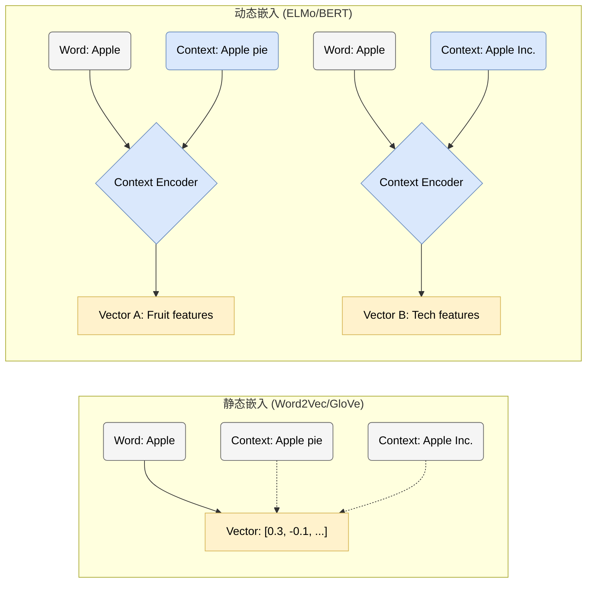
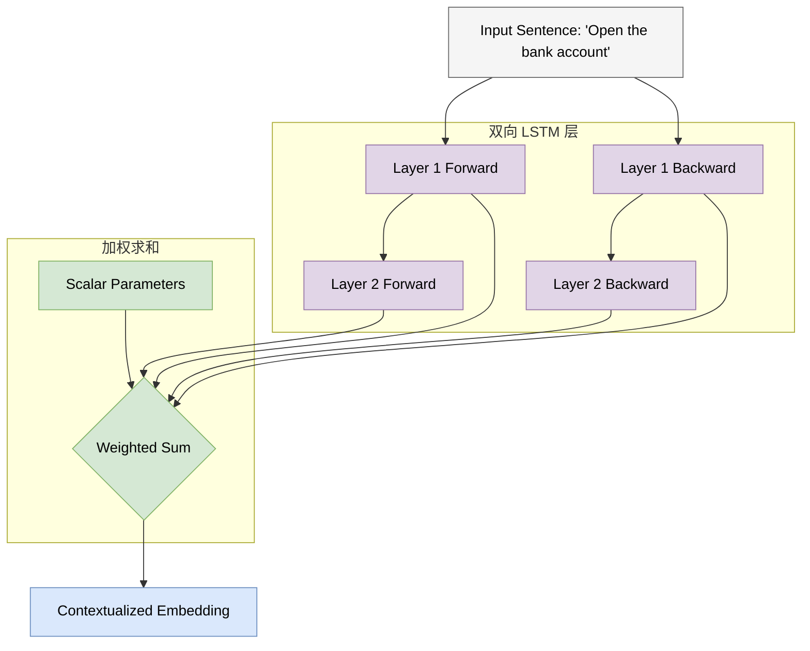
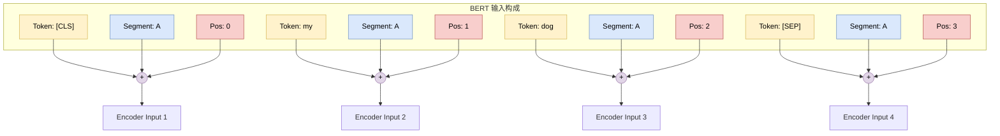
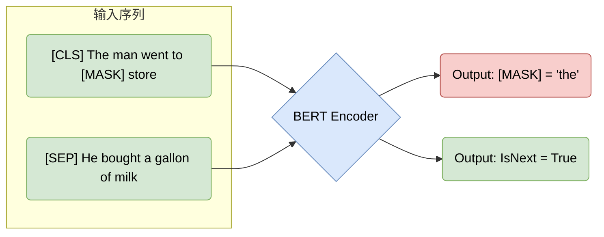
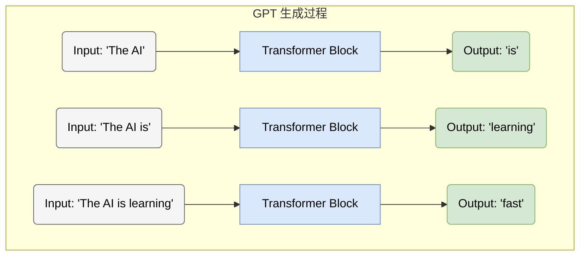
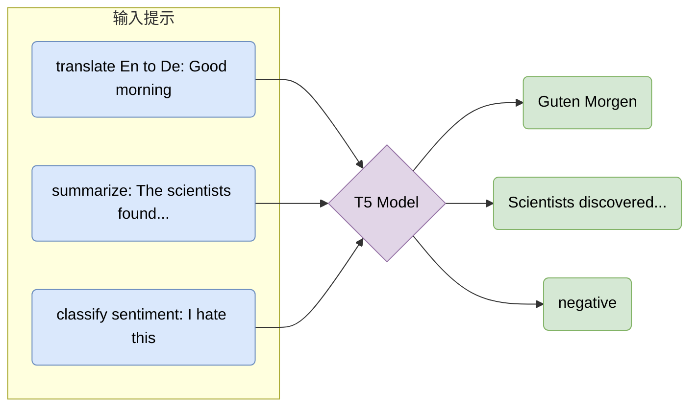
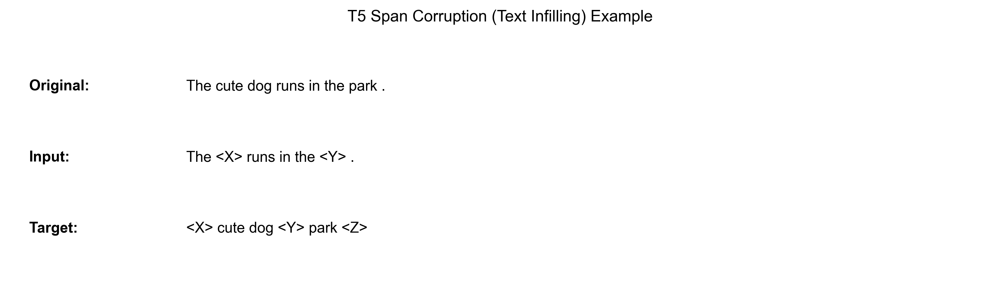

# 第四章 预训练语言模型：ELMo、BERT、GPT 与 T5
<a id="section-4-1"></a>

## 4.1 预训练时代与 ELMo (The Pre-training Era & ELMo)

### 1. 从静态到动态：词嵌入的演进 (Evolution of Word Embeddings)

在第 2 章中，我们介绍了 RNN 如何处理序列数据；在第 3 章中，我们深入探讨了 Transformer 架构及其强大的注意力机制。然而，在 Transformer 统治 NLP 之前，领域内面临着一个关键痛点：**如何有效地表示词义的复杂性（Polysemy）？**

早期的词向量模型（如 Word2Vec, GloVe）是 **静态的 (Static)**。一旦训练完成，单词 "bank" 的向量就是固定的，无论它出现在 "bank account"（银行账户）还是 "river bank"（河岸）中，其表示完全相同。这显然无法捕捉人类语言的丰富语境。

<span style="background-color: #DAE8FC; color: black; padding: 2px 4px; border-radius: 4px;">核心问题</span>：我们需要一种能够根据上下文动态调整的词表示方法。

#### 1.1 静态与动态嵌入对比 (Static vs. Dynamic Embeddings)



### 2. ELMo: 语言模型嵌入 (Embeddings from Language Models)

**ELMo (Embeddings from Language Models)** 是连接主义向预训练大模型过渡的重要桥梁。它并没有使用 Transformer，而是基于 **双向 LSTM (Bi-LSTM)** 构建。

#### 2.1 核心思想 (Core Idea)

ELMo 的核心洞察是：**词向量不应该是一个查表操作（Lookup Table），而应该是一个函数（Function）。** 这个函数的输入是整个句子，输出是针对该语境下每个词的向量表示。

<span style="background-color: #FFF2CC; color: black; padding: 2px 4px; border-radius: 4px;">公式定义</span>
给定一个序列 \( t_1, t_2, \dots, t_N \)，ELMo 通过最大化双向对数似然来训练：

\[
\sum_{k=1}^{N} \left( \log P(t_k | t_1, \dots, t_{k-1}) + \log P(t_k | t_{k+1}, \dots, t_N) \right)
\]

*   前向 LSTM 预测下一个词。
*   后向 LSTM 预测上一个词。

#### 2.2 ELMo 架构可视化 (ELMo Architecture)

ELMo 通过组合不同层级的 LSTM 隐藏状态来生成最终的词向量。

*   **Layer 0 (Char CNN)**: 处理字符级输入，解决 OOV (Out-of-Vocabulary) 问题。
*   **Layer 1 (LSTM)**: 捕捉句法 (Syntax) 信息。
*   **Layer 2 (LSTM)**: 捕捉语义 (Semantics) 信息。



#### 2.3 特征融合 (Feature Fusion)

ELMo 的最终表示 \( \mathbf{ELMo}_k \) 是各层表示的线性组合：

\[
\mathbf{ELMo}_k^{task} = \gamma^{task} \sum_{j=0}^{L} s_j^{task} \mathbf{h}_{k,j}^{LM}
\]

*   \( \mathbf{h}_{k,j}^{LM} \): 第 \( j \) 层的隐藏状态。
*   \( s_j^{task} \): Softmax 归一化的权重，让模型根据特定任务（如阅读理解或词性标注）自动决定更关注低层语法还是高层语义。
*   \( \gamma^{task} \): 缩放因子。

### 3. 预训练-微调范式的雏形 (Prototype of Pre-training & Fine-tuning)

ELMo 引入了一个关键范式：**基于特征的迁移 (Feature-based Transfer)**。
1.  **预训练 (Pre-training)**: 在大规模无标注文本上训练 Bi-LSTM 语言模型。
2.  **特征提取 (Feature Extraction)**: 将训练好的 ELMo 作为一个“特征提取器”，将其输出的动态向量作为下游任务模型的输入。
3.  **任务训练**: 下游模型（如分类器）只需要学习如何利用这些丰富的特征。

虽然 ELMo 依然是基于 RNN 的架构，受限于长距离依赖处理能力（见 2.3 节），但它证明了 **利用大规模无监督数据预训练上下文表示** 的巨大潜力。这为随后 BERT 和 GPT 的爆发奠定了基础。

<span style="background-color: #F8CECC; color: black; padding: 2px 4px; border-radius: 4px;">局限性</span>：ELMo 的双向性是“浅层”的（Shallow Bidirectionality），因为它只是简单拼接了前向和后向的独立 LSTM。真正的双向融合需要更强大的架构——Transformer。
<a id="section-4-2"></a>

## 4.2 BERT：双向编码器表示 (BERT: Bidirectional Encoder Representations)

### 1. 从 Feature-based 到 Fine-tuning (From Feature-based to Fine-tuning)

在 4.1 节中，我们看到 ELMo 通过“冻结”预训练网络并提取特征来提升下游任务性能。然而，OpenAI GPT (基于 Decoder) 和 Google BERT (基于 Encoder) 引入了更激进的策略：**微调 (Fine-tuning)**。

<span style="background-color: #DAE8FC; color: black; padding: 2px 4px; border-radius: 4px;">微调范式</span>：不仅是输出层，**整个预训练模型** 的参数都会在下游任务中进行更新。这意味着模型可以针对特定任务进行端到端的适配。

BERT (**B**idirectional **E**ncoder **R**epresentations from **T**ransformers) 的出现常被称为 NLP 历史上的“ImageNet 时刻”：它系统展示了 **深度双向架构** 配合大规模预训练在多类语言理解基准上的强迁移能力。

### 2. BERT 架构概览 (BERT Architecture Overview)

BERT 仅使用了 Transformer 的 **Encoder** 部分（详见 3.2 节）。与 GPT 的单向（从左到右）不同，BERT 的 Encoder 允许每个 token 同时“看到”其左边和右边的所有 token。

#### 2.1 输入表示 (Input Representations)

BERT 的输入设计非常精巧，由三部分相加而成：
1.  **Token Embeddings**: WordPiece 词向量。
2.  **Segment Embeddings**: 区分句子对（句子 A vs 句子 B）。
3.  **Position Embeddings**: 学习到的位置编码（非正弦）。



### 3. 预训练任务 (Pre-training Tasks)

BERT 的成功归功于两个精心设计的自监督任务：**掩码语言模型 (Masked Language Model, MLM)** 和 **下一句预测 (Next Sentence Prediction, NSP)**。

#### 3.1 掩码语言模型 (Masked Language Model, MLM)

传统的语言模型是单向的（预测下一个词），这限制了对上下文的理解。BERT 采用“完形填空”的方式：
*   随机 Mask 掉输入中 15% 的 Token。
*   模型需要利用 **双向上下文** 来预测被 Mask 掉的词。

<span style="background-color: #F5F5F5; color: black; padding: 2px 4px; border-radius: 4px; border: 1px solid #999;">掩码策略细节</span>
在被选中的 15% Token 中：
*   80% 替换为 `[MASK]` 符号。
*   10% 替换为随机词（迫使模型关注语义而非仅依赖 `[MASK]` 标记）。
*   10% 保持不变（缩小预训练与微调阶段的分布差异）。


**训练目标（最小数学形式）**：令 $\mathcal{M}$ 为被选中 mask 的位置集合，MLM 的损失可以写为：

<span style="background-color: #FFF2CC; color: black; padding: 2px 4px; border-radius: 4px;">Math</span>
$$ \mathcal{L}_{\text{MLM}} = - \sum_{i \in \mathcal{M}} \log P(x_i \mid x_{\setminus \mathcal{M}}) $$

其中 $x_{\setminus \mathcal{M}}$ 表示把被 mask 的位置替换为 `[MASK]` / 随机词 / 原词后的输入序列。

#### 3.2 下一句预测 (Next Sentence Prediction, NSP)

为了让模型理解句子间的逻辑关系（对问答、推理任务至关重要），NSP 任务要求模型判断句子 B 是否紧接在句子 A 之后。
*   **正例 (Positive)**: 50% 概率选择真实的下一句。
*   **负例 (Negative)**: 50% 概率从语料库中随机选择一句。

**训练目标（最小数学形式）**：令标签 $y\in\{0,1\}$ 表示 IsNext（1 为真），模型给出 $P_\theta(y=1\mid A,B)$，则二分类交叉熵为

<span style="background-color: #FFF2CC; color: black; padding: 2px 4px; border-radius: 4px;">Math</span>
$$ \mathcal{L}_{\text{NSP}} = -\left[y\log P_\theta + (1-y)\log(1-P_\theta)\right] $$

（实践中，后续工作如 RoBERTa 发现 NSP 并非必需；但把它作为一个“句子级别”的对齐信号来理解，仍然很有帮助。）



### 4. 总结 (Summary)

BERT 推动了 NLP 从任务特定模型走向“预训练 + 微调”的主流范式。
*   **架构**: 纯 Encoder，深度双向。
*   **数据**: 大规模无标注文本（BooksCorpus + Wikipedia）。
*   **影响**: 提出了通用的预训练-微调工作流，使得少量标注数据也能达到 State-of-the-art (SOTA) 的效果。

然而，BERT 作为一个**自编码 (Auto-Encoding)** 模型，主要用于理解任务。在**生成 (Generation)** 任务上，它先天不足（无法像自回归模型那样流畅生成文本）。这便是 GPT 系列登场的舞台。
<a id="section-4-3"></a>

## 4.3 GPT 系列：生成式预训练变换器 (GPT Series: Generative Pre-trained Transformers)

### 1. 另一条道路：生成式模型 (The Generative Path)

在 BERT 专注于“完形填空”以此理解语言结构的同时，GPT 系列选择了一条更接近自然语言顺序生成的道路：**自回归生成 (Autoregressive Generation)**。

**GPT (Generative Pre-trained Transformer)** 系列的核心假设是：如果一个模型能够在足够大、足够多样的数据上极好地预测下一个词（Predict the Next Token），它会被迫学习语法、语义、世界知识和部分推理模式。这里的“理解”不应被神秘化：它表现为可迁移的统计表征和上下文内泛化能力，而不是人类式意识。

**训练目标（最小数学形式）**：GPT 采用 **自回归语言建模 (Causal Language Modeling, CLM)**。给定序列 $x_{1:T}$，最大化似然等价于最小化负对数似然：

<span style="background-color: #FFF2CC; color: black; padding: 2px 4px; border-radius: 4px;">Math</span>
$$ \mathcal{L}_{\text{CLM}} = -\sum_{t=1}^{T} \log P(x_t \mid x_{<t}) $$

它之所以能被并行训练，是因为训练时我们一次性喂入整段文本，并用 **因果掩码 (Causal Mask)** 在注意力层里严格禁止“偷看未来”。

#### 1.1 架构对比：Decoder-only (Architecture Comparison)

GPT 采用了 Transformer 的 **Decoder** 部分（去掉了 Encoder-Decoder Attention 层）。

<span style="background-color: #DAE8FC; color: black; padding: 2px 4px; border-radius: 4px;">关键区别</span>：**因果掩码 (Causal Mask)**。
*   **BERT (Encoder)**: 能够看到未来的 Token（双向）。适合判别式任务。
*   **GPT (Decoder)**: 严格只能看到当前及过去的 Token（单向）。适合生成式任务。

为了把“能看见哪些 token”变成可视化对象，下图对比了两者的注意力可见性矩阵：




### 2. GPT 的演进之路 (Evolution of GPT)

GPT 系列的发展可以理解为模型规模（Scale）、数据分布、训练工程与能力（Capability）共同演进的历史，其中一些能力在评测上呈现出 **涌现 (Emergence)** 或跃迁式现象。

#### 2.1 GPT-1: 预训练 + 微调 (Pre-training + Fine-tuning)
*   **规模**: 1.17亿参数。
*   **贡献**: 验证了在无标注数据上预训练 Decoder 模型，再在下游任务上有监督微调（SFT）的有效性。此时它和 BERT 的思路类似。

#### 2.2 GPT-2: 零样本学习者 (Zero-shot Learner)
*   **规模**: 15亿参数。
*   **洞察**: "Language Models are Unsupervised Multitask Learners"。
*   GPT-2 的实验表明，当模型足够大、数据足够多时，它不需要显式的微调，通过给出一个合适的 **提示 (Prompt)**，就能完成翻译、摘要等任务。
    *   *Prompt*: "English: Hello. French: " -> 模型自动补全 "Bonjour"。

#### 2.3 GPT-3: 上下文学习 (In-context Learning)
*   **规模**: 1750亿参数。
*   **核心突破**: 即使不进行任何梯度更新（No Gradient Updates），模型也能通过输入中的少量示例（Few-shot）在上下文内适配新任务。

<span style="background-color: #FFF2CC; color: black; padding: 2px 4px; border-radius: 4px;">In-context Learning 示例</span>

```text
Input to GPT-3:
Task: Translate English to Spanish.
apple -> manzana
car -> coche
book -> ???

GPT-3 Output:
libro
```

### 3. 缩放定律 (Scaling Laws)

GPT 系列的成功不仅是工程上的胜利，更是科学上的发现。Kaplan 等人（2020）提出了著名的 **Scaling Laws**：
模型性能（Loss）与计算量（Compute）、数据集大小（Data Size）、参数量（Parameters）之间存在 **幂律关系 (Power Law)**。

这意味着：在相似数据分布和训练设定下，**增加算力、数据和参数通常会带来可预测的损失下降**。但缩放不是免费午餐：高质量数据会枯竭，训练与推理成本会上升，评测也会受到数据污染和任务选择影响。2024 年之后的近期系统越来越依赖后训练、工具使用和测试时计算，而不只是扩大预训练规模。


### 4. 总结 (Summary)

GPT 系列通过坚持简单的“预测下一个词”目标，并在数据、模型规模和训练工程上持续扩展，表现出一批涌现式能力。它将 NLP 的范式从“特定任务微调”推向了“通用任务提示”，也为后续的指令微调、工具调用和推理模型奠定了接口基础。

然而，早期的 GPT（如 GPT-3）虽然博学，但并不一定听话或安全。如何让这些庞然大物与人类意图对齐（Alignment），成为了后续 InstructGPT 和 ChatGPT 的核心课题。
<a id="section-4-4"></a>

## 4.4 统一框架：T5 与 BART (Unified Frameworks: T5 & BART)

### 1. 编码器与解码器的再融合 (Reuniting Encoder & Decoder)

BERT（仅编码器）擅长理解，GPT（仅解码器）擅长生成。那么，是否存在一种架构能够统一处理这两类任务？
答案是回归本源：使用完整的 **编码器-解码器 (Encoder-Decoder)** 架构（即原始 Transformer 架构）。

这一领域的代表作是 Google 的 **T5** 和 Facebook (Meta) 的 **BART**。

### 2. T5: 文本到文本转换器 (Text-to-Text Transfer Transformer)

T5 提出了一个极具统一性的视角：**许多常见 NLP 任务都可以被改写为“文本到文本” (Text-to-Text) 的转换问题。**

#### 2.1 统一接口 (Unified Interface)

在 T5 之前，不同的任务需要不同的模型头部（Head）：
*   分类任务需要全连接层输出类别概率。
*   回归任务需要输出实数。
*   生成任务需要解码文本。

T5 将一切统一为文本生成：
*   **翻译**: Input: "translate English to German: That is good." $\rightarrow$ Output: "Das ist gut."
*   **分类**: Input: "cola sentence: The course is jumping well." $\rightarrow$ Output: "not acceptable."
*   **回归**: Input: "stsb sentence1: ... sentence2: ..." $\rightarrow$ Output: "3.8" (以字符串形式输出数字)。



#### 2.2 预训练目标：Span Corruption

T5 使用了一种类似 BERT MLM 但更适合生成任务的目标：**Span Corruption (片段破坏)**。
它不是 Mask 单个词，而是 Mask 掉一段连续的文本，并用唯一的哨兵符（Sentinel Token, 如 `<X>`, `<Y>`）代替。模型需要生成被 Mask 掉的内容。

*   **Original**: "The cute dog runs in the park."
*   **Input**: "The `<X>` runs in the `<Y>`."
*   **Target**: "`<X>` cute dog `<Y>` park `<Z>`"



**训练目标（最小数学形式）**：把被破坏后的输入记为 $\tilde{x}$，目标序列（需要模型生成出来的 spans）记为 $y_{1:T}$，则 T5 的生成式去噪目标就是标准序列到序列的负对数似然：

<span style="background-color: #FFF2CC; color: black; padding: 2px 4px; border-radius: 4px;">Math</span>
$$ \mathcal{L}_{\text{span}} = -\sum_{t=1}^{T} \log P(y_t \mid y_{<t}, \tilde{x}) $$

它与 BERT-MLM 的差别在于：BERT 预测的是“被 mask 的离散位置上的 token”，而 T5 预测的是“一个连续的文本片段”，因此更自然地对齐生成任务。

### 3. BART: 去噪自编码器 (Denoising Autoencoder)

BART (Bidirectional and Auto-Regressive Transformers) 同样采用了 Encoder-Decoder 架构。它的预训练任务更加多样化，旨在恢复被破坏的文档。

<span style="background-color: #FFF2CC; color: black; padding: 2px 4px; border-radius: 4px;">噪声策略</span>
1.  **Token Masking**: 类似 BERT。
2.  **Token Deletion**: 删除 Token。
3.  **Text Infilling**: 类似 T5 Span Corruption。
4.  **Sentence Permutation**: 随机打乱句序。
5.  **Document Rotation**: 随机选择一个 Token 作为开头，旋转文档。

BART 在 **文本摘要 (Summarization)** 等生成任务上表现尤为出色。

### 4. 本章总结 (Chapter Summary)

至此，我们已经集齐了 Transformer 家族的三大流派：

|流派 (Paradigm)|代表模型 (Model)|架构 (Arch)|优势 (Pros)|劣势 (Cons)|
|:---|:---|:---|:---|:---|
|**Encoder-only**|BERT, RoBERTa|Bi-directional|理解能力强，适合分类/抽取|无法进行流畅的文本生成|
|**Decoder-only**|GPT-2, GPT-3|Auto-regressive|生成能力强，零样本泛化好|对上下文的双向理解较弱（训练时）|
|**Encoder-Decoder**|T5, BART|Full Transformer|在 seq2seq 任务中通用性强，兼顾理解与生成|训练和推理开销通常略大|

在接下来的章节中，我们将进入 **大模型时代 (The Era of LLMs)**，探讨如何通过指令微调 (Instruction Tuning) 和人类反馈强化学习 (RLHF) 将这些基座模型转化为更可用的指令跟随系统。
