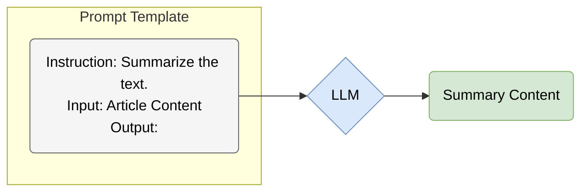
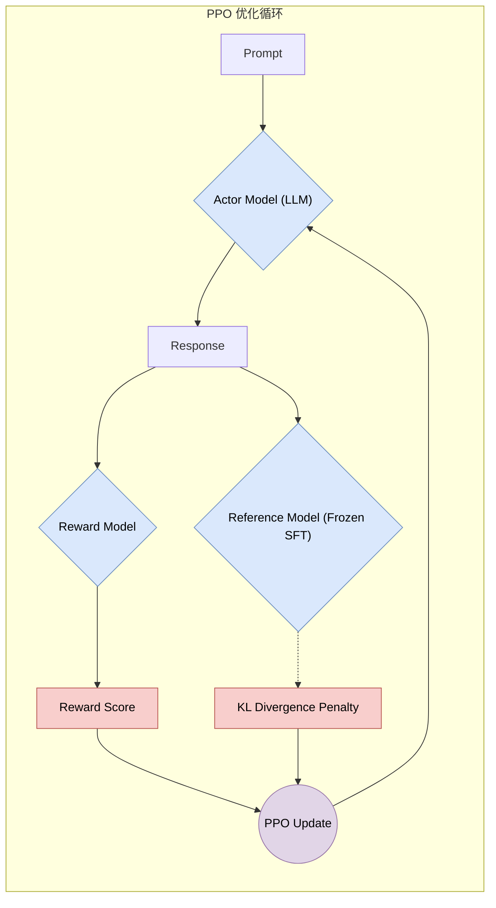
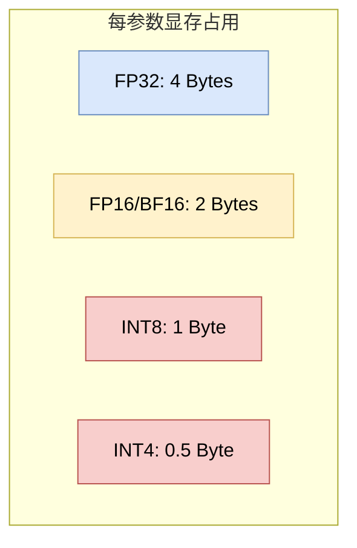
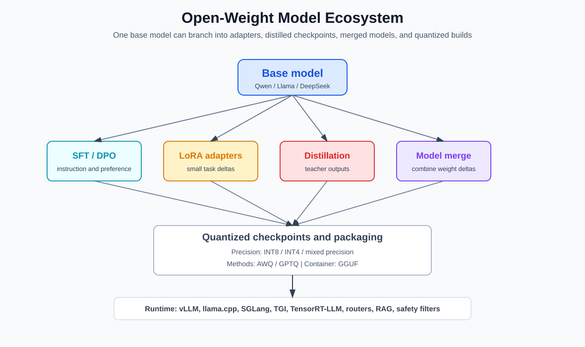

# 第五章 后训练、对齐与模型效率
<a id="section-5-1"></a>

## 5.1 指令微调：从续写到对话 (Instruction Tuning: From Completion to Conversation)

### 1. 核心矛盾：能力与意图的错位 (The Misalignment of Capability and Intent)

在第 4 章中，我们看到 GPT-3 展现出了显著的“上下文学习”能力。然而，原始的预训练模型（Base Model）主要优化的是 **文本续写目标**，并不天然等同于会稳定服从用户意图的助手。

如果你问 GPT-3：
> "Explain gravity to a six-year-old." (给六岁孩子解释重力)

它可能会根据训练数据的统计规律续写成：
> "Explain gravity to a physics student." (给物理系学生解释重力)
> "Explain gravity to a teacher." (给老师解释重力)

它并不知道这是一个“指令”需要去执行，而认为这是一个“列表”需要去补全。
<span style="background-color: #DAE8FC; color: black; padding: 2px 4px; border-radius: 4px;">核心问题</span>：模型拥有 **能力 (Capability)**，但原始预训练目标并不保证它会稳定服从用户 **意图 (Intent)**。

### 2. 指令微调 (Instruction Tuning)

**指令微调 (Instruction Tuning)** 是将预训练模型转化为智能助手的关键一步。它的核心思想是：利用大量以“指令-输入-输出”格式组织的语料库，对模型进行有监督微调 (SFT)。

#### 2.1 数据格式范式 (Data Format Paradigm)

传统的微调通常针对单一任务（如只做翻译）。而指令微调是 **多任务 (Multi-task)** 的，且每个任务都由自然语言指令定义。



#### 2.2 训练目标：条件语言建模 (Conditional Language Modeling)

指令微调在训练形式上仍然是“预测下一个 token”，只是我们把输入组织成了更接近人类指令的格式。把指令与输入拼接为 $\mathbf{x}$，把模型回答拼接为 $\mathbf{y} = (y_1, \dots, y_T)$，SFT 的目标函数就是标准的负对数似然：

$$ \mathcal{L}_{\text{SFT}} = - \sum_{t=1}^{T} \log P(y_t \mid \mathbf{x}, y_{<t}) $$

这一点解释了为什么“模板/格式”会显著影响结果：它直接改变了条件分布 $P(\mathbf{y}\mid\mathbf{x})$ 的建模方式。

#### 2.3 FLAN: 规模化的指令微调 (Finetuned Language Models are Zero-shot Learners)

Google 的 **FLAN** (Finetuned Language Net) 系列研究表明，通过将数十个 NLP 数据集转化为指令格式进行微调，模型在许多 **未见过的任务 (Unseen Tasks)** 上可以获得更好的零样本泛化能力。

*   **Prompt 模板化**: 将情感分类数据集 IMDB 转化为：
    *   模板 A: "Is this movie review positive or negative? {text}"
    *   模板 B: "Review: {text}. What is the sentiment?"

### 3. 对话微调 (Chat Tuning)

在指令微调基础上，对话模型还需要针对 **多轮对话 (Multi-turn Chat)** 的角色格式和历史依赖训练。公开资料通常只披露部分数据与配方，因此这里描述通用机制，不把任一闭源产品的完整训练流程视为已知事实。

#### 3.1 格式 (Format)

通常使用特殊的 Token 来标记对话角色：

```text
<|system|>
You are a helpful assistant.
<|user|>
How do I make a cake?
<|assistant|>
First, preheat your oven to...
<|user|>
What if I don't have eggs?
```

### 4. 总结 (Summary)

指令微调（SFT）把模型从普通续写分布推向“根据指令生成回答”的交互分布，使其更稳定地遵循用户请求。
然而，SFT 依然存在局限：
1.  **数据成本**: 高质量指令数据往往需要人工撰写、审核或验证；合成数据也需要过滤与独立评测。
2.  **目标不一致**: 仅模仿人类的回答（交叉熵损失最小化）并不等于生成“好”的回答。有时候模型会学会一本正经地胡说八道（Hallucination），因为它在训练数据中见过类似模式。

一种把人类比较判断转成训练信号的路线是 **RLHF**；它补充 SFT，但不等于已经定义或解决所有价值判断。
<a id="section-5-2"></a>

## 5.2 RLHF 与价值对齐 (RLHF & Value Alignment)

### 1. 为什么需要 RLHF? (Why RLHF?)

有监督微调 (SFT) 让模型拟合示范回答，也会传递部分质量与安全偏好；但单个示范无法直接表达多个可接受回答之间的相对偏好。
人类的偏好是主观且难以定义的：
*   **Helpful (有帮助)**: 准确回答问题。
*   **Harmless (无害)**: 不生成偏见、暴力或非法内容。
*   **Honest (诚实)**: 不编造事实（尽量）。

由于很难写出一个覆盖所有使用场景的显式损失函数来定义这些目标，InstructGPT 工作系统化展示了 **RLHF (Reinforcement Learning from Human Feedback)** 的有效性：让模型直接从人类的反馈（偏好排序）中学习。

### 2. RLHF 的三阶段 (The 3 Stages of RLHF)

这是现代指令跟随模型的重要训练范式之一。到 2024 年之后，实际系统通常会混合使用 SFT、RLHF、DPO/IPO 等直接偏好优化方法、规则约束、拒答数据和安全红队数据；PPO-RLHF 不再是唯一标准配方。


#### 2.1 步骤 1: 有监督微调 (SFT)
收集人类撰写的高质量指令-回复对，训练一个基座模型（Base Model）到 SFT Model。这一步与 5.1 节描述的一致。

#### 2.2 步骤 2: 奖励模型训练 (Reward Model Training)
这是关键一步。模型不再生成文本，而是**学会打分**。
*   **数据收集**: 给定一个 Prompt 和模型的多个输出（Output A, Output B, ...），让人类标注员进行排序（Ranking）：\( A > B > C \)。
*   **训练目标**: 训练一个 Reward Model (RM)，使得 \( R(A) > R(B) \)。

<span style="background-color: #FFF2CC; color: black; padding: 2px 4px; border-radius: 4px;">成对排序损失 (Pairwise Ranking Loss)</span>
\[
\mathcal{L}(\theta) = - \mathbb{E}_{(x, y_w, y_l) \sim D} \left[ \log(\sigma(r_\theta(x, y_w) - r_\theta(x, y_l))) \right]
\]
其中 \( y_w \) 是胜出的回答，\( y_l \) 是失败的回答。

#### 2.3 步骤 3: 强化学习微调 (PPO)
利用奖励模型作为“裁判”，使用 **PPO (Proximal Policy Optimization)** 算法优化语言模型。（关于 PPO 的详细数学推导与策略梯度原理，请见 **[附录 A.11](appendix/a.11_rl_and_ppo.md)**）



### 3. KL 散度：防止模型“作弊” (KL Divergence: The Safety Anchor)

在 PPO 过程中，一个常见的问题是 **Reward Hacking**：模型可能发现某种模式能获得高分，却不符合真实目标（具体模式取决于奖励模型，重复、冗长或迎合只是可能例子）。
为了防止 RL 模型偏离原本的语言能力太远，我们在奖励函数中加入了一个 **KL 惩罚项 (KL Penalty)**：

\[
R_{total}(x,y) = R_{model}(x,y)
- \beta \sum_t \log \frac{\pi_{RL}(y_t\mid x,y_{<t})}{\pi_{SFT}(y_t\mid x,y_{<t})}
\]

*   \(\pi_{RL}\): 当前正在训练的模型。
*   \(\pi_{SFT}\): 冻结的初始 SFT 模型。
*   **作用**: 上式是沿采样回答得到的 KL 相关惩罚估计；其期望对应策略相对参考策略的 KL 正则，用于限制分布偏移，但不保证事实性或安全性。


### 4. 直接偏好优化 (DPO: Direct Preference Optimization)

RLHF 很有效，但 PPO 训练对超参数、奖励模型质量和 KL 约束较敏感，也会带来额外显存与工程成本。
2023 年提出的 **DPO (Direct Preference Optimization)** 指出：在一定推导假设下，可以绕过显式的 Reward Model 和 PPO 步骤，直接在偏好数据上优化语言模型。

**训练目标（最小数学形式）**：给定偏好三元组 $(x, y_w, y_l)$（同一 Prompt 下胜者/败者），DPO 直接让“胜者相对败者”的对数概率优势变大，同时用参考策略 $\pi_{ref}$ 做锚定：

$$ \mathcal{L}_{\text{DPO}} = -\log \sigma\Big(\beta\big[(\log \pi_\theta(y_w|x) - \log \pi_\theta(y_l|x)) - (\log \pi_{ref}(y_w|x) - \log \pi_{ref}(y_l|x))\big]\Big) $$

其中 $\beta$ 是温度/权衡系数；在 DPO 的理论来源中，它对应 KL 正则强度的参数化。较大的 KL 系数意味着最优策略更受参考模型约束，但有限数据下的训练敏感度不能只由损失中的乘法位置判断。（更完整的推导与 KL 关系见 **[附录 A.11](appendix/a.11_rl_and_ppo.md)**）

DPO 已成为偏好微调的常用方法之一，但不是 PPO-RLHF 的无条件替代：离线偏好数据、在线探索和奖励可验证性适合不同算法。与此同时，公开的 o1、DeepSeekMath/DeepSeek-R1 材料显示，强化学习也被用于数学、代码等可验证任务。因此，“偏好对齐”和“推理强化”是相关但目标与数据口径不同的后训练路线。

### 5. 小结与后续

RLHF 及其后续偏好优化方法显著提升了模型的可用性和指令遵循能力，也是安全对齐工程中的重要组成部分。但它不是完整的后训练体系；事实校验、拒答策略、工具权限、红队测试和上线监控仍然不可替代。关于 2024 年之后更完整的后训练管线、推理强化、可验证奖励和数据闭环，见 **[5.5 现代后训练](chapter_05.md#section-5-5)**。
<a id="section-5-3"></a>

## 5.3 PEFT：参数高效微调 (PEFT: Parameter-Efficient Fine-Tuning)

### 1. 全量微调的负担 (The Burden of Full Fine-Tuning)

随着模型规模达到百亿至千亿参数，传统全量微调（Full Fine-Tuning）仍可通过分片与多机训练完成，但资源门槛很高。
*   **训练状态**: 以 175B 参数为例，仅 BF16/FP16 权重约为 350 GB（按十进制字节粗算）；梯度、FP32 master weights 和 Adam 一二阶状态会使未分片训练状态达到数 TB，实际数值取决于精度、优化器和并行策略。
*   **检查点存储**: 每个 BF16/FP16 全量检查点约 350 GB，FP32 才约 700 GB，且还未计 tokenizer、量化元数据或文件格式开销。

<span style="background-color: #DAE8FC; color: black; padding: 2px 4px; border-radius: 4px;">解决方案</span>：PEFT (Parameter-Efficient Fine-Tuning)。即 **冻结** 大部分模型参数，只训练极少量的额外参数。

### 2. LoRA: 低秩自适应 (Low-Rank Adaptation)

LoRA 是广泛使用的 PEFT 方法。它把任务适配限制为低秩权重增量；这是结构假设与可调超参数，不是关于所有最优权重更新都严格低秩的定理。

#### 2.1 核心公式 (Core Formulation)

对于一个预训练权重矩阵 \( W_0 \in \mathbb{R}^{d \times d} \)，我们不直接更新它，而是学习一个增量矩阵 \( \Delta W \)。
LoRA 将这个增量分解为两个低秩矩阵的乘积：

\[
W = W_0 + \Delta W, \quad \Delta W = \frac{\alpha}{r} B A
\]

其中 $\alpha$ 是 LoRA 的缩放超参数（常见设定如 $\alpha=r$），用于控制增量更新的幅度。

*   \( W_0 \): 冻结的预训练权重。
*   \( B \in \mathbb{R}^{d \times r} \): 初始化为 0。
*   \( A \in \mathbb{R}^{r \times d} \): 高斯随机初始化。
*   \( r \): 秩（Rank），通常设得很小（如 8, 16, 64）。

#### 2.2 LoRA 结构可视化 (Structure Visualization)


为了把“为什么 rank 设小也有效”变成更工程化的决策，下图给出一个简化的权衡示意：rank 越大，可训练参数增长越快，但收益通常是递减的。


#### 2.3 优势 (Advantages)
1.  **节省可训练参数**: LoRA 论文在 GPT-3 175B 的一种 $r=4$ 配置中报告约 470 万可训练参数，约占总参数的 0.003%；比例取决于把 LoRA 放在哪些矩阵上。
2.  **无推理延迟**: 在推理时，可以将 \( BA \) 直接加回 \( W_0 \) 中（\( W' = W_0 + BA \)），不增加额外的计算层。
3.  **多任务切换**: 不同的任务只需要切换不同的 \( A, B \) 矩阵，基础模型 \( W_0 \) 共享。

这也是开放模型社区能够快速繁殖出大量模型变体的原因之一：一个公开底座可以挂载多个 LoRA，用于代码、角色、翻译、医学、数学或工具调用。LoRA 既可以作为独立 adapter 分发，也可以在发布前 merge 回底模权重。关于它在开放权重生态中的位置，见 **[5.8 开放权重模型生态](chapter_05.md#section-5-8)**。

### 3. 其他 PEFT 方法 (Other PEFT Methods)

虽然 LoRA 占据主导地位，但了解其前身有助于理解 PEFT 的演进。

#### 3.1 Adapter Tuning
*   在 Transformer 的每一层（Attention 和 FFN 层之间）插入小型的“适配器”神经网络（Bottleneck Layers）。
*   **缺点**: 增加了网络深度，导致推理延迟（Inference Latency）。

#### 3.2 Prefix Tuning / Prompt Tuning / P-Tuning
*   **Prefix Tuning** 通常为 Transformer 各层注意力加入可训练的连续 key/value prefix；**Prompt Tuning** 更接近只在输入嵌入前加入可训练软 token。P-Tuning 系列还包含提示编码器等变体，三者不应完全等同。
*   **直觉**: 通过梯度下降学习连续提示或注意力前缀，同时冻结大部分底模参数。
*   **代价**: 运行时要处理额外前缀表示，会增加注意力/KV 开销并占用有效序列预算；具体是否计入 API“上下文长度”取决于实现。

### 4. QLoRA: 量化 LoRA (Quantized LoRA)

如果 LoRA 解决了训练参数量的问题，那么 QLoRA 则进一步解决了 **基座模型显存占用** 的问题。
*   **4-bit NormalFloat (NF4)**: 用针对近似正态权重分布设计的 4-bit 量化码本存储冻结基座；计算通常仍在 BF16 等更高精度中进行。NF4 不是 IEEE FP4。
*   **Double Quantization**: 对量化常数再进行一次量化。
*   **Paged Optimizers**: 利用 CPU 内存来处理 GPU 显存峰值。

<span style="background-color: #D5E8D4; color: black; padding: 2px 4px; border-radius: 4px;">论文结果</span>：QLoRA 论文报告可在单张 48GB GPU 上微调 65B 模型。这是特定软件、序列长度和训练配置下的结果，说明量化冻结权重可以显著降低微调显存门槛。

QLoRA 也让“先量化加载底模，再训练小 adapter”成为常规流程。实际使用时要注意：训练时的 4-bit 加载、推理时的量化格式、最终是否合并 LoRA，是三件不同的工程选择。
<a id="section-5-4"></a>

## 5.4 模型量化与优化 (Model Quantization & Optimization)

### 1. 为什么需要量化？(Why Quantization?)

大模型的参数量巨大，导致其部署面临两大瓶颈：
1.  **显存带宽 (Memory Bandwidth)**: 在小 batch 自回归 decode 等常见场景中，每步读取大量权重，往往呈 memory-bound；大 batch、长 prefill、MoE 通信或某些 kernel 也可能受计算与通信限制。
2.  **显存容量 (Memory Capacity)**: 运行一个 70B 的模型（FP16）需要 140GB+ 显存，这远超消费级显卡的能力。

**量化 (Quantization)** 通过降低数值精度来减少显存占用和带宽需求。

### 2. 数值精度概览 (Numerical Precision Overview)

*   **FP32 (Single Precision)**: 32-bit，常用于高精度累加、优化器状态或数值敏感计算。
*   **FP16 / BF16 (Half Precision)**: 16-bit，是现代加速器训练和推理的常见格式。BF16 与 FP32 具有相同数量的指数位、动态范围更接近 FP32，但尾数精度更低；是否更稳定仍取决于 loss scaling 与算子实现。
*   **INT8**: 8-bit 整数。
*   **FP4 / NF4**: 都是 4-bit 表示，但不是同一格式。FP4 指一类低位浮点编码；NF4 是 QLoRA 使用的非均匀量化数据类型/码本。



为了建立直觉，下图展示了一个“权重显存 vs 精度”的典型权衡（示意，并非某个特定模型的实测曲线）：


图中的容量只按“参数数目 $\times$ 位宽”估算权重本体；实际文件和显存还包含 scale、zero point、分组元数据、padding 及运行时 workspace。“质量”曲线是示意值，不代表任一模型实测。

### 3. 常见量化技术 (Common Quantization Techniques)

#### 3.1 Post-Training Quantization (PTQ)
训练后量化。直接将训练好的 FP16 模型转换为 INT8/INT4。

**技术本质（最小数学形式）**：最常见的是仿射量化 (Affine Quantization)。对某个权重（或一组权重）$w$，选择缩放 $s$ 与零点 $z$，把浮点映射到整数区间：

$$ q = \text{clip}\big(\text{round}(w/s) + z\big), \quad \hat{w} = s\,(q-z) $$

其中 $q$ 是 INT8/INT4 的离散值，$\hat{w}$ 是反量化后的近似权重。工程上常用 **按通道量化 (Per-channel Quantization)** 来降低误差（不同输出通道用不同的 $s,z$）。

*   **GPTQ**: 一种利用近似二阶信息逐层补偿量化误差的权重量化方法。3/4-bit 后的质量损失取决于模型、分组、校准集、任务和 kernel，不能概括为“几乎无损”。
*   **AWQ (Activation-aware Weight Quantization)**: 依据校准激活识别敏感权重通道，并通过逐通道缩放等方式减小权重量化误差；它不等同于简单把少量权重永久保留为高精度。

#### 3.2 Quantization-Aware Training (QAT)
感知量化训练。在训练过程中模拟或直接使用量化误差，常能恢复 PTQ 丢失的质量，但并非所有模型/位宽都必然优于成熟 PTQ，且需要额外训练成本。

#### 3.3 混合量化 (Mixed Quantization)

真实部署中很少所有层都用完全相同精度。更常见的是混合量化：

*   对大部分权重使用 INT4/INT8。
*   对 embedding、lm head、少数敏感层保留 FP16/BF16。
*   对激活异常值或重要通道做单独保护。
*   对 KV Cache 使用不同精度，以降低长上下文推理显存。
*   对 attention、MLP 和输出头采用不同 kernel 与量化格式。

这样做的原因是量化误差并不均匀。某些层和通道对误差特别敏感，如果一刀切压到低比特，可能出现格式错误、长上下文退化、数学/代码能力下降或工具调用 JSON 不稳定。AWQ、GPTQ、SmoothQuant 等方法以不同目标控制这些误差。发布时还要区分量化方法/检查点约定、GGUF 等文件容器与 llama.cpp 等推理 runtime（见 **[5.8 开放权重模型生态](chapter_05.md#section-5-8)**）。

### 4. 高效推理与显存管理 (Efficient Inference & Memory Management)

除了量化，显存管理也是优化的关键。

#### 4.1 KV Cache
在 Transformer 推理中，我们需要缓存之前 Token 的 Key 和 Value 向量，以避免重复计算。但这会消耗大量显存。

#### 4.2 PagedAttention (vLLM)
传统的 KV Cache 预分配显存会导致严重的内存碎片化和浪费。
受操作系统**虚拟内存 (Virtual Memory)** 分页机制的启发，**vLLM** 提出了 **PagedAttention**：
*   将 KV Cache 分块（Blocks）存储在非连续的物理显存中。
*   通过块表（Block Table）进行逻辑地址到物理地址的映射。

<span style="background-color: #D5E8D4; color: black; padding: 2px 4px; border-radius: 4px;">效果</span>：PagedAttention 显著降低了 KV Cache 管理中的内存碎片和预分配浪费，在长序列和多请求服务场景中可以明显提升吞吐量（Throughput）。

### 5. 本章总结 (Chapter Summary)

从指令微调、偏好对齐，到 PEFT、量化和高效推理，我们已经涵盖了现代大模型从“预训练基座”走向可部署系统的主要技术环节。不过，2024 年之后的后训练和推理服务已经变成更大的独立主题：下一节继续讨论 **[5.5 现代后训练](chapter_05.md#section-5-5)**，随后补充蒸馏、合成数据与推理速度优化。

这一系列技术不仅提升了模型在下游任务中的可用性，也降低了训练、微调和部署成本，推动了开放权重模型研究与本地化部署实践的发展。
<a id="section-5-5"></a>

## 5.5 现代后训练：从指令跟随到推理强化
### 5.5 Modern Post-Training: From Instruction Following to Reasoning Reinforcement

预训练让模型获得语言、知识和模式预测能力，但一个可用的 AI 助手并不是直接从预训练损失里长出来的。现代大模型的产品形态高度依赖 **后训练 (Post-training)**：把基座模型变成能遵循指令、能拒绝危险请求、能使用工具、能进行较长推理、能按格式输出的交互系统。

因此，后训练不是“微调一下”这么简单，而是一组互相叠加的训练和评测流程。


#### 5.5.1 后训练的基本分层

可以把后训练粗分为五层。

**第一层：指令跟随 (Instruction Following)**
通过人工数据、合成数据和高质量对话数据训练模型理解用户意图。这通常对应 SFT 或继续监督微调。

**第二层：偏好对齐 (Preference Alignment)**
通过 RLHF、DPO、IPO、KTO、ORPO 等方法，让模型倾向于输出更有帮助、更诚实、更安全的回答。核心数据通常是同一提示下多个回答的比较。

**第三层：推理强化 (Reasoning RL)**
数学、代码、逻辑题有时可以自动验证答案，因此可以使用可验证奖励提高采样轨迹和最终答案的成功率。DeepSeek-R1 报告展示了强化学习在这类任务中的作用；它与测试时生成长度相关，但不能据此断言所有推理产品都采用同样的搜索或计算分配机制。

**第四层：工具与格式训练 (Tool and Format Training)**
现代 Agent 需要稳定输出 JSON、函数调用、SQL、代码补丁、计划、引用和结构化结果。它们要求模型不仅“懂内容”，还要能遵守接口协议。

**第五层：安全与拒答 (Safety and Refusal)**
安全后训练包括拒答数据、危险能力边界、越狱鲁棒性、红队样本、政策分类器、工具权限和上线监控。它不是一次训练就结束的步骤，而是持续评测和迭代过程。

#### 5.5.2 SFT、偏好优化与 RL 的区别

给定输入 $x$ 和目标回答 $y$，SFT 直接最大化参考回答概率：

$$
\mathcal{L}_{\text{SFT}} = -\log \pi_\theta(y\mid x).
$$

偏好优化不要求唯一标准答案，而是给出胜者 $y_w$ 和败者 $y_l$。DPO 一类方法直接扩大二者的相对概率差，同时保留参考模型锚定：

$$
\mathcal{L}_{\text{DPO}}
= -\log \sigma\left(\beta
\left[
\log \frac{\pi_\theta(y_w\mid x)}{\pi_{\text{ref}}(y_w\mid x)}
-
\log \frac{\pi_\theta(y_l\mid x)}{\pi_{\text{ref}}(y_l\mid x)}
\right]\right).
$$

强化学习则把模型输出看作动作轨迹，并通过奖励函数优化期望回报：

$$
\max_\theta \; \mathbb{E}_{y\sim \pi_\theta(\cdot\mid x)}[R(x,y)].
$$

PPO 类方法通常还要训练一个 value model 来估计基线，降低策略梯度方差。GRPO (Group Relative Policy Optimization) 由 DeepSeekMath 论文提出，DeepSeek-R1 继续采用其组相对思想：对同一题多次采样构造相对优势，从而省去独立 critic/value model。设对同一输入 $x$ 采样 $G$ 个回答：

$$
y_1,\dots,y_G\sim \pi_{\theta_{\text{old}}}(\cdot\mid x),
\qquad
r_i=R(x,y_i).
$$

组内优势可以用归一化奖励近似：

$$
A_i=\frac{r_i-\operatorname{mean}(r_1,\dots,r_G)}
{\operatorname{std}(r_1,\dots,r_G)+\epsilon}.
$$

策略比率必须按回答中的 token 计算，而不是用整段序列概率之比。令

$$
\rho_{i,t}(\theta)
=\frac{\pi_\theta(y_{i,t}\mid x,y_{i,<t})}
{\pi_{\theta_{\mathrm{old}}}(y_{i,t}\mid x,y_{i,<t})}.
$$

省略 batch 期望后，一个教学化的 clipped GRPO 损失可写为：

$$
\mathcal{L}_{\text{GRPO}}
=-\frac{1}{G}\sum_{i=1}^{G}\frac{1}{|y_i|}\sum_{t=1}^{|y_i|}
\left[
\min\left(
\rho_{i,t} A_i,\;
\operatorname{clip}(\rho_{i,t},1-\epsilon,1+\epsilon)A_i
\right)
-\beta D_{\mathrm{KL},i,t}(\pi_\theta\|\pi_{\mathrm{ref}})
\right],
$$

其中 $D_{\mathrm{KL},i,t}$ 表示在该 token 上使用的参考策略 KL 项或其采样估计。不同 GRPO 实现对长度归一化、优势估计、KL 估计和 clipping 聚合会有差别；上式只保留 DeepSeekMath/DeepSeek-R1 路线的共同骨架。数学和代码任务适合这种方法，是因为同题候选可由答案检查器或测试给出相对可靠的结果奖励。

三者的差异可以概括为：

| 方法 | 监督信号 | 擅长问题 | 主要风险 |
| :--- | :--- | :--- | :--- |
| SFT | 标准答案 | 指令格式、基本能力迁移 | 学到数据风格而非真实偏好 |
| DPO/偏好优化 | 成对偏好 | 语气、帮助性、安全边界 | 偏好数据噪声、过拟合口味 |
| RL/可验证奖励 | 奖励函数 | 数学、代码、搜索、推理 | 奖励黑客、过度思考、分布偏移 |

#### 5.5.3 推理模型为什么重新重视 RL

早期 RLHF 主要解决“回答是否符合人类偏好”。而 2024 年之后的推理模型把 RL 用在另一类问题上：**答案可验证，但过程难以直接标注**。

例如数学竞赛题、代码题和单元测试任务，都可以相对明确地判断最终答案是否正确。模型可以通过采样、搜索、反思、验证器或过程奖励获得训练信号。这使得 RL 不再只是礼貌、安全和语气调节，而成为提升推理能力的核心手段之一。

不过，推理 RL 的收益也有边界：

*   对不可验证事实问答，奖励更难定义。
*   模型可能学会长篇推理形式，而不是更可靠的证据使用。
*   高测试时计算会增加延迟和成本。
*   如果训练奖励和真实任务不一致，模型仍会 reward hacking。

#### 5.5.4 Reward Hacking：奖励不是目标本身

**Reward hacking** 指的是模型找到一种提高训练奖励的方法，但这种方法并不符合人类真正想要的目标。它不是大模型时代才出现的问题；强化学习和优化系统长期存在“指标被优化坏”的现象。

在语言模型后训练中，reward hacking 可能表现为：

*   回答变得冗长、迎合、看似严谨，但事实支持不足。
*   学会触发奖励模型偏好的模板，而不是解决问题。
*   在代码任务中通过针对测试集的投机行为获得高分。
*   在安全训练中学会表面拒答，但在改写后的提示中仍泄漏危险能力。
*   在推理模型中写出很长的“思考过程”，却没有真实改善答案。

数学上，问题可以写成代理目标和真实目标的错位：

$$
\max_\theta \mathbb{E}[R_{\text{proxy}}(x,y)]
\quad \not\Rightarrow \quad
\max_\theta \mathbb{E}[U_{\text{human}}(x,y)].
$$

其中 $R_{\text{proxy}}$ 是奖励模型、规则评测或单元测试给出的代理奖励；$U_{\text{human}}$ 才是人类真正希望优化的效用。后训练的核心困难之一，就是让代理奖励尽量贴近真实目标，同时避免模型学会利用奖励漏洞。

工程上通常用几类方法缓解 reward hacking：

*   **多奖励组合**：把帮助性、真实性、安全性、格式、简洁性分开评估，避免单一奖励被钻空子。
*   **保留参考模型约束**：用 KL 项限制策略偏移，防止模型为了奖励牺牲语言质量。
*   **对抗评测**：专门构造会诱导模型刷分、越狱、伪造引用或滥用工具的样本。
*   **可执行验证**：代码运行、数学验算、检索证据、类型检查和单元测试比纯文本奖励更难被表面话术欺骗。
*   **线上监控**：reward hacking 往往在真实分布中暴露，不能只依赖离线 benchmark。

注意，KL 约束本身也只是代理项。它能防止模型偏离太远，但不能保证模型更真实或更安全。后训练的实际目标是一组互相制约的指标，而不是某个单一 loss。

#### 5.5.5 安全训练：拒答、边界与能力保留

安全训练不是简单地“把坏请求都打成负分”。如果惩罚过强，模型会变得过度拒答；如果惩罚过弱，模型又可能在越狱、角色扮演、编码、翻译或多轮诱导中泄漏危险信息。

常见安全训练包括：

*   **拒答数据**：明确训练模型在危险请求上拒绝。
*   **安全改写**：把危险请求引导到合法、教育性或防护性信息。
*   **红队数据**：收集越狱、隐写、角色扮演、多轮诱导等失败样本。
*   **政策分类器**：在模型外部识别请求和输出风险。
*   **工具权限**：让危险动作需要显式授权、沙箱、审计和人工确认。
*   **能力保留评测**：防止安全训练让模型在医学、网络安全、化学、代码等合法任务中无意义拒答。

这类训练的难点是边界。比如“解释 SQL 注入原理”可以是安全教育，也可以是攻击准备；“写漏洞利用代码”可能是 CTF，也可能是现实攻击。模型不能只靠关键词判断，而需要结合意图、上下文、权限和用途。

#### 5.5.6 CoT 可监控性的研究边界

可读的 Chain of Thought (CoT) 可能给安全监控提供额外信号，例如检查其中是否出现欺骗、越权或危险计划。但 CoT 未必忠实反映内部计算，也可能根本不向用户或监控器完整暴露。

2025 年的 CoT monitorability 论文提出一项需要验证的警告：**把“CoT 看起来安全”直接设成强优化目标，可能损害这类信号的可监控性**。这是研究结论与设计风险，不是所有安全训练系统已经采用的统一规则。

原因是，一旦模型知道 CoT 会被严格惩罚，它可能学会把危险意图从可读 CoT 中隐藏起来，只在最终动作、工具调用或隐式状态里体现。换句话说，直接惩罚 CoT 可能提升表面安全，却降低 CoT 的可监控性。

由此得到的候选设计原则包括：

*   用 CoT 作为监控和审计信号，而不是唯一训练目标。
*   主要对最终输出、工具调用和外部行为施加安全约束。
*   对 CoT monitorability 做专门评测，检查模型是否学会“想一套、说一套”。
*   在高风险任务中结合沙箱、权限、人类审批和输出验证。

这不意味着 CoT 忠实，也不意味着应向用户展示内部轨迹。实际系统仍需评估监控器的误报/漏报，并把最终输出、工具调用、权限与外部行为作为主要安全边界。

可以把这里的区别写成两种优化方式。一种是直接优化 CoT 外观：

$$
\max_\theta R_{\text{cot-monitor}}(r),
$$

其中 $r$ 是模型的可读推理轨迹。风险是模型学会生成“看起来安全”的 $r$，而真实决策信息转移到不可见状态、工具参数或最终动作中。

另一种是把 CoT 作为旁路审计信号：

$$
\max_\theta R_{\text{task}}(y,a)
\quad \text{subject to monitoring}(r,y,a),
$$

其中 $y$ 是最终回答，$a$ 是工具调用或外部动作。监控器用于发现异常、触发人工审核或拒绝执行，而不是把所有可读推理都压成固定模板。这就是“保留可监控性”和“优化安全行为”之间的微妙区别。

#### 5.5.7 后训练数据工程

后训练的质量很大程度上取决于数据。常见数据来源包括：

*   人工撰写的高质量指令与答案。
*   人类偏好排序。
*   模型生成、人工筛选或自动验证的合成数据。
*   代码执行、数学验证、单元测试和形式化检查产生的可验证轨迹。
*   红队、拒答、安全政策和边界案例。
*   工具调用轨迹、RAG 引用样本和 Agent 执行日志。

这也解释了为什么现代模型训练不再只讨论“预训练语料规模”。后训练数据虽然体量更小，但密度更高，对最终用户体验影响很大。

#### 5.5.8 后训练的评测

后训练必须配套评测，否则很容易只优化可见 benchmark。评测至少应覆盖：

*   指令遵循和格式稳定性。
*   数学、代码与可验证任务。
*   事实性与引用正确性。
*   多轮对话一致性。
*   拒答边界和越狱鲁棒性。
*   工具调用正确性和权限安全。
*   延迟、成本和输出长度控制。

所以，现代后训练更像一个闭环：训练、生成、评测、筛选、再训练。它把模型从“会预测下一个 token 的基座”变成“能进入系统接口的助手”。

---

本节把后训练作为独立主线展开。下一节讨论蒸馏、合成数据和常规训练配方，它们是开放权重模型、轻量模型和推理模型落地时非常常见的基础方法。
<a id="section-5-6"></a>

## 5.6 蒸馏、合成数据与常规训练配方
### 5.6 Distillation, Synthetic Data, and Common Training Recipes

大模型训练不只有“从零预训练”和“RLHF”两件事。实际研究和工程中，大量模型能力来自更常规但非常重要的训练配方：蒸馏、继续预训练、领域微调、合成数据、自举筛选、模型合并、量化感知微调和评测驱动的数据迭代。

这些方法看起来不如新架构醒目，但它们往往决定一个模型能否便宜、稳定、可控地落地。

#### 5.6.1 知识蒸馏：让小模型学习大模型

**知识蒸馏 (Knowledge Distillation)** 的基本思想是：用教师模型产生软标签、回答或推理轨迹，让学生模型学习教师的行为。

分类任务中，经典蒸馏会让学生匹配教师的概率分布：

$$
\mathcal{L}_{\text{KD}}
= \tau^2 \cdot \mathrm{KL}\left(
\mathrm{softmax}(z_T/\tau)\;\|\;\mathrm{softmax}(z_S/\tau)
\right),
$$

其中 $\tau$ 是温度，$z_T,z_S$ 是教师和学生的 logits。温度越高，类别之间的相对信息越平滑；前面的 $\tau^2$ 用于补偿梯度尺度。

语言模型中的蒸馏可以有几种粒度：

*   **Logit 蒸馏**：匹配教师的下一个 token 分布。
*   **Response 蒸馏**：学习教师生成的最终回答。
*   **Reasoning 蒸馏**：学习教师的推理轨迹、解题步骤或代码修复过程。
*   **Preference 蒸馏**：学习教师或奖励模型给出的排序。

DeepSeek-R1 的开源材料中就包含了把强推理模型能力蒸馏到较小 Qwen/Llama 系列模型上的路线。这说明蒸馏不只是压缩模型，也可以传播某种训练后形成的推理风格。

更具体地说，R1-Distill-Qwen / R1-Distill-Llama 这类模型不是“复制教师权重”，而是用教师模型生成的推理样本训练另一个底座。学生继承的是输出行为、解题格式和一部分可迁移能力；它仍受学生底座容量、tokenizer、预训练知识和训练数据质量限制。关于这种衍生模型在开放生态中的位置，见 **[5.8 开放权重模型生态](chapter_05.md#section-5-8)**。

#### 5.6.2 合成数据：从数据稀缺到数据筛选

合成数据不是简单地“让模型自己写数据”。它通常需要一个闭环：

1.  生成候选任务、问题或答案。
2.  过滤低质量、重复或错误样本。
3.  用执行器、单元测试、检索证据或人类标注验证样本。
4.  将通过验证的数据用于 SFT、偏好优化或 RL。
5.  再用评测结果反向改进数据生成策略。

自指令 (Self-Instruct) 是早期代表方法之一：用模型自动生成指令数据，扩充指令跟随训练集。到推理模型时代，合成数据更强调可验证性：数学答案可以验算，代码可以运行，形式化证明可以检查，工具调用可以回放。

从算法形态看，很多合成数据管线可以写成 **生成-筛选-再训练**：

$$
y_1,\dots,y_N \sim \pi_T(\cdot\mid x),
\qquad
y^\star = \arg\max_{y_i} V(x,y_i),
$$

其中 $\pi_T$ 是教师模型或当前模型，$V$ 是验证器、奖励模型、单元测试、检索证据检查器或人工标注器。然后用通过筛选的样本做 SFT：

$$
\mathcal{L}_{\text{synthetic}}
=-\log \pi_S(y^\star\mid x).
$$

这类 rejection sampling / best-of-$N$ 训练并不神秘：它把推理时多采样的收益固化到学生模型里。风险也很直接：如果 $V$ 只奖励格式、长度或表面相似度，学生会学会这些代理特征；如果 $V$ 真的能执行代码、验算答案或核对引用，合成数据就更可靠。

另一个常见闭环是 self-training：先用当前模型生成大量候选，再用更严格的过滤器保留高置信样本，最后把这些样本加入下一轮训练。它可以扩大数据规模，但也会放大模型已有偏差，所以通常需要去重、难度分层、人工抽检和独立评测集。

#### 5.6.3 继续预训练与领域适配

如果一个通用基座模型缺少某个领域知识，常见做法不是直接 RLHF，而是先做 **继续预训练 (Continued Pretraining)** 或 **领域自监督训练**。

例如法律、医学、金融、代码、科研论文场景，可以先用领域语料继续训练语言建模目标：

$$
\mathcal{L}_{\text{domain}} = -\sum_t \log P_\theta(x_t\mid x_{<t}).
$$

然后再做指令微调和偏好对齐。否则，模型可能学会了领域回答的格式，却没有足够底层知识。

#### 5.6.4 数据混合与灾难性遗忘

微调会改变模型分布。如果领域数据太窄，模型可能发生灾难性遗忘：通用能力下降、语气变僵、指令遵循变差。

常见缓解方法包括：

*   在训练集中混入通用指令数据。
*   使用较小学习率和较短训练。
*   冻结部分参数或使用 LoRA。
*   使用 KL 约束或参考模型锚定。
*   对通用能力、领域能力和安全能力分别建评测集。

#### 5.6.5 模型合并、路由与小模型专用化

除了继续训练，模型能力也可以通过模型合并和系统路由组合：

*   **Model Merging**：把多个微调模型的权重差分合并，得到兼具多种能力的模型。
*   **Router**：根据任务类型选择不同模型，例如代码模型、数学模型、视觉模型或小型快速模型。
*   **Specialist Small Models**：把通用大模型蒸馏到小模型，用于分类、抽取、改写、RAG rerank、工具参数生成等高频任务。

这说明“模型训练”已经越来越像系统工程：一个产品不一定只依赖一个最大的模型，而可能由多个模型、缓存、检索器、验证器和路由器共同工作。

---

蒸馏和合成数据把模型训练从单次大工程变成持续迭代过程。下一节转向推理服务：当模型已经训练好，怎样让它更快、更便宜、更稳定地输出？
<a id="section-5-7"></a>

## 5.7 推理速度与服务系统
### 5.7 Inference Speed and Serving Systems

推理服务需要同时满足交互延迟、批量吞吐、资源成本与稳定性。模型质量相近时，这些系统指标会直接影响任务可用性；它们也构成可重复测量的工程研究对象，而不只是产品体验描述。


#### 5.7.1 速度指标

常用指标包括：

*   **TTFT (Time To First Token)**：从请求进入到第一个 token 输出的时间。它决定交互是否“有反应”。
*   **TPOT (Time Per Output Token)**：生成阶段每个 token 的平均时间。它决定长回答是否流畅。
*   **Tokens/s**：每秒输出 token 数，可按单请求或批量吞吐衡量。
*   **Throughput**：单位时间处理多少请求或 token。
*   **Cost/token**：每个 token 的服务成本。
*   **Tail latency**：P95/P99 延迟，决定高负载下是否稳定。

这些指标相互冲突。增大 batch 可以提高吞吐，但可能增加单请求延迟；长上下文提高能力，但会增加 TTFT 和 KV Cache 压力。

#### 5.7.2 KV Cache 管理与连续批处理

自回归推理包括两个阶段：

1.  **Prefill**：处理输入 prompt，构建 KV Cache。
2.  **Decode**：逐 token 生成，每一步读取 KV Cache 并追加新 token。

长输入主要拖慢 prefill，长输出主要拖慢 decode。服务系统必须处理不同请求长度混在一起的情况。

PagedAttention / vLLM 的关键贡献是把 KV Cache 分成块，用类似虚拟内存的方式管理，减少预分配浪费和碎片。连续批处理 (continuous batching) 则让新请求可以动态加入正在运行的 batch，提升 GPU 利用率。

从单层算术量看，prefill 的标准注意力约为 $O(n^2d)$，投影与 FFN 另有 $O(nd^2)$；decode 每生成一个 token，注意力读取长度 $n$ 的历史 KV，约为 $O(nd)$，投影与 FFN 仍约为 $O(d^2)$：

$$
\text{prefill} \approx O(n^2d+nd^2),\qquad
\text{decode step} \approx O(nd+d^2).
$$

这些是忽略层数、常数、稀疏性与通信的简化式。短 prompt 长输出的累计时间常由 decode 主导；长 prompt 短输出则常由 prefill 主导，但具体瓶颈还取决于 batch、硬件、量化和 kernel。

PagedAttention 可以抽象成块表映射：

$$
\text{logical block id} \longmapsto \text{physical GPU block id}.
$$

请求看到的是连续上下文，底层显存可以是不连续的块。这样做的好处类似操作系统分页：减少大块连续显存预留，允许多个请求更紧密地共享显存。

#### 5.7.3 投机解码与多 token 预测

**投机解码 (Speculative Decoding)** 用一个小模型先草拟多个 token，再让大模型一次性验证。若草稿通过，就能一次接受多个 token；若失败，则回退。

简化地说：

1.  Draft model 生成候选 token 序列 $\tilde{y}_{1:k}$。
2.  Target model 并行计算这些候选的概率。
3.  根据接受规则保留一段前缀。
4.  若 $k$ 个草稿 token 全部接受，再从 target 的下一位置分布取一个 token；否则按修正分布处理首个拒绝位置，然后重复。

这类方法的收益取决于草稿模型质量、目标模型验证成本、batch 形状和采样策略。Medusa、EAGLE 等方法则尝试通过额外预测头或特征预测来减少独立 draft model 的成本。

标准随机投机采样的核心约束是保持目标分布。Draft model 只提出候选，target model 负责验证。若草稿分布为 $q$、目标分布为 $p$，候选 token $y$ 的接受概率是

$$
\min\left(1,\frac{p(y)}{q(y)}\right)
$$

若拒绝，不能简单“按 $p$ 重采样”，而应从归一化的修正分布 $[p-q]_+$ 采样；通过整套接受与修正规则，标准算法在精确算术下保持 target 分布不变。贪心投机解码、近似验证和其他多 token 方法有不同保证。

DeepSeek-V3 的 MTP 首先是训练期的多 token 预测目标；其预测模块具有用于投机解码的潜力，但技术报告中的这一动机不等于公开部署已经采用某个特定投机方案。

#### 5.7.4 量化、低精度与硬件协同

量化降低权重和 KV Cache 的显存占用，也降低显存带宽压力。常见路线包括：

*   权重量化：目标精度可为 INT8/INT4，GPTQ、AWQ 是常见方法或检查点约定。
*   KV Cache 量化：降低长上下文推理显存。
*   混合精度：FP16、BF16、FP8。
*   Kernel 优化：FlashAttention、FlashMLA、fused MLP、fused sampling。

低精度不是越低越好。它会影响困惑度、长上下文稳定性、工具调用格式和数值鲁棒性，因此通常需要校准集、敏感层保护和回归测试。

#### 5.7.5 并行与路由

大模型服务常用多种并行策略：

*   **Tensor Parallelism**：把矩阵乘法切到多卡。
*   **Pipeline Parallelism**：把层分到不同设备。
*   **Expert Parallelism**：MoE 模型中把专家分布到不同设备。
*   **Data Parallel Serving**：多副本服务不同请求。

此外，服务系统可使用路由策略：简单任务交给小模型，复杂任务交给大模型；短任务走低延迟路径，长任务走高吞吐路径；工具调用前后也可由不同模型负责规划、执行和校验。

#### 5.7.6 输出速度不是纯工程问题

输出速度会反过来影响模型设计。

*   为了更快 decode，需要减少每步激活计算和 KV 读取。
*   为了更快 prefill，需要更高效处理长上下文。
*   为了更高吞吐，需要模型适合 batch、分块和并行。
*   为了降低成本，需要蒸馏、小模型路由和缓存。

所以，速度优化不是部署阶段的附加工作，而是从架构、训练、后训练、系统和产品交互共同决定的。

---

到这里，第 5 章已经覆盖从 SFT、RLHF、DPO、推理 RL、蒸馏、量化到服务系统的主要链条。下一章转向多模态、世界模型、视频生成和 Agent 系统。

开放权重生态还会组合这些技术：同一个底模可能有 LoRA、merge、distill、GPTQ/AWQ 等量化衍生版，并以 GGUF 等容器/文件格式供特定 runtime 加载。下一节用一张生态图区分训练方法、权重变换、文件格式与服务运行时。
<a id="section-5-8"></a>

## 5.8 开放权重模型生态：底模、LoRA、蒸馏、合并与量化
### 5.8 Open-Weight Model Ecosystem: Base Models, LoRA, Distillation, Merging, and Quantization

开放权重模型发布后，可以通过参数高效微调、蒸馏、权重合并和量化衍生出多种检查点或适配器。不同衍生物的许可证、数据来源、兼容性与评测结果仍需分别核对。

这些变体包括：

*   指令模型。
*   推理模型。
*   领域模型。
*   角色/风格模型。
*   蒸馏模型。
*   LoRA adapter。
*   merge 模型。
*   量化模型。
*   面向服务的路由组合。



#### 5.8.1 为什么一个底模能衍生出多个模型

底模可以理解为一个通用函数：

$$
f_{\theta_0}: x \mapsto P(y\mid x).
$$

后续训练并不总是要重写全部参数。很多情况下，只需要在 $\theta_0$ 附近做一个较小的位移：

$$
\theta = \theta_0 + \Delta\theta.
$$

不同数据、不同奖励、不同 LoRA、不同蒸馏教师，会产生不同的 $\Delta\theta$。这就是“同一个底模衍生出多个模型”的技术基础。

例如：

*   用指令数据训练，得到 instruct model。
*   用代码数据继续训练，得到 coder model。
*   用数学/可验证奖励训练，得到 reasoning model。
*   用某个强教师生成的答案训练，得到 distill model。
*   用少量角色风格数据训练，得到 style adapter。
*   用多个模型权重合并，得到 merged model。
*   用 GPTQ/AWQ 等方法量化权重，并可封装为 GGUF 等运行时支持的文件格式。

对**来自同一初始化且训练位移适中**的微调检查点，权重坐标仍然对齐，差分 $\Delta\theta$ 有时可被线性组合、裁剪或低秩近似；这为 LoRA、task vector 和部分 merge 方法提供了条件。蒸馏依赖教师输出而非参数盆地，学生甚至可以采用不同底座或架构，因此不能用同一几何理由解释。

#### 5.8.2 LoRA 在生态中的角色

LoRA 的价值不只是省显存。它还改变了模型分发方式。

完整模型可能几十 GB 到数百 GB；一个 LoRA adapter 可能只有几十 MB 到几 GB。社区可以在同一个 base model 上训练多个 adapter：

$$
W = W_0 + \frac{\alpha}{r}BA.
$$

如果 $W_0\in\mathbb{R}^{d_{\text{out}}\times d_{\text{in}}}$，全量更新需要训练 $d_{\text{out}}d_{\text{in}}$ 个参数。LoRA 只训练：

$$
r(d_{\text{out}}+d_{\text{in}})
$$

个参数。当 $r\ll \min(d_{\text{out}},d_{\text{in}})$ 时，参数量会小很多。它隐含的假设是：下游任务需要的权重变化 $\Delta W$ 近似低秩。

这带来三个结果：

*   **低成本试验**：小团队可以做领域微调。
*   **快速切换**：同一个底模加载不同 adapter，切换任务或风格。
*   **可合并**：推理前把 LoRA 权重合入底模，减少运行时额外开销。

但 LoRA 也有边界：固定秩与注入位置会限制适配容量，训练数据与超参数也可能损害底模原有能力。LoRA 能否学到领域知识或推理行为是经验问题，不能一概降格为“只学表层风格”。

LoRA merge 的原理也很直接。训练时前向计算为：

$$
y = W_0x + \frac{\alpha}{r}BAx.
$$

推理前可以定义：

$$
W' = W_0 + \frac{\alpha}{r}BA,
$$

于是：

$$
y = W'x.
$$

因此合并后的 LoRA 不增加推理层数。但如果需要动态切换多个 adapter，就可能选择不合并，而是在运行时加载不同增量。

#### 5.8.3 CoT 蒸馏到底在传递什么

CoT 蒸馏不是把教师模型的“真实思维”复制出来。更准确地说，它让学生学习教师输出中的 **过程分布**：

$$
\mathcal{D}_{\text{distill}}
= \{(x, r_T, y_T)\},
$$

其中 $r_T$ 是教师生成的推理轨迹，$y_T$ 是最终答案。学生通过 SFT 学习：

$$
\max_\theta \log \pi_\theta(r_T, y_T \mid x).
$$

它可能传递几类东西：

*   解题格式：如何拆题、列步骤、检查答案。
*   中间知识：教师在答案里暴露出的领域模式。
*   可见的候选探索模式：回答中展示了哪些路径；这不保证等同于教师内部实际搜索过程。
*   风格与语气：回答更像某个教师模型。
*   错误模式：教师的幻觉、偏见和模板也会被学生继承。

DeepSeek-R1 报告说明，R1-Distill-Qwen / Distill-Llama 使用由 DeepSeek-R1 生成并筛选的数据，对 Qwen 或 Llama 系列底座做监督微调。它们不是“把 R1 权重塞进 Qwen”，而是行为/响应层面的蒸馏；样本质量与学生能力仍需独立评测。

蒸馏目标也有层次差别。

**响应蒸馏**只学习最终答案：

$$
\mathcal{L}_{\text{resp}}=-\log \pi_S(y_T\mid x).
$$

**CoT 蒸馏**学习过程和答案：

$$
\mathcal{L}_{\text{cot}}=-\log \pi_S(r_T,y_T\mid x).
$$

**logit 蒸馏**则希望学生匹配教师每一步 token 分布：

$$
\mathcal{L}_{\text{logit}}
= \sum_t \mathrm{KL}\left(p_T(\cdot\mid x,y_{<t})\;\|\;p_S(\cdot\mid x,y_{<t})\right).
$$

响应蒸馏便宜但信号稀疏；CoT 蒸馏提供更多中间监督，但可能复制教师的伪推理；logit 蒸馏信号最密，但通常需要访问教师 logits，闭源教师一般做不到。

使用另一模型生成的响应训练开放底座，通常应称为响应蒸馏、行为克隆或合成数据微调，而不是“获得”教师权重或完整能力。对于闭源教师，还必须另行核对服务条款、数据许可、隐私和输出来源；技术相似不等于数据使用被授权。

#### 5.8.4 模型合并：为什么 merge 有时有效

模型合并 (Model Merging) 指不再训练，而是直接在权重空间组合多个模型。最简单的是线性插值：

$$
\theta_{\text{merge}} = \lambda \theta_A + (1-\lambda)\theta_B.
$$

如果两个模型来自同一个底座：

$$
\theta_A = \theta_0 + \Delta_A,\qquad
\theta_B = \theta_0 + \Delta_B,
$$

则合并可以写成：

$$
\theta_{\text{merge}} = \theta_0 + \lambda\Delta_A + (1-\lambda)\Delta_B.
$$

这解释了为什么同底座模型更容易 merge：它们可能仍在相近的参数区域内，权重方向有一定可加性。更复杂的方法如 task arithmetic、TIES-Merging、DARE 会尝试处理符号冲突、稀疏化更新或减少不同任务之间的干扰。

**Task arithmetic** 把微调差分看作任务向量：

$$
\tau_A = \theta_A-\theta_0.
$$

如果 $\tau_A$ 表示“代码能力”，$\tau_B$ 表示“数学能力”，可以尝试：

$$
\theta = \theta_0 + \alpha\tau_A+\beta\tau_B.
$$

问题是不同任务向量可能在同一参数维度上方向相反，造成干扰。TIES 一类方法会先修剪较小更新，再处理符号冲突；DARE 一类方法会随机丢弃部分差分并重新缩放，试图减少冗余更新。它们都不是魔法，而是在处理同一个事实：微调差分里既有有用任务信号，也有噪声和互相冲突的方向。

模型合并的风险包括：

*   tokenizer、架构或归一化配置不兼容。
*   不同能力方向相互抵消。
*   安全边界被 merge 破坏。
*   benchmark 提升但真实交互退化。
*   权重来源、许可证和数据来源不清。

因此，merge 是一种工程试验工具，不是数学上保证稳定提升的万能方法。

#### 5.8.5 混合量化：不是所有层都同样该压缩

开放模型发布中需要区分三个层次：FP16/BF16、INT8/INT4 是数值精度；GPTQ、AWQ 是量化方法/检查点约定；GGUF 是可承载多种张量类型的文件容器，EXL2 则与特定量化及运行时生态相关。它们不应并列成同一种“精度格式”。

所谓 **混合量化 (Mixed Quantization)**，核心是不同层、不同张量或不同模块使用不同精度：

*   重要层保持 FP16/BF16。
*   大部分权重量化到 INT4/INT8。
*   attention、MLP、embedding、lm head 使用不同策略。
*   KV Cache 单独量化，以支持长上下文。
*   对激活异常值或高敏感通道做保护。

这背后的原因很简单：量化误差不是均匀分布的。有些层对误差更敏感，有些通道承载更大激活值，有些任务对格式和数值稳定性更脆弱。AWQ、GPTQ、SmoothQuant 等方法都在用不同方式处理这个问题。

量化可以写成近似问题。对一组权重 $W$，希望找到量化权重 $\hat W$，使输出误差尽量小：

$$
\min_{\hat W\in\mathcal{Q}} \|WX-\hat W X\|_F^2,
$$

其中 $X$ 是按列组织的校准样本激活，$\|\cdot\|_F$ 汇总该矩阵上各输出元素的平方重构误差，$\mathcal{Q}$ 是某个低比特量化集合。这是便于比较的教学化目标；具体方法的近似与校准目标并不完全相同。GPTQ 用近似二阶信息逐层减少误差；AWQ 根据激活识别敏感通道并优化逐通道缩放；SmoothQuant 则在激活和权重之间迁移缩放难度，以降低激活异常值带来的量化困难。

#### 5.8.6 开放生态的真实结构

一个现实的开放模型应用通常不是“下载一个模型就完事”，而是一个组合：

1.  选择底座：Qwen、Llama、Mistral、DeepSeek 等。
2.  选择训练方式：SFT、LoRA、DPO、RL、蒸馏。
3.  选择衍生形式：full checkpoint、adapter、merge、quantized build。
4.  选择服务方式：vLLM、llama.cpp、TensorRT-LLM、SGLang、TGI 等。
5.  选择系统组合：router、RAG、reranker、tool model、safety classifier。

这就是模型生态繁荣的原因：能力不再只由单个中心模型决定，而是由底模、数据、训练配方、adapter、合并、量化和服务系统共同塑造。

---

本节区分了开放权重生态中的后训练、蒸馏、adapter、权重合并、量化方法、文件容器和服务运行时。每一层都可能改变能力、兼容性、许可证义务与安全边界，不能只凭衍生模型名称判断。
