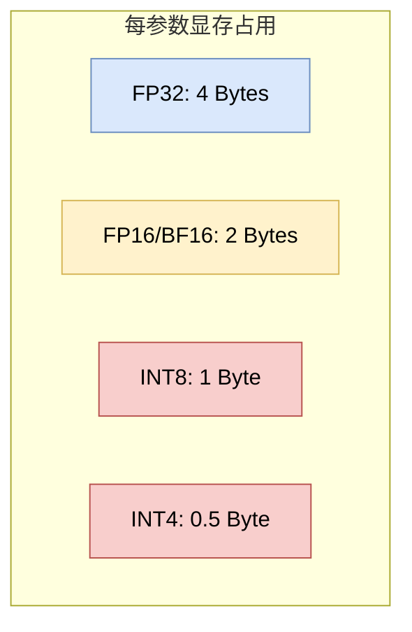

# 5.4 模型量化与优化 (Model Quantization & Optimization)

## 1. 为什么需要量化？(Why Quantization?)

大模型的参数量巨大，导致其部署面临两大瓶颈：
1.  **显存带宽 (Memory Bandwidth)**: 模型生成速度（Tokens/sec）主要受限于从显存读取权重的速度，而非计算速度（Memory-bound）。
2.  **显存容量 (Memory Capacity)**: 运行一个 70B 的模型（FP16）需要 140GB+ 显存，这远超消费级显卡的能力。

**量化 (Quantization)** 通过降低数值精度来减少显存占用和带宽需求。

## 2. 数值精度概览 (Numerical Precision Overview)

*   **FP32 (Full Precision)**: 32-bit，标准的深度学习训练格式。
*   **FP16 / BF16 (Half Precision)**: 16-bit，现代 GPU 训练和推理的主流格式。BF16 拥有与 FP32 相同的指数位范围，训练更稳定。
*   **INT8**: 8-bit 整数。
*   **FP4 / NF4**: 4-bit 浮点数（QLoRA 引入）。

为了建立直觉，下图展示了一个“权重显存 vs 精度”的典型权衡（示意，并非某个特定模型的实测曲线）：

## 3. 常见量化技术 (Common Quantization Techniques)

### 3.1 Post-Training Quantization (PTQ)
训练后量化。直接将训练好的 FP16 模型转换为 INT8/INT4。

**技术本质（最小数学形式）**：最常见的是仿射量化 (Affine Quantization)。对某个权重（或一组权重）$w$，选择缩放 $s$ 与零点 $z$，把浮点映射到整数区间：

Math
$$ q = \text{clip}\big(\text{round}(w/s) + z\big), \quad \hat{w} = s\,(q-z) $$

其中 $q$ 是 INT8/INT4 的离散值，$\hat{w}$ 是反量化后的近似权重。工程上常用 **按通道量化 (Per-channel Quantization)** 来降低误差（不同输出通道用不同的 $s,z$）。

*   **GPTQ**: 一种基于二阶信息（Hessian Matrix）的逐层量化方法，能将模型压缩到 3-bit 或 4-bit 而几乎不损失精度。
*   **AWQ (Activation-aware Weight Quantization)**: 核心发现是——并不是所有权重都同等重要。AWQ 保护那些对应 **较大激活值** 的权重（Salient Weights），对其他权重进行激进量化。

### 3.2 Quantization-Aware Training (QAT)
感知量化训练。在训练过程中模拟量化误差，通常效果优于 PTQ，但训练成本高。

### 3.3 混合量化 (Mixed Quantization)

真实部署中很少所有层都用完全相同精度。更常见的是混合量化：

*   对大部分权重使用 INT4/INT8。
*   对 embedding、lm head、少数敏感层保留 FP16/BF16。
*   对激活异常值或重要通道做单独保护。
*   对 KV Cache 使用不同精度，以降低长上下文推理显存。
*   对 attention、MLP 和输出头采用不同 kernel 与量化格式。

这样做的原因是量化误差并不均匀。某些层和通道对误差特别敏感，如果一刀切压到低比特，可能出现格式错误、长上下文退化、数学/代码能力下降或工具调用 JSON 不稳定。AWQ、GPTQ、SmoothQuant 等方法都可以看作在寻找“哪些部分可以压，哪些部分必须保留”的工程答案。开放模型生态中的 GGUF、AWQ、GPTQ、EXL2 等发布格式，本质上就是不同量化策略和推理 runtime 的组合（见 **[5.8 开放权重模型生态](5.8_open_weight_model_ecosystem.md)**）。

## 4. 高效推理与显存管理 (Efficient Inference & Memory Management)

除了量化，显存管理也是优化的关键。

### 4.1 KV Cache
在 Transformer 推理中，我们需要缓存之前 Token 的 Key 和 Value 向量，以避免重复计算。但这会消耗大量显存。

### 4.2 PagedAttention (vLLM)
传统的 KV Cache 预分配显存会导致严重的内存碎片化和浪费。
受操作系统**虚拟内存 (Virtual Memory)** 分页机制的启发，**vLLM** 提出了 **PagedAttention**：
*   将 KV Cache 分块（Blocks）存储在非连续的物理显存中。
*   通过块表（Block Table）进行逻辑地址到物理地址的映射。

效果：PagedAttention 显著降低了 KV Cache 管理中的内存碎片和预分配浪费，在长序列和多请求服务场景中可以明显提升吞吐量（Throughput）。

## 5. 本章总结 (Chapter Summary)

从指令微调、偏好对齐，到 PEFT、量化和高效推理，我们已经涵盖了现代大模型从“预训练基座”走向可部署系统的主要技术环节。不过，2024 年之后的后训练和推理服务已经变成更大的独立主题：下一节继续讨论 **[5.5 现代后训练](5.5_modern_post_training.md)**，随后补充蒸馏、合成数据与推理速度优化。

这一系列技术不仅提升了模型在下游任务中的可用性，也降低了训练、微调和部署成本，推动了开放权重模型研究与本地化部署实践的发展。
