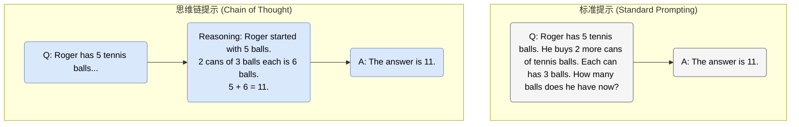
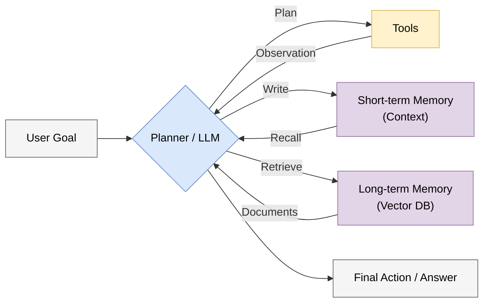
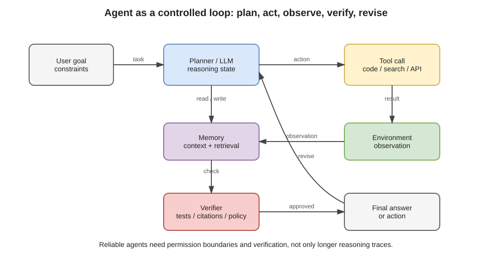

# 6.2 智能体与推理：从被动回答到主动行动 (Agents & Reasoning: From Passive QA to Active Action)

## 1. 语言模型的局限 (The Limitations of LLMs)

虽然 LLM 知识渊博，但裸模型本质上是 **被动** 的、 **静态** 的。
1.  **无法访问外部世界**: 不接工具时，它们不知道现在的准确时间，也不知道今天的天气。
2.  **数学与逻辑缺陷**: 纯粹的“预测下一个词”在处理复杂数学运算时经常出错（3.9 和 3.11 哪个大？）。
3.  **缺乏行动力**: 裸语言模型主要输出 token，本身不能直接操作外部环境；只有在系统层接入工具、浏览器、代码执行器或机器人接口后，模型输出才会转化为可执行动作。

**智能体 (Agent)** 技术旨在赋予 LLM **工具 (Tools)** 和 **推理过程 (Reasoning Process)**。

## 2. 思维链 (Chain of Thought, CoT)

在让模型行动之前，首先要让它能够显式展开中间步骤。
Wei 等人提出的 **思维链 (Chain of Thought, CoT)** 是一项重要发现：在 Prompt 中加入一句 *"Let's think step by step"*，或者提供包含推理步骤的示例，常常能提升模型在多步推理任务上的表现。
需要注意的是，CoT 不是“让模型拥有真正意识”，而是给模型更多中间 token 来分解问题。2024 年之后的推理模型进一步把这件事系统化：通过后训练和测试时计算，让模型在内部生成、评估和修正推理轨迹。

### 2.1 范式对比 (Paradigm Comparison)



<span style="background-color: #FFF2CC; color: black; padding: 2px 4px; border-radius: 4px;">原理</span>：CoT 将一个复杂的 \( P(y|x) \) 问题分解成了多个简单的 \( P(z_t | x, z_{<t}) \) 步骤，实际上是增加了计算深度（Test-time Compute）。

### 2.2 推理模型：把 CoT 变成训练目标

o1/o3、DeepSeek-R1、GPT-5.x 推理类模型、DeepSeek V4 Pro 等推理模型的共同趋势，是把“慢思考”从提示技巧推进为训练和推理机制：
1.  **训练阶段**：通过强化学习、可验证奖励或偏好优化，让模型学会产生更有用的中间推理。
2.  **推理阶段**：为困难问题分配更多 token、采样、搜索或自我检查步骤。
3.  **接口阶段**：完整内部推理轨迹通常不直接暴露；更常见的是输出摘要、最终答案或可审计的步骤说明。

这类模型在数学、代码、科学问答上提升明显，但它们不是万能证明器：事实性、长程规划、现实工具执行和安全边界仍然需要外部验证。

## 3. ReAct: 推理与行动 (Reasoning + Acting)

有了推理能力，我们就可以引入工具使用 (Tool Use)。
**推理-行动 (ReAct, Reasoning + Acting)** 框架让模型在“思考”和“行动”之间循环。

### 3.1 ReAct 循环 (The Loop)
1.  **Thought (思考)**: 我需要做什么？现在缺什么信息？
2.  **Action (行动)**: 调用搜索引擎、计算器或 Python 解释器。
3.  **Observation (观察)**: 获取工具返回的结果。
4.  **Repeat**: 根据观察结果进行下一轮思考，直到解决问题。

```text
Question: What is the elevation range of the area that the eastern sector of the Colorado orogeny extends into?

Thought 1: I need to search for "Colorado orogeny" and find the area its eastern sector extends into.
Action 1: Search["Colorado orogeny"]
Observation 1: The Colorado orogeny was an episode of mountain building... extends into the High Plains.

Thought 2: The eastern sector extends into the High Plains. I need to find the elevation range of the High Plains.
Action 2: Search["High Plains elevation"]
Observation 2: The High Plains has an elevation of 2,500 to 6,000 feet (760 to 1,830 m).

Thought 3: I have the answer.
Answer: 2,500 to 6,000 feet.
```

## 4. 智能体架构 (Agent Architecture)

一个现代 AI Agent 通常包含三个核心组件：
1.  **决策核心 (Controller)**: LLM 或 reasoning model，负责规划与决策。
2.  **记忆 (Memory)**:
    *   短期记忆：上下文窗口。
    *   长期记忆：向量数据库 (Vector DB)。
3.  **工具 (Tools)**: 代码解释器、浏览器、API 接口。





## 5. 工程现实：Agent 是受约束的闭环系统

Agent 技术的难点不在“让模型输出一个计划”，而在于让这个计划能在真实环境里可靠执行。实际系统通常还需要：
*   **权限边界**：哪些工具能调用，哪些操作必须人工确认。
*   **状态管理**：长期任务如何保存进度，失败后如何恢复。
*   **验证器**：代码是否通过测试，检索证据是否支持结论，外部 API 调用是否成功。
*   **成本控制**：推理模型和多轮工具调用会显著增加延迟与费用。

## 6. 总结 (Summary)

Agent 技术正在将 LLM 从纯文本生成器转变为可调用工具的闭环决策模块。更稳妥的判断是：未来的软件开发会越来越多地变成“人提出目标，模型生成计划和代码，人类与自动化测试共同验证结果”。完全无人监督的长期自治系统仍需要非常严格的权限、评估和安全约束。

本节解释的是 Agent 的基本动机与最小架构。关于 2026 年前后更完整的 Agent 运行时、MCP/A2A 协议、上下文工程、多 Agent 编排、权限安全与轨迹评测，见 **[6.5 Agent 系统工程](6.5_agent_system_engineering.md)**。
