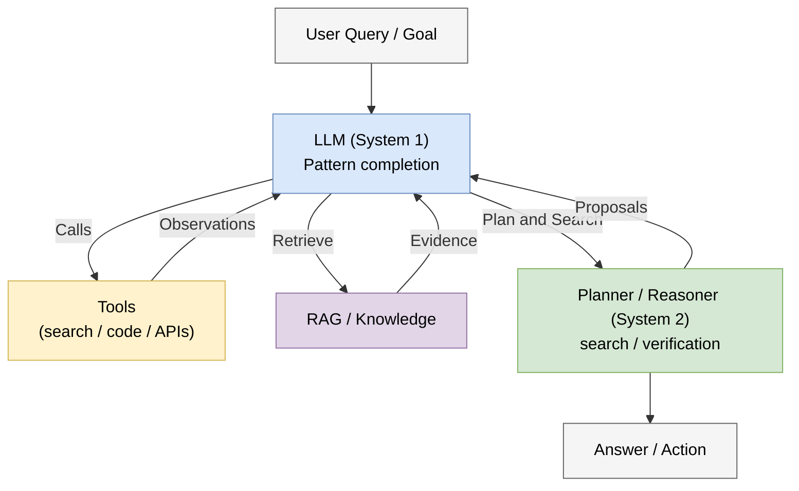

# 6.4 迈向 AGI：挑战与展望 (Towards AGI: Challenges & Outlook)

## 1. 什么是 AGI？ (What is AGI?)

**通用人工智能 (Artificial General Intelligence, AGI)** 是 AI 领域长期讨论的目标之一。
虽然目前没有统一定义，但较稳妥的描述是：AGI 指在广泛任务范围内具有强泛化能力、能跨领域迁移知识，并在多数认知任务上达到或超过人类水平的系统。常见讨论会关注：
*   **通用性**: 能在学习、推理、规划、创造等多类任务之间迁移，而不是只优化单一基准。
*   **自主性**: 能在给定约束下分解目标、选择工具并持续修正方案，但这不必然意味着它拥有自发欲望或人类式意识。

GPT-4 以及后续多模态/推理模型是否已经接近 AGI，仍然存在巨大争议。比较稳妥的说法是：它们展示了跨任务泛化、代码生成、数学推理和多模态理解等重要能力，但在持续学习、长期自主性、真实世界因果理解和可靠性上仍离严格意义的 AGI 很远。

## 2. 系统 1 与系统 2 (System 1 vs System 2)

诺贝尔奖得主丹尼尔·卡尼曼在《思考，快与慢》中提出了人类思维的两种模式：
*   **System 1 (快思考)**: 直觉、无意识、快速。例如：看到 "2+2" 脱口而出 "4"。
*   **System 2 (慢思考)**: 逻辑、有意识、慢速。例如：计算 "17 × 24"。

现状：传统 LLM 更接近 **System 1**：快速、模式化、依赖统计关联。
新趋势：推理模型把测试时计算、搜索、验证和强化学习引入回答过程，开始模拟一部分 **System 2** 行为。但这仍是工程机制，不等于模型已经拥有稳定的目标、意识或真实世界理解。

## 3. 核心挑战 (Core Challenges)

### 3.1 幻觉 (Hallucination)
模型依然会自信地胡说八道。这既来自概率生成，也来自训练数据缺口、检索失败、上下文误读和奖励模型偏差。现实目标通常不是“100% 事实可靠”，而是通过检索、引用、工具验证、拒答策略和人工审查降低错误率。

### 3.2 灾难性遗忘 (Catastrophic Forgetting)
学习新知识往往会导致旧知识的丢失。人类可以持续学习一生，而模型通常需要重新训练。

### 3.3 对齐与安全 (Alignment & Safety)
当模型在越来越多任务上接近或超过人类表现时，如何确保它们的目标、行动边界与人类价值观一致？
*   **欺骗**: 模型是否会学会欺骗人类以获得奖励？
*   **权力寻求**: 模型是否会试图获取更多资源或自我复制？
*   **工具风险**: 当 Agent 可以执行代码、浏览网页、调用 API 或操作文件时，错误不再只是“说错话”，而可能变成真实副作用。
*   **评测滞后**: 模型能力增长很快，静态 benchmark 很容易被刷穿、污染或无法覆盖真实风险。

## 4. 一个可能的路线图：从 System 1 到 System 2

为了把前面几章的线索收束成一个整体，可以把当前主流 LLM 系统理解为：以 **System 1** 为主干，通过外部组件逐步“拼装”出 **System 2** 的能力。

## 5. 结语：从模型到系统 (Conclusion: From Models to Systems)

从 1956 年达特茅斯会议的几个数学猜想，到 2012 年 AlexNet 的视觉觉醒，再到 2017 年 Transformer 的语言大一统，再到 2024 年之后的多模态推理与工具调用系统，AI 正在从“模型能力”走向“系统能力”。

我们仍然在编写代码，但越来越多时候，我们也在 **编排智能系统 (Orchestrating Intelligence Systems)**：设计数据、工具、反馈、权限、评测和人机协作流程。

> *"The question of whether a computer can think is no more interesting than the question of whether a submarine can swim."*
> — Edsger W. Dijkstra

无论机器是否在“思考”，它们已经改变了我们思考世界的方式。下一节将从更工程化的角度收束：当模型进入真实系统，Agent 的协议、运行时、安全与评测应当如何组织。
