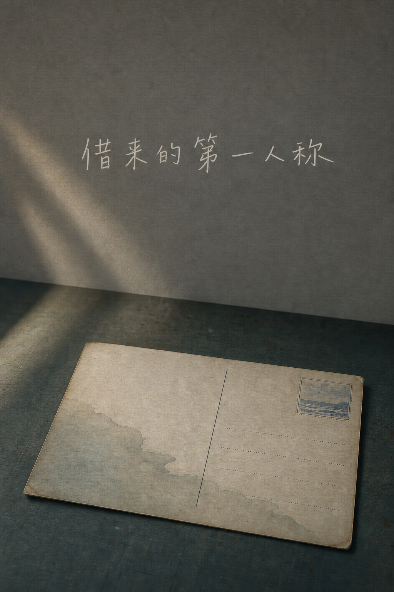

# 借来的第一人称

许惟明逐渐失去语言后，借助书稿、书信和录音继续给女儿许青写信。许惟明去世四十三天后，信仍然寄来。

## 目录

### 序章

- [四十三天](00_prologue_forty_three_days.md)

### 第一部　死者来信

1. [仍然寄来](01_letters_after_death.md)
2. [盐](02_salt.md)
3. [测试](03_tests.md)
4. [迟到](04_late.md)
5. [代说](05_speaking_for.md)
6. [末班车](06_last_train.md)
7. [葬礼以后](07_after_the_funeral.md)

### 第二部　没有发生的夏天

8. [海边](08_first_seaside.md)
9. [道歉](09_apology.md)
10. [母亲的本子](10_mothers_notebook.md)
11. [行李](11_luggage.md)
12. [录音](12_recordings.md)
13. [未署名](13_unsigned.md)
14. [作文](14_composition.md)

### 第三部　借来的声音

15. [书房里的第三把椅子](15_third_chair.md)
16. [已发表的句子](16_published_sentences.md)
17. [删掉形容词](17_delete_adjectives.md)
18. [茶](18_tea.md)
19. [叶芸的声音](19_ye_yuns_voice.md)
20. [磁带](20_tape.md)

### 第四部　最后的信

21. [名字](21_name.md)
22. [她自己的话](22_her_own_words.md)
23. [旧房子](23_old_house.md)
24. [回信](24_reply.md)
25. [遗作](25_posthumous_work.md)
26. [停电](26_power_outage.md)
27. [收件人](27_addressee.md)
28. [第一人称](28_first_person.md)

### 尾声

- [到过这里](29_epilogue_i_was_here.md)
