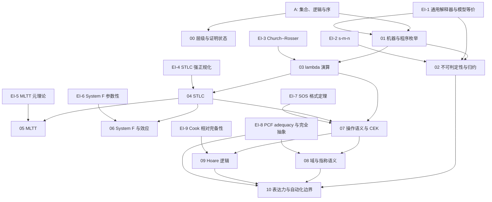

# 依赖图

本图记录正文证明链。箭头 $A\to B$ 表示 $B$ 使用 $A$ 的对象、定理或精确外部输入；章节包含某个 EI 的边界说明，不等于该章全部内部定理都依赖它。

## 章节依赖

| 章节 | 直接依赖 | 本章输出 |
| --- | --- | --- |
| 00 | A | 语法、计算、语义三个层级和证明状态 |
| 01 | A，EI-1 | 计数器机、程序编码、一步解释、通用性边界 |
| 02 | 01，EI-1，EI-2 | 停机不可判定性、many-one 归约、Rice 定理 |
| 03 | 01，EI-3 | 捕获避免替换、beta 归约、正规形唯一性 |
| 04 | 03，EI-4 | STLC 替换、preservation、progress、类型安全、正规化边界 |
| 05 | 04，EI-5 | 固定 MLTT 核心、结构定理、Curry--Howard 翻译 |
| 06 | 04，EI-6 | System F preservation、递归类型接口、Kleisli 效应 |
| 07 | 03，04，EI-7 | 大小步等价、唯一分解、CEK 双向对应 |
| 08 | 07，附录 B，EI-8 | 最小不动点、while 指称、操作/指称双向一致 |
| 09 | 07，EI-9 | Hoare soundness、WLP、相对完备性边界 |
| 10 | 02，04，08，09，EI-8 | 可靠性分离、完全抽象口径、Rice 自动化边界 |

## 主证明链

1. `定义 1.6 + 命题 1.8 -> T2.1`：有效程序枚举和程序复合使对角构造仍是同一模型中的程序。
2. `T2.1 + EI-1 + EI-2 -> T2.3`：模拟提供条件执行，s-m-n 把输入有效固化为程序编号。
3. `T3.1 -> T4.2 -> T4.3`：捕获避免替换先良定义，再支撑 STLC 的替换与 preservation。
4. `T4.3 + T4.4 -> T4.5`：preservation 与 progress 合成多步类型安全；EI-4 只额外给出终止性。
5. `T7.1 -> T8.3`：第 8 章固定同一大步语义，并用有限不动点近似证明双向指称对应。
6. `T2.3 -> T10.2`：定义 10.6 的有效编号翻译把语言判定器拉回计数器机编号。

EI-6、EI-7、EI-8、EI-9 均是边界或专门接口；它们不承担正文已经给出的 System F preservation、CEK 正确性、while 指称一致性或 Hoare soundness 证明。
