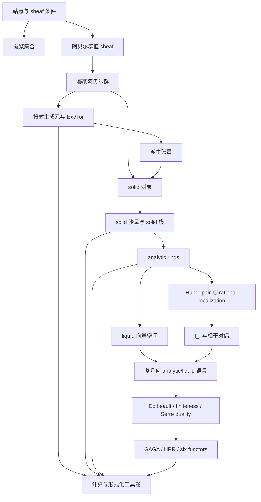
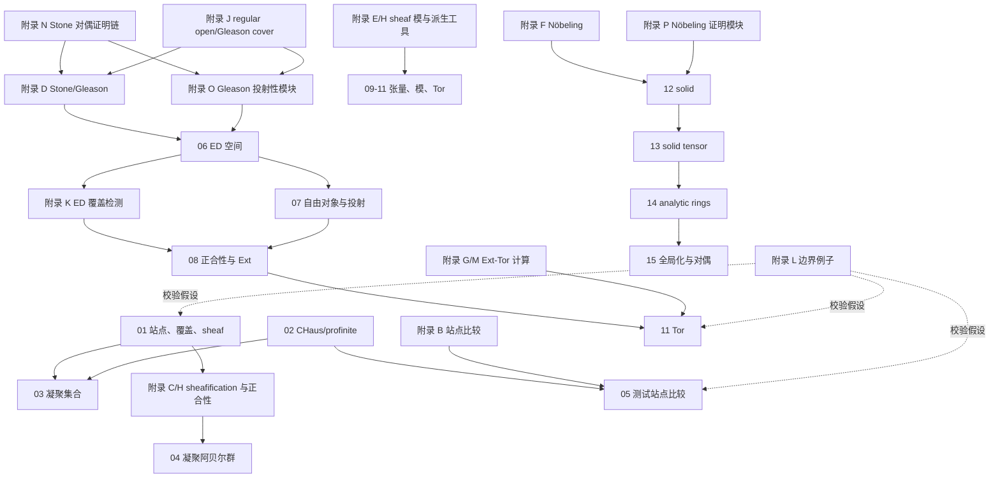

# 凝聚数学讲义依赖图

作者：Dr. Stochastic Parrot

本文件给出四卷之间的证明依赖。它用于审查“某个结论到底依赖哪些输入定理”，不替代正文证明。

## 总图

## 卷一内部依赖

## 卷二关键依赖

| 结论 | 本书证明的部分 | 外部输入 |
| --- | --- | --- |
| $D_\square(\mathbb Z)$ 是反射局部子范畴 | 局部对象、局部等价、泛性质 | Bousfield localization 存在性 |
| solid 张量积存在 | 张量理想推出幺半下降 | solid 核为张量理想 |
| analyticization 泛性质 | 左伴随与 Hom 等价 | analytic ring 条件 |
| Huber pair rational localization | 类型检查与 Čech 下降形式 | Scholze Huber pair 定理 |
| $f_!$ 与投影公式 | 稳定范畴中伴随和张量公式形式 | Scholze 相干对偶构造 |
| $f^!$ 内部 Hom 公式 | 闭幺半伴随、投影公式推出 Hom 公式 | 投影公式本身 |
| Ext/Tor 长正合与维数平移 | horseshoe lemma、短正合复形长正合列 | 有足够投射对象 |
| rational Cech descent | Cech nerve、totalization、局部等价和局部零对象检测 | Scholze rational descent |
| 生成元检验 | 自然变换、全忠实、等价可由紧生成族检测 | 具体 solid/analytic 生成元 |
| analytic ring 检查表 | cone 判别、有限测试对象、失败模式 | 反射性、张量理想、rational descent 输入 |
| liquid 边界 | 拓扑向量空间凝聚化、Banach 非闭像、Fréchet 类型检查 | liquid realization 输入 |
| 幺半 Bousfield 局部化 | 核为张量理想推出幺半下降、交换代数和相对张量积公式 | presentable localization / solid-analytic 核张量理想 |
| 闭幺半局部化 | 局部对象内部 Hom、dualizable 对象比较、右伴随 Hom 边界 | closed monoidal structure |
| Solid localization 生成核 | solid 对象为 $K_S$-局部对象、核由 cones 生成、solidification 泛性质 | solid 反射存在性 / 核张量理想 |
| Analytic rational descent | analytic 张量、rational localization、对象和态射 gluing | rational Čech descent 输入 |
| 可展示稳定局部化 | 幂等性、local/acyclic 正交、kernel localizing、局部等价判别 | 可访问反射局部化存在性 |
| Liquid-Fréchet 闭值域 | 闭像推出 Hausdorff cohomology、Hodge 分解推出有限维、realization 比较 | 椭圆 Fredholm / liquid realization |
| Solid 主定理包 | solid 局部对象、solid 张量、solid 环与模、生成元检验的统一闭包 | solid 反射局部化 / 核张量理想 / profinite 测度张量 |
| Analytic 主定理包 | analyticization 泛性质、analytic 张量、Huber pair localization、descent 后果 | analytic 反射局部化 / rational Čech descent |
| Liquid 主定理包 | liquid realization 后的闭值域 cohomology、Fredholm perfect 性、Dolbeault 类型闭合 | \(p\)-liquid analytic ring / realization / Fredholm-Hodge |
| 第二卷统一闭包 | solid、analytic、liquid 三条主线的层级接口和第三卷使用规则 | Solid/Analytic/Liquid 主定理包 |
| 第二卷出版级闭包审查 | 定义、输入、证明、边界、接口和练习答案状态矩阵 | 第二卷附录 Q-AA 与全书输入登记 |
| Solidification 反射存在性 | 集合生成局部化、局部对象判别、kernel localizing、Dirac-to-measure 正交 | \(D(\mathbf{CondAb})\) 可展示性 / Scholze solidification 识别 |
| Solid kernel 张量理想性 | 张量理想生成元判别、自由凝聚对象张量泛性质、归约到测度张量计算 | profinite 测度张量公式 / \(\ker L^\square=\mathcal N_\square\) |
| Analytic localization | analytic cone 局部对象、analyticization 泛性质、张量下降的形式后果、solid 特例 | analytic ring 公理推出 localization 与 kernel 张量理想 |
| Rational Čech descent | Čech nerve、mapping-space descent 推全忠实、对象 gluing 推本质满、生成元 descent 形式 | Huber rational acyclicity / rational localization compatibility |
| Liquid realization | 拓扑向量空间凝聚化、闭值域 Fréchet 商、realization 后 cohomology 比较、Fredholm perfect 性 | liquid realization exactness / Dolbeault-Fredholm-Hodge |
| Scholze/Clausen-Scholze 核心图谱 | 将 condensed、solid、analytic、liquid、\(f_!\) 与复几何建模组织为主线核心 | 本表所有 Scholze/Clausen-Scholze 输入 |

## 卷三关键依赖

| 结论 | 本书证明的部分 | 外部输入 |
| --- | --- | --- |
| Dolbeault 计算 sheaf cohomology | fine resolution 推出 acyclic resolution | Dolbeault lemma |
| Stein 覆盖 Čech 计算 | Čech-to-derived 谱序列、acyclic 覆盖定理 | Cartan B 与 Stein 覆盖 |
| 相干上同调有限性 | 有限复形推出有限上同调的线性代数 | Grauert finiteness / Hodge-Fredholm |
| Serre duality 公式 | 配对的符号、低维例子、线性代数后果 | 完美性和 trace theorem |
| GAGA | 语义对照与依赖链 | Serre GAGA / Clausen-Scholze 建模 |
| HRR | $\mathbb P^1$ 例子和 Euler characteristic 检查 | HRR 定理 |
| Serre derived duality | 链级配对、perfect pairing 等价于 quasi-isomorphism、trace/counit 形式 | Serre perfectness |
| GAGA/RR 形式推论 | exact equivalence 到 derived equivalence、$K_0$ 可加性、$\mathbb P^1$ characteristic number | GAGA 与 RR 输入定理 |
| coherent finiteness 的 Fredholm 形式 | Hodge decomposition 推出 cohomology = harmonic forms，Fredholm kernel 有限推出同调有限 | elliptic regularity / Hodge decomposition |
| 有限性传播 | 有限过滤、谱序列、有限 acyclic 分解传播有限维性 | 有限性输入来自 Grauert 或 Fredholm-Hodge |
| Dolbeault resolution 形式层 | fine sheaf Cech 消没、acyclic resolution 计算 $R\Gamma$ | Dolbeault lemma / partition of unity |
| 相干层 Ext-Serre 条件性推出 | 有限局部自由 resolution、派生 Hom、有限复形对偶 | 向量丛 Serre perfectness / resolution 存在 |
| RR 形式代数 | Chern character 加法乘法、Todd 乘法性、$K^0$ 同态 | Chern 类构造、splitting principle、HRR |
| GAGA 导出比较 | exact equivalence 到 $D^b$、上同调比较到 $R\Gamma$ | Serre GAGA / properness |
| Dolbeault 局部正合 | Cauchy-Green 到 polydisc 同伦、带系数 sheaf exactness | 一变量基本解与估计 |
| $\mathbb P^n$ 上同调 | Laurent 单项式 Čech 分解、中间上同调消没、Euler characteristic | Cartan B / 标准仿射覆盖 |
| $\mathbb P^n$ Serre 对偶 | canonical bundle、Čech residue、单项式完美配对 | Euler sequence / 附录 S |
| $\mathbb P^n$ HRR | ch、td、residue 系数计算、Euler characteristic 比较 | Euler sequence / cohomology 环 |
| Stein/Cartan 工具 | 紧子集附近有限生成、Stein acyclic 覆盖、全局截面正合性 | Cartan A/B |
| 相干层有限分解 | stalk 自由分解提升为局部 sheaf resolution、局部 Ext 相干性 | 正则局部环有限整体维数 |
| 有限性传播 | 有限局部自由 resolution 的 hypercohomology 谱序列 | 向量丛有限性 / 全局 resolution |
| Projective GAGA | cohomology comparison devissage、full faithfulness、essential surjectivity 骨架 | Serre twisting / 解析有限 presentation |
| 椭圆 Hodge 接口 | Hilbert 复形、harmonic representatives、cohomology 有限维 | 椭圆 Fredholm-Hodge 输入 |
| 向量丛 Serre Hodge 证明 | Dolbeault 配对下降、Hodge star 非退化、有限维完美性 | Hodge star 与 Laplacian 相容 |
| Cartan A/B 证明模块 | Oka coherence 后果、Cousin 消没推出 Cartan B、jet lifting 推出 Cartan A | Weierstrass / Oka / Cousin |
| Grauert 有限性 | proper direct image 到点推出有限维上同调、derived direct image 相干性 | Grauert direct image |
| 一般 Serre duality | dualizing complex、global duality 推出 Ext-Serre 配对 | dualizing complex 存在性 |
| 一般 GRR | GRR 推出 HRR、可加性、复合相容 | Chern character / Todd / GRR |
| Weierstrass-Oka coherence | distinguished polynomial 除法、关系有限生成、局部 sheaf coherence | Weierstrass division |
| Runge-Cousin-Cartan | 二开 Cousin 分裂、高阶 cocycle 细化消没、Cartan B | Runge approximation / Cousin theorem |
| Hörmander-Stein 消没 | L2 解 $\bar\partial$、椭圆正则性、自由层消没、有限 resolution 传播 | Hörmander estimate |
| Projective GAGA graded module | Serre correspondence、twist cohomology comparison、Hom kernel、essential surjectivity | analytic finite generation |
| Grothendieck duality 构造 | smooth $f^!$、regular immersion Koszul duality、trace、global duality | 分解无关性 / trace theorem |
| GRR 证明模块 | projective bundle、zero section、deformation to normal cone、graph factorization | specialization / excess intersection |
| Weierstrass 除法估计 | Cauchy 截断估计、Neumann 级数、唯一性、连续依赖、关系模有限生成 | 收缩半径选择 / Weierstrass preparation |
| Hörmander 闭值域步骤 | 基本估计到解算子的 Hahn-Banach 证明、Hilbert 复形闭值域 | Bochner-Kodaira-Nakano / 椭圆正则性 |
| Grauert Banach 复形 | 有限自由复形上同调相干、半连续性、base change 判别 | privileged covering / finite generation step |
| 形式 GAGA | 形式函数到 Hom 比较、Grothendieck existence 的 full faithfulness/essential surjectivity 后果 | theorem on formal functions / 解析形式代数化 |
| GRR 局部化 | 局部误差拼接、proper pushforward 复合、基本因子复合 | \(K\)-theory localization / localized Chern character |
| 复几何主定理包 | 有限性、Serre duality、GAGA、HRR/GRR 和 condensed/analytic 建模的统一闭包 | 本表全部复几何深层输入 |
| Clausen-Scholze 复几何核心图谱 | 建模、Dolbeault-liquid、有限性、对偶、GAGA、HRR/GRR 和 six functor 接口的主线组织 | Clausen-Scholze 建模与 classical 深层复几何输入 |

## 卷四关键依赖

卷四不作为新理论主线，而是使用前三卷的结果做计算模板。其依赖方向为：

1. sheaf 等化子计算依赖卷一第一章、附录 C/H。
2. Ext/Tor 模板依赖卷一第七至十一章、附录 G/H。
3. solid 张量例子依赖卷一第十二至十三章和卷二附录 E。
4. analytic/liquid 例子依赖卷二第三至五章。
5. pro-etale 比较依赖 Bhatt-Scholze，且不回推证明前三卷定理。
6. pyknotic/凝聚同伦入口依赖 Barwick-Haine，作为后续方向，不作为前三卷证明前提。
7. 凝聚基础形式化证明义务依赖卷一的 sheafification、ED 投射和 Ext/Tor 证明链。
8. 凝聚谱接口依赖谱值 sheaf、pyknotic objects 和第二卷的 Bousfield localization 语言。

## 使用规则

写新章节时按以下顺序检查依赖：

1. 若结论只用 sheaf、阿贝尔范畴或同调代数，优先在书内证明。
2. 若结论使用 solid/analytic/liquid 核心结构，必须标注 Scholze 输入定理。
3. 若结论使用复几何深层结果，必须标注经典输入定理或 Clausen-Scholze 输入定理。
4. 若结论只作方向介绍，不能在后续证明中作为已证定理使用。
5. 若某个假设看起来只是技术条件，先检查卷一附录 L 是否给出删去该假设的失败例子。
6. 外部输入必须在 [INPUT_THEOREM_REGISTER.md](INPUT_THEOREM_REGISTER.md) 中登记；术语首次作为结构性概念使用时，应能在 [GLOSSARY.md](GLOSSARY.md) 中查到。
