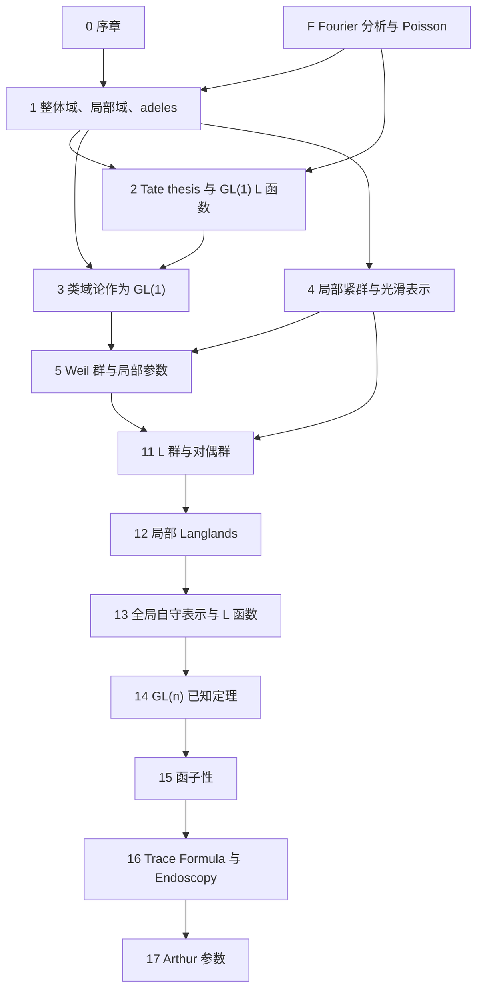
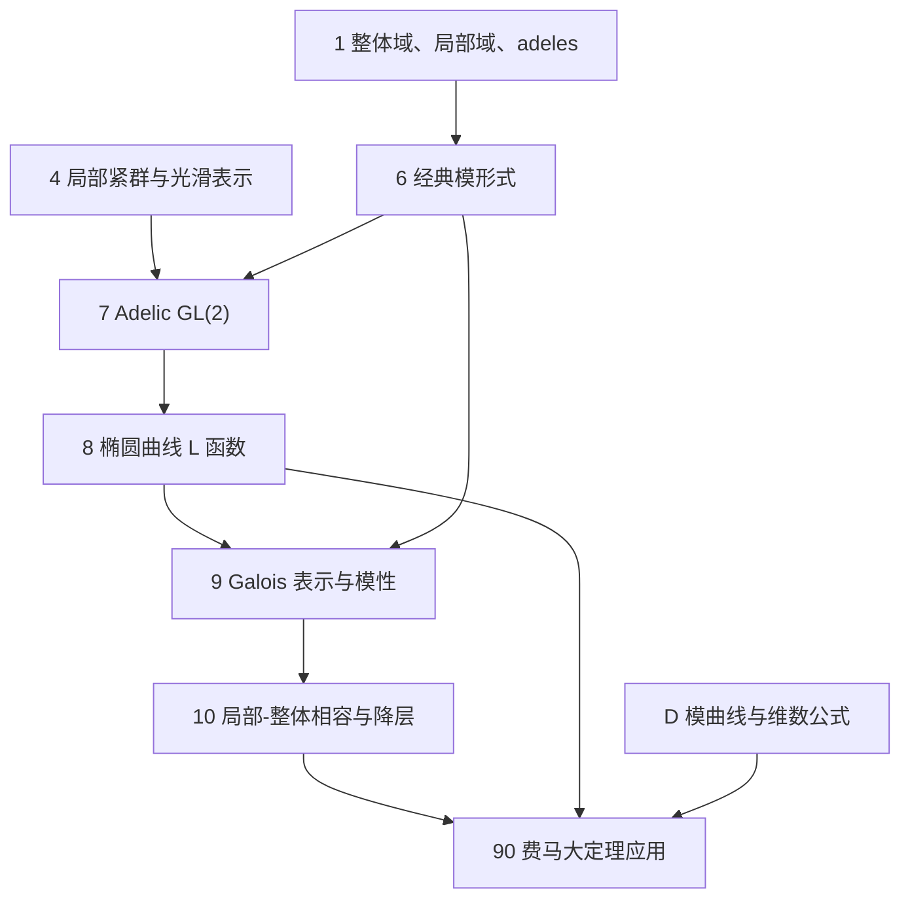
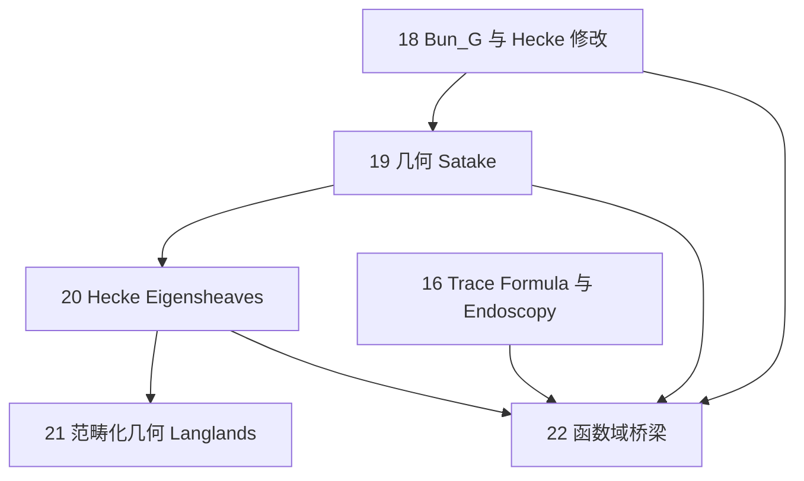

# 全书依赖图

本文档给出章节之间的阅读依赖和证明依赖。箭头 $A\to B$ 表示阅读或使用 $B$ 时应已掌握 $A$ 中的定义、约定或定理。

## 总体结构

## 附录依赖

| 附录 | 支撑章节 | 作用 |
|---|---|---|
| A 代数数论复习 | 1、3、5、8、9、10、14 | Frobenius、惯性、导子、类域论和 Chebotarev 接口 |
| B 局部紧群与 Haar 测度 | 1、2、4、7、13、16 | Haar 测度、restricted product 测度、卷积 |
| C 光滑可容许表示 | 4、5、7、12、13、14、17 | Hecke 作用、抛物诱导、Jacquet module、tempered 术语 |
| D 模曲线和维数公式 | 6、9、10、90 | $S_2(\Gamma_0(2))=0$ 和 newform 理论接口 |
| E 外部输入定理索引 | 全书 | 外部输入可追溯性 |
| F Fourier 分析和 Poisson 求和 | 1、2、3、13 | Pontryagin 对偶、adeles 自对偶、Poisson summation 和 Tate thesis 分析骨架 |
| G 根资料和对偶群计算 | 11、12、13、15、17 | `GL(n)`、`SL(n)`、`PGL(n)`、classical dual groups、L 群和 L 同态样本 |
| H Hecke 双陪集和 adelic 比较 | 6、7、9、10 | 经典 Hecke 算子、Fourier 系数、Petersson 内积和球 Hecke 代数比较 |
| I Godement-Jacquet 和 Rankin-Selberg 积分 | 7、13、14、15 | `GL(n)` 标准 L 函数、Rankin-Selberg L 函数、converse theorem 和函子性检测 |

## 阅读路径

### 路径一：`GL(1)` 到类域论

1. 第一章建立 $K_v$、$\mathbb A_K$、$\mathbb A_K^\times$ 和 $C_K$。
2. 附录 F 固定 Fourier 变换、adeles 自对偶和 Poisson summation 的分析接口。
3. 第二章建立 Hecke 特征、Tate zeta 积分和 `GL(1)` L 函数。
4. 第三章把局部与全局 reciprocity map 解释为 `GL(1)` Langlands。
5. 第五章的 `GL(1)` 局部 Langlands 是第三章的局部版本重述。

该路径的外部输入集中在类域论和 Tate thesis；正文证明的是它们如何转译为 Langlands 语言。

### 路径二：费马大定理应用

1. 第六章给出经典模形式、Hecke 算子和 newform 的语言。
2. 附录 H 给出 Hecke 双陪集、Fourier 系数和 adelic Hecke 比较。
3. 第七章把经典 newform 转为 adelic `GL(2)` 自守表示。
4. 第八章建立椭圆曲线 L 函数和 Tate module。
5. 第九章陈述椭圆曲线模性与模性提升接口。
6. 第十章陈述局部-整体相容和 Ribet 降层。
7. 附录 D 给出 $S_2(\Gamma_0(2))=0$。
8. 第九十章只把上述输入拼接成费马大定理的严格逻辑链。

该路径不证明 Taylor-Wiles patching，也不把 Ribet 降层化约为初等论证；这两者在本书中均明确作为外部输入。

### 路径三：一般数论 Langlands

1. 第四章和附录 C 建立局部群表示与 Hecke 代数。
2. 第五章建立 Weil、Weil-Deligne 和局部参数。
3. 第十一章给出还原群、root datum、对偶群和 L 群；附录 G 给出矩阵群计算表。
4. 第十二章把局部 Langlands 写成 packet 和增强参数语言。
5. 第十三章定义全局自守表示和标准 L 函数。
6. 附录 I 说明 `GL(n)` 标准和 Rankin-Selberg L 函数的积分表示来源。
7. 第十四章整理 `GL(n)` 的已知局部、全局和 L 函数定理。
8. 第十五章把函子性写成 L 群同态诱导的转移。
9. 第十六、十七章给出 trace formula、endoscopy 和 Arthur 参数接口。

该路径的判断原则是：`GL(n)` 多处为定理，一般还原群多处为猜想或依赖 Arthur-Mok 型分类。

### 路径四：几何 Langlands

1. 第十八章建立 $\operatorname{Bun}_G$、Hecke stack 和 affine Grassmannian。
2. 第十九章用几何 Satake 把 $\operatorname{Rep}(\widehat G)$ 接到 Hecke 函子。
3. 第二十章定义 Hecke eigensheaf。
4. 第二十一章给出范畴化几何 Langlands 的谱侧和自动侧。
5. 第二十二章解释有限域上的 sheaf-function dictionary、shtukas 和数论 Langlands 的函数域桥梁。

该路径的外部输入集中在代数栈、perverse sheaves、D-modules、几何 Satake 和 categorical geometric Langlands。

## 证明依赖层级

### 基础层

- 代数数论：附录 A、第一章。
- Fourier 分析：附录 F、第一至二章。
- Haar 测度和 locally profinite groups：附录 B、第四章。
- 光滑表示：附录 C、第四章。

基础层的结果可以在正文中反复使用；若某证明调用 Haar 测度存在唯一性、类域论或 Chebotarev，应标明为外部输入。

### 结构层

- `GL(1)` 结构：第二、三、五章。
- `GL(2)` 结构：第六至十章。
- L 群结构：第十一、十二章。
- 根资料计算：附录 G、第十一至十二章。
- Hecke 双陪集计算：附录 H、第六至七章。
- 积分表示：附录 I、第十三至十五章。

结构层负责把对象定义成可比较的形式：Galois/Weil 参数、自守表示、Hecke eigenvalues 和 L 因子。

### 对应层

- `GL(1)` 对应：第三、五章。
- `GL(n)` 对应：第十二、十四章。
- 一般还原群局部对应：第十二章的 packet 猜想。
- 全局对应与函子性：第十三至十五章。
- 几何对应：第十九至二十一章。

对应层中必须区分定理、外部输入和猜想。全书任何应用不得把猜想当作已经证明的定理。

### 应用层

- 费马大定理应用：第九十章。
- 函数域桥梁：第二十二章。
- Endoscopy 和 Arthur 分类：第十六、十七章。

应用层的证明形式应是“输入定理 + 本书已证明引理 + 逻辑推出”，而不是重写外部输入的完整证明。

## 最短交叉引用表

| 目标问题 | 必读章节 | 可推迟章节 |
|---|---|---|
| 看懂 `GL(1)` Langlands | 1、2、3、5、A、B | 6 以后 |
| 看懂费马大定理应用链 | 6、8、9、10、90、D | 11 以后 |
| 看懂 `GL(n)` 已知定理边界 | 4、5、11、12、13、14、A、B、C | 16、17 |
| 看懂函子性 | 11、12、13、14、15 | 18 以后 |
| 看懂 endoscopy 与 Arthur 参数接口 | 11、12、13、15、16、17 | 几何部分 |
| 看懂几何 Langlands 入口 | 18、19、20、21、22 | 8、9、10 |

## 归一化依赖

全书有三处归一化最容易造成公式差异。

1. 局部类域论和局部 Langlands 默认几何 Frobenius。
2. 模形式和椭圆曲线的 $\ell$-adic 表示章节常用算术 Frobenius。
3. 自守 L 函数既有 classical normalization，也有 unitary automorphic normalization。

凡跨越第五、七、九、十二、十四章比较参数或 L 因子时，必须检查是否出现 Frobenius 取逆或 Tate twist。
