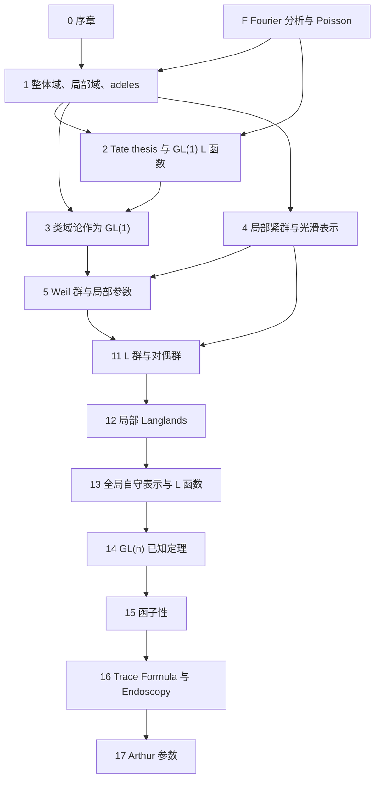
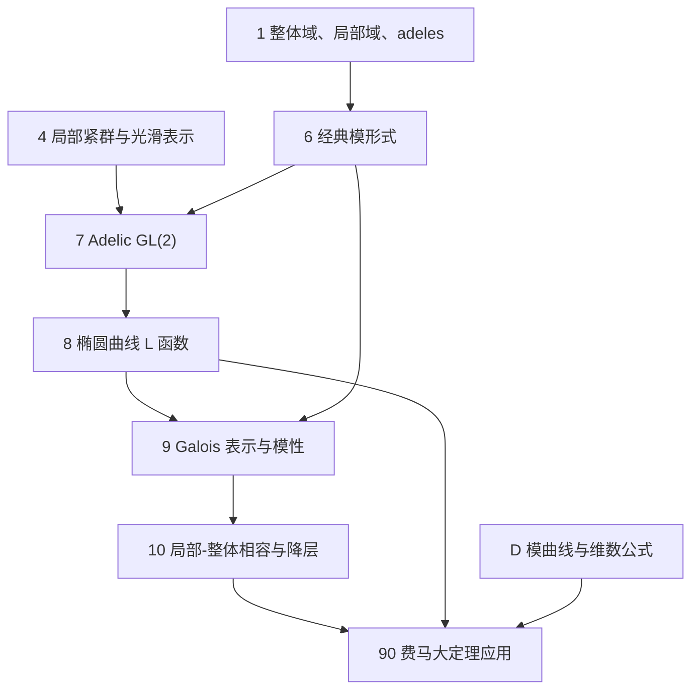
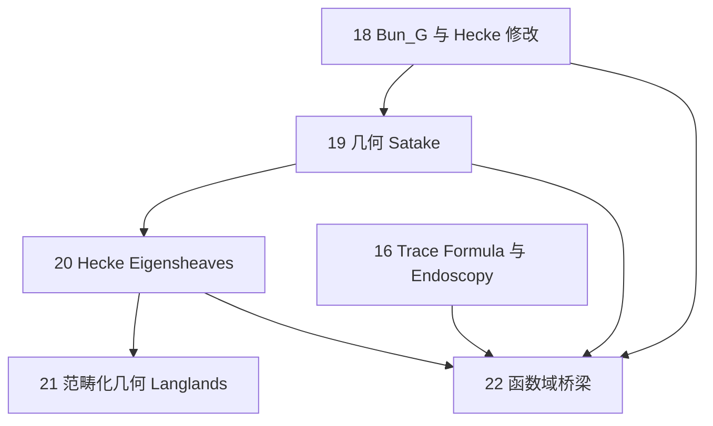

# 全书依赖图

本文档给出章节之间的阅读依赖和证明依赖。箭头 $A\to B$ 表示阅读或使用 $B$ 时应已掌握 $A$ 中的定义、约定或定理。

## 总体结构

## 附录依赖

| 附录 | 支撑章节 | 作用 |
|---|---|---|
| A 代数数论复习 | 1、3、5、8、9、10、14 | 素理想分解、Frobenius、分解群、惯性群、高阶分歧群、导子、类域论和 Chebotarev 接口 |
| B 局部紧群与 Haar 测度 | 1、2、4、7、13、16 | Haar 测度、restricted product 测度、卷积 |
| C 光滑可容许表示 | 4、5、7、12、13、14、17 | Hecke 作用、抛物诱导、Jacquet module、tempered 术语 |
| D 模曲线和维数公式 | 6、9、10、90 | $S_2(\Gamma_0(2))=0$ 和 newform 理论接口 |
| E 外部输入定理索引 | 全书 | 外部输入可追溯性 |
| F Fourier 分析和 Poisson 求和 | 1、2、3、13 | Pontryagin 对偶、紧开陪集 Fourier 计算、$\mathbb A_\mathbb Q/\mathbb Q$ 基本域、adeles 自对偶、Poisson summation 和 Tate theta 骨架 |
| G 根资料和对偶群计算 | 11、12、13、15、17 | `GL(n)`、`SL(n)`、`PGL(n)`、classical dual groups、L 群和 L 同态样本 |
| H Hecke 双陪集和 adelic 比较 | 6、7、9、10 | 经典 Hecke 算子、Fourier 系数、Petersson 内积和球 Hecke 代数比较 |
| I Godement-Jacquet 和 Rankin-Selberg 积分 | 7、13、14、15 | `GL(n)` 标准 L 函数、Rankin-Selberg L 函数、converse theorem 和函子性检测 |
| J Newforms 和局部 newvectors | 6、7、8、9、10、90 | old/new 分解、Atkin-Lehner、导子、newvector 和费马级数矛盾 |
| K Galois deformation 和 Taylor-Wiles | 9、10、90 | 变形环、Selmer 群、Hecke algebra、$R=T$ 和模性提升 |
| L Eisenstein series 和残余谱 | 13、16、17 | 常数项、intertwining operators、连续谱、残余谱和 Arthur 参数 |
| M Langlands-Shahidi 局部因子 | 13、15、16、L | local coefficient、$\gamma$ 因子、adjoint action L 函数和函数方程 |
| N 局部 packets、endoscopy 和内形式 | 12、15、16、17 | component groups、tori、$\operatorname{SL}_2$ packets、Jacquet-Langlands 和稳定字符 |
| O D-modules、IndCoh 和奇异支撑 | 18、19、20、21 | D-module 六运算、kernel formalism、谱侧 IndCoh 和 nilpotent singular support |
| P 球 Hecke 代数和 Satake 同构 | 4、5、7、11、12、13、19 | Cartan 分解、Satake 变换、spherical representations 和非分歧 L 因子 |
| Q Bernstein-Zelevinsky 和 Langlands 分类 | 12、13、14、15 | segments、multisegments、standard modules、Langlands quotient 和 `GL(n)` 局部因子 |
| R Trace formula 项和稳定化 | 15、16、17、N | Arthur truncation、weighted orbital integrals、谱展开、invariant trace formula 和稳定化 |
| S 函数域 shtukas 和 Lafforgue | 14、18、20、22 | 函数域 `GL(n)`、shtuka cohomology、excursion operators 和 sheaf-function 桥梁 |
| T 模曲线上同调和 Deligne 表示 | 6、7、8、9、10、90 | Eichler-Shimura、Hecke correspondences、Deligne $\ell$-adic 表示和 residual representations |
| U p-adic Hodge 和 Shimura varieties | 9、10、14、90 | regular algebraic Galois 表示、Shimura cohomology、p-adic Hodge 条件和 automorphy lifting |
| V Class formations 和 Artin reciprocity | 1、2、3、5、A | 局部/全局类域论、norm subgroup、ray class fields、conductor 和 `GL(1)` Langlands |
| W 模曲线和 Atkin-Lehner-Li | 6、7、9、10、90、D、J | 模曲线代数化、权二微分、Hecke correspondences、old/new 分解和费马级 $2$ 矛盾 |
| X Arthur 分类和 classical groups | 15、16、17、N、R | Arthur parameters、multiplicity formula、standard transfer、inner forms 和 Mok unitary groups |
| Y Factorization 和 BD Grassmannian | 18、19、20、21、O | Ran space、BD Grassmannian、fusion、几何 Satake 和 Hecke action |
| Z 局部调和分析和 Plancherel | 4、12、16、17 | Harish-Chandra characters、tempered dual、Plancherel、Bernstein center 和 Paley-Wiener |
| AA Bruhat-Tits 和 hyperspecial | 4、11、12、13、P | buildings、parahoric、hyperspecial、Cartan/Iwahori 分解和 Moy-Prasad filtrations |
| AB Derived stacks 和 IndCoh | 18、20、21、O、Y | cotangent complex、QCoh/IndCoh、singular support、six functors、kernel formalism 和 renormalization |
| AC Fargues-Fontaine 和局部几何 Langlands | 12、20、21、22、AA | diamonds、Fargues-Fontaine curve、$G$-bundles、local Shimura varieties 和 Fargues-Scholze |
| AD 椭圆曲线约化和导子 | 8、10、90 | Neron model、Kodaira symbols、Tate algorithm、Ogg conductor formula、Tate curve 和 Frey 曲线局部导子 |
| AE `GL(2)` 局部 LLC 例子 | 5、12、14、AD | principal series、Steinberg、supercuspidal、Weil-Deligne 参数和局部 L 因子 |

## 阅读路径

四条阅读路径的最短证明链见 [MAINLINE_PROOF_CHAINS.md](MAINLINE_PROOF_CHAINS.md)，习题覆盖见 [EXERCISE_COVERAGE.md](EXERCISE_COVERAGE.md)。

### 路径一：`GL(1)` 到类域论

1. 第一章建立 $K_v$、$\mathbb A_K$、$\mathbb A_K^\times$ 和 $C_K$。
2. 附录 F 固定 Fourier 变换、紧开陪集计算、adeles 自对偶、Poisson summation 和 Tate theta 恒等式的分析接口。
3. 第二章建立 Hecke 特征、Tate zeta 积分和 `GL(1)` L 函数。
4. 附录 V 给出 class formation、Artin reciprocity、norm subgroup 和 conductor 接口。
5. 第三章把局部与全局 reciprocity map 解释为 `GL(1)` Langlands。
6. 第五章的 `GL(1)` 局部 Langlands 是第三章的局部版本重述。

该路径的外部输入集中在类域论和 Tate thesis；正文证明的是它们如何转译为 Langlands 语言。

### 路径二：费马大定理应用

1. 第六章给出经典模形式、Hecke 算子和 newform 的语言。
2. 附录 H 给出 Hecke 双陪集、Fourier 系数和 adelic Hecke 比较。
3. 附录 J 说明 newform、局部 newvector 和导子的关系。
4. 附录 W 给出模曲线、Hecke correspondences、old/new 分解和级 $2$ 矛盾。
5. 第七章把经典 newform 转为 adelic `GL(2)` 自守表示。
6. 第八章建立椭圆曲线 L 函数和 Tate module；附录 AD 给出 Neron/Kodaira/Tate algorithm 和 Frey 曲线导子接口。
7. 附录 T 给出 Eichler-Shimura、Deligne 表示和 residual representations。
8. 第九章陈述椭圆曲线模性与模性提升接口；附录 K 给出变形论和 $R=T$ 骨架，附录 U 给出 p-adic Hodge 和 automorphy lifting 的局部条件接口。
9. 第十章陈述局部-整体相容和 Ribet 降层。
10. 附录 D/W 给出 $S_2(\Gamma_0(2))=0$ 与 new subspace 消失。
11. 第九十章只把上述输入拼接成费马大定理的严格逻辑链。

该路径不证明 Taylor-Wiles patching，也不把 Ribet 降层化约为初等论证；这两者在本书中均明确作为外部输入。

### 路径三：一般数论 Langlands

1. 第四章和附录 C/Z 建立局部群表示、Hecke 代数、characters 和 Plancherel 语言。
2. 第五章建立 Weil、Weil-Deligne 和局部参数。
3. 附录 AA 建立 Bruhat-Tits、parahoric、hyperspecial 和非分歧群结构。
4. 附录 P 建立 spherical Hecke algebra、Cartan 分解和 Satake 参数的证明接口。
5. 第十一章给出还原群、root datum、对偶群和 L 群；附录 G 给出矩阵群计算表。
6. 第十二章把局部 Langlands 写成 packet 和增强参数语言。
7. 附录 AE 给出 `GL(2)` 局部 LLC 的 principal series、Steinberg 和 supercuspidal 例子；附录 Q 给出 `GL(n)` 局部分类、Langlands quotient 和局部因子接口。
8. 第十三章定义全局自守表示和标准 L 函数。
9. 附录 I 说明 `GL(n)` 标准和 Rankin-Selberg L 函数的积分表示来源。
10. 附录 L 说明 Eisenstein series、残余谱和连续谱。
11. 附录 M 说明 Langlands-Shahidi 方法如何从局部系数和全局 Eisenstein 函数方程产生若干 L 因子。
12. 第十四章整理 `GL(n)` 的已知局部、全局和 L 函数定理。
13. 第十五章把函子性写成 L 群同态诱导的转移。
14. 第十六、十七章给出 trace formula、endoscopy 和 Arthur 参数接口；附录 N 给出局部 packet、内形式和 endoscopic transfer 的模型例子，附录 R 给出 trace formula 的几何侧、谱侧和稳定化项，附录 X 给出 Arthur 分类的逐群接口。

该路径的判断原则是：`GL(n)` 多处为定理，一般还原群多处为猜想或依赖 Arthur-Mok 型分类。

### 路径四：几何 Langlands

1. 第十八章建立 $\operatorname{Bun}_G$、Hecke stack 和 affine Grassmannian。
2. 附录 Y 建立 Ran space、BD Grassmannian、factorization 和 fusion 的接口。
3. 第十九章用几何 Satake 把 $\operatorname{Rep}(\widehat G)$ 接到 Hecke 函子。
4. 第二十章定义 Hecke eigensheaf。
5. 附录 O/AB 固定 D-modules、six functors、kernel formalism、IndCoh、singular support 和 renormalization 的技术口径。
6. 第二十一章给出范畴化几何 Langlands 的谱侧和自动侧。
7. 附录 AC 给出 Fargues-Fontaine 曲线和几何局部 Langlands 接口。
8. 第二十二章解释有限域上的 sheaf-function dictionary、shtukas 和数论 Langlands 的函数域桥梁；附录 S 给出 Drinfeld-Lafforgue 和 V. Lafforgue 的接口。

该路径的外部输入集中在代数栈、perverse sheaves、D-modules、几何 Satake 和 categorical geometric Langlands。

## 收口闭环判定

本节按 [CLOSURE_STATUS.md](CLOSURE_STATUS.md) 的标准记录四条阅读路径的闭合程度。

| 路径 | 当前闭合程度 | 阻塞收口的缺口 | 后续动作 |
|---|---|---|---|
| `GL(1)` 到类域论 | 主线闭合 | Tate thesis 和类域论保持外部输入，来源可继续细化 | 维护 conductor、ray class 和 Artin reciprocity 的交叉引用；不补完整 class formation 证明 |
| 费马大定理应用 | 应用链闭合 | Ribet 降层、模性提升和 Frey 导子保持外部输入 | 维护应用链表格：每一步标注外部输入或本书引理 |
| 一般算术 Langlands | 对象链闭合 | Satake/LLC/全局 L 函数/函子性/trace formula/Arthur 的证明层依赖外部输入或猜想 | 维护归一化总表和对象字典；不展开 Arthur trace formula 完整证明 |
| 几何 Langlands | 接口闭合 | D-modules、IndCoh、BD Grassmannian、shtukas、diamonds 等技术层不能在本书内全部证明 | 维护最短对象链和 sheaf-function 桥梁；深层几何保持外部输入 |

因此，本书后续不需要新增同级主线。后续编辑应优先服务四条路径的交叉引用、状态标记和归一化一致性。

## 证明依赖层级

### 基础层

- 代数数论：附录 A、第一章，包含素理想分解、分解群、惯性群和导子接口。
- Fourier 分析：附录 F、第一至二章。
- Haar 测度和 locally profinite groups：附录 B、第四章。
- 光滑表示：附录 C、第四章。

基础层的结果可以在正文中反复使用；若某证明调用 Haar 测度存在唯一性、类域论或 Chebotarev，应标明为外部输入。

### 结构层

- `GL(1)` 结构：第二、三、五章。
- `GL(2)` 结构：第六至十章。
- L 群结构：第十一、十二章。
- 根资料计算：附录 G、第十一至十二章。
- 球 Hecke 和 Satake：附录 P、第四、十一至十三章。
- `GL(n)` 局部分类：附录 Q、第十二、十四章。
- Hecke 双陪集计算：附录 H、第六至七章。
- 积分表示：附录 I、第十三至十五章。
- Newform 和导子：附录 J、第六至十章。
- Galois 变形：附录 K、第九至十章。
- Eisenstein 和残余谱：附录 L、第十三、十六、十七章。
- Langlands-Shahidi 局部因子：附录 M、第十三、十五章。
- 局部 packet 和 endoscopy 例子：附录 N、第十二、十六、十七章。
- D-module 和 IndCoh 技术：附录 O、第十八至二十一章。
- Trace formula 稳定化：附录 R、第十六至十七章。
- 函数域 shtuka 技术：附录 S、第二十二章。
- 模曲线上同调和 Deligne 表示：附录 T、第六至九章。
- p-adic Hodge 和 Shimura cohomology：附录 U、第九、十四章。
- Class formation 和 Artin reciprocity：附录 V、第三章。
- Atkin-Lehner-Li 和模曲线：附录 W、第六、九十章。
- 椭圆曲线局部约化和导子：附录 AD、第八、第十、九十章。
- `GL(2)` 局部 LLC 例子：附录 AE、第五、十二、十四章。
- Arthur 分类逐群接口：附录 X、第十七章。
- Factorization 和 BD Grassmannian：附录 Y、第十九至二十一章。
- 局部调和分析：附录 Z、第四、十六章。
- Bruhat-Tits 非分歧结构：附录 AA、第四、十一章。
- Derived/IndCoh 技术：附录 AB、第二十一章。
- Fargues-Fontaine 局部几何：附录 AC、第十二、二十一章。

结构层负责把对象定义成可比较的形式：Galois/Weil 参数、自守表示、Hecke eigenvalues 和 L 因子。

### 对应层

- `GL(1)` 对应：第三、五章。
- `GL(n)` 对应：第十二、十四章。
- `GL(n)` 局部分类接口：附录 Q、第十四章。
- 一般还原群局部对应：第十二章的 packet 猜想。
- 全局对应与函子性：第十三至十五章。
- 几何对应：第十九至二十一章。

对应层中必须区分定理、外部输入和猜想。全书任何应用不得把猜想当作已经证明的定理。

### 应用层

- 费马大定理应用：第九十章。
- 函数域桥梁：第二十二章。
- Endoscopy 和 Arthur 分类：第十六、十七章。
- Langlands-Shahidi 解析应用：附录 M、第十三、十五章。
- 局部 packet 稳定化示例：附录 N、第十二、十六章。
- Trace formula 应用框架：附录 R、第十五至十七章。
- 函数域全局对应：附录 S、第十四、二十二章。
- 模性与 Galois 表示应用：附录 T/U、第九、九十章。
- Classical groups 离散谱分类：附录 X、第十七章。
- 几何 Hecke/factorization 应用：附录 Y、第十九至二十一章。

应用层的证明形式应是“输入定理 + 本书已证明引理 + 逻辑推出”，而不是重写外部输入的完整证明。

## 最短交叉引用表

| 目标问题 | 必读章节 | 可推迟章节 |
|---|---|---|
| 看懂 `GL(1)` Langlands | 1、2、3、5、A、B | 6 以后 |
| 看懂费马大定理应用链 | 6、8、9、10、90、D | 11 以后 |
| 看懂 `GL(n)` 已知定理边界 | 4、5、11、12、13、14、A、B、C | 16、17 |
| 看懂函子性 | 11、12、13、14、15 | 18 以后 |
| 看懂 endoscopy 与 Arthur 参数接口 | 11、12、13、15、16、17 | 几何部分 |
| 看懂几何 Langlands 入口 | 18、19、20、21、22 | 8、9、10 |

## 归一化依赖

全书归一化总表见 [NORMALIZATION_TABLE.md](NORMALIZATION_TABLE.md)。以下三处最容易造成公式差异。

1. 局部类域论和局部 Langlands 默认几何 Frobenius。
2. 模形式和椭圆曲线的 $\ell$-adic 表示章节常用算术 Frobenius。
3. 自守 L 函数既有 classical normalization，也有 unitary automorphic normalization。

凡跨越第五、七、九、十二、十四章比较参数或 L 因子时，必须检查是否出现 Frobenius 取逆或 Tate twist。
