# 一月：抬头看天空

## 第 001 天｜太阳为什么会亮？

太阳是一颗星星，主要由非常热的等离子体组成。等离子体像气体，却含有大量自由带电粒子。太阳内部持续释放能量，最后从表面发出光，照亮并温暖地球。

**再想一步：** 太阳中心的氢原子核会在高温高压下发生核聚变，结合成氦原子核，同时释放能量。能量从太阳内部传到表面，再以光等辐射形式穿过太空来到地球。

*图解：氢原子核在高温高压下结合，释放的能量逐步传到太阳表面。*

**一起看看：** 找一块阳光照到的地面，但不要直盯太阳。

---

## 第 002 天｜天空为什么是蓝色的？

阳光里藏着许多颜色。阳光穿过空气时，蓝色的光更容易向四周散开。我们抬头从很多方向看见它，天空就显得蓝蓝的。

**再想一步：** 这种把光向不同方向送开的现象叫散射。蓝光的波长较短，比红光更容易被空气分子散射；天空并不是装着蓝色颜料。

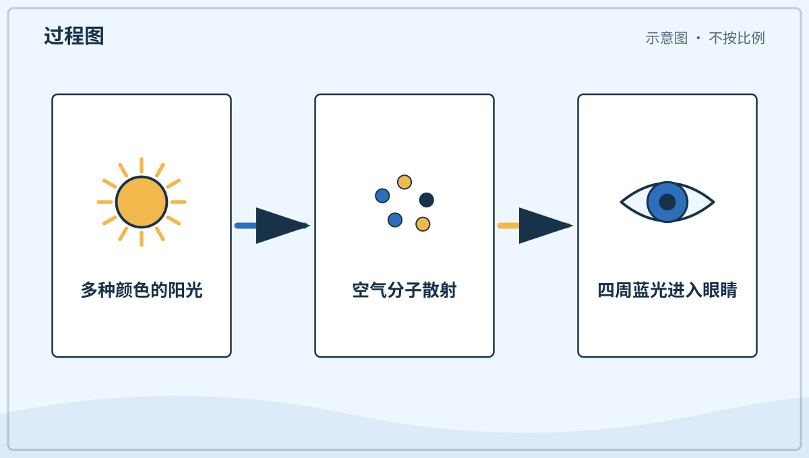

*图解：阳光进入大气后，短波长的蓝光更容易被空气分子散向四周。*

**一起看看：** 比一比头顶和地平线附近的蓝色一样不一样。

---

## 第 003 天｜云为什么有白有灰？

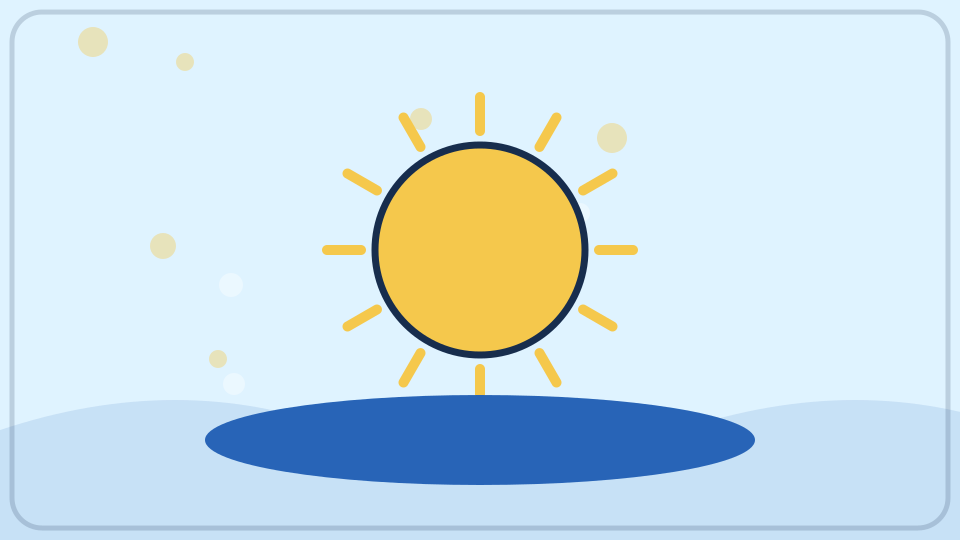

云由许多小水滴或小冰晶组成。薄云能让很多阳光穿过，看起来白白的。厚云挡住更多光，云底就会显得灰一些。

**再想一步：** 云滴比空气分子大，会把多种颜色的光一起散开，混在眼睛里就接近白色。云越厚，光在里面走的路越曲折，到达云底的光也越少。

**一起看看：** 今天的云是薄薄的，还是厚厚的？

---

## 第 004 天｜晚霞为什么红红的？

傍晚的阳光要在空气里走更长的路。蓝色的光大多散到别处，红色和橙色的光更容易来到我们眼前。晚霞便像被染暖了。

**再想一步：** 太阳靠近地平线时，光斜着穿过的大气比中午多。短波长的蓝紫光沿途散失得更多，剩下的直射光便偏红；空气中的尘埃和水滴还会改变颜色浓淡。

**一起看看：** 背对太阳，找找云边上的橙色和粉色。

---

## 第 005 天｜影子从哪里来？

光通常沿着直线前进。身体挡住一部分光，后面少了光，就出现了暗暗的影子。影子不是另一个人，只是没被照亮的地方。

**再想一步：** 小光源会产生边缘较清楚的影子，大光源常在边缘留下半明半暗的“半影”。太阳看起来虽小，却不是一个点，所以户外影子的边缘也不是绝对锋利。

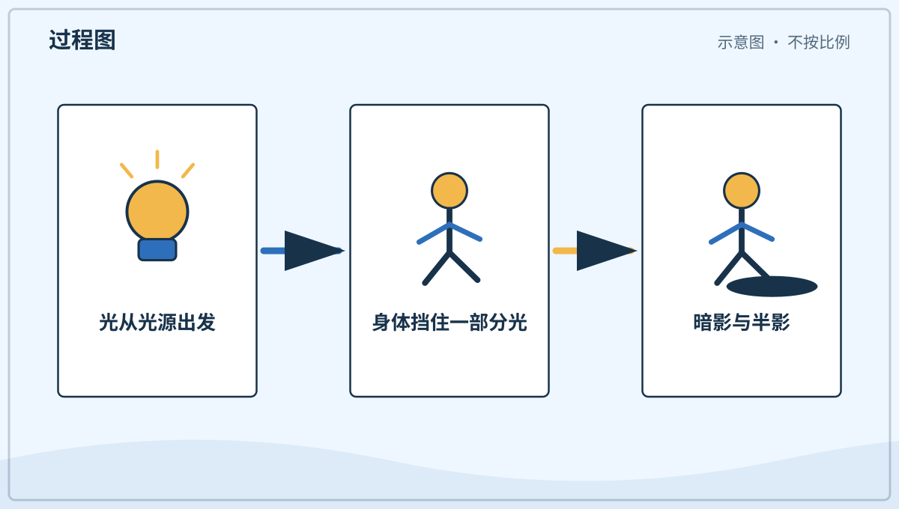

*图解：物体挡住直线传播的光，在背后形成暗影和较模糊的半影。*

**一起看看：** 在灯光下挥挥手，看看影子会不会一起动。

---

## 第 006 天｜影子为什么会变长？

光从不同方向照来，影子的长短也不同。太阳低低地挂在天边时，影子常常很长。太阳升得高一些，影子通常会缩短。

**再想一步：** 影长是光线、物体和地面组成的几何结果。同一个直立物体不变，只要光线与地面的夹角变小，影子就会被拉得更长。

**一起看看：** 早上和中午在同一处看影子，记住它的变化。

---

## 第 007 天｜镜子为什么看得见自己？

光照到脸上，再碰到平滑的镜面。镜子把光整齐地反射到眼睛里，我们就看见自己的样子。粗糙的墙也会反光，只是反得比较散。

**再想一步：** 镜面反射时，光碰到镜子的角度和离开镜子的角度相等。镜子里的像看起来在镜后，但那里并没有一个真正的人，只是眼睛沿反射光倒推出来的位置。

*图解：脸上反射的光按相等角度离开镜面，眼睛把光路倒推到镜后。*

**一起看看：** 对镜子眨一只眼，镜子里的你也会眨眼。

---

## 第 008 天｜为什么能透过窗户看外面？

干净的玻璃能让大部分可见光穿过去，所以我们能看见窗外。墙会挡住这些光，我们就看不穿。玻璃虽然透明，还是一个实实在在的东西。

**再想一步：** 光碰到材料后，可能被透过、反射或吸收。玻璃对可见光的透过很多，对另一些光却未必透明；透明与否要看材料和光的种类。

**一起看看：** 找找透明、半透明和不透明的三样东西。

---

## 第 009 天｜彩虹怎么跑到天上去了？

阳光进入小雨滴时，会转弯、反射，还会分成许多颜色。很多雨滴一起把这些颜色送到眼睛里，就成了弯弯的彩虹。看彩虹时，太阳通常在身后。

**再想一步：** 光进入和离开水滴时的转弯叫折射，不同颜色转弯的程度略有差别，这叫色散。每颗雨滴只把特定方向的颜色送来，许多雨滴共同排出我们看见的彩色圆弧。

*图解：阳光在雨滴中折射、反射并分色，特定方向的彩光进入眼睛。*

**一起看看：** 雨后背对太阳，看看天空有没有彩色弧线。

---

## 第 010 天｜夜晚为什么会变黑？

地球像陀螺一样不停转动。当我们住的这一面转到背向太阳的地方，阳光照不到这里，夜晚就来了。远处的灯和星星会在黑暗里更显眼。

**再想一步：** 地球任何时刻大约都有一半被太阳照亮，明暗交界叫晨昏线。夜晚不是太阳熄灭，而是我们随地球转到了背光的一面。

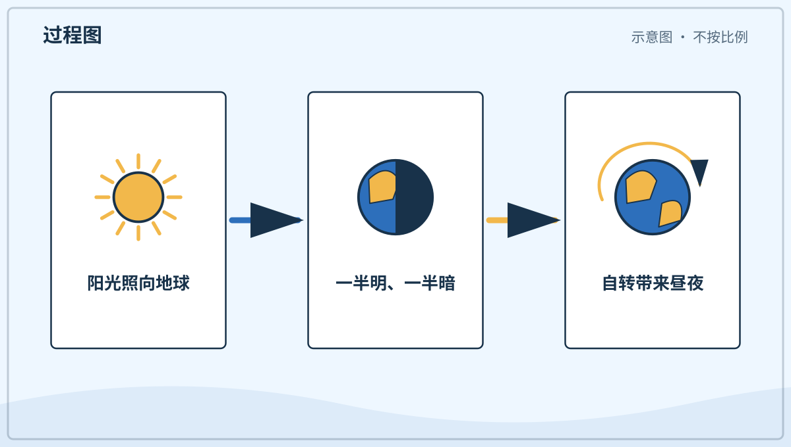

*图解：太阳总照亮约半个地球；地球自转让同一地点轮流经过明暗两面。*

**一起看看：** 关掉一盏房灯，再找找原来不显眼的小亮光。

---

## 第 011 天｜月亮自己会发光吗？

月亮不会像太阳那样自己发出明亮的光。太阳照亮月亮，月亮再把一部分光反射给我们。所以夜里的月亮看起来亮亮的。

**再想一步：** 月面由岩石和尘土组成，会把阳光向许多方向散射。它只反射到达月面的部分阳光，却因为夜空很暗，在我们眼里仍然十分醒目。

**一起看看：** 用手电照一只白球，看看球怎样被照亮。

---

## 第 012 天｜月亮为什么有时圆有时弯？

月亮一直是圆球。它绕着地球走时，我们看见的明亮部分会改变，于是有时像圆盘，有时像小船。不是谁把月亮咬掉了一块。

**再想一步：** 月相来自太阳、月亮和地球位置关系的变化，通常不是地球影子挡住月亮。只有月食发生时，地球的影子才真正落到月面上。

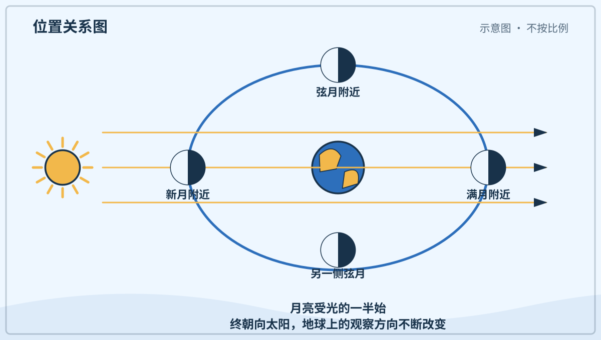

*图解：月亮绕地球移动时，我们看见的受光部分不同，于是出现月相。*

**一起看看：** 连续几晚在大人陪同下看看月亮，画下亮的部分。

---

## 第 013 天｜星星为什么一闪一闪？

星光来到地球前，要穿过不停流动的空气。空气像许多轻轻晃动的透明小窗，让星光的方向和亮度微微改变。我们便觉得星星在眨眼。

**再想一步：** 冷热不同的空气密度不同，折射光的程度也不同。星星离得极远，在眼中近似一个小光点，所以大气的微小扰动就能明显改变它的亮度和位置。

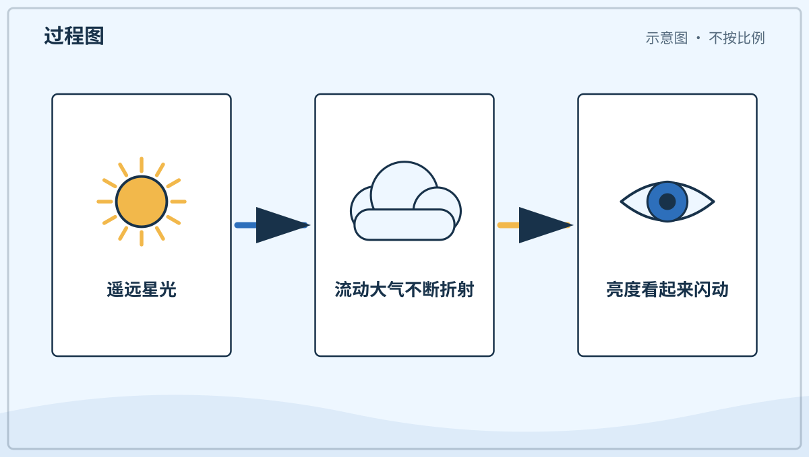

*图解：星光穿过密度不断变化的空气，传播方向和亮度会快速微调。*

**一起看看：** 找一颗亮星，安静看十秒，它的亮光稳不稳？

---

## 第 014 天｜白天星星去哪儿了？

白天星星还在天空中。只是阳光被空气散向四周，天空变得很亮，微弱的星光就不容易被眼睛分辨。像小夜灯开在明亮的房间里，不太显眼。

**再想一步：** 能不能看见一个物体，不只看它有多亮，还看它和背景的亮度差，这叫对比。白天天空的亮背景压低了星光的对比，星星没有因此消失。

**一起看看：** 白天和夜晚都开同一盏小灯，比比哪次更醒目。

---

## 第 015 天｜白天和夜晚怎样轮流来？

地球大约一天转一圈。朝向太阳的一面是白天，背向太阳的一面是夜晚。地球不停转，我们住的地方便轮流走进光明和黑暗。

**再想一步：** 地球绕一条想象中的轴自转，这条轴穿过南北极附近。相对于远处星星，地球转一圈略少于 24 小时；日常的一天按太阳再次回到相近天空位置来计算。

**一起看看：** 请大人用手电照着球，慢慢转球看明暗两面。

---

## 第 016 天｜为什么早晨太阳在东边？

地球从西向东转，所以我们看起来像是太阳从东方升起，再向西方落下。其实一天里主要是我们跟着地球在转。太阳没有每天绕地球一圈。

**再想一步：** 这种由观察者自身运动造成的变化叫视运动。坐车时近处景物像向后跑，也是相似的观察效果，但两种运动的具体原因不同。

**一起看看：** 问问大人，家里的哪扇窗最先照进晨光。

---

## 第 017 天｜一年为什么有春夏秋冬？

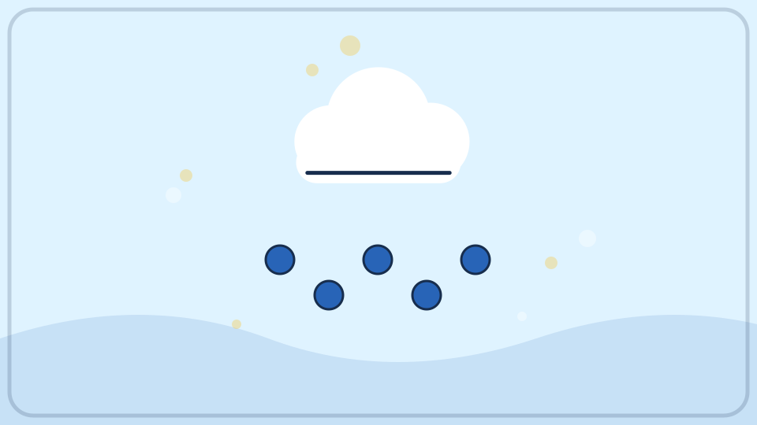

地球绕太阳走，身体还微微斜着。走到不同位置时，一些地方得到的阳光多少和时间会改变，于是有了季节。南北半球的季节还会相反。

**再想一步：** 季节的主因是地轴倾斜，不是地球有时离太阳近、有时远。某个半球朝太阳倾斜时，阳光更直，白天更长，通常就更暖。

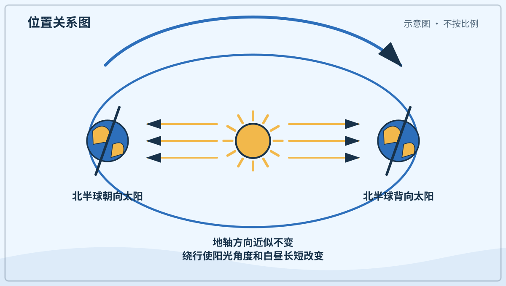

*图解：地轴保持倾斜；一个半球朝向太阳时，阳光更直、白天更长。*

**一起看看：** 说说现在的树、衣服和白天跟上个季节哪里不同。

---

## 第 018 天｜冬天为什么冷？

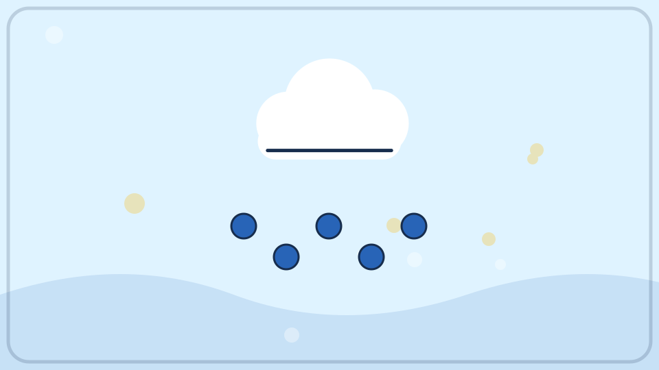

冬天的太阳在天空中比较低，白天也常常较短。阳光斜斜地铺开，同一块地面得到的能量较少。空气和地面便不容易暖起来。

**再想一步：** 同一束光斜着落下，会把能量分摊到更大的地面上。冬天夜晚较长，地面向外散热的时间也更久，这两件事共同影响温度。

**一起看看：** 找找冬天太阳照进屋里的位置，和夏天记忆里一样吗？

---

## 第 019 天｜草叶上的白霜是什么？

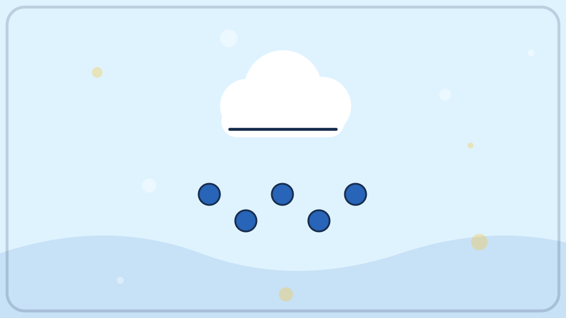

寒冷的夜里，草叶会变得很凉。空气里的水汽碰到很冷的叶面，可能直接变成细小冰晶，这就是霜。太阳一晒，霜会慢慢融化。

**再想一步：** 水汽不先变成液态水，直接变成固态冰的过程叫凝华。叶面温度低于冰点且附近水汽足够时，冰晶会沿着表面一点点长大。

**一起看看：** 只用眼睛观察霜的边缘，别踩坏结霜的植物。

---

## 第 020 天｜冰为什么能浮在水上？

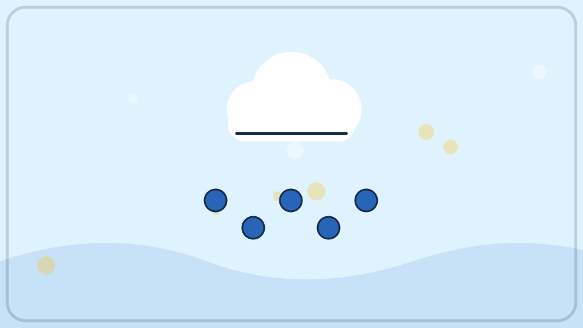

水结冰时，里面的小小水分子排得更松。同样质量的水结成冰后会占更大地方；同样体积的冰又比液态水质量小。换句话说，冰的密度较小，所以常常浮在水面。

**再想一步：** 密度表示单位体积里有多少质量。冰的晶体结构留下较多空隙；放进水中后，它排开水所得到的浮力能够与自身重量平衡，于是浮在水面。

*图解：冰排开水获得向上的浮力；浮力与重量平衡时，冰便浮着。*

**一起看看：** 请大人把冰块放进一杯水里，看它露出多少。

---

## 第 021 天｜雪花为什么像小星星？

云里的水汽在寒冷中结成冰晶。冰晶按自己的形状生长，常常长出六个方向的枝杈。每片雪花走过的云不同，花纹也会不同。

**再想一步：** 水分子结冰时容易排成六角形结构，所以雪晶常有六重对称。温度和湿度沿途变化，会决定枝杈长得细、宽、长还是短。

**一起看看：** 下雪时用深色手套接一片，短短看一眼再让它融化。

---

## 第 022 天｜冷天说话为什么冒白气？

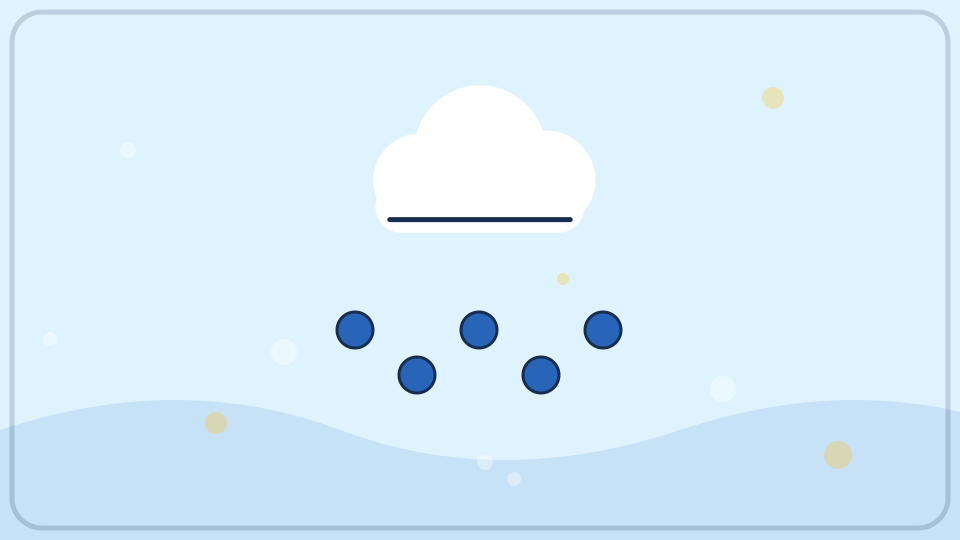

我们呼出的气里有温暖的水汽。它碰到冷空气，会变成许多很小的水滴，看起来像一团白雾。那不是烟，也不是嘴里着火了。

**再想一步：** 气体变成液体小滴叫凝结。暖空气能容纳的水汽通常更多；呼气一冷却，超过空气能容纳的部分就聚成看得见的小滴。

**一起看看：** 在冷空气里轻轻哈气，观察白雾多久会散开。

---

## 第 023 天｜金属为什么摸起来更凉？

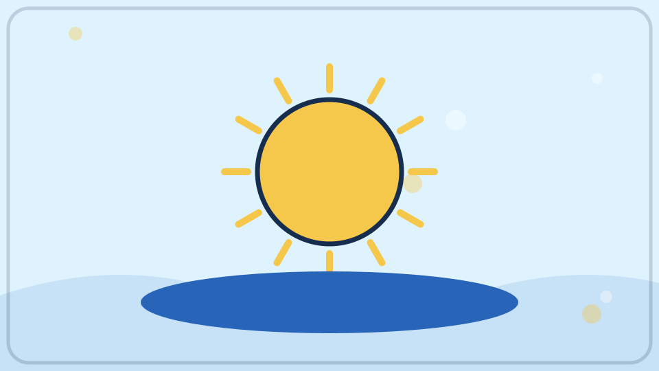

同一个房间里，金属和木头可能温度差不多。金属能更快带走手上的热，所以手觉得它更凉。我们的感觉也会受热传得快不快影响。

**再想一步：** 材料传递热量的本领叫导热性。皮肤感到的“冷”常与热量离开皮肤的速度有关，所以触感不能总当作准确温度计。

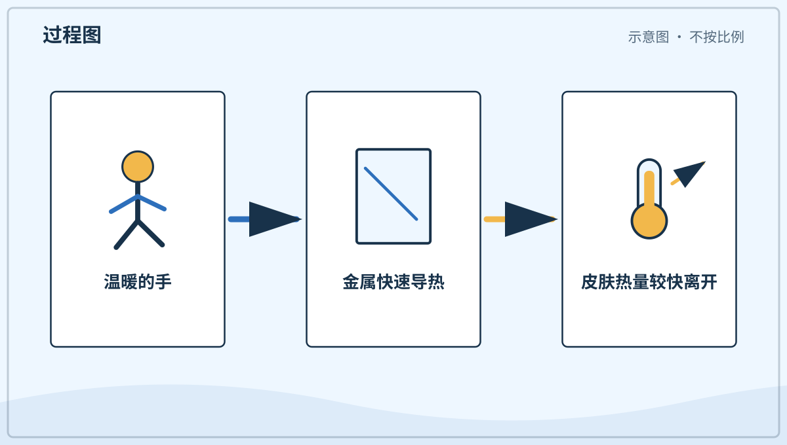

*图解：金属把皮肤的热量传走得较快，因此同温度下摸起来更凉。*

**一起看看：** 只摸室温下的金属勺和木勺，不碰刚加热过的东西。

---

## 第 024 天｜衣服怎么把人变暖？

衣服不会自己制造很多热。它把身体周围的一层空气留住，让身体的热不那么快跑掉。蓬松的衣服能留住更多小空气层。

**再想一步：** 静止空气导热较慢，衣服还会减弱空气流动带走热量的过程，也就是对流。衣服湿透后空气层减少，水又更容易传热，所以会觉得更冷。

**一起看看：** 轻轻捏一捏棉衣，感觉里面是不是松松软软。

---

## 第 025 天｜为什么戴帽子也会暖和？

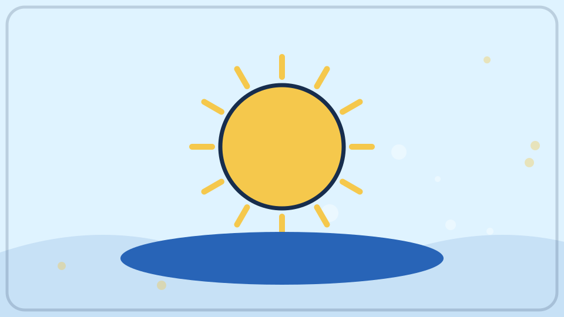

头部也会把身体的热传给周围空气。帽子盖住头，留住一层空气，就能减慢热量离开。帽子不是只给耳朵穿的小衣服，它也保护头皮。

**再想一步：** 身体各处都可能散热，露在外面的面积、风和衣物都会影响快慢。头部并不是在所有情况下都固定散失某个特别比例的热，帽子有用是因为它盖住了原本暴露的部位。

**一起看看：** 摸摸帽子的里面和外面，找找哪一面更柔软。

---

## 第 026 天｜钟为什么会滴答走？

钟要用一个稳定的节奏数时间。有的钟靠摆来回摇，有的靠小小的石英晶体规律振动。齿轮或电子零件把节奏变成指针和数字的变化。

**再想一步：** 会规律重复的运动叫周期运动。钟先用振荡器产生稳定周期，再用计数装置把许多个周期换算成秒、分和小时。

*图解：钟用稳定的周期运动作节拍，再把许多周期累计成时间读数。*

**一起听听：** 靠近一只安全的钟，听它有没有规律的声音。

---

## 第 027 天｜日历为什么一页一页翻？

地球转一圈，我们把它叫作一天。人们把许多天排成星期、月份和年份，方便一起记事情。日历是人做的时间地图。

**再想一步：** 日、月和年最初分别与地球自转、月相周期和地球绕太阳运行有关，但现代日历需要用规则把这些周期排整齐。闰日就是为了让日历年不要慢慢偏离季节。

**一起看看：** 在日历上找到今天，再找找明天在哪一格。

---

## 第 028 天｜一个星期为什么有七天？

七天一星期是人们很久以前约定的记日方法。自然里没有一条线把星期切开，但共同的约定让大家容易安排上学、工作和休息。

**再想一步：** 科学里既有自然规律，也有人类为了测量和合作建立的单位与制度。星期属于后者；不同文化曾使用过不完全相同的分组方法。

**一起说说：** 你最熟悉星期里的哪一天？那天常做什么？

---

## 第 029 天｜我们为什么要睡觉？

睡觉时，身体不是完全停工。大脑整理白天得到的信息，身体也在生长、修补和恢复精神。睡够以后，我们更容易活动、学习和保持好心情。

**再想一步：** 一晚睡眠会经历不同阶段，大脑活动、呼吸和肌肉状态也会变化。科学家仍在研究睡眠的全部作用，但记忆整理、免疫调节和身体恢复都是重要部分。

**一起说说：** 选一个让身体知道“要睡了”的安静小习惯。

---

## 第 030 天｜猫头鹰为什么晚上活动？

有些猫头鹰的眼睛和耳朵很适合在昏暗中寻找食物。它们常在夜里活动，白天休息。并不是所有猫头鹰都只在完全黑暗时出门。

**再想一步：** 猫头鹰的大眼睛能收集较多光，面盘和不对称耳孔能帮助一些种类判断声音方向。夜行是一组身体结构和行为共同形成的适应，不是单靠一种“夜视本领”。

**一起听听：** 夜晚关好窗，在安静处听听有没有和平时不同的声音。

---

## 第 031 天｜天空里的彩色光带是什么？

在靠近地球南北两端的天空，有时会出现极光。来自太阳的带电小粒子遇到地球周围的气体，会让气体发出绿色、红色等光。它们像会飘动的彩带。

**再想一步：** 地球磁场会引导许多带电粒子靠近极区。粒子撞到高层大气里的氧和氮，使它们先得到能量，再以特定颜色的光把能量放出来。

**一起看看：** 在图片里找找极光和普通彩虹的形状有什么不同。
