# 兴趣单元 01｜光、颜色与看见

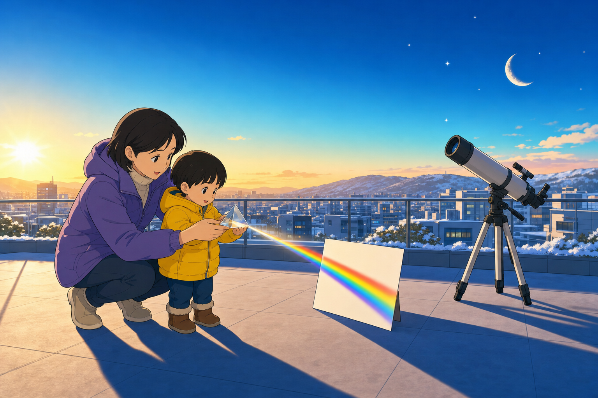

> **探索领域 01：** 光、天空、时间与冷暖
>
> **核心问题：** 光怎样从光源出发，经过空气和物体，最后让眼睛看见颜色与形状？

从太阳、蓝天和晚霞出发，再追踪影子、镜子、玻璃和彩虹。这个单元把每个现象还原成一条可以顺着走的光路。

## 怎样沿着本单元的追问链阅读

先问光从哪里来，再问它被谁反射、散射、折射、透过或挡住。

## 追问链 01.1｜太阳光与天空的颜色

比较发光、散射和长短不同的光程，解释蓝天、白云与晚霞。

### 第 001 问｜太阳为什么会亮？

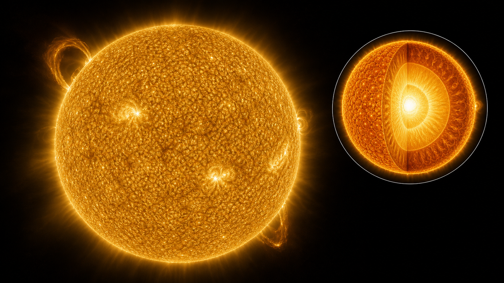

太阳是一颗星星，主要由非常热的等离子体组成。等离子体像气体，却含有大量自由带电粒子。太阳内部持续释放能量，最后从表面发出光，照亮并温暖地球。

**再想一步：** 太阳中心的氢原子核会在高温高压下发生核聚变，结合成氦原子核，同时释放能量。能量从太阳内部传到表面，再以光等辐射形式穿过太空来到地球。

**把知识连起来：** 太阳把一条很长的能量接力链送到我们身边。核心释放的能量先在内部多次被吸收和放出，慢慢走到表面；离开太阳后，光穿过太空到达地球只要大约八分二十秒。植物利用其中一部分光制造有机物，风、雨和许多食物链也间接依靠太阳，所以太阳的光不只是让我们看见东西，还驱动了地球上大量变化。

**再往外看：** 太阳只是银河系里一颗普通恒星。质量不同的恒星亮度、颜色和寿命不同；研究太阳能帮助天文学家理解远方恒星，也提醒我们恒星提供能量的时间虽然极长，却并非永远不变。

**容易弄混：** 太阳不是一团正在燃烧的木柴。普通燃烧需要氧并重排原子外层的电子，太阳核心主要发生的是原子核聚变，两者释放能量的机制不同。

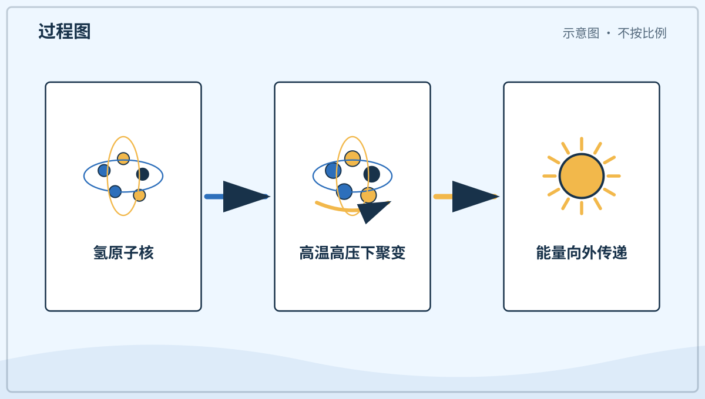

*图解：氢原子核在高温高压下结合，释放的能量逐步传到太阳表面。*

**一起看看：** 找一块阳光照到的地面，但不要直盯太阳。

---

### 第 002 问｜天空为什么是蓝色的？

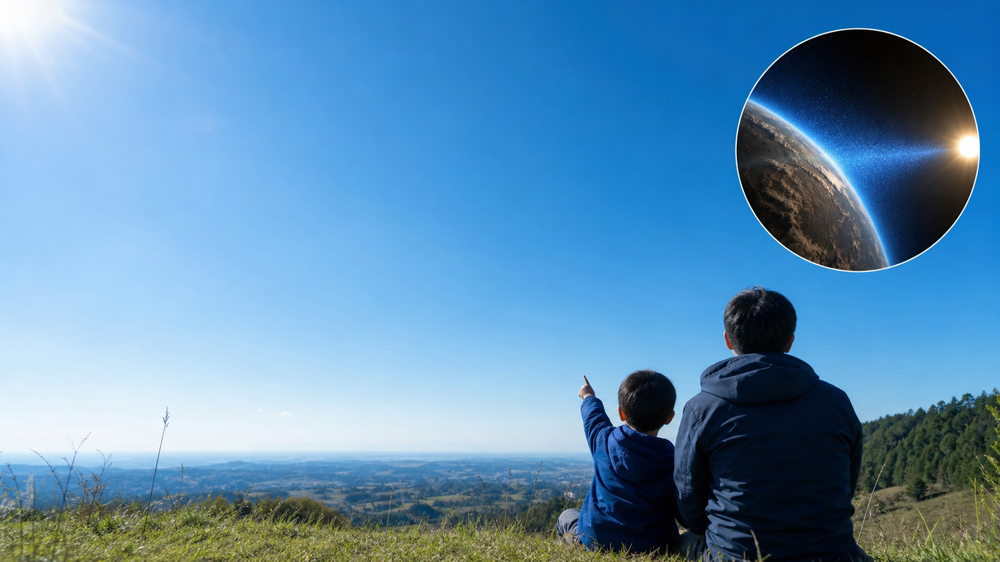

阳光里藏着许多颜色。阳光穿过空气时，蓝色的光更容易向四周散开。我们抬头从很多方向看见它，天空就显得蓝蓝的。

**再想一步：** 这种把光向不同方向送开的现象叫散射。蓝光的波长较短，比红光更容易被空气分子散射；天空并不是装着蓝色颜料。

**把知识连起来：** 从太阳来的白光包含一段连续的颜色。空气分子很小，特别容易把波长较短的光散向四面八方；紫光散射也很强，但太阳光中紫光较少，人眼对紫光又不如对蓝光敏感，因此日常看到的天空以蓝色为主。靠近地平线时，光经过的空气更长，尘埃和小水滴也更多，蓝色常会变浅甚至发白。

**再往外看：** 同一种散射还能解释夕阳偏红：太阳低时，蓝光沿长路被散到别处，直达眼睛的红橙光比例增加。白昼蓝天和红色晚霞其实是同一套光与空气关系的两种观察角度。

**容易弄混：** 天空的蓝色主要不是海水映上去的。即使站在远离海洋的大陆中央，空气仍会散射蓝光；海洋的颜色则还受到水的吸收、散射和天空反光共同影响。

*图解：阳光进入大气后，短波长的蓝光更容易被空气分子散向四周。*

**一起看看：** 比一比头顶和地平线附近的蓝色一样不一样。

---

### 第 003 问｜云为什么有白有灰？

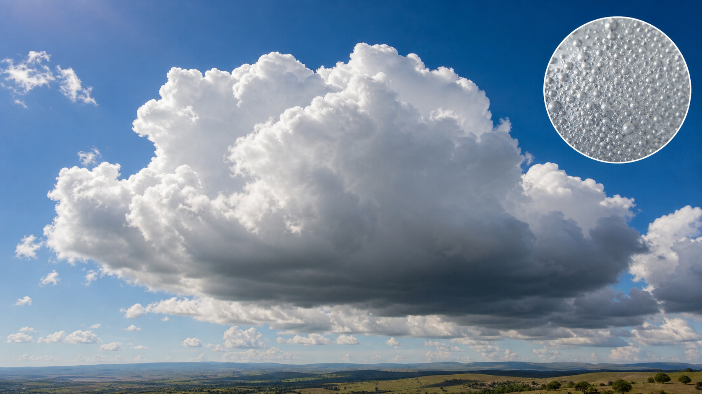

云由许多小水滴或小冰晶组成。薄云能让很多阳光穿过，看起来白白的。厚云挡住更多光，云底就会显得灰一些。

**再想一步：** 云滴比空气分子大，会把多种颜色的光一起散开，混在眼睛里就接近白色。云越厚，光在里面走的路越曲折，到达云底的光也越少。

**把知识连起来：** 一朵云里水滴和冰晶的数量、大小与厚度都在变化。阳光进入薄云后，许多颜色被差不多地散开，所以混合起来接近白色；云层厚时，光要在里面绕很多次，一部分被反射回上方，一部分被吸收，能到达云底的便少了。云底看起来很灰，常提示云很厚，却不能单凭颜色断定一定马上下雨。

**再往外看：** 云同时参与天气和气候。它能反射一部分阳光，也能吸收地面发出的红外辐射；云的高度、厚度和覆盖范围不同，白天遮阳与夜间保温的作用也会不同。

**容易弄混：** 灰云不是由灰色的水组成，黑云也不是装满脏东西。云滴通常仍然透明，明暗差别主要来自光经过云层的路径和数量。

**一起看看：** 今天的云是薄薄的，还是厚厚的？

---

### 第 004 问｜晚霞为什么红红的？

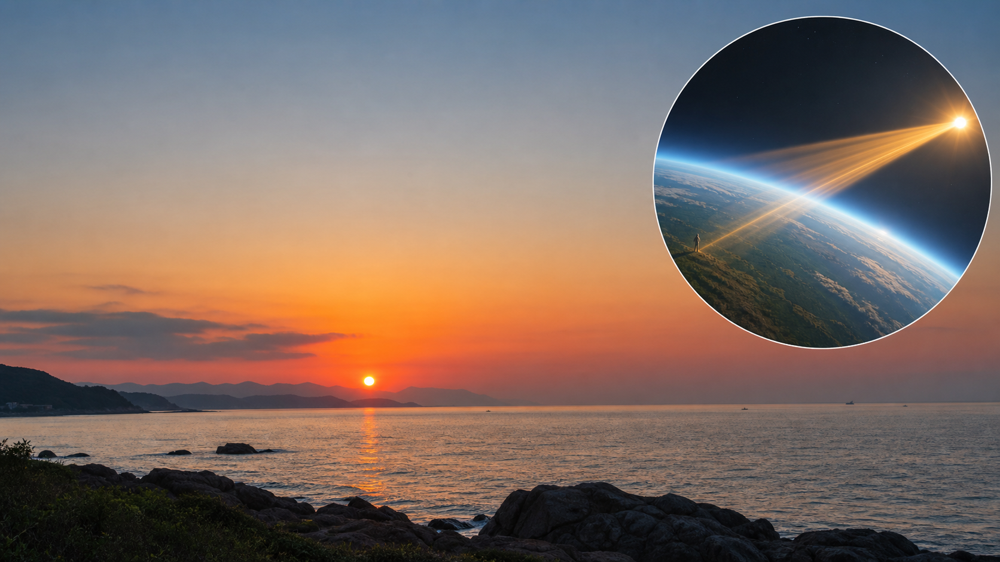

傍晚的阳光要在空气里走更长的路。蓝色的光大多散到别处，红色和橙色的光更容易来到我们眼前。晚霞便像被染暖了。

**再想一步：** 太阳靠近地平线时，光斜着穿过的大气比中午多。短波长的蓝紫光沿途散失得更多，剩下的直射光便偏红；空气中的尘埃和水滴还会改变颜色浓淡。

**把知识连起来：** 傍晚时，我们不是只看太阳本身，也在看被阳光照亮的云和空气。太阳越低，光在大气中走得越远，蓝紫光越容易离开原来的方向，留下的直射光就偏橙红；高处的云还能在地面已经变暗后继续接到阳光。不同高度的云、空气湿度和微小颗粒，会让晚霞每天都有不同层次。

**再往外看：** 天文学家也利用颜色分析遥远天体。把光分成光谱后，颜色中细小的缺口能透露气体成分和温度；从晚霞观察颜色变化，是走向光谱学的一扇小门。

**容易弄混：** 晚霞很红不等于空气一定污染严重。烟尘会改变颜色，但清洁空气中的分子、天然尘埃和水滴也能形成鲜明晚霞，必须结合测量才能判断空气质量。

**一起看看：** 背对太阳，找找云边上的橙色和粉色。

## 追问链 01.2｜影子、反射、透过与彩虹

沿光源、物体和眼睛之间的路径解释暗影、镜像、透明和彩虹。

### 第 005 问｜影子从哪里来？

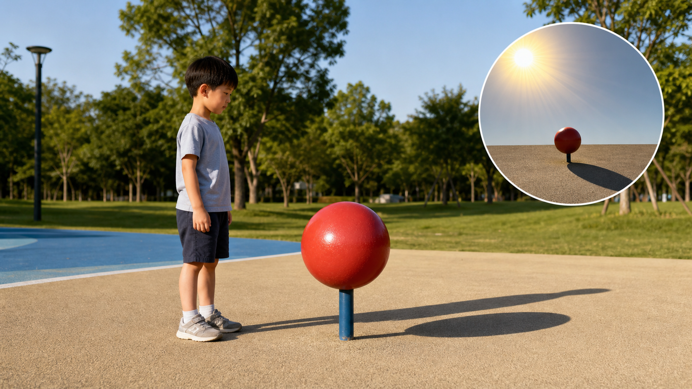

光通常沿着直线前进。身体挡住一部分光，后面少了光，就出现了暗暗的影子。影子不是另一个人，只是没被照亮的地方。

**再想一步：** 小光源会产生边缘较清楚的影子，大光源常在边缘留下半明半暗的“半影”。太阳看起来虽小，却不是一个点，所以户外影子的边缘也不是绝对锋利。

**把知识连起来：** 影子的形状记录了光源、遮挡物和承接影子的表面三者的位置。把手靠近墙，影子会较小而清楚；把手靠近灯，影子会放大，边缘也可能变软。两个方向不同的灯会造出两道影子，半透明材料则只挡住一部分光，留下较浅的影子。研究影子，其实是在用看不见的光路反推物体怎样摆放。

**再往外看：** 日食、月食和相机里的成像都与光路和遮挡有关。先确定光从哪里来、经过哪里、被谁挡住，再判断哪里会亮、哪里会暗，是解决许多光学问题的共同方法。

**容易弄混：** 影子不是从物体里流出来的黑色东西，也不会自己发光。它只是某处接到的光比周围少；换一个光源或移动物体，暗区就会跟着改变。

*图解：物体挡住直线传播的光，在背后形成暗影和较模糊的半影。*

**一起看看：** 在灯光下挥挥手，看看影子会不会一起动。

---

### 第 006 问｜影子为什么会变长？

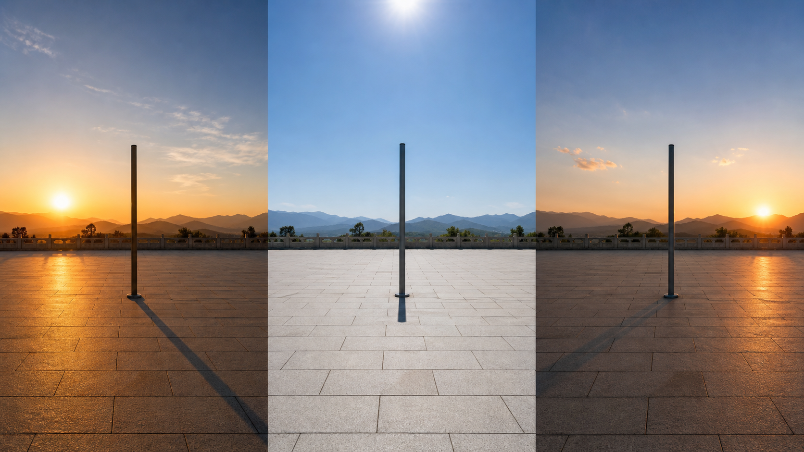

光从不同方向照来，影子的长短也不同。太阳低低地挂在天边时，影子常常很长。太阳升得高一些，影子通常会缩短。

**再想一步：** 影长是光线、物体和地面组成的几何结果。同一个直立物体不变，只要光线与地面的夹角变小，影子就会被拉得更长。

**把知识连起来：** 一天里太阳在天空中的视位置不断改变，影子的方向和长度便像钟针一样变化。清晨和傍晚光线贴近地面，影子长；接近正午时太阳较高，影子通常短。不同季节、不同纬度的太阳高度也不同，所以同一根杆在冬夏正午会留下不同长度的影子。古人正是利用这种规律做出了日晷。

**再往外看：** 固定记录同一根杆每天正午的影长，可以比较季节；记录一天中影子尖端的位置，可以做简易日晷。影子因此既是现象，也是测量太阳视运动的工具。

**容易弄混：** 影子变长并不是太阳突然离我们更远了。一天内太阳与地球距离的变化小得可以忽略，主要变化的是阳光照到地面的角度。

**一起看看：** 早上和中午在同一处看影子，记住它的变化。

---

### 第 007 问｜镜子为什么看得见自己？

光照到脸上，再碰到平滑的镜面。镜子把光整齐地反射到眼睛里，我们就看见自己的样子。粗糙的墙也会反光，只是反得比较散。

**再想一步：** 镜面反射时，光碰到镜子的角度和离开镜子的角度相等。镜子里的像看起来在镜后，但那里并没有一个真正的人，只是眼睛沿反射光倒推出来的位置。

**把知识连起来：** 镜子能成像，是因为来自脸上每一点的光都按规律反射。眼睛把到达自己的光沿直线向后追，就好像光来自镜子后面，于是组成一个与我们等大的虚像。人向镜子靠近一米，人与像之间会少两米；平面镜里的像与镜面距离，等于人到镜面的距离。这些关系让潜望镜、反光镜和许多光学仪器能够被准确设计。

**再往外看：** 汽车后视镜、潜望镜和反射式望远镜都在安排反射光路。平面镜保持比例，曲面镜还能让光会聚或发散，因此镜面形状一变，像的大小和视野也会改变。

**容易弄混：** 镜子并没有真正交换左和右，它更像把面向镜子的前后方向翻转了。我们举右手时，镜中像也举它自己的右手，只是它面对我们的方向相反。

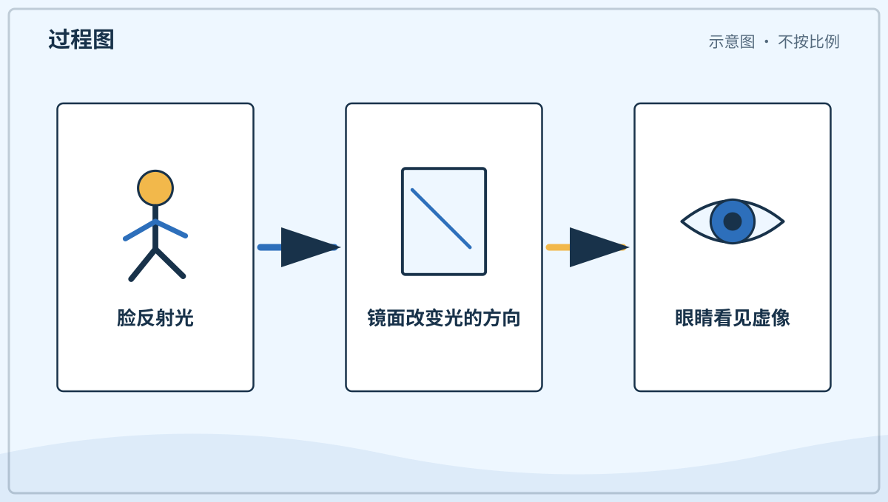

*图解：脸上反射的光按相等角度离开镜面，眼睛把光路倒推到镜后。*

**一起看看：** 对镜子眨一只眼，镜子里的你也会眨眼。

---

### 第 008 问｜为什么能透过窗户看外面？

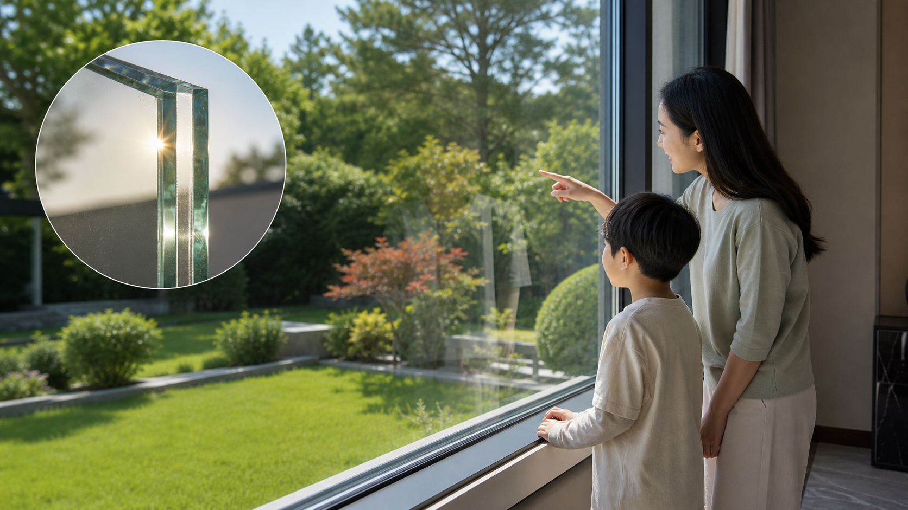

干净的玻璃能让大部分可见光穿过去，所以我们能看见窗外。墙会挡住这些光，我们就看不穿。玻璃虽然透明，还是一个实实在在的东西。

**再想一步：** 光碰到材料后，可能被透过、反射或吸收。玻璃对可见光的透过很多，对另一些光却未必透明；透明与否要看材料和光的种类。

**把知识连起来：** 玻璃中的带电粒子会与光相互作用，但对可见光中的许多波长，能量大多仍能继续传过去。玻璃表面同时会反射一小部分光，所以夜里屋内亮、屋外暗时，窗户容易像镜子。加入不同成分或涂层，还能让玻璃吸收紫外线、反射红外线或只透过某些颜色，这就是太阳镜和节能窗工作的部分原理。

**再往外看：** 有些材料只对特定波段透明：无线电波能穿过某些墙体，X 射线能穿过软组织却较易被骨骼吸收。说“看不穿”时，还要问是用哪一种光来观察。

**容易弄混：** 透明不等于不存在，也不表示所有光都能穿过。普通窗玻璃对可见光很透明，对某些紫外线和红外线却没有同样的透过能力。

**一起看看：** 找找透明、半透明和不透明的三样东西。

---

### 第 009 问｜彩虹怎么跑到天上去了？

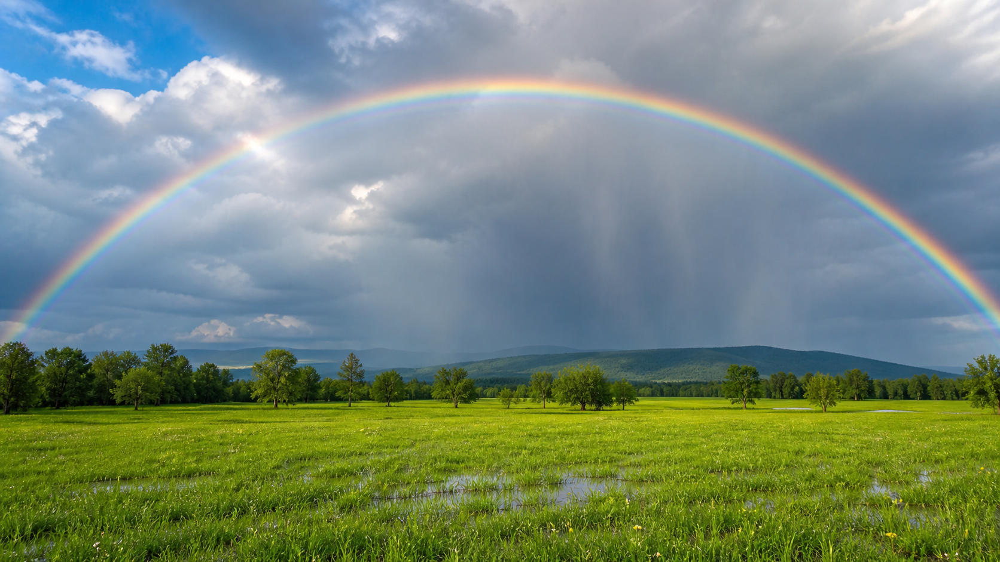

*写实观察图：用于辨认彩虹在真实天空中的弧形和颜色顺序；亮度会随水滴、阳光和观察位置改变。*

阳光进入小雨滴时，会转弯、反射，还会分成许多颜色。很多雨滴一起把这些颜色送到眼睛里，就成了弯弯的彩虹。看彩虹时，太阳通常在身后。

**再想一步：** 光进入和离开水滴时的转弯叫折射，不同颜色转弯的程度略有差别，这叫色散。每颗雨滴只把特定方向的颜色送来，许多雨滴共同排出我们看见的彩色圆弧。

**把知识连起来：** 彩虹其实是以观察者背后的反太阳方向为中心的一部分圆。站在地面时，下半圆常被地面挡住，从飞机或高处有时能看到更完整的圆。主虹外偶尔还会出现颜色顺序相反、较暗的副虹，因为光在雨滴内部多反射了一次。每个人接到的是不同雨滴送来的光，所以两个人看见的并不是完全同一组雨滴。

**再往外看：** 彩虹之外，冰晶还能形成日晕、月晕，细小水滴会形成雾虹。它们都与光的转弯或反射有关，却需要不同形状、大小的水滴或冰晶，不能只凭“彩色圆弧”就当成同一种现象。

**容易弄混：** 彩虹不是挂在某片云前、可以走到脚下的彩色物体。观察者一移动，能把特定颜色送进眼睛的雨滴也会换一批，彩虹的位置随观察关系改变。

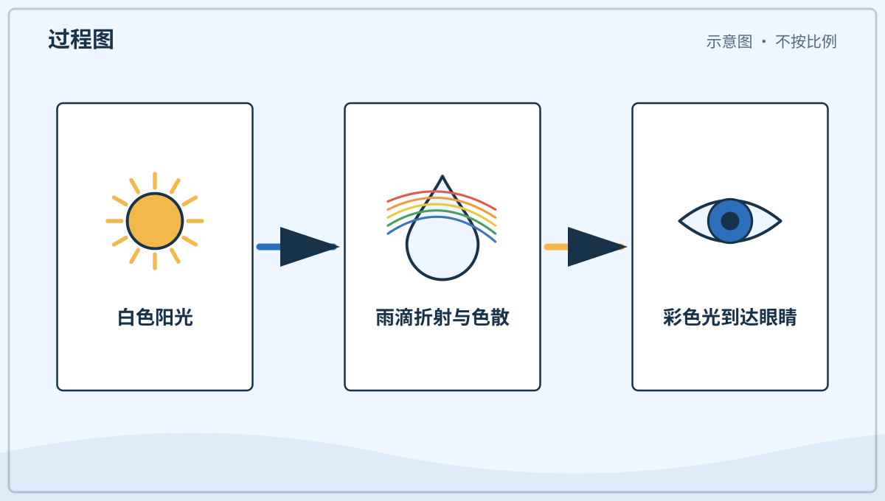

*图解：阳光在雨滴中折射、反射并分色，特定方向的彩光进入眼睛。*

**一起看看：** 雨后背对太阳，看看天空有没有彩色弧线。

## 单元综合观察｜用三件物品追一条光路

由大人准备手电筒、镜子和一块透明材料。在不照眼睛的前提下，分别画出光在哪里被挡住、反射和透过；彩虹只用照片比较，不用镜子把阳光反进眼睛。
