# 二月：风雨从哪里来

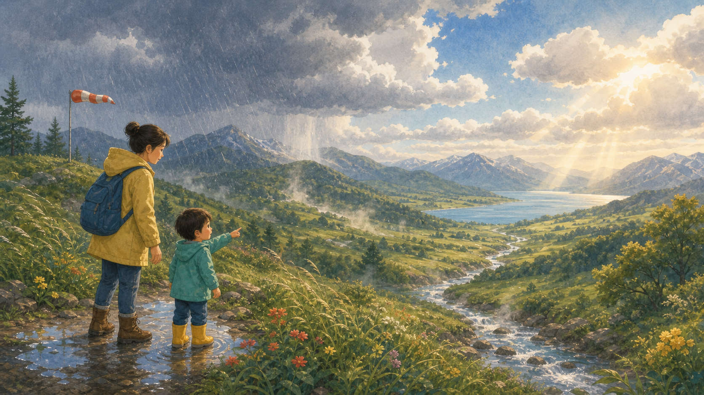

## 第 032 天｜空气明明看不见，怎么知道它在？

空气大多看不见，却会占地方，也有重量。气球鼓起来，是空气住进了里面。风吹到脸上，也是移动的空气碰到了我们。

**再想一步：** 空气是氮气、氧气等多种气体的混合物。气体分子很小、彼此相距较远，却一直运动并碰撞容器，所以空气能产生压力。

*图解：气体分子持续运动并撞击容器内壁，大量撞击共同形成压力。*

**一起试试：** 对着手心轻轻吹气，感觉看不见的空气。

---

## 第 033 天｜风是从哪里来的？

太阳把地面各处晒得不一样暖。暖空气上升，别处较凉的空气就会流过来补上。空气这样移动起来，我们就感觉到了风。

**再想一步：** 温度会改变空气的密度和压力，地球自转、地形与海陆分布也会让风转弯或加速。风因此不是简单地从“冷处直吹到热处”，而是大气共同运动的一部分。

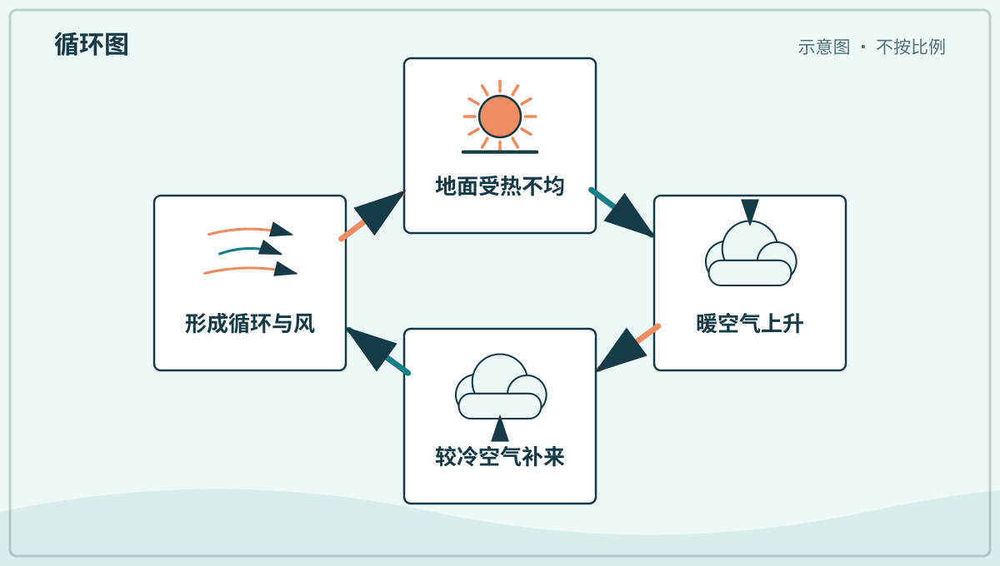

*图解：地面受热不均使空气密度和压力不同，空气的整体运动形成风。*

**一起看看：** 观察树叶、旗子或头发，猜猜风从哪边来。

---

## 第 034 天｜为什么风有大有小？

空气移动得慢，是轻轻的风；移动得快，风就更有力。不同地方空气压力的差别越大，常常越容易有强风。建筑和山也会改变风的速度。

**再想一步：** 风速表示空气移动多快，风力还与空气撞击物体的效果有关。狭窄通道可能让气流加快，粗糙地面和障碍物则会制造旋涡。

**一起看看：** 比较地面的小草和高处的树梢，谁晃得更明显？

---

## 第 035 天｜泡泡里面装着什么？

泡泡里面通常是空气，外面包着一层非常薄的肥皂水。薄膜会反射不同颜色的光，所以泡泡表面闪着彩色。水慢慢流走，薄膜破了，泡泡就消失。

**再想一步：** 肥皂降低水的表面张力，让薄膜更容易拉开又不马上破。薄膜前后两面反射的光互相加强或削弱，便出现不断变化的彩色条纹。

*图解：肥皂分子帮助水膜稳定；薄膜前后表面的反射光会发生干涉。*

**一起看看：** 由大人吹泡泡，你只用眼睛追一只最大的。

---

## 第 036 天｜气球为什么会鼓起来？

吹进气球的空气越来越多，会从里面推气球皮。气球皮被撑开，也向里面拉，直到两边差不多平衡。气球里的空气仍在不停碰撞。

**再想一步：** 单位面积上受到的推力叫压力。充气时，内部压力通常比外面略大；橡胶越被拉伸，回缩的力量也会改变，所以气球不是无限长大。

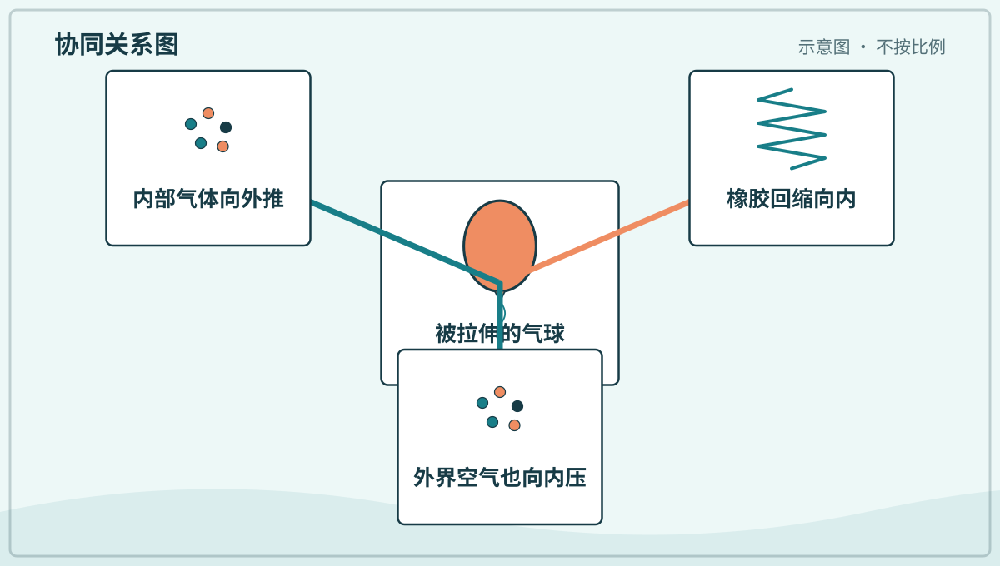

*图解：气球内部压力向外推，橡胶的回缩力和外部空气共同抵抗。*

**一起看看：** 请大人拿充气前后的气球，比比大小和软硬。

---

## 第 037 天｜吸管怎么把水送到嘴里？

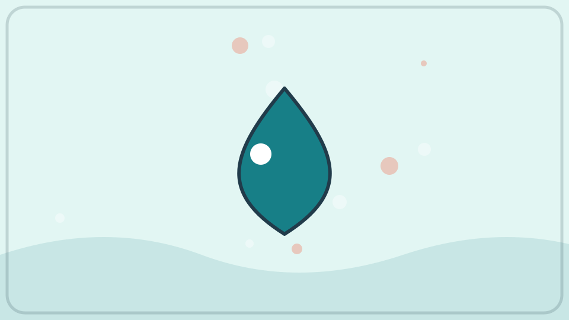

我们吸气时，让吸管里的空气压力变小。杯子上方的空气会推着水进入吸管，水便向上走。不是嘴巴隔着很远把水直接拉上来。

**再想一步：** 液体从压力较高处向压力较低处移动。吸管太长时，大气压力能托起的水柱有上限，所以“吸”并不是没有限制的拉力。

*图解：嘴里降低气压后，大气压推动杯中水面，水沿吸管上升。*

**一起试试：** 用自己的粗吸管喝清水，喝完记得清洗。

---

## 第 038 天｜云是怎样长出来的？

地面和水面的水会变成看不见的水汽。湿空气升高、变凉，水汽聚成许多小水滴或小冰晶。它们挤在一起，就成了我们看见的云。

**再想一步：** 水汽凝结通常要依附灰尘、盐粒等微小颗粒，这些叫凝结核。空气上升时压力降低并膨胀，温度会下降，更容易达到凝结条件。

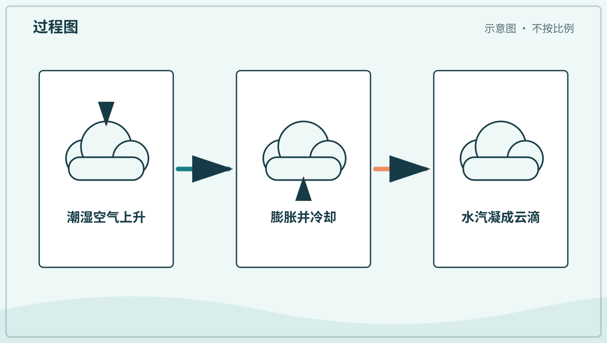

*图解：潮湿空气上升、膨胀并冷却，水汽依附凝结核形成小云滴。*

**一起看看：** 找一朵云，看看它的边缘是整齐还是毛茸茸。

---

## 第 039 天｜雨为什么会落下来？

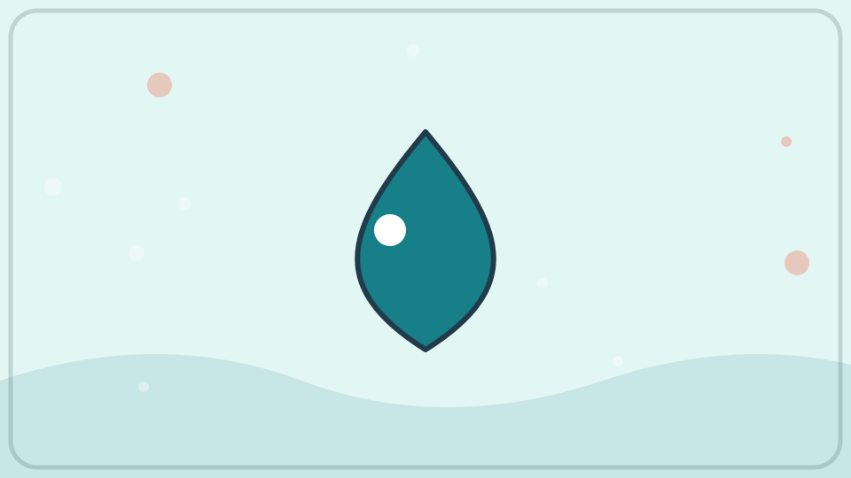

云里的小水滴会碰在一起，慢慢变大。水滴大到上升的空气托不住时，重力把它们拉向地面，于是下雨了。落下时，有些水滴还会改变大小。

**再想一步：** 暖云里小滴可碰并合成大滴；冷云里冰晶也会长大，再融成雨。降水形成有多条路径，云里有水滴不等于马上会下雨。

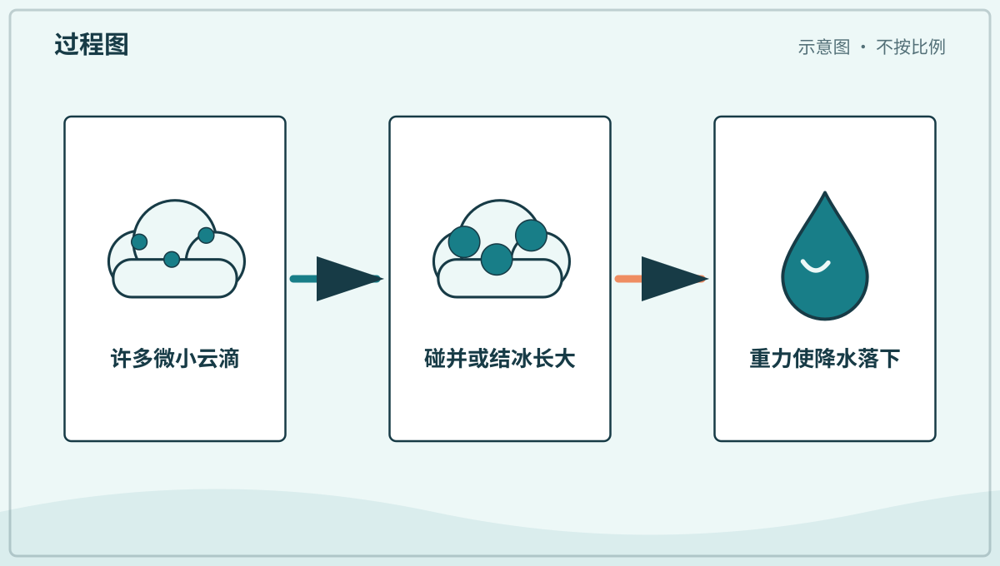

*图解：小云滴或冰晶不断碰并长大，重到上升气流托不住时便落下。*

**一起听听：** 在屋里听雨打窗、屋檐和树叶，声音一样吗？

---

## 第 040 天｜雨滴真的是眼泪形吗？

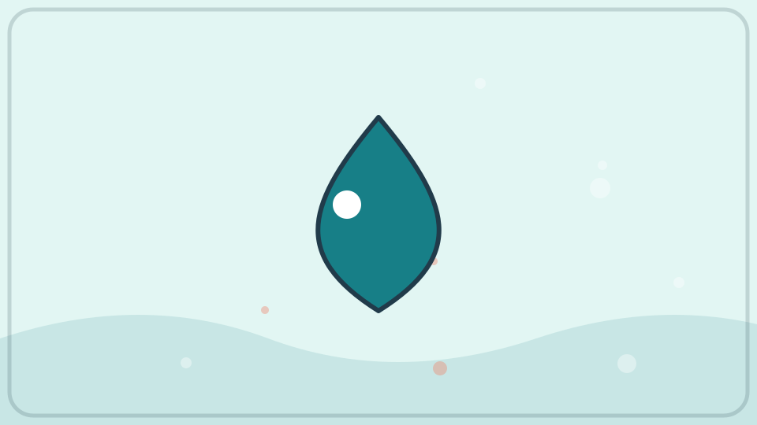

很小的雨滴接近圆球。较大的雨滴落下时，空气会把底部托得扁一些，像小面包。雨滴不是尖尖的眼泪形，图画只是常用那个符号表示雨。

**再想一步：** 表面张力想让水滴缩成表面积较小的球形，空气阻力却会在下落时改变它。水滴大到一定程度还可能被气流撕成更小的滴。

*图解：表面张力把小雨滴拉向球形，空气阻力会把下落雨滴底部压平。*

**一起看看：** 雨后观察窗上的小水珠，它们大多是什么形状？

---

## 第 041 天｜雪和雨有什么关系？

雨和雪都来自云里的水。空气足够冷时，水会长成冰晶，冰晶聚在一起成为雪花。落下途中若遇到暖空气，雪也可能融成雨。

**再想一步：** 地面温度不能单独决定下雨还是下雪，水滴或冰晶一路经过的整层空气都重要。不同高度的冷暖分布还可能形成冻雨或冰粒。

*图解：雪花穿过整层大气；沿途温度决定它保持冰晶还是融成雨。*

**一起说说：** 雪落在手套、地面和水里，后来分别怎样了？

---

## 第 042 天｜冰雹为什么是小冰球？

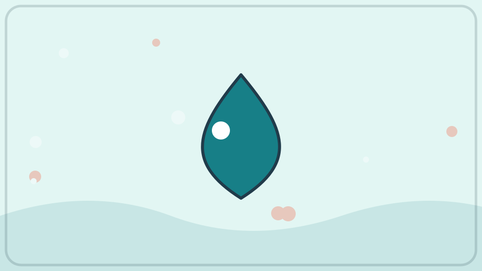

有些高大的雷雨云里，强风把小冰粒反复托上去。冰粒碰到冷水滴，一层层结冰，长成冰雹。它太重时就会落下，所以冰雹天要待在安全的室内。

**再想一步：** 云中有些水滴低于冰点仍保持液态，叫过冷水滴。它们撞上冰核会迅速冻结；冰雹切开后的一层层结构记录了它在云里的成长过程。

**一起看看：** 只从窗内观察，等天气安全后再和大人查看地面。

---

## 第 043 天｜雷声为什么轰隆隆？

闪电会在一瞬间把周围空气加热得很厉害。空气猛地膨胀，推出一圈圈声波，我们就听到雷声。光比声音来得快，所以常先看见闪电。

**再想一步：** 雷声会被不同方向和距离的闪电通道陆续送来，也会被云和地面反射，所以常拖成长长的轰隆声。看见闪电和听见雷之间的间隔还能粗略提示距离。

**一起记住：** 听见雷声就和大人进入结实的室内，不在树下停留。

---

## 第 044 天｜闪电是天空里的电吗？

雷雨云里，冰粒和水滴不停碰撞，让电荷分开。差别大到空气也挡不住时，电荷快速移动，就出现明亮的闪电。它很危险，只能从安全室内观察。

**再想一步：** 平常空气是绝缘体，不容易让电荷通过；强电场会把空气电离，形成可导电的通道。一次闪电常由多个极快的放电过程组成。

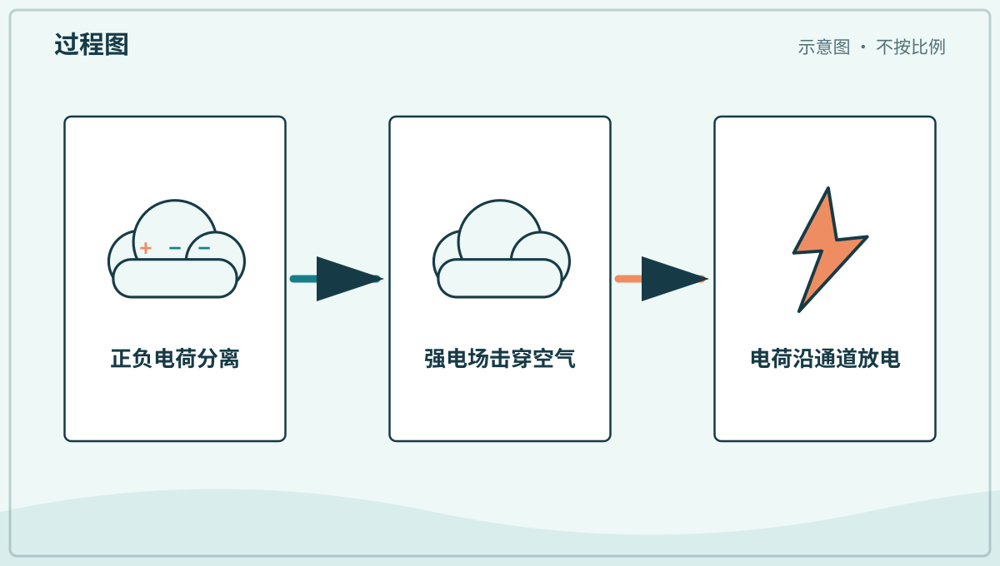

*图解：云内电荷分离产生强电场，空气被电离后形成快速放电通道。*

**一起记住：** 雷雨时远离窗边、水边和插电设备，听大人安排。

---

## 第 045 天｜雾为什么像落到地上的云？

雾和云都由悬在空气里的小水滴组成。云通常在高处，雾贴近地面，所以我们会走进它里面。雾会挡住远处的光，让道路变得不容易看清。

**再想一步：** 空气冷却到水汽开始凝结的温度叫露点。地面附近空气达到露点，就可能形成雾；风、湿度和地形会影响雾何时出现和消散。

**一起看看：** 有雾时从安全的窗边看，远近的东西谁先消失？

---

## 第 046 天｜早晨的露珠从哪里来？

夜里，叶子和草会慢慢变凉。空气里的水汽碰到凉凉的表面，变成小水滴，这就是露。露不是叶子哭出来的。

**再想一步：** 晴朗、风小的夜晚，地面更容易向天空散失热量，表面温度可能降到露点。若表面低于冰点，形成的可能是霜而不是液态露水。

**一起看看：** 用眼睛找圆圆的露珠，先别摇动叶子。

---

## 第 047 天｜水洼怎么自己变小了？

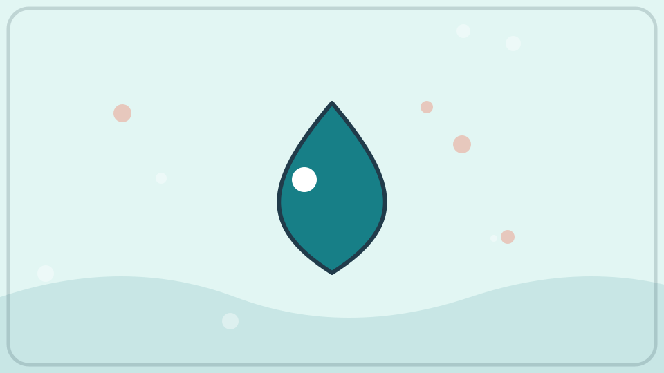

水面上一些水分子得到能量后，会跑进空气，变成看不见的水汽。这个过程叫蒸发。阳光、温暖和风常常让水洼干得更快。

**再想一步：** 蒸发可以在未沸腾时发生，主要出现在液体表面。逃走的常是能量较高的分子，剩下水的平均能量降低，所以蒸发也能带来冷却。

*图解：液面上能量较高的水分子逃进空气，剩余水的平均能量下降。*

**一起看看：** 雨后记住一个安全的小水洼，过一会儿再比大小。

---

## 第 048 天｜湿衣服为什么会干？

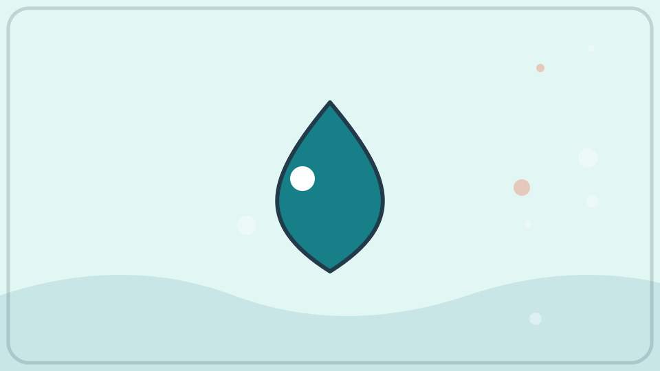

湿衣服的纤维里藏着水。水慢慢蒸发到空气中，衣服就干了。风会带走衣服旁边潮湿的空气，让更多水继续蒸发。

**再想一步：** 当周围空气接近饱和，能再接纳的水汽就少，蒸发会变慢。摊开衣服增加表面积，也让更多水分子有机会从表面离开。

**一起看看：** 比比通风处和不通风处的小湿布，哪块先干。

---

## 第 049 天｜水汽看得见吗？

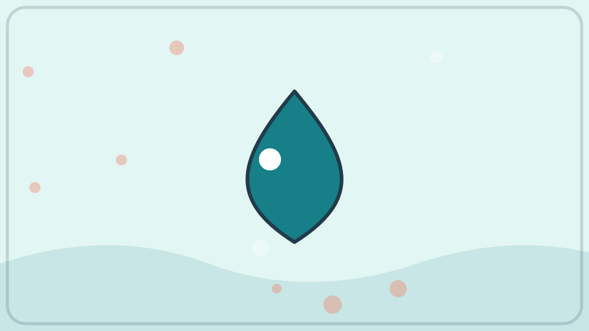

真正的水汽是气体，眼睛看不见。热水上方常见的白雾，其实是水汽变凉后形成的小水滴。它们很小，能把光散开，所以显得白白的。

**再想一步：** “蒸汽”在日常话里常指白雾，但科学上气态水本身透明。水滴继续混进较干空气并蒸发后，白雾就会消失。

**一起看看：** 只在远处观察大人倒的温水，不靠近开水和蒸汽。

---

## 第 050 天｜冰块为什么会化成水？

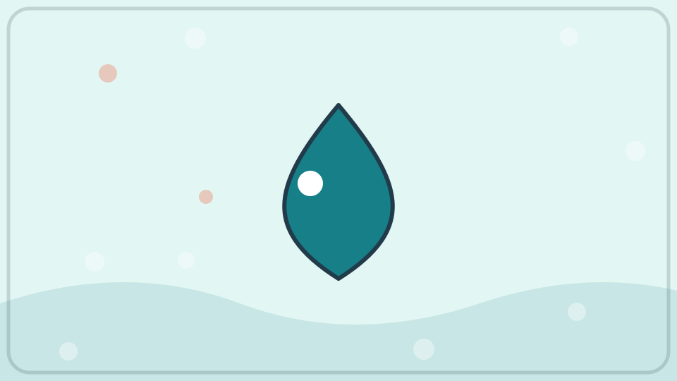

冰从周围得到热量后，里面的水分子活动得更自由，固体就变成液体。这个变化叫融化。水还是水，只是样子和流动方式变了。

**再想一步：** 在融点附近，吸收的能量主要用来破坏固体里较整齐的结构，而不马上升高温度。这部分能量叫熔化潜热。

**一起看看：** 把冰块放在盘子里，观察它的边缘先怎样变化。

---

## 第 051 天｜冷杯子外面为什么会有水？

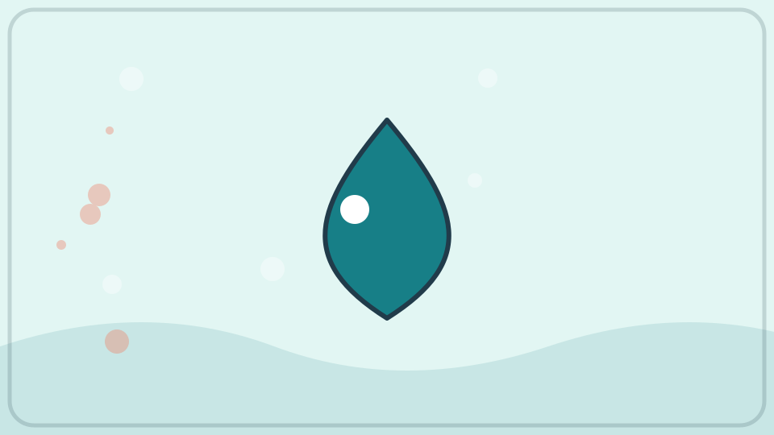

那些水通常不是从杯子里漏出来的。空气里的水汽碰到冰凉的杯壁，变成一颗颗液态水珠。这个变化叫凝结。

**再想一步：** 杯壁先让附近空气冷却到露点，水汽才在表面凝结。空气越潮湿，通常越容易出现水珠；用密封袋包住杯子可帮助判断水来自哪边。

**一起看看：** 擦干杯壁，再等一会儿看水珠会不会回来。

---

## 第 052 天｜一滴水会去哪里旅行？

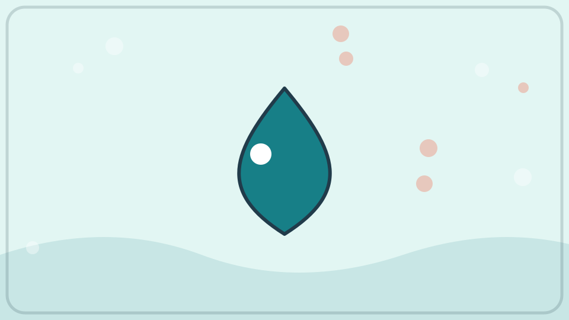

水会从海洋、湖泊和地面蒸发，升到空中变成云。它又以雨或雪落下，流进河流、地下和海洋。水这样不断移动，叫作水循环。

**再想一步：** 植物也会从叶片释放水汽，叫蒸腾。水还可能在冰川、地下或深海停留很久，所以水循环不是每一滴水都沿同一条圆圈快速旅行。

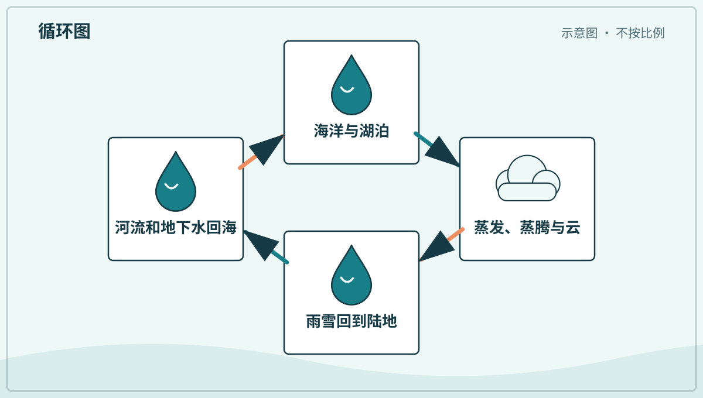

*图解：水可在海洋、空气、陆地和生物之间循环，但每滴水的路径不同。*

**一起说说：** 让手指扮成一滴水，走一圈“海洋、云、雨、河流”。

---

## 第 053 天｜河水为什么往低处流？

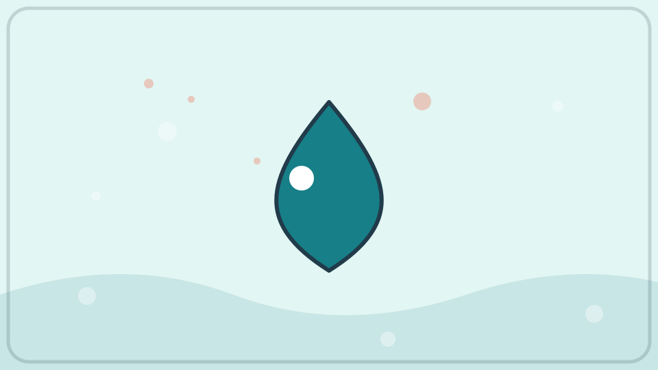

重力把水拉向较低的地方。雨水和融雪从山坡汇到小溪，小溪又合成河流。河道弯曲、石头和泥沙都会改变水流的方向。

**再想一步：** 河流把较高处的重力势能转成水的运动，也会侵蚀、搬运和沉积泥沙。长时间以后，这些作用能雕出峡谷、河谷和三角洲。

**一起看看：** 看雨水沿安全的地面小沟流动，不踩进急水里。

---

## 第 054 天｜地下也有水吗？

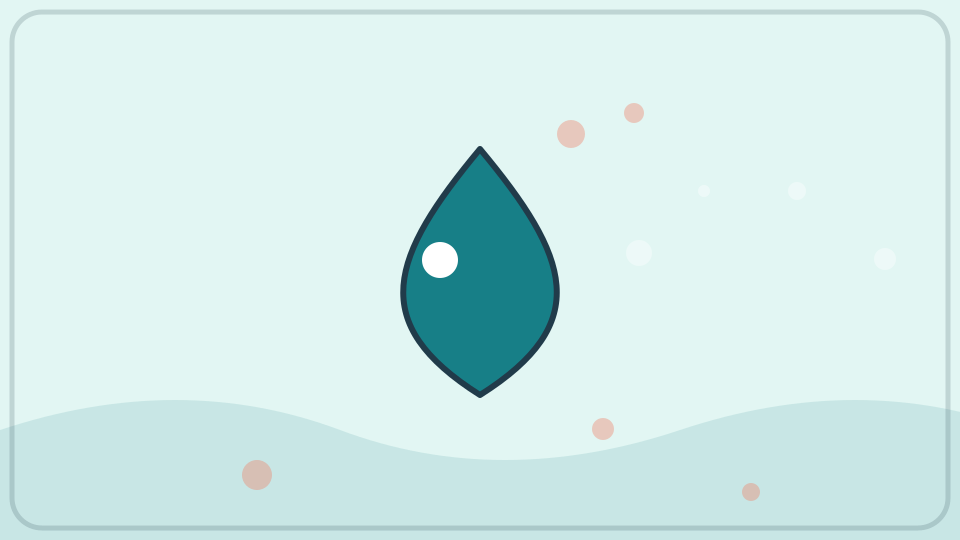

一部分雨水会从土壤和岩石的缝隙渗下去。它储存在地下可以让水通过的地方，叫地下水。井和泉有时能让地下水来到地面。

**再想一步：** 能储存并传递较多地下水的岩土层叫含水层。地下水并不总像地下河一样流在空洞里，更多时候填在沙粒和岩石的小孔隙中。

**一起试试：** 请大人慢慢给一盆干土浇水，看水怎样渗进去。

---

## 第 055 天｜水龙头里的水从哪里来？

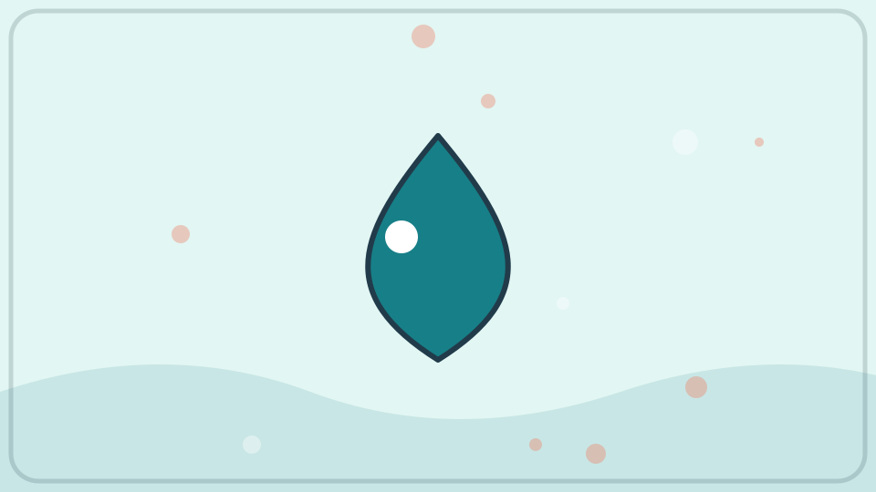

许多地方会从河流、湖泊、水库或地下取水。水厂用多道步骤去掉脏东西和有害微生物，再通过管道送到家里。不同地方的供水办法并不完全一样。

**再想一步：** 常见处理会让悬浮小颗粒聚集沉降，再经过过滤和消毒；具体步骤取决于水源。看起来透明不代表适合饮用，安全还需要检测看不见的微生物和物质。

**一起说说：** 找找家里哪些事情需要干净的水。

---

## 第 056 天｜肥皂为什么能洗掉油？

肥皂分子有一头喜欢水，一头容易靠近油。许多肥皂分子会围住油污，让水把它们带走。搓洗还能把藏在缝隙里的脏东西松开。

**再想一步：** 这种两头性质不同的分子叫表面活性剂。它们形成微小集合，把油藏在内部、让亲水的一头朝外，于是油能分散在水中被冲走。

**一起试试：** 和大人按“打湿、抹皂、搓洗、冲净、擦干”洗手。

---

## 第 057 天｜雨伞为什么不容易湿透？

伞布织得很密，表面还常有防水处理。水不容易钻进布里，会聚成水珠滚下去。用久或破损的伞也可能慢慢漏水。

**再想一步：** 防水表面让水与材料的吸引较弱，水滴接触角较大，就更容易滚落。真正的防水还依赖涂层完整、接缝设计和水压大小。

**一起看看：** 伞晾干前，观察水珠怎样在伞面上滚动。

---

## 第 058 天｜天气和气候是一回事吗？

天气是今天或最近的冷暖、风雨和云。气候是一个地方很多年常见的天气样子。今天下雪是天气；一个地方冬天通常很冷，是气候特点。

**再想一步：** 气候用长时间的平均值、变化范围和极端事件来描述，不等于“每天都一样”。一次冷天不能单独说明气候趋势，科学家要比较许多年、许多地方的数据。

**一起说说：** 先说今天的天气，再说这里的夏天常常怎样。

---

## 第 059 天｜天气预报怎么知道明天？

气象站、气球、雷达和卫星会测量空气、云和风。电脑用这些数据计算天气可能怎样变化。预报是有证据的猜测，越远的天气通常越难说准。

**再想一步：** 天气模型把大气分成许多小格，用物理规律一步步计算。初始测量不可能覆盖每一点，微小误差还会随时间放大，所以预报常用概率表达不确定性。

**一起看看：** 和大人比较今天的天空与天气预报说得像不像。
