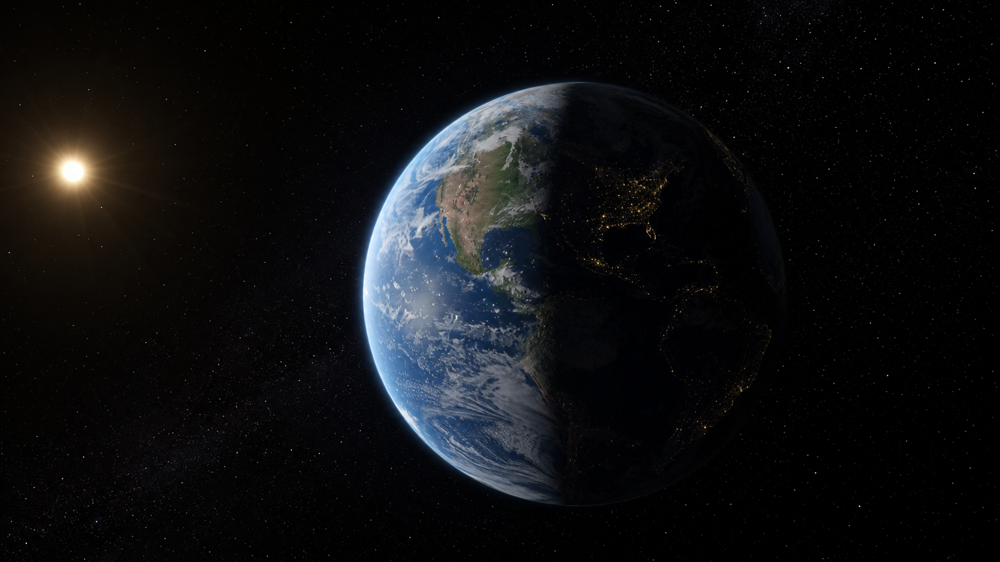
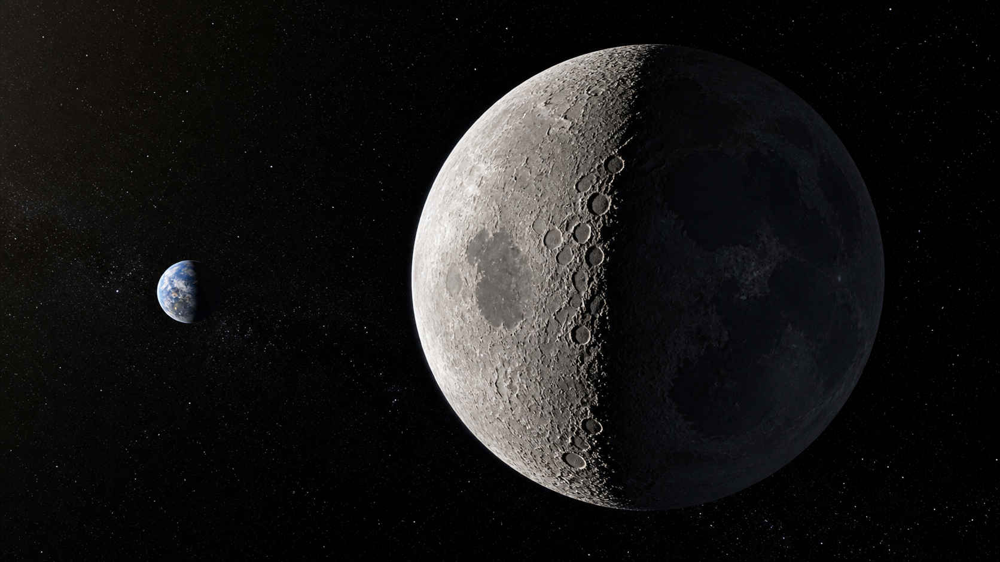
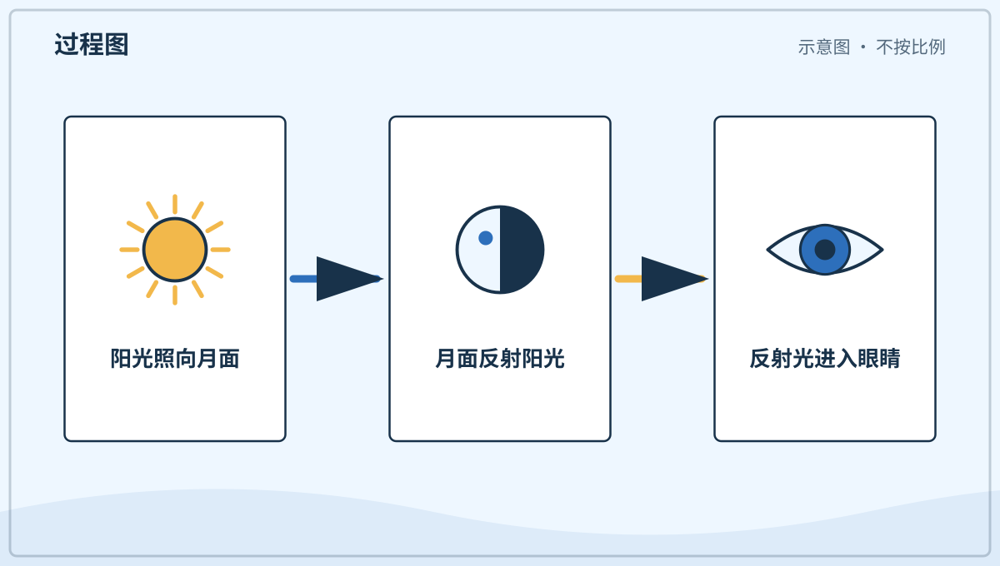
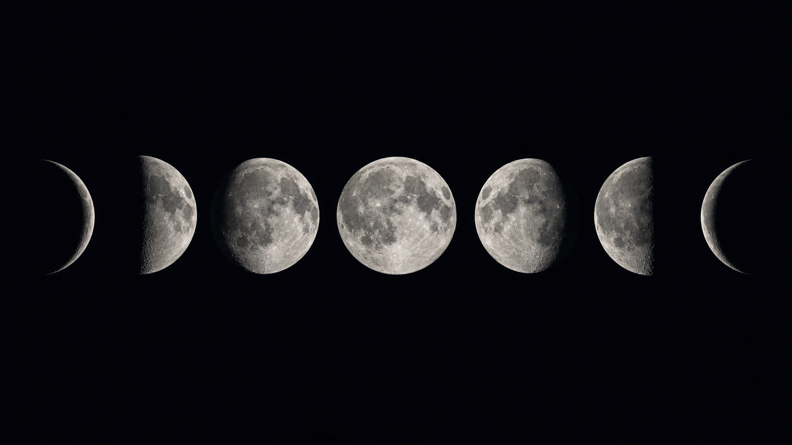
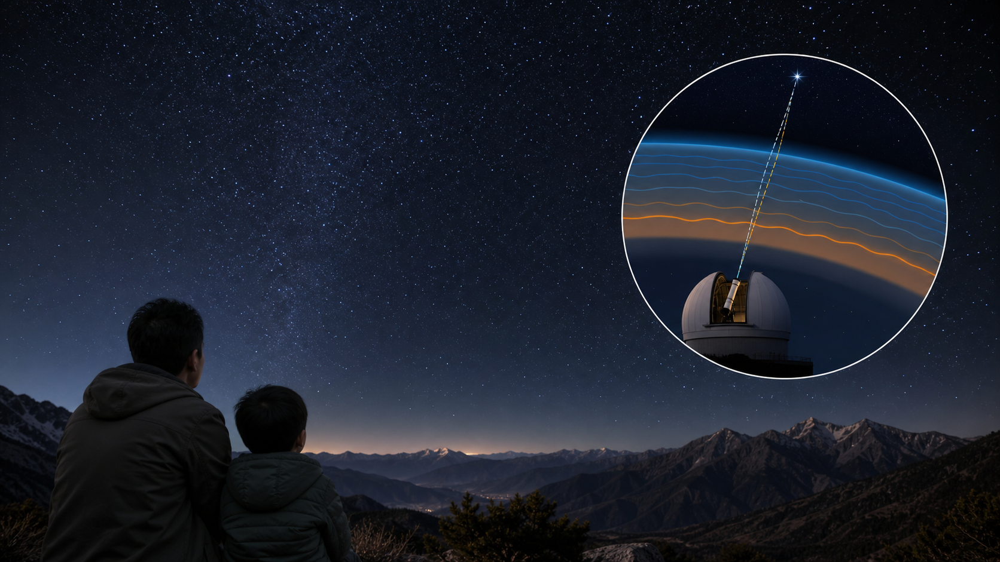
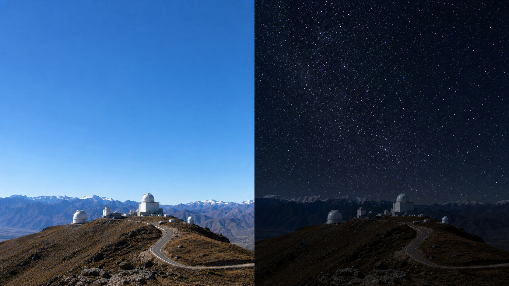
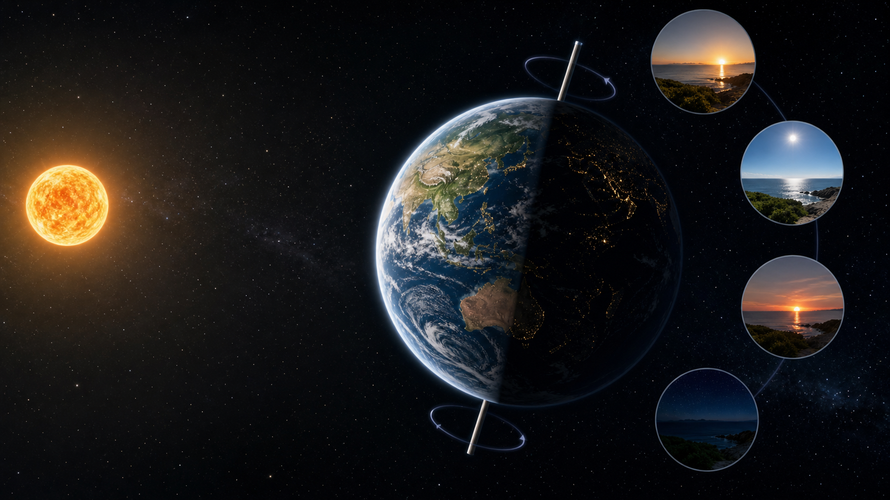
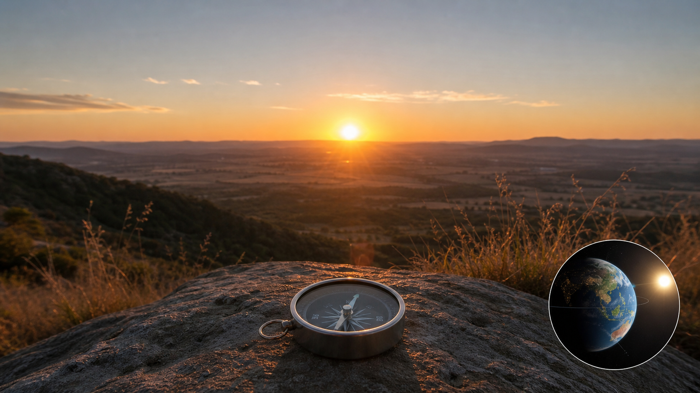
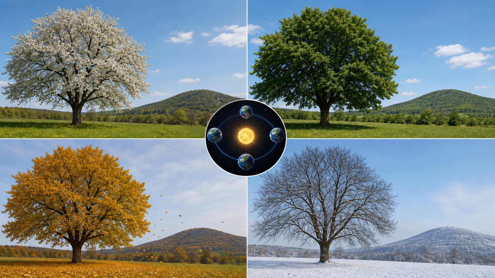
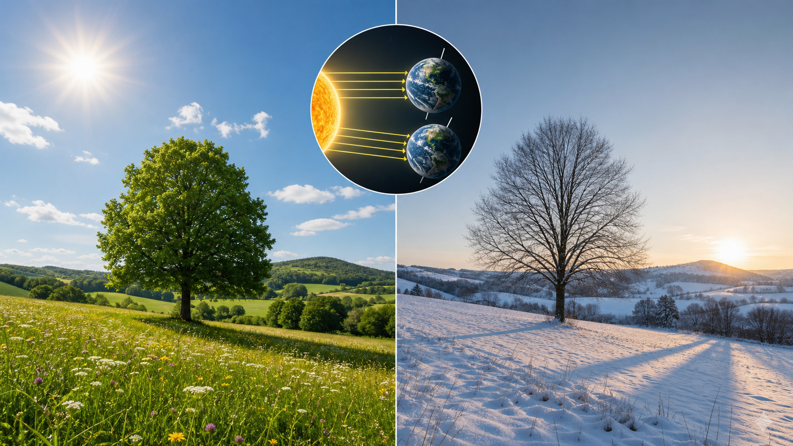

# 兴趣单元 02｜夜空、地球与季节

> **探索领域 01：** 光、天空、时间与冷暖
>
> **核心问题：** 昼夜、月相、星光和四季为什么按各自节律改变？

夜空看似每天都在换样子，背后却有地球自转、绕日运动、月球绕行和大气扰动几种不同原因。

## 怎样沿着本单元的追问链阅读

每次先分清谁在发光、谁在反光、谁在转动，以及变化需要多长时间。

## 追问链 02.1｜黑夜、月亮与星光

区分地球背向太阳、月面反光、月相变化与星光闪烁。

### 第 010 问｜夜晚为什么会变黑？

地球像陀螺一样不停转动。当我们住的这一面转到背向太阳的地方，阳光照不到这里，夜晚就来了。远处的灯和星星会在黑暗里更显眼。

**再想一步：** 地球任何时刻大约都有一半被太阳照亮，明暗交界叫晨昏线。夜晚不是太阳熄灭，而是我们随地球转到了背光的一面。

**把知识连起来：** 地球自转让不同地方依次进入阳光和阴影。太阳刚落下后，天空不会立刻全黑，因为高处大气仍被阳光照亮，并把光散到我们这里，这段时间叫暮光。再过一阵，太阳落到地平线更下方，背景才足够暗，较弱的星光逐渐显现。与此同时，地球另一边正从夜晚转向白天。

**再往外看：** 城市灯光会把夜空背景照亮，使暗星难以看见，这叫光污染。合理遮住向天空直射的灯光，既节约能源，也能保护夜行生物和人们观察星空的机会。

**容易弄混：** 黑暗不是一种从天空倒下来的物质，夜晚也不是太阳停止发光。它表示到达眼睛的可见光很少，而地球的遮挡是这种变化的主要原因。

*图解：太阳总照亮约半个地球；地球自转让同一地点轮流经过明暗两面。*

**一起看看：** 关掉一盏房灯，再找找原来不显眼的小亮光。

---

### 第 011 问｜月亮自己会发光吗？

月亮不会像太阳那样自己发出明亮的光。太阳照亮月亮，月亮再把一部分光反射给我们。所以夜里的月亮看起来亮亮的。

**再想一步：** 月面由岩石和尘土组成，会把阳光向许多方向散射。它只反射到达月面的部分阳光，却因为夜空很暗，在我们眼里仍然十分醒目。

**把知识连起来：** 月面明亮的高地和较暗的“月海”反射阳光的能力不同，所以望远镜里会出现深浅花纹。月亮反射的阳光总体并不多，只因夜空背景很暗才显得耀眼。新月前后，有时还能隐约看见月亮暗的一面，那是地球把阳光反射到月球，再由月球送回来的“地照”。这说明行星和卫星也能互相照亮。

**再往外看：** 月球几乎没有厚大气和流水去快速抹平地表，所以撞击坑能保存很久。探测器通过月面岩石、尘土和地形，追问月球怎样形成，也帮助理解早期太阳系。

**容易弄混：** 月光不是月亮制造的另一种冷光，它主要仍是阳光。月夜感觉凉，通常因为没有太阳持续加热地面，而不是月光把热吸走了。

*图解：阳光照到月面后向许多方向反射，其中一部分进入眼睛，让我们看见月亮。*

**一起看看：** 用手电照一只白球，看看球怎样被照亮。

---

### 第 012 问｜月亮为什么有时圆有时弯？

月亮一直是圆球。它绕着地球走时，我们看见的明亮部分会改变，于是有时像圆盘，有时像小船。不是谁把月亮咬掉了一块。

**再想一步：** 月相来自太阳、月亮和地球位置关系的变化，通常不是地球影子挡住月亮。只有月食发生时，地球的影子才真正落到月面上。

**把知识连起来：** 月亮绕地球运行时，面向太阳的半球始终被照亮，只是我们看到其中多少不断变化。从新月到上弦、满月、下弦再回到新月，大约经历二十九天半。月相还能告诉我们月亮大致在天空哪个方向、会在一天中的什么时候升起，例如满月常在日落附近从东方升起。

**再往外看：** 月相还进入了许多历法、潮汐观察和节日传统。不过潮汐由月球和太阳的引力共同影响，不能只用月亮看起来圆不圆来解释每一次当地水位变化。

**容易弄混：** 平常的月牙不是云遮住月亮，也不是地球影子盖住它。地球影子只有在太阳、地球和月亮接近排成直线的月食中才会落到月面。

*图解：月亮绕地球移动时，我们看见的受光部分不同，于是出现月相。*

**一起看看：** 连续几晚在大人陪同下看看月亮，画下亮的部分。

---

### 第 013 问｜星星为什么一闪一闪？

星光来到地球前，要穿过不停流动的空气。空气像许多轻轻晃动的透明小窗，让星光的方向和亮度微微改变。我们便觉得星星在眨眼。

**再想一步：** 冷热不同的空气密度不同，折射光的程度也不同。星星离得极远，在眼中近似一个小光点，所以大气的微小扰动就能明显改变它的亮度和位置。

**把知识连起来：** 天文学家把大气造成的星像抖动称为“视宁度”变化。靠近地平线的星光穿过更厚的大气，通常闪得更明显，还可能快速变换红蓝颜色。行星在望远镜里有一个很小的圆面，许多光点的变化会互相平均，所以常比恒星稳定。把望远镜送到太空，也能绕开大气扰动，得到更清楚的图像。

**再往外看：** 地面大型望远镜会选择空气稳定、干燥而黑暗的地点，还能用“自适应光学”快速改变镜面，补偿大气造成的抖动。观察条件与仪器本身同样决定图像清晰度。

**容易弄混：** 星星没有真的按我们看到的节奏开关。闪烁主要发生在星光穿过地球大气的最后一段路上，不代表恒星本身每秒忽明忽暗。

*图解：星光穿过密度不断变化的空气，传播方向和亮度会快速微调。*

**一起看看：** 找一颗亮星，安静看十秒，它的亮光稳不稳？

---

### 第 014 问｜白天星星去哪儿了？

白天星星还在天空中。只是阳光被空气散向四周，天空变得很亮，微弱的星光就不容易被眼睛分辨。像小夜灯开在明亮的房间里，不太显眼。

**再想一步：** 能不能看见一个物体，不只看它有多亮，还看它和背景的亮度差，这叫对比。白天天空的亮背景压低了星光的对比，星星没有因此消失。

**把知识连起来：** 眼睛能否分辨星星，取决于星光与天空背景的对比。白天散射的阳光让背景亮了很多，瞳孔也缩小，普通星光便被淹没；很亮的金星、月亮或特殊条件下的明亮恒星仍可能在白天被看见。天文望远镜会收集更多光，但白昼背景同样会增加，因此观测者还要选择目标、滤光方法和安全条件。

**再往外看：** 白天寻找月亮可以用建筑物遮住太阳，但任何时候都不能用肉眼、望远镜或普通墨镜直视太阳。观察能力越强的仪器，若没有专用太阳滤镜，伤眼风险反而越大。

**容易弄混：** 星星白天没有躲到地球后面，也没有全部熄灭。它们仍在原来的方向，只是我们的眼睛通常无法把微弱星光从明亮天空中分出来。

**一起看看：** 白天和夜晚都开同一盏小灯，比比哪次更醒目。

## 追问链 02.2｜昼夜轮流与四季冷暖

从地球自转进入地轴倾斜和绕日运动，不把季节归因于简单的远近。

### 第 015 问｜白天和夜晚怎样轮流来？

地球大约一天转一圈。朝向太阳的一面是白天，背向太阳的一面是夜晚。地球不停转，我们住的地方便轮流走进光明和黑暗。

**再想一步：** 地球绕一条想象中的轴自转，这条轴穿过南北极附近。相对于远处星星，地球转一圈略少于 24 小时；日常的一天按太阳再次回到相近天空位置来计算。

**把知识连起来：** 地球自转一次形成昼夜节律，但世界各地不会同时正午。人们按经度附近的太阳时间划出时区，让相近地区共用钟表时间；跨过时区，钟上的小时会改变。因为地球继续绕太阳运行，以远方恒星为参照转一圈约二十三小时五十六分，而太阳再次回到相近位置平均要二十四小时，这两种“一圈”参照物不同。

**再往外看：** 精确时间让列车、通信网络和卫星导航能够协同。不同地点的钟表虽然显示不同时区，背后仍要使用统一标准对齐；时间既来自自然周期，也依靠共同测量。

**容易弄混：** 一天不是宇宙中所有地方都必须使用的固定长度。二十四小时是以地球和太阳的关系建立的时间尺度，别的行星自转快慢不同，它们的“一天”也不同。

**一起看看：** 请大人用手电照着球，慢慢转球看明暗两面。

---

### 第 016 问｜为什么早晨太阳在东边？

地球从西向东转，所以我们看起来像是太阳从东方升起，再向西方落下。其实一天里主要是我们跟着地球在转。太阳没有每天绕地球一圈。

**再想一步：** 这种由观察者自身运动造成的变化叫视运动。坐车时近处景物像向后跑，也是相似的观察效果，但两种运动的具体原因不同。

**把知识连起来：** 地球自西向东转，我们所在的地面先把东方地平线带进阳光，所以太阳看起来从东边升起。太阳在天空走过的弧线会随季节和地点改变：只有接近春分、秋分时才大致从正东升起，夏冬的日出位置会向北或向南移动。观察一年中日出点的变化，也能读出季节。

**再往外看：** 知道太阳大致从哪边升落，能帮助辨认方向，但不能代替地图和指南针。高山、楼房和极昼极夜都会改变实际可见的日出，导航时需要多种线索互相核对。

**容易弄混：** “太阳从东方升起”是方便的概括，不表示每天都从指南针的正东刻度升起。准确方向还受纬度、季节和当地地平线形状影响。

**一起看看：** 问问大人，家里的哪扇窗最先照进晨光。

---

### 第 017 问｜一年为什么有春夏秋冬？

地球绕太阳走，身体还微微斜着。走到不同位置时，一些地方得到的阳光多少和时间会改变，于是有了季节。南北半球的季节还会相反。

**再想一步：** 季节的主因是地轴倾斜，不是地球有时离太阳近、有时远。某个半球朝太阳倾斜时，阳光更直，白天更长，通常就更暖。

**把知识连起来：** 地轴相对公转轨道方向保持大致相同的倾斜。北半球朝向太阳时，阳光更直、白昼更长，南半球却得到较斜的阳光，于是两边季节相反。春分和秋分附近，南北半球接受阳光较均衡；夏至和冬至附近，昼夜长短差别最大。靠近赤道的地方，太阳高度和白昼长度全年变化较小，四季也不一定像温带那样明显。

**再往外看：** 季节变化会影响植物开花、动物迁徙和农业安排。科学家长期记录这些生物事件的日期，能研究生态系统怎样回应温度、降水和气候的长期变化。

**容易弄混：** 季节不等于每三个月天气必然整齐改变。季节是长期日照规律，实际冷暖还受海洋、海拔、风和当地气候影响。

*图解：地轴保持倾斜；一个半球朝向太阳时，阳光更直、白天更长。*

**一起看看：** 说说现在的树、衣服和白天跟上个季节哪里不同。

---

### 第 018 问｜冬天为什么冷？

冬天的太阳在天空中比较低，白天也常常较短。阳光斜斜地铺开，同一块地面得到的能量较少。空气和地面便不容易暖起来。

**再想一步：** 同一束光斜着落下，会把能量分摊到更大的地面上。冬天夜晚较长，地面向外散热的时间也更久，这两件事共同影响温度。

**把知识连起来：** 冬季斜射的阳光把相同能量摊到更大面积，较短的白昼又减少了加热时间；长夜让地面有更多时间向外放出红外辐射。积雪会反射许多阳光，进一步减慢升温。海洋能储存大量热，所以沿海冬季常比同纬度内陆温和，说明气温不只由太阳高度一个因素决定。

**再往外看：** 同一个冬季也会有暖天和寒潮，因为天气系统仍在移动。季节描述几个月的日照背景，天气描述几天甚至几小时的空气状态，两种尺度要分开看。

**容易弄混：** 冬天通常不是因为地球离太阳更远。事实上北半球冬季附近，地球反而接近轨道上离太阳较近的位置；地轴倾斜和日照时间才是季节冷暖的主因。

**一起看看：** 找找冬天太阳照进屋里的位置，和夏天记忆里一样吗？

## 单元综合观察｜画两种不同的转动

用一盏固定灯代表太阳，一个球代表地球。先让球自转表现昼夜，再让倾斜的球绕灯移动讨论季节；明确模型没有按真实大小和距离制作。
