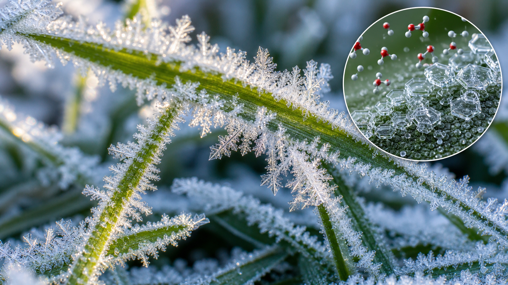
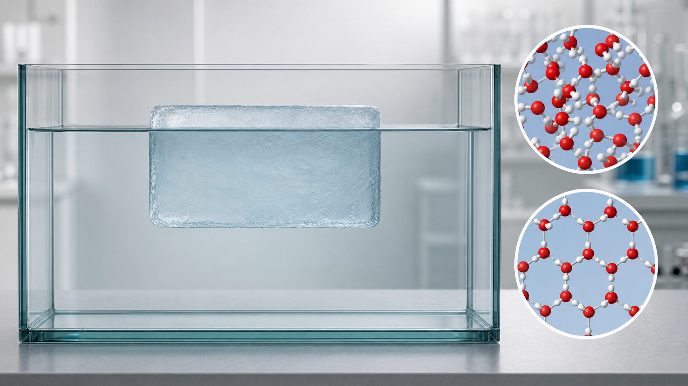
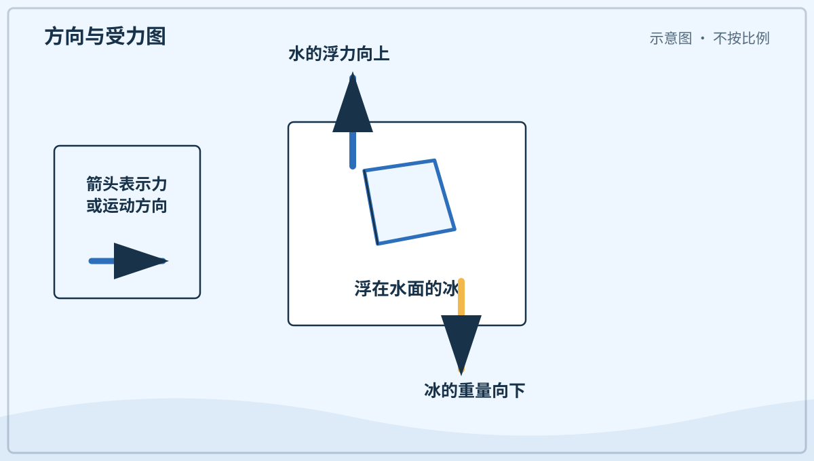
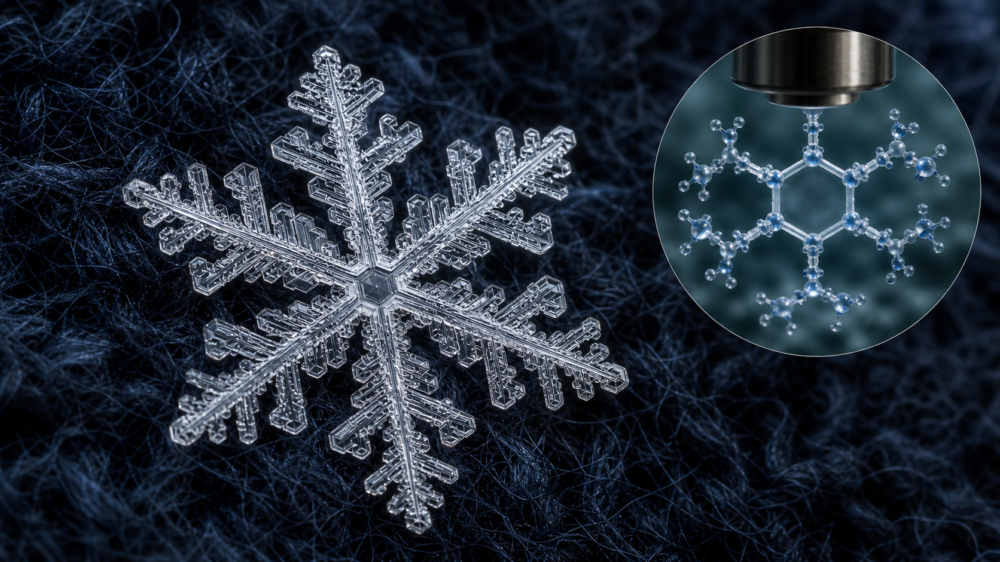
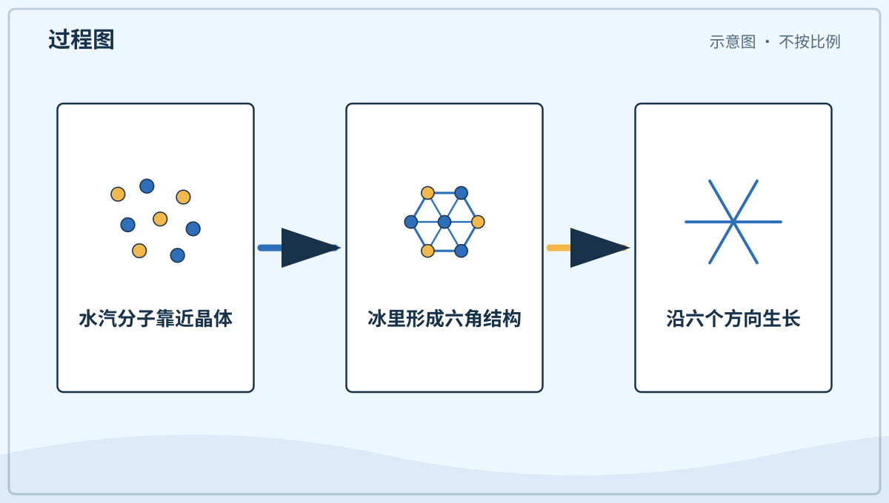
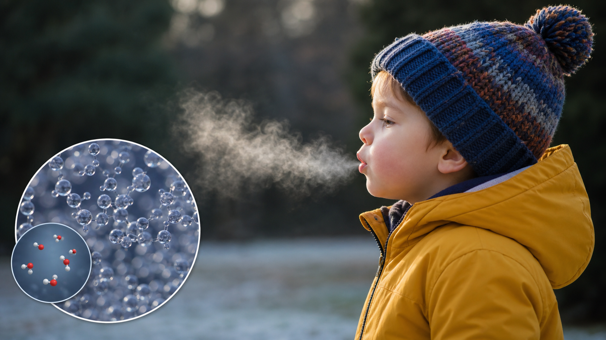
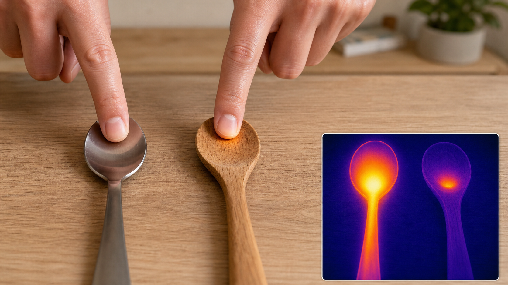
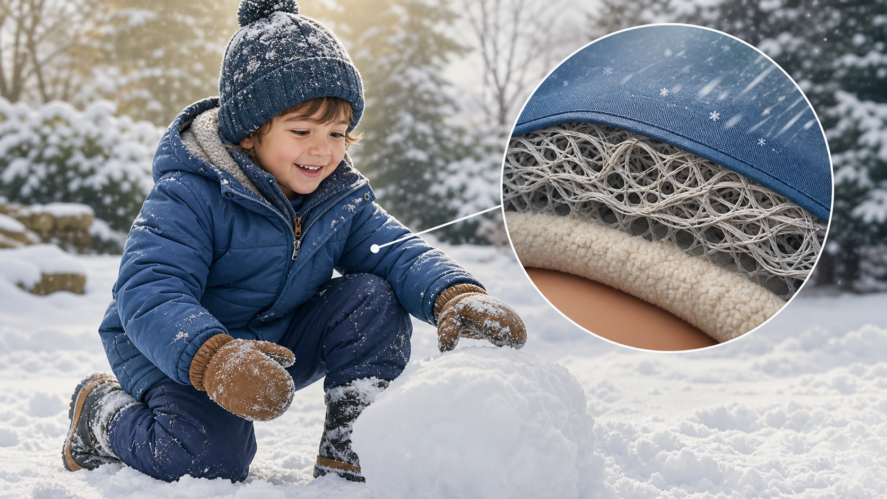
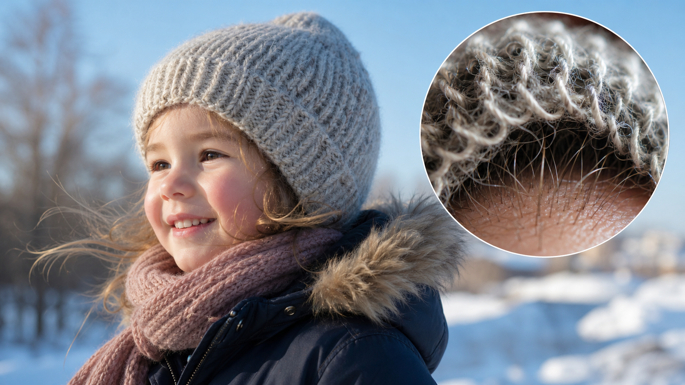

# 兴趣单元 03｜寒冷、冰雪与保温

> **探索领域 01：** 光、天空、时间与冷暖
>
> **核心问题：** 水为什么会结成不同形态，材料又怎样改变热传递的速度？

霜、冰、雪和白气先帮助孩子分清水的状态，金属触感、衣服和帽子再把观察连到热量怎样移动。

## 怎样沿着本单元的追问链阅读

不要把冷当成一种流进身体的东西；比较的是热从哪里流向哪里、流得多快。

## 追问链 03.1｜霜、冰、雪与白气

比较凝华、冻结、冰的结构、雪晶生长和水滴凝结。

### 第 019 问｜草叶上的白霜是什么？

寒冷的夜里，草叶会变得很凉。空气里的水汽碰到很冷的叶面，可能直接变成细小冰晶，这就是霜。太阳一晒，霜会慢慢融化。

**再想一步：** 水汽不先变成液态水，直接变成固态冰的过程叫凝华。叶面温度低于冰点且附近水汽足够时，冰晶会沿着表面一点点长大。

**把知识连起来：** 晴朗少风的夜里，地面会向天空辐射热量，草叶温度可能降得比周围空气还低。当叶面低于水汽形成冰晶所需的温度，水分子便直接附着并排列成霜。不同表面散热速度不同，所以同一院子里草叶有霜，墙边或树下却可能没有。霜还能显示细小冰晶沿叶脉和划痕生长的方向。

**再往外看：** 霜会让植物细胞里的水结冰并造成伤害，农人会用覆盖、灌溉或空气搅动等办法减轻风险。是否结霜要看叶面温度，不能只看气象站报告的空气温度。

**容易弄混：** 霜不一定是露珠先结冰。水汽直接变成冰晶叫凝华；已有液态露水再冻结也会形成冰，但两条路径不同。

**一起看看：** 只用眼睛观察霜的边缘，别踩坏结霜的植物。

---

### 第 020 问｜冰为什么能浮在水上？

水结冰时，里面的小小水分子排得更松。同样质量的水结成冰后会占更大地方；同样体积的冰又比液态水质量小。换句话说，冰的密度较小，所以常常浮在水面。

**再想一步：** 密度表示单位体积里有多少质量。冰的晶体结构留下较多空隙；放进水中后，它排开水所得到的浮力能够与自身重量平衡，于是浮在水面。

**把知识连起来：** 水分子结冰时会用氢键排成较开放的晶格，留下比液态水更多的空隙，因此体积膨胀、密度下降。湖面先结冰后，浮冰像一层盖子，减慢下面水体继续散热，使湖底不容易全部冻实，水生生物因而还有可生存的液态水。水的这种反常性质对地球生态十分重要。

**再往外看：** 水结冰膨胀还能进入岩石裂缝，反复冻融使裂缝扩大，参与塑造山地和土壤。冰浮水面、冻裂岩石和水管防冻，看似不同，其实都连到同一种体积变化。

**容易弄混：** 不是所有固体都比自己的液体轻。大多数物质凝固后排列更紧、密度更大；冰浮水面是水分子结构带来的特殊情况。

*图解：冰排开水获得向上的浮力；浮力与重量平衡时，冰便浮着。*

**一起看看：** 请大人把冰块放进一杯水里，看它露出多少。

---

### 第 021 问｜雪花为什么像小星星？

云里的水汽在寒冷中结成冰晶。冰晶按自己的形状生长，常常长出六个方向的枝杈。每片雪花走过的云不同，花纹也会不同。

**再想一步：** 水分子结冰时容易排成六角形结构，所以雪晶常有六重对称。温度和湿度沿途变化，会决定枝杈长得细、宽、长还是短。

**把知识连起来：** 一个小冰晶在云中下落或被气流托起时，会经过温度和湿度不同的区域。六个方向处在几乎相同环境里，所以常长出相似枝杈；沿途条件一变，枝杈又会同时改变粗细和分叉方式。雪晶不都像枝状星星，也可能是六角薄片、柱状或针状。落地时多个雪晶还会粘成我们平常说的一片雪花。

**再往外看：** 许多雪晶聚成积雪后，内部还会继续变形、压实和融冻。积雪能储存冬季降水，春季融水补给河流；它既是漂亮晶体的集合，也是水循环的一座临时仓库。

**容易弄混：** “每片雪花都有六个角”也是简化说法。六角对称来自晶格，但碰撞、融化和生长不均会让真实雪晶缺角或变形。

*图解：水分子结冰时形成六角结构，雪晶因而常沿六个对称方向生长。*

**一起看看：** 下雪时用深色手套接一片，短短看一眼再让它融化。

---

### 第 022 问｜冷天说话为什么冒白气？

我们呼出的气里有温暖的水汽。它碰到冷空气，会变成许多很小的水滴，看起来像一团白雾。那不是烟，也不是嘴里着火了。

**再想一步：** 气体变成液体小滴叫凝结。暖空气能容纳的水汽通常更多；呼气一冷却，超过空气能容纳的部分就聚成看得见的小滴。

**把知识连起来：** 呼出的空气经过肺和口腔，温度高、含水汽多。进入冷空气后，它很快冷却到露点以下，多余水汽聚成直径很小的液滴；这些小滴把各种颜色的光散开，于是看成白色。液滴继续与干冷空气混合后会再次蒸发，所以白气通常只在嘴边停留一小段距离。

**再往外看：** 雾、云和呼气白雾都由悬浮小水滴或冰晶造成，只是出现位置和形成环境不同。把它们放在一起比较，可以看见“冷却、凝结、散射”这条共同因果链。

**容易弄混：** 真正的水汽是气态水分子，肉眼看不见。我们看到的白气与云、雾相似，主要是已经凝结出来的微小液滴。

**一起看看：** 在冷空气里轻轻哈气，观察白雾多久会散开。

## 追问链 03.2｜导热与保温

材料触感取决于导热速度，衣物里的静止空气会减慢热量散失。

### 第 023 问｜金属为什么摸起来更凉？

同一个房间里，金属和木头可能温度差不多。金属能更快带走手上的热，所以手觉得它更凉。我们的感觉也会受热传得快不快影响。

**再想一步：** 材料传递热量的本领叫导热性。皮肤感到的“冷”常与热量离开皮肤的速度有关，所以触感不能总当作准确温度计。

**把知识连起来：** 手的温度通常高于室内物品，接触后热会从手流向物体。金属里自由电子能迅速传递能量，接触处不断有新的低温部分来接走热，皮肤温度下降快；木头和织物导热慢，贴近手的薄层很快被暖起来，热流随后减小。因此触觉更像“热流速度计”，而不是直接读出物体温度。

**再往外看：** 锅具需要导热快，把热送给食物；保温杯和建筑墙体却希望导热慢，阻止热流。材料没有简单的“好”与“坏”，要看我们希望热量快走还是慢走。

**容易弄混：** 金属不一定真的比木头温度低。把两者在同一房间放足够久，温度可很接近；用温度计测量比只靠手摸更可靠。

*图解：金属把皮肤的热量传走得较快，因此同温度下摸起来更凉。*

**一起看看：** 只摸室温下的金属勺和木勺，不碰刚加热过的东西。

---

### 第 024 问｜衣服怎么把人变暖？

衣服不会自己制造很多热。它把身体周围的一层空气留住，让身体的热不那么快跑掉。蓬松的衣服能留住更多小空气层。

**再想一步：** 静止空气导热较慢，衣服还会减弱空气流动带走热量的过程，也就是对流。衣服湿透后空气层减少，水又更容易传热，所以会觉得更冷。

**把知识连起来：** 身体通过代谢不断放热，衣服的任务是减慢热量经传导、对流和辐射离开。许多细小纤维把空气分隔成不易流动的小格，叠穿几层还能在层与层之间保留空气。外层挡风，能减少暖空气被冷空气换走；干燥蓬松的中层负责保温。运动量、环境温度和是否出汗不同，需要的衣物组合也不同。

**再往外看：** 鸟的羽毛、哺乳动物的绒毛和建筑保温棉也靠困住空气减慢传热。比较这些结构，会发现生物和工程常在不同材料中解决相似的保温问题。

**容易弄混：** 衣服越厚不一定永远越暖。衣服太紧会压扁空气层，湿衣服会加快传热，出汗后不透气也可能让人随后变冷。

**一起看看：** 轻轻捏一捏棉衣，感觉里面是不是松松软软。

---

### 第 025 问｜为什么戴帽子也会暖和？

头部也会把身体的热传给周围空气。帽子盖住头，留住一层空气，就能减慢热量离开。帽子不是只给耳朵穿的小衣服，它也保护头皮。

**再想一步：** 身体各处都可能散热，露在外面的面积、风和衣物都会影响快慢。头部并不是在所有情况下都固定散失某个特别比例的热，帽子有用是因为它盖住了原本暴露的部位。

**把知识连起来：** 头皮、耳朵和脸部都有血流，也会通过传导、对流和辐射把热送到环境。帽子减少暴露面积并挡风，盖住耳朵的款式还能保护突出、容易受冷的部位。身体会调节皮肤血管来改变散热，所以感觉冷时不只是某一个部位的问题。选择帽子应同时看气温、风、是否潮湿和活动强度。

**再往外看：** 身体还会通过发抖增加产热、收缩皮肤血管减少散热。帽子是外部保温的一部分，人体调节是内部反应；两者配合，才形成完整的冷环境应对。

**容易弄混：** “身体一半的热都从头顶跑掉”不是固定规律。哪一处没被衣物覆盖，哪一处就可能成为明显散热面；帽子的作用来自覆盖与保温，不是头部有神秘漏热点。

**一起看看：** 摸摸帽子的里面和外面，找找哪一面更柔软。

## 单元综合观察｜比较材料怎样传热

在同一房间摸木勺和金属勺的手柄，只作短暂比较，不接触热源。讨论它们温度可能相近，为什么皮肤失去热量的速度不同。
