# 三月：一粒种子的旅行

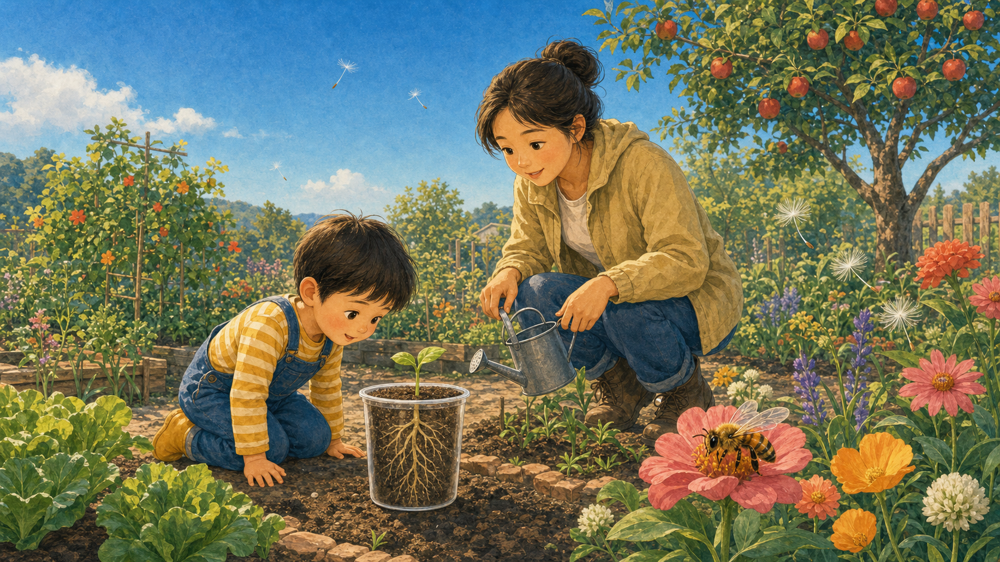

## 第 060 天｜种子里面藏着什么？

许多种子里藏着一个很小的植物胚，还有给它刚开始生长用的食物。外面的种皮像保护外套。条件合适时，小植物就会醒来生长。

**再想一步：** 胚已经有将来形成根、茎和叶的基本部分。储存的淀粉、油或蛋白质会被分解，为幼苗还不能充分光合作用的早期提供材料和能量。

*图解：种皮保护内部；子叶或胚乳储存养料，胚会长成新的根和芽。*

**一起看看：** 请大人剖开一颗泡软的豆子，找找里面的小芽。

---

## 第 061 天｜种子怎样知道可以发芽？

种子通常需要水、空气和合适的温度。吸到水后，种子里的生长活动会重新开始。不同植物喜欢的条件不完全一样，有些种子还需要光或寒冷。

**再想一步：** 吸水会让种皮和内部组织膨胀，并启动酶的工作；酶是帮助化学反应进行的分子工具。种子也要呼吸，所以完全泡在缺氧水中未必能健康发芽。

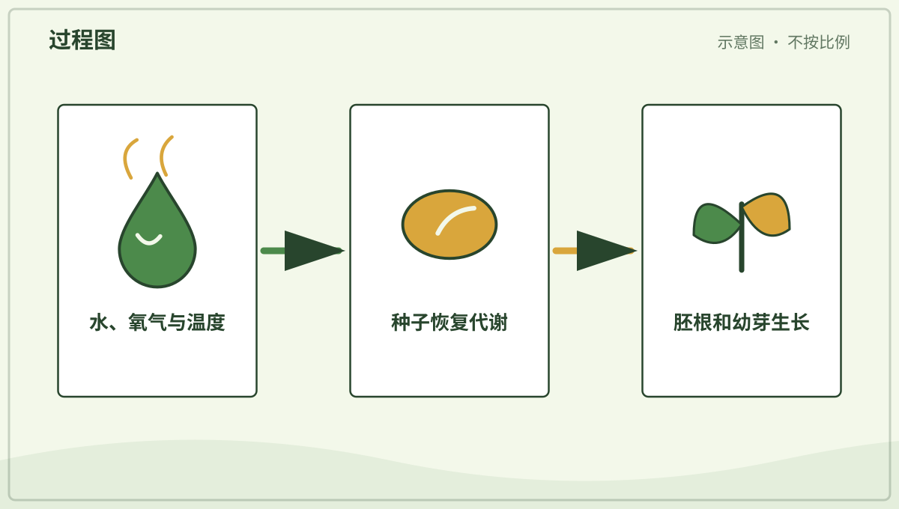

*图解：种子得到适量水、氧气和合适温度后，代谢启动并开始发芽。*

**一起试试：** 把豆子放在湿纸巾上，由大人保持湿润，每天看一眼。

---

## 第 062 天｜发芽时为什么先长根？

许多种子发芽时，最先伸出的部分会成为根。根把幼苗固定住，还能吸收水和矿物质。接着，小芽再向有光的方向长。

**再想一步：** 小根通常表现向重力性，会顺着重力方向生长；幼茎则常向上并向光。植物没有眼睛，却能用细胞里的感受系统判断重力和光的方向。

*图解：胚根先伸出，帮助固定幼苗并吸收水；随后幼芽向光处生长。*

**一起看看：** 观察发芽豆子的白色小根朝哪边弯。

---

## 第 063 天｜植物的根在忙什么？

根像许多细细的地下通道。它固定植物，也从土壤里吸收水和溶在水中的矿物质。有些根还会储存食物，比如胡萝卜的粗根。

**再想一步：** 根尖附近的根毛把接触土壤的面积增大，水可通过细胞膜进入。根还会和真菌、细菌相互作用，地下并不是只有植物自己工作。

*图解：根毛扩大吸收面积，水和矿物质进入根后由木质部向上运输。*

**一起看看：** 观察一棵连根拔起的杂草，只看不品尝。

---

## 第 064 天｜茎为什么要站起来？

茎支撑叶子和花，让它们接近阳光和传粉动物。茎里面还有运输水、矿物质和糖的细小通道。柔软的草茎和坚硬的树干都是茎。

**再想一步：** 木质部主要把水和矿物质向上输送，韧皮部把叶子制造的糖送往生长或储藏处。两套组织共同连接根、叶、花和果实。

**一起看看：** 找一根草茎和一段树枝，比比软硬和粗细。

---

## 第 065 天｜叶子为什么又薄又平？

薄而平的叶子能接住较多阳光，也方便空气里的气体进出。叶脉把水送进来，再把叶子制造的糖运走。不同环境会长出不同形状的叶子。

**再想一步：** 叶片表面的气孔能开合，控制二氧化碳进入和水汽离开。叶子要在获得气体与少丢水之间取得平衡，所以干旱植物的叶形常很特别。

*图解：叶片薄而平，能接收较多光并缩短二氧化碳进出细胞的距离。*

**一起看看：** 把两片落叶放在一起，比比叶脉像不像小路。

---

## 第 066 天｜大多数叶子为什么是绿色？

叶子里常有一种叫叶绿素的物质。它吸收红光和蓝光较多，绿色的光更多被反射到眼睛里，所以叶子看起来绿色。也有红色、紫色或带花纹的叶子。

**再想一步：** 叶绿素位于细胞的叶绿体中，负责捕捉光能。其他色素也一直存在；秋天叶绿素减少时，黄色和橙色等颜色便更容易显现。

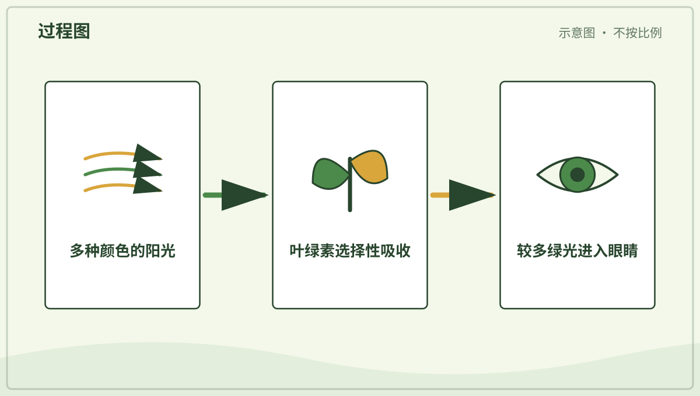

*图解：叶绿素吸收较多红光和蓝光，更多绿光被反射进眼睛，叶子便显绿色。*

**一起看看：** 找三种深浅不同的绿叶，不采也能观察。

---

## 第 067 天｜植物也要“吃饭”吗？

绿色植物用阳光的能量，把水和空气里的二氧化碳做成糖。这个过程叫光合作用。糖给植物提供生长用的材料和能量。

**再想一步：** 光合作用还会释放氧气，其中的氧主要来自被分解的水。植物不会把阳光直接“吃进肚子”，而是把光能转存进糖分子的化学能中。

*图解：叶绿体利用光能，把水和二氧化碳转成糖，并释放氧气。*

**一起说说：** 植物做“饭”要用到阳光、水和哪一种空气里的气体？

---

## 第 068 天｜植物会呼吸吗？

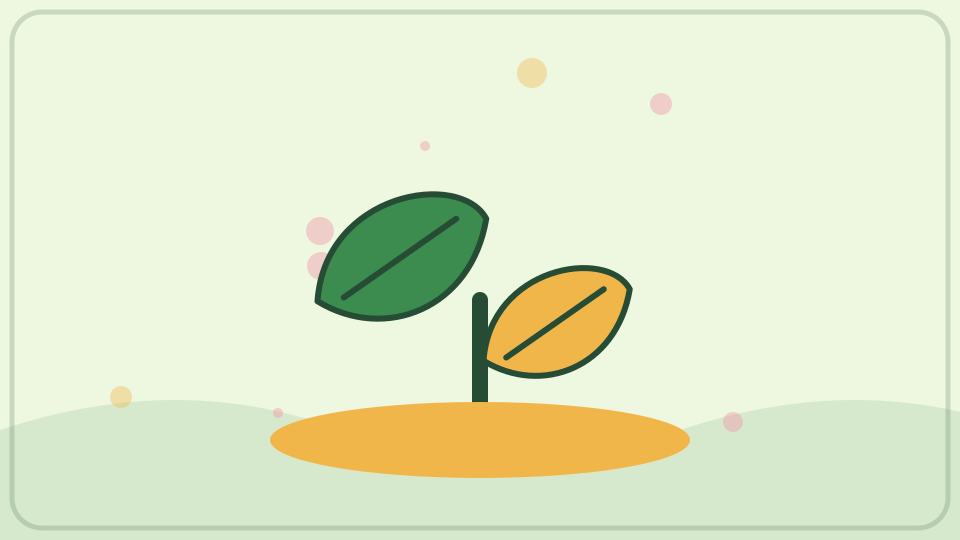

会。植物的细胞白天黑夜都会呼吸，用氧气帮助释放食物里的能量。绿色部分在有光时还会进行光合作用，通常放出氧气。两个过程不是同一件事。

**再想一步：** 呼吸作用发生在植物、动物和许多微生物的细胞中，用糖和氧释放可利用的能量。白天绿色植物的光合作用常强于呼吸，所以整体上吸收二氧化碳、释放氧气。

*图解：光合作用储存能量，细胞呼吸再用氧气分解有机物释放可用能量。*

**一起看看：** 找找叶片背面，那里常有许多眼睛看不见的小气孔。

---

## 第 069 天｜花为什么有颜色和香味？

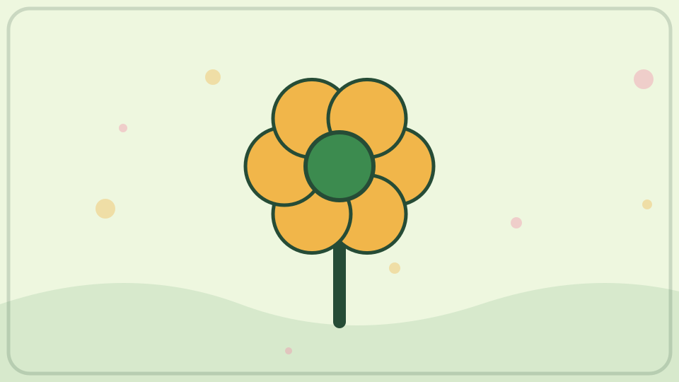

许多花的颜色、气味和形状能吸引昆虫、鸟或其他传粉动物。它们来取花蜜或花粉，也可能把花粉带到另一朵花。并不是所有花都香，也有花靠风传粉。

**再想一步：** 花是被子植物的繁殖器官，花瓣只是其中一部分。不同传粉者能看见、闻到或够到的东西不同，长期演化让许多花形成了不同的信号和结构。

**一起闻闻：** 只闻大人确认安全的花，不把花放进嘴里。

---

## 第 070 天｜花粉是什么？

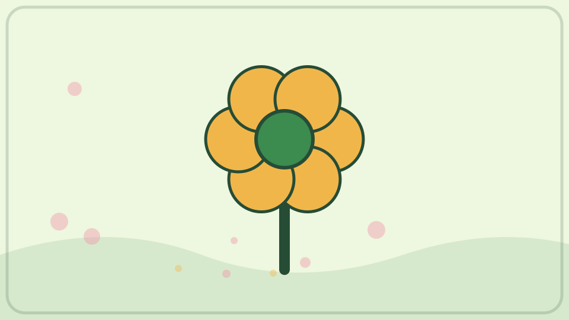

花粉是种子植物繁殖时需要的细小颗粒。它常从花的一部分来到同种植物合适的另一部分，帮助种子形成。花粉很小，有的人接触后会打喷嚏。

**再想一步：** 花粉粒是微小的雄性配子体，会形成或带着精细胞；落到合适的柱头后，可长出花粉管，把精细胞送向胚珠。传粉只是移动花粉，受精是随后发生的另一个步骤。

**一起看看：** 只观察花心的粉末，不用手抹，也不靠得太近。

---

## 第 071 天｜蜜蜂怎样帮花结果？

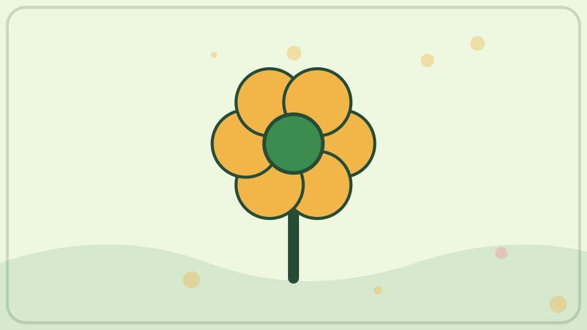

蜜蜂访问花朵收集花蜜和花粉。花粉会粘在它毛茸茸的身体上，再被带到别的花。这样能帮助许多植物形成种子和果实。

**再想一步：** 花与蜜蜂之间常是互利关系：蜜蜂得到食物，植物提高传粉机会。但传粉者不只有蜜蜂，蝴蝶、蛾、甲虫、鸟、蝙蝠和风也能参与。

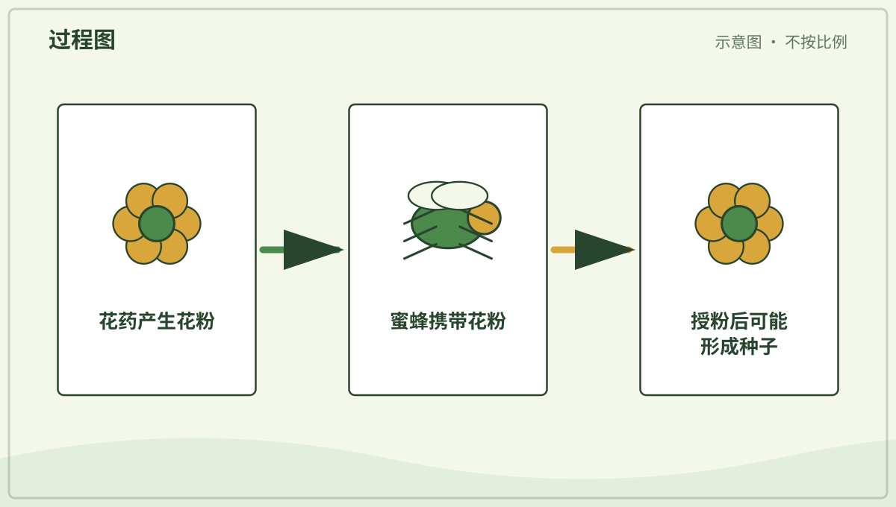

*图解：蜜蜂身上沾到花粉，再把花粉带到另一朵同种花的柱头。*

**一起看看：** 从远处看蜜蜂停在哪朵花上，不追赶也不触碰。

---

## 第 072 天｜果实为什么包着种子？

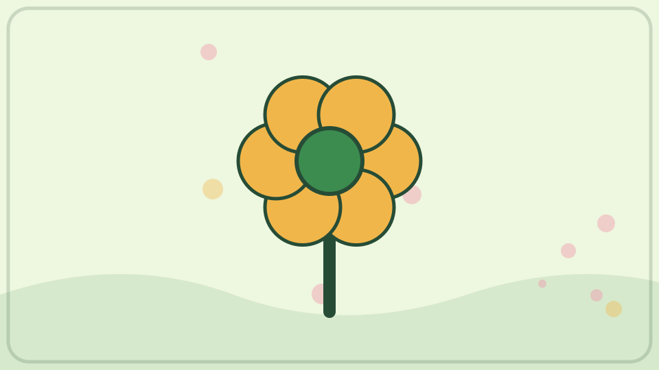

花完成传粉和受精后，一些部分会慢慢长成果实。果实能保护种子，也常帮助种子旅行。苹果、番茄和豆荚都是不同样子的果实。

**再想一步：** 在植物学里，果实通常由花的子房发育而来，所以番茄、黄瓜和辣椒也属于果实。日常烹饪里的“水果”和“蔬菜”是另一套分类方法。

**一起看看：** 请大人切开一种水果，数数能看见几颗种子。

---

## 第 073 天｜蒲公英为什么有小降落伞？

蒲公英种子上有一圈细毛，能增加空气的托力和阻力。风一吹，它们就能慢慢飘到别处。落在合适地方的种子可能长成新植物。

**再想一步：** 细毛形成的冠毛会制造一圈稳定空气旋涡，让种子下降得更慢。停留在空气中的时间越长，风就越有机会把它带远。

*图解：蒲公英冠毛增大空气阻力，让种子下落较慢并被风带远。*

**一起看看：** 看一颗种子怎样随风走，不把它吹进别人家或保护区。

---

## 第 074 天｜有些种子为什么会粘裤脚？

有些果实或种子长着小钩、刺或黏的表面。它们搭在动物毛或人的衣服上，走一段路后再掉下来。这样，植物不用长脚也能搬家。

**再想一步：** 这种借动物外表传播叫附着传播。钩刺只需牢固到能搭一程，又能在摩擦中掉落；类似结构也启发人类发明了粘扣带。

*图解：果实上的钩刺先挂住毛或布料，同行一段后又在摩擦和碰撞中掉落。*

**一起看看：** 由大人取下粘在衣服上的种子，用放大镜找小钩。

---

## 第 075 天｜椰子为什么能漂在海上？

椰子的外层有许多纤维，还能包住空气，帮助它浮水。厚厚的外壳保护里面的种子。有些椰子能随海水漂到新的海岸。

**再想一步：** 平均密度小于水的物体会得到足够浮力而漂浮。纤维层既降低整体密度，也能缓冲碰撞和减慢盐水进入种子。

**一起看看：** 从图片上找椰子的纤维外衣和硬壳。

---

## 第 076 天｜树干里的圆圈是什么？

许多树每年会长出一层新的木材。生长快慢不同，木材颜色和密度也会有变化，于是横切面上出现一圈圈年轮。年轮能帮助科学家研究树的过去。

**再想一步：** 温带树木的早材常生长快、细胞较大，晚材较密，于是形成明显边界。年轮宽窄受水、温度、竞争和损伤等多种因素影响，不能只用一圈简单讲完一年天气。

*图解：形成层每年增加新组织；生长快慢不同会留下可辨认的年轮。*

**一起看看：** 只观察已经切好的木片，不伤害活树。

---

## 第 077 天｜树皮有什么用？

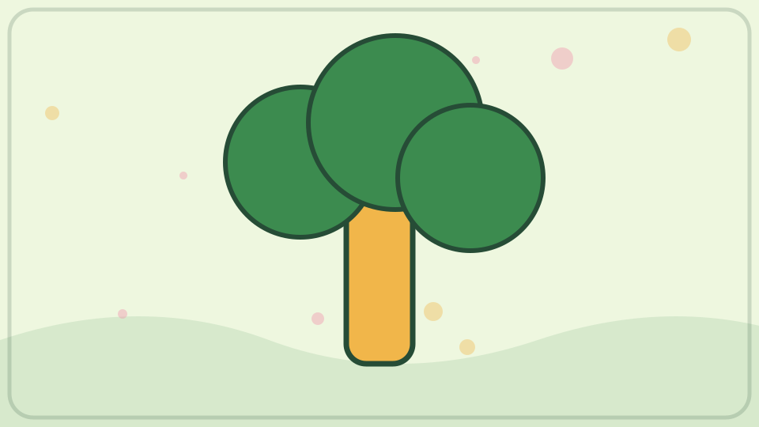

树皮包在树干和树枝外面。它能减少水分流失，也帮助抵挡碰撞、病菌和一些小动物。不同树的树皮会光滑、粗糙、开裂或一片片脱落。

**再想一步：** 树皮包括外侧保护组织和内侧参与运输的组织。树干变粗时，外层若不能同步伸展就会裂开，并由新的保护组织继续覆盖。

**一起摸摸：** 轻碰两棵常见树的树皮，不撕也不刻字。

---

## 第 078 天｜有些树为什么秋天落叶？

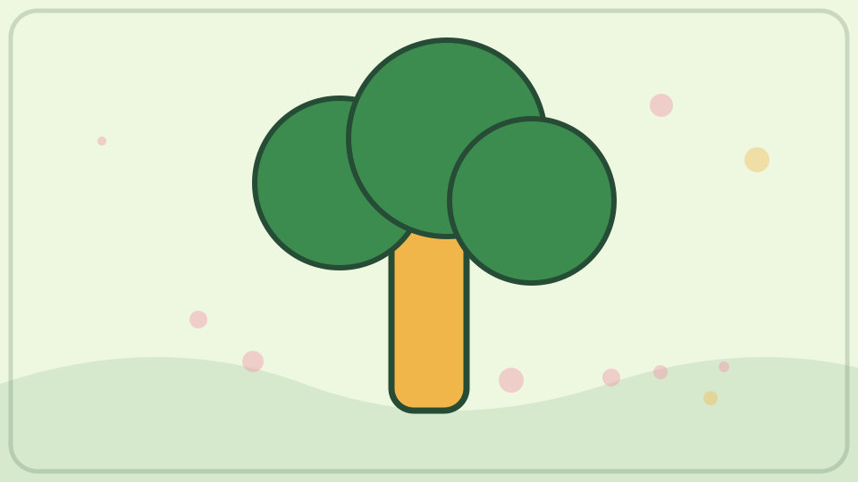

冬季寒冷或干旱将到来时，一些树会回收叶片里的有用物质，再让叶子脱落。这样能减少水分散失，也避免薄叶受冻。春天条件合适时会长出新叶。

**再想一步：** 叶柄基部会形成离层，使输送逐渐停止，最后让叶片脱落。叶绿素分解后，原有的黄色色素显现，有些树还会制造红色色素。

**一起看看：** 收集地上的落叶，按颜色或形状排一排。

---

## 第 079 天｜松树冬天为什么还是绿的？

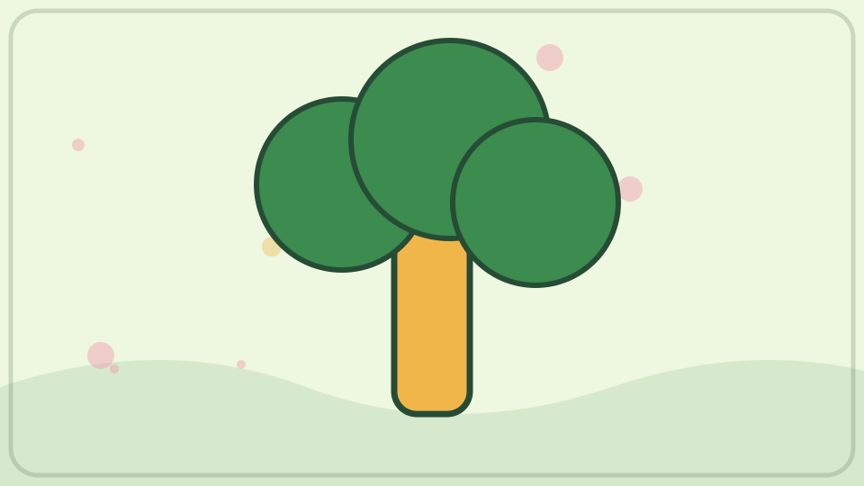

松树的针叶细小，表面有保护层，不容易丢失太多水。它不会在同一时间掉光全部针叶，所以冬天常看起来绿色。老针叶也会一批批脱落。

**再想一步：** 针叶面积较小、角质层较厚，气孔也常藏得较深，能减慢蒸腾。常绿并不表示叶子永不脱落，只表示叶片寿命跨过多个季节且分批更新。

**一起看看：** 在树下找掉落的旧针叶，别用手去抓尖端。

---

## 第 080 天｜仙人掌怎样住在干旱地方？

许多仙人掌用肥厚的茎储水。叶子变成刺，能减少水分散失，也有保护作用。它们的根会抓住难得的雨水，但不同仙人掌的办法并不完全相同。

**再想一步：** 许多仙人掌夜里打开气孔吸收二氧化碳，白天关闭气孔减少失水，再利用储存的二氧化碳进行光合作用。这叫景天酸代谢，是节水适应之一。

**一起看看：** 只观察不触摸，找找仙人掌的茎和刺在哪里。

---

## 第 081 天｜荷叶上的水为什么滚成珠？

荷叶表面有许多很小的凸起和蜡质层，水不容易摊开。水滴会缩成接近圆球，滚动时还能带走一些灰尘。这种表面叫很难被水润湿的表面。

**再想一步：** 微小凸起让水滴下方夹着空气，真正接触叶面的面积变少，接触角变大。科学家把这种强疏水和自清洁现象称作“荷叶效应”。

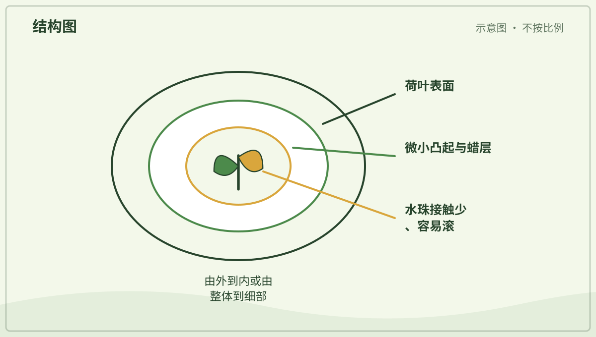

*图解：荷叶表面的微小凸起和蜡质层减少水的贴附，水便聚成圆珠滚走。*

**一起看看：** 雨后远看荷叶上的水珠，不到水边独自玩耍。

---

## 第 082 天｜藤为什么要爬架子？

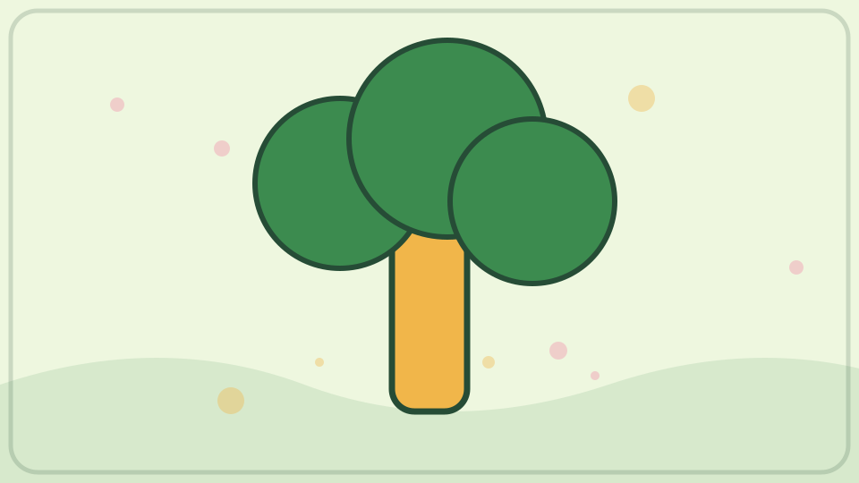

一些藤本植物的茎很长，却不够硬，不能自己高高站立。它们用卷须、缠绕的茎或小吸盘抓住支撑物，向有光的地方生长。这样可以少造粗树干。

**再想一步：** 卷须碰到支架后会出现接触向性，两侧生长速度改变，使它弯曲并缠紧。植物把较少材料用于支撑，就能更快把叶片送到高处。

**一起看看：** 找找藤是绕着、钩着，还是贴着支架向上。

---

## 第 083 天｜植物为什么会朝窗户弯？

许多幼苗会感受到光从哪边来。背光一侧的细胞常伸长得更多，茎就向光弯曲。这叫向光性，能帮助叶子得到光。

**再想一步：** 植物激素生长素会因光的方向重新分布，改变细胞伸长。向日葵幼株的生长部位可随日照方向变化，但成熟花盘并不会永远整天追着太阳转。

*图解：单侧光照使茎两边伸长程度不同，生长差异让茎弯向光源。*

**一起看看：** 每天从同一方向拍一盆植物，不要频繁转动它。

---

## 第 084 天｜蘑菇是植物吗？

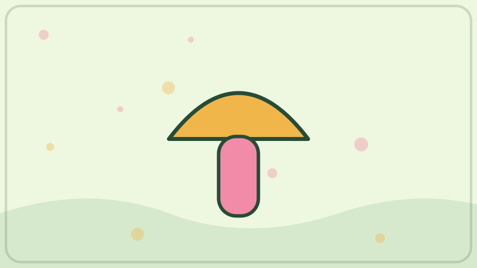

蘑菇不属于植物，而属于真菌。它们没有叶绿素，不能像绿色植物那样用光制造糖。我们看见的蘑菇只是一些真菌长出的繁殖结构。

**再想一步：** 真菌靠释放酶分解周围有机物，再吸收小分子养分。地下或木头里的菌丝网络才是主体，蘑菇像短暂长出的“结果”部分，会产生孢子。

*图解：孢子在合适基质中长成菌丝网络；条件合适时长出蘑菇，再释放新孢子。*

**一起记住：** 野外蘑菇只看不摸不尝，有些会让人生病。

---

## 第 085 天｜苔藓为什么喜欢湿地方？

苔藓通常矮矮的，没有像大树那样复杂的运水管道。它们容易从身体表面吸水。繁殖也常需要水，所以许多苔藓喜欢潮湿、背阴的地方。

**再想一步：** 苔藓没有真正的根，常用假根固定自己。它们体形小，水和物质能在较短距离内移动，这也限制了多数苔藓长得很高。

**一起看看：** 用放大镜观察苔藓像不像一片小森林，不把它揭下来。

---

## 第 086 天｜蕨类没有花，怎样有小宝宝？

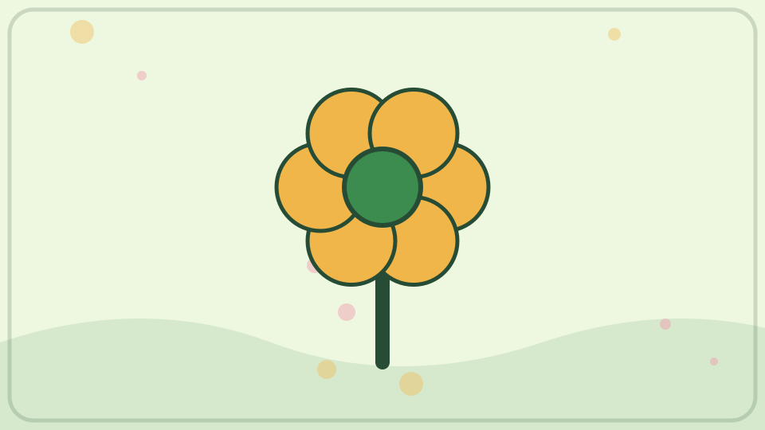

蕨类通常不结花和种子。它们会制造很小的孢子，常藏在叶片背面的孢子囊里。孢子落到合适的湿地方，会经历几个阶段长成新蕨类。

**再想一步：** 孢子先长成很小的配子体，再经过受精形成我们熟悉的大蕨株。蕨类的生活史在两个不同形态的世代之间交替。

**一起看看：** 只观察蕨叶背面整齐的小点，不用手刮。

---

## 第 087 天｜竹子是树还是草？

竹子属于禾本科，和许多草是亲戚。它的茎能变得又高又硬，看起来像树干，却有明显的节。不同竹子的大小和生长速度差别很大。

**再想一步：** 竹秆的生长主要集中在节附近，许多竹种还能用地下茎扩展。竹子会开花结种，但有些种类相隔很多年才大规模开花一次。

**一起看看：** 找找竹竿一节一节的分界线。

---

## 第 088 天｜土豆是植物的根吗？

土豆主要是地下茎膨大形成的块茎，不是根。表面的小“眼睛”其实是芽，条件合适时能长出新枝叶。植物把一部分食物存在块茎里。

**再想一步：** 判断地下器官是茎还是根，可以找芽、节和叶痕等结构。土豆块茎储存很多淀粉，为新芽早期生长提供能量。

**一起看看：** 请大人找一颗土豆，观察“眼睛”，不要生吃发绿土豆。

---

## 第 089 天｜胡萝卜为什么长在土里？

我们吃的胡萝卜主要是植物变粗的根。它在地下固定植物、吸水，还储存许多糖和其他物质。叶子在地上接阳光，根在地下慢慢长胖。

**再想一步：** 胡萝卜的橙色主要来自类胡萝卜素，其中有些可在人体内转化为维生素 A。不同品种也可能是紫、黄、红或白色。

**一起看看：** 洗净一根胡萝卜，分清上面的叶痕和下面的细根。

---

## 第 090 天｜花园里谁在互相帮忙？

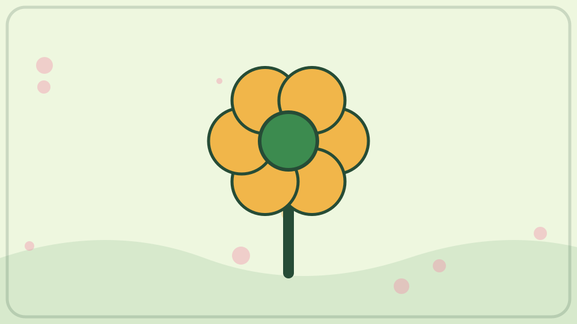

花给传粉动物花蜜和花粉，动物帮一些花传粉。落叶被真菌和小动物分解，养分回到土里。花园不是一排孤单的植物，而是许多生物共同生活的地方。

**再想一步：** 生物与阳光、水、空气和土壤共同组成生态系统。食物关系、传粉、分解和竞争彼此连接，改变其中一部分，其他部分也可能受到影响。

**一起看看：** 安静观察一分钟，数数花园里有几种会动和不会动的东西。
