# 四月：草丛里的小邻居

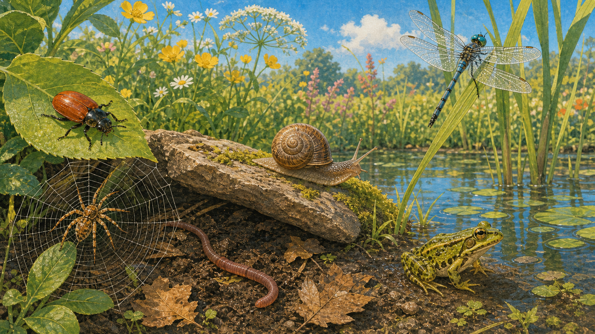

## 第 091 天｜怎样认出一只昆虫？

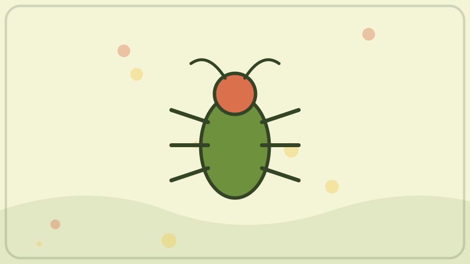

成年的昆虫有六条腿，身体分成头、胸、腹三部分。它们通常有一对触角，许多种类还有翅膀。蜘蛛、蜈蚣和蜗牛都不是昆虫。

**再想一步：** 昆虫没有体内骨骼，身体外面有坚硬的外骨骼，既支撑身体也减少水分流失。翅和腿都连接在胸部，这是辨认昆虫的重要线索。

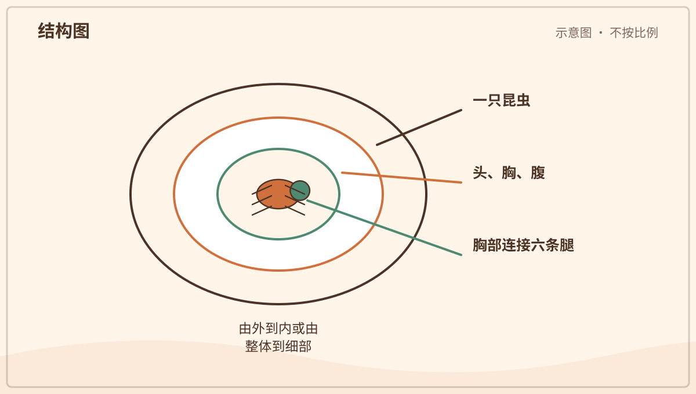

*图解：昆虫有头、胸、腹三部分，三对足都连接在胸部。*

**一起看看：** 远远观察一只小虫，试着数腿，不用手抓。

---

## 第 092 天｜蜘蛛为什么不是昆虫？

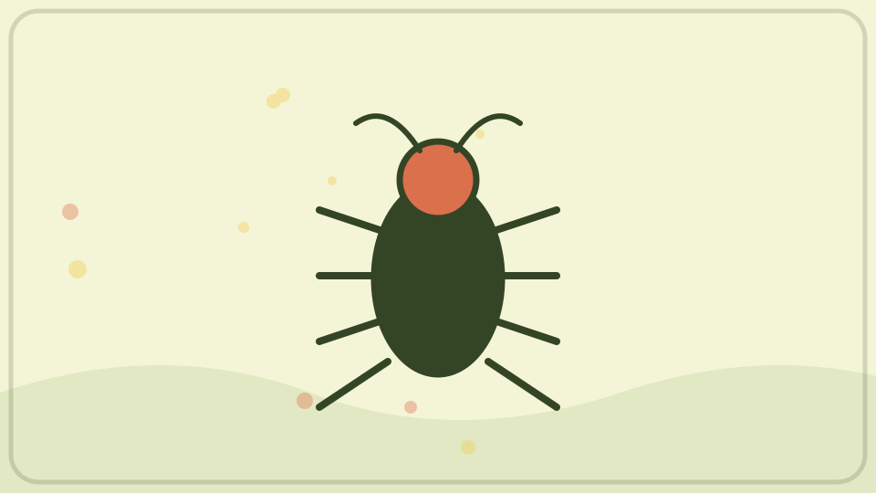

蜘蛛通常有八条腿，没有触角，身体主要分成前体和腹部两大部分。昆虫成体有六条腿，身体分三部分。它们都是节肢动物，却属于不同的类群。

**再想一步：** 分类不是只看“都很小”或“都会爬”，而是比较许多稳定的身体特征。蝎子、蜱和螨也比昆虫更接近蜘蛛。

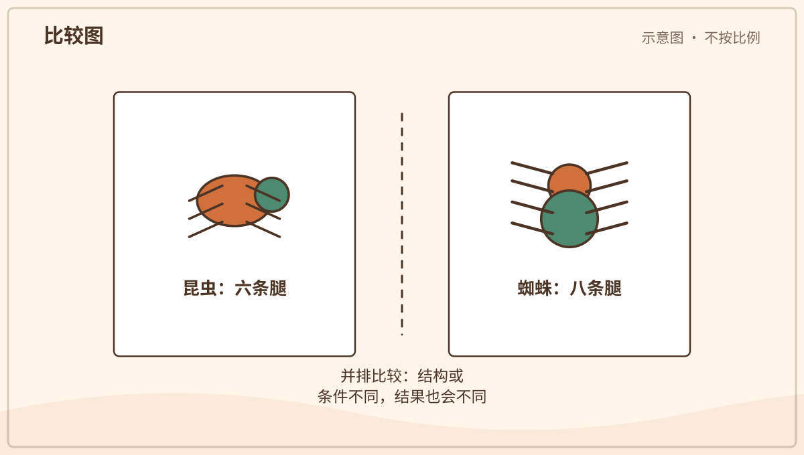

*图解：昆虫通常三段身体、六条腿；蜘蛛两大体区、八条腿。*

**一起看看：** 在图片上分别圈出蜘蛛和昆虫的腿从哪里长出。

---

## 第 093 天｜蚂蚁为什么排成一条线？

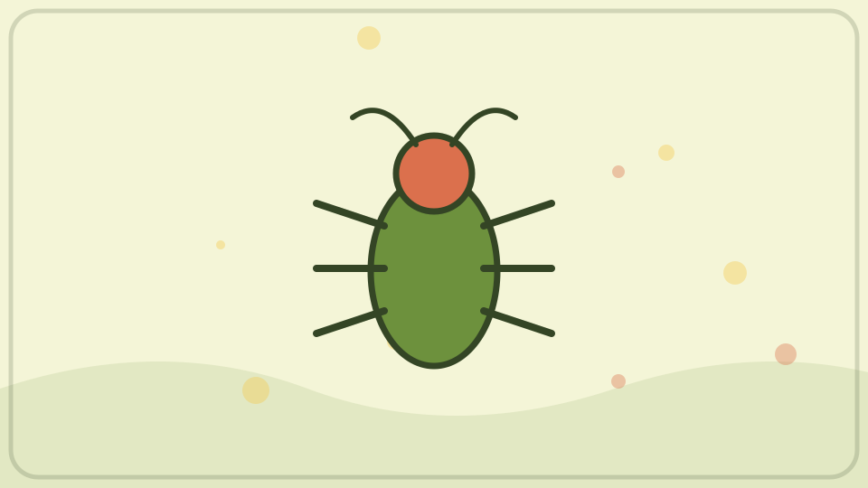

许多蚂蚁会在地面留下气味信号，叫信息素。后面的蚂蚁用触角闻到路线，便容易跟着走。通向好食物的气味小路还会被更多蚂蚁加强。

**再想一步：** 单只蚂蚁只遵循附近的简单信号，许多蚂蚁却能共同形成整齐路线，这叫群体行为。路线也会随食物消失、气味挥发或障碍出现而改变。

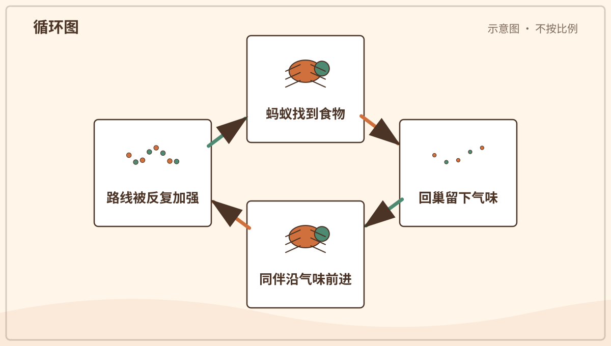

*图解：找到食物的蚂蚁留下信息素，更多蚂蚁沿路走又会加强气味。*

**一起看看：** 不放食物引诱，只观察蚂蚁队伍在哪里转弯。

---

## 第 094 天｜蚁巢里谁在做什么？

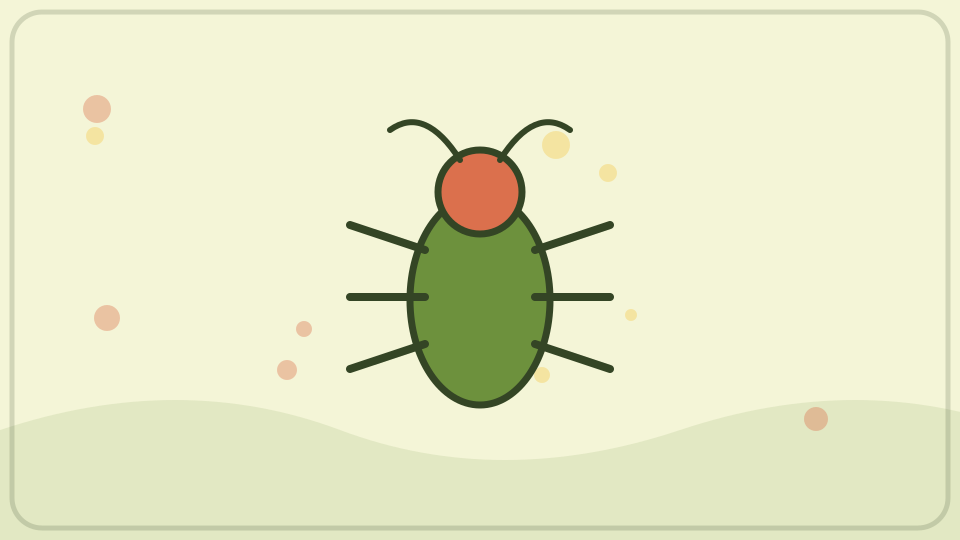

蚂蚁是社会性昆虫。一个蚁群里常有负责产卵的蚁后，还有照顾幼虫、寻找食物和维护巢穴的工蚁。不同种类的蚂蚁分工并不完全一样。

**再想一步：** 分工会随年龄、身体结构和巢群需要变化，不像人类每天固定领一份工作。蚁群通过触碰、气味和食物交换传递信息。

**一起看看：** 从安全距离找找搬东西的蚂蚁和空手走的蚂蚁。

---

## 第 095 天｜蜜蜂为什么嗡嗡响？

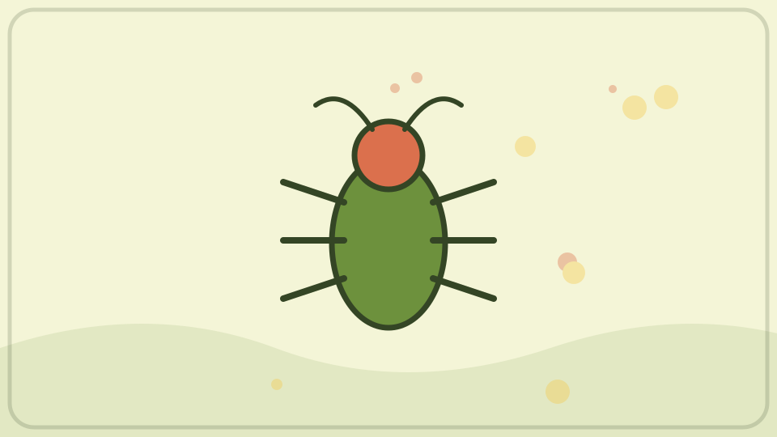

蜜蜂飞行时，翅膀快速拍动，让周围空气振动。振动传到耳朵，就成了嗡嗡声。不同大小和飞行状态的蜜蜂，声音也会有差别。

**再想一步：** 声音来自物体振动，振动越快，音调通常越高。蜜蜂还会振动飞行肌肉来取花粉或调节巢内温度，不是所有嗡声都只为向前飞。

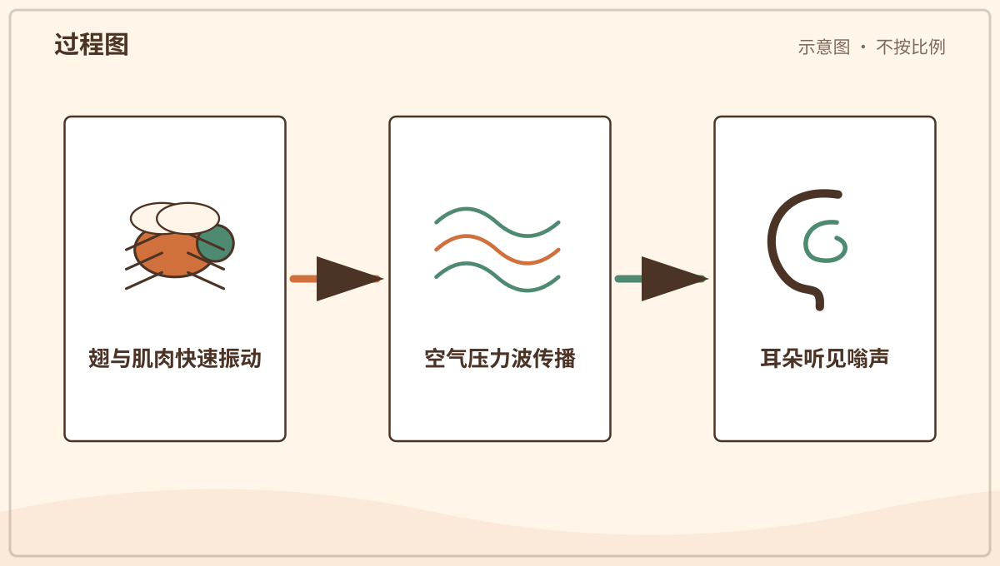

*图解：蜜蜂翅膀和飞行肌肉振动，使周围空气形成传播的压力波。*

**一起听听：** 隔着安全距离听昆虫飞过，绝不靠近蜂巢。

---

## 第 096 天｜蝴蝶用什么喝花蜜？

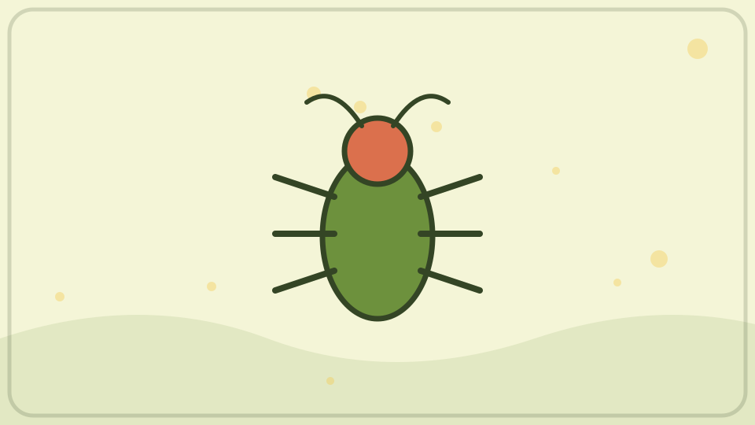

许多蝴蝶有一根能卷起来的口器，叫喙。停在花上时，喙伸开，液体沿细小通道进入口中。不用时，它又像卷尺一样收起来。

**再想一步：** 蝴蝶并不是用喙像吸管那样只靠“吸”，液体运动还受到毛细作用、肌肉和压力变化影响。不同蝴蝶取食的液体也不只花蜜。

**一起看看：** 从远处观察蝴蝶停下时，口边有没有细细的卷管。

---

## 第 097 天｜毛毛虫怎样变成蝴蝶？

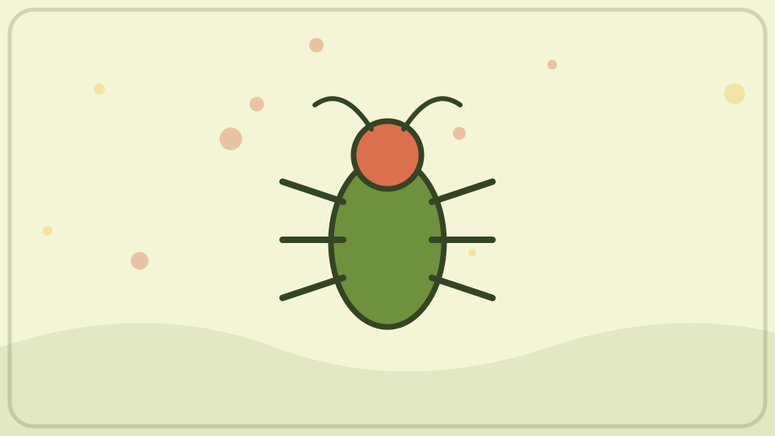

蝴蝶一生会经过卵、幼虫、蛹和成虫。毛毛虫主要吃和长大，进入蛹后，身体内部重新组织，最后成为有翅的成虫。这个过程叫完全变态。

**再想一步：** 蛹里不是一团没有结构的“汤”，许多组织会被保留、改造或新建。激素控制蜕皮和变态的时机，让不同生命阶段适合不同任务。

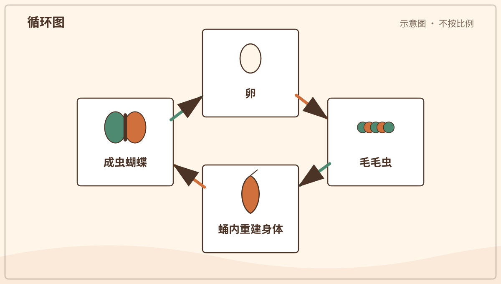

*图解：完全变态把生命史分成卵、幼虫、蛹和成虫四个阶段。*

**一起看看：** 用四张纸画出卵、毛毛虫、蛹和蝴蝶，再按顺序排好。

---

## 第 098 天｜甲虫背上的硬壳是什么？

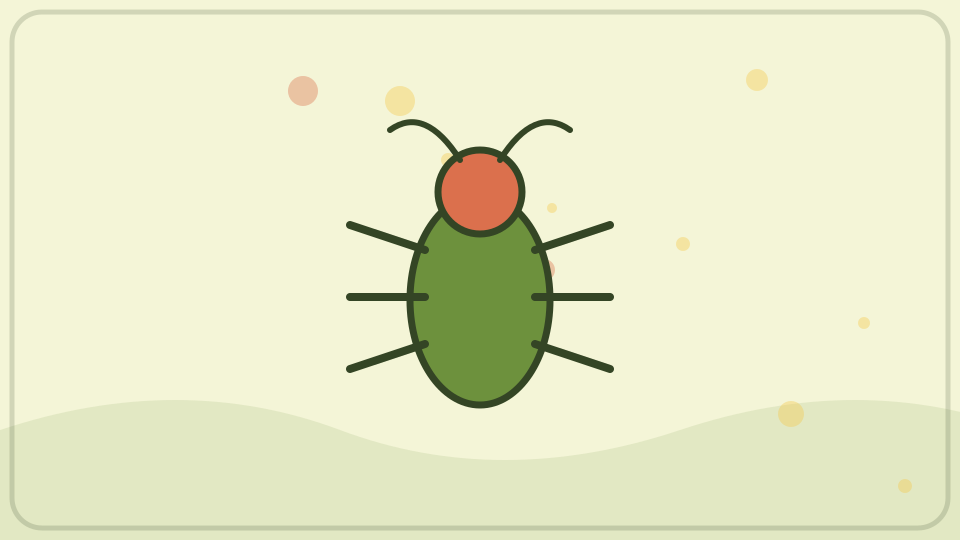

甲虫前面一对翅变成硬硬的鞘翅，像两扇保护门。飞行时，鞘翅打开，下面较薄的后翅展开并拍动。落地后，后翅再折回去。

**再想一步：** 鞘翅能保护飞行翅和腹部，也减少身体失水。甲虫因此能适应许多环境，但不同甲虫的鞘翅形状和飞行能力差别很大。

**一起看看：** 在清楚照片里找甲虫背上的中间缝和展开的薄翅。

---

## 第 099 天｜瓢虫有几个点就是几岁吗？

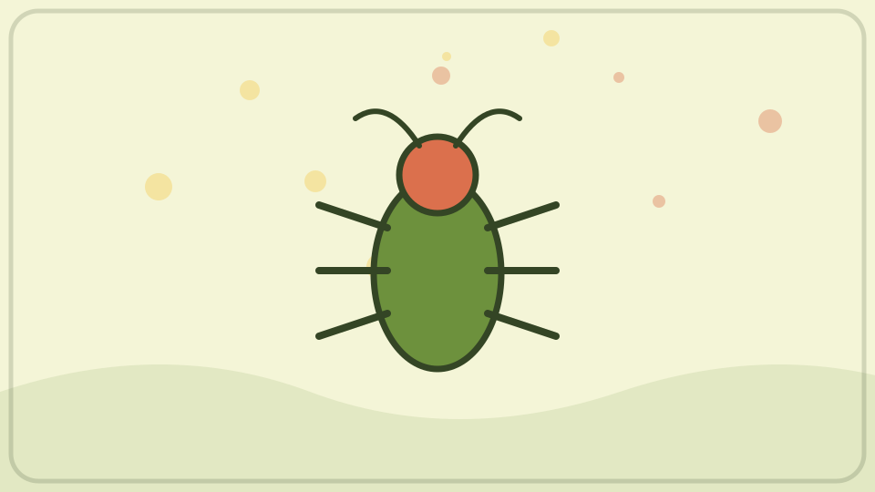

不是。瓢虫斑点的数量和花纹主要由种类和遗传决定，不能用来数年龄。有些瓢虫有很多点，有些没有明显斑点，也不一定都是红色。

**再想一步：** 醒目的红、黄、黑色常是警戒色，提醒捕食者它可能不好吃。分类时科学家会同时比较花纹、身体结构、生活史和遗传信息。

**一起看看：** 在不同瓢虫图片中找颜色和点数的变化。

---

## 第 100 天｜萤火虫为什么会发光？

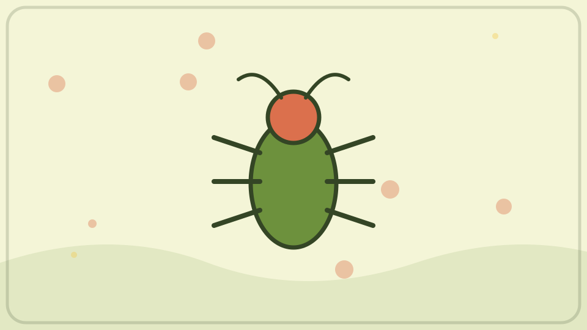

萤火虫腹部有能发光的器官。里面的物质在酶帮助下与氧气反应，把化学能变成光。它产生的热很少，所以常被叫作冷光。

**再想一步：** 不同萤火虫用特定闪光节奏寻找同类或传递信号，幼虫发光也可能警告捕食者。光不是储存在身体里的“小灯泡”，而是持续化学反应的结果。

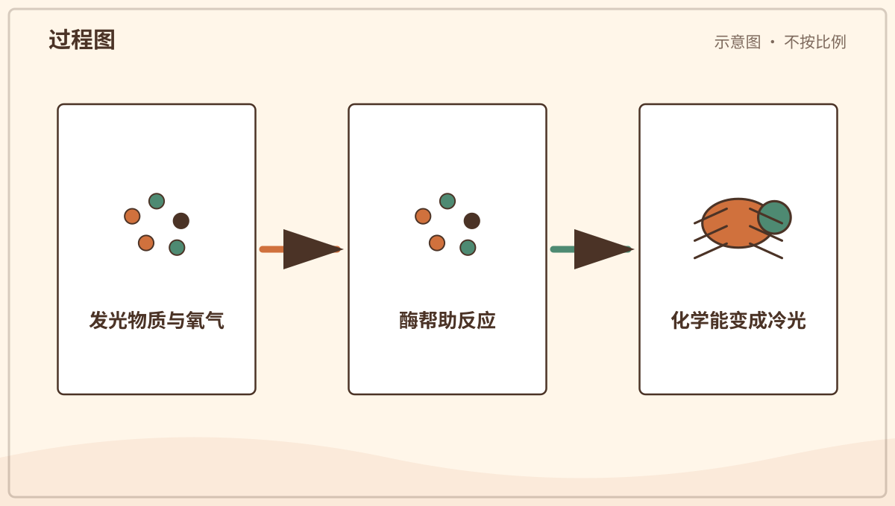

*图解：发光细胞里的物质在酶和氧气参与下反应，把化学能变成光。*

**一起看看：** 夜间只在大人陪同下远看，不捕捉也不装进瓶子。

---

## 第 101 天｜为什么有的蚊子会叮人？

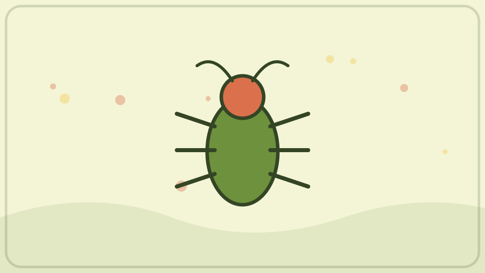

许多蚊种的雌蚊需要从血液中得到制造卵所需的营养，因此会寻找人或其他动物。雄蚊通常不吸血，主要取食花蜜等糖分。并不是每种蚊子都爱叮人。

**再想一步：** 蚊子能感受呼出的二氧化碳、体温和气味，口器由多根细小结构组成。叮咬后的痒主要与身体对蚊子唾液的免疫反应有关。

**一起记住：** 不抓挠叮咬处；很肿或不舒服时告诉大人。

---

## 第 102 天｜蜻蜓为什么能突然转弯？

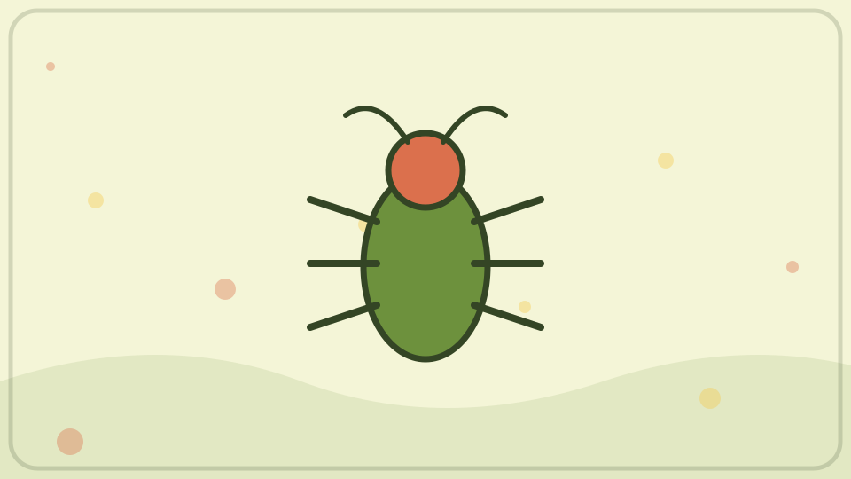

蜻蜓有两对长翅，能分别控制拍动的时间和角度。它可以悬停、倒退和迅速转弯，在空中追逐小虫。大大的复眼也帮助它发现移动目标。

**再想一步：** 每只复眼由许多小眼组成，对快速变化特别敏感。翅膀制造的升力和推力不断调整，四翅配合让蜻蜓拥有很强的机动性。

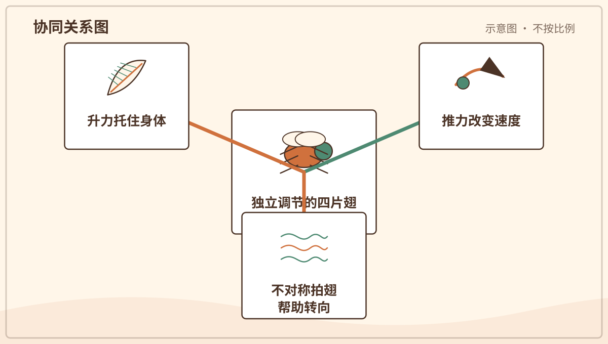

*图解：四片翅膀分别调节角度和拍动，持续改变升力、推力和转向力矩。*

**一起看看：** 在水边以外的安全空地远看蜻蜓怎样改变方向。

---

## 第 103 天｜蚱蜢为什么跳得远？

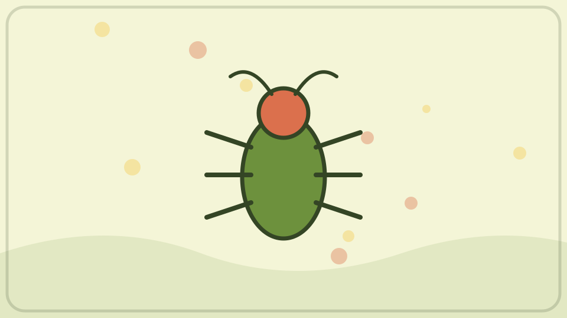

蚱蜢的后腿又长又粗，里面有强壮肌肉。起跳前，腿部结构储存弹性能量；突然伸直时，能量快速释放，把身体推离地面。

**再想一步：** 这像先弯曲再弹开的弹簧，但真正参与的是肌肉、关节和外骨骼。轻小的身体也让同样的推力产生更明显的加速度。

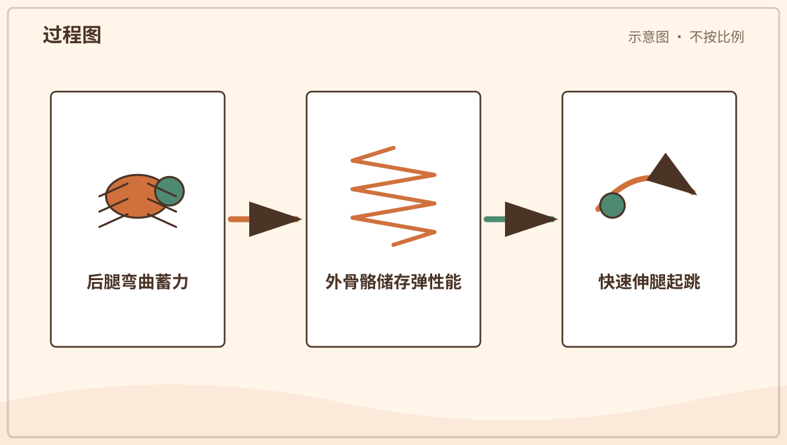

*图解：后腿肌肉先让弹性结构储能，突然释放时把身体推离地面。*

**一起看看：** 只观察蚱蜢起跳前后腿怎样折叠，不追赶它。

---

## 第 104 天｜蟋蟀怎样“唱歌”？

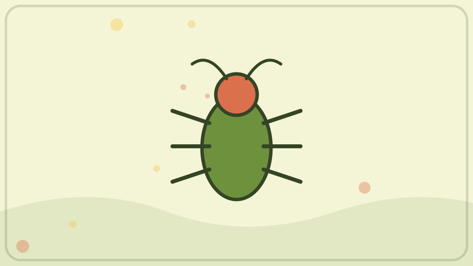

许多雄蟋蟀会摩擦两片前翅上的特殊结构，让翅膀振动发声。这叫摩擦发音。它们用不同节奏吸引同类或警告别的雄虫。

**再想一步：** 蟋蟀鸣叫的快慢常受温度影响，因为肌肉和神经活动会随温度变化。声音是行为信号，不是蟋蟀用嘴唱出的歌。

**一起听听：** 安静听一会儿，试着模仿一段重复节奏。

---

## 第 105 天｜螳螂为什么把前腿举起来？

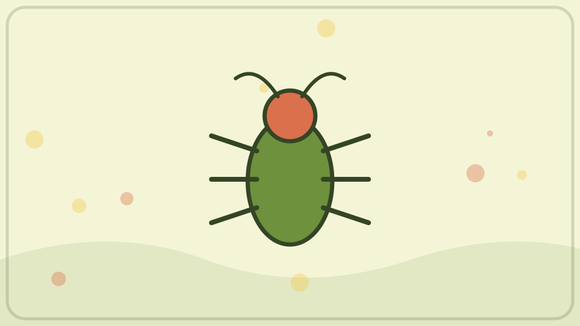

螳螂的前足像带刺的折叠夹子，适合迅速抓住猎物。等待时，它把前足收在胸前，看起来像举着手。头部还能转动较大角度来观察周围。

**再想一步：** 抓捕时，视觉先估计目标距离，肌肉再让前足快速弹出。伪装、耐心等待和突然攻击共同组成它的捕食策略。

**一起看看：** 从远处找螳螂身体颜色和叶子、树枝像不像。

---

## 第 106 天｜竹节虫为什么像树枝？

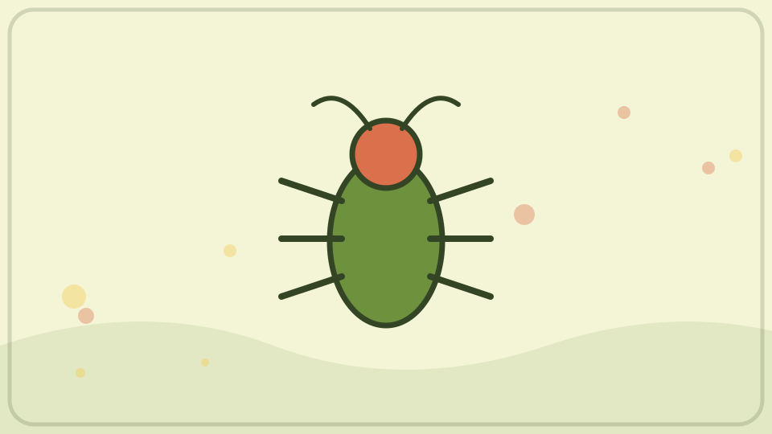

竹节虫细长的身体、颜色和姿势很像枝条。有些还会随着风轻轻摇摆，让自己更不显眼。这种减少被发现机会的办法叫伪装。

**再想一步：** 更像环境的个体较可能躲过捕食并留下后代，许多代后相关特征会变得常见，这是自然选择的一种结果。伪装并不保证永远不被发现。

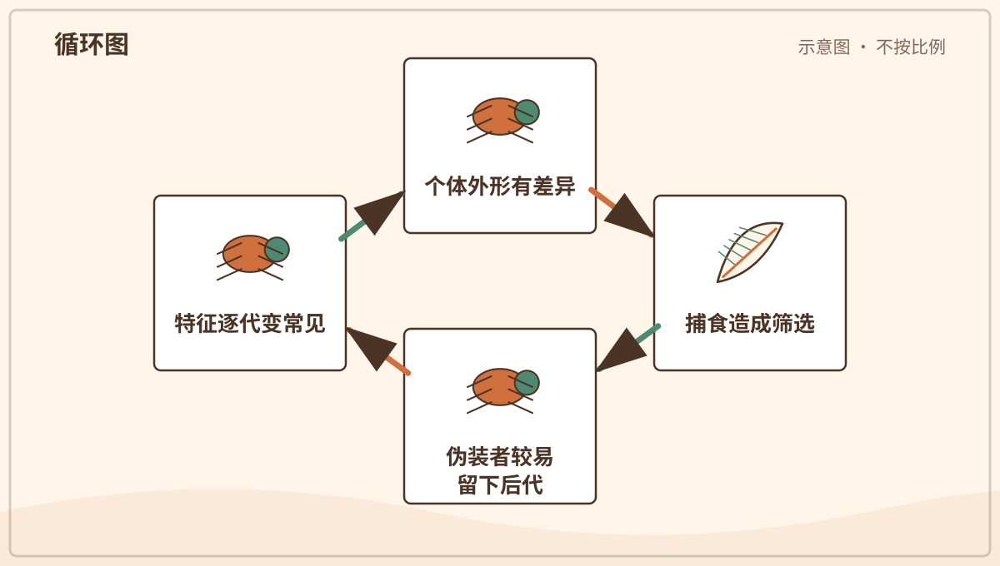

*图解：较像树枝的个体更容易避开捕食；许多代后相关特征可能更常见。*

**一起看看：** 在照片里先看三秒，再指出竹节虫藏在哪里。

---

## 第 107 天｜蜗牛为什么背着壳？

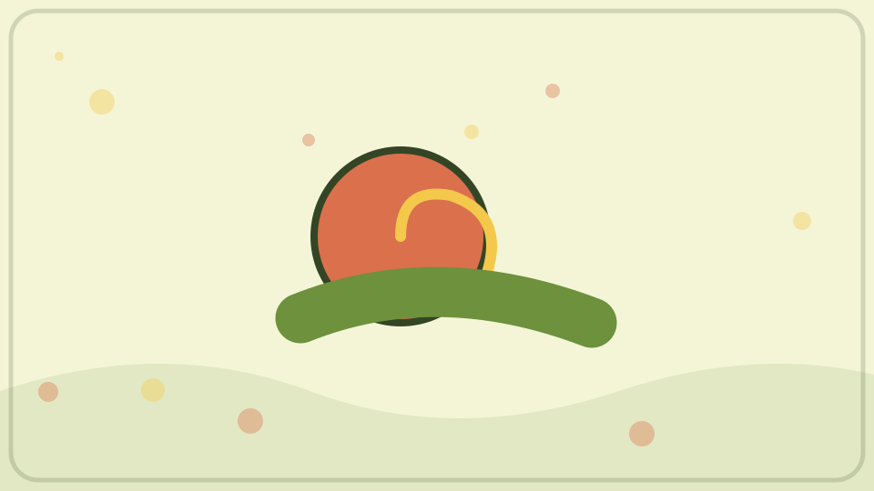

蜗牛的壳是身体的一部分，会随着它一起长大。壳主要由碳酸钙等物质构成，能保护柔软身体，也帮助减少失水。蜗牛遇到危险会缩进去。

**再想一步：** 壳边缘会不断添加新材料，旧壳不会像衣服一样被脱掉。蜗牛需要从食物和环境获得钙，壳的纹路还会记录生长变化。

**一起看看：** 只看蜗牛在地上留下的路线，不敲壳也不撒盐。

---

## 第 108 天｜蜗牛为什么走过会亮亮的？

蜗牛的足会分泌黏液。黏液既能减少身体与粗糙地面的损伤，也能帮助足部波浪般的肌肉运动推着身体前进。干后留下的薄层会反光。

**再想一步：** 黏液同时表现出黏和滑的性质，在受力时会改变流动方式。蜗牛并非简单在“滑道”上滑行，而是肌肉波与黏液共同作用。

**一起看看：** 斜着看蜗牛经过的地方，找找反光的细线。

---

## 第 109 天｜蚯蚓没有腿怎么钻土？

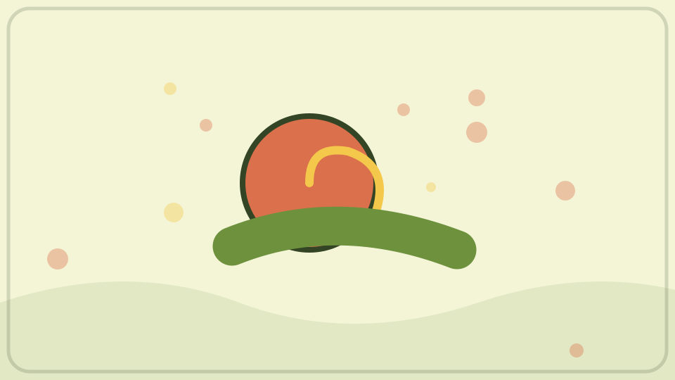

蚯蚓让身体一段变长、一段变短，肌肉波向前传。身体上的细小刚毛能抓住土壤，防止整条身体向后滑。这样它就能在缝隙中前进。

**再想一步：** 环形肌收缩会让身体变细变长，纵向肌收缩会让它变短变粗。蚯蚓通过湿润皮肤交换气体，所以干燥和暴晒会伤害它。

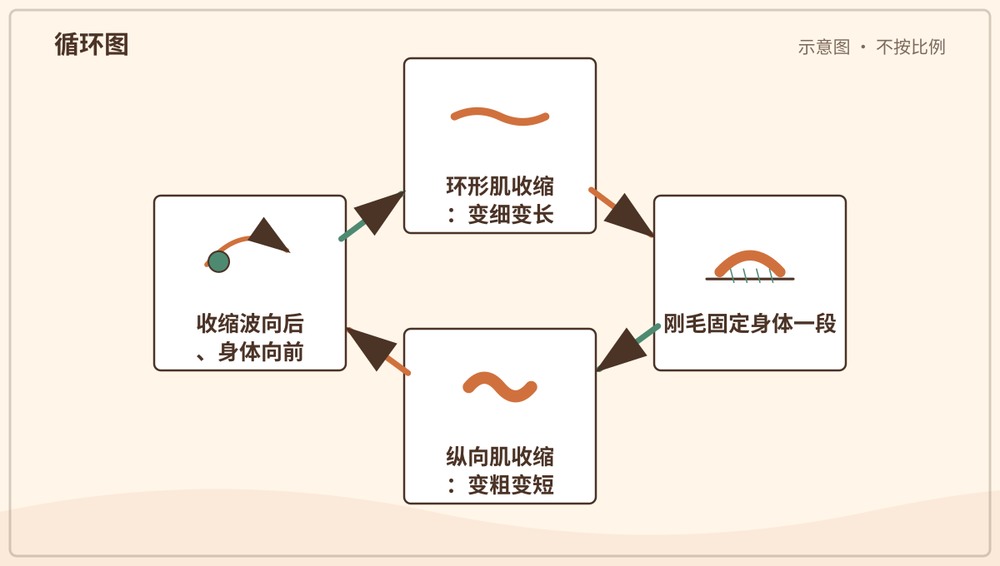

*图解：环形肌和纵向肌轮流收缩，再用刚毛固定一段身体，推动身体前进。*

**一起看看：** 雨后从旁边观察蚯蚓，别把它长时间拿离湿土。

---

## 第 110 天｜蚯蚓能让土变好吗？

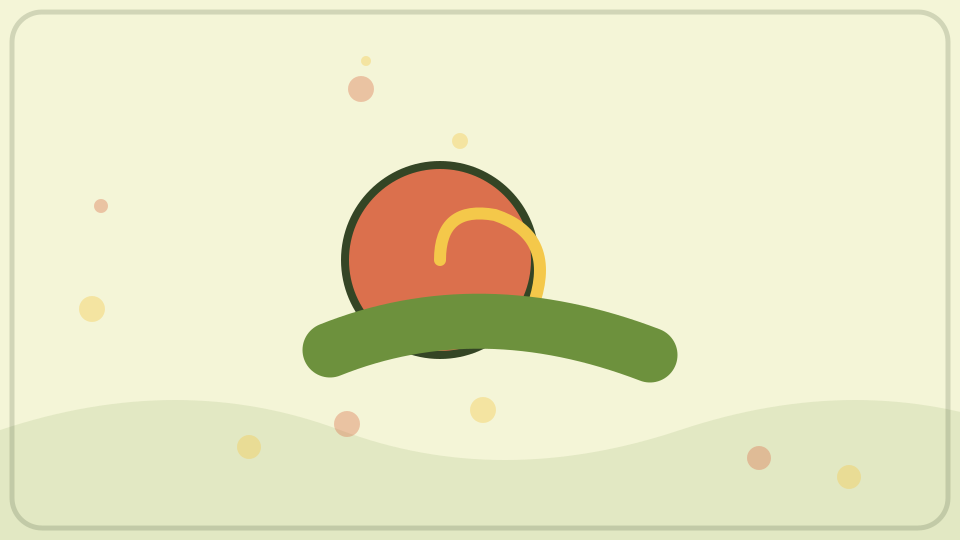

许多蚯蚓吃下混有腐烂植物的土，再排出细碎物质。它们打出的通道能让空气和水较容易进入土中。不同地方的蚯蚓作用不同，也不是越多越好。

**再想一步：** 土壤结构由矿物颗粒、有机物、水、空气和生物共同形成。某些外来蚯蚓进入原本没有它们的森林，反而会过快改变落叶层和生态关系。

**一起看看：** 观察花盆土的颗粒和缝隙，不随意搬运野外蚯蚓。

---

## 第 111 天｜蜈蚣和马陆哪里不一样？

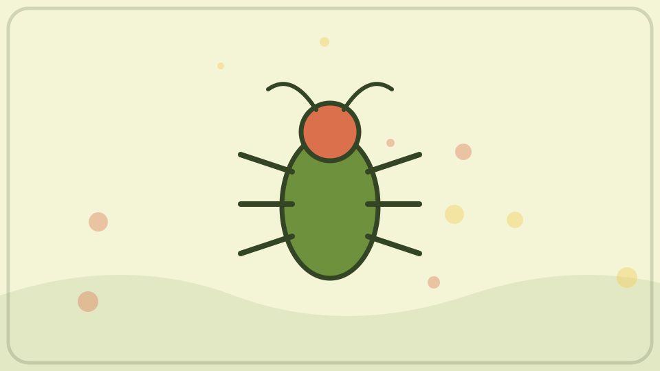

蜈蚣身体较扁，多数体节每节一对腿，跑得较快，常捕食小动物。马陆身体多较圆，许多体节看起来有两对腿，主要吃腐烂植物。它们都不是昆虫。

**再想一步：** 蜈蚣的第一对附肢变成有毒的颚足，用来制服猎物；马陆遇险常蜷起并释放防御物质。只凭腿“很多”还不足以把它们分成同一种动物。

**一起记住：** 只观察，不徒手触碰蜈蚣或马陆。

---

## 第 112 天｜潮虫为什么喜欢缩成球？

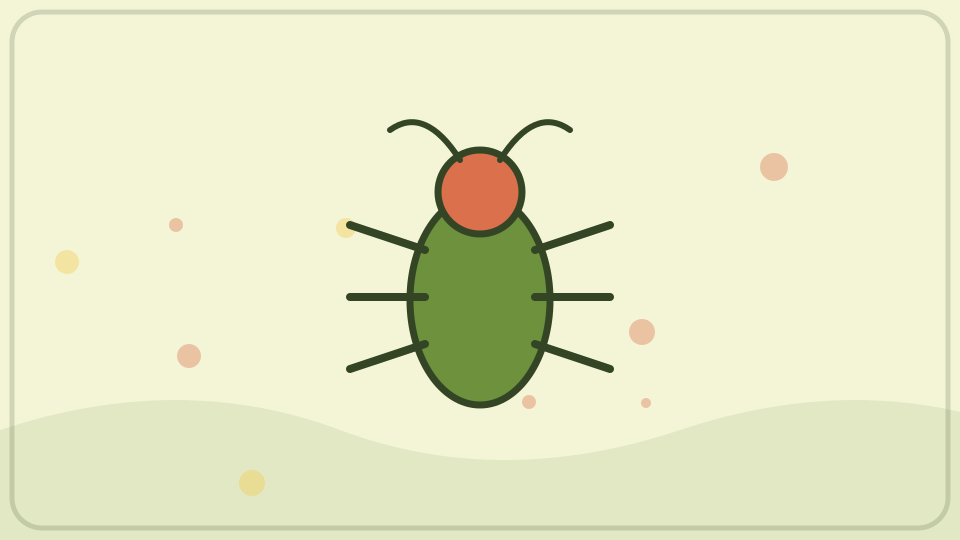

一些潮虫遇到碰撞或干燥时会卷成球，把柔软腹面藏起来。它们喜欢潮湿阴暗处，因为身体容易失水。并不是所有潮虫种类都能卷成完整的球。

**再想一步：** 潮虫是生活在陆地上的甲壳动物，和虾蟹有较远亲缘，不是昆虫。它们的呼吸结构仍需要较湿环境，这保留了水生祖先的一些特点。

**一起看看：** 轻轻抬起一片落叶观察，随后原样放回，不碰动物。

---

## 第 113 天｜蜘蛛网为什么又轻又结实？

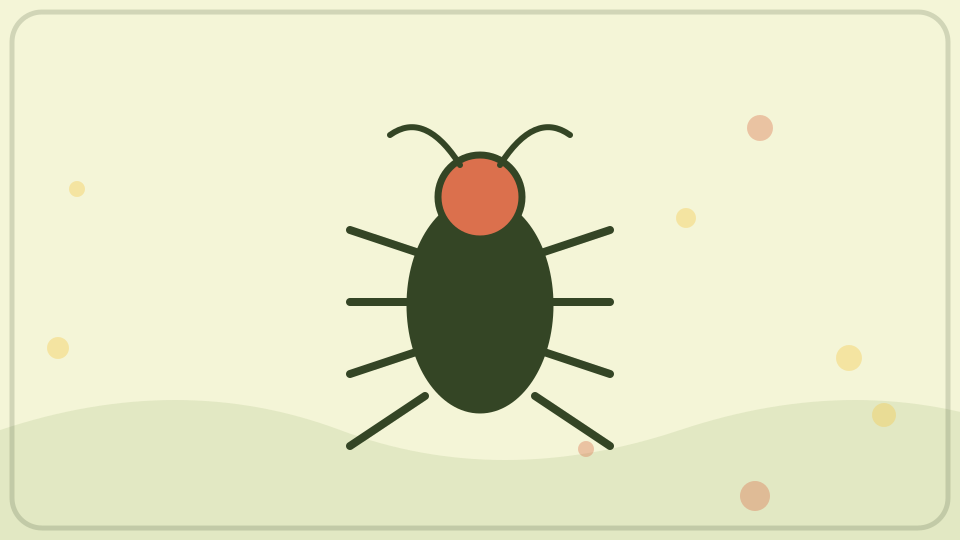

蜘蛛从腹部的纺器放出蛛丝蛋白。不同腺体制造不同用途的丝，有的支撑，有的黏住猎物，有的包卵。蛛丝很细，却能承受相当大的拉力。

**再想一步：** “结实”要看材料在多大截面上承受多少力，还要看它能拉长多少。蛛丝把强度和韧性结合起来，但不同种蜘蛛和不同种丝性能并不相同。

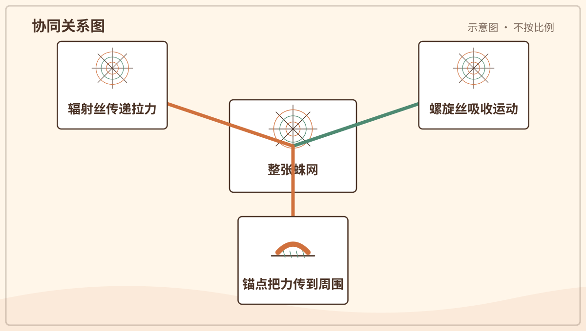

*图解：蛛网的辐射丝和螺旋丝分担拉力；不同蛛丝兼顾强度与延展。*

**一起看看：** 清晨从侧面看露水照亮的空网，不撕扯蛛丝。

---

## 第 114 天｜蜘蛛自己为什么不总被网粘住？

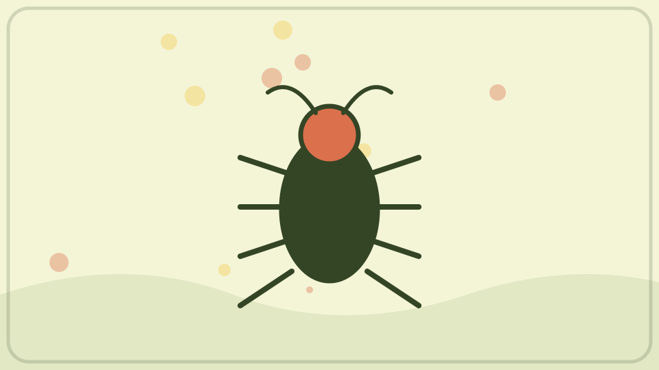

圆网里并不是每根丝都黏。蜘蛛常踩在较干的支撑丝上，脚部结构和小心的步法也减少接触黏滴。不过蜘蛛仍可能被自己的黏丝粘到。

**再想一步：** 黏捕丝上是一串有弹性的胶滴，猎物挣扎会让更多身体碰到胶滴。蜘蛛能感受蛛丝振动，由振动位置和节奏判断网上发生了什么。

**一起看看：** 观察网的中心、放射线和一圈圈螺旋线有什么不同。

---

## 第 115 天｜石头下面为什么住着小动物？

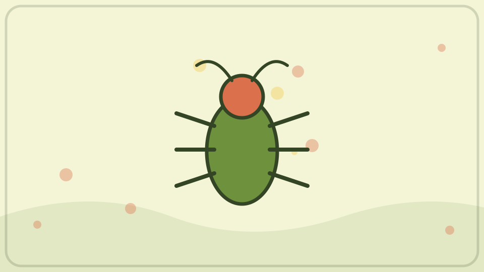

石头下面通常较暗、较凉，也不容易被风吹干。潮虫、蜗牛、虫卵和许多微小生物能在那里躲避阳光与捕食者。这个小范围生活环境叫微生境。

**再想一步：** 温度、湿度、光线和食物在几厘米内就可能不同。翻动石头会突然改变微生境，所以观察后要轻轻放回原位。

**一起看看：** 只由大人翻一块小石头，看完立刻原样放回。

---

## 第 116 天｜青蛙怎样从水里来到岸上？

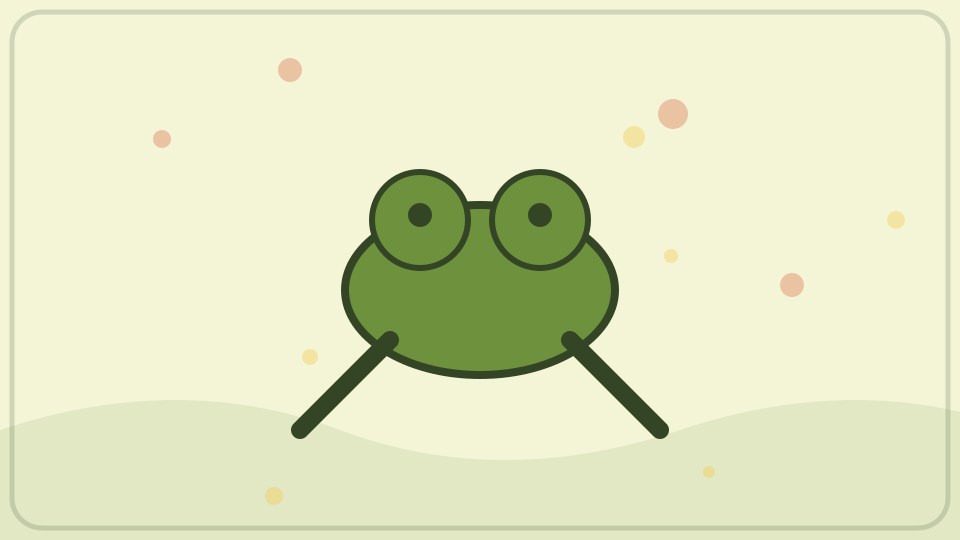

许多青蛙从水中的卵孵出蝌蚪。蝌蚪长出后腿和前腿，尾巴缩短，呼吸和消化系统也改变，成为小青蛙。这个变化也叫变态。

**再想一步：** 蝌蚪多用鳃呼吸，成年蛙主要用肺和湿润皮肤交换气体，但种类之间差异很大。甲状腺激素参与控制这场全身改变。

**一起看看：** 在自然水边只与大人远看，不捞卵和蝌蚪回家。

---

## 第 117 天｜青蛙为什么能跳得高？

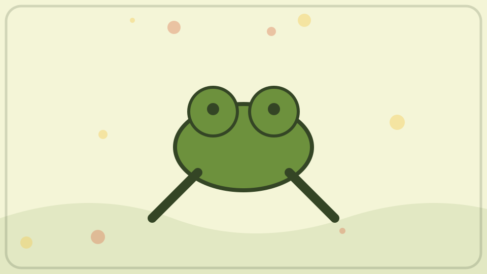

青蛙的后腿长而有力，骨盆和脊柱也适合把力量传给身体。蹬地时，肌肉和肌腱迅速释放能量，让身体向前上方飞出。前腿帮助落地缓冲。

**再想一步：** 跳跃距离不只由腿长决定，还与肌肉力量、起跳角度、身体质量和空气阻力有关。水栖、树栖与地栖蛙的腿和脚也有不同适应。

**一起模仿：** 在不滑的空地轻轻蹲跳一次，由大人看护。

---

## 第 118 天｜壁虎为什么能爬墙？

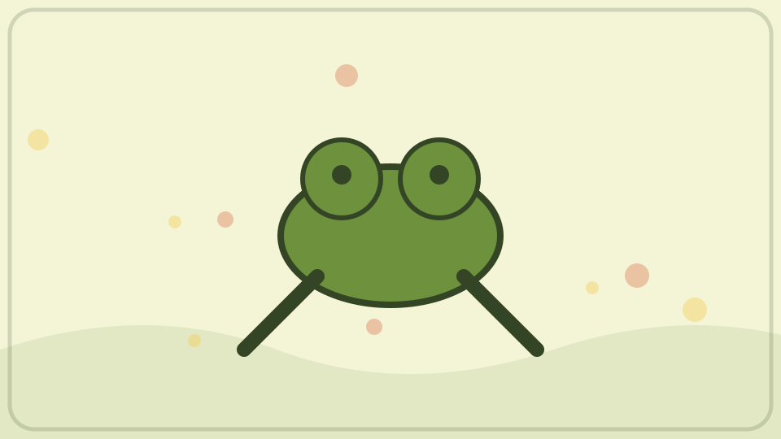

许多壁虎脚趾下有大量细毛，细毛末端还分得更细。它们与墙面靠得非常近时，会产生许多微弱吸引力，合起来就能支撑身体。不是靠胶水或吸盘。

**再想一步：** 这种分子之间的微弱吸引常称范德华力。壁虎改变脚趾角度就能快速贴上或脱开，粗糙程度和灰尘也会影响抓附效果。

*图解：脚趾上的刚毛继续分叉成极细末端，增大与墙面的近距离接触。*

**一起看看：** 从远处看壁虎脚趾是否张开，不抓尾巴。

---

## 第 119 天｜蜥蜴断尾后为什么还能动？

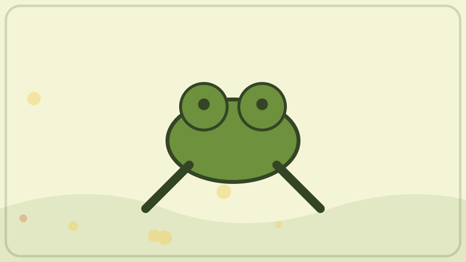

一些蜥蜴遇到攻击时能在尾巴特定位置断开。脱落的尾巴会因神经和肌肉活动继续扭动，吸引捕食者注意，让蜥蜴逃跑。这叫自割。

**再想一步：** 断尾不是没有代价，蜥蜴会失去储存的能量和部分运动、求偶能力。再生的尾巴内部结构常与原来的不同，也不是所有蜥蜴都会这样做。

**一起记住：** 绝不抓蜥蜴尾巴，只安静观察。

---

## 第 120 天｜变色龙变色只为躲起来吗？

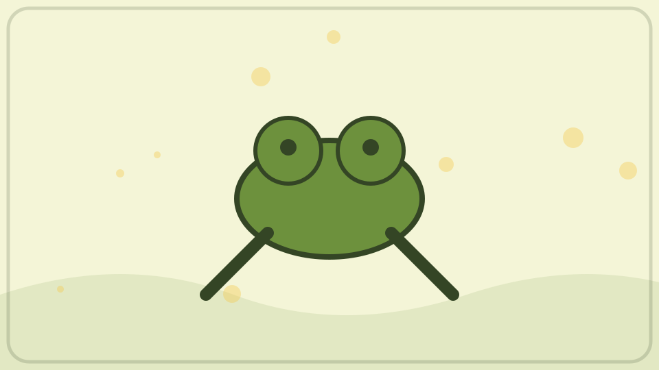

不只为伪装。变色龙会因交流、情绪、光线和温度改变颜色。皮肤里的特殊细胞和微小晶体改变光的反射方式，颜色便发生变化。

**再想一步：** 一些变色龙通过调整纳米晶体间距，让不同波长的光被加强反射。身体本来的色素、皮肤层和环境光共同决定最终看到的颜色。

**一起看看：** 比较同一种变色龙在安静和警戒照片中的颜色与姿势。
