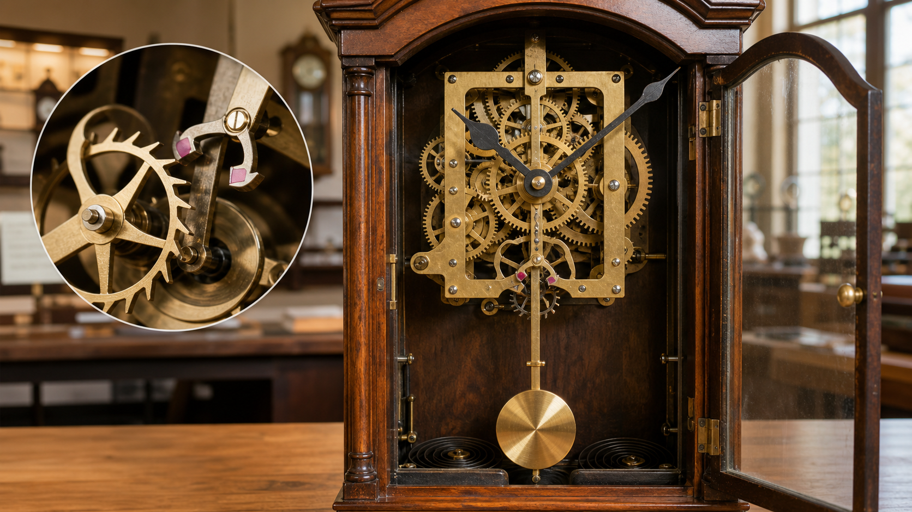
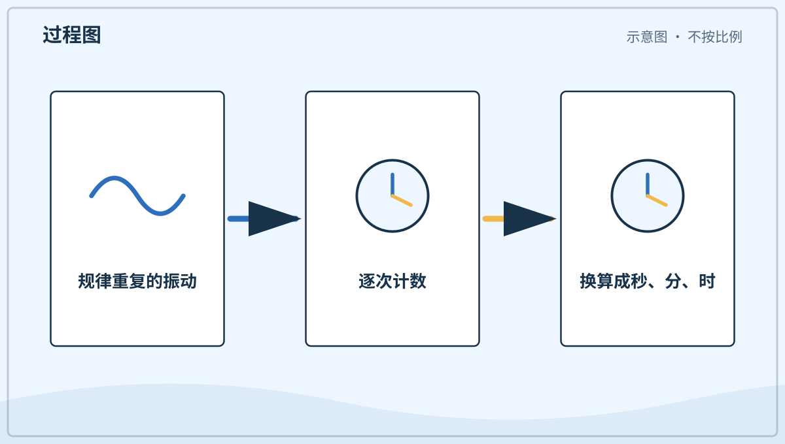
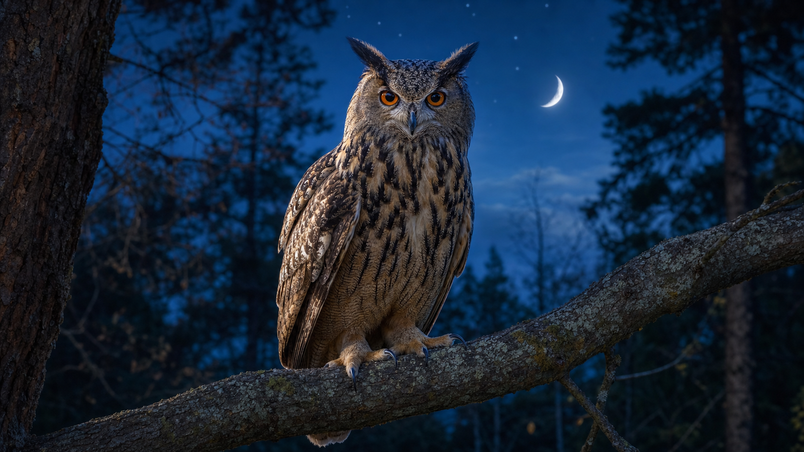
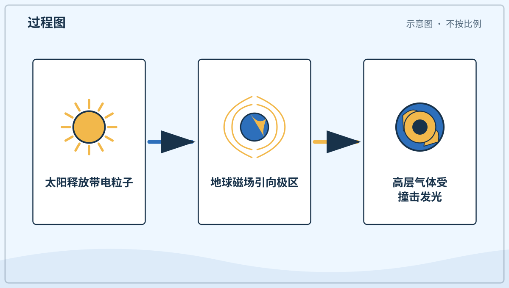

# 兴趣单元 04｜计时、睡眠与夜晚世界

> **探索领域 01：** 光、天空、时间与冷暖
>
> **核心问题：** 人怎样记录重复的节律，生物和天空又怎样在夜晚发生变化？

钟和日历是人建立的记录工具，睡眠与夜行动物体现生物节律，极光则展示太阳粒子和地球磁场的相互作用。

## 怎样沿着本单元的追问链阅读

先找重复发生的过程，再区分自然节律、约定单位和偶尔出现的天文现象。

## 追问链 04.1｜钟、日历与时间约定

稳定周期可以计时，而星期与历法还包含历史形成的人类约定。

### 第 026 问｜钟为什么会滴答走？

钟要用一个稳定的节奏数时间。有的钟靠摆来回摇，有的靠小小的石英晶体规律振动。齿轮或电子零件把节奏变成指针和数字的变化。

**再想一步：** 会规律重复的运动叫周期运动。钟先用振荡器产生稳定周期，再用计数装置把许多个周期换算成秒、分和小时。

**把知识连起来：** 机械钟用摆轮或摆锤来回振荡，石英钟让石英晶体在电路中以稳定频率振动，电子计数器再把许多次振动换成一秒。温度、摩擦和零件误差会让普通钟慢慢走快或走慢，所以还要定期校准。原子钟利用原子能级跃迁对应的稳定频率定义秒，为通信、导航和科学测量提供共同节奏。

**再往外看：** 卫星导航要比较信号到达的极小时间差，因此依赖原子钟。若计时差十亿分之一秒，换算成光走过的距离也已有几十厘米，精确时间会直接变成空间位置。

**容易弄混：** 钟发出一次滴答不一定正好等于一秒。有些机械钟一秒响多次，电子钟甚至没有声音；真正被计数的是内部稳定重复的过程。

*图解：钟用稳定的周期运动作节拍，再把许多周期累计成时间读数。*

**一起听听：** 靠近一只安全的钟，听它有没有规律的声音。

---

### 第 027 问｜日历为什么一页一页翻？

地球转一圈，我们把它叫作一天。人们把许多天排成星期、月份和年份，方便一起记事情。日历是人做的时间地图。

**再想一步：** 日、月和年最初分别与地球自转、月相周期和地球绕太阳运行有关，但现代日历需要用规则把这些周期排整齐。闰日就是为了让日历年不要慢慢偏离季节。

**把知识连起来：** 一天、朔望月和回归年的长度不能刚好互相整除，所以日历像一套不断做近似又及时修正的拼图。月份被安排成不同天数，平年有三百六十五天；多数能被四整除的年份加闰日，但整百年还要用更细规则修正。这样平均日历年才会紧跟季节，不至于几百年后把春天写到冬季月份里。

**再往外看：** 世界上还有依据月相或同时参考太阳与月亮的历法。比较不同历法，可以看到人们怎样在天文周期、农业季节、宗教传统和社会管理之间作出不同安排。

**容易弄混：** 现代公历的一个月并不等于完整月相周期。月份名称和长度保留了历史规则，而月相周期约二十九天半，两者会逐渐错开。

**一起看看：** 在日历上找到今天，再找找明天在哪一格。

---

### 第 028 问｜一个星期为什么有七天？

七天一星期是人们很久以前约定的记日方法。自然里没有一条线把星期切开。共同的约定让大家容易安排上学、工作和休息。

**再想一步：** 科学里既有自然规律，也有人类为了测量和合作建立的单位与制度。星期属于后者；不同文化曾使用过不完全相同的分组方法。

**把知识连起来：** 七日星期可能与古代对太阳、月亮和五颗肉眼可见行星的传统分类有关，后来经不同社会传播，成为广泛使用的时间制度。它不依赖某个每七天重复一次的地球物理过程，却能让学校、交通和公共服务按共同节奏协作。星期名称和一周从哪天开始，在语言、宗教和标准中仍可能不同。

**再往外看：** 共同约定也出现在米、千克、交通规则和地图符号中。约定可以由人修改，但一旦用于合作，就要说明标准并保持一致；这也是科学交流能够复核的基础。

**容易弄混：** 说星期是约定，不等于所有时间单位都完全任意。日和年有清楚的天文周期基础，而一周怎样分组更多来自历史与社会选择。

**一起说说：** 你最熟悉星期里的哪一天？那天常做什么？

## 追问链 04.2｜睡眠、夜行动物与极光

比较生物的昼夜节律，并认识夜空中由太阳与地球共同造成的极光。

### 第 029 问｜我们为什么要睡觉？

睡觉时，身体不是完全停工。大脑整理白天得到的信息，身体也在生长、修补和恢复精神。睡够以后，我们更容易活动、学习和保持好心情。

**再想一步：** 一晚睡眠会经历不同阶段，大脑活动、呼吸和肌肉状态也会变化。科学家仍在研究睡眠的全部作用，但记忆整理、免疫调节和身体恢复都是重要部分。

**把知识连起来：** 大脑里有一套接近二十四小时的生物钟，光线通过眼睛帮助它与昼夜同步。入睡后，浅睡、深睡和快速眼动睡眠会多次轮换；不同阶段参与记忆整理、情绪调节和身体恢复。儿童正在快速生长，通常比成人需要更多睡眠。固定的睡前节奏、白天活动和夜间较暗的环境，都能帮助身体知道何时休息。

**再往外看：** 睡前强光、尤其是近距离屏幕光，可能让生物钟误以为白天还没结束。对孩子来说，稳定作息、舒适安静的环境和照护者的陪伴，比追求某种神奇助眠办法更可靠。

**容易弄混：** 睡着不是大脑关机。睡眠中大脑仍在活动，呼吸、心跳和体温受到调节，人也可能做梦；缺觉不能简单靠某一次长睡完全抵消。

**一起说说：** 选一个让身体知道“要睡了”的安静小习惯。

---

### 第 030 问｜猫头鹰为什么晚上活动？

*写实观察图：猫头鹰真实的羽毛、眼睛、足和夜间栖息环境；不同猫头鹰物种的外形并不完全相同。*

有些猫头鹰的眼睛和耳朵很适合在昏暗中寻找食物。它们常在夜里活动，白天休息。并不是所有猫头鹰都只在完全黑暗时出门。

**再想一步：** 猫头鹰的大眼睛能收集较多光，面盘和不对称耳孔能帮助一些种类判断声音方向。夜行是一组身体结构和行为共同形成的适应，不是单靠一种“夜视本领”。

**把知识连起来：** 夜间活动能让猫头鹰避开部分白天活动的竞争者，并遇到夜里出没的猎物。它们眼中的视杆细胞擅长在弱光下工作，不能转动的眼球由灵活颈部帮助改变视野；面盘把声音引向耳朵，一些种类两侧耳孔高度不同，能更精确判断上下方向。宽大的翅膀和特殊羽缘还能减小飞行噪声。

**再往外看：** 猫头鹰既是捕食者，也是食物网的一部分。它们控制部分鼠类和昆虫数量，自己也受栖息地、食物和人类活动影响；理解一种动物要把身体本领放回生态关系中。

**容易弄混：** 猫头鹰不能在完全没有光的地方只靠眼睛看见一切，也不是所有种类都严格夜行。有些会在晨昏甚至白天活动，听觉和视觉会一起工作。

**一起听听：** 夜晚关好窗，在安静处听听有没有和平时不同的声音。

---

### 第 031 问｜天空里的彩色光带是什么？

在靠近地球南北两端的天空，有时会出现极光。来自太阳的带电小粒子遇到地球周围的气体，会让气体发出绿色、红色等光。它们像会飘动的彩带。

**再想一步：** 地球磁场会引导许多带电粒子靠近极区。粒子撞到高层大气里的氧和氮，使它们先得到能量，再以特定颜色的光把能量放出来。

**把知识连起来：** 太阳会持续放出太阳风，其中含有电子和质子等带电粒子。地球磁层挡开大部分粒子，并把一部分引向磁力线汇集的高纬地区；粒子进入高层大气后碰撞氧和氮，绿色、红色、蓝紫色便在不同高度出现。太阳爆发活动增强时，极光范围可能向较低纬度扩展，也可能影响卫星、无线电和电网。

**再往外看：** 极光是“空间天气”的可见部分。太阳活动还能改变近地空间中的粒子和磁场，工程师因此监测太阳，提前评估对宇航员、卫星通信和电力系统的影响。

**容易弄混：** 极光不是云层反射城市灯光，也不是和雨滴形成的彩虹。它通常发生在远高于天气云层的稀薄大气中，颜色来自受激气体释放能量。

*图解：太阳粒子受地球磁场引导到极区，撞击高层大气并使气体发出彩光。*

**一起看看：** 在图片里找找极光和普通彩虹的形状有什么不同。

## 单元综合观察｜找一个节律，也找一个约定

记录一个会重复的睡前步骤和钟表的一次完整循环，再说说哪个来自身体生活、哪个是人用来计时的工具。极光用图片观察，不把它当成每天都会出现的夜景。
