# 兴趣单元 05｜空气、风与压强

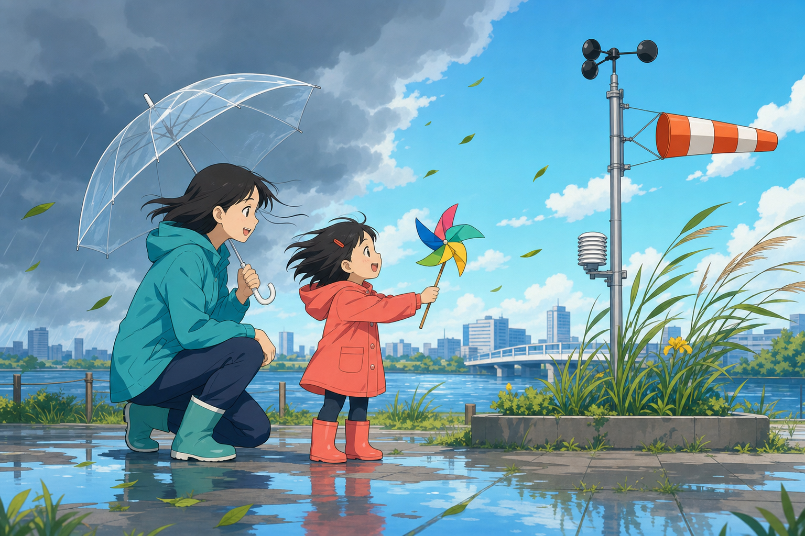

> **探索领域 02：** 空气、天气与水
>
> **核心问题：** 看不见的空气怎样占据空间、传递压力并形成风？

气球、泡泡和吸管把空气变得可以间接观察，风则把局部经验扩展到大气的大范围运动。

## 怎样沿着本单元的追问链阅读

寻找空气推、压、移动或占位的证据，而不是把看不见误认为不存在。

## 追问链 05.1｜空气存在与风的形成

空气有质量、占空间并产生压力；受热不均和压强差会推动它流动。

### 第 032 问｜空气明明看不见，怎么知道它在？

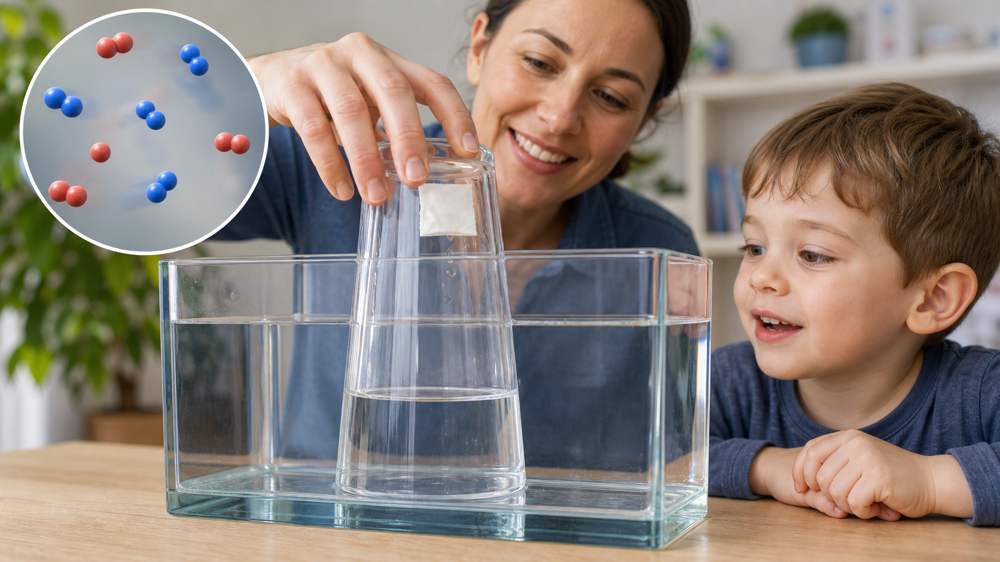

空气大多看不见，却会占地方，也有重量。气球鼓起来，是空气住进了里面。风吹到脸上，也是移动的空气碰到了我们。

**再想一步：** 空气是氮气、氧气等多种气体的混合物。气体分子很小、彼此相距较远，却一直运动并碰撞容器，所以空气能产生压力。

**把知识连起来：** 空气占据空间的证据到处都是：把空杯倒扣进水里，杯中的空气会挡住水；压扁封闭注射器里的空气，会感到越来越难推。空气分子虽然彼此距离大，却高速运动并持续撞击物体表面，许多微小碰撞合起来就是气压。空气还有质量，整层大气受重力拉住，海平面附近每一处表面都承受着上方空气的重量。

**再往外看：** 呼吸、飞行和天气都依赖空气的物质性质。肺靠压力差换气，机翼与运动空气相互作用产生力，气压变化又被气象站用来追踪天气系统。

**容易弄混：** “看不见”不等于“什么也没有”。透明空气仍是物质；真正接近真空的空间，粒子数量要少得多，也不会像普通空气那样产生相同压力。

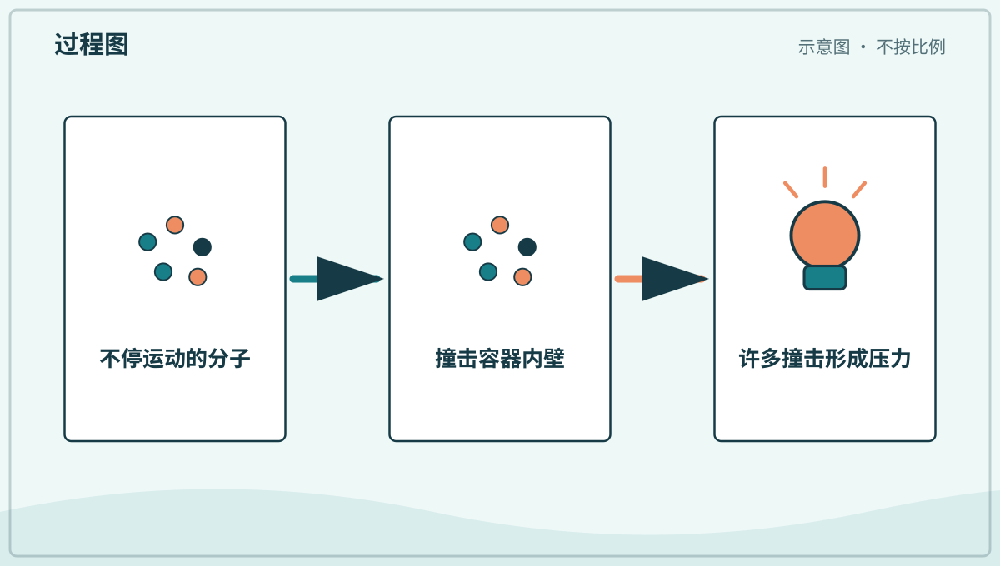

*图解：气体分子持续运动并撞击容器内壁，大量撞击共同形成压力。*

**一起试试：** 对着手心轻轻吹气，感觉看不见的空气。

---

### 第 033 问｜风是从哪里来的？

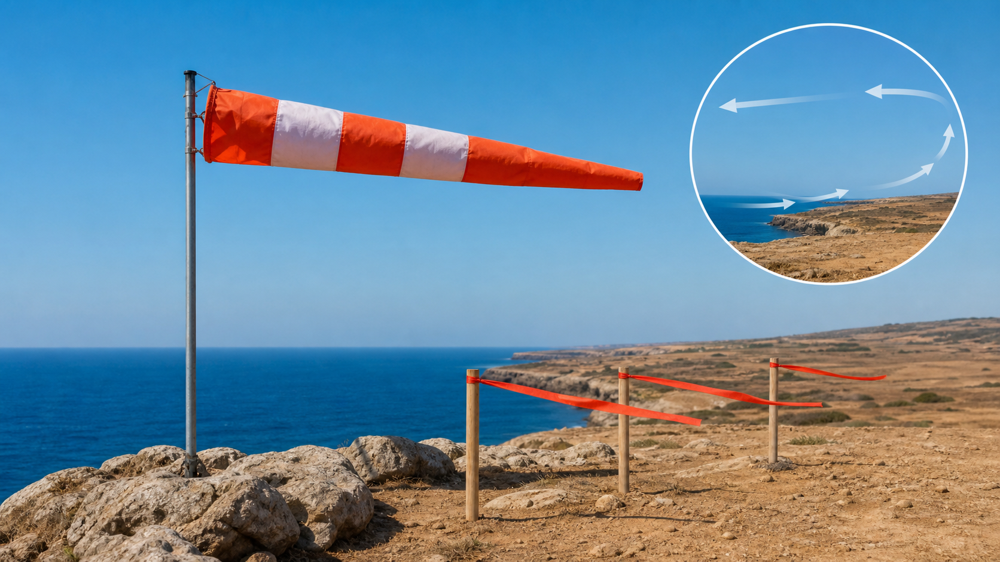

太阳把地面各处晒得不一样暖。暖空气上升，别处较凉的空气就会流过来补上。空气这样移动起来，我们就感觉到了风。

**再想一步：** 温度会改变空气的密度和压力，地球自转、地形与海陆分布也会让风转弯或加速。风因此不是简单地从“冷处直吹到热处”，而是大气共同运动的一部分。

**把知识连起来：** 太阳让赤道、海洋、陆地和城市升温速度不同，空气因而出现温度、密度和压力差。空气受压力梯度推动开始流动，又被地球自转带来的科里奥利效应、山脉和地面摩擦改变方向。海边白天常有海风，是陆地升温较快、近地面气压关系改变的局部例子；高空急流和季风则跨越更大范围。

**再往外看：** 风搬运水汽、热量、沙尘、种子和污染物，也把海洋与大陆连接起来。理解风向和高度，才能解释降雨区、洋流表面运动与空气质量变化。

**容易弄混：** 风不是树摇出来的，也不总沿一条直线从冷处吹向热处。树叶只是显示空气已经在移动，而真实风向由多种力和地形共同决定。

*图解：地面受热不均使空气密度和压力不同，空气的整体运动形成风。*

**一起看看：** 观察树叶、旗子或头发，猜猜风从哪边来。

---

### 第 034 问｜为什么风有大有小？

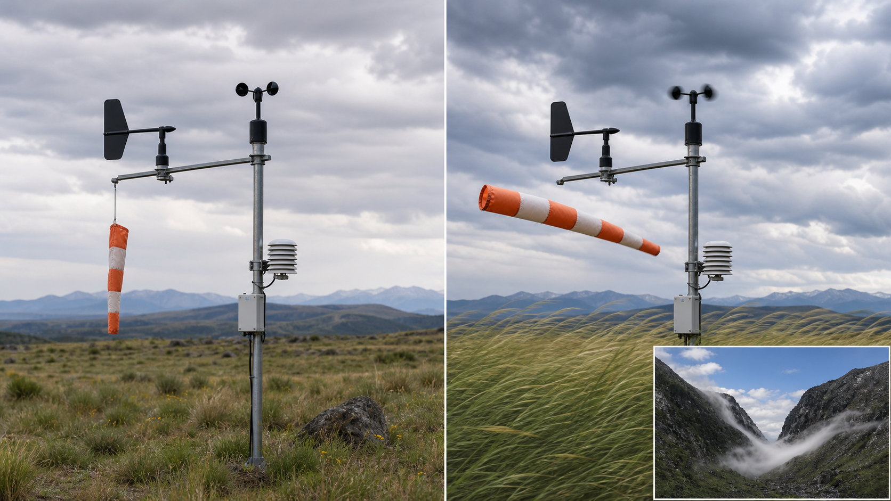

空气移动得慢，是轻轻的风；移动得快，风就更有力。不同地方空气压力的差别越大，常常越容易有强风。建筑和山也会改变风的速度。

**再想一步：** 风速表示空气移动多快，风力还与空气撞击物体的效果有关。狭窄通道可能让气流加快，粗糙地面和障碍物则会制造旋涡。

**把知识连起来：** 气压在短距离内变化越快，推动空气的力量通常越强。风经过楼间、山口或桥洞时，通道形状会让它加速；越过障碍后又可能形成忽快忽慢的湍流和阵风。物体受到的风力增长得比风速更快，所以风速只增加一些，树枝、雨伞和建筑承受的作用却可能明显增加。

**再往外看：** 气象站用风杯、超声仪器等测风速，人也可根据树叶和水面的反应做粗略判断。工程师会在风洞和电脑模型中研究阵风，设计桥梁和高楼。

**容易弄混：** 风大不只等于空气温度低。冷天可以无风，暖天也会刮强风；风速描述空气运动，体感温度则还受到散热影响。

**一起看看：** 比较地面的小草和高处的树梢，谁晃得更明显？

## 追问链 05.2｜泡泡、气球与吸管里的压力

薄膜、弹性材料和压强差共同决定气体与液体怎样移动。

### 第 035 问｜泡泡里面装着什么？

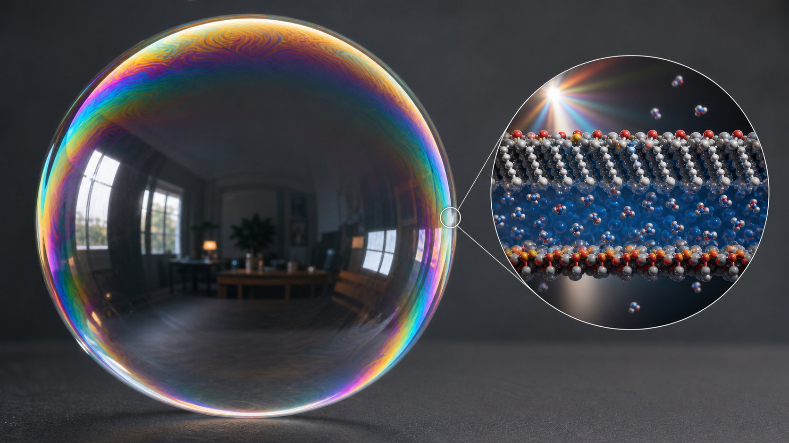

泡泡里面通常是空气，外面包着一层非常薄的肥皂水。薄膜会反射不同颜色的光，所以泡泡表面闪着彩色。水慢慢流走，薄膜破了，泡泡就消失。

**再想一步：** 肥皂降低水的表面张力，让薄膜更容易拉开又不马上破。薄膜前后两面反射的光互相加强或削弱，便出现不断变化的彩色条纹。

**把知识连起来：** 肥皂膜其实有两层肥皂分子包着一层水。表面张力总想缩小膜的面积，因此自由漂浮的泡泡趋向球形；内外压力差和重力又会让大泡泡稍微变形。水在膜中向下流、同时蒸发，膜厚不断改变，不同波长的反射光便轮流加强，彩色条纹会移动，最后最薄处破裂。

**再往外看：** 大量泡泡挤在一起成为泡沫。灭火泡沫、洗涤泡沫和食物中的气泡都利用薄膜分隔气体，但配方、稳定时间和安全用途并不相同。

**容易弄混：** 泡泡表面的颜色不是肥皂水里装了彩色颜料。它来自薄膜干涉；膜厚变化后，同一位置加强的颜色也会变化。

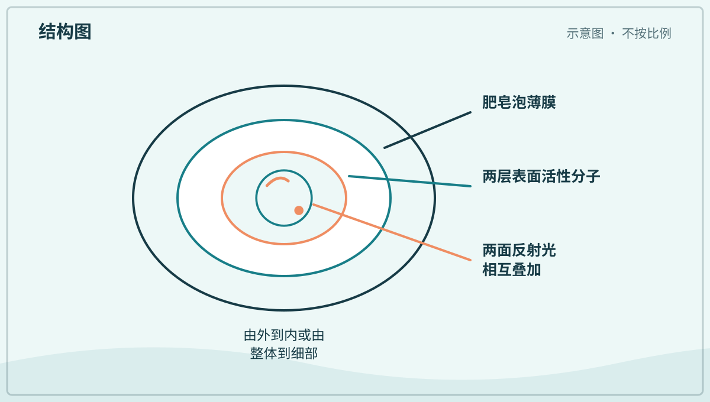

*图解：肥皂分子帮助水膜稳定；薄膜前后表面的反射光会发生干涉。*

**一起看看：** 由大人吹泡泡，你只用眼睛追一只最大的。

---

### 第 036 问｜气球为什么会鼓起来？

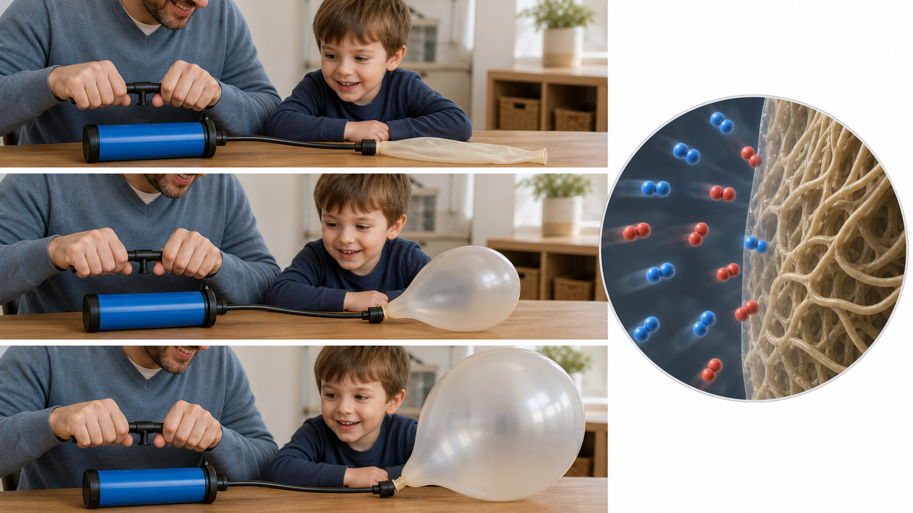

吹进气球的空气越来越多，会从里面推气球皮。气球皮被撑开，也向里面拉，直到两边差不多平衡。气球里的空气仍在不停碰撞。

**再想一步：** 单位面积上受到的推力叫压力。充气时，内部压力通常比外面略大；橡胶越被拉伸，回缩的力量也会改变，所以气球不是无限长大。

**把知识连起来：** 吹气时，更多空气分子进入有限空间，内部碰撞变多，压力把橡胶向外推。橡胶由卷曲的长分子链组成，拉开后会产生回缩趋势；气压、橡胶张力和外界压力达到平衡，气球便暂时保持大小。温度升高会让气体分子运动更快，密闭气球的体积或压力也可能随之改变。

**再往外看：** 轮胎、足球、充气垫和天气气球也在利用气压与材料张力的平衡。比较它们的外皮厚度和用途，可以看出同一原理怎样变成不同工程设计。

**容易弄混：** 气球鼓起不是因为空气“没有重量所以向上跑”。普通空气气球会下落；只有内部气体整体密度小于周围空气，浮力才可能让它升起。

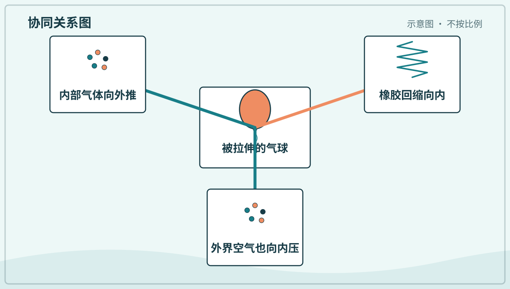

*图解：气球内部压力向外推，橡胶的回缩力和外部空气共同抵抗。*

**一起看看：** 请大人拿充气前后的气球，比比大小和软硬。

---

### 第 037 问｜吸管怎么把水送到嘴里？

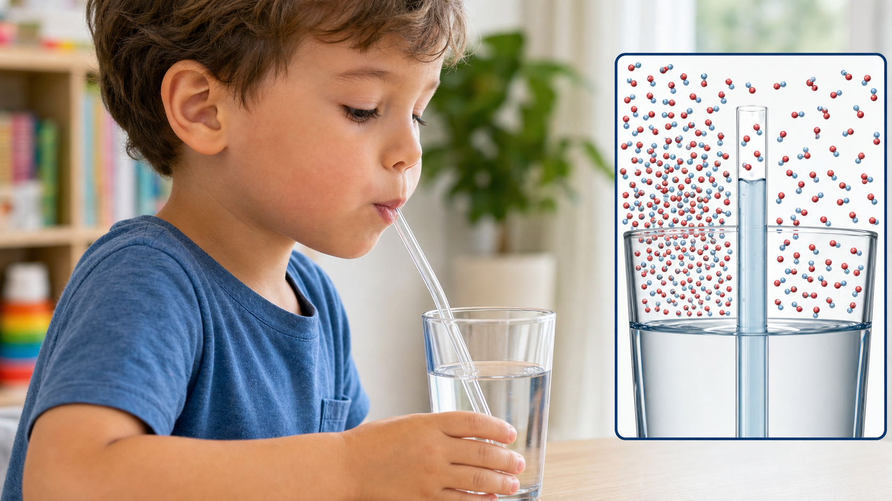

我们吸气时，让吸管里的空气压力变小。杯子上方的空气会推着水进入吸管，水便向上走。不是嘴巴隔着很远把水直接拉上来。

**再想一步：** 液体从压力较高处向压力较低处移动。吸管太长时，大气压力能托起的水柱有上限，所以“吸”并不是没有限制的拉力。

**把知识连起来：** 嘴吸走吸管上端的一部分空气后，管内液面上方压力降低。杯中水面仍受大气压力作用，于是外界空气把水压进吸管，直到压力差、液柱重量和流动阻力取得平衡。吸管边缘若有破洞，空气会从破洞进入，压力差变小，水就难以上升。山上气压较低时，理论上能托起的最高水柱也会降低。

**再往外看：** 滴管、注射器、活塞泵和吸盘都在控制压力差。分析它们时，可以依次找出密闭空间、压力较高处、压力较低处和流体移动方向。

**容易弄混：** “吸”不是嘴里伸出一股看不见的拉力抓住水。真正把水推上来的主要是杯面上的大气压力，嘴的作用是先制造较低压力。

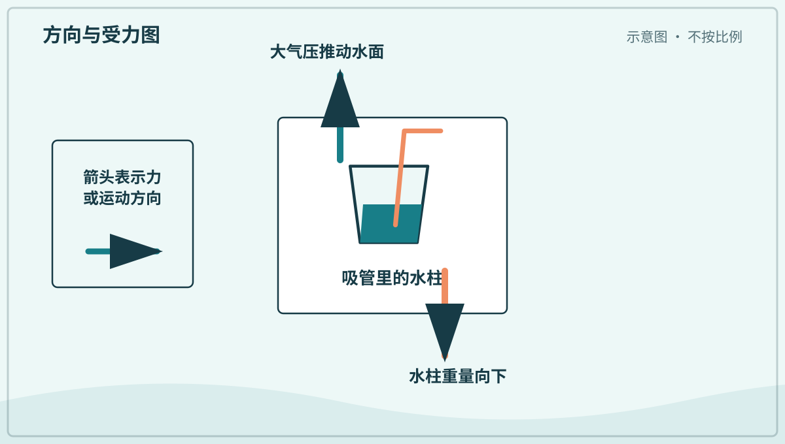

*图解：嘴里降低气压后，大气压推动杯中水面，水沿吸管上升。*

**一起试试：** 用自己的粗吸管喝清水，喝完记得清洗。

## 单元综合观察｜让空气留下证据

用完整气球、肥皂泡或倒扣空杯做一种安全观察，记录空气怎样占位或施力。吸管只喝可安全饮用的水，不做憋气或密封口鼻的实验。
