# 五月：动物各有办法

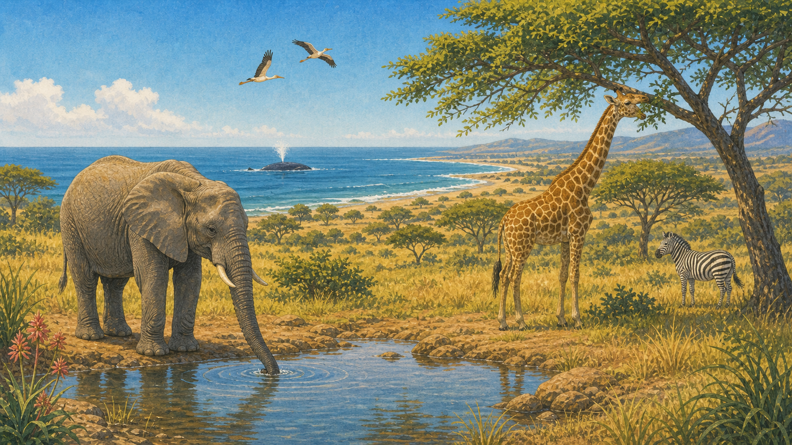

## 第 121 天｜鸟身上的羽毛有什么用？

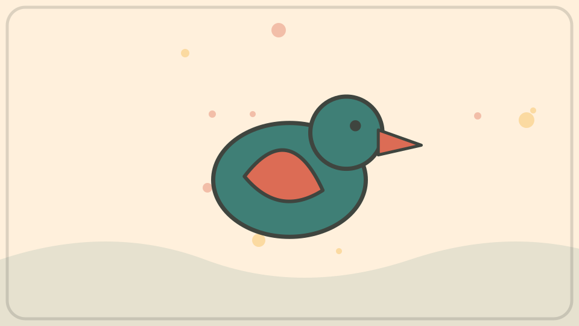

羽毛能帮助许多鸟飞行，也能保暖、防水、伪装和传递信号。外层飞羽较硬，绒羽蓬松柔软。鸟会整理羽毛，让羽枝重新扣在一起。

**再想一步：** 羽毛由角蛋白构成，中央羽轴分出羽枝，羽枝上还有更小的结构。许多小钩互相扣合，形成轻而连续的表面；受损时鸟喙能像拉拉链一样整理它。

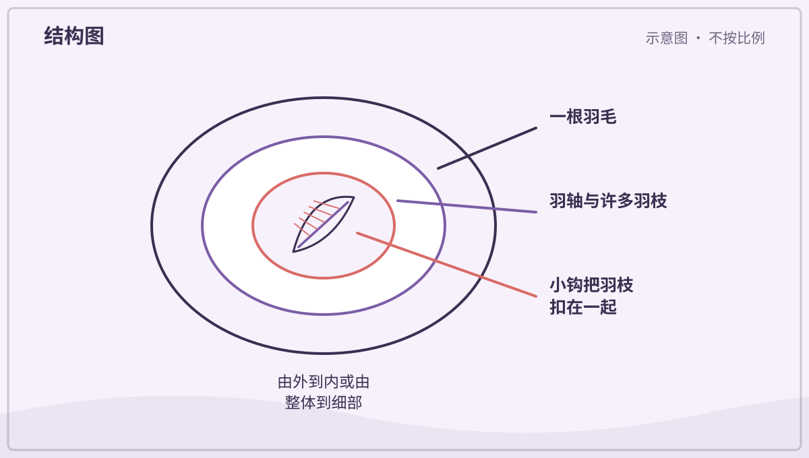

*图解：羽轴两侧长出羽枝，羽枝上的小钩互相扣住，组成轻而连续的羽片。*

**一起看看：** 只观察地上自然掉落的羽毛，不捡病鸟附近的羽毛。

---

## 第 122 天｜鸟为什么能飞起来？

鸟扇动翅膀，把空气向下、向后推动，空气也给鸟向上、向前的力。翼的形状和角度会让气流改变，产生升力。轻巧骨骼、强壮胸肌和羽毛共同帮助飞行。

**再想一步：** 飞行要同时平衡重力、升力、阻力和推力。鸟可以改变翼面弯曲、迎风角和羽毛间隙，所以起飞、滑翔、转弯与降落的受力并不相同。

*图解：鸟翼改变周围空气的速度和方向，空气对翅膀产生向上的合力。*

**一起看看：** 观察鸟起飞和降落时，翅膀与尾羽怎样改变。

---

## 第 123 天｜企鹅也是鸟，为什么不飞上天？

企鹅有羽毛、喙，也会产卵，所以是鸟。它们的翅膀演化成坚硬的鳍状肢，适合在水中“飞”，却不能提供空中飞行需要的动作和翼面。密实骨骼还帮助潜水。

**再想一步：** 演化常有取舍：更适合水下推进的短硬翅，不再适合空中拍动。水比空气密得多，企鹅用流线身体和强壮胸肌克服水的阻力。

*图解：普通鸟翼适合推动空气；企鹅较扁硬的鳍状翼适合推动密度更大的水。*

**一起看看：** 比较企鹅游泳和鸟飞行的录像，动作哪里相像？

---

## 第 124 天｜鸭子为什么不容易湿透？

鸭子的外层羽毛排列紧密，会挡住许多水。它还用喙把尾部腺体的油脂整理到羽毛上。羽毛间留住的空气既保温，也帮助身体浮起。

**再想一步：** 防水不是单靠“抹油”，羽毛微观结构、清洁整理和空气层都重要。贴近皮肤的绒羽若保持干燥，就能减慢水带走体热。

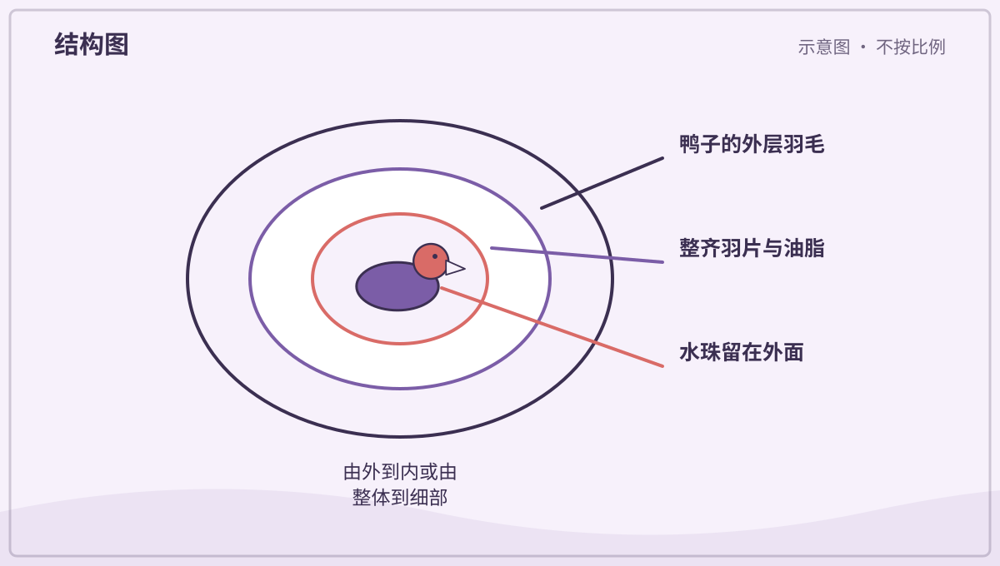

*图解：鸭羽互相扣合并带有油脂，水难以深入贴近皮肤，常在表面形成水珠。*

**一起看看：** 远看鸭子洗澡后怎样反复用喙梳理羽毛。

---

## 第 125 天｜啄木鸟不停啄树，头不晕吗？

啄木鸟的喙、颈部肌肉和头骨能把啄击力量沿合适方向传递。它每次啄击时间很短，头和喙又保持较直。许多身体结构共同降低受伤风险。

**再想一步：** 不能简单说啄木鸟有一块“海绵头骨”吸掉所有冲击。喙的形状、骨骼结构、舌骨装置、肌肉控制和较小脑体积都可能参与，科学家仍在研究细节。

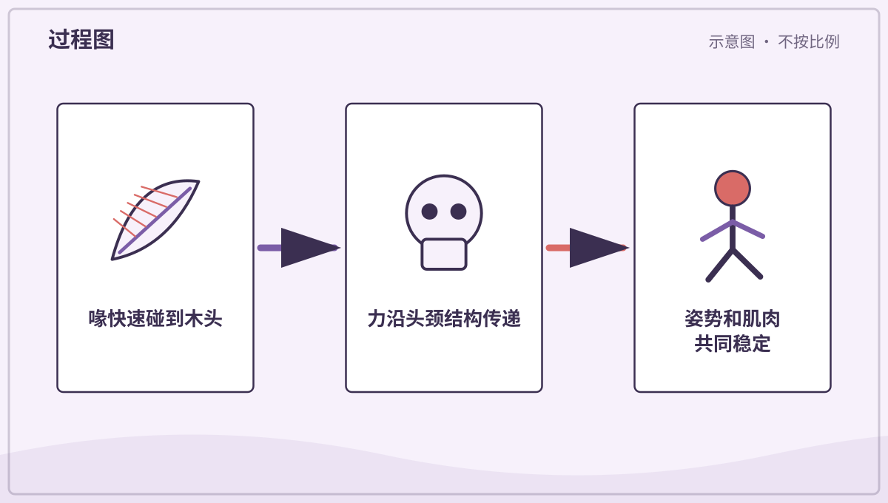

*图解：啄击产生的力沿喙、头骨、颈部和身体传递；适应结构和动作共同减小风险。*

**一起听听：** 在安全处听啄木鸟的敲击有没有重复节奏。

---

## 第 126 天｜猫头鹰飞行为什么很安静？

许多猫头鹰飞羽前缘像小梳子，表面又柔软蓬松。它们能把大的空气旋涡分散，减弱拍翼产生的某些声音。安静飞行让猎物较晚发现它。

**再想一步：** 降噪结构也可能牺牲一部分高速飞行效率，所以猫头鹰的翼通常较宽，适合较慢飞行。并不是所有猫头鹰在任何速度下都完全无声。

*图解：猫头鹰飞羽边缘的细小结构减弱较大的气流涡旋，使飞行声更分散。*

**一起看看：** 比较猫头鹰与海鸥翅膀边缘的清晰照片。

---

## 第 127 天｜火烈鸟为什么粉红粉红的？

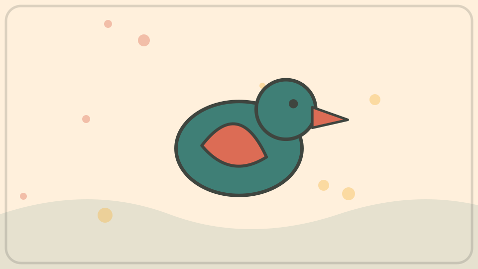

火烈鸟从藻类和小动物的食物中得到类胡萝卜素。身体把这些色素处理后，沉积在羽毛、皮肤等地方，颜色就变粉红。幼鸟通常较灰。

**再想一步：** 羽色深浅受食物、健康、年龄和种类影响，动物园也会配制合适食物。火烈鸟不是喝了粉色水，也不是一出生就一定鲜艳。

**一起看看：** 在一群火烈鸟照片里找找颜色最浅和最深的个体。

---

## 第 128 天｜什么动物叫哺乳动物？

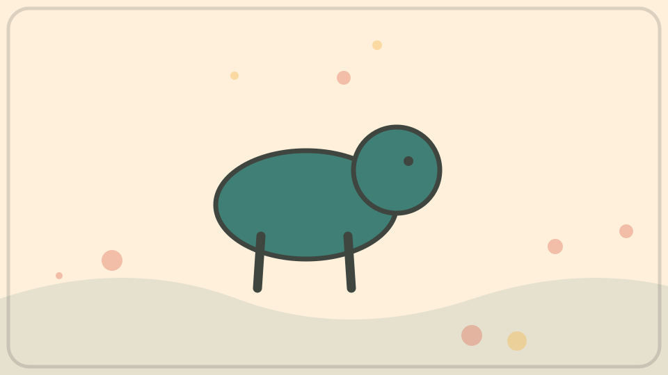

哺乳动物的妈妈能用乳汁喂养幼崽，身体在生命某阶段会有毛。大多数生下幼崽，也有鸭嘴兽等少数种类产卵。人、鲸、蝙蝠和猫都是哺乳动物。

**再想一步：** 分类依据共同祖先和一组身体特征，不只看住在哪里或会什么动作。鲸没有鱼鳃，蝙蝠不是鸟；它们仍保留哺乳动物的肺、乳腺和骨骼特点。

**一起说说：** 找三种外形很不一样的哺乳动物，说出共同点。

---

## 第 129 天｜鲸为什么要浮出水面？

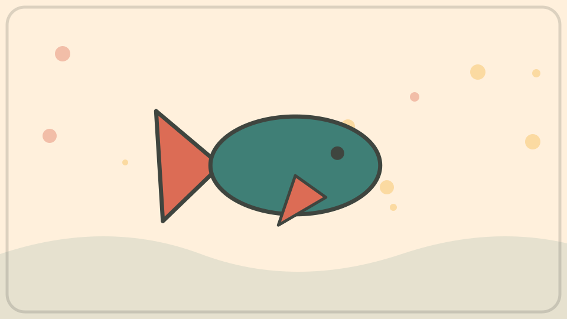

鲸是用肺呼吸的哺乳动物，不能从水里直接取得氧气。它们要浮到水面，从头顶的呼吸孔快速呼气、吸气，再潜回水下。喷气看起来白白的，是湿热空气和海水小滴。

**再想一步：** 潜水时鲸会减慢心率，把较多氧气留给大脑和心脏，肌肉中的肌红蛋白也能储氧。不同鲸的潜水时间和深度差别很大。

**一起看看：** 在录像里数鲸浮出水面后完成几次呼吸。

---

## 第 130 天｜海豚怎样在水下“看见”远处？

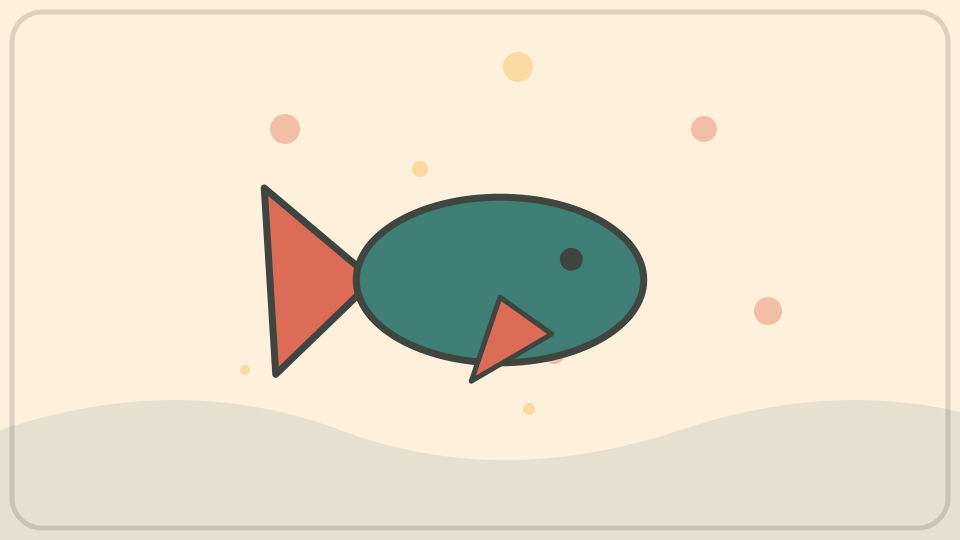

许多海豚发出很高的点击声，声音碰到物体后反射回来。它们分析回声到达的时间、强弱和变化，判断方向、距离和物体特点。这叫回声定位。

**再想一步：** 声音在水中传播得比空气中快，海豚头部的脂肪组织帮助聚焦声音，下颌附近组织接收回声。回声定位补充视觉，不表示海豚不用眼睛。

*图解：海豚发出短促声波，接收物体反射的回声，再由大脑判断方向和距离。*

**一起听听：** 在空房间拍一次手，听有没有迟到的小回声。

---

## 第 131 天｜蝙蝠真的看不见吗？

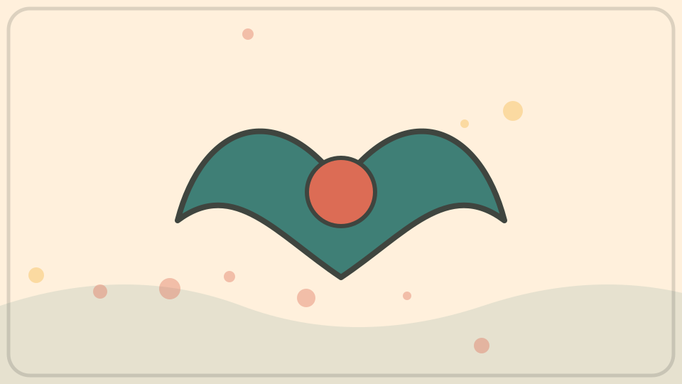

蝙蝠看得见，许多种类还会用回声定位。它们发出人耳常听不见的高频声，再听回声避开障碍、寻找食物。有些吃水果的蝙蝠更多依靠视觉和嗅觉。

**再想一步：** “蝙蝠都瞎”是错误说法。不同蝙蝠的感觉系统与食物、环境共同演化，回声定位频率和叫声形状也会随任务改变。

**一起看看：** 黄昏只和大人远看天空，不靠近或触碰蝙蝠。

---

## 第 132 天｜大象的鼻子为什么这么灵活？

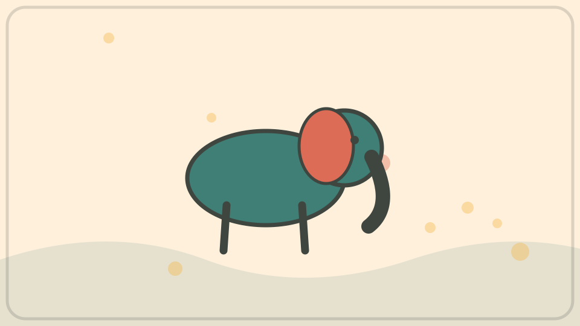

象鼻由上唇和鼻子延长形成，里面没有骨头，却有很多肌肉束。它能闻气味、呼吸、吸水再送入口中，也能抓取大小不同的东西。象鼻尖端还能做精细动作。

**再想一步：** 这种没有骨骼、靠肌肉保持形状的结构叫肌肉水压器，舌头和章鱼腕也有相似原理。不同方向肌肉收缩，让象鼻伸长、缩短、弯曲和扭转。

**一起模仿：** 用手臂慢慢做伸、卷、夹三个动作，想象需要哪些方向的力。

---

## 第 133 天｜长颈鹿怎样低头喝水？

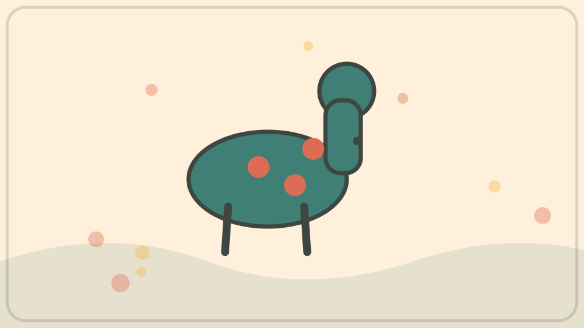

长颈鹿喝水时会把前腿分开或弯曲，让长脖子够到水面。它的心脏要产生较高压力，把血送到高高的大脑。低头时，血管和瓣膜帮助调节血流。

**再想一步：** 重力会让长柱液体产生压力差。长颈鹿的厚血管壁、颈静脉瓣和脑部附近血管网络共同避免血压变化过猛，不是一只特别大的心脏单独解决全部问题。

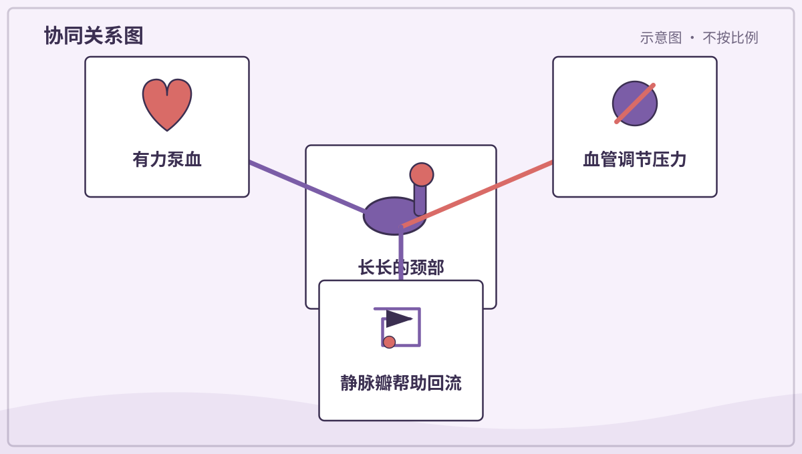

*图解：长颈鹿的心脏、弹性血管和调节结构共同维持抬头、低头时的血流。*

**一起看看：** 比较长颈鹿站立和喝水时四条腿的位置。

---

## 第 134 天｜斑马为什么有黑白条纹？

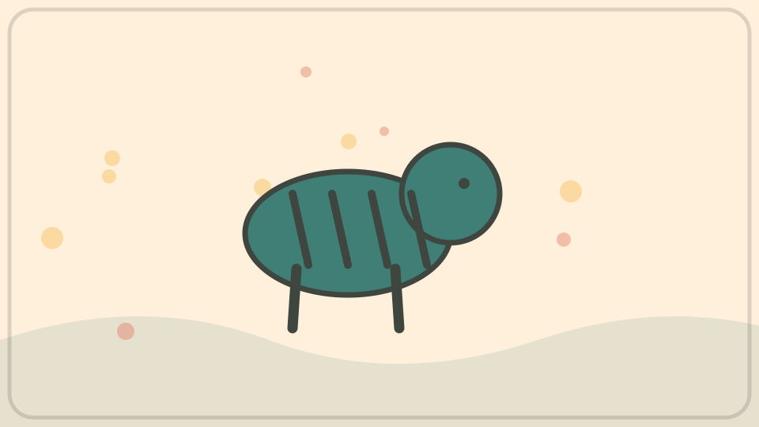

每只斑马的条纹都有些不同。研究发现，条纹能减少某些会叮咬的虻成功落在身上，也可能参与辨认、体温调节或视觉混淆。科学家仍在比较这些作用有多重要。

**再想一步：** 一个特征可以同时有多种效果，不能看起来像伪装就宣布只有一个答案。科学家会用野外观察、模型和实验分别检验不同解释。

**一起看看：** 比较两只斑马照片，找找肩部条纹哪里不同。

---

## 第 135 天｜骆驼驼峰里装的是水吗？

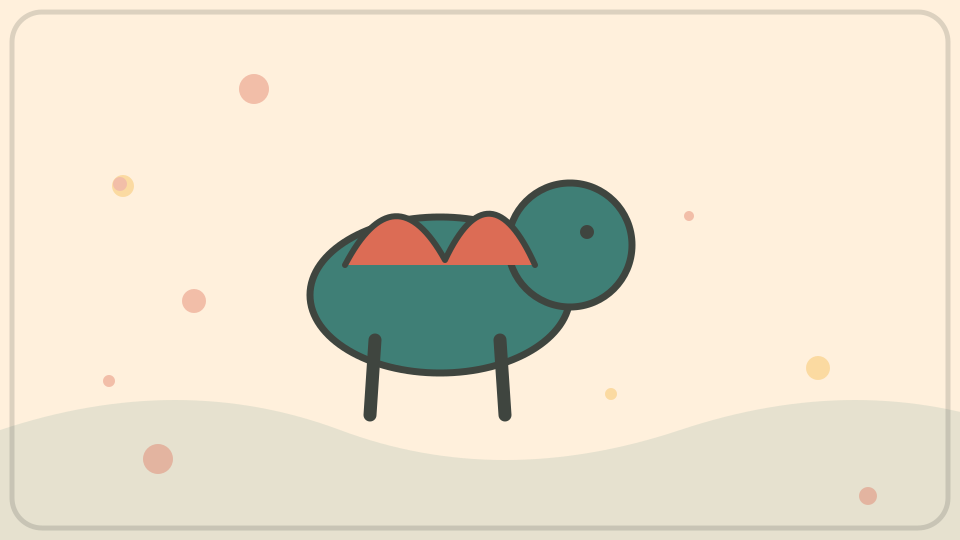

驼峰主要储存脂肪，不是一袋水。需要时，骆驼能分解脂肪得到能量，并产生一些代谢水。它的鼻腔、血液和身体调温方式也帮助减少失水。

**再想一步：** 把脂肪集中在背部，比让厚脂肪包满全身更利于散热。骆驼能忍受较大的体温变化、排出浓尿，但仍需要饮水，并不是永远不喝水。

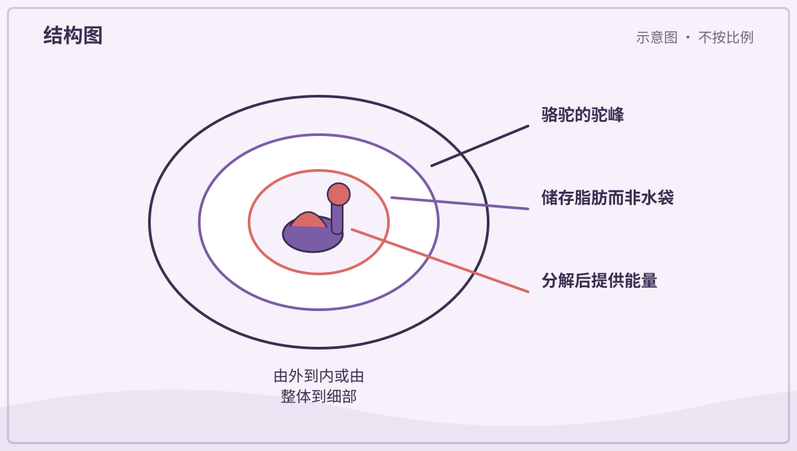

*图解：驼峰主要储存脂肪；需要时脂肪可供能，代谢过程中也会产生少量水。*

**一起看看：** 在照片里找骆驼的长睫毛、宽脚掌和能闭合的鼻孔。

---

## 第 136 天｜北极熊的毛真是白色吗？

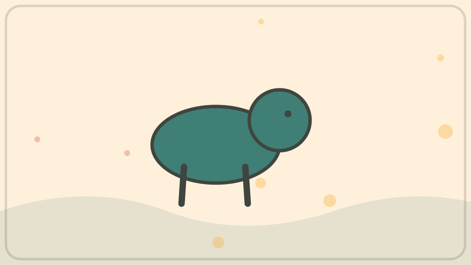

北极熊单根毛多接近透明，光在许多毛之间散射后，整体看起来白或微黄。毛下面的皮肤颜色较深。厚脂肪和毛层一起帮助保温。

**再想一步：** 不能简单说每根毛像光纤把阳光送到皮肤，这种流行解释并不准确。白色外观主要是复杂的散射结果，毛里夹住的空气还能减慢热传递。

**一起看看：** 比较北极熊在阳光和阴影照片里的毛色。

---

## 第 137 天｜大熊猫只吃竹子吗？

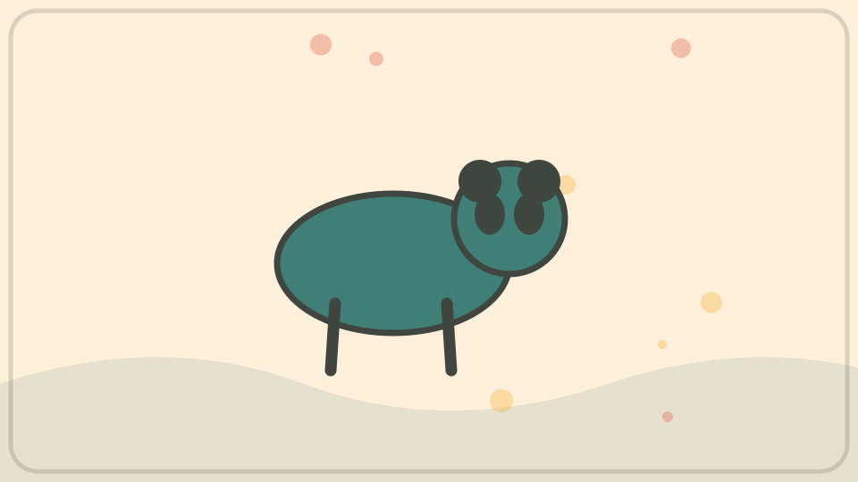

野生大熊猫的食物绝大部分是竹子，但它们在分类上属于食肉目，也偶尔吃其他食物。竹子能量不高，所以大熊猫一天要花很多时间进食。

**再想一步：** 大熊猫有发达臼齿和强壮颌肌，腕骨还形成像“拇指”的结构来握竹子。它的消化道仍较像其他食肉目动物，不能高效分解全部植物纤维。

**一起看看：** 观察熊猫握竹子时，真正手指旁边还有什么突起。

---

## 第 138 天｜袋鼠宝宝为什么住在袋子里？

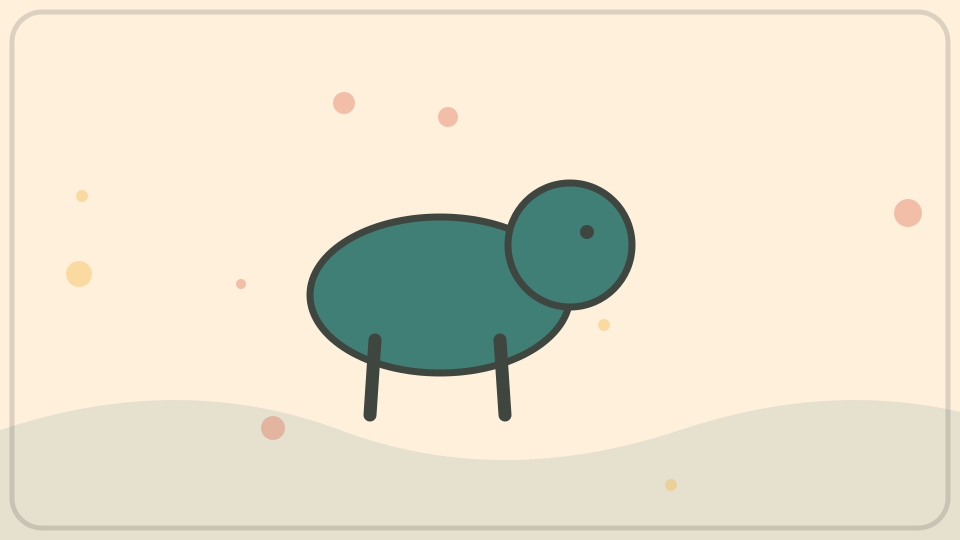

袋鼠属于有袋类。宝宝出生时非常小，会爬到妈妈腹部的育儿袋，吸住乳头继续生长。长大一些后，它会探头、出袋，再回来吃奶和躲避危险。

**再想一步：** 有袋类的胚胎在子宫内发育时间较短，出生后的发育更多在乳头附近完成。袋子不是一只可以取下的口袋，而是带肌肉和乳腺的身体结构。

**一起看看：** 在录像里观察不同大小的幼崽怎样进出育儿袋。

---

## 第 139 天｜树懒为什么动作慢？

树懒主要吃能量不高、较难消化的叶子，代谢速度较慢。缓慢活动能节省能量，也可能让捕食者不容易从动作发现它。弯曲的爪帮助它悬挂树枝。

**再想一步：** 树懒体温会比许多哺乳动物变化更明显，消化一餐也可能很久。慢不是“懒惰的选择”，而是一整套生理与生态适应。

**一起模仿：** 用十秒完成一次慢慢抬手，感受控制动作也要专心。

---

## 第 140 天｜刺猬的刺会射出去吗？

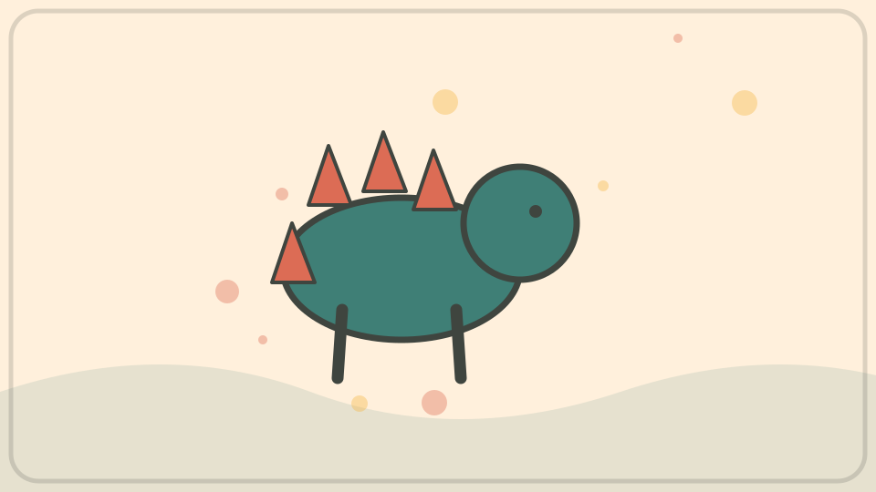

刺猬的刺是变硬、变粗的毛，连在皮肤上，不会主动射出去。遇到危险时，皮下肌肉让刺竖起，身体卷成球，保护脸和腹部。刺会自然更换。

**再想一步：** 豪猪的刺和刺猬的刺结构不同，有些豪猪刺很容易脱落并扎进攻击者，但也不是发射出去。相似的防御外形可以在不同动物中独立演化。

**一起看看：** 比较刺猬与豪猪的身体大小、刺长和防御姿势。

---

## 第 141 天｜兔子的耳朵为什么长？

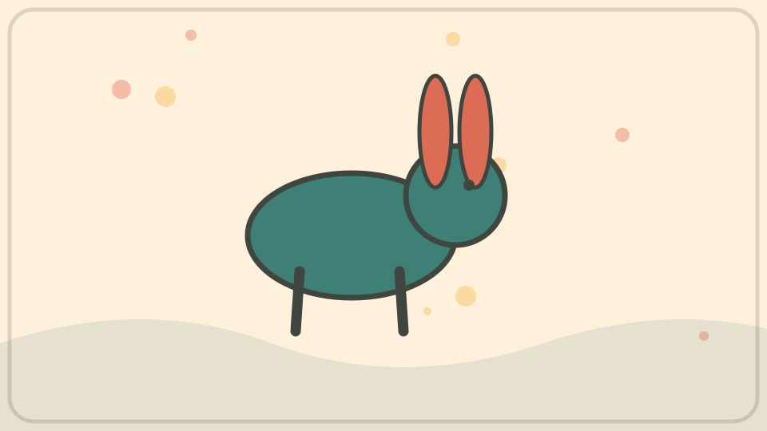

长耳朵能收集声音，还能转向不同方向，帮助兔子发现危险。耳朵里有丰富血管，部分种类也能通过它散热。不同兔种和野兔的耳朵长短并不相同。

**再想一步：** 大表面积让血液较容易把热传给空气，但环境温度、毛量和血流调节都影响效果。沙漠动物的大耳常更利于散热，寒冷地区近亲的耳朵往往较短。

*图解：温暖血液流经兔耳，把热传给空气；较凉的血再流回身体。*

**一起听听：** 双手放在耳后增加面积，比较声音有没有变化。

---

## 第 142 天｜猫的胡须是普通毛吗？

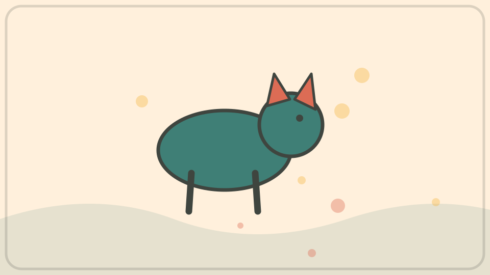

猫的胡须比普通毛粗，根部周围有丰富神经。胡须弯曲时，猫能感到附近物体、空气流动和缝隙大小。眼睛上方和腿部也可能有触须。

**再想一步：** 胡须本身不是神经，却像杠杆把轻微触碰传到毛囊感受器。剪掉胡须不会像剪神经一样疼，但会损害感觉能力，所以不能剪。

**一起看看：** 只观察猫胡须朝向，不拉、不剪，也不突然摸脸。

---

## 第 143 天｜狗的鼻子为什么这么灵？

狗鼻腔里感受气味的区域比人更大，嗅觉受体也更多。它能用快速短嗅不断采样，还能分辨左右鼻孔收到气味的差别。湿鼻面有助于捕捉一些气味分子。

**再想一步：** 气味分子与不同受体组合，形成类似“气味密码”的神经信号。狗的嗅觉表现还受品种、训练、风向、湿度和个体健康影响。

**一起看看：** 观察狗散步时在哪些地方停下闻，不让它闻危险物。

---

## 第 144 天｜牛为什么总在嚼？

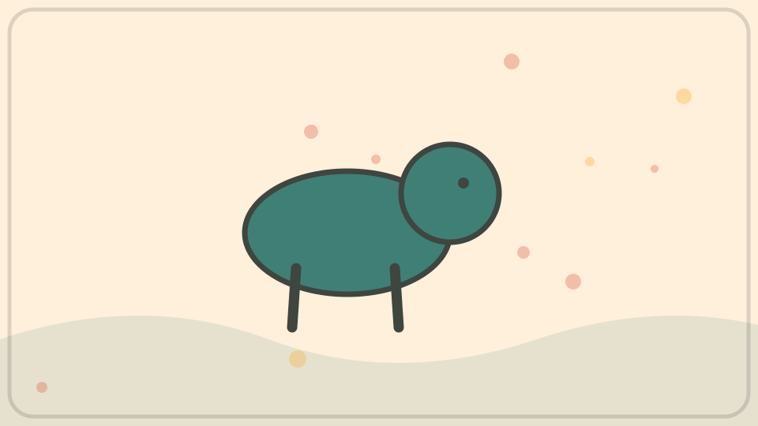

牛先把草快速吞进多室胃的前部，微生物开始分解。休息时，一部分食物返回口中再细嚼，然后重新吞下。这个过程叫反刍。

**再想一步：** 牛自己不能制造分解纤维素所需的全部酶，瘤胃里的微生物帮忙发酵植物纤维。牛再吸收发酵产物，也消化一部分微生物获得营养。

**一起看看：** 从安全距离观察休息的牛，下巴是否有规律地移动。

---

## 第 145 天｜马可以站着睡觉吗？

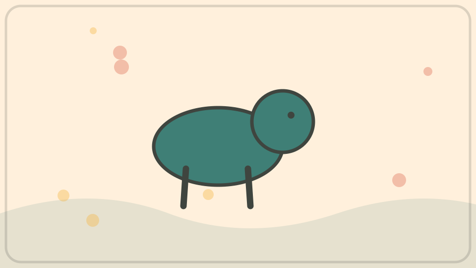

马的腿有一套肌腱和韧带结构，能在少用肌肉力量时锁住关节，所以可以站着打盹。这样遇到危险能较快移动。不过马也会躺下，才能得到完整的深睡和快速眼动睡眠。

**再想一步：** 这套结构叫站立装置，它减少长时间站立的能量消耗。能站着休息不等于永远不用躺下，长期不能安全躺卧会影响健康。

**一起看看：** 在照片里找马休息时有没有一条后腿轻轻放松。

---

## 第 146 天｜鱼怎样在水里呼吸？

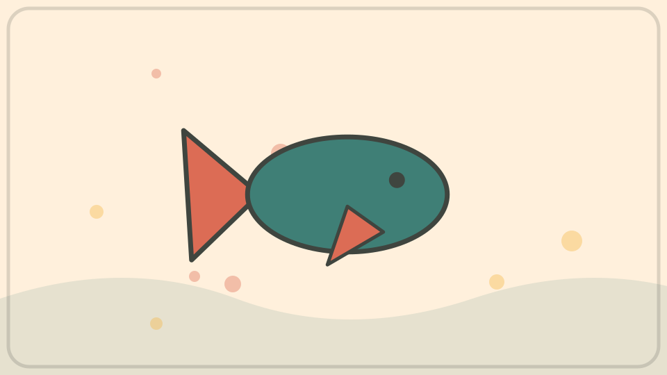

多数鱼让水从口进入，流过鳃，再从鳃盖附近出去。鳃丝很薄，里面有许多血管，水中的氧会进入血液，二氧化碳则离开。鱼利用的是溶在水里的氧。

**再想一步：** 鳃中血液常与水流方向相反，能在更长距离保持氧浓度差，提高交换效率，这叫逆流交换。多数鱼的鳃离开水后容易塌陷并变干，不能靠空气正常呼吸；肺鱼、弹涂鱼等少数鱼类另有利用空气的结构和办法。

*图解：水流过鳃丝和鳃小片，水中的氧跨过薄膜进入血液。*

**一起看看：** 观察鱼鳃盖有节奏地开合，不敲鱼缸。

---

## 第 147 天｜鱼怎么停在水中不上不下？

许多硬骨鱼体内有充气的鳔。改变鳔里气体的量，会改变整体体积和平均密度，帮助鱼调节浮力。鳍和游动仍要负责保持姿势和细微位置。

**再想一步：** 浮力等于被排开水的重量。深度改变时水压也改变气体体积，有些鱼用血液缓慢调气，有些能把气体吞入或排出；鲨鱼没有典型鱼鳔。

*图解：鱼改变鳔内气体体积来调节平均密度，使浮力接近自身重量。*

**一起看看：** 观察鱼停住时，胸鳍是否还在轻轻摆动。

---

## 第 148 天｜鲨鱼的骨头和我们的骨头一样吗？

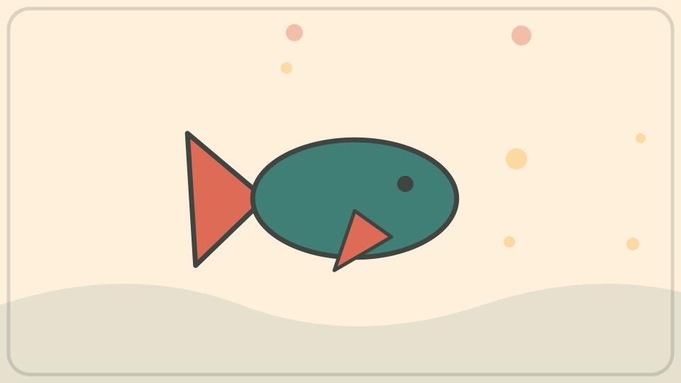

鲨鱼的骨架主要由软骨组成，不是像人类骨骼那样的硬骨。软骨较轻又有弹性，能支撑身体。它们的牙齿和皮肤小齿却很坚硬。

**再想一步：** 鲨鱼依靠油脂丰富的肝脏、宽大的胸鳍和持续游动帮助获得浮力。软骨骨架不是“没有骨架”，而是采用另一种支撑材料。

**一起看看：** 摸摸自己的耳廓，它也是软骨，但不要把它当成鲨鱼骨架的完全模型。

---

## 第 149 天｜章鱼的腕为什么能到处弯？

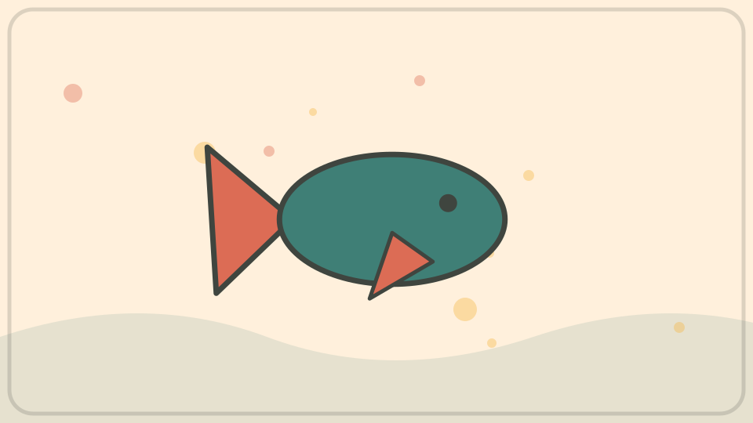

章鱼有八条腕，里面没有骨头。不同方向的肌肉互相配合，让腕伸长、缩短、弯曲和扭转。吸盘能抓握、感觉触碰，还能感受一些化学物质。

**再想一步：** 章鱼腕也是肌肉水压器，体积大致不变，所以某个方向变细会让它伸长。大量神经元分布在腕中，局部神经回路能处理许多动作细节。

**一起模仿：** 用一条软毛巾摆出弯、卷、扭三种形状。

---

## 第 150 天｜动物脚印能告诉我们什么？

脚印会留下脚趾、肉垫、蹄或爪的形状。连续足迹还能提示动物走路、奔跑或跳跃的方式。泥土软硬、速度和脚掌角度都会改变印迹。

**再想一步：** 科学家把足迹、粪便、毛和啃咬痕等叫作踪迹证据。一个模糊脚印通常不能单独确定物种，要结合尺寸、步幅、环境和其他线索。

**一起看看：** 只观察不追踪野生动物，比较人鞋印和鸟脚印。

---

## 第 151 天｜动物为什么要搬很远的家？

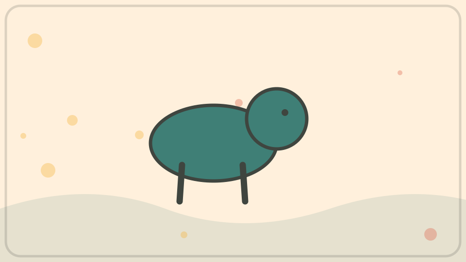

一些动物会在季节变化时迁徙，寻找食物、繁殖地或更合适的温度。鸟、鲸、鱼、蝴蝶和许多其他动物都可能迁徙。路线有的每年往返，有的只走一次。

**再想一步：** 动物用太阳、星星、地标、气味和地球磁场等线索导航，不同物种组合不同。迁徙消耗能量也有风险，但在长期环境中带来的生存与繁殖收益更大。

**一起看看：** 在地图上用手指画一条从冷地方到暖地方的季节路线。
