# 兴趣单元 06｜云、降水与雷雨

> **探索领域 02：** 空气、天气与水
>
> **核心问题：** 小水滴和冰晶怎样组成云，并在不同条件下变成雨、雪、冰雹、雷电、雾和露？

这个单元把天空中的水和电排成几条清楚的形成链，同时强调相似外观可能来自不同高度与条件。

## 怎样沿着本单元的追问链阅读

先定位现象发生在云中、近地面还是物体表面，再追踪温度、粒子大小、上升气流与电荷。

## 追问链 06.1｜云滴怎样长成降水

湿空气上升冷却形成云滴，云滴或冰晶长大后形成雨、雪或冰雹。

### 第 038 问｜云是怎样长出来的？

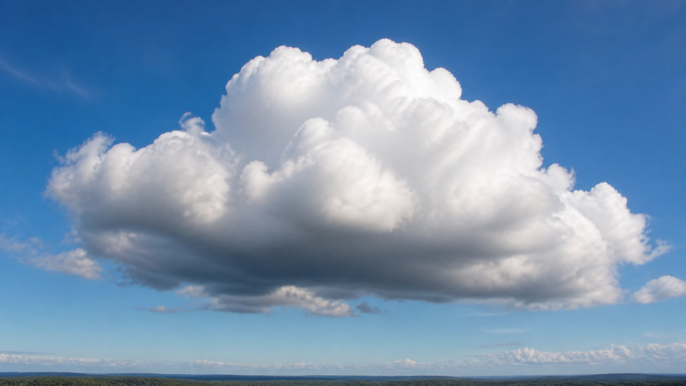

*写实观察图：厚云的受光面可以很白，背光和较厚的部分看起来更灰；这不是两朵不同颜色的云。*

地面和水面的水会变成看不见的水汽。湿空气升高、变凉，水汽聚成许多小水滴或小冰晶。它们挤在一起，就成了我们看见的云。

**再想一步：** 水汽凝结通常要依附灰尘、盐粒等微小颗粒，这些叫凝结核。空气上升时压力降低并膨胀，温度会下降，更容易达到凝结条件。

**把知识连起来：** 湿空气被山坡、暖地面或天气系统抬高时，外界压力下降，空气团膨胀并冷却。温度降到露点后，水汽在凝结核上聚成云滴；温度更低处还会形成冰晶。云不是静止棉花，云滴一边形成、蒸发、碰撞，一边随气流进出；看到的云边界是凝结条件所在的位置。

**再往外看：** 不同抬升方式会形成积云、层云等不同外观。辨认云形不是给天空贴标签，而是在猜测空气正怎样上升、混合和改变水的状态。

**容易弄混：** 云不等于大量水汽本身。水汽看不见，我们看见的是水汽已经凝结或凝华成的液滴和冰晶。

*图解：潮湿空气上升、膨胀并冷却，水汽依附凝结核形成小云滴。*

**一起看看：** 找一朵云，看看它的边缘是整齐还是毛茸茸。

---

### 第 039 问｜雨为什么会落下来？

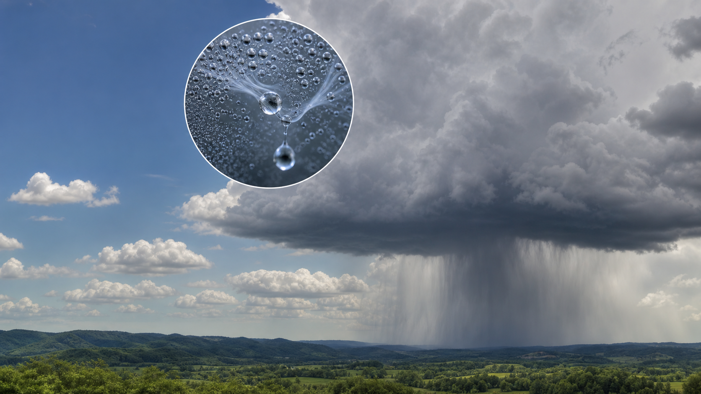

云里的小水滴会碰在一起，慢慢变大。水滴大到上升的空气托不住时，重力把它们拉向地面，于是下雨了。落下时，有些水滴还会改变大小。

**再想一步：** 暖云里小滴可碰并合成大滴；冷云里冰晶也会长大，再融成雨。降水形成有多条路径，云里有水滴不等于马上会下雨。

**把知识连起来：** 普通云滴非常小，落下速度慢，容易被上升气流托住。暖云中，大滴追上小滴并合；冷云中，冰晶从周围水汽和过冷水滴得到水分，长大后下落，穿过暖层可融成雨。雨滴离开云后若经过干燥空气，可能在落地前完全蒸发，形成云下垂着却到不了地面的雨幡。

**再往外看：** 雨把大气中的水和溶解物带回地面，补给土壤、河流和地下水，也可能造成侵蚀与洪水。一次降水事件会同时进入水循环和地貌变化。

**容易弄混：** 下雨不是云突然破了一个洞，也不是云滴一形成就会落地。微小云滴要先增长到足够大，且下落能胜过上升气流。

*图解：小云滴或冰晶不断碰并长大，重到上升气流托不住时便落下。*

**一起听听：** 在屋里听雨打窗、屋檐和树叶，声音一样吗？

---

### 第 040 问｜雨滴真的是眼泪形吗？

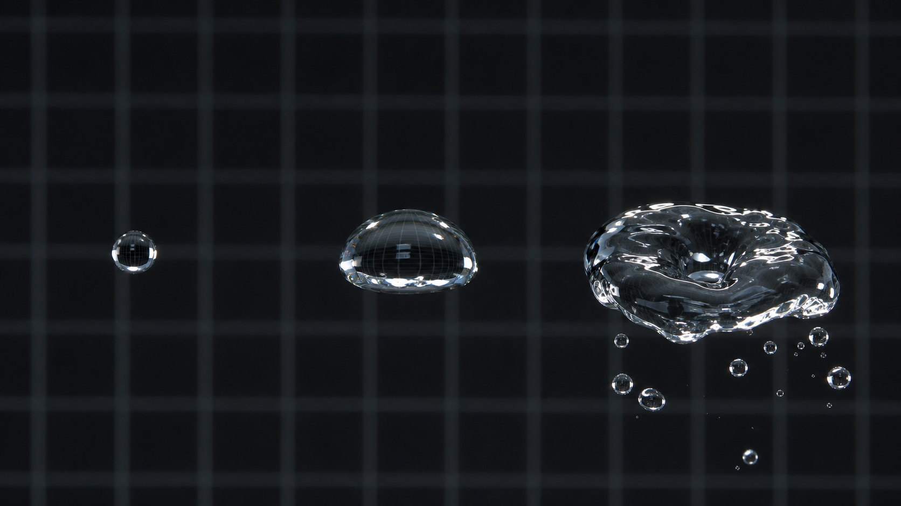

很小的雨滴接近圆球。较大的雨滴落下时，空气会把底部托得扁一些，像小面包。雨滴不是尖尖的眼泪形，图画只是常用那个符号表示雨。

**再想一步：** 表面张力想让水滴缩成表面积较小的球形，空气阻力却会在下落时改变它。水滴大到一定程度还可能被气流撕成更小的滴。

**把知识连起来：** 小水滴受表面张力控制，最接近球形。水滴变大、下落变快后，迎面的空气把底部压平，上方仍较圆，形状更像汉堡面包；再大时中央可能凹下并最终分裂。雨滴尺寸不同，达到的稳定下落速度也不同，大滴通常更快，但不会无限加速。

**再往外看：** 雾滴、喷雾和水龙头飞溅也受表面张力与空气阻力影响。高速摄影让科学家看见肉眼无法分辨的变形和破裂过程。

**容易弄混：** 天气图标里的尖头水滴是方便识别的符号，不是真实高速摄影的形状。眼泪在脸上被重力和皮肤拉长，也不能用来代表空中雨滴。

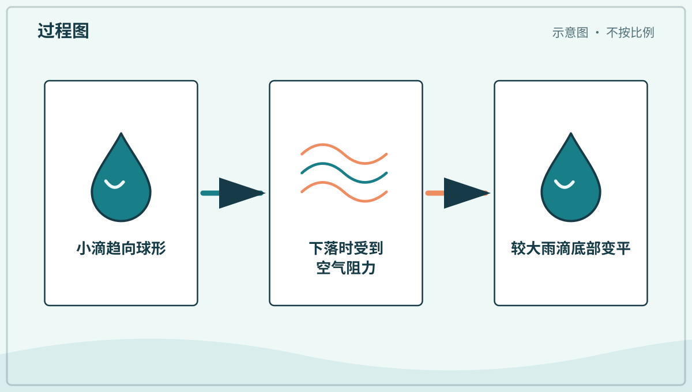

*图解：表面张力把小雨滴拉向球形，空气阻力会把下落雨滴底部压平。*

**一起看看：** 雨后观察窗上的小水珠，它们大多是什么形状？

---

### 第 041 问｜雪和雨有什么关系？

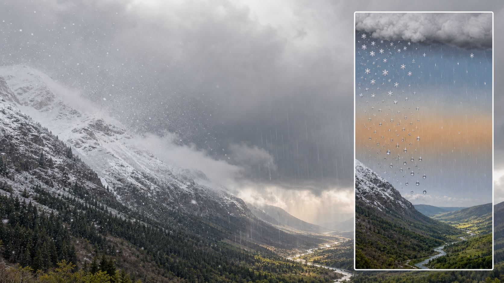

雨和雪都来自云里的水。空气足够冷时，水会长成冰晶，冰晶聚在一起成为雪花。落下途中若遇到暖空气，雪也可能融成雨。

**再想一步：** 地面温度不能单独决定下雨还是下雪，水滴或冰晶一路经过的整层空气都重要。不同高度的冷暖分布还可能形成冻雨或冰粒。

**把知识连起来：** 降水从云中到地面会穿过一整列冷暖空气层。雪晶一路保持在冰点以下，便以雪落地；先经过暖层融化、再遇浅冷层，可能成为冻雨并在物体上结冰；若冷层够厚，液滴会重新冻成冰粒。气象学家用气球和雷达了解垂直温度结构，才能判断落下来的种类。

**再往外看：** 积雪能储水和反射阳光，冻雨会给交通和电线带来风险。准确区分降水类型不仅是命名，也直接关系到安全与水资源。

**容易弄混：** 地面低于零度不保证一定下雪，地面高于零度也不保证雪花立刻消失。关键是降水沿途经历的温度和湿度。

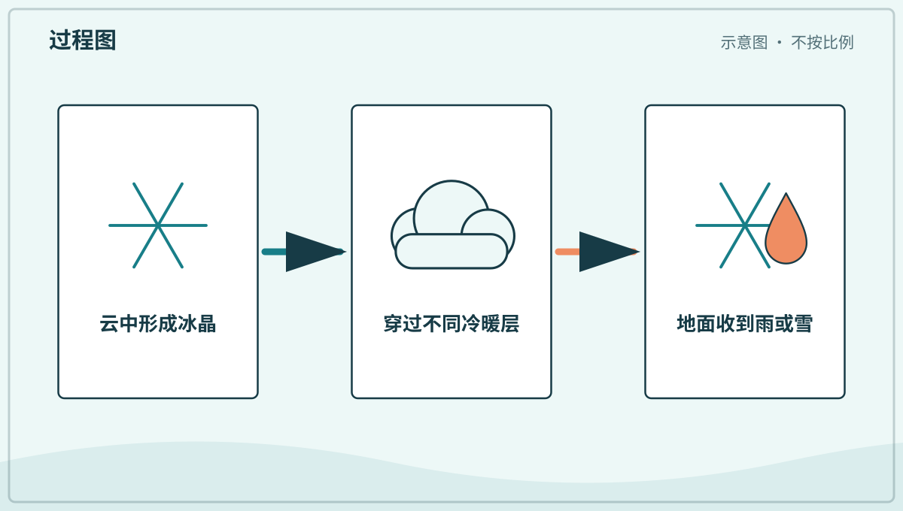

*图解：雪花穿过整层大气；沿途温度决定它保持冰晶还是融成雨。*

**一起说说：** 雪落在手套、地面和水里，后来分别怎样了？

---

### 第 042 问｜冰雹为什么是小冰球？

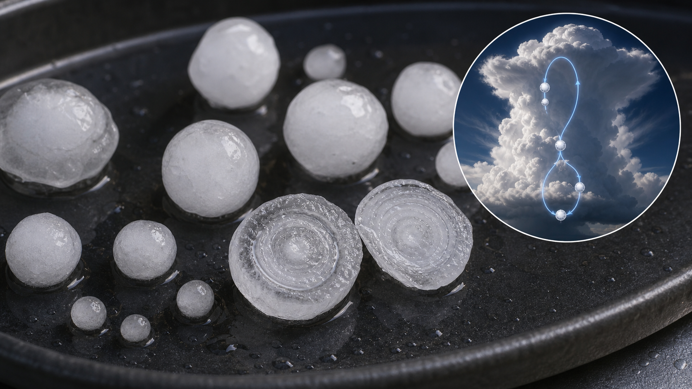

有些高大的雷雨云里，强上升气流能托住小冰粒。冰粒在云中移动时碰到过冷水滴，一层层结冰，长成冰雹。它重到气流托不住时就会落下，所以冰雹天要待在安全的室内。

**再想一步：** 云中有些水滴低于冰点仍保持液态，叫过冷水滴。它们撞上冰核会迅速冻结；冰雹切开后的一层层结构记录了它在云里的成长过程。

**把知识连起来：** 冰雹常在强雷暴的上升气流区域成长。小冰粒与过冷水滴碰撞，水滴来不及摊平时会冻成含气泡的白层，水量较多、冻结较慢时可形成较透明的层。冰粒在云中经历不同含水区域，层层增大；当上升气流和空气阻力再也托不住它，或它离开强气流区，就落向地面。

**再往外看：** 天气雷达能从回波判断强降水和可能的冰雹区域，预警帮助人们进入室内、保护车辆和农作物。成因知识最终要转化成安全行动。

**容易弄混：** 冰雹不是冬天的雪捏成球，也不要求地面天气寒冷。它可以在暖季雷暴中形成，因为高大云体上部仍然非常寒冷。

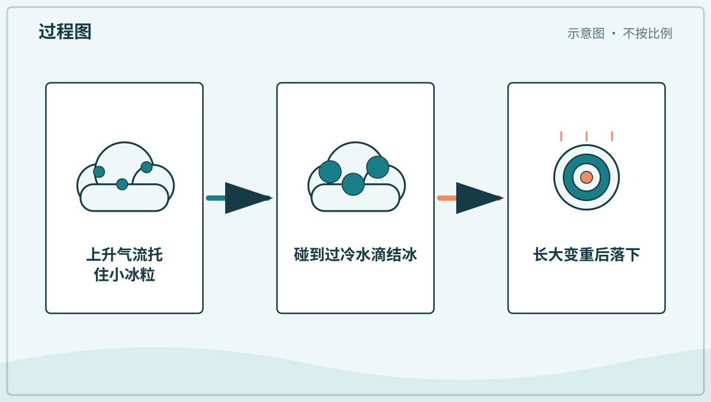

*图解：小冰粒在强上升气流附近移动，碰到过冷水滴后一层层冻结成冰雹。*

**一起看看：** 只从窗内观察，等天气安全后再和大人查看地面。

## 追问链 06.2｜雷声与闪电

快速放电加热空气，空气急剧膨胀并形成传播的声波。

### 第 043 问｜雷声为什么轰隆隆？

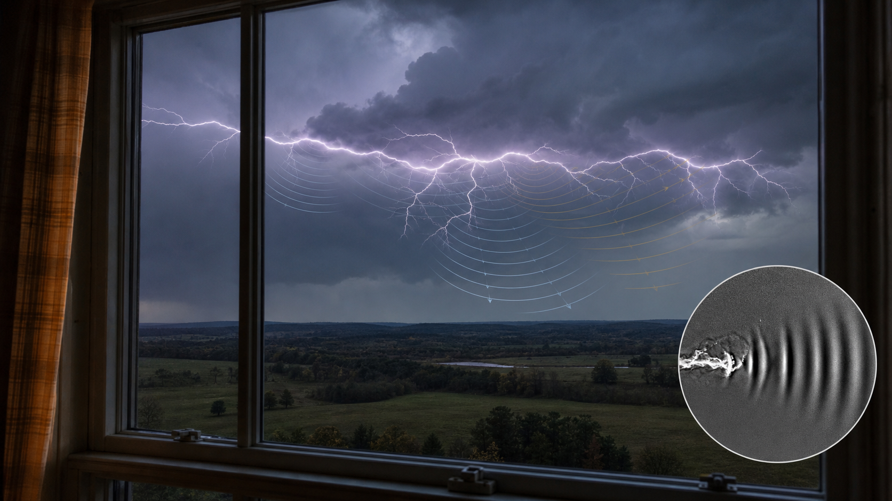

闪电会在一瞬间把周围空气加热得很厉害。空气猛地膨胀，推出一圈圈声波，我们就听到雷声。光比声音来得快，所以常先看见闪电。

**再想一步：** 雷声会被不同方向和距离的闪电通道陆续送来，也会被云和地面反射，所以常拖成长长的轰隆声。看见闪电和听见雷之间的间隔还能粗略提示距离。

**把知识连起来：** 闪电通道周围空气在极短时间内升到很高温度，急剧膨胀产生冲击波，传播远后成为声波。声音在空气中每秒大约走三百四十米，光到达眼睛几乎不用等待；闪光与雷声每相差约三秒，雷电距离大致增加一千米。弯曲闪电各段距离不同，加上山地、云层和建筑反射，雷声便拉成长串。

**再往外看：** 声音比光慢的现象也用于定位烟花、爆炸和地震波源。只要知道传播速度并测量时间差，就能把时间信息换成距离估计。

**容易弄混：** 不能等听到雷才判断闪电是否危险。只要能听见雷，通常就应进入坚固建筑或封闭车辆，远离树下、空旷地和水面。

**一起记住：** 听见雷声就和大人进入结实的室内，不在树下停留。

---

### 第 044 问｜闪电是天空里的电吗？

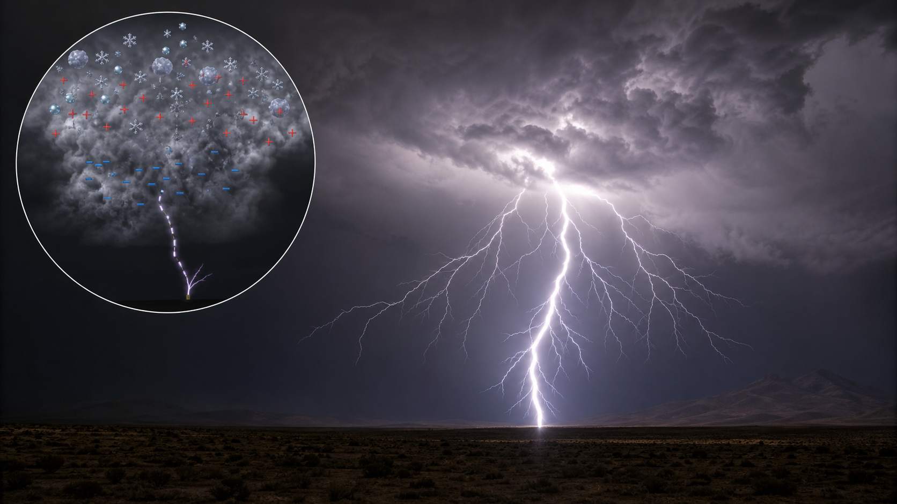

雷雨云里，冰粒和水滴不停碰撞，让电荷分开。差别大到空气也挡不住时，电荷快速移动，就出现明亮的闪电。它很危险，只能从安全室内观察。

**再想一步：** 平常空气是绝缘体，不容易让电荷通过；强电场会把空气电离，形成可导电的通道。一次闪电常由多个极快的放电过程组成。

**把知识连起来：** 雷暴云中冰晶、霰和水滴碰撞并被气流分开，云的不同区域积累异号电荷。电场足够强时，空气分子被电离，分叉的先导通道向前发展；通道接通后，强烈回击迅速发光。放电既可能在云内、云间发生，也可能连接云和地面，方向和过程比一条从天空劈下的线复杂。

**再往外看：** 小尺度静电实验可安全展示同号排斥、异号吸引和放电火花，但雷暴能量巨大。相似概念跨越不同尺度时，实验方法和安全边界必须随之改变。

**容易弄混：** 闪电和摸门把手的小静电都涉及电荷与放电，但能量和尺度完全不同。不能用家庭小实验模仿雷电，更不能在雷雨中到户外观察。

*图解：云内电荷分离产生强电场，空气被电离后形成快速放电通道。*

**一起记住：** 雷雨时远离窗边、水边和插电设备，听大人安排。

## 追问链 06.3｜贴近地面的雾和露

雾是近地面的悬浮小滴，露是水汽在较冷表面凝结。

### 第 045 问｜雾为什么像落到地上的云？

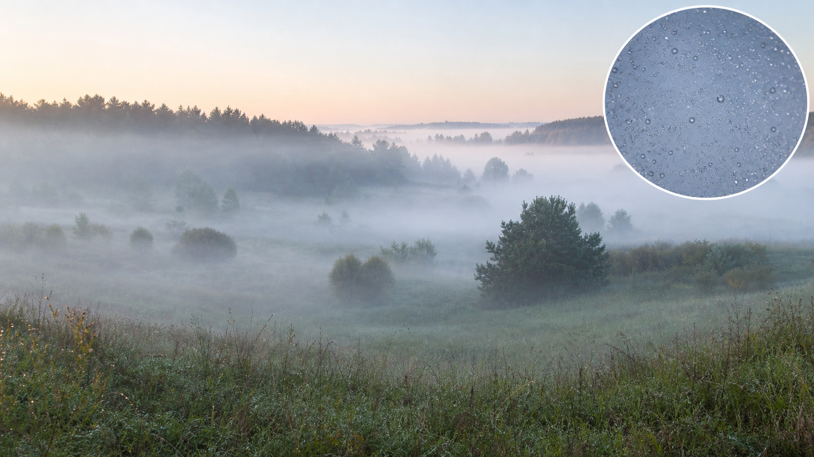

雾和云都由悬在空气里的小水滴组成。云通常在高处，雾贴近地面，所以我们会走进它里面。雾会挡住远处的光，让道路变得不容易看清。

**再想一步：** 空气冷却到水汽开始凝结的温度叫露点。地面附近空气达到露点，就可能形成雾；风、湿度和地形会影响雾何时出现和消散。

**把知识连起来：** 雾有多种形成路径：地面夜间冷却可形成辐射雾，暖湿空气流过冷表面可形成平流雾，湿空气沿山坡抬升也会冷却成雾。雾滴直径很小，能随微弱气流悬浮，并把车灯等光线向各处散射，反而让强光下的视线更白更乱。太阳加热或较干空气混入后，雾滴蒸发，雾才逐渐散开。

**再往外看：** 机场、公路和港口用能见度测量安排运行。雾的研究把相变、光散射、地形和交通安全连在一起，是多种知识共同解决问题的例子。

**容易弄混：** 雾不是一种有毒气体，也不等于下小雨。它由悬浮微滴造成；空气污染可能与雾同时存在，但需要另外检测。

**一起看看：** 有雾时从安全的窗边看，远近的东西谁先消失？

---

### 第 046 问｜早晨的露珠从哪里来？

夜里，叶子和草会慢慢变凉。空气里的水汽碰到凉凉的表面，变成小水滴，这就是露。露不是叶子哭出来的。

**再想一步：** 晴朗、风小的夜晚，地面更容易向天空散失热量，表面温度可能降到露点。若表面低于冰点，形成的可能是霜而不是液态露水。

**把知识连起来：** 露水常优先出现在叶片、车顶和金属栏杆上，因为这些表面夜间容易辐射降温。附近空气接触冷表面后降到露点，水分子在微小尘粒和表面凹凸处聚集，水滴再因表面张力变圆。树荫、风和材料都会改变降温速度，所以露珠分布并不均匀。

**再往外看：** 露水能给一些干旱环境中的小生物和植物提供水，也启发了集雾网和集露表面的设计。观察自然表面的水珠，可以连接生态与材料工程。

**容易弄混：** 叶缘清晨出现的水珠不一定全是露。植物有时会从叶片边缘排出液态水，叫吐水；露来自空气水汽凝结，来源不同。

**一起看看：** 用眼睛找圆圆的露珠，先别摇动叶子。

## 单元综合观察｜做一张降水条件图

用照片比较云、雾、露、雨、雪和冰雹，给每种现象标出大致位置与水的状态。雷雨时留在安全室内，不去户外追看闪电。
