# 六月：我的身体会工作

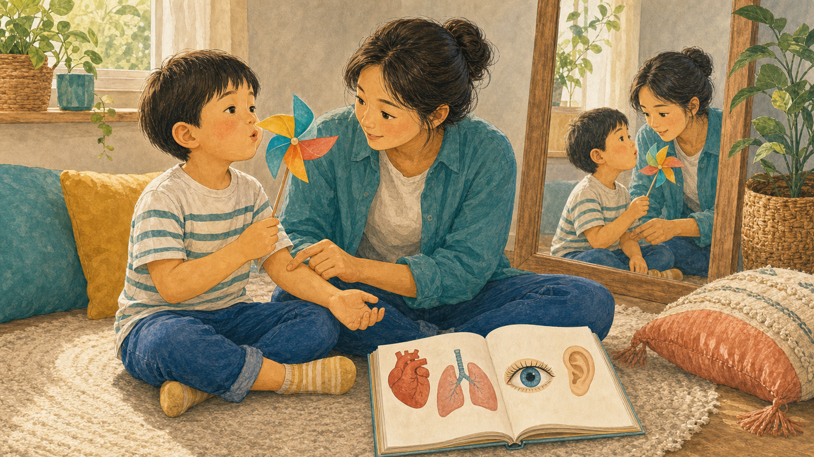

## 第 152 天｜皮肤只是一层包装吗？

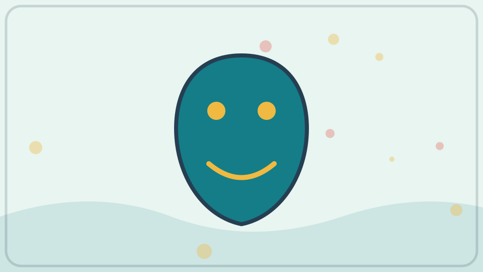

皮肤是身体最大的器官。它挡住许多有害微生物，减少水分流失，还能感觉冷、热、触碰和疼痛。皮肤也会出汗，并帮助调节体温。

**再想一步：** 皮肤由表皮、真皮和更深的组织组成，各层有不同细胞、血管、神经和腺体。最外层细胞不断脱落更新，保护不是一张永远不变的薄膜。

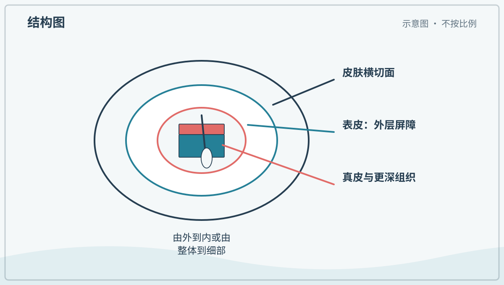

*图解：表皮负责外层屏障，真皮含血管、神经和腺体，更深组织连接并缓冲。*

**一起看看：** 用指腹轻碰布、木头和金属，说说触感哪里不同。

---

## 第 153 天｜每个人的指纹都一样吗？

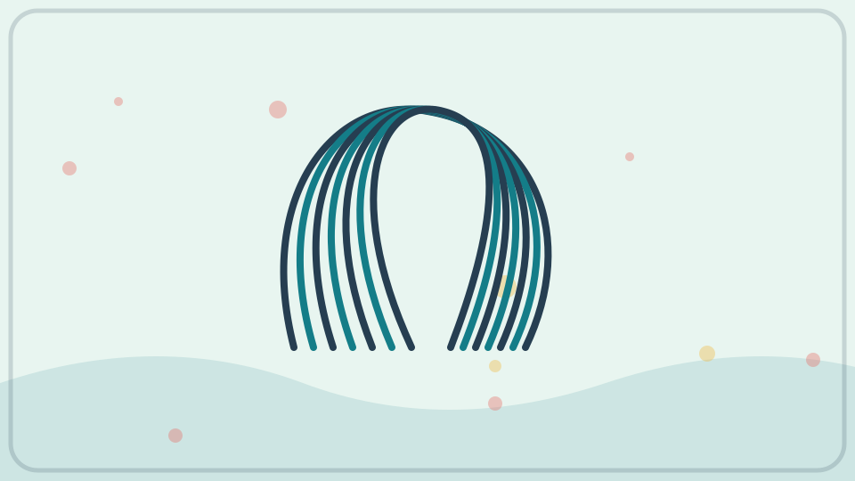

手指表面的脊线会形成弓、环和旋涡等花纹。指纹在出生前由遗传和生长环境共同形成，即使同卵双胞胎也不完全相同。小伤通常不会改变深层花纹。

**再想一步：** 脊线增加摩擦，也让触碰造成的细小振动更容易被感受。指纹识别比较许多特征点，但没有任何一种识别方法在所有情况下都绝对不会出错。

**一起看看：** 用放大镜看自己的指腹，不必涂墨留下指纹。

---

## 第 154 天｜头发为什么会长？

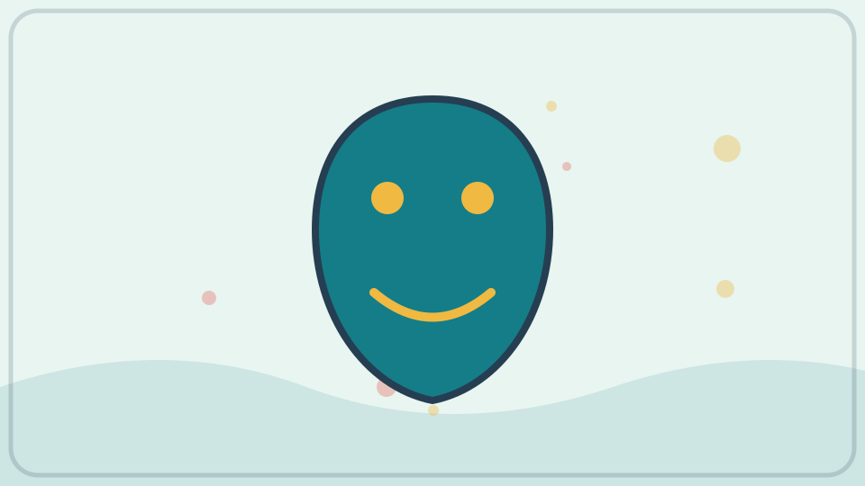

头发从皮肤里的毛囊生长。毛囊底部细胞不断分裂，旧细胞被向上推并充满角蛋白，露出皮肤后就成为发丝。剪头发不会让毛囊感觉疼。

**再想一步：** 每根头发会经历生长、过渡、休止和脱落阶段，所以每天掉一些很正常。颜色来自黑色素，形状受毛囊和发丝结构影响。

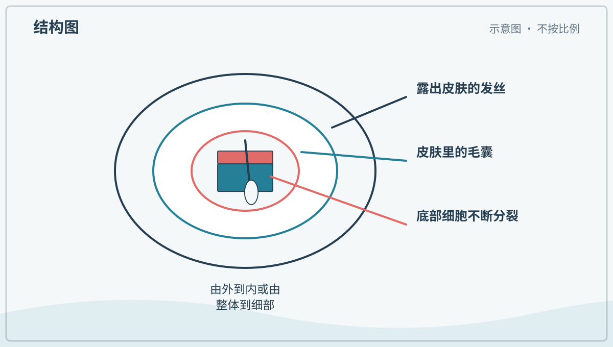

*图解：毛囊底部细胞分裂并角化，被逐渐推到皮肤外形成发丝。*

**一起看看：** 比较一根直发和一根卷发的弯曲，不拔正在生长的头发。

---

## 第 155 天｜骨头是空心的吗？

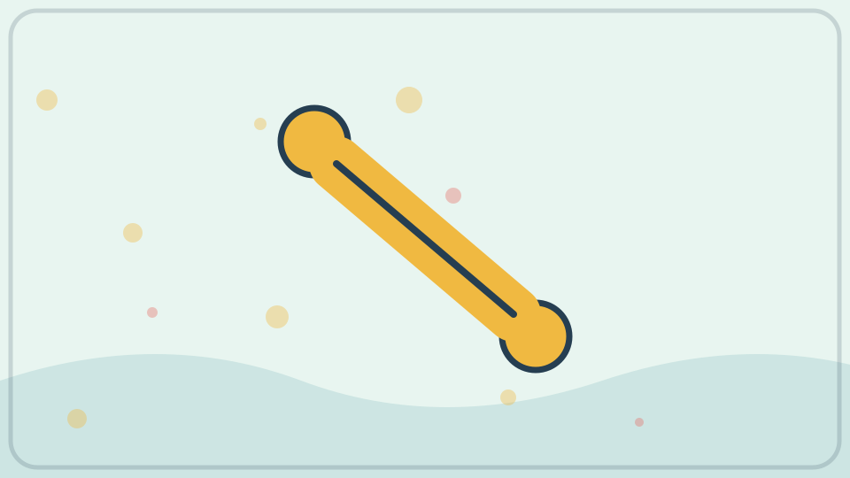

骨头不是实心石棒，也不是完全空的管子。外层较致密，内部有像小梁一样的海绵骨和骨髓。这样的结构既能承受力量，又不会重得不能活动。

**再想一步：** 骨是活组织，会得到血液、感受负荷并不断重塑。骨髓还参与制造血细胞；钙盐让骨较硬，胶原蛋白让它不那么脆。

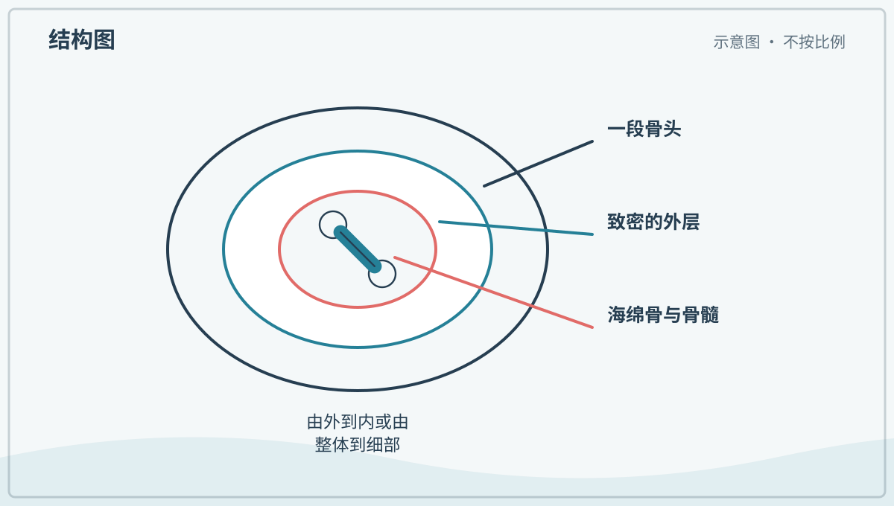

*图解：骨外层较致密，内部海绵骨沿受力方向排列，空隙中可有骨髓。*

**一起摸摸：** 轻摸手腕、手肘和膝盖，找找皮肤下较硬的地方。

---

## 第 156 天｜关节为什么能弯？

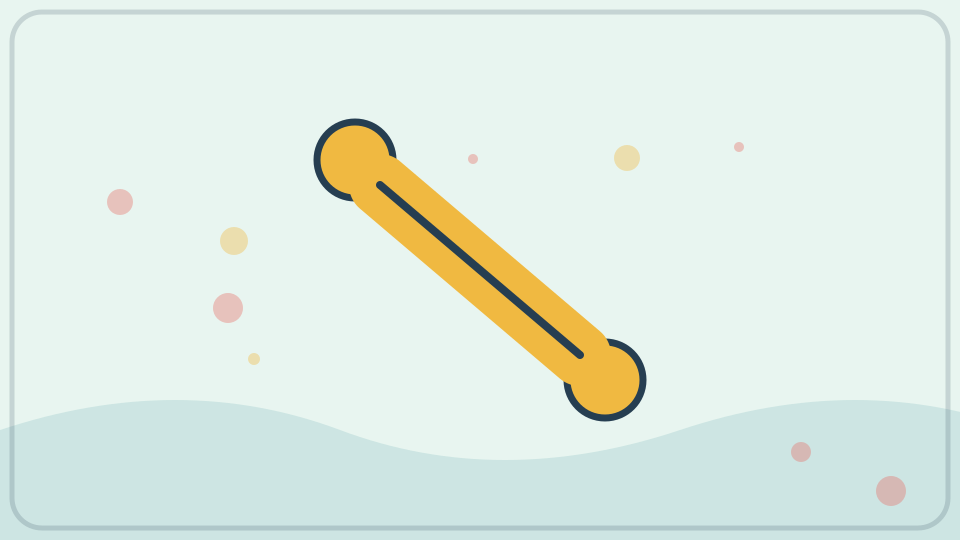

关节是两块或多块骨相接的地方。膝、肘等关节表面有光滑软骨，关节液帮助减少摩擦，韧带把骨连接并限制过度移动。不同关节能动的方向不同。

**再想一步：** 肩关节像球放进浅窝，活动范围大；膝关节更像经过引导的铰链，稳定性较高。灵活与稳定常要做取舍，肌肉也参与保护关节。

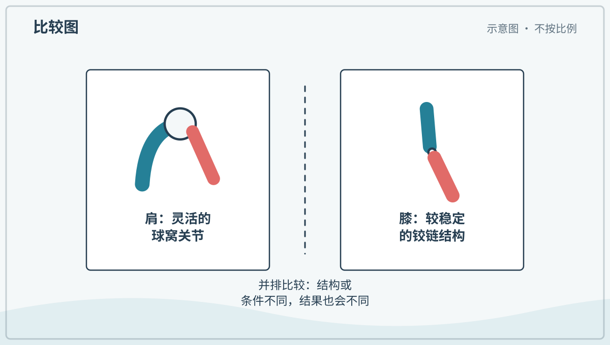

*图解：肩关节的球窝结构换来大活动范围；膝关节更像受引导的铰链。*

**一起动动：** 慢慢弯肘、转肩、踮脚，不用力扭到尽头。

---

## 第 157 天｜肌肉怎样拉动骨头？

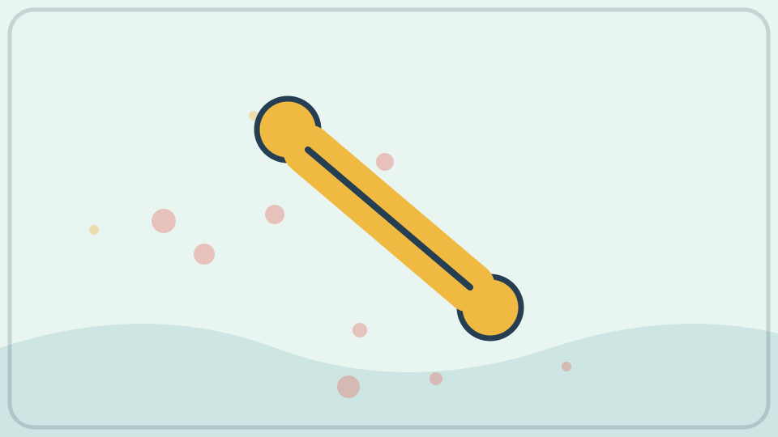

骨骼肌通过肌腱连接骨头。肌肉收缩时会变短并产生拉力，让关节两侧的骨改变角度。肌肉只能主动拉，不能像棍子一样主动推。

**再想一步：** 许多动作由成对或成组肌肉控制：一组收缩，另一组放松或稳定。例如弯肘时肱二头肌出力，伸肘时另一组肌肉更重要。

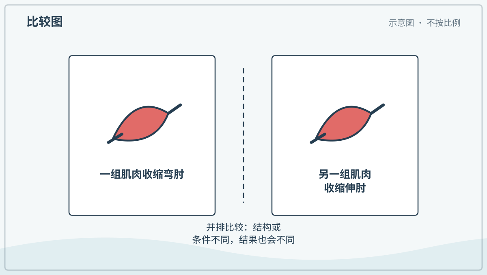

*图解：肌肉只能主动收缩拉动骨；弯肘和伸肘由不同肌群轮流主导。*

**一起摸摸：** 弯曲手臂时，轻摸上臂前侧感受肌肉变硬。

---

## 第 158 天｜心脏为什么一直怦怦跳？

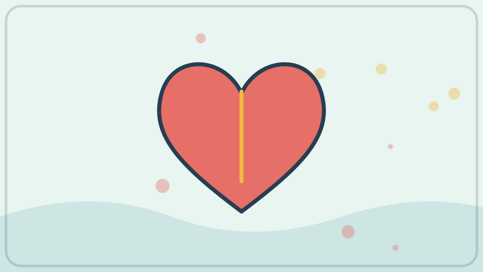

心脏是有四个腔室的肌肉泵。它有节奏地收缩，把血液送到肺和全身，再接回流回来的血。运动时身体需要更多氧气，心跳通常会加快。

**再想一步：** 心脏里一小群起搏细胞能自己产生电信号，信号按顺序传开，让心房和心室协调收缩。瓣膜像单向门，帮助血液朝合适方向流。

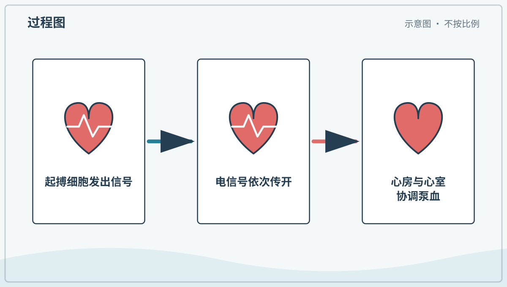

*图解：起搏细胞产生电信号，信号按顺序传过心脏，让各腔室协调收缩。*

**一起听听：** 安静坐下，由大人帮忙在手腕处找脉搏。

---

## 第 159 天｜血液为什么要到处流？

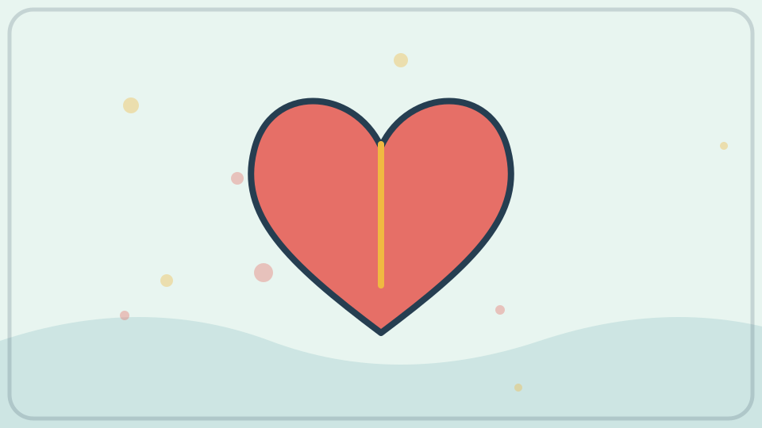

血液把氧气和营养送到细胞，也带走二氧化碳和一些废物。红细胞、白细胞、血小板和血浆各有任务。血管像遍布身体的运输网络。

**再想一步：** 红细胞里的血红蛋白能结合氧气；白细胞参与免疫防御；血小板和凝血蛋白帮助止血。动脉和静脉按血流离开心脏或回到心脏来命名，不只按颜色或含氧多少。

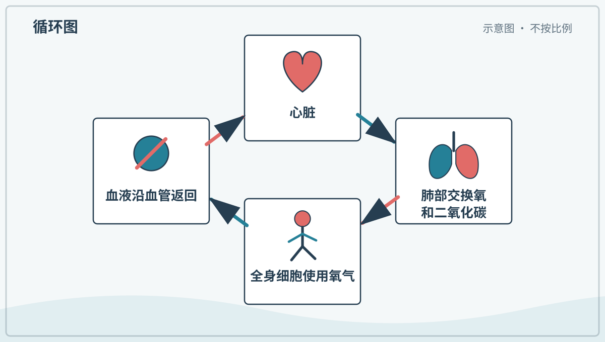

*图解：右心把血送到肺交换气体，左心再把富氧血送往全身。*

**一起看看：** 观察手背上淡淡的血管，不用按压或扎破皮肤。

---

## 第 160 天｜肺像两个气球吗？

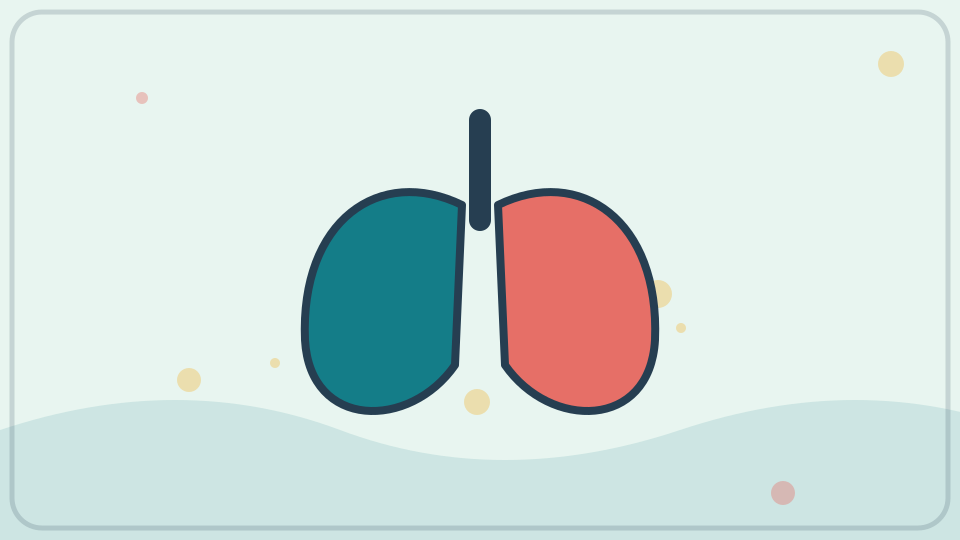

肺会随胸腔扩大而充气，看起来有点像气球，却不是空空的袋子。里面的气道不断分叉，末端是许多微小肺泡。氧气在肺泡进入血液，二氧化碳从血液进入肺泡。

**再想一步：** 大量肺泡提供很大的交换面积，薄薄的肺泡壁让气体容易扩散。肺自己没有把空气“吸进来”的大肌肉，主要靠膈肌和胸壁改变胸腔压力。

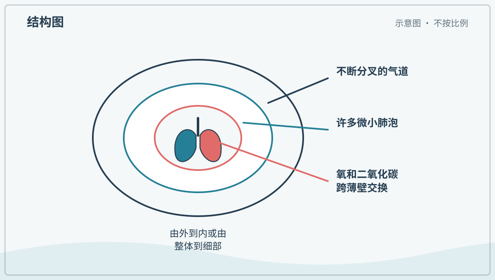

*图解：气道不断分叉到肺泡；肺泡壁很薄，并紧贴毛细血管，便于气体扩散。*

**一起呼吸：** 把手放在胸口和肚子上，感受轻松呼吸时哪里起伏。

---

## 第 161 天｜吸气时肚子为什么会鼓？

胸腔下方有一片圆顶形肌肉，叫膈肌。吸气时它收缩向下，胸腔变大，空气进入肺；腹部器官被轻轻推开，肚子就可能鼓起。呼气时过程相反。

**再想一步：** 空气从压力较高处流向较低处。膈肌不是把空气直接拉进肺，而是改变胸腔体积和压力；肋间肌也会参与。

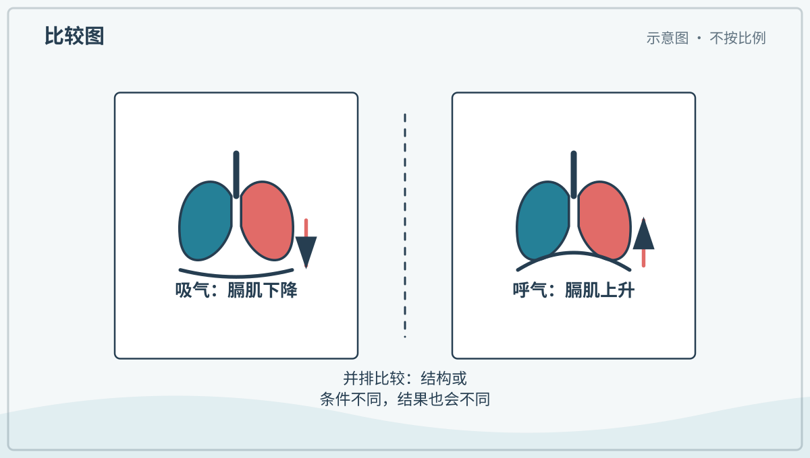

*图解：吸气时膈肌下降、胸腔变大、压力降低；呼气时过程大致相反。*

**一起呼吸：** 平静吸三次气，不比赛憋气或大口过度呼吸。

---

## 第 162 天｜为什么会打嗝？

打嗝时，膈肌突然不由自主地收缩，空气快速进入。喉咙里的声门随即关闭，便发出“嗝”的声音。吃太快、喝气泡饮料或温度变化都可能触发。

**再想一步：** 打嗝是一种反射，神经回路不需要我们先决定。多数会自行停止；若持续很久、影响吃饭呼吸或让人不舒服，应告诉大人并咨询医生。

**一起试试：** 慢慢呼吸、安静等待，不尝试危险的憋气或惊吓办法。

---

## 第 163 天｜大脑在头里做什么？

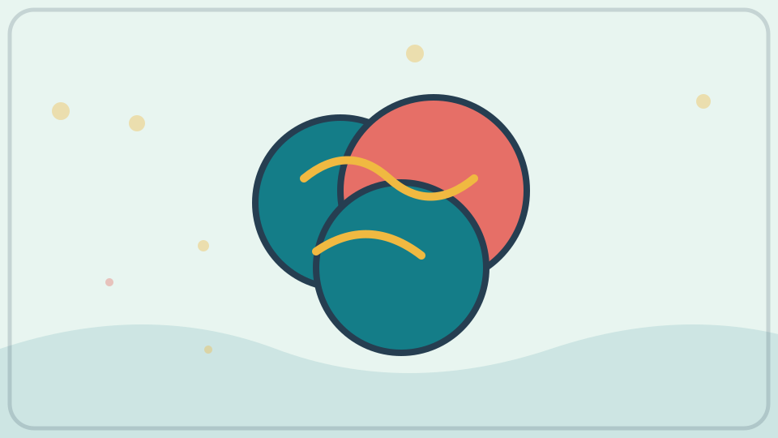

大脑接收眼、耳、皮肤等送来的信息，参与思考、记忆、感觉和动作。它也和脑干一起调节呼吸、睡眠等许多自动工作。不同区域合作完成任务。

**再想一步：** 大脑由大量神经元和支持细胞组成，神经元用电和化学信号交流。不能把每种能力简单锁进一个孤立“小抽屉”，脑网络会随学习和经验改变。

**一起想想：** 闭眼听一个声音，说说大脑用了哪些线索猜它是什么。

---

## 第 164 天｜手碰到烫东西为什么会缩回？

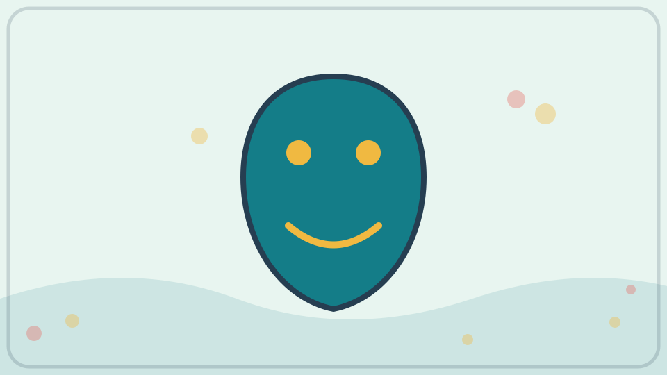

皮肤感受危险热度后，神经把信号送进脊髓。脊髓很快让手臂肌肉缩回，同时信息也传到大脑，我们才清楚感到疼。这个快速反应叫反射。

**再想一步：** 反射弧缩短了等待大脑详细判断的时间，却不保证完全避免受伤。温度感觉也会被环境影响，因此不能用手试探热水、炉具或电器。

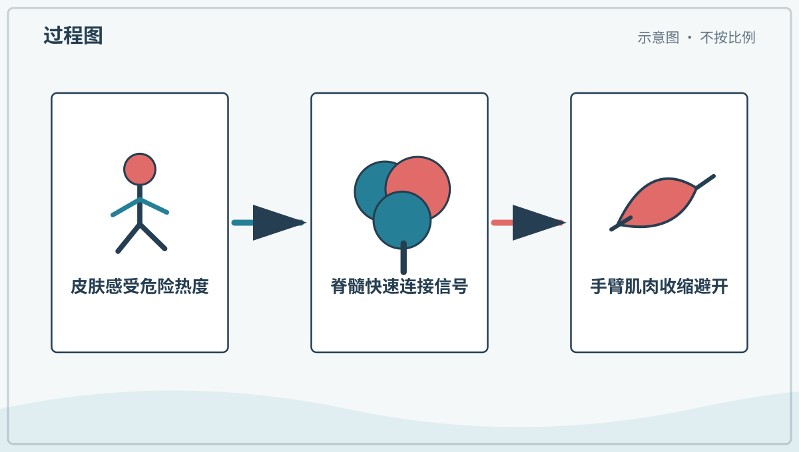

*图解：危险热信号先经感觉神经到脊髓，再由运动神经命令肌肉迅速缩手。*

**一起记住：** 任何烫伤都立刻告诉大人，不自行涂抹不明东西。

---

## 第 165 天｜眼睛怎样看见东西？

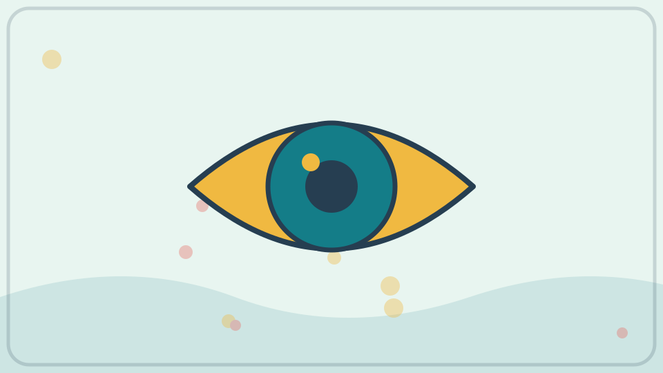

物体反射的光进入眼睛，角膜和晶状体把光聚在视网膜上。视网膜的感光细胞把光变成神经信号。大脑再把两只眼和过去经验的信息组合成我们看见的世界。

**再想一步：** 视网膜上的像在几何上是倒立的，但大脑不是简单把一张照片翻转，而是持续解释方向、边缘、颜色和运动。看见是眼睛与大脑共同完成的过程。

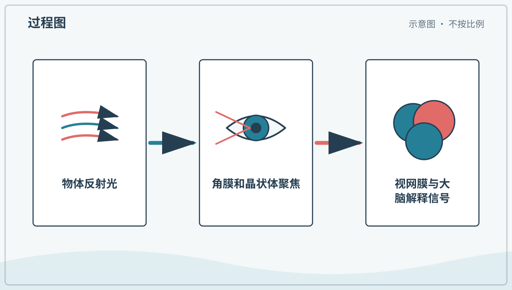

*图解：物体反射的光经角膜和晶状体聚焦到视网膜，再变成神经信号。*

**一起看看：** 遮住一只眼再换另一只，比较近处物体位置有没有微小变化。

---

## 第 166 天｜瞳孔为什么会变大变小？

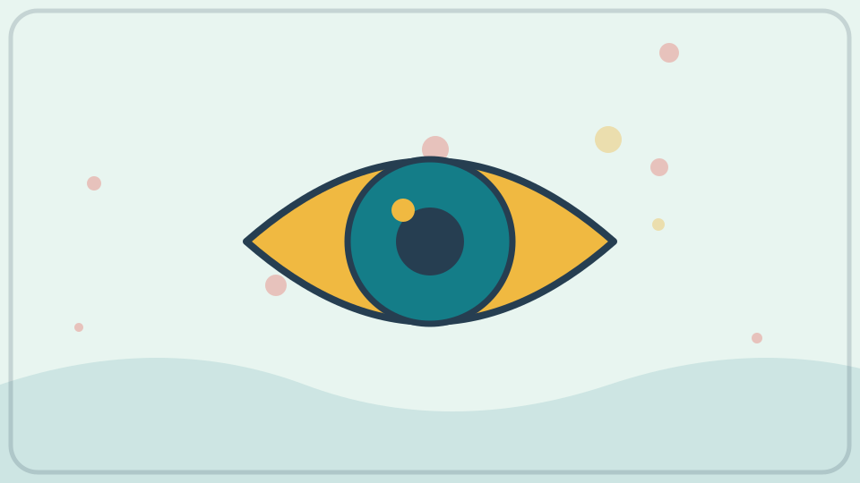

瞳孔是虹膜中央让光通过的开口。亮处虹膜肌肉让瞳孔缩小，暗处让它扩大，调节进入眼睛的光量。变化需要一点时间。

**再想一步：** 瞳孔反射由神经系统自动控制，两眼通常一起响应。瞳孔也会受距离、情绪和药物影响，不能只用大小判断一个人的感受或健康。

**一起看看：** 只观察普通室内明暗变化，不用强光照眼睛。

---

## 第 167 天｜眼泪只有伤心时才有吗？

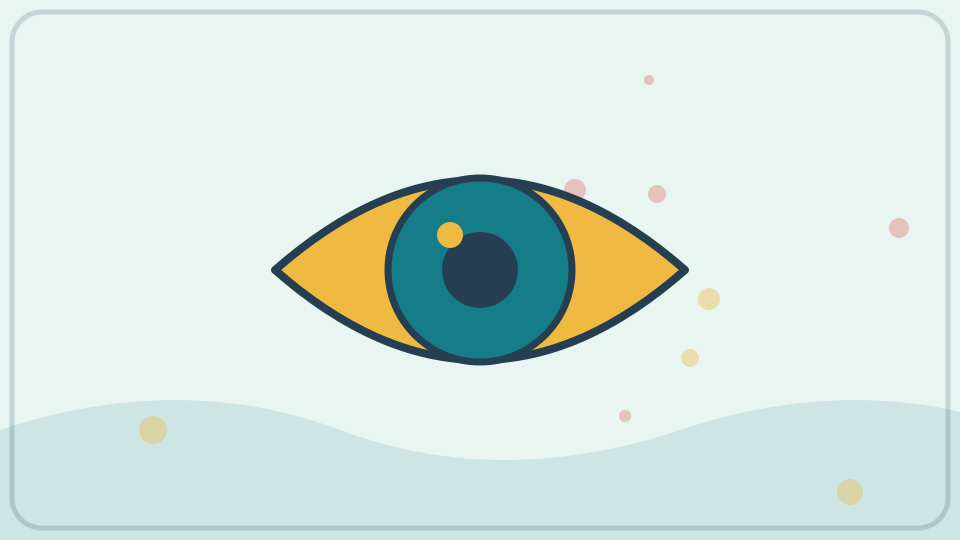

眼睛平时一直覆盖着薄薄的泪膜，帮助保持湿润、冲走小灰尘。刺激和强烈情绪会让泪液增加。眨眼把泪膜重新铺匀。

**再想一步：** 泪膜含水、油脂和黏液等成分，分别帮助润湿、减慢蒸发和贴附眼表。泪液最后可经泪道流进鼻腔，所以哭时鼻子也常流液体。

**一起眨眼：** 慢慢眨几次，感觉眼皮怎样扫过眼球表面。

---

## 第 168 天｜耳朵怎样把声音送进大脑？

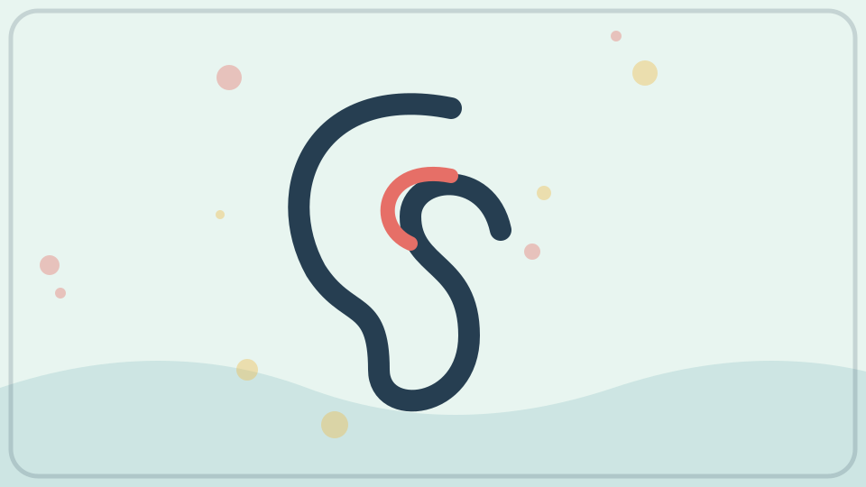

外耳收集空气振动，振动让鼓膜和中耳小骨运动。内耳耳蜗里的液体和感受细胞再把振动变成神经信号。大脑根据这些信号认出声音。

**再想一步：** 耳蜗不同位置对不同频率较敏感，像把复杂声音分开分析。过强声音会损伤细小感受细胞，而且损伤常难以恢复，所以要保护听力。

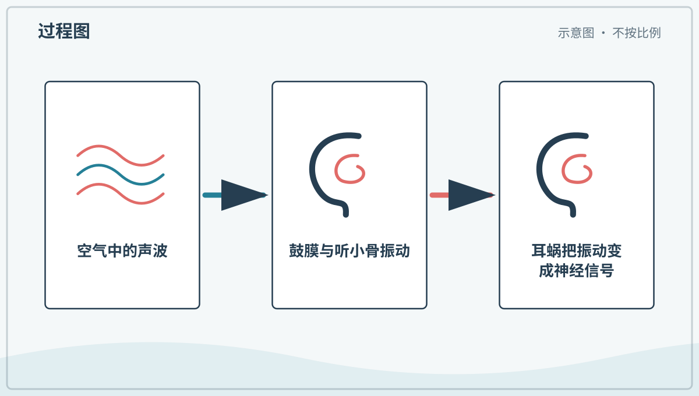

*图解：声波振动鼓膜和听小骨，再在耳蜗中推动液体、弯曲感受细胞。*

**一起听听：** 找远近两种轻声，比较响度，不把声音贴近耳朵播放。

---

## 第 169 天｜闭眼站立为什么更容易晃？

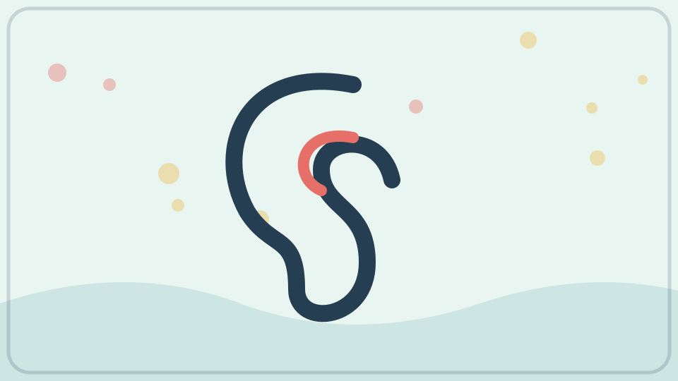

保持平衡要综合眼睛、内耳和肌肉关节的信号。内耳的半规管感受头部转动，另外的小囊感受直线加速和重力。闭眼后少了一组线索，身体可能更晃。

**再想一步：** 大脑会比较多路信号并及时调整腿和躯干肌肉。坐车晕动可能来自视觉和内耳报告的运动不一致，但每个人敏感程度不同。

**一起试试：** 由大人扶着，在安全平地双脚站稳，短暂闭眼感受变化。

---

## 第 170 天｜鼻子怎样闻到香味？

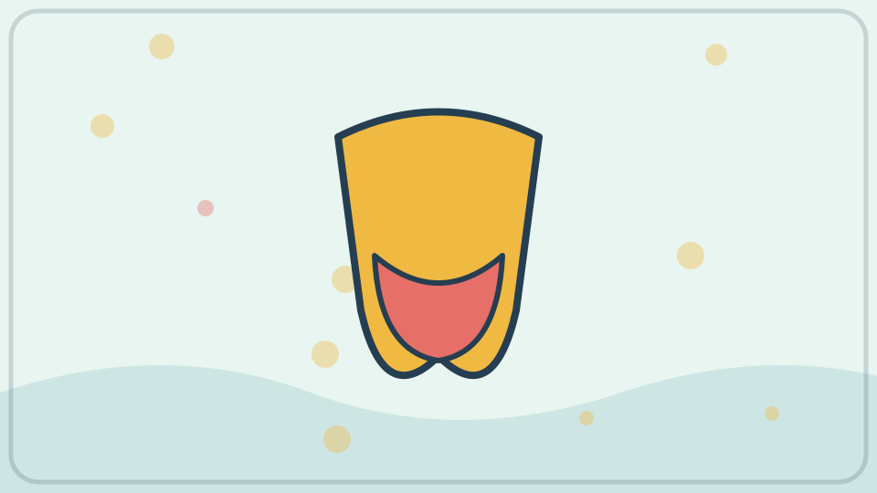

空气中的气味分子进入鼻腔，碰到嗅觉受体。不同分子让不同受体组合发出信号，大脑把组合认成花香、食物味或烟味。鼻塞时气味较难到达受体。

**再想一步：** 嗅觉与记忆、情绪和味觉联系紧密，同一种气味也会因经验而有不同感受。闻到煤气、烟或刺鼻化学味时，应离开并立刻告诉大人。

**一起闻闻：** 只闻大人确认安全的橘皮和香草，不直接闻清洁剂。

---

## 第 171 天｜舌头能尝到哪些味道？

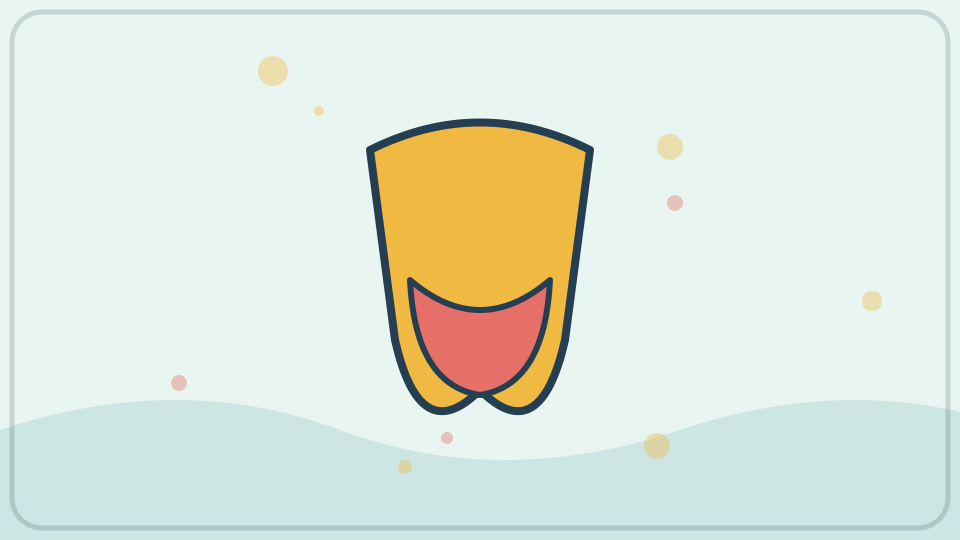

味蕾能感受甜、酸、咸、苦和鲜等基本味道。食物的“风味”还来自鼻子的气味、温度和口感。嚼东西时，气味会从口腔后方进入鼻腔。

**再想一步：** 味觉细胞上的受体对不同化学物质作出反应，再经神经传给大脑。辣主要是痛觉和温度感受器被刺激，不是一种基本味道。

**一起试试：** 吃熟悉安全的食物时捏住鼻子一下，再放开比较风味。

---

## 第 172 天｜舌头每一块只尝一种味吗？

不是。舌头许多区域都能感受多种基本味道，只是敏感程度可能略有不同。课本里把甜、咸、酸、苦画在固定区域的“舌头地图”过于简单。

**再想一步：** 味蕾也分布在口腔其他部位，而味觉信号最后由大脑综合。科学图示为了清楚会简化，但简化图若被当成严格边界，就会制造误解。

**一起想想：** 为什么一张容易记的图，也可能不是完整事实？

---

## 第 173 天｜牙齿为什么有不同形状？

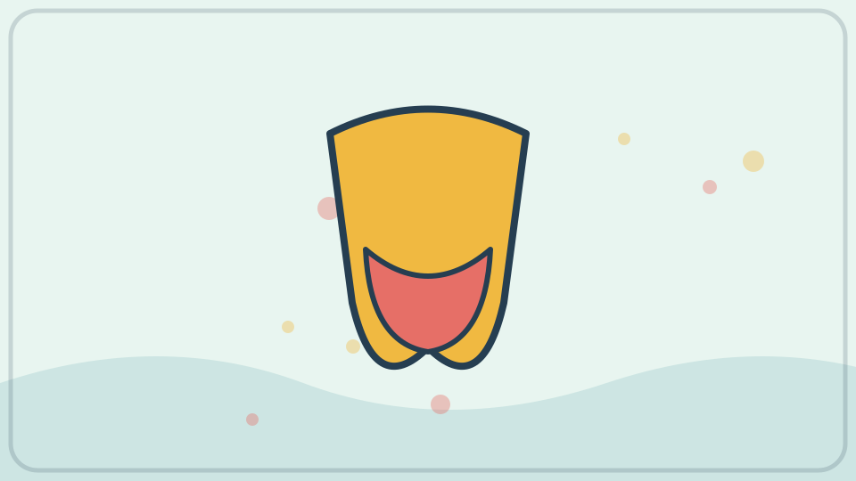

前面的门牙边缘适合切断食物，尖一些的犬牙帮助撕扯，后面的臼齿表面宽，适合磨碎。牙齿形状和位置配合咀嚼。舌头和颌肌也一起工作。

**再想一步：** 牙冠外层的牙釉质很硬，里面仍有牙本质、牙髓、血管和神经。硬不等于不会被酸侵蚀，所以刷牙和控制频繁含糖饮食很重要。

**一起看看：** 对镜子数一数前牙和后牙的形状，不用手抠牙龈。

---

## 第 174 天｜乳牙为什么会掉？

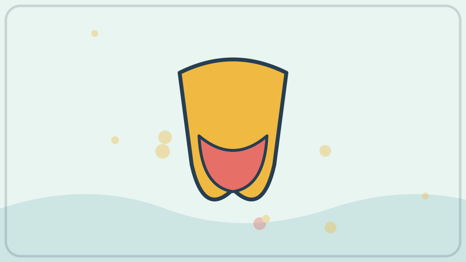

孩子长大时，颌骨变大，下面的恒牙逐渐发育。恒牙上移会让乳牙牙根被身体慢慢吸收，乳牙变松并脱落。空出的位置让更大的恒牙长出来。

**再想一步：** 乳牙帮助咀嚼、说话并为恒牙保留空间，也需要认真保护。换牙时间每个人不同，牙疼、受伤或生长异常应让牙医检查。

**一起记住：** 每天由大人挤豌豆大小的含氟牙膏，帮助刷净每个牙面；刷后吐出，不吞咽。

---

## 第 175 天｜吃下去的食物去哪儿了？

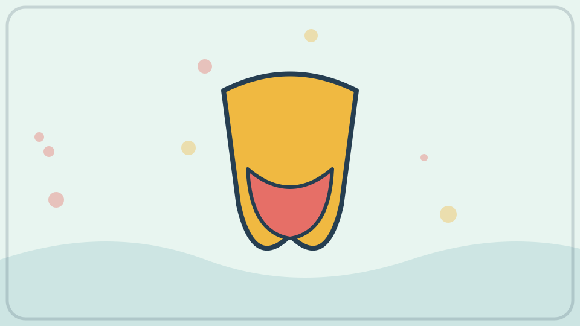

牙齿先把食物弄碎，唾液开始分解一部分成分。食物经食管到胃，再进入小肠，营养大多在那里被吸收进血液。剩余物到大肠，最后排出身体。

**再想一步：** 消化既有咀嚼和搅拌这样的物理变化，也有酶把大分子拆小的化学变化。肝、胆囊和胰腺也会提供重要物质，不是只有一根管子在工作。

**一起说说：** 按顺序指出嘴、食管、胃、小肠和大肠的大概位置。

---

## 第 176 天｜肚子饿时为什么咕噜响？

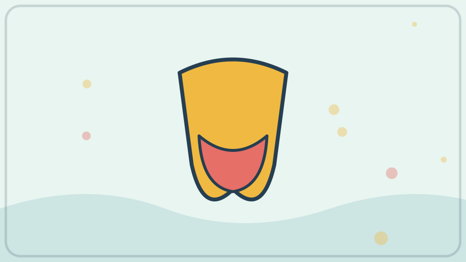

胃和肠的肌肉会一阵阵收缩，推动里面的液体和气体。空腹时，没有很多食物挡住声音，我们更容易听见咕噜声。吃饱后肠胃也会发声。

**再想一步：** 消化道这种波浪式收缩叫蠕动，受肌肉、神经和激素共同控制。咕噜声本身不总表示饥饿，也不能单靠声音判断生病。

**一起听听：** 安静时听一会儿肚子，不用故意饿自己。

---

## 第 177 天｜身体为什么要制造尿液？

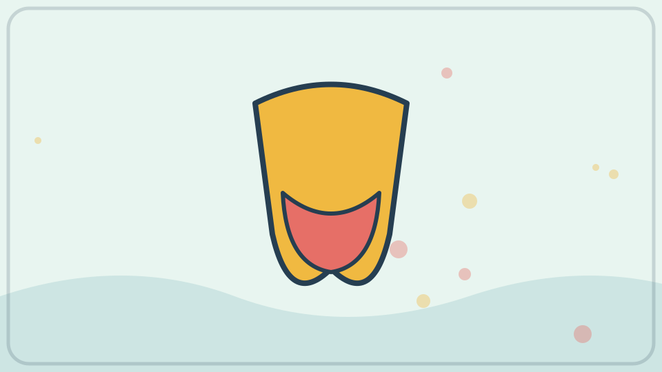

肾脏不停过滤血液，调节水、盐和酸碱，并把一些废物装进尿液。尿液沿输尿管进入膀胱储存，再排出身体。颜色会随喝水和其他因素变化。

**再想一步：** 肾脏不是简单筛子，它会把身体需要的水和小分子重新吸收，也会主动分泌一些物质。排尿疼痛、很久没有尿或颜色异常时，应告诉大人。

**一起说说：** 身体发出尿意时及时告诉大人，不长时间憋尿。

---

## 第 178 天｜热的时候为什么会出汗？

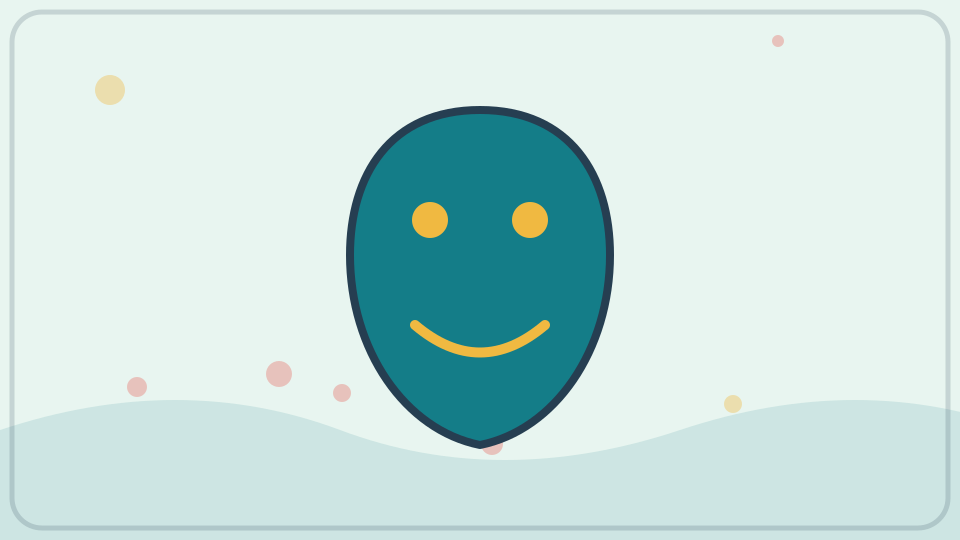

体温升高时，汗腺把含水的汗液送到皮肤表面。汗蒸发需要吸收热量，于是皮肤和流经附近的血液会冷却。空气很潮湿时，汗较难蒸发，人会更闷热。

**再想一步：** 大脑中的体温调节中枢比较身体温度，并控制出汗和皮肤血流。大量出汗会丢失水和盐，炎热中要由大人安排饮水、休息和降温。

**一起看看：** 运动后在阴凉处观察汗从哪里出现，随后擦干补水。

---

## 第 179 天｜冷的时候为什么起鸡皮疙瘩？

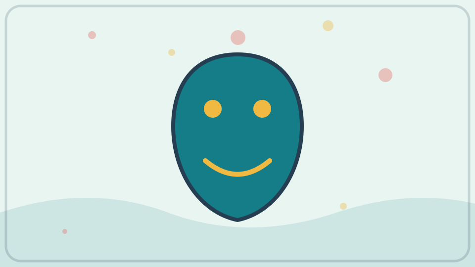

每根汗毛附近有小肌肉。寒冷或强烈情绪让这些肌肉收缩，毛竖起来，皮肤表面出现小凸起。这个反应不由我们直接控制。

**再想一步：** 毛很多的动物竖毛能夹住更厚空气层，也能让身体显得更大。人类体毛较少，保温效果有限，但这套祖先留下的反射仍保留着。

**一起看看：** 冷时先穿衣保暖，不故意挨冻来制造鸡皮疙瘩。

---

## 第 180 天｜为什么要用肥皂洗手？

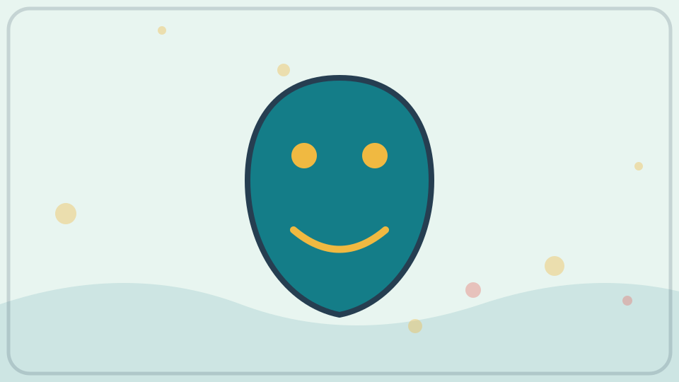

手会碰到看不见的微生物、灰尘和油污。肥皂与搓洗让它们从皮肤上松开，再被流水带走。吃东西前、上厕所后和户外活动后洗手，能减少病菌传播。

**再想一步：** 肥皂能破坏一些有包膜微生物的外层，也能把油污包进微小团块。机械摩擦、足够覆盖、冲洗和擦干都重要；湿手还更容易把微生物传到物体上。

**一起洗手：** 和大人做“打湿、抹皂、搓洗、冲净、擦干”五步。

---

## 第 181 天｜伤口为什么会结痂？

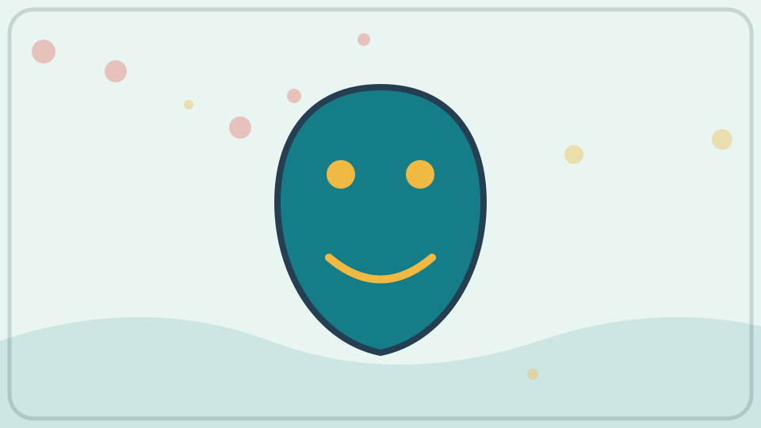

皮肤破损后，血小板和凝血蛋白先形成凝块，帮助止血。表面的血液和组织液干燥后形成痂，下面的新细胞慢慢修补。痂像临时保护盖，不需要主动撕掉。

**再想一步：** 修复还包括炎症、长出新组织和重新排列胶原等阶段。发红、温热和轻微肿胀可参与正常修复，但持续加重、流脓、剧痛或深伤口要让大人和医生处理。

**一起记住：** 受伤立刻告诉大人，清洁和包扎由大人决定。
