# 七月：机器为什么会动

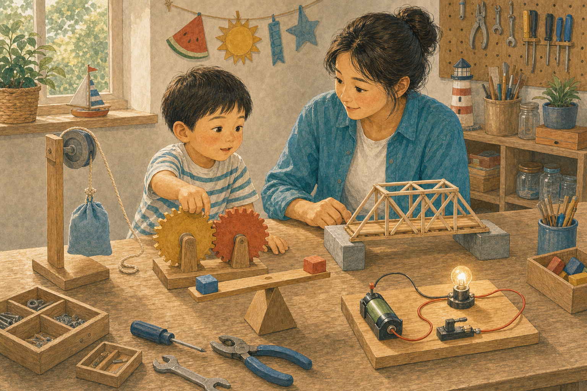

## 第 182 天｜什么东西算机器？

机器能传递或改变力和运动，帮助我们完成工作。剪刀、滑轮和自行车是机器，复杂机器人则由许多机器部件组成。机器不能凭空创造能量。

**再想一步：** 物理里的功与力让物体移动的距离有关。理想机器可以用较小的力走较长距离，换取较大的力走较短距离；真实机器还会因摩擦损失一部分能量。

**一起找找：** 在房间里找三样会转、会拉或会推的机器，只观察不拆开。

---

## 第 183 天｜杠杆怎样让力气变大？

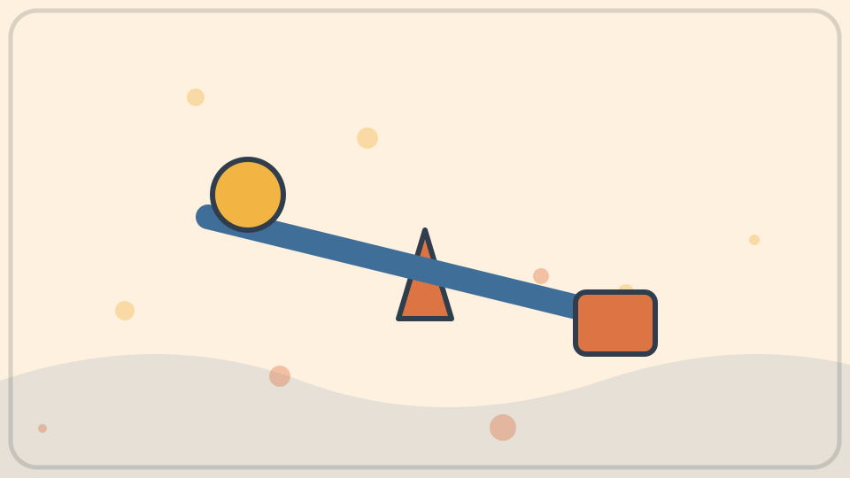

杠杆是一根能绕支点转动的硬杆。手离支点较远时，用较小的力移动较长距离，就能让靠近支点的重物受到较大的力。开瓶器和跷跷板都用到杠杆。

**再想一步：** 力乘以它到支点的垂直距离叫力矩。杠杆平衡时，两边力矩相等；改变支点位置，就改变了省力多少和移动多少。

*图解：杠杆绕支点转动；离支点更远处用力，可以用较小的力产生足够力矩。*

**一起试试：** 用尺子和橡皮做小杠杆，只推轻软物，不撬重物。

---

## 第 184 天｜跷跷板怎样坐得平？

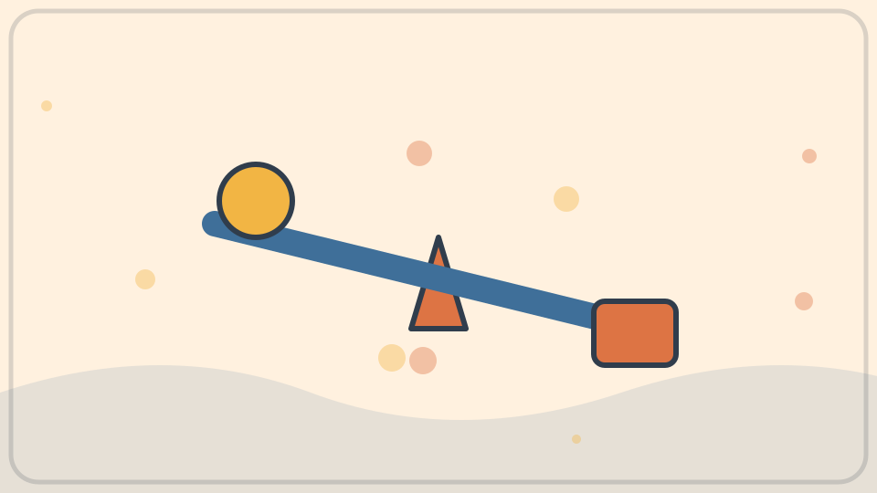

跷跷板以中间支点为轴。较重的人坐得靠近支点，较轻的人坐得远一些，两边也可能平衡。重要的不只是谁重，还要看离支点多远。

**再想一步：** 两边的力矩相等时，转动效果互相抵消。若一边力矩更大，跷跷板会向那边转；运动中还要考虑速度、冲击和摩擦。

*图解：跷跷板是否平衡取决于两边的重量和它们到支点的距离。*

**一起记住：** 玩跷跷板要有大人照看，坐稳扶好，不突然跳下。

---

## 第 185 天｜滑轮为什么能帮忙提东西？

定滑轮能改变拉力方向，让人向下拉绳来提起物体。动滑轮和多只滑轮组合，还能把重量分给多段绳子，从而减少每段绳需要承受的拉力。

**再想一步：** 省力的代价是要拉更长的绳。若有两段绳共同托住重物，理想情况下拉力约减半，但绳长要移动约两倍；真实系统还有摩擦。

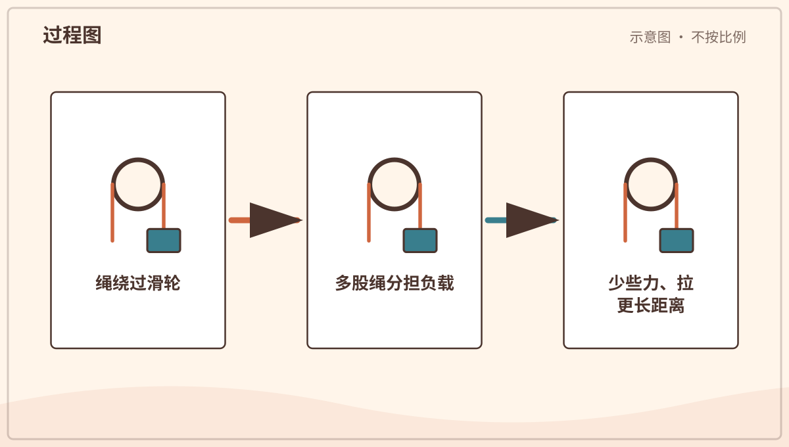

*图解：定滑轮主要改变拉力方向；多股绳共同承重时，每股绳分担一部分负载。*

**一起看看：** 只观察窗帘或晾衣架的滑轮，绳索不套身体。

---

## 第 186 天｜轮子为什么让东西更好推？

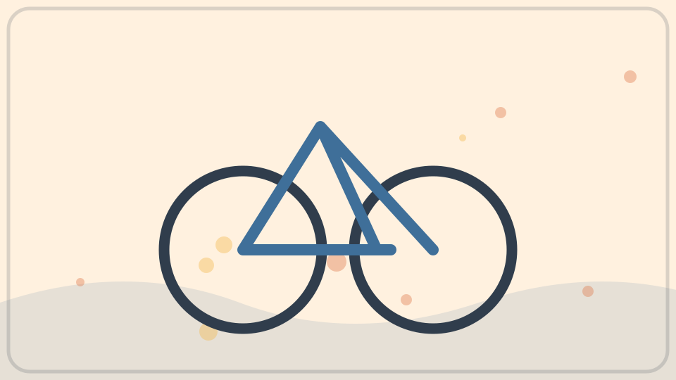

没有轮子时，箱子与地面滑动，摩擦常很大。轮子滚动时，接触处的形变和摩擦通常较小，所以更容易移动。车轴让轮子保持位置并传递转动力。

**再想一步：** 滚动阻力并不是零，它来自轮胎和地面变形、轴承摩擦与空气阻力。轮越大，越容易跨过同样大小的小坑，但也会改变重量和结构需求。

**一起看看：** 推一辆空玩具车，再轻轻拖同样重的积木，比比手感。

---

## 第 187 天｜齿轮为什么要长牙齿？

齿轮边缘的齿互相咬合，一个转动会推着另一个转。相邻齿轮转向相反。大小不同的齿轮还能交换转速和转动力量。

**再想一步：** 齿数比决定理想转速比：小齿轮转很多圈，大齿轮才转一圈，但大齿轮轴上的扭矩会增加。齿形经过设计，才能平稳传力并减少磨损。

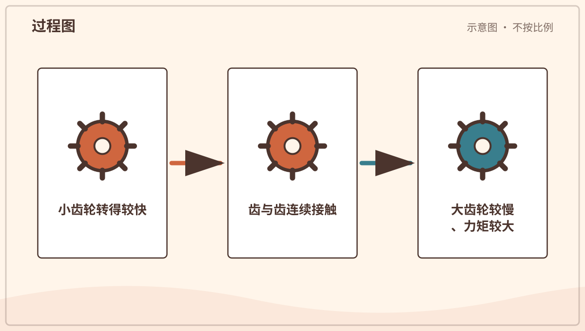

*图解：相邻齿轮用齿传力并反向转动；齿数比例会改变转速和力矩。*

**一起看看：** 转动安全的玩具齿轮，给一个齿画记号数圈数。

---

## 第 188 天｜自行车为什么要用链条？

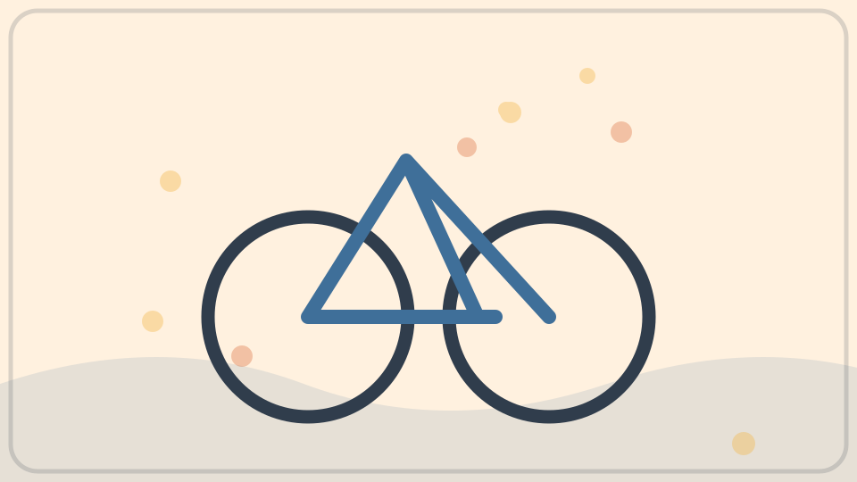

脚踩踏板让前面的链轮转动，链条把拉力传到后轮链轮，后轮便推动自行车前进。链条能跨过一段距离传递转动，又不容易打滑。

**再想一步：** 前后链轮齿数决定踩一圈时车轮转几圈。变速器把链条移到不同大小链轮上，在速度与踩踏力量之间作交换。

**一起记住：** 只从旁观察，手指和衣物远离链条、齿轮与车轮。

---

## 第 189 天｜螺丝为什么转着进去？

螺丝外面绕着斜斜的螺纹，像把斜坡缠在圆柱上。转动很多圈，螺丝只前进一点，却能产生较大的压紧力。螺纹也能防止零件轻易滑开。

**再想一步：** 螺纹的螺距决定每转一圈前进多少。较小螺距通常更省力、更精细，但需要转更多圈；摩擦既会损失能量，也帮助螺丝保持位置。

*图解：螺纹像绕在圆柱上的斜面；转动较长距离会产生沿轴方向的移动和力。*

**一起看看：** 由大人拿一颗未使用的大螺栓，沿螺纹用眼睛走一圈。

---

## 第 190 天｜刀刃为什么要做成尖尖的？

刀刃是一种楔子，前端面积很小。相同的力集中在较小面积上，会产生较大压力，让材料更容易分开。斧头、凿子和门塞也使用楔形。

**再想一步：** 楔子把向前的力分成向两侧的力。尖刃较容易切入，却也更容易损伤或变钝；材料硬度、刃角和摩擦都会影响切割。

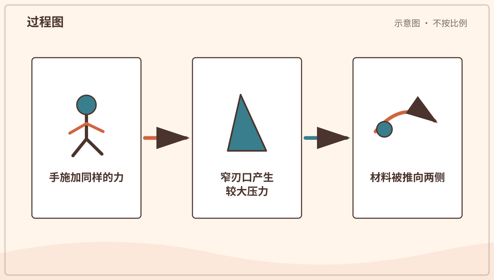

*图解：同样的力集中在较小刃口面积上会产生较大压力，使材料更容易分开。*

**一起记住：** 刀具只由大人使用，孩子从安全距离观察。

---

## 第 191 天｜斜坡为什么比直着抬省力？

斜面把同样的高度变化分散到更长距离。沿斜坡推物体，所需的力可以小一些，但要走更远。坡越缓，通常越省力。

**再想一步：** 忽略摩擦时，物体增加的重力势能相同，所以力和距离作交换。真实斜面有摩擦，表面太粗或路线太长也会增加额外耗能。

*图解：斜坡把同样高度的提升分散到更长距离，所以通常需要较小的沿坡力。*

**一起试试：** 用书搭低斜坡，让玩具车自己滚下，不堆得太高。

---

## 第 192 天｜弹簧为什么会弹回来？

弹簧被拉长或压短时，材料内部会产生恢复原状的力。放手后，储存的弹性势能转成运动。超过承受范围，弹簧可能变形，不能完全回来。

**再想一步：** 在一定范围内，弹簧形变量越大，恢复力常越大，这近似叫胡克定律。线圈形状让一根金属丝能通过扭转产生较长的整体伸缩。

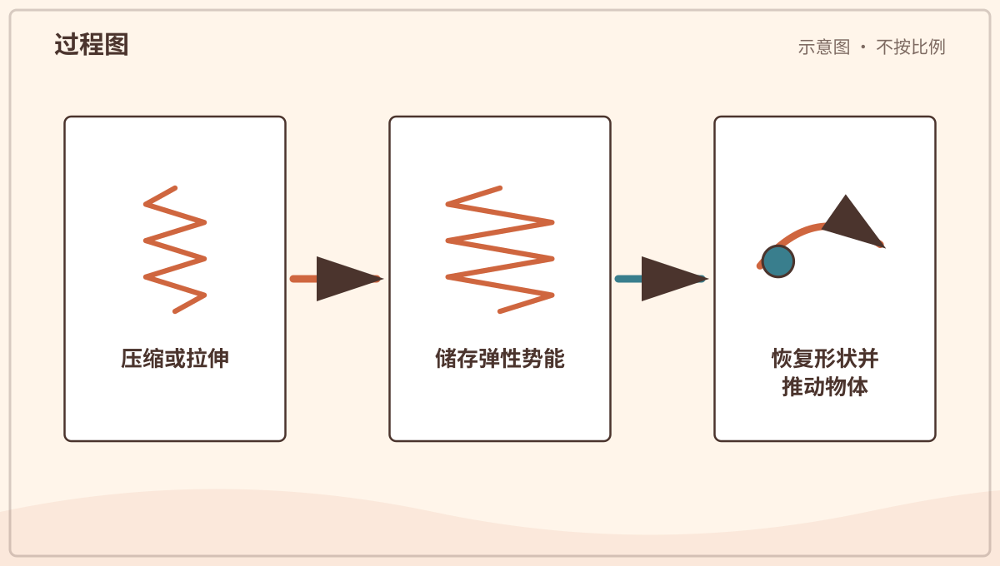

*图解：弹簧变形时储存弹性势能；约束松开后，恢复力把能量转成运动。*

**一起试试：** 只按安全玩具里的大弹簧，不把弹簧对着脸弹。

---

## 第 193 天｜橡皮筋和弹簧哪里不一样？

橡皮筋由长长的高分子链组成。拉伸时，原本弯曲缠绕的链被排得更整齐；放手后，热运动让它们倾向回到较乱的状态。金属弹簧主要靠材料微小形变和线圈扭转。

**再想一步：** 两者都能储存弹性势能，却有不同的力与形变关系。橡胶还会受温度、老化和拉伸速度影响，不应把任何弹性物都当成同一种弹簧。

**一起记住：** 不把橡皮筋射向人，也不套在手指上很久。

---

## 第 194 天｜磁铁为什么能隔空吸东西？

磁铁周围存在磁场，能对另一个磁铁或某些材料产生力。铁、镍、钴及一些合金会有明显反应，但木头、塑料和铝通常不会被普通磁铁吸住。

**再想一步：** 铁磁材料里有许多微小磁畴；外部磁场能让更多磁畴朝相近方向排列，于是材料被吸引。磁力随距离增加会很快减弱。

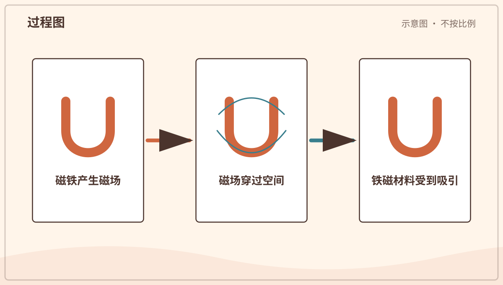

*图解：磁铁周围存在磁场；铁磁材料内部的小磁区受影响后产生明显吸引。*

**一起试试：** 由大人用大磁铁测试大件物品，远离电器和可吞咽小物。

---

## 第 195 天｜指南针为什么会指南北？

指南针里有一根能自由转动的小磁针。地球像周围带着一个大磁场，磁针会沿磁场方向转动，所以大致指出南北。附近金属和磁铁会让它偏转。

**再想一步：** 指南针指向的是磁北附近，不一定正好是地理北极，而且磁北位置会慢慢变化。地图使用时还要考虑磁偏角。

**一起看看：** 和大人在空旷处转动指南针，再靠近铁物比较变化。

---

## 第 196 天｜电能把铁变成磁铁吗？

电流通过导线时，周围会产生磁场。把导线绕成线圈，许多小磁场叠在一起；再放入铁芯，磁力会更强。这就是电磁铁的基本原理。

**再想一步：** 改变电流方向，磁场方向也会改变；断开电流后，软铁芯大多失去强磁性。起重机、门铃、继电器和电动机都能用到电磁铁。

**一起记住：** 不碰插座或裸导线；实验只能用大人准备的安全低压器材。

---

## 第 197 天｜灯为什么要接成一个圈才亮？

电流需要沿闭合路径流动。电池、导线和灯连成完整回路时，电荷能持续移动，灯把电能变成光和热。开关断开路径，灯就熄灭。

**再想一步：** 电池提供电势差，像推动电荷流动的条件；导体允许电荷较容易移动。短路会让电流绕过合适负载并迅速变大，可能发热起火。

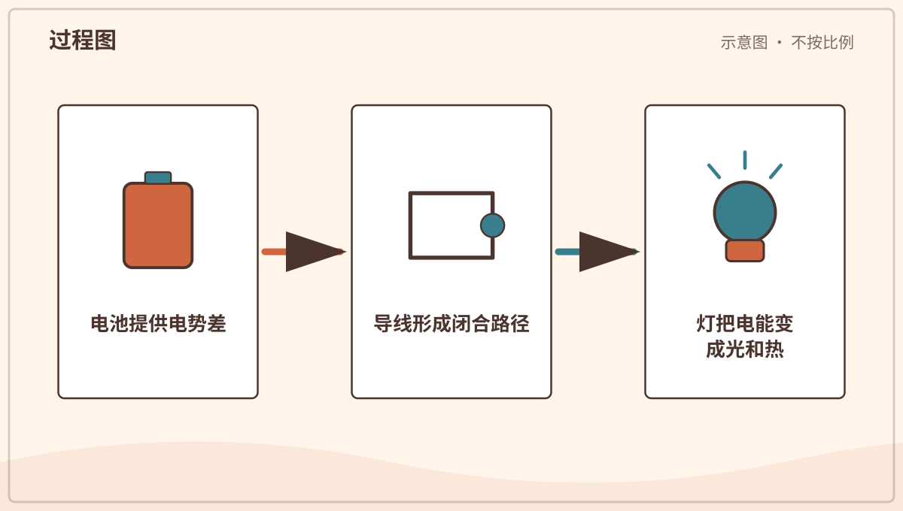

*图解：电池、导线和灯形成闭合路径后，电荷可以持续移动并传递能量。*

**一起看看：** 只操作完整封装的玩具开关，不拆电池和导线。

---

## 第 198 天｜电池里面装着“电”吗？

电池里不是装了一罐会倒出来的电。两端材料和内部物质发生化学反应，分开电荷并建立电势差。接上回路后，化学能转成电能。

**再想一步：** 电子经外部导线移动，离子在电池内部移动，共同维持反应。电池用久后，能继续反应的物质和结构改变，电压便下降。

**一起记住：** 电池由大人安装保管，不能拆、咬、加热或吞咽。

---

## 第 199 天｜电动机为什么会转？

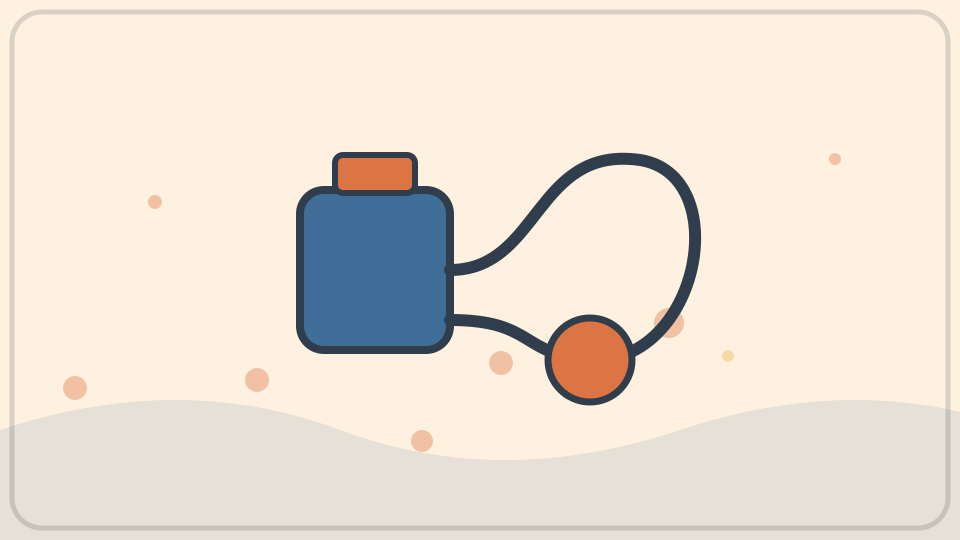

电动机让通电线圈处在磁场中。电流和磁场相互作用，对线圈产生转动力矩。换向装置或电子控制不断调整电流，转子便能持续转动。

**再想一步：** 电动机把电能转成机械能，同时也会产生热和声音。风扇、洗衣机、电动车和许多玩具使用的电机大小不同，基本关系却相似。

*图解：线圈中的电流产生磁场，与另一磁场相互作用形成力矩，使转子转动。*

**一起看看：** 听安全小风扇启动时声音怎样变化，不把手靠近叶片。

---

## 第 200 天｜发电机和电动机是亲戚吗？

是。电动机用电流和磁场产生运动，发电机则让线圈与磁场相对运动，产生电压；接入闭合回路后才会形成电流。两者都利用电和磁之间的联系。

**再想一步：** 变化的磁通量会产生感应电动势，这叫电磁感应。水轮机、风轮机或蒸汽轮机先提供转动，发电机再把机械能转换为电能。

*图解：电动机把电能转成机械运动；发电机用机械运动改变磁通并产生电压。*

**一起看看：** 观察手摇发电玩具由大人转得更快时灯的变化。

---

## 第 201 天｜电风扇会制造冷空气吗？

普通风扇主要让空气流动，并不把整个房间的空气主动降温。流动空气带走皮肤附近的暖空气，也加快汗液蒸发，所以人觉得凉快。电机本身还会放出一点热。

**再想一步：** 感觉温度与空气温度、湿度、风速和身体散热共同有关。无人房间里一直开普通风扇，通常不会像空调那样降低室温。

**一起看看：** 在安全距离感受不同档位的风，不遮住风扇进出口。

---

## 第 202 天｜水泵怎样把水送上去？

水泵用活塞、叶轮或其他部件改变液体压力。压力差推动水从入口流向出口，有些泵还需要先充满水。泵必须得到人力、电力或发动机的能量。

**再想一步：** 离心泵的旋转叶轮给水增加速度，泵壳再把一部分速度变成压力。泵不是凭空“吸水”，入口处压力降低后，别处较高压力把水推来。

**一起看看：** 观察洗手液按压泵怎样回弹，不拆开水泵或电器。

---

## 第 203 天｜水龙头怎样让水停下来？

水龙头里面有阀门。转动或抬起把手，会移动密封件或带孔的零件，改变水流通道大小。通道关紧时，密封面阻止有压力的水通过。

**再想一步：** 不同龙头使用螺旋阀、陶瓷片或球阀等结构。关得太用力可能损坏密封；滴水常来自垫片磨损、杂质或零件没有完全贴合。

**一起看看：** 在大人陪同下慢慢开小水流，观察把手移动与流量关系。

---

## 第 204 天｜剪刀为什么有两个把手？

剪刀把两根杠杆用转轴连在一起。手柄把手的力传到刀刃，刀刃又像楔子把材料分开。靠近转轴处通常更有力，刃尖移动得更快更远。

**再想一步：** 剪切不是两把小刀简单相撞，两刃略有贴合角度，把作用力集中在很窄区域。材料厚度、刃口锋利和支点松紧都会影响效果。

**一起记住：** 儿童安全剪也要坐好使用，由大人递送并收起。

---

## 第 205 天｜拉链为什么一拉就合上？

拉链两边有交错的链牙。拉头内部是逐渐变窄或变宽的通道，移动时把两排链牙引导到一起咬合，反向则把它们分开。拉头本身不把链牙粘住。

**再想一步：** 链牙的凸起和凹槽互相扣住，能承受横向拉力。若布边歪斜、链牙损坏或夹入异物，导向关系被破坏，拉链就会卡住。

**一起看看：** 用一条旧大拉链慢慢拉，观察链牙在拉头哪边合拢。

---

## 第 206 天｜钥匙为什么只能开合适的锁？

常见弹子锁里有多组长短不同的弹子。合适钥匙的齿形把每组弹子推到恰好位置，让锁芯可以转动。错误钥匙无法把分界排成一条线。

**再想一步：** 锁是利用形状匹配来控制机械运动，并非所有锁都用弹子。锁提供的是阻碍和延迟，不代表任何锁都绝对无法被打开。

**一起看看：** 只看自家大人提供的透明教学锁，不拿钥匙尝试陌生门锁。

---

## 第 207 天｜门为什么绕着一边转？

门用合页连接门框。合页的两片金属围绕同一根销轴转动，让门只能沿预定弧线开合，同时承受门的重量。把手装得离合页远，开门更省力。

**再想一步：** 离转轴越远，同样的手力产生越大力矩。合页还要保持几根轴线对齐；若松动或歪斜，门就会摩擦、下垂或难以关闭。

**一起记住：** 手指远离门缝和合页，开关门先看另一边有没有人。

---

## 第 208 天｜桥为什么爱用三角形？

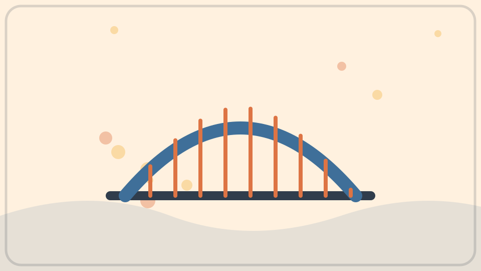

三根杆连接成三角形后，不改变杆长就不容易让形状歪掉。桥梁桁架用许多三角形，把载荷分成杆件里的拉力和压力。这样能用较少材料跨过较远距离。

**再想一步：** 四边形容易像剪刀架一样变形，加一根斜杆分成三角形就稳定。真实桥还要承受车辆、风、温度变化和材料疲劳，需要工程师计算与维护。

**一起试试：** 用吸管和连接泥做三角形、四边形，轻推比较稳定性。

---

## 第 209 天｜拱桥为什么不会掉下来？

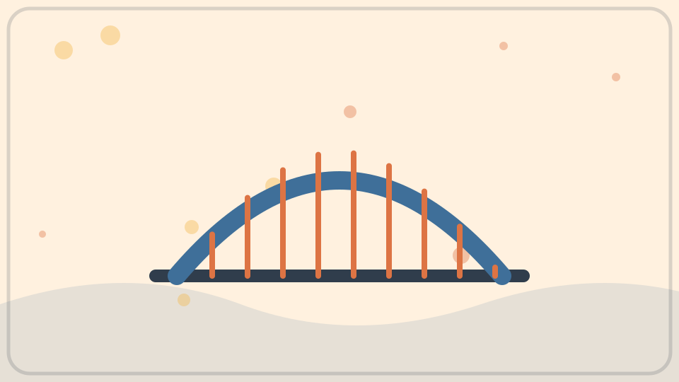

拱形把上面的重量沿弧线传向两侧桥墩和地基。石头很能承受挤压，所以一块块楔形石可以互相压紧。两端必须足够牢固，挡住向外推的力。

**再想一步：** 理想拱让主要内力成为压力，减少石材不擅长承受的拉力。建造传统拱桥时常先用支架托住，最后放入拱顶关键石后再撤架。

**一起看看：** 找一座拱桥照片，用手指沿拱顶画到两边地基。

---

## 第 210 天｜起重机怎样举起很重的东西？

起重机用电动机、卷筒、钢丝绳和滑轮提升重物。长臂把吊钩送到远处，另一边的配重帮助平衡转动力矩。支腿或塔身把力量传到地面。

**再想一步：** 吊得越远，同样重量产生的倾覆力矩越大，所以每台起重机都有载荷范围。风会让吊物摆动，操作必须由受训人员按严格规则完成。

**一起记住：** 远离施工围栏，绝不站在吊物或起重臂下方。

---

## 第 211 天｜电梯怎样知道停在哪一层？

许多电梯用电动机带动钢丝绳，让轿厢和配重上下移动。传感器读取位置与速度，控制器决定何时加速、减速和开门。制动器和多种安全装置防止意外移动。

**再想一步：** 配重接近轿厢加部分载荷的重量，电机主要克服两边差值和摩擦，因此更省能。限速器检测异常速度，可触发安全钳夹住导轨。

**一起记住：** 进出先看轿厢是否到位，不扒门、不跳跃，听从大人。

---

## 第 212 天｜机器人怎么知道周围有什么？

机器人用摄像头、距离传感器、触碰开关或麦克风收集信号。控制程序根据这些信号选择动作，再让电动机驱动轮子或关节。它执行设计和学习得到的规则，不一定像人一样理解。

**再想一步：** 传感器把光、声、力等物理量变成电信号，算法再从信号中估计环境。测量会有噪声和盲区，所以机器人需要校准、冗余和安全限制。

**一起想想：** 设计一个捡积木机器人，它至少要感觉到哪三件事？
