# 兴趣单元 07｜水的状态、旅行与天气

> **探索领域 02：** 空气、天气与水
>
> **核心问题：** 水怎样改变状态、沿地表和地下流动，并参与天气与气候？

从水洼、湿衣服和冷杯子开始，一滴水会进入空气、土壤、河流与供水系统；预报则利用观测推测下一段天气。

## 怎样沿着本单元的追问链阅读

把看得见的白雾与看不见的水蒸气分开，也把一次天气和多年气候统计分开。

## 追问链 07.1｜蒸发、凝结、融化与水循环

水吸收或放出能量后改变状态，并在海洋、陆地、空气和生物之间移动。

### 第 047 问｜水洼怎么自己变小了？

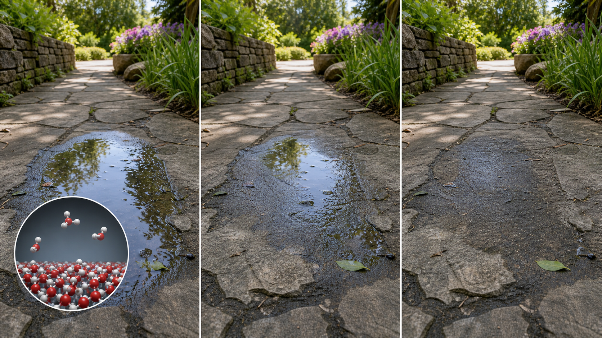

水面上一些水分子得到能量后，会跑进空气，变成看不见的水汽。这个过程叫蒸发。阳光、温暖和风常常让水洼干得更快。

**再想一步：** 蒸发可以在未沸腾时发生，主要出现在液体表面。逃走的常是能量较高的分子，剩下水的平均能量降低，所以蒸发也能带来冷却。

**把知识连起来：** 液态水里的分子速度并不完全相同，表面上能量较高的一些能挣脱邻近分子的吸引进入空气。温度高会增加高能分子比例，风会带走水面上方的湿空气，干燥空气还能接纳更多水汽，所以这些条件加快蒸发。蒸发带走较高能量的分子，也解释了汗液为何能帮助身体降温。

**再往外看：** 海水蒸发留下大部分盐，推动盐场结晶；植物蒸腾则把土壤水送进大气。一个表面分子逃逸的过程，能放大成区域水循环。

**容易弄混：** 水洼变小不表示水被消灭了。水分子进入空气后仍然存在，之后可能凝结成云、随雨落下或被风带到别处。

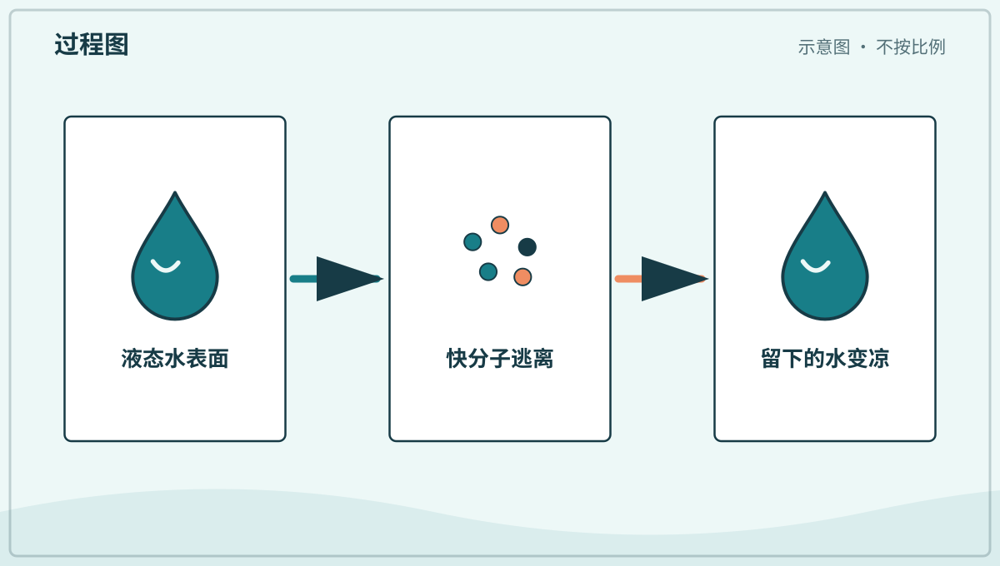

*图解：液面上能量较高的水分子逃进空气，剩余水的平均能量下降。*

**一起看看：** 雨后记住一个安全的小水洼，过一会儿再比大小。

---

### 第 048 问｜湿衣服为什么会干？

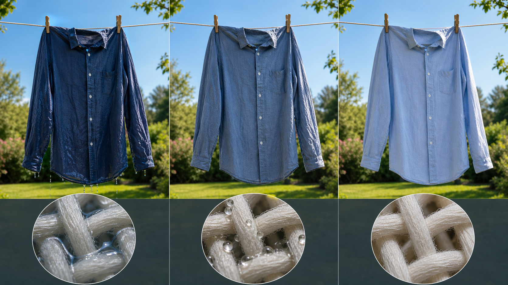

湿衣服的纤维里藏着水。水慢慢蒸发到空气中，衣服就干了。风会带走衣服旁边潮湿的空气，让更多水继续蒸发。

**再想一步：** 当周围空气接近饱和，能再接纳的水汽就少，蒸发会变慢。摊开衣服增加表面积，也让更多水分子有机会从表面离开。

**把知识连起来：** 水会进入纤维间的孔隙，并因附着和毛细作用沿纤维扩散。摊平衣服能增大接触空气的面积，脱水能先移走大量液态水，通风则不断换走贴近布面的潮湿空气。空气湿度很高时，即使温度不低，蒸发也会慢；冷而干燥、有风的天气有时反而能把衣服晾干。

**再往外看：** 烘干机用加热和气流加快水离开，再把湿空气排走或冷凝回收。比较晾晒与机器烘干，可以讨论时间、能耗、衣物磨损和天气条件。

**容易弄混：** 衣服变干不一定需要太阳直晒。阳光常通过加热加快蒸发，但只要空气未饱和并能流动，阴处的水也会离开。

**一起看看：** 比比通风处和不通风处的小湿布，哪块先干。

---

### 第 049 问｜水汽看得见吗？

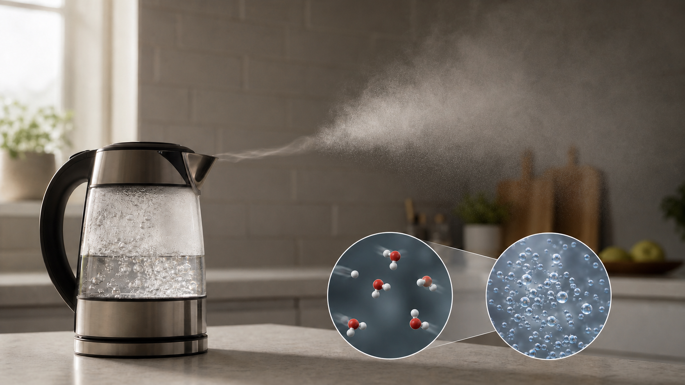

真正的水汽是气体，眼睛看不见。热水上方常见的白雾，其实是水汽变凉后形成的小水滴。它们很小，能把光散开，所以显得白白的。

**再想一步：** “蒸汽”在日常话里常指白雾，但科学上气态水本身透明。水滴继续混进较干空气并蒸发后，白雾就会消失。

**把知识连起来：** 沸水内部形成的气泡主要装着水蒸气，气泡到达水面破裂后，靠近壶嘴的高温水蒸气仍可能透明；稍远处与冷空气混合，才凝结成白色小滴。云、雾和冷天呼气都利用了相似的凝结与散射过程。温度再次升高或周围空气变干，小滴又能蒸发而“消失”。

**再往外看：** 看清气态、液态和固态之间的区别，是理解云、冰箱结霜、浴室镜面水珠和天气的共同基础。同一种水可在不同条件下改变状态。

**容易弄混：** 日常说的白色“蒸汽”常是液滴雾。科学表达中，水蒸气指气态水分子，本身通常看不见。

**一起看看：** 只在远处观察大人倒的温水，不靠近开水和蒸汽。

---

### 第 050 问｜冰块为什么会化成水？

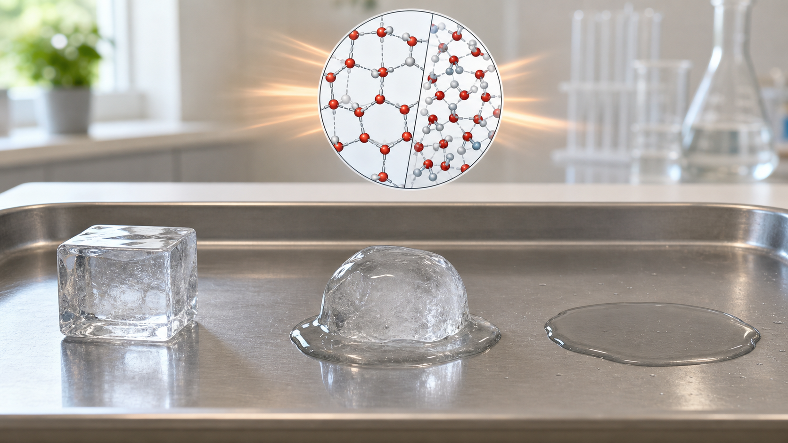

冰从周围得到热量后，里面的水分子活动得更自由，固体就变成液体。这个变化叫融化。水还是水，只是样子和流动方式变了。

**再想一步：** 在融点附近，吸收的能量主要用来破坏固体里较整齐的结构，而不马上升高温度。这部分能量叫熔化潜热。

**把知识连起来：** 冰达到融点后继续吸热，能量主要用来打破维持晶格的分子间作用，而不是立刻让温度升高，因此正在融化的冰水混合物温度可暂时接近不变。融化和冻结可以同时发生，哪一边更快取决于热量怎样进出。盐等溶质会降低水的冻结温度，所以撒盐能帮助道路上的冰在某些温度范围内融化。

**再往外看：** 融化吸热能被用来保持食物低温，冻结放热又影响结冰过程。相变材料还被放进建筑和运输包装，在温度变化时储存或释放能量。

**容易弄混：** 冰融化不是“冷跑光了”，热也不是一种藏进冰里的液体。能量从较暖环境传入，改变了水分子的排列和运动状态。

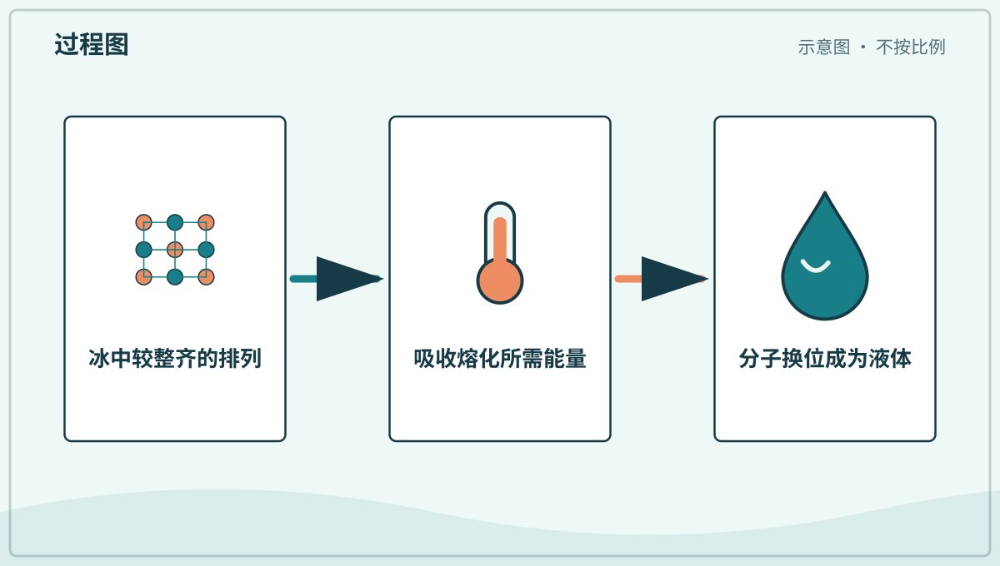

*图解：冰吸收能量后，较整齐的晶体排列被破坏，水分子便能彼此换位流动。*

**一起看看：** 把冰块放在盘子里，观察它的边缘先怎样变化。

---

### 第 051 问｜冷杯子外面为什么会有水？

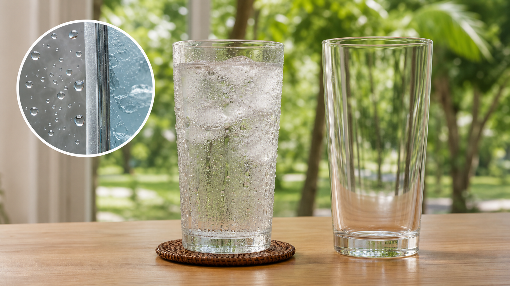

那些水通常不是从杯子里漏出来的。空气里的水汽碰到冰凉的杯壁，变成一颗颗液态水珠。这个变化叫凝结。

**再想一步：** 杯壁先让附近空气冷却到露点，水汽才在表面凝结。空气越潮湿，通常越容易出现水珠；用密封袋包住杯子可帮助判断水来自哪边。

**把知识连起来：** 冷杯壁从附近空气吸走热量，贴近表面的空气温度下降；一旦低于露点，空气能保持的水汽减少，多出的水便在杯壁成核并汇成大滴。湿热天气水珠更多，干燥天气可能很少。若杯壁低于冰点，外面甚至会先结霜，再在升温后化成水。

**再往外看：** 露点能说明空气离饱和还有多远，气象预报和建筑防潮都会使用它。窗户结露、墙体霉变和云雾形成背后都有相似判断。

**容易弄混：** 杯外水珠通常来自房间空气，但容器确实也可能漏水。检查液面是否下降、杯壁是否有裂缝，并用密封外袋做对照，才能区分原因。

**一起看看：** 擦干杯壁，再等一会儿看水珠会不会回来。

---

### 第 052 问｜一滴水会去哪里旅行？

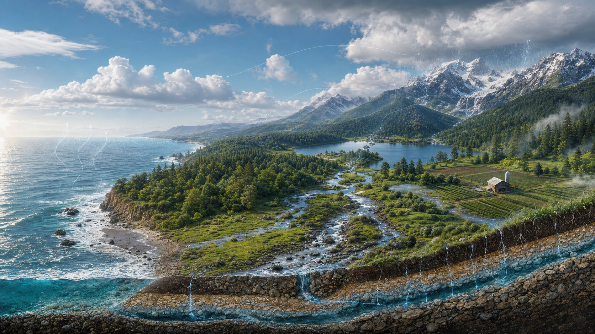

水会从海洋、湖泊和地面蒸发，升到空中变成云。它又以雨或雪落下，流进河流、地下和海洋。水这样不断移动，叫作水循环。

**再想一步：** 植物也会从叶片释放水汽，叫蒸腾。水还可能在冰川、地下或深海停留很久，所以水循环不是每一滴水都沿同一条圆圈快速旅行。

**把知识连起来：** 水循环由太阳提供蒸发能量，由重力把降水和河流拉向低处。海洋、冰川、土壤、地下水、生物和大气都是水库，水在它们之间的移动速度不同：大气中的水停留较短，深层地下水和冰川中的水可能保存很久。水循环还携带热量、溶解物和泥沙，连接天气、地貌与生命。

**再往外看：** 人体、树木和食物中的水也属于水循环。我们喝下的水可能曾在云、河、冰川或别的生物体内停留，物质会不断重新进入新路径。

**容易弄混：** 水循环不是每滴水都按同一圆圈依次走完。路径会分叉、停留和重复，有些水很快回海，有些会在地下待许多年。

*图解：水可在海洋、空气、陆地和生物之间循环，但每滴水的路径不同。*

**一起说说：** 让手指扮成一滴水，走一圈“海洋、云、雨、河流”。

## 追问链 07.2｜流水、地下水与生活用水

重力、孔隙、管网和材料表面共同影响水往哪里去。

### 第 053 问｜河水为什么往低处流？

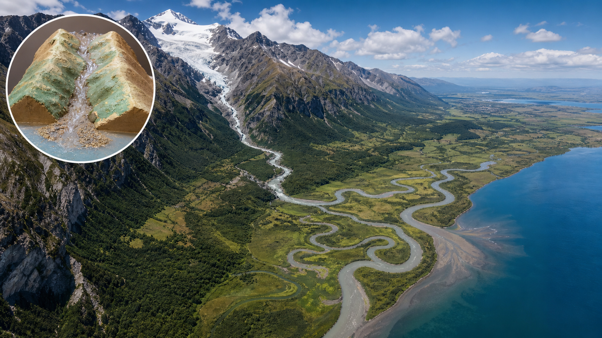

重力把水拉向较低的地方。雨水和融雪从山坡汇到小溪，小溪又合成河流。河道弯曲、石头和泥沙都会改变水流的方向。

**再想一步：** 河流把较高处的重力势能转成水的运动，也会侵蚀、搬运和沉积泥沙。长时间以后，这些作用能雕出峡谷、河谷和三角洲。

**把知识连起来：** 水受重力沿地势坡度运动，许多小流域汇成更大的流域。外弯水流较快，常侵蚀河岸；内弯较慢，容易沉积泥沙，河道因此会摆动和迁移。洪水时河流可能越过河岸，把细泥铺在平原上。河流既传送水，也持续重塑自己经过的土地。

**再往外看：** 人们修建堤坝、水库和水电站会改变水流、泥沙和生物通道。利用河流能量时，也要研究整个流域受到的长期影响。

**容易弄混：** 河水不是“知道海在哪里”才前进。局部坡度和压力一步步决定流向；封闭盆地中的河也可能流进湖泊、盐沼或沙漠，而不到海洋。

**一起看看：** 看雨水沿安全的地面小沟流动，不踩进急水里。

---

### 第 054 问｜地下也有水吗？

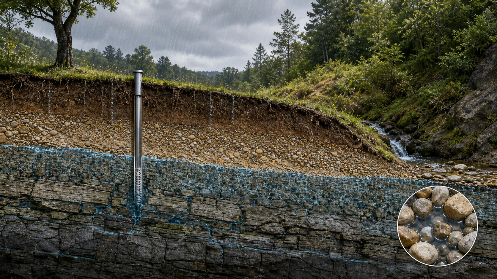

一部分雨水会从土壤和岩石的缝隙渗下去。它储存在地下可以让水通过的地方，叫地下水。井和泉有时能让地下水来到地面。

**再想一步：** 能储存并传递较多地下水的岩土层叫含水层。地下水并不总像地下河一样流在空洞里，更多时候填在沙粒和岩石的小孔隙中。

**把知识连起来：** 雨水穿过土壤后，会沿可连通的孔隙和裂缝缓慢下渗，直到遇到较难透水的层。地下所有孔隙都被水填满的上界叫地下水位，它会随季节和抽水变化。地下水也会缓慢流动并从泉眼、河床或海岸排出；污染物一旦进入含水层，可能很难迅速清除。

**再往外看：** 地下水补给慢的地区若抽取过快，水位会下降，地面甚至可能沉降。用水速度必须与补给、生态需求和水质保护一起考虑。

**容易弄混：** 地下水大多不是藏在巨大空洞中的地下湖。常见情形更像一桶装满砂石后，水填在颗粒之间的空隙里。

**一起试试：** 请大人慢慢给一盆干土浇水，看水怎样渗进去。

---

### 第 055 问｜水龙头里的水从哪里来？

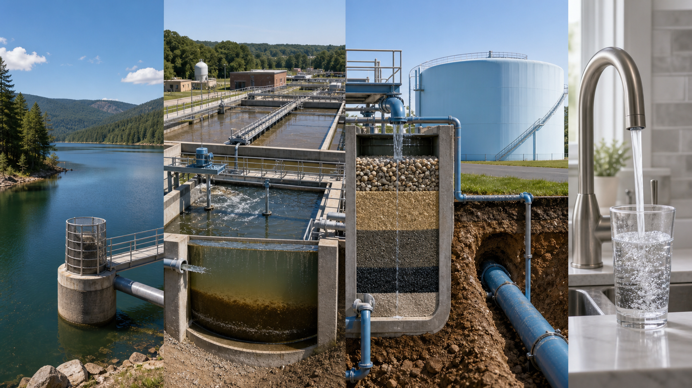

许多地方会从河流、湖泊、水库或地下取水。水厂用多道步骤去掉脏东西和有害微生物，再通过管道送到家里。不同地方的供水办法并不完全一样。

**再想一步：** 常见处理会让悬浮小颗粒聚集沉降，再经过过滤和消毒；具体步骤取决于水源。看起来透明不代表适合饮用，安全还需要检测看不见的微生物和物质。

**把知识连起来：** 原水进入水厂后，常先加药让细颗粒聚成较大絮团，再沉淀、过滤并消毒；处理后的水储在清水池或高位水塔，由泵和重力维持管网压力。使用后的污水会走另一套管道去污水处理设施，不能与饮用水管混在一起。供水系统还要持续检测微生物、浑浊度和化学物质。

**再往外看：** 安全供水需要水源保护、水厂、管网、检测和污水处理共同工作。打开水龙头只是一条很长公共工程链的最后一步。

**容易弄混：** 透明、无味的水不一定安全，烧开也不能去掉所有溶解污染物。饮用要求应遵循当地可靠供水和卫生建议。

**一起说说：** 找找家里哪些事情需要干净的水。

---

### 第 056 问｜肥皂为什么能洗掉油？

肥皂分子有一头喜欢水，一头容易靠近油。许多肥皂分子会围住油污，让水把它们带走。搓洗还能把藏在缝隙里的脏东西松开。

**再想一步：** 这种两头性质不同的分子叫表面活性剂。它们形成微小集合，把油藏在内部、让亲水的一头朝外，于是油能分散在水中被冲走。

**把知识连起来：** 表面活性剂的疏水端插进油污，亲水端留在水中，搓揉把大油块分成许多小滴，分子在外面围成胶束，冲水时便能把油带走。温水可降低某些油脂黏度，机械摩擦能把污物从纤维和皮肤纹路松开。洗手时，足够的搓洗时间、覆盖指缝和彻底冲洗都同样重要。

**再往外看：** 细胞膜也含有一端亲水、一端疏水的脂质分子，会自己排成双层。肥皂胶束与细胞膜并不相同，却显示分子两端性质怎样决定大结构。

**容易弄混：** 肥皂不是把油变成水，也不是用得越多越干净。适量肥皂、摩擦和清水共同工作，残留太多反而需要更多水冲掉。

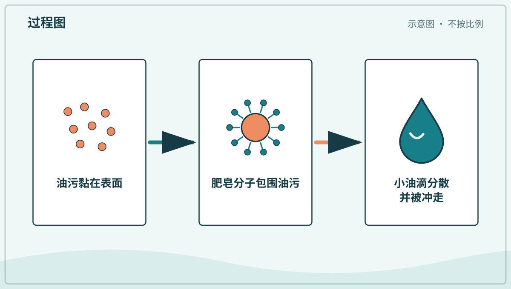

*图解：表面活性剂一端靠近油、一端靠近水，许多分子包住油污后随水离开。*

**一起试试：** 和大人按“打湿、抹皂、搓洗、冲净、擦干”洗手。

---

### 第 057 问｜雨伞为什么不容易湿透？

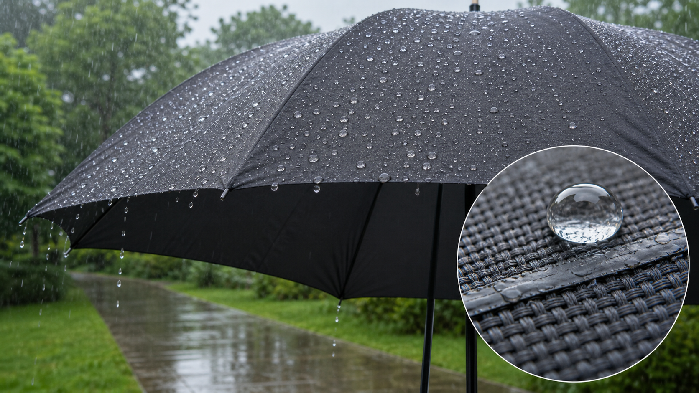

伞布织得很密，表面还常有防水处理。水不容易钻进布里，会聚成水珠滚下去。用久或破损的伞也可能慢慢漏水。

**再想一步：** 防水表面让水与材料的吸引较弱，水滴接触角较大，就更容易滚落。真正的防水还依赖涂层完整、接缝设计和水压大小。

**把知识连起来：** 伞布纤维织得紧密，孔隙小，外层防泼水处理又让水滴接触角增大。普通雨压下，表面张力和涂层阻止水进入；强风把水压进接缝、涂层磨损或布面被触碰后，水仍可能渗透。现代透湿防水膜还利用比液滴小、却能让部分水蒸气通过的微观结构兼顾防雨和排汗。

**再往外看：** 荷叶和一些昆虫表面的微细结构能增强疏水效果，工程师据此设计自清洁涂层。模仿自然前仍要测试耐磨、环保和长期效果。

**容易弄混：** 防泼水、防水和永远不湿不是一回事。表面能让水珠滚落，不表示接缝和材料在任何水压、任何使用时间下都不会漏。

**一起看看：** 伞晾干前，观察水珠怎样在伞面上滚动。

## 追问链 07.3｜天气预报与气候

预报综合多种观测估计短期大气状态，气候描述较长时期的统计特征。

### 第 058 问｜天气和气候是一回事吗？

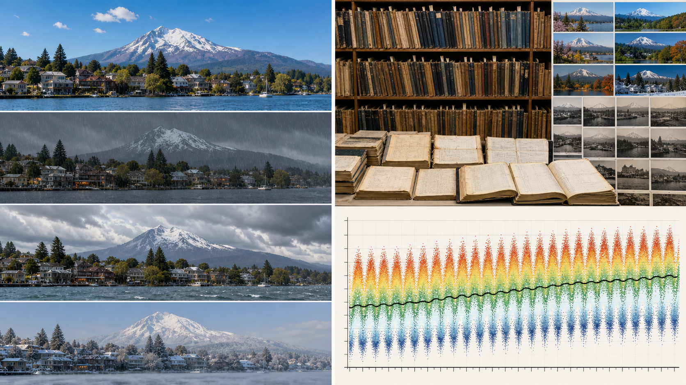

天气是今天或最近的冷暖、风雨和云。气候是一个地方很多年常见的天气样子。今天下雪是天气；一个地方冬天通常很冷，是气候特点。

**再想一步：** 气候用长时间的平均值、变化范围和极端事件来描述，不等于“每天都一样”。一次冷天不能单独说明气候趋势，科学家要比较许多年、许多地方的数据。

**把知识连起来：** 描述气候不只计算平均温度，还会看降水季节、年际波动、极端高温和寒冷出现频率。科学家用至少几十年的观测比较基准，并结合树轮、冰芯等资料研究更早时期。天气在气候背景上每天起伏，就像一段崎岖小路总体仍可能缓慢上坡或下坡。

**再往外看：** 气候决定一个地区适合哪些生态系统、作物和建筑方式。气候变化研究因此要把物理观测与生态、农业和社会适应连接起来。

**容易弄混：** 某一天很冷不能证明全球没有变暖，某一天很热也不能单独证明长期趋势。气候判断需要长时间、广范围和多种指标的证据。

**一起说说：** 先说今天的天气，再说这里的夏天常常怎样。

---

### 第 059 问｜天气预报怎么知道明天？

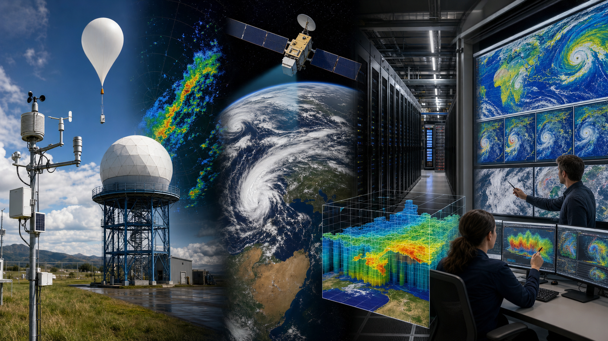

气象站、气球、雷达和卫星会测量空气、云和风。电脑用这些数据计算天气可能怎样变化。预报是有证据的猜测，越远的天气通常越难说准。

**再想一步：** 天气模型把大气分成许多小格，用物理规律一步步计算。初始测量不可能覆盖每一点，微小误差还会随时间放大，所以预报常用概率表达不确定性。

**把知识连起来：** 气象观测先被同化进模型，形成某一时刻尽可能完整的大气状态。模型依据流体运动、热量交换和水的相变向前计算；预报员还会比较多组稍有不同的初值与模型，形成集合预报。若多数结果一致，信心较高；若分散很大，就用降雨概率或路径范围表达不确定性。

**再往外看：** 预报的价值不只在“猜中”，还在帮助决策。是否带伞、航班是否改道、城市是否防洪，需要把发生概率与后果大小一起考虑。

**容易弄混：** “降雨概率百分之三十”不等于一定只下三成时间，也不等于三成地区必下雨。它表示在规定地点、时段和预报定义下，出现可测降水的估计机会。

**一起看看：** 和大人比较今天的天空与天气预报说得像不像。

## 单元综合观察｜给一滴水画有分岔的旅行图

从盘中一滴清水开始，画出它可能进入空气、云、土壤、河流或管网的多条路线。强调每滴水的路径不同，图中箭头表示可能过程而非固定行程。
