# 八月：地球是我们的家

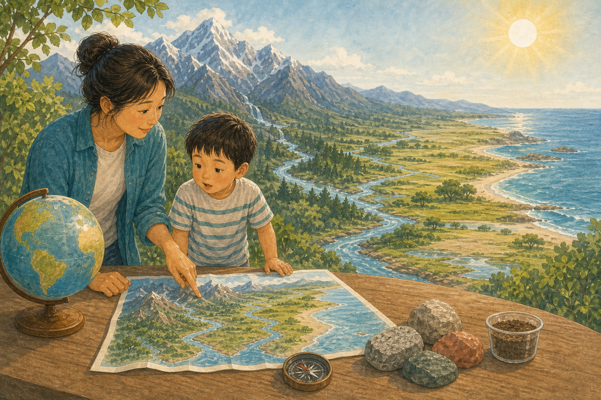

## 第 213 天｜地球为什么是圆的？

地球有很大质量，所有部分都被重力拉向中心。足够大的天体会被这种拉力整理成接近球形。地球自转让赤道附近微微鼓起，所以不是完美的球。

**再想一步：** 小石头的材料强度能抵抗重力，保持不规则形状；行星大得多，长期看来岩石也会在巨大压力下变形。科学家称这种接近平衡的形状为流体静力平衡。

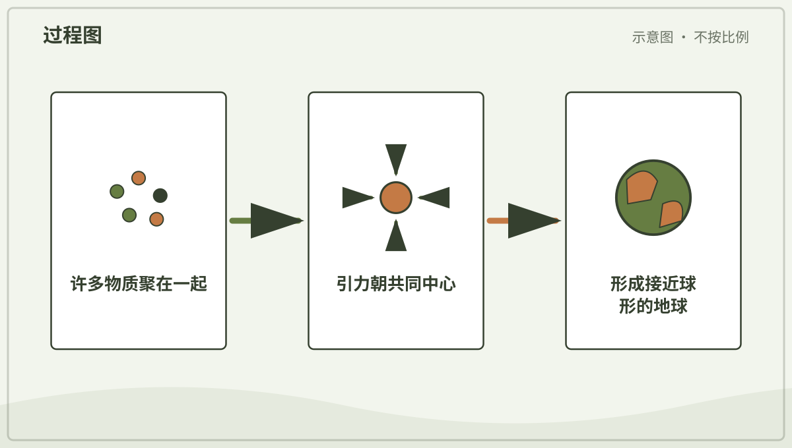

*图解：大型天体的引力把物质拉向共同中心；足够大时，整体会接近球形。*

**一起看看：** 比较地球仪和小石头，猜猜为什么大小会改变形状。

---

## 第 214 天｜站在地面为什么看不出地球弯？

地球非常大，我们站立的范围和它相比很小，所以附近地面看起来平。远处船只会从下到上逐渐被地平线遮住，高处也能看得更远。这些都是曲面的线索。

**再想一步：** 地平线距离随观察高度增加而增大。人们还可用月食中地球的圆影、不同纬度的星空和环球航行等多种独立证据确认地球形状。

**一起看看：** 在安全开阔处比较蹲下和站起时能看见的远处范围。

---

## 第 215 天｜地球另一边的人为什么不会掉下去？

重力把地球附近的物体拉向地球中心。无论人站在球面的哪一边，脚下的“下”都指向中心，所以每个人都觉得自己站得很正。太空没有一个统一的绝对上下。

**再想一步：** 地球上所有物质共同产生引力，离地心越远，引力通常越弱。地球自转会略微改变不同纬度测到的重量，但不会把人甩出去。

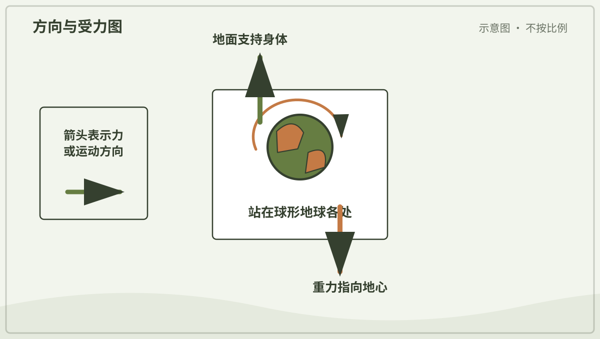

*图解：无论站在地球哪一边，重力都大致指向地心，所以脚下都是当地的“下”。*

**一起试试：** 在球上贴几枚纸人，让每个纸人的脚都指向球心。

---

## 第 216 天｜地球里面是什么？

地球外面是很薄的地壳，下面是厚厚的地幔，更深处是主要由铁和镍组成的地核。外核是液态，内核因巨大压力保持固态。我们不能直接挖到那里。

**再想一步：** 科学家分析地震波穿过地球时速度和路线的变化，像给地球做“透视检查”。不同地震波能否通过液体，帮助确认外核的状态。

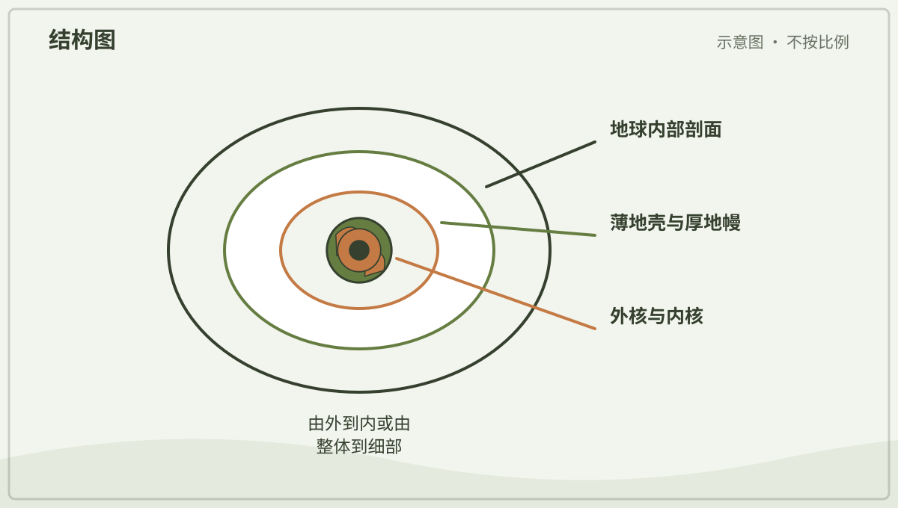

*图解：地球由薄地壳、厚地幔和金属核心等层次组成，越深条件越极端。*

**一起看看：** 用煮熟鸡蛋作形状比喻，但记住蛋壳、蛋白、蛋黄不等于地球材料。

---

## 第 217 天｜大陆会慢慢移动吗？

会。地球最外层分成许多大大小小的板块，它们每年移动几厘米左右。板块相撞、分开或擦过，会形成山脉、海沟、火山和地震带。

**再想一步：** 板块运动由地幔对流、下沉板块拉力和海岭推力等共同驱动。移动很慢，但几千万年累积起来，足以让海洋开合、把大陆重新排列。

*图解：岩石圈板块缓慢移动；在边界处碰撞、拉开或错动，塑造地表。*

**一起看看：** 把两块硬纸放在毛巾上，演示相撞、分开和错动。

---

## 第 218 天｜地震时地面为什么会摇？

板块运动让岩石慢慢积累应力。断层突然滑动时，储存的弹性能量以地震波向四周传播，地面便摇动。震源在地下，正上方地面位置叫震中。

**再想一步：** 不同地震波让地面以不同方式运动，破坏还受距离、深度、土壤和建筑结构影响。科学家能很快检测地震，却不能准确预报某天某时一定发生。

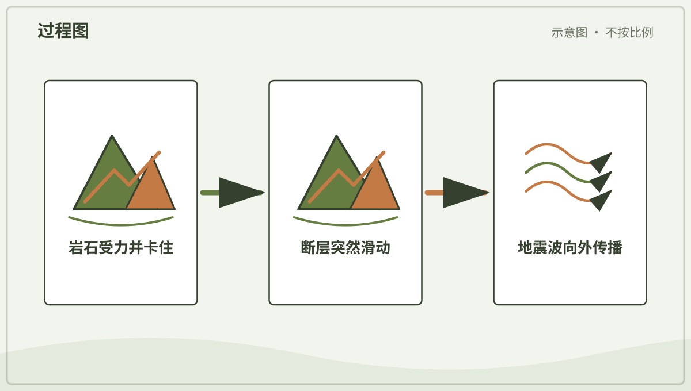

*图解：断层突然滑动释放弹性能，地震波向外传播并使地面摇动。*

**一起记住：** 地震安全做法依当地指导练习，发生时听大人和公共警报。

---

## 第 219 天｜火山为什么会喷发？

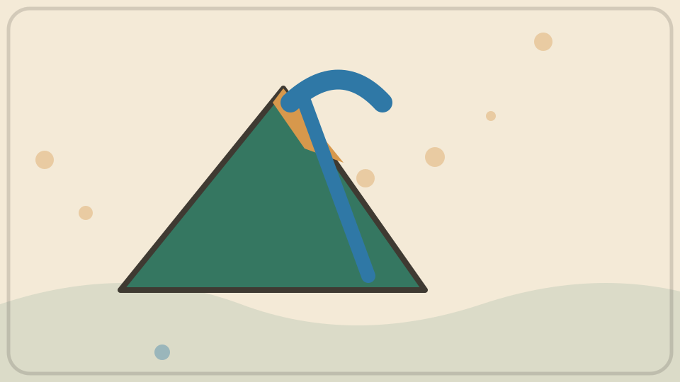

地下部分岩石熔化形成岩浆，里面还溶有气体。岩浆上升时压力降低，气体形成气泡并膨胀，可能推动岩浆喷出。岩浆到地面后叫熔岩。

**再想一步：** 岩浆黏度和含气量影响喷发方式：较稀的熔岩容易流动，黏稠岩浆更容易困住气体并爆炸。并非每座火山都长成尖圆锥，也不是一直有地下大空洞。

*图解：岩浆中的气体膨胀并增加压力；岩浆沿裂缝上升，可能到达地表喷发。*

**一起看看：** 在火山照片中找火山口、熔岩流和火山灰云。

---

## 第 220 天｜山是怎样长高的？

有些山由板块碰撞，把地壳挤压、折叠和抬升形成；有些由火山喷出的材料堆积。河流、冰川、风和重力又不断侵蚀山体。山脉同时在生长和变矮。

**再想一步：** 抬升速度与侵蚀速度的长期竞争决定地形。岩石种类、断层和气候不同，会让山峰变得尖锐、圆缓或形成高原。

*图解：板块碰撞或火山堆积能抬高地表，风、水、冰和重力又持续侵蚀山体。*

**一起试试：** 推挤两条不同颜色的毛巾，看它们怎样起皱隆起。

---

## 第 221 天｜山谷是被谁挖出来的？

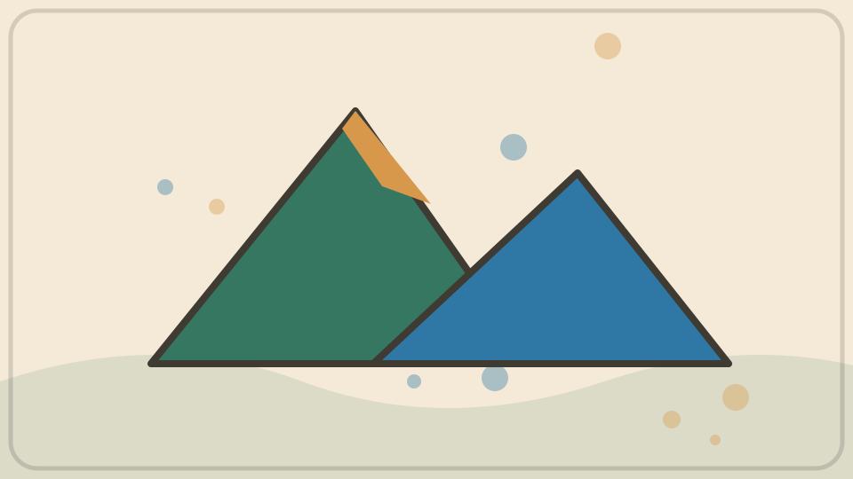

流水会带走岩石碎屑，长期切出常见的 V 形河谷。冰川像很慢的巨大砂纸，移动时能磨出较宽的 U 形谷。地壳运动和岩石软硬也会决定山谷方向。

**再想一步：** 侵蚀需要搬运工具：水、冰或风带着泥沙刮擦岩面，冻融和植物根还会先把岩石破开。地貌是许多小变化累积很久的结果。

*图解：岩石先被风化，流水或冰再搬走碎屑；长期侵蚀会加深和拓宽山谷。*

**一起看看：** 比较 V 形谷和 U 形谷照片，用手指描出横截面。

---

## 第 222 天｜岩石和矿物是一回事吗？

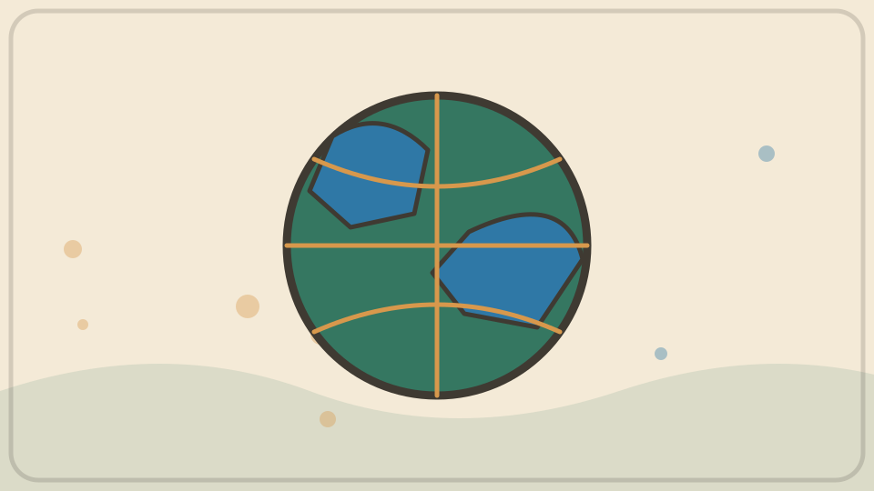

矿物是自然形成、成分和晶体结构较确定的固体。岩石通常由一种或多种矿物组成，像花岗岩里常能看见不同颜色颗粒。不是所有石头都只含一种东西。

**再想一步：** 岩石按形成过程分为火成岩、沉积岩和变质岩，它们能在熔化、沉积、受热受压和侵蚀中互相转变。这叫岩石循环。

*图解：岩石会在冷却、风化沉积、受热受压和熔融中转变，路径不只有一种。*

**一起看看：** 观察三块安全石头的颗粒、光泽和层纹，不舔石头。

---

## 第 223 天｜土壤只是碎石头吗？

土壤含风化的矿物颗粒、腐殖质、水、空气和许多生物。沙粒、粉粒和黏粒大小不同，影响排水与保水。土壤形成很慢，也会分成不同层次。

**再想一步：** 岩石风化提供矿物颗粒，植物残体和分解者提供有机物，根与动物不断混合和改变孔隙。肥沃不是只看颜色深，还要看养分、结构、酸碱和生物活动。

**一起看看：** 用透明杯观察土样加水沉降，由大人处理，之后洗手。

---

## 第 224 天｜化石是恐龙的骨头吗？

有些化石是骨、壳或木头被矿物替换后的遗迹。有些化石只是脚印、洞穴或身体压痕。恐龙化石只是其中一部分，微小生物和植物也能留下化石。

**再想一步：** 生物被快速埋藏、缺少腐烂和破坏时，更可能保存。科学家结合岩层顺序、放射性定年和形态比较，重建过去环境，而不是只看一块石头猜故事。

**一起看看：** 比较贝壳本身、贝壳印痕和石化贝壳的图片。

---

## 第 225 天｜地球有几块大陆？

常见地理教学把陆地分成七大洲，但有些文化和体系会合并成六洲或其他数量。大陆是很大的连续陆地，洲的划分还包含历史和文化约定。海洋彼此连通。

**再想一步：** “有几大洲”不是纯粹由海水自动给出的唯一答案，欧洲和亚洲就连成一大片陆地。自然地形与人类分类在地图上常会交织。

**一起看看：** 在地球仪上找最大的连续陆地和环绕它们的水。

---

## 第 226 天｜地图怎样把大地方装进小纸上？

地图按比例缩小真实地方，再用线条、颜色和符号表示道路、河流、建筑或高度。比例尺告诉我们图上距离和真实距离怎样对应。图例解释符号意思。

**再想一步：** 地图会为用途选择信息：地铁图重视连接，地形图重视高度，天气图重视气象。省略不是错误，但读图要先问它想解决什么问题。

*图解：制图者选择比例尺、方向和符号，把真实空间关系缩小到平面。*

**一起看看：** 在一张熟悉地点的地图上找图例、方向和比例尺。

---

## 第 227 天｜为什么世界地图上的地方会变形？

球面不能像纸一样无拉伸、无撕裂地完全摊平。把地球画成长方形地图时，面积、形状、距离或方向至少有一些会变形。不同投影选择保留不同特点。

**再想一步：** 墨卡托投影较好保持局部方向，适合传统航海，却把高纬地区面积放大。等积投影保留面积比例，但形状会改变；没有一张平面世界地图处处完美。

*图解：球面无法无变形地铺成平面；不同投影会分别改变面积、形状或距离。*

**一起试试：** 尝试把橘子皮铺平，观察哪里必须裂开或挤皱。

---

## 第 228 天｜东南西北从哪里来？

东、西、南、北是人们描述地面方向的一套共同方法。东和西大致联系太阳升落方向，南北沿地球经线指向两极。具体方向要靠指南针、地图或地标确认。

**再想一步：** “前后左右”会随身体转向改变，基本方位不会跟着观察者转。太阳升起的准确位置还会随季节和纬度变化，所以不能把“正东升”当成每天都准确。

**一起看看：** 和大人找出家里的北边，再转身确认“左边”已经改变。

---

## 第 229 天｜手机怎样知道自己在哪里？

定位卫星不断广播自己的位置和精确时间。接收器比较多个卫星信号到达的时间，算出与卫星的距离，再确定地面位置。高楼、山谷和室内会让信号变差。

**再想一步：** 通常至少需要四颗卫星，才能同时解出三维位置和接收器时钟误差，这叫测距定位。地图应用还会结合无线网络、基站和运动传感器修正结果。

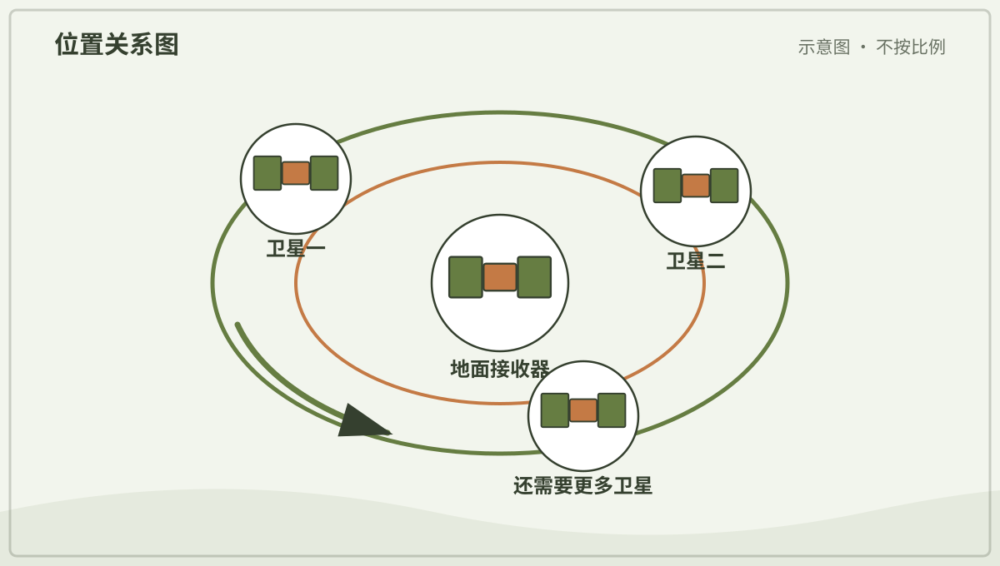

*图解：多颗卫星广播精确时间，接收器比较信号到达时间来估计距离和位置。*

**一起看看：** 和大人在开阔处看定位圆圈变大变小，不分享家庭位置。

---

## 第 230 天｜经线和纬线真的画在地上吗？

经线和纬线是人们想象并画在地图、地球仪上的定位网。地面上通常没有这些真正的线。纬度表示南北位置，经度表示绕地球的东西位置。

**再想一步：** 纬线彼此平行，经线在两极相交。经度需要选一条人为约定的零度经线，现代通用本初子午线经过英国格林尼治附近。

**一起看看：** 在地球仪上沿一条经线摸到两极，再沿赤道绕一圈。

---

## 第 231 天｜赤道为什么特别热？

赤道附近一年中太阳常升得较高，阳光较直接地落在地面。同一束阳光分摊的地面面积较小。阳光穿过的大气路径也较短，所以那里平均得到较多太阳能量。

**再想一步：** 温度还受云、海洋、海拔和风影响，赤道并非每处都最热。干燥副热带沙漠有时出现更高地表温度，说明纬度只是重要因素之一。

**一起看看：** 用手电分别直照和斜照纸面，比较光斑大小。

---

## 第 232 天｜南北两极为什么很冷？

极地阳光常斜着照，冬季还会长时间没有太阳。冰雪反射许多阳光，让地面吸收的能量更少。南极高原海拔很高，通常比北极更冷。

**再想一步：** 冰雪反射阳光的比例叫反照率。海冰融化露出深色海水后，吸收会增加，进一步促进变暖，这是冰—反照率反馈。

*图解：冰雪减少会露出深色海水，海水吸收更多阳光并升温，又会促进更多融化。*

**一起看看：** 把白纸和黑纸放在阳光下，由大人稍后比较温度，不久晒。

---

## 第 233 天｜为什么别的地方可能正在睡觉？

地球不同经度面对太阳的时间不同，一处正午时，远处可能是夜晚。人们把世界分成时区，让相近地区使用相近钟点。时区边界会为国家和生活需要弯曲。

**再想一步：** 地球 24 小时转约 360 度，平均每 15 度经度相差约一小时，但实际时区不是整齐直线。国际日期变更线附近还会相差一天。

**一起看看：** 在地球仪一侧照灯，找出同时是白天和夜晚的地方。

---

## 第 234 天｜岛和大陆有什么不同？

岛是四周被水包围、比大陆小的陆地。大小边界带有人类约定，所以世界最大岛格陵兰仍叫岛，而更大的澳大利亚常视作大陆。岛可以由火山、珊瑚或大陆碎片形成。

**再想一步：** 海平面变化会让岛与大陆连接或分开，生物也可能因此被隔离。长期隔离常让岛上物种形成独特演化路径。

**一起看看：** 在地图上找一座离大陆近的岛和一座远洋岛。

---

## 第 235 天｜半岛为什么叫“半个岛”？

半岛大部分边缘被水围绕，却有一边与更大块陆地相连。它像伸进海里的陆地手臂，并不真是被切掉一半的岛。半岛大小可以差很多。

**再想一步：** 海岸地貌会随板块运动、河流沉积、海浪侵蚀和海平面改变。半岛是方便描述形状的地理词，边界有时并不唯一。

**一起看看：** 在地图上沿半岛海岸走一圈，找到它连着大陆的地方。

---

## 第 236 天｜湖和海怎样分？

湖通常是四周被陆地包围的水体，可以是淡水也可以很咸。海通常与世界海洋相连或属于海洋的一部分。名字受历史影响，有些叫“海”的水体其实是内陆湖。

**再想一步：** 水体分类会看连接、盐度、形成过程和尺度，但日常名称不总严格服从科学定义。里海四周被陆地围绕，就是著名例子。

**一起看看：** 在地图上找一座有河流进出的湖和一片与大洋相连的海。

---

## 第 237 天｜河口为什么会长出三角洲？

河流带着泥沙来到湖或海，流速降低，搬不动的泥沙便沉下来。沉积不断堆积，河道分叉绕行，可能形成三角洲。并非每条河口都有明显三角洲。

**再想一步：** 泥沙供应、波浪、潮汐、海平面和地面下沉共同决定形状。水坝减少下游泥沙后，一些三角洲会被海浪侵蚀得更快。

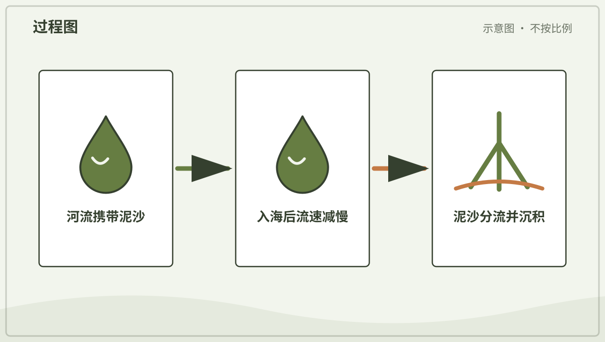

*图解：河水进入较平静水域后流速降低，搬运能力下降，泥沙逐渐沉积成三角洲。*

**一起看看：** 在卫星图里找河流入海处像树枝一样的分流。

---

## 第 238 天｜沙漠里为什么不全是沙？

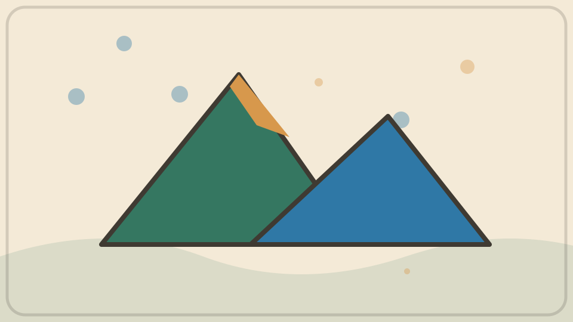

沙漠按降水稀少来定义，不按地面一定铺满沙。许多沙漠主要是石砾、岩地或盐地，沙丘只占一部分。南极的部分地区也属于寒冷沙漠。

**再想一步：** 空气下沉、山脉雨影、离海很远或寒冷都能造成干旱。昼夜温差、风化和风搬运塑造地表，生物则发展出节水和避热策略。

**一起看看：** 比较沙丘沙漠、岩石沙漠和极地沙漠的照片。

---

## 第 239 天｜热带雨林为什么层层叠叠？

热带雨林温暖多雨，植物争夺阳光，形成高树冠、林下层和地面层。每层光线、风和湿度不同，住着不同生物。藤本和附生植物借别的树接近光。

**再想一步：** 雨林养分循环很快，许多养分储存在活生物中而非深厚肥土里。砍掉树木会同时改变水循环、土壤、碳储存和物种关系。

**一起看看：** 在雨林图上从地面到树顶数出几个不同高度的家。

---

## 第 240 天｜草原为什么没有长满大树？

许多草原降水有季节性，火、放牧和干旱会限制树木。草的生长点常靠近地面，被吃或烧后仍能再长。不同大陆有温带草原和热带稀树草原。

**再想一步：** 火不总只是破坏，一些草原生态依赖周期性火清除枯物、释放养分并压制灌木。火太频繁、太少或季节改变也可能打乱系统。

**一起看看：** 比较草原植物与森林植物，哪一层最密？

---

## 第 241 天｜冰川会流动吗？

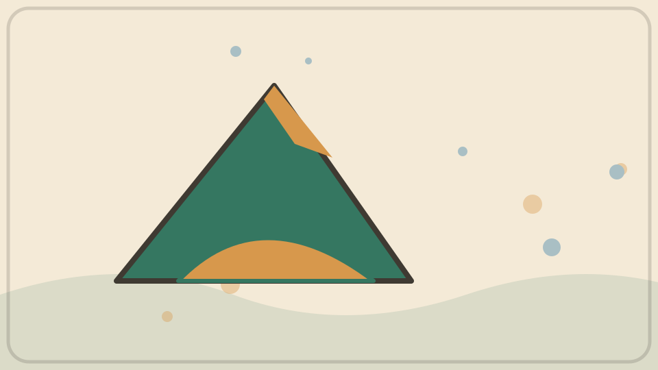

冰川由多年积雪压实形成。巨大重量让深部冰缓慢变形，底部也可能滑动，所以整条冰川会向低处流。它看起来不动，其实一年可移动不同距离。

**再想一步：** 冰川上部积雪增加，较低处融化或崩解；两边的收支决定冰川前缘进退。前缘后退不表示每一块冰都向山上流。

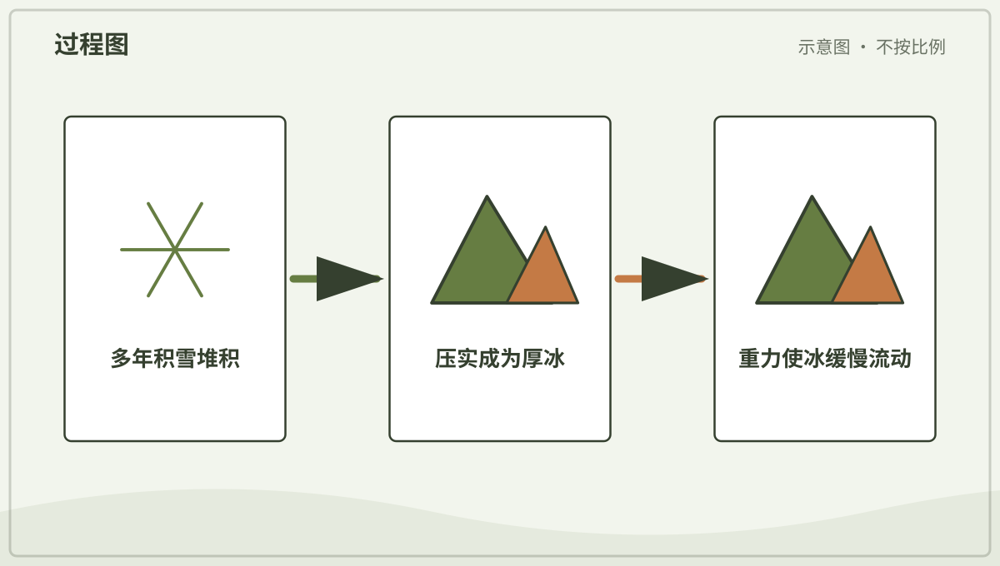

*图解：多年积雪被压成冰；冰在重力作用下变形和滑动，缓慢流向低处。*

**一起看看：** 比较同一冰川多年照片，用固定山峰作参照。

---

## 第 242 天｜洞穴里的石柱怎样长出来？

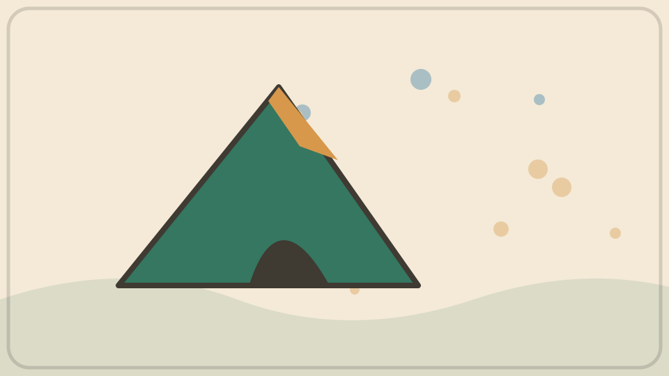

含二氧化碳的雨水渗过石灰岩，会溶解少量碳酸钙。水滴进入洞穴后，会失去一些二氧化碳。碳酸钙于是重新沉积，顶上长钟乳石，地面长石笋。

**再想一步：** 它们往往生长极慢，水量、温度和化学成分都会改变形状。触摸会留下油脂和污物，洞穴参观必须走规定路线。

**一起看看：** 在照片中找从顶向下与从地向上长的结构。

---

## 第 243 天｜国家边界会画在地面上吗？

有些边界沿河流、山脉或围栏，很多地方地面上没有明显线条。国家边界是人类历史、政治和法律形成的约定，地图用线把它表示出来。边界也可能改变。

**再想一步：** 自然地理回答山河在哪里，人文地理还研究人怎样组织空间、迁移和生活。地图上的线看似简单，背后可能有复杂历史，也会影响语言、交通和资源管理。

**一起看看：** 比较地形图与行政区图，同一地方分别画出了什么？
