# 兴趣单元 08｜种子、根、茎与叶

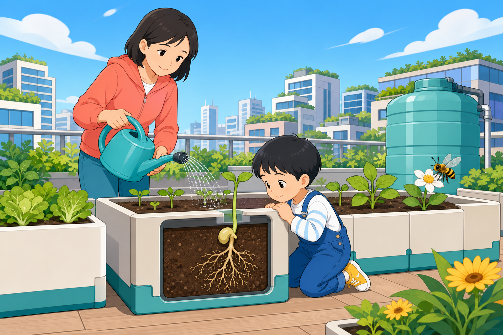

> **探索领域 03：** 植物与花园生命
>
> **核心问题：** 种子怎样启动生长，根茎叶又怎样分工取得和运输物质？

从种皮里的胚和储藏养分开始，沿胚根、幼芽、根毛、茎、叶脉、气孔和叶绿体追踪一株幼苗。

## 怎样沿着本单元的追问链阅读

把各部分放回获取、支撑、运输、制造和交换气体的共同任务中。

## 追问链 08.1｜种子醒来与先长根

水、氧气和合适温度启动代谢，胚根通常先伸出以固定并吸水。

### 第 060 问｜种子里面藏着什么？

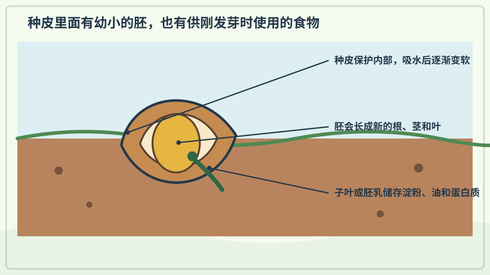

许多种子里藏着一个很小的植物胚，还有给它刚开始生长用的食物。外面的种皮像保护外套。条件合适时，小植物就会醒来生长。

**再想一步：** 胚已经有将来形成根、茎和叶的基本部分。储存的淀粉、油或蛋白质会被分解，为幼苗还不能充分光合作用的早期提供材料和能量。

**把知识连起来：** 种子把下一代植物最早的身体、启动生长所需的养分和一层保护外壳放在一起。萌发后，胚先依靠储藏物生长；叶片展开并能进行光合作用后，幼苗才逐渐转向自己制造有机物。种子的每一部分因此对应生命史中的一段任务。

**再往外看：** 不同植物把养分主要存进子叶或胚乳，种皮厚薄和休眠时间也差别很大。比较豆、玉米和向日葵的剖面，可以看到“种子”并不是只有一种内部方案。

**容易弄混：** 种子不是缩小到比例完整的成年植物，也不是没有生命的普通小石子。胚已经具有会形成根和芽的区域，但许多成熟器官要在萌发后继续分化。

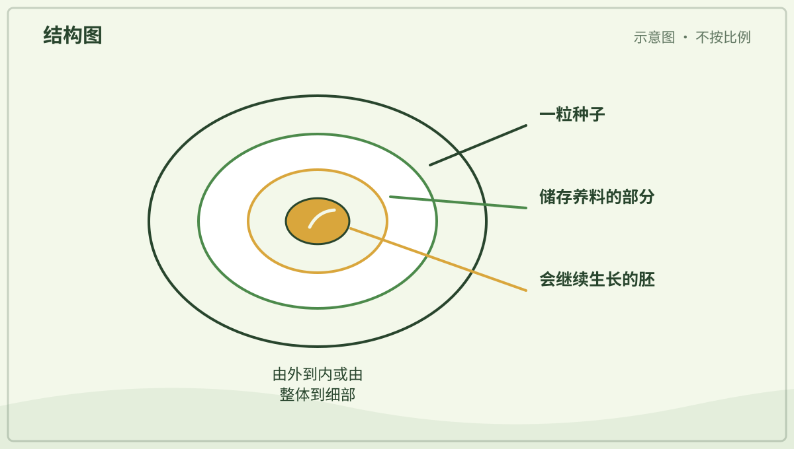

*图解：种皮保护内部；子叶或胚乳储存养料，胚会长成新的根和芽。*

**一起看看：** 请大人剖开一颗泡软的豆子，找找里面的小芽。

---

### 第 061 问｜种子怎样知道可以发芽？

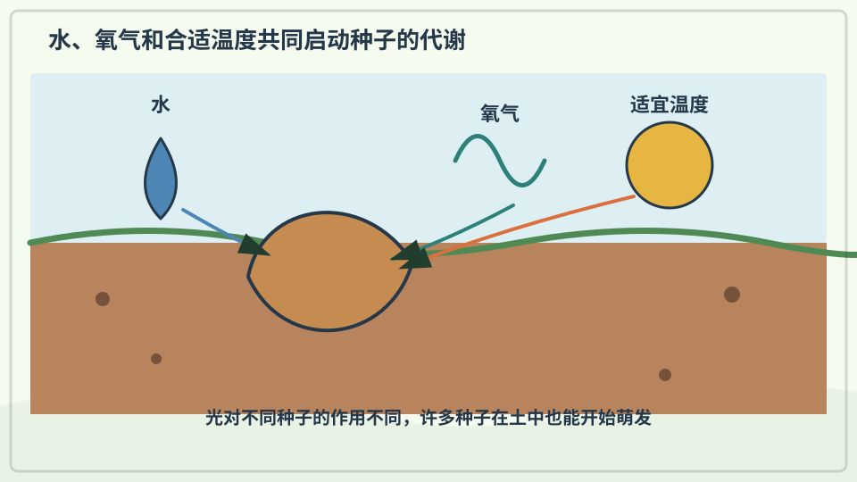

种子通常需要水、空气和合适的温度。吸到水后，种子里的生长活动会重新开始。不同植物喜欢的条件不完全一样，有些种子还需要光或寒冷。

**再想一步：** 吸水会让种皮和内部组织膨胀，并启动酶的工作；酶是帮助化学反应进行的分子工具。种子也要呼吸，所以完全泡在缺氧水中未必能健康发芽。

**把知识连起来：** 水进入种子后会让组织膨胀，并使许多酶重新开始工作；氧气支持细胞呼吸，温度则影响反应速度。只有这些条件落在合适范围，胚才有足够能量突破种皮。所谓“醒来”，其实是一组受环境条件控制的代谢过程。

**再往外看：** 有些种子还要先经历寒冷、火烧后的化学信号、种皮磨损或特定光照才解除休眠。这些机制能减少种子在错误季节贸然萌发的机会。

**容易弄混：** 种子并不会像动物一样听见春天，也不是有水就一定发芽。种子是否仍有活力、氧气是否足够以及温度是否合适都很重要，水太多还可能让它缺氧或腐烂。

*图解：种子得到适量水、氧气和合适温度后，代谢启动并开始发芽。*

**一起试试：** 把豆子放在湿纸巾上，由大人保持湿润，每天看一眼。

---

### 第 062 问｜发芽时为什么先长根？

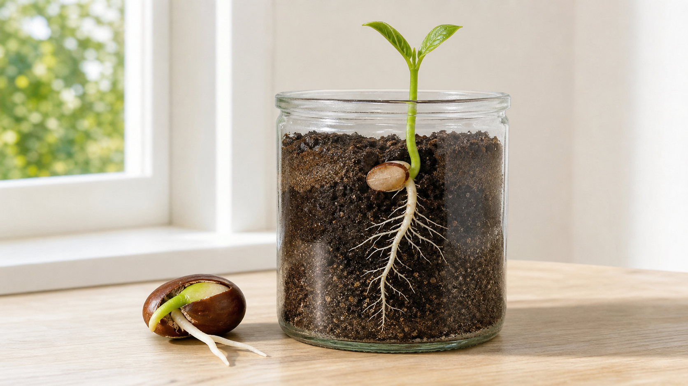

*写实观察图：种皮裂开后先出现主根，细侧根随后分出，芽朝上生长；实际速度会受种类、温度和水分影响。*

许多种子发芽时，最先伸出的部分会成为根。根把幼苗固定住，还能吸收水和矿物质。接着，小芽再向有光的方向长。

**再想一步：** 小根通常表现向重力性，会顺着重力方向生长；幼茎则常向上并向光。植物没有眼睛，却能用细胞里的感受系统判断重力和光的方向。

**把知识连起来：** 胚根先伸入土中，既能把轻小幼苗固定住，也尽早取得水和溶解的矿物质。根尖附近的细胞感受重力方向，幼茎则常对光和重力作出不同反应，于是地下与地上的生长逐渐分开。这个顺序提高了幼苗展开叶片前的供水稳定性。

**再往外看：** 在失重实验、倒置培养或方向不断变化的装置中，科学家可以分开研究重力与光对幼苗的影响。植物激素在组织两侧分布不同，是生长弯曲的重要部分。

**容易弄混：** “先长根”是许多常见种子的典型顺序，不表示每一种植物外观都完全一样。图中的根也不是被地球直接拖着掉下去，而是细胞根据重力信号产生方向不同的生长。

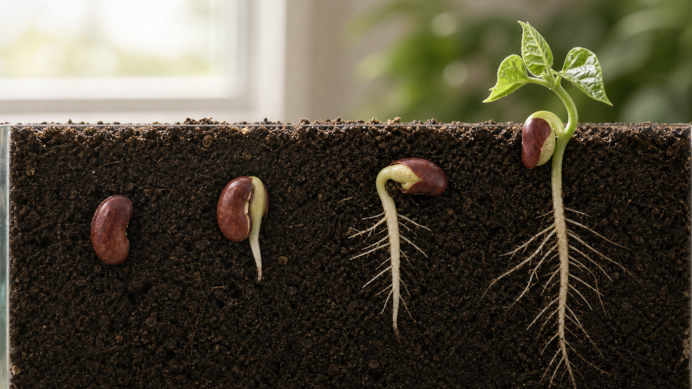

*写实原理图：同种种子从吸水、胚根伸出到幼芽展开的连续阶段；多个个体代表时间顺序，不是一粒种子同时出现多种状态。*

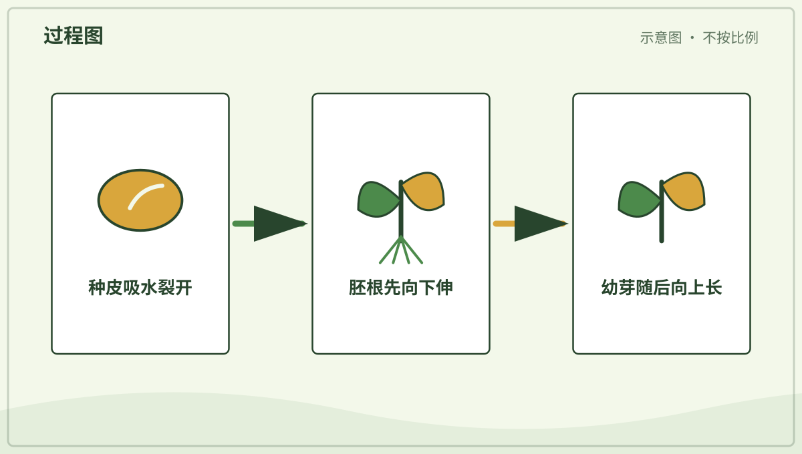

*图解：胚根先伸出，帮助固定幼苗并吸收水；随后幼芽向光处生长。*

**一起看看：** 观察发芽豆子的白色小根朝哪边弯。

## 追问链 08.2｜根茎叶的分工与交换

根吸收，茎支撑和运输，叶接光并完成光合作用和气体交换。

### 第 063 问｜植物的根在忙什么？

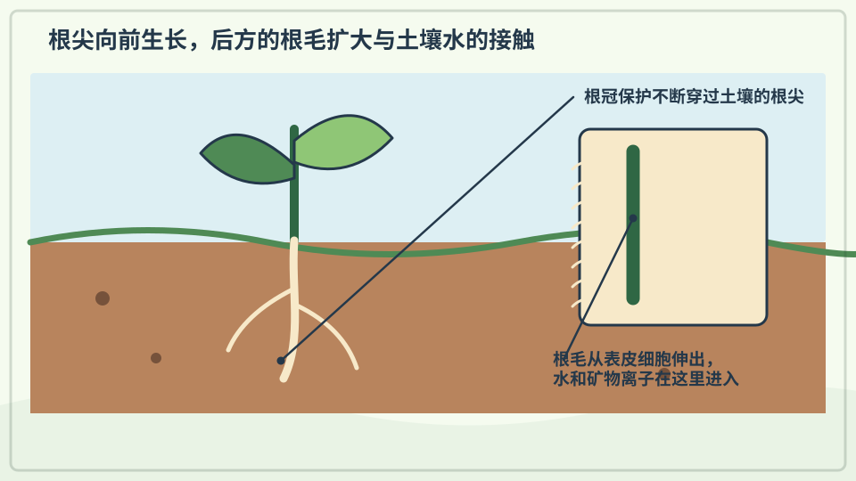

根像许多细细的地下通道。它固定植物，也从土壤里吸收水和溶在水中的矿物质。有些根还会储存食物，比如胡萝卜的粗根。

**再想一步：** 根尖附近的根毛把接触土壤的面积增大，水可通过细胞膜进入。根还会和真菌、细菌相互作用，地下并不是只有植物自己工作。

**把知识连起来：** 年轻根部的根毛把接触土壤水膜的面积大大增加，水和离子进入后会被送入运输组织。木质部把水和矿物质带向茎叶，根还会储藏物质，并与真菌和微生物交换资源。根系因此同时属于植物的吸收系统、支撑系统和地下生态网络。

**再往外看：** 不同环境形成浅而广、深而直或会储水的根系。研究根通常比研究叶难，因为挖出根会破坏原来的空间关系，透明根箱和成像技术因此很有用。

**容易弄混：** 植物得到的“肥料”不是食物本身，矿物质也不能代替光合作用制造的糖。根吸收水和无机离子，植物有机物中的大部分碳则来自空气里的二氧化碳。

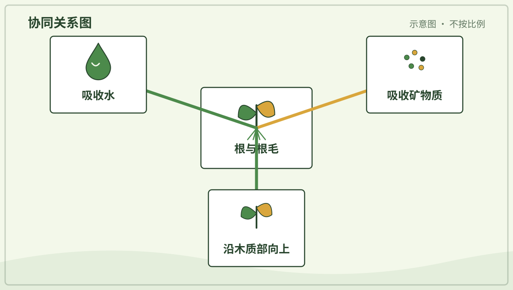

*图解：根毛扩大吸收面积，水和矿物质进入根后由木质部向上运输。*

**一起看看：** 观察一棵连根拔起的杂草，只看不品尝。

---

### 第 064 问｜茎为什么要站起来？

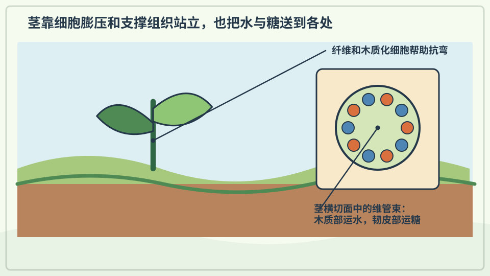

茎支撑叶子和花，让它们接近阳光和传粉动物。茎里面还有运输水、矿物质和糖的细小通道。柔软的草茎和坚硬的树干都是茎。

**再想一步：** 木质部主要把水和矿物质向上输送，韧皮部把叶子制造的糖送往生长或储藏处。两套组织共同连接根、叶、花和果实。

**把知识连起来：** 茎里的木质部和韧皮部像方向和货物不同的运输网络：前者主要把水和矿物质向上送，后者把叶制造的糖等有机物送往生长或储藏部位。茎的细胞壁、纤维和木材还抵抗弯曲，让叶片能占据有光的位置。运输与支撑共同决定一株植物能长多高。

**再往外看：** 草本茎依靠含水细胞和纤维保持挺立，木本茎则不断增加木质组织。藤本植物减少自立材料，借助别的物体到达高处，是另一种资源分配办法。

**容易弄混：** 茎不是一根只把水吸上去的空吸管。它由活组织和运输组织组成，水上升还涉及蒸腾、分子间作用和根部条件等多种过程。

**一起看看：** 找一根草茎和一段树枝，比比软硬和粗细。

---

### 第 065 问｜叶子为什么又薄又平？

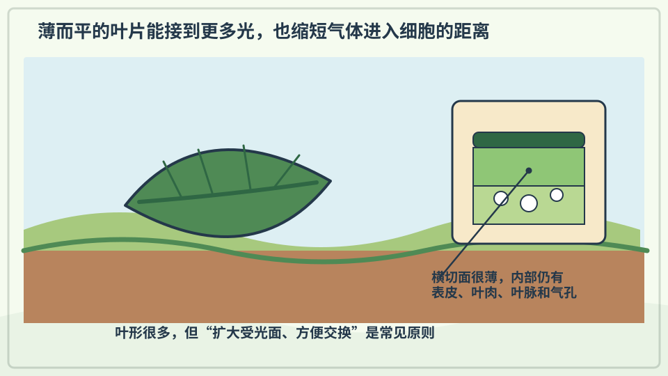

薄而平的叶子能接住较多阳光，也方便空气里的气体进出。叶脉把水送进来，再把叶子制造的糖运走。不同环境会长出不同形状的叶子。

**再想一步：** 叶片表面的气孔能开合，控制二氧化碳进入和水汽离开。叶子要在获得气体与少丢水之间取得平衡，所以干旱植物的叶形常很特别。

**把知识连起来：** 薄而宽的叶片能铺开较大受光面积，也让二氧化碳从气孔到达光合细胞的距离较短。叶脉把水送入叶片、把糖运出，同时像支架一样限制撕裂和下垂。叶形是在采光、散热、失水和抗风之间作出的综合折中。

**再往外看：** 针叶、漂浮叶和多肉叶看起来与普通阔叶不同，因为它们面对的水分、温度和机械压力不同。测量叶厚、气孔位置和叶脉密度能把外形与功能连接起来。

**容易弄混：** 叶子越大不一定越好，也不是越薄越会光合作用。过大的叶可能更易失水或受风损伤，阴湿和干旱环境会选择不同的结构组合。

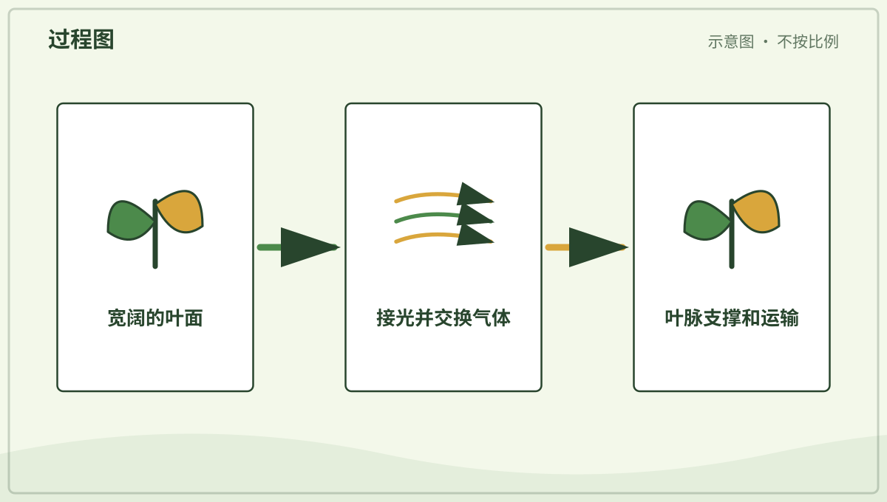

*图解：叶片薄而平，能接收较多光并缩短二氧化碳进出细胞的距离。*

**一起看看：** 把两片落叶放在一起，比比叶脉像不像小路。

---

### 第 066 问｜大多数叶子为什么是绿色？

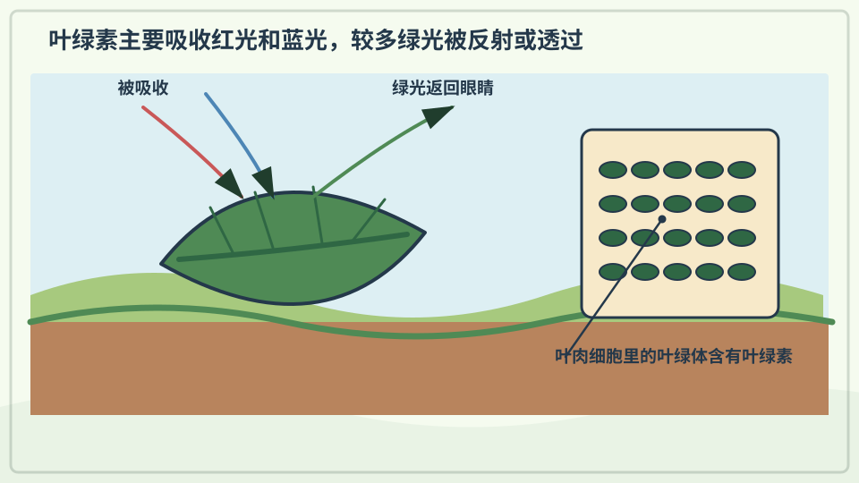

叶子里常有一种叫叶绿素的物质。它吸收红光和蓝光较多，绿色的光更多被反射到眼睛里，所以叶子看起来绿色。也有红色、紫色或带花纹的叶子。

**再想一步：** 叶绿素位于细胞的叶绿体中，负责捕捉光能。其他色素也一直存在；秋天叶绿素减少时，黄色和橙色等颜色便更容易显现。

**把知识连起来：** 叶绿体中的叶绿素吸收光能时，对红光和蓝光吸收较强，较多绿光被反射或透过，所以眼睛看到绿色。被吸收的能量参与光合作用，但叶中还有类胡萝卜素等其他色素。秋季叶绿素减少后，原先被遮住的黄橙色便可能更明显。

**再往外看：** 红藻、褐藻和紫叶植物含有不同色素组合，仍能利用光。研究吸收光谱可以判断哪段光最容易被某种色素利用。

**容易弄混：** 绿色并不表示植物只用绿光，也不表示所有植物都必须是绿色。颜色是入眼光的结果，光合作用效率则取决于被吸收的光和整套细胞过程。

*图解：叶绿素吸收较多红光和蓝光，更多绿光被反射进眼睛，叶子便显绿色。*

**一起看看：** 找三种深浅不同的绿叶，不采也能观察。

---

### 第 067 问｜植物也要“吃饭”吗？

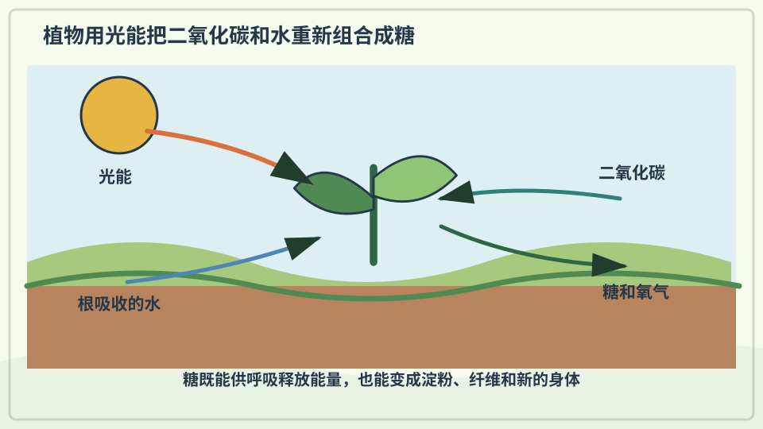

绿色植物用阳光的能量，把水和空气里的二氧化碳做成糖。这个过程叫光合作用。糖给植物提供生长用的材料和能量。

**再想一步：** 光合作用还会释放氧气，其中的氧主要来自被分解的水。植物不会把阳光直接“吃进肚子”，而是把光能转存进糖分子的化学能中。

**把知识连起来：** 植物从空气取得二氧化碳，从土壤取得水，再利用光能在叶绿体中合成糖。糖既能为细胞呼吸提供能量，也能成为纤维素、淀粉和许多其他物质的原料。植物增加的干物质因此主要不是把泥土直接变成身体。

**再往外看：** 光合作用也发生在藻类和一些微生物中，它改变了地球大气并支撑大量食物网。科学家会测量气体交换和叶绿素荧光来研究它的速度与限制。

**容易弄混：** 说植物“吃阳光”只是方便的比喻。光提供能量而不是物质，植物还需要二氧化碳、水和多种矿物质；有光也不代表任何条件下都能无限生长。

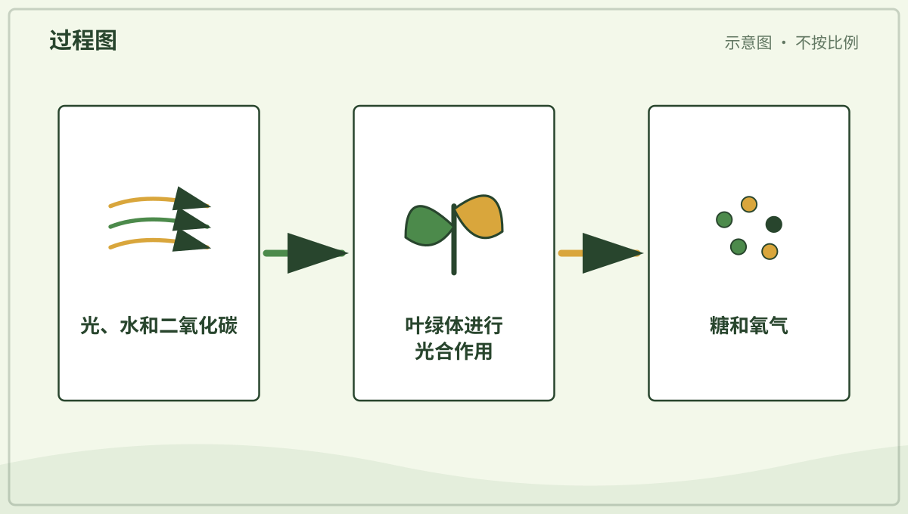

*图解：叶绿体利用光能，把水和二氧化碳转成糖，并释放氧气。*

**一起说说：** 植物做“饭”要用到阳光、水和哪一种空气里的气体？

---

### 第 068 问｜植物会呼吸吗？

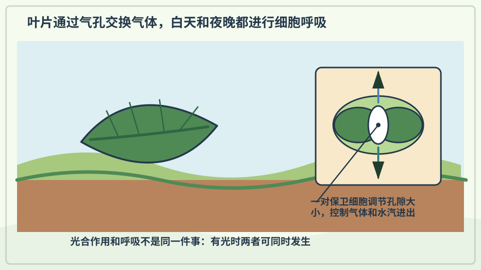

会。植物的细胞白天黑夜都会呼吸，用氧气帮助释放食物里的能量。绿色部分在有光时还会进行光合作用，通常放出氧气。两个过程不是同一件事。

**再想一步：** 呼吸作用发生在植物、动物和许多微生物的细胞中，用糖和氧释放可利用的能量。白天绿色植物的光合作用常强于呼吸，所以整体上吸收二氧化碳、释放氧气。

**把知识连起来：** 光合作用把光能储存在有机物中，细胞呼吸再把有机物逐步分解，释放细胞能使用的能量。植物的根、茎、叶、花和种子昼夜都需要呼吸；白天叶片同时进行光合作用，整体气体交换可能被光合作用盖过。两套过程共同维持生长和修复。

**再往外看：** 温度、含水量和组织年龄都会影响呼吸速率。发芽种子没有展开绿色叶片，却能利用储藏物强烈呼吸，因此可以用温度或气体变化检测。

**容易弄混：** 植物呼吸不等于叶片像肺一样一吸一呼，也不能说夜里植物突然变成有害生物。气体主要通过扩散进出组织，普通室内植物夜间消耗的氧气通常远不足以造成危险。

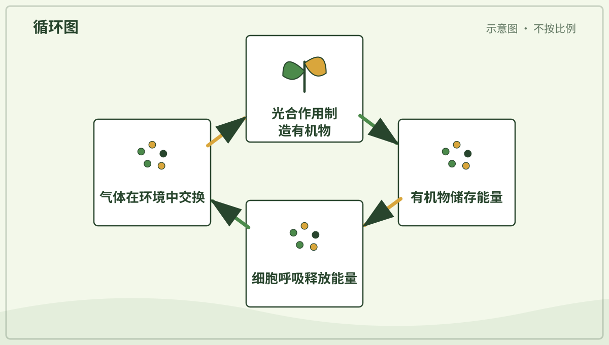

*图解：光合作用储存能量，细胞呼吸再用氧气分解有机物释放可用能量。*

**一起看看：** 找找叶片背面，那里常有许多眼睛看不见的小气孔。

## 单元综合观察｜连续观察一粒种子

请大人选择安全的大种子，在透明容器边缘保持湿润但不积水。每次记录根的方向、芽的方向、叶片展开和种子变化；发霉后停止并由大人处理。
