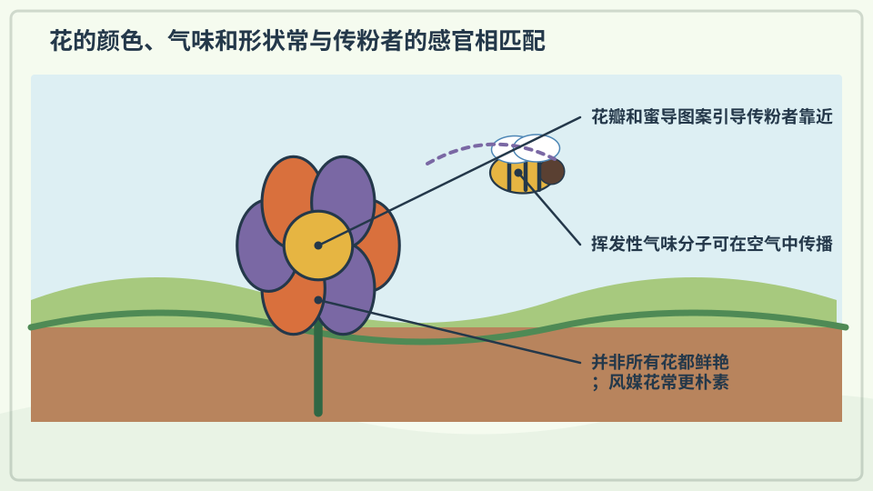
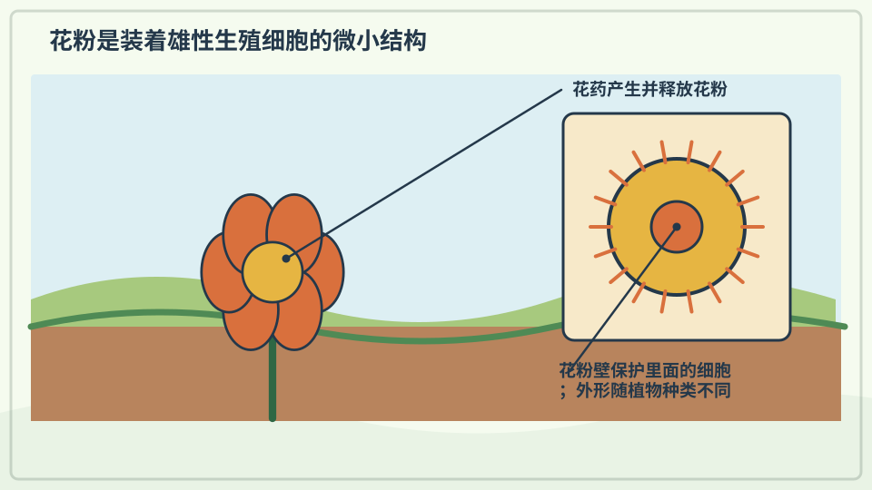
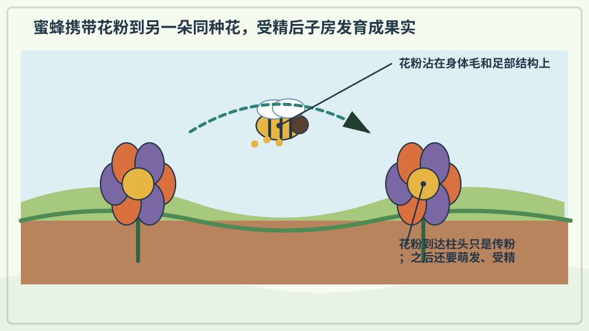
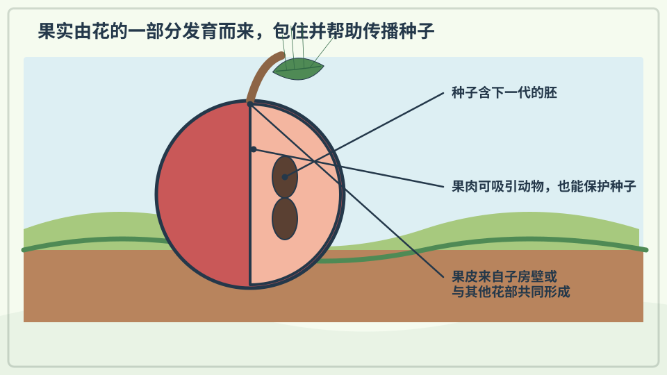
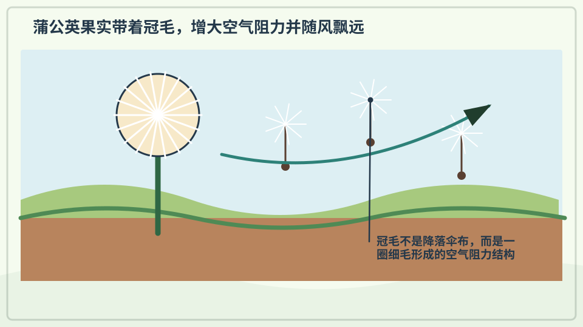
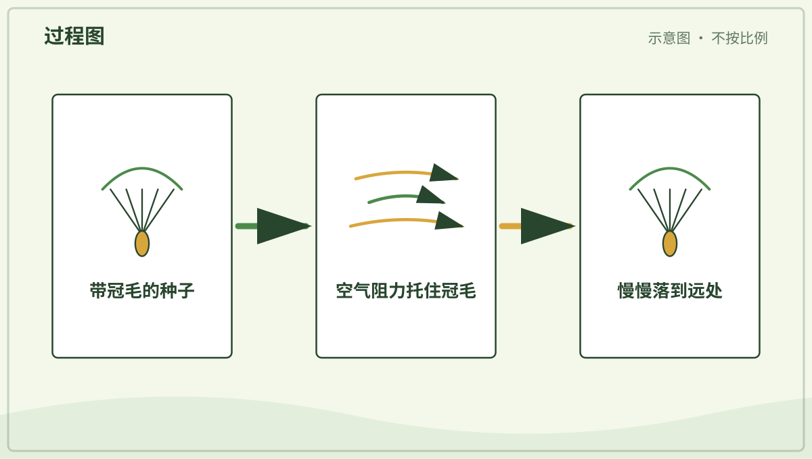
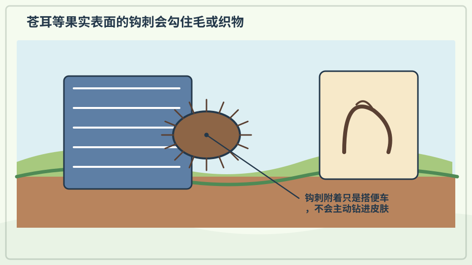
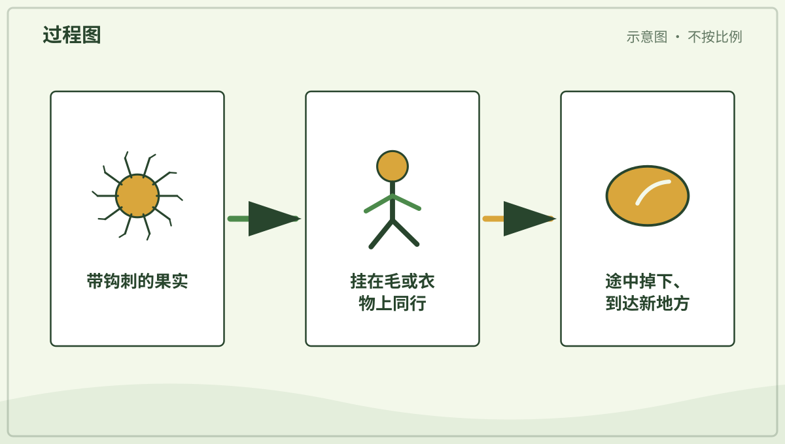
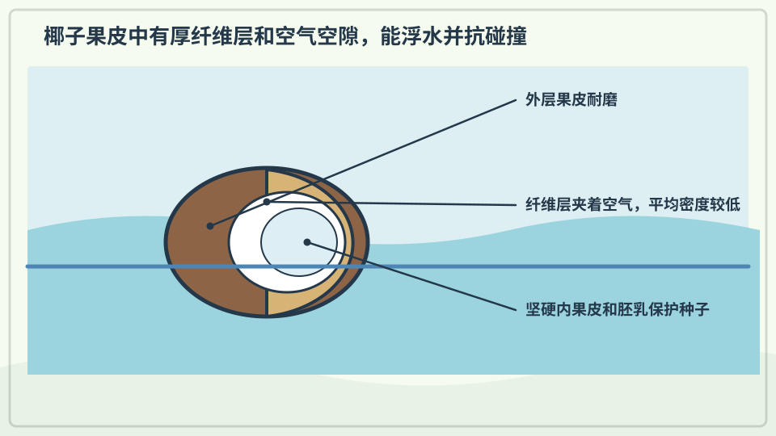

# 兴趣单元 09｜花、果实与种子的旅行

> **探索领域 03：** 植物与花园生命
>
> **核心问题：** 植物怎样把花粉送到合适位置、形成果实，并把种子带往新地方？

颜色和气味与传粉动物相连，果实保护种子，风、动物和水则提供不同的传播机会。

## 怎样沿着本单元的追问链阅读

不要把花写成有意招呼昆虫；比较结构如何增加传粉或传播成功的机会。

## 追问链 09.1｜花粉、传粉与果实

花的结构参与繁殖，花粉到达合适位置后，胚珠可发育为种子，子房常发育成果实。

### 第 069 问｜花为什么有颜色和香味？

许多花的颜色、气味和形状能吸引昆虫、鸟或其他传粉动物。它们来取花蜜或花粉，也可能把花粉带到另一朵花。并不是所有花都香，也有花靠风传粉。

**再想一步：** 花是被子植物的繁殖器官，花瓣只是其中一部分。不同传粉者能看见、闻到或够到的东西不同，长期演化让许多花形成了不同的信号和结构。

**把知识连起来：** 花瓣颜色来自色素和表面结构，气味来自容易挥发的小分子；它们和花形、花蜜、开放时间一起影响哪些动物会靠近。传粉者把花粉带到同种植物合适的花部时，植物更可能完成受精。花的信号与动物感官是在长期相互作用中形成的。

**再往外看：** 有些花主要依靠风或水传粉，未必鲜艳或芳香；有些花还能反射人看不见的紫外线图案。用不同感官看花，会得到与人眼不同的地图。

**容易弄混：** 花不是为了让人欣赏才有颜色和香味，也不是每种香味都在邀请蜜蜂。信号的作用要结合具体传粉者、花结构和开放时间判断。

**一起闻闻：** 只闻大人确认安全的花，不把花放进嘴里。

---

### 第 070 问｜花粉是什么？

花粉是种子植物繁殖时需要的细小颗粒。它常从花的一部分来到同种植物合适的另一部分，帮助种子形成。花粉很小，有的人接触后会打喷嚏。

**再想一步：** 花粉粒是微小的雄性配子体，会形成或带着精细胞；落到合适的柱头后，可长出花粉管，把精细胞送向胚珠。传粉只是移动花粉，受精是随后发生的另一个步骤。

**把知识连起来：** 花粉粒由植物的雄性生殖结构产生，外壁常有能帮助保护和辨认的纹理。它到达合适柱头后可萌发花粉管，把精细胞送向胚珠。传粉只是搬运花粉，受精还要在之后完成，因此两者不是同一个步骤。

**再往外看：** 花粉化石能在沉积物中保存很久，科学家借它们推测过去有哪些植物和气候。现代过敏研究则关注飘散花粉如何与免疫系统相互作用。

**容易弄混：** 花粉不是花的种子，也不是所有黄色粉末。种子通常在受精后由胚珠发育而来；肉眼看到的粉末还可能混有尘土或其他颗粒。

**一起看看：** 只观察花心的粉末，不用手抹，也不靠得太近。

---

### 第 071 问｜蜜蜂怎样帮花结果？

蜜蜂访问花朵收集花蜜和花粉。花粉会粘在它毛茸茸的身体上，再被带到别的花。这样能帮助许多植物形成种子和果实。

**再想一步：** 花与蜜蜂之间常是互利关系：蜜蜂得到食物，植物提高传粉机会。但传粉者不只有蜜蜂，蝴蝶、蛾、甲虫、鸟、蝙蝠和风也能参与。

**把知识连起来：** 蜜蜂取食花蜜或收集花粉时，身体绒毛会沾上花粉粒；它访问下一朵同种花，部分花粉便可能落到柱头。植物提供食物，蜜蜂获得资源，传粉是这次接触可能带来的结果。花、昆虫和季节条件共同决定效率。

**再往外看：** 不同蜜蜂、蝴蝶、蛾、鸟和蝙蝠会服务不同植物，农业还会安排蜂群或保护野生传粉者。研究者用花粉标记和访花记录构建传粉网络。

**容易弄混：** 蜜蜂不是故意替花结果，也不是唯一传粉者。它主要是在为自己和蜂群取食，花粉转移是身体结构与行为产生的生态后果。

*图解：蜜蜂身上沾到花粉，再把花粉带到另一朵同种花的柱头。*

**一起看看：** 从远处看蜜蜂停在哪朵花上，不追赶也不触碰。

---

### 第 072 问｜果实为什么包着种子？

花完成传粉和受精后，一些部分会慢慢长成果实。果实能保护种子，也常帮助种子旅行。苹果、番茄和豆荚都是不同样子的果实。

**再想一步：** 在植物学里，果实通常由花的子房发育而来，所以番茄、黄瓜和辣椒也属于果实。日常烹饪里的“水果”和“蔬菜”是另一套分类方法。

**把知识连起来：** 受精后，胚珠通常发育成种子，包围胚珠的子房常发育成果实。果皮能在种子成熟前提供保护，成熟后的颜色、气味、甜味或开裂方式又可能帮助传播。果实因此连接了繁殖的保护阶段和扩散阶段。

**再往外看：** 番茄、豆荚、橡果和苹果在植物学上都属于不同类型的果实，食用时称作“蔬菜”并不改变它们的发育来源。研究果实要看由哪部分花发育，而不只看甜不甜。

**容易弄混：** 并非所有果实都柔软多汁，也不是所有包着种子的东西都由同一种组织形成。日常食物分类和植物学分类解决的问题不同。

**一起看看：** 请大人切开一种水果，数数能看见几颗种子。

## 追问链 09.2｜风、动物与水搬运种子

轻盈冠毛、钩刺和防水外层分别适合不同传播方式。

### 第 073 问｜蒲公英为什么有小降落伞？

蒲公英种子上有一圈细毛，能增加空气的托力和阻力。风一吹，它们就能慢慢飘到别处。落在合适地方的种子可能长成新植物。

**再想一步：** 细毛形成的冠毛会制造一圈稳定空气旋涡，让种子下降得更慢。停留在空气中的时间越长，风就越有机会把它带远。

**把知识连起来：** 蒲公英种子样结构上方的冠毛增加与空气接触的面积，减慢下降并让微小气流带它移动。风速、释放高度、湿度和冠毛开合都会影响落点。轻并不等于一直飞，最终它仍会在重力作用下落下。

**再往外看：** 工程师研究种子飞行来设计小型传感器和无动力降落结构。不同植物还使用翅、旋转或滚动等办法借风传播。

**容易弄混：** 白色小伞不是一把缩小的降落伞，也不是完整种子本身。它是与果实相连的冠毛结构，功能相似的比喻不能替代真实名称。

*图解：蒲公英冠毛增大空气阻力，让种子下落较慢并被风带远。*

**一起看看：** 看一颗种子怎样随风走，不把它吹进别人家或保护区。

---

### 第 074 问｜有些种子为什么会粘裤脚？

有些果实或种子长着小钩、刺或黏的表面。它们搭在动物毛或人的衣服上，走一段路后再掉下来。这样，植物不用长脚也能搬家。

**再想一步：** 这种借动物外表传播叫附着传播。钩刺只需牢固到能搭一程，又能在摩擦中掉落；类似结构也启发人类发明了粘扣带。

**把知识连起来：** 有些果实或种子外面长着钩、刺或容易黏附的表面，经过动物毛发或衣物时会暂时搭上去。动物移动后，它们在别处脱落，增加离开母株的距离。传播成功还取决于落点是否适合萌发。

**再往外看：** 尼龙搭扣的发明曾受带钩植物果实启发，是仿生设计的经典例子。显微观察能看见钩与纤维怎样互相扣住。

**容易弄混：** 黏裤脚不是植物主动跳上来，也不表示所有带刺种子都有毒。它是形状与接触产生的机械附着，安全性仍要按具体植物判断。

*图解：果实上的钩刺先挂住毛或布料，同行一段后又在摩擦和碰撞中掉落。*

**一起看看：** 由大人取下粘在衣服上的种子，用放大镜找小钩。

---

### 第 075 问｜椰子为什么能漂在海上？

椰子的外层有许多纤维，还能包住空气，帮助它浮水。厚厚的外壳保护里面的种子。有些椰子能随海水漂到新的海岸。

**再想一步：** 平均密度小于水的物体会得到足够浮力而漂浮。纤维层既降低整体密度，也能缓冲碰撞和减慢盐水进入种子。

**把知识连起来：** 椰子果实有较防水的外层和富含纤维、留有空气的中层，整体平均密度可以低于水。海流能搬运它一段距离，坚韧外壳在途中保护种子。漂到岸上只是第一步，温度、淡水和基质还要适合才可能萌发。

**再往外看：** 海漂传播也见于其他沿海植物，科学家可结合洋流模型和遗传差异研究岛屿植物从哪里来。

**容易弄混：** 椰子不是完全空心的球，也不会永远漂浮不坏。内部有胚乳和胚，外层会随时间受损；能漂只是传播概率增加，不是保证抵达新岛。

**一起看看：** 从图片上找椰子的纤维外衣和硬壳。

## 单元综合观察｜按传播办法给种子分类

用照片或已经掉落的安全种子比较会飘、会粘和能漂浮的结构。不要品尝、不采摘未知植物，也不要把细小种子放入口鼻。
