# 九月：蓝色海洋里有什么

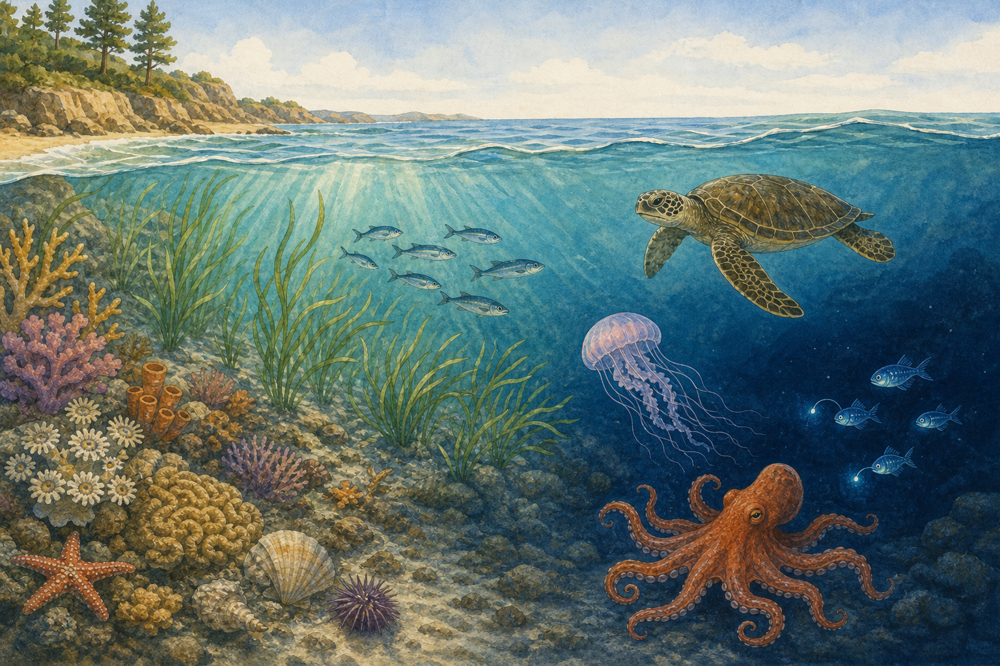

## 第 244 天｜海水为什么是咸的？

雨水和河水会从岩石中带走少量溶解的矿物离子，送进海洋。海底火山和热液活动也会加入物质。水不断蒸发，许多盐却留在海里，所以海水很咸。

**再想一步：** 海盐不只是食盐，还含镁、钙、钾等离子。河流也有盐，只是浓度低；海洋中的输入和沉淀、生物利用等移出过程长期接近平衡。

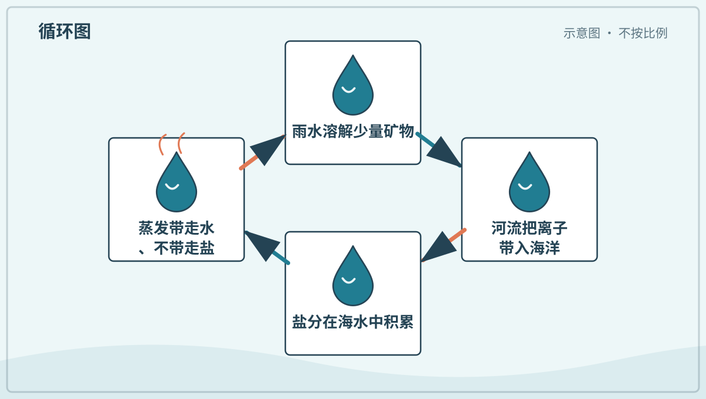

*图解：水和岩石作用带走溶解物，经河流进入海洋；水蒸发后盐分大多留下。*

**一起记住：** 海水不能当饮用水，也不靠品尝来判断水质。

---

## 第 245 天｜海浪是不是整团水跑到岸上？

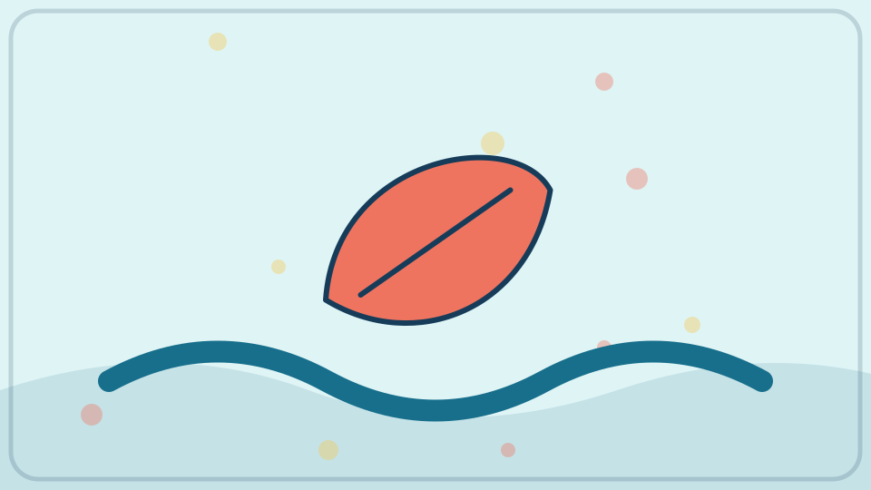

风把能量传给海面，形成波浪。波向前走时，深水里的水粒子多在小圈中来回运动，并没有随每个浪一直跑很远。靠近岸边，海底让波变陡并破碎。

**再想一步：** 波主要传递能量而非整团物质，但海流、碎浪和沿岸流确实会搬运水与泥沙。浪高受风速、吹风时间和风吹过的海面距离影响。

*图解：风把能量交给海面；水粒子多在原地附近绕动，而波形和能量向前传播。*

**一起看看：** 只在安全岸上看漂浮物随小波上下，水边必须由大人陪同。

---

## 第 246 天｜海水为什么一天会涨落？

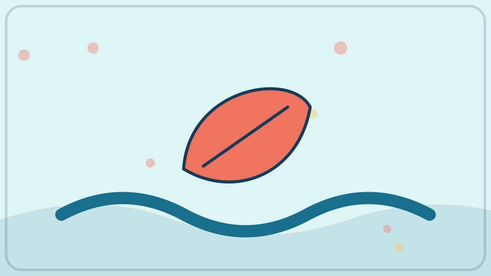

月球和太阳的引力会拉动地球海洋，形成很长的潮汐波。地球自转时，各地海岸轮流经历较高和较低水位。海岸形状让不同地方的时间和高度很不一样。

**再想一步：** 月球对地球近侧和远侧的引力差是潮汐关键，而不是简单只把一边海水拉起。太阳、月球与地球排成一线时，潮差常较大。

*图解：月球引力是潮汐主因，太阳也会参与；地球自转让海岸经过潮汐隆起。*

**一起看看：** 在同一安全海岸比较涨潮和落潮照片，不自行走入潮间带。

---

## 第 247 天｜海洋里也有看不见的“大河”吗？

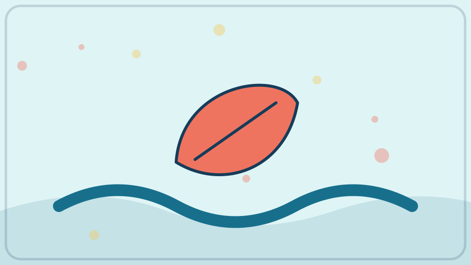

海水会沿较稳定方向流动，形成洋流。表层洋流主要受风和地球自转影响，深层环流还与温度、盐度造成的密度差有关。洋流搬运热量、养分和生物。

**再想一步：** 地球自转让大范围流动发生偏转，这叫科里奥利效应。海盆形状和海底地形会引导水流，所以洋流不是一条边界整齐的水管。

*图解：风推动表层海水，温度和盐度造成密度差，又驱动深层海水缓慢循环。*

**一起看看：** 在世界地图上沿一条暖流从低纬画向较高纬。

---

## 第 248 天｜海洋到底有多深？

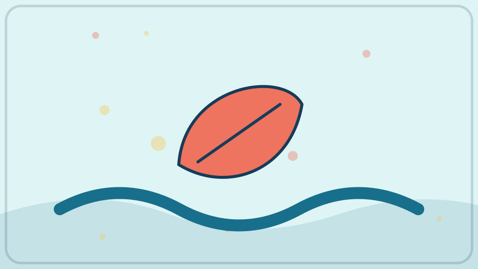

海洋平均深度约几千米，最深海沟超过一万米。海底有平原、山脉、火山和峡谷，不是一只平底大碗。人类用声呐和潜水设备测量、探索。

**再想一步：** 声呐发出声波，测量回声往返时间，再用水中声速估算深度。温度、盐度和压力会改变声速，因此精确地图还需要校正与多次测量。

**一起看看：** 把最高山和最深海沟画在同一高度尺上比较。

---

## 第 249 天｜深海的水为什么压力很大？

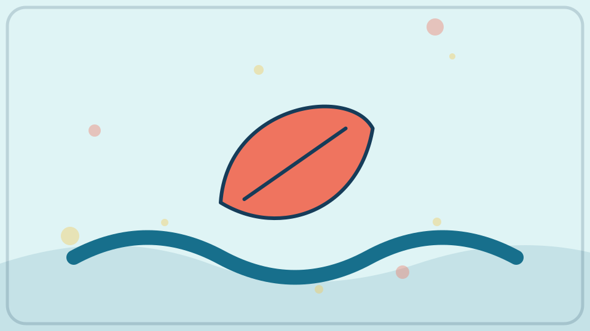

越往深处，上方压着的海水越多，压力越大。每一小块表面都受到周围水的推力。深海设备要用坚固外壳或让内外压力平衡。

**再想一步：** 静水压力大致随深度线性增加，约每下潜十米增加一个大气压。压力来自各方向，不只是从头顶向下，所以薄而空的容器容易被压坏。

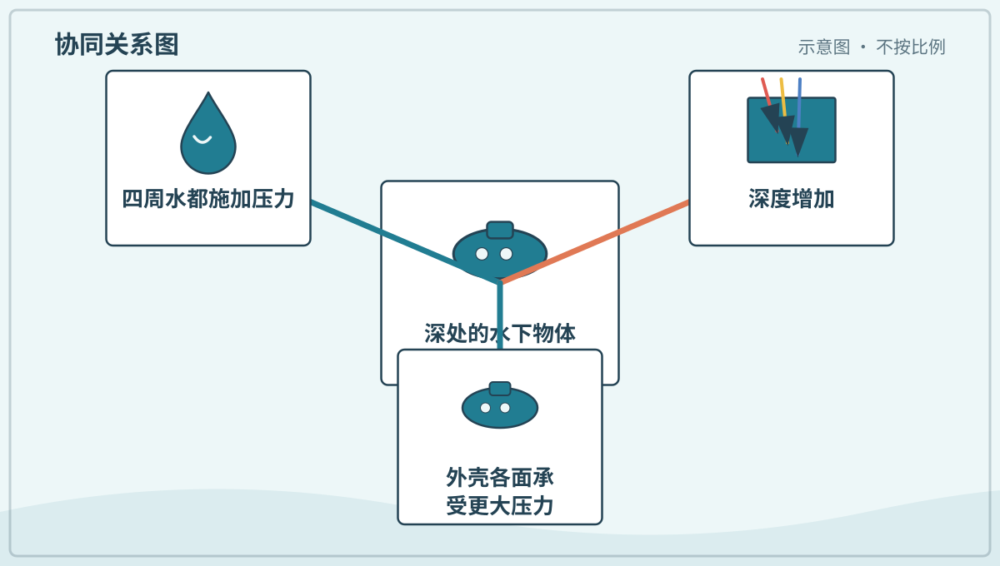

*图解：越深处上方水柱越高、重量越大，因此各方向的水压都更高。*

**一起试试：** 用手轻压装水的密封软袋，感受液体把压力传向各处。

---

## 第 250 天｜海里越深为什么越黑？

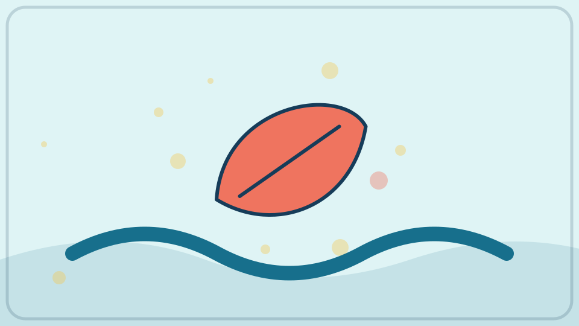

阳光进入海水后会被水分子、颗粒和生物吸收或散射。红光较快减少，蓝光能走得更深，所以海中常偏蓝。到深海后，太阳光几乎到不了。

**再想一步：** 能进行充足光合作用的上层叫透光带，再下方是微光和无光区域。水越浑浊，光衰减越快；深海动物常依靠触觉、化学感觉或自发光。

*图解：海水会逐步吸收和散射阳光；不同颜色穿透不同，足够深处几乎全黑。*

**一起看看：** 比较清水和加一点安全泥土的水杯，哪杯更容易透光。

---

## 第 251 天｜珊瑚是石头还是植物？

珊瑚是动物。许多小珊瑚虫共同生活，分泌碳酸钙骨骼，长期堆成珊瑚礁。它们用触手捕食，也常与体内微小藻类合作。

**再想一步：** 共生藻用光合作用制造糖，给珊瑚许多能量；珊瑚则提供住处和物质。礁体看似岩石，表面却覆盖活的组织和复杂生态系统。

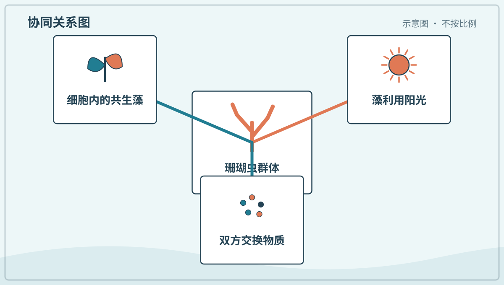

*图解：珊瑚虫给共生藻提供栖身处和原料，共生藻用光合作用提供部分养分。*

**一起看看：** 在放大照片中找一只只小珊瑚虫，不触摸活珊瑚。

---

## 第 252 天｜珊瑚为什么会变白？

海水过热、污染或其他压力会破坏珊瑚与共生藻的关系。珊瑚失去藻类后，透明组织下的白色骨骼显出来，这叫白化。白化珊瑚仍可能活着，却更缺能量。

**再想一步：** 若条件很快恢复，一些珊瑚能重新获得共生藻；压力持续则可能死亡。不同珊瑚耐受不同，海洋升温让大范围白化更频繁。

**一起看看：** 比较健康、白化和死亡珊瑚照片，找出颜色与表面差别。

---

## 第 253 天｜浮游生物都会漂着走吗？

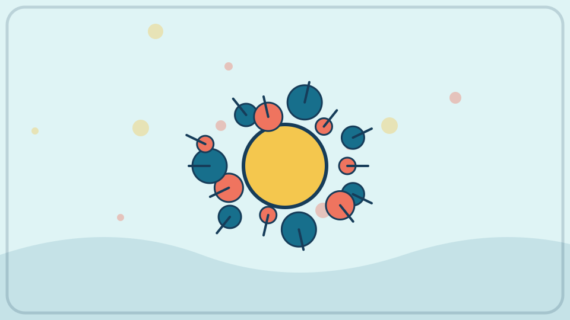

浮游生物是不能逆着水流长距离游动、主要随水移动的生物。它们包括微小藻类、细菌、动物和许多动物的幼体。水母也可属于大型浮游动物。

**再想一步：** “浮游”描述生活方式，不是一个亲缘相同的家族。许多浮游生物能上下移动或短距离游泳，只是整体位置仍强烈受洋流控制。

**一起看看：** 在显微照片中找不同形状，猜哪些像植物、哪些像动物。

---

## 第 254 天｜海里的小藻类为什么重要？

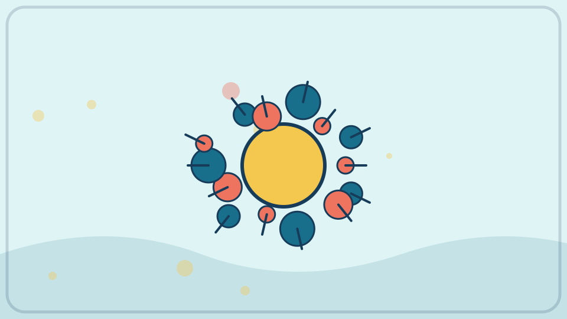

浮游植物用阳光、二氧化碳和水进行光合作用，是许多海洋食物网的起点。它们也产生地球氧气的重要一部分，并吸收碳。单个很小，合起来影响全球。

**再想一步：** 浮游植物包括多种藻类和蓝细菌，不是真正的陆地植物。它们生长受光、温度和氮、磷、铁等养分限制，过度繁殖也可能造成有害藻华。

**一起看看：** 在食物网图上从浮游植物连到小动物，再连到大鱼。

---

## 第 255 天｜水母没有骨头怎样游泳？

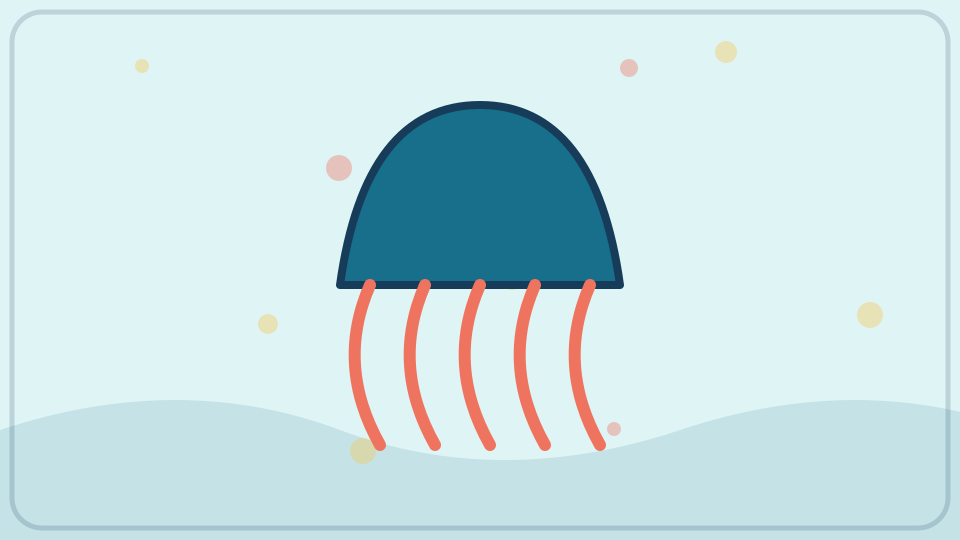

水母伞状身体收缩时，把水向后推出，身体便向前移动。放松时，弹性组织让伞重新张开并吸入水。许多水母仍会随洋流漂动。

**再想一步：** 水母身体大部分是水，靠胶状中胶层保持形状。它们没有集中成脑的大脑，却有神经网协调收缩、感光和平衡。

*图解：水母伞部收缩把水推向后方，水的反作用力使身体向前移动。*

**一起记住：** 海滩上的水母也可能蜇人，只看不碰并告诉大人。

---

## 第 256 天｜海星真的是鱼吗？

海星不是鱼，而是棘皮动物。它没有鱼鳃和鱼鳍，身体下面有许多管足，靠水管系统伸缩。管足能移动、抓住表面和处理食物。

**再想一步：** 海星把海水引入内部管道，用液压改变管足形状。许多海星有五条腕，但也有更多；失去腕后的再生能力因种类和损伤位置不同。

**一起看看：** 在海星腹面照片中找中央口和一排排管足。

---

## 第 257 天｜海参为什么像一根软香肠？

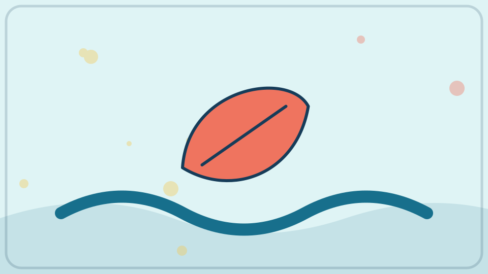

海参也是棘皮动物，身体沿一个方向拉长，骨片很小并分散在体壁中，所以身体柔软。许多海参吞食海底沉积物，消化其中有机物，再排出处理后的沙泥。

**再想一步：** 海参用体壁肌肉和水管系统改变形状，有些遇险会排出黏丝或部分内脏，再慢慢再生。防御很耗能，不应故意刺激它们。

**一起看看：** 只在照片或水族馆规定距离观察，不用手戳。

---

## 第 258 天｜螃蟹为什么常横着走？

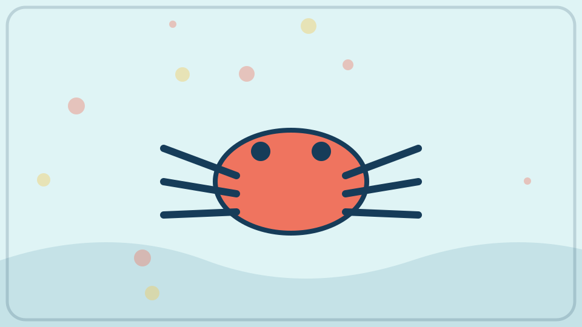

多数螃蟹的腿关节更适合向身体两侧弯曲，横走时步幅大、动作快。扁宽的身体也让侧向移动方便。它们并非完全不能向前或斜着走。

**再想一步：** 运动方向由关节结构、肌肉排列和身体重心共同决定。不同螃蟹生活在沙地、岩缝或水中，腿形和最擅长的走法也不同。

**一起看看：** 在录像里画出螃蟹身体朝向和移动方向的两支箭头。

---

## 第 259 天｜寄居蟹的壳是自己长的吗？

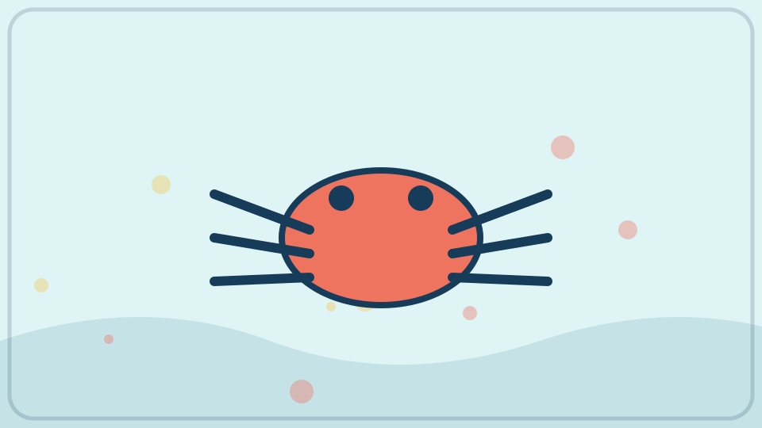

寄居蟹腹部柔软，常住进空的螺壳保护自己。身体长大后，它会寻找更合适的空壳搬家。有些寄居蟹还会排队交换大小不同的壳。

**再想一步：** 好壳是有限资源，壳口形状、重量和内部空间都会影响选择。随手捡走大量空螺壳，可能减少寄居蟹能用的住处。

**一起看看：** 海边只观察有无动物居住，不带走活体或成堆空壳。

---

## 第 260 天｜章鱼怎样一下子换颜色？

章鱼皮肤里有装着色素的色素胞，周围肌肉能把它们迅速展开或缩小。更深层的反射细胞还能制造闪亮和偏色效果。章鱼用这些变化伪装、警戒或交流。

**再想一步：** 神经系统能分别控制许多小片皮肤，配合乳突让表面从平滑变得凸凹。颜色并不总表示同一种“心情”，要结合姿势、环境和物种解释。

*图解：色素细胞伸展或收缩改变色块，反射细胞还会选择性加强某些波长。*

**一起看看：** 观看章鱼经过沙地和岩石时，颜色与纹理怎样连续变化。

---

## 第 261 天｜鱿鱼怎样用水喷着走？

鱿鱼让海水进入外套膜腔，再用肌肉收缩，把水从漏斗状管子高速喷出。水向后喷，鱿鱼受到反作用力向前。这叫喷射推进。

**再想一步：** 改变漏斗方向就能转向，鳍则适合慢速稳定游动。喷射加速很快但耗能较多，所以鱿鱼会按情况组合两种运动。

*图解：鱿鱼把水吸进外套膜腔，再从漏斗高速喷出，反作用力推动身体。*

**一起试试：** 在浴盆外由大人挤压安全软水瓶，看水与瓶受到相反方向作用。

---

## 第 262 天｜鲸鲨这么大，为什么吃很小的食物？

鲸鲨是世界上最大的鱼，却主要滤食浮游生物、小鱼和鱼卵。它张口让大量水通过鳃部过滤结构，把食物留下。大身体不一定需要捕捉大型猎物。

**再想一步：** 小食物单个能量少，但在合适海域会大量聚集，滤食能一次收集很多。鲸鲨是鲨鱼而不是鲸，用鳃呼吸，也不会像须鲸那样用鲸须过滤。

*图解：鲸鲨让含浮游生物的水流入口中，过滤结构留下食物，水从鳃处流出。*

**一起看看：** 比较鲸鲨鳃裂和须鲸头顶呼吸孔的位置。

---

## 第 263 天｜海马宝宝为什么由爸爸生？

海马交配时，雌性把卵放进雄性的育儿袋。卵在袋中受精并发育，雄性调节袋内盐分、气体和环境，最后收缩把小海马释放出来。

**再想一步：** 科学上称雄性怀孕，因为雄性身体承担胚胎携带和生理调节。不同海龙科动物的育儿结构从简单附着区到封闭袋都有变化。

**一起看看：** 在照片中找雄海马腹部育儿袋的开口位置。

---

## 第 264 天｜小丑鱼为什么能住在海葵里？

海葵触手有刺细胞，能蜇许多动物。小丑鱼体表黏液和逐步适应的行为减少刺细胞发射，让它躲进触手间。小丑鱼得到保护，海葵也可能得到清洁、养分和水流。

**再想一步：** 这种双方可能受益的关系叫互利共生，但收益大小会随环境改变。小丑鱼不是天生对所有海葵都完全免疫，需要与合适种类建立关系。

**一起看看：** 数数一条小丑鱼进出海葵触手的次数。

---

## 第 265 天｜海龟怎样找到出生的海滩？

海龟能感受地球磁场，像记住出生地附近的磁场“地址”。它们也会使用海流、海浪方向和气味等线索。成年雌龟多年后可回到同一区域产卵。

**再想一步：** 地球不同地方磁场强度和倾角不同，组合起来可提供粗略位置。导航不是一张完美内置地图，海龟会在多种线索与长期迁徙中逐步校正。

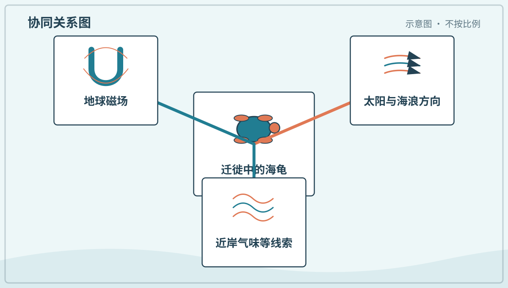

*图解：海龟会综合地磁、阳光、海浪和气味等多种线索导航，不靠单一地图。*

**一起记住：** 看海龟产卵必须遵守保护规定，不照强光、不围堵。

---

## 第 266 天｜红树林为什么站在咸水里？

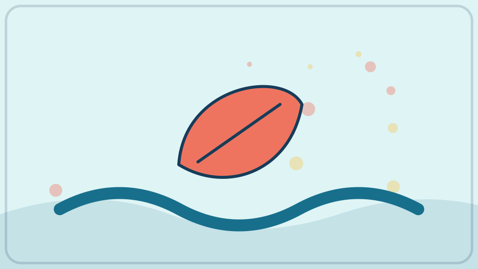

红树林植物能忍受潮汐、盐和缺氧泥土。有些根露出水面交换气体，有些过滤或排出盐。复杂根系还能减慢水流，留住泥沙并给幼鱼藏身。

**再想一步：** 红树林不是一种树，而是一群在热带、亚热带潮间带独立适应的植物。它们储存碳、缓冲风浪，但也需要潮水与陆地之间有移动空间。

**一起看看：** 在照片里找向下支撑根和向上伸出的呼吸根。

---

## 第 267 天｜海草是海里的草吗？

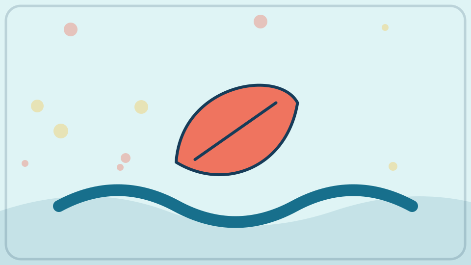

海草是重新适应海洋生活的开花植物，有根、茎、叶，也能开花结种。它们在浅海形成海草床，为鱼、海龟和许多小动物提供食物与住处。

**再想一步：** 海草祖先来自陆地，后来回到海中，需要在盐水里传粉并把根固定在海底。它与海藻不是同一类，虽然外表都可能绿绿长长。

**一起看看：** 比较海草叶片和海藻叶状体，找根与叶脉线索。

---

## 第 268 天｜海藻为什么不算真正的植物？

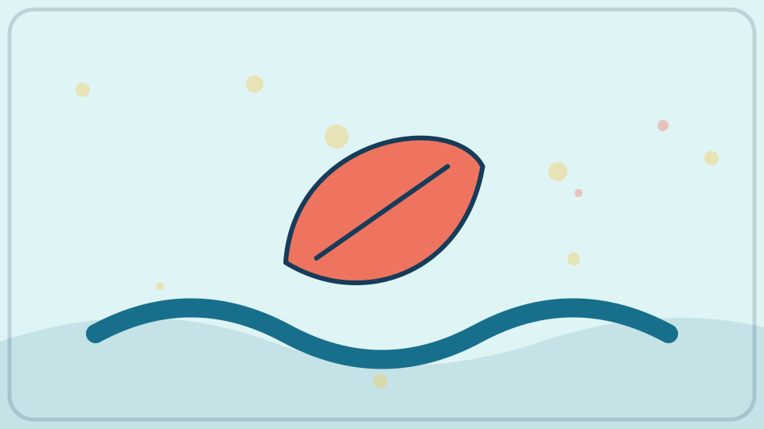

“海藻”包含多种能光合作用的生物，它们不都属于植物。大型海藻常没有真正的根、茎、叶和维管组织，只用固着器抓住海底。身体整体叫叶状体。

**再想一步：** 绿藻、红藻和褐藻的亲缘、色素与细胞结构不同，是生活方式相似的多个类群。分类要看演化关系，不能只看是否绿色或是否住在水里。

**一起看看：** 在海带图片中找固着器、柄和叶片状部分。

---

## 第 269 天｜贝壳是动物的房子吗？

贝壳由软体动物的外套膜分泌，是身体长出的外骨骼，不是随便搬进去的房子。它主要含碳酸钙，会随动物生长在边缘添加新材料。双壳贝有两片，蜗牛壳常螺旋生长。

**再想一步：** 壳的层状微结构能让裂纹不容易直穿，兼顾硬度和韧性。寄居蟹后来使用空螺壳，才更像住进别的动物留下的房子。

**一起看看：** 在允许观察的地方原地看空壳纹路；不搬走住着动物的壳，也不成堆带走空壳。

---

## 第 270 天｜沙滩的沙从哪里来？

许多沙粒来自岩石被风化、河流搬运和海浪磨碎。珊瑚礁附近，一部分白沙还来自贝壳、珊瑚骨骼和生物处理后的碎屑。不同海滩颜色与颗粒会不同。

**再想一步：** 沙是按颗粒大小分类，不限定一种材料。石英耐风化，常在大陆海岸积累；火山岛可能有黑色玄武岩沙，某些海滩还有绿色矿物沙。

**一起看看：** 用放大镜观察大人提供的一小撮干净沙，之后洗手。

---

## 第 271 天｜沙滩会自己搬家吗？

波浪和沿岸流不断搬运沙子，风也会把干沙吹进沙丘。风暴时海滩可能被侵蚀，平静季节又可能堆回来。海滩是一座会变化的泥沙仓库。

**再想一步：** 防波堤和港口会截住沿岸泥沙，让一侧堆积、另一侧缺沙。河流来沙、海平面和植被也影响海岸，因此固定海滩并不简单。

**一起看看：** 比较同一海滩不同季节照片，找岸线和沙丘变化。

---

## 第 272 天｜塑料到了海里会消失吗？

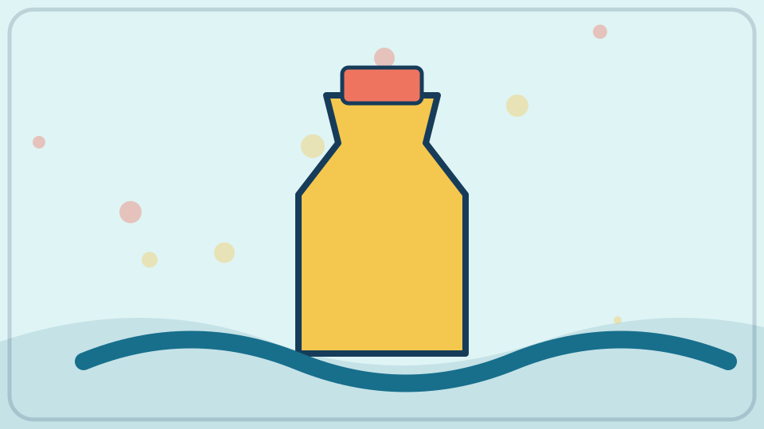

许多塑料不会很快被微生物分解。阳光和摩擦会让它碎成越来越小的微塑料，却不等于完全消失。动物可能误食或被废弃绳网缠住。

**再想一步：** 塑料种类、添加剂和环境不同，老化速度与影响也不同。清理海面只能处理一部分，减少不必要使用、妥善收集和改进材料系统更重要。

**一起行动：** 和大人把自己的垃圾带走；不徒手捡尖锐或不明废物。

---

## 第 273 天｜深海里谁在自己发光？

许多深海鱼、水母、鱿鱼和微生物能产生生物光。有的用化学反应自己发光，有的与发光细菌合作。光可用来引诱猎物、找同类、迷惑敌人或隐藏轮廓。

**再想一步：** 发光反应常由荧光素、氧和荧光素酶参与，化学能高效变成光。深海中蓝光传播较远，所以多数生物光偏蓝绿，也有少数动物制造或看见红光。

**一起看看：** 在深海录像里数不同发光方式：点亮、闪烁还是喷出亮液。
