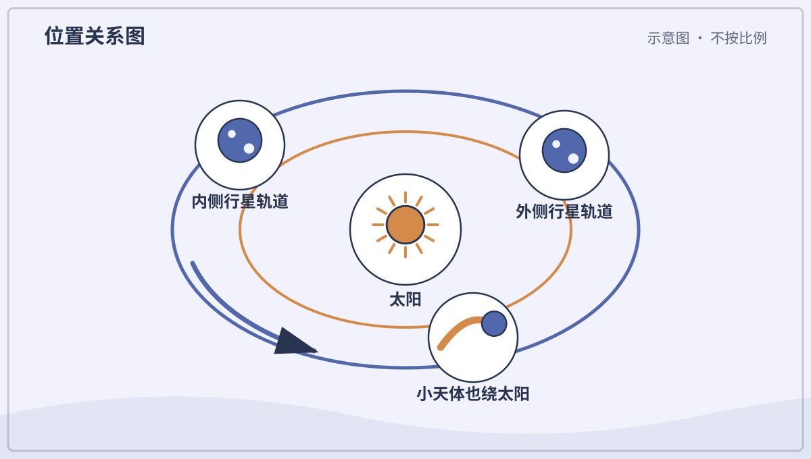
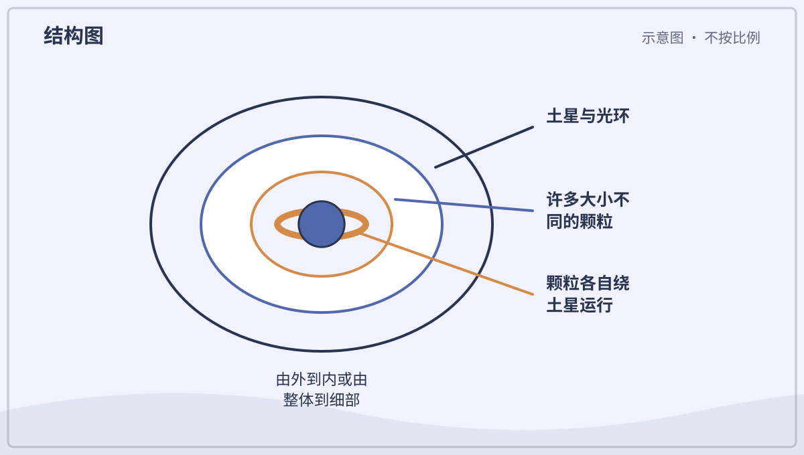
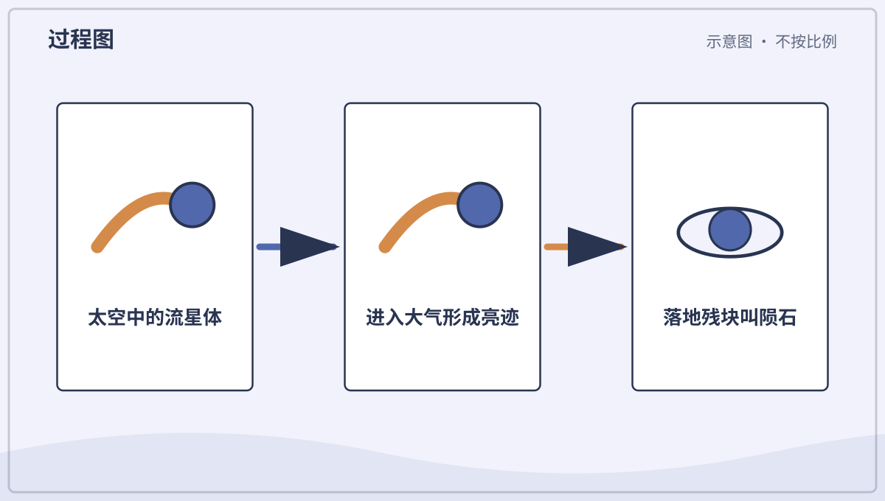
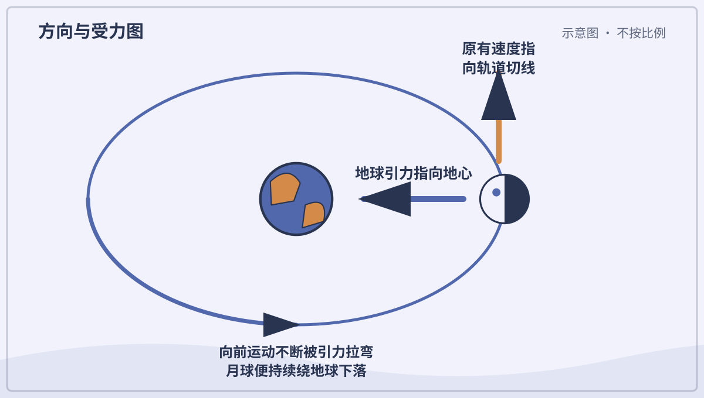
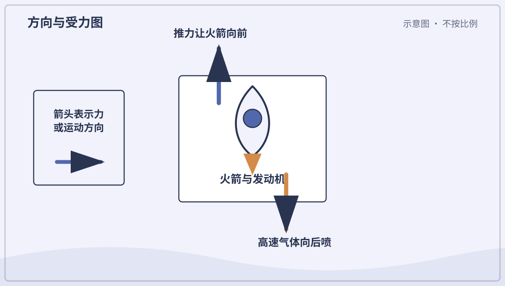

# 十月：今晚看看宇宙

## 第 274 天｜宇宙里面有什么？

宇宙包括空间、时间，以及其中所有物质和能量。星球、气体、尘埃、光和我们都在宇宙里。我们能观察的范围叫可观测宇宙，它不一定等于整个宇宙。

**再想一步：** 宇宙在大尺度上不断膨胀，遥远星系之间的空间随时间增加。光速有限，所以望得越远，也是在看越久以前发生的事情。

**一起想想：** 当我们看见太阳时，看见的是它大约八分钟前的样子。

---

## 第 275 天｜星星到底是什么？

星星是由炽热等离子体组成的巨大天体，靠自身重力聚在一起。核心核聚变释放能量，使它长期发光发热。太阳就是离地球最近的一颗恒星。

**再想一步：** 重力想把恒星压缩，内部高温气体和辐射压力向外支撑，两者平衡让恒星稳定很久。质量不同的恒星颜色、亮度、寿命和结局也不同。

*图解：恒星中心通过核聚变供能，能量穿过内部后从表面以辐射形式离开。*

**一起看看：** 找红、白、偏蓝的恒星照片，颜色与温度有关。

---

## 第 276 天｜太阳看起来不大，真的很大吗？

太阳直径约是地球的一百多倍，体积能装下许多个地球。它看起来像小圆盘，是因为离我们约一亿五千万千米。物体看起来多大同时取决于真实大小和距离。

**再想一步：** 眼睛看到的是角大小，也就是物体在视野中张开的角度。太阳与月亮真实大小差很多，却因距离不同，从地球看角大小碰巧接近。

**一起记住：** 永远不直视太阳，观察太阳只能用合格设备和专业指导。

---

## 第 277 天｜太阳系为什么叫一个“系”？

太阳系以太阳为中心，包括八颗行星、矮行星、卫星、小行星、彗星、尘埃和气体。太阳的重力把这些天体联系在一起。它们大多沿接近同一平面的轨道绕太阳。

**再想一步：** 太阳系约在四十六亿年前由旋转的气体尘埃云形成，云收缩成扁盘，物质碰撞聚集成天体。轨道排列保留了这段形成历史的线索。

*图解：太阳的引力把行星的惯性运动弯成轨道，许多天体共同组成太阳系。*

**一起看看：** 用一张纸表示轨道平面，把大小不同的圆片放在上面。

---

## 第 278 天｜什么样的天体叫行星？

在太阳系里，行星要绕太阳运行，质量大到自身重力使它接近圆形，还要清理轨道附近的大部分同类天体。地球、火星和木星都符合。定义是科学家为分类共同制定的。

**再想一步：** “清理轨道”不表示轨道上绝对没有别的东西，而是该天体在邻近区域的动力学上占主导。绕其他恒星的行星叫系外行星，实际分类口径还会继续讨论。

**一起想想：** 分类为什么要同时看形状、轨道和邻居，而不只看大小？

---

## 第 279 天｜八颗行星怎样排队？

从太阳向外是水星、金星、地球、火星、木星、土星、天王星和海王星。前四颗主要是岩石行星，后四颗是巨行星。图上的大小和距离常不能同时按比例画准。

**再想一步：** 行星轨道是椭圆，彼此间距也差很大。若把太阳缩成一个大球放在操场，最外行星可能要放到很远处，行星本身却只像小点。

**一起排排：** 做八张行星卡，按离太阳远近排列，不要求背诵。

---

## 第 280 天｜水星离太阳最近，为什么夜里很冷？

水星几乎没有能保温和搬运热量的大气。向着太阳的一面会很热，漫长夜晚的一面却迅速散热，变得很冷。离太阳近不表示每个地方一直热。

**再想一步：** 水星自转与公转形成三比二的共振，太阳日非常长。温度由吸收阳光、反射、散热、大气和地表性质共同决定。

*图解：水星白天受强烈日照，夜面又因大气极稀薄而快速散热，温差很大。*

**一起看看：** 比较有盖和没盖的保温容器，理解大气会影响热量变化。

---

## 第 281 天｜最热的行星为什么不是水星？

金星被厚厚的二氧化碳大气包围，云层下压力很大。地表放出的红外热很难直接逃向太空，强烈温室效应让它比水星表面平均更热。

**再想一步：** 大气让部分波长阳光进入，又吸收并反复发射地表红外辐射，改变能量离开的高度与温度。温室效应本身是自然物理过程，强弱取决于大气组成和结构。

*图解：金星厚大气让阳光进入，却强烈吸收地表发出的红外辐射，造成高温。*

**一起看看：** 在行星表格中比较“离太阳远近”和“表面温度”，找出不完全一致。

---

## 第 282 天｜地球为什么有很多液态水？

地球离太阳的距离、合适的大气压力和温度，让表面能长期存在液态水。重力留住大气，磁场和地质循环也影响环境。已知生命依赖水，但有水不保证一定有生命。

**再想一步：** 宜居性不是一条简单的“刚好距离”规则，还与恒星、行星质量、大气、轨道和长期气候反馈有关。地球生命也反过来改变了大气和岩石循环。

**一起看看：** 从太空照片估一估蓝色海洋和陆地谁占得更多。

---

## 第 283 天｜火星为什么是红色的？

火星土壤和尘埃含有许多氧化铁，像铁锈一样偏红。细尘被风吹到大气和地表，让整颗行星从远处显得红。岩石下面并非每处都同样红。

**再想一步：** 铁与氧和水等发生反应形成氧化物，说明火星过去的环境与今天不同。探测器分析矿物和古河道，寻找液态水曾经存在的证据。

**一起看看：** 比较铁锈、红土和火星照片的颜色，但不触摸生锈尖物。

---

## 第 284 天｜木星上的大红斑是什么？

大红斑是木星大气里一个巨大的长期风暴，旋转方向与地球上的高压涡旋相似。它比地球大，已被观察许多年，但大小和颜色会变化。木星没有可站立的固体表面。

**再想一步：** 木星快速自转和带状强风让涡旋能够长期存在，深层结构仍在研究。颜色可能来自云层物质受阳光改变后的化学产物，目前没有一个完全确定的简单答案。

**一起看看：** 在不同时期木星照片中比较大红斑的形状和大小。

---

## 第 285 天｜土星环是一整张圆盘吗？

土星环由无数冰粒、岩石和尘埃组成，小到颗粒，大到房屋般的块。它们各自绕土星运行，从远处密集地看成薄环。环中还有许多缝和细环。

**再想一步：** 靠近土星的粒子公转较快，远处较慢。卫星引力、粒子碰撞和轨道共振共同雕刻环的结构；四颗巨行星其实都有环，只是土星环最醒目。

*图解：土星环由无数冰和岩石颗粒组成，各自沿轨道运行，并非一整张固体圆盘。*

**一起试试：** 用许多小纸点围成圈，近看是点，远看像连续带。

---

## 第 286 天｜天王星为什么像躺着转？

天王星自转轴几乎躺在轨道平面里，像横着滚动。可能是早期巨大碰撞和长期引力作用造成，但具体历史仍在研究。强烈倾斜让它的季节非常特别。

**再想一步：** 一极可在一段漫长季节里持续朝向太阳，另一极处于黑暗，随后交换。大气仍会搬运热量，所以温度变化不只由日照简单决定。

**一起看看：** 把铅笔穿过球当自转轴，分别直立、倾斜和横放绕灯移动。

---

## 第 287 天｜海王星离太阳很远，为什么风很快？

海王星得到的太阳能很少，却有太阳系里很快的大气风。它内部仍释放热量，快速自转和大气结构帮助驱动天气。风暴会出现、移动和消散。

**再想一步：** 行星天气的能量不只来自太阳，也可来自形成后残留热和内部缓慢收缩。云层深度、甲烷与氢氦大气怎样交换能量，仍是探测研究问题。

**一起想想：** 哪些机器或自然现象也不只从外面得到能量？

---

## 第 288 天｜冥王星为什么叫矮行星？

冥王星绕太阳运行，也被自身重力塑成近圆形，但没有清理轨道邻域，因此归为矮行星。它位于海王星外的柯伊伯带，与许多冰质小天体共享区域。

**再想一步：** 改分类不是把天体变小或赶出太阳系，而是新发现增多后调整概念。冥王星仍有山、冰川、稀薄大气和卫星，是值得研究的复杂世界。

**一起说说：** 名字和分类改变了，真实物体的哪些特点没有改变？

---

## 第 289 天｜小行星都是碎掉的行星吗？

小行星是绕太阳运行、通常比行星小的岩石或金属天体。许多是太阳系形成时没有聚成行星的剩余材料，也有些来自大天体碰撞后的碎片。形状常不规则。

**再想一步：** 木星引力扰动让主小行星带里的物质难以聚成一颗行星。研究陨石和小行星能保存早期太阳系的化学与碰撞记录。

**一起看看：** 比较圆形矮行星与不规则小行星，想想重力和大小的关系。

---

## 第 290 天｜彗星为什么拖着长尾巴？

彗星含冰、尘埃和岩石。靠近太阳时，冰受热直接变成气体，带出尘埃形成彗发和尾。太阳光与太阳风把尾巴推向背离太阳的方向。

**再想一步：** 彗星常有弯曲尘埃尾和较直的离子尾，方向不一定在运动轨迹后面。离开太阳后活动减弱，尾巴会变淡。

*图解：彗星接近太阳时冰升华，气体带出尘埃；太阳风和辐射把尾巴推向背日方向。*

**一起看看：** 在彗星轨道图不同位置画出始终背离太阳的尾巴。

---

## 第 291 天｜“流星”真的是星星掉下来吗？

流星是小石粒或尘埃高速进入大气时出现的亮迹，不是恒星掉落。它压缩并加热前方空气，物质也会烧蚀发光。大多在到达地面前就消失。

**再想一步：** 太空里的小块叫流星体，亮起来的现象叫流星，落到地面的残块叫陨石。流星雨常在地球穿过彗星留下的尘埃带时出现。

*图解：小天体高速进入大气，压缩并加热前方空气而发光；少数残块能落到地面。*

**一起看看：** 夜间观星只在大人陪同的安全地点，不追逐所谓“落点”。

---

## 第 292 天｜月亮上为什么满是圆坑？

小行星和彗星碎块高速撞上月面，释放巨大能量，挖出近圆形撞击坑。月球几乎没有风雨和活跃板块去快速抹平它们，所以许多坑保存很久。

**再想一步：** 即使撞击物斜着来，冲击波向四周扩展也常造出圆坑。坑边喷出的碎屑能形成明亮射纹，较大的撞击还会有中央峰。

*图解：高速撞击产生冲击波，挖出物质并向外抛射，留下近圆形撞击坑。*

**一起看看：** 在满月照片中找大圆坑和向外延伸的亮纹。

---

## 第 293 天｜在月球上能跳得更高吗？

月球质量比地球小，表面重力约是地球的六分之一。同一个人质量不变，受到的重力较小，所以较容易跳高、落得较慢。笨重宇航服仍会限制动作。

**再想一步：** 质量表示物体有多少惯性，重量是重力对它的力。到月球后质量不变、重量变小，因此推动身体改变速度仍需要克服惯性。

**一起想想：** 一只球在月球会不会更容易被举起？它里面的物质有没有减少？

---

## 第 294 天｜日食时是谁挡住了太阳？

新月附近，月球有时正好来到太阳和地球之间，月影落到地球一小片区域，就发生日食。因为月球轨道倾斜，并不是每次新月都有日食。

**再想一步：** 月球本影经过处可见日全食，半影处见日偏食；月球看起来稍小时还可能有日环食。日食带很窄，是影子几何的结果。

*图解：日食发生在太阳、月球、地球接近排成一线，月影落到地球局部区域时。*

**一起记住：** 任何日食阶段都按专业指导使用合格护目设备，绝不直接看太阳。

---

## 第 295 天｜月食时月亮为什么变红？

满月附近，地球有时来到太阳和月球之间，地球影子落到月面形成月食。阳光斜穿地球大气时，蓝光较多被散向别处，剩下的红橙光再被大气折射进影子，所以月亮可能呈暗红色。

**再想一步：** 地球边缘一圈大气像同时发生许多次日出和日落，把剩余的红橙光送到月面。大气中的云、尘埃和火山微粒会改变月食颜色深浅。

*图解：月食时地球挡住直射阳光，大气把剩余红橙光折进影子，照到月面。*

**一起看看：** 月食可用眼睛安全观察，但夜间地点仍需大人陪同。

---

## 第 296 天｜月亮为什么不会掉到地球上？

月亮其实一直被地球重力拉着向下落，同时又有很快的横向速度。它每落下一点，弯曲的地球表面也离开一点，于是不断绕行而不撞上地面。这就是轨道运动。

**再想一步：** 轨道是持续自由落体，不是太空没有重力。速度太慢会落下，太快可能进入更高轨道或逃离，合适速度与高度共同决定轨道。

*图解：月球不断向前运动，同时被地球引力拉弯路径，于是持续绕地球下落。*

**一起试试：** 用手指沿圆边一边向前一边向内画，感受两个方向合成弯路。

---

## 第 297 天｜火箭为什么要向下喷气？

火箭发动机把高温气体高速向后喷出，气体也给火箭大小相等、方向相反的推力。推力大于重量和阻力时，火箭加速上升。太空没有空气，火箭仍能工作。

**再想一步：** 火箭自带燃料和氧化剂，不靠推空气前进；这符合动量守恒。随着燃料消耗和分级抛掉空结构，质量变小，更容易继续加速。

*图解：火箭把高速气体向后喷出；火箭受到大小相等、方向相反的推力。*

**一起看看：** 只看正规发射录像，不制作燃烧或高压火箭。

---

## 第 298 天｜太空里真的什么都没有吗？

太空接近真空，平均粒子比地面空气少得多，却不是绝对空无一物。那里有稀薄气体、尘埃、光、磁场、高能粒子和各种天体。不同区域密度也不同。

**再想一步：** 真空表示压力很低，不表示没有重力或温度概念。声音需要物质传播，所以在近真空中普通声波不能像在空气里那样传远。

**一起试试：** 比较声音、光和磁力哪些需要空气传播，先猜再查答案。

---

## 第 299 天｜宇航员为什么飘起来？

空间站和里面的宇航员都在地球重力下沿轨道自由落体。它们一起以相同方式下落，宇航员没有地板持续托住，就感觉失重并飘浮。那里仍有很强的地球引力。

**再想一步：** 这种状态更准确叫微重力，因为空气阻力、设备振动和位置差仍产生微小加速度。长期微重力会影响肌肉、骨骼和体液分布，宇航员需要锻炼。

**一起看看：** 观察空间站录像中水滴、头发和物品怎样运动。

---

## 第 300 天｜宇航服为什么像一艘小飞船？

宇航服提供氧气和合适压力，带走二氧化碳与身体热量，还抵挡温度变化和小颗粒。多层材料保护身体，关节又要允许活动。背包里装着生命保障系统。

**再想一步：** 真空中液态水和人体组织不能在正常压力下工作，阳光与阴影温差也很大。宇航服必须在密封、灵活、散热、通信和耐损伤之间取平衡。

**一起看看：** 在宇航服图上找头盔、手套、管线和背包，猜各自任务。

---

## 第 301 天｜人造卫星一直在拍照吗？

人造卫星是人送入轨道的设备，任务很多：通信、导航、天气观测、科学测量和拍摄地球。不同卫星带不同传感器，不是每颗都装普通相机，也不会看见所有细节。

**再想一步：** 轨道高度和倾角决定卫星经过哪里、多久回来。传感器可接收可见光、红外、微波等信号，再把数据传到地面站处理。

**一起看看：** 比较天气卫星云图和普通地面照片，信息有什么不同？

---

## 第 302 天｜望远镜为什么能看远？

望远镜用大透镜或大镜面收集比眼睛更多的光，再把远处物体形成清楚的像。口径越大，通常越能看见暗弱细节并分开靠得很近的光点。放大并不是唯一重要的事。

**再想一步：** 地面大气会让图像抖动并吸收部分波长，所以一些望远镜建在高山或太空。不同望远镜观察无线电、红外、可见光、X 射线等不同“颜色”的宇宙。

**一起记住：** 望远镜绝不能对准太阳，除非由专业人员使用专门太阳滤镜。

---

## 第 303 天｜银河是一条真的河吗？

夜空的银河是我们从银河系内部看见的密集恒星带，不是一条水河。银河系包含恒星、气体、尘埃和暗物质，形状像带棒的旋涡盘。太阳位于盘中的一条小旋臂附近。

**再想一步：** 尘埃挡住许多可见光，射电和红外观测帮助看穿部分尘埃并绘制结构。银河系只是可观测宇宙中数量巨大的星系之一。

**一起看看：** 在无光害照片中找暗带，那些地方可能有遮光尘埃。

---

## 第 304 天｜黑洞会把整个宇宙吸进去吗？

不会。黑洞是物质压缩到极密、连光越过某个边界后也不能逃出的天体。远离黑洞时，它的引力和同质量普通天体一样按距离减弱，不会无边无际地吸走一切。

**再想一步：** 不能逃出的边界叫事件视界。我们看不见黑洞本身，却能观察附近恒星轨道、热亮吸积气体和黑洞合并产生的引力波来确认它。

**一起想想：** 看不见一个东西时，科学家还能用哪些周围变化发现它？
