# 兴趣单元 10｜树木、植物适应与花园网络

> **探索领域 03：** 植物与花园生命
>
> **核心问题：** 不同植物怎样应对季节、水分、支撑和繁殖，并与真菌和动物形成网络？

年轮、树皮、落叶和常绿叶记录树的生活，仙人掌、荷叶、藤和向光生长展示环境适应，蘑菇、苔藓与蕨类扩展植物之外的花园世界。

## 怎样沿着本单元的追问链阅读

比较结构解决了什么限制，同时记住相似环境可以出现多种不同办法。

## 追问链 10.1｜树干、树皮与季节

木质部生长留下年轮，树皮保护运输组织，落叶与常绿是不同季节策略。

### 第 076 问｜树干里的圆圈是什么？

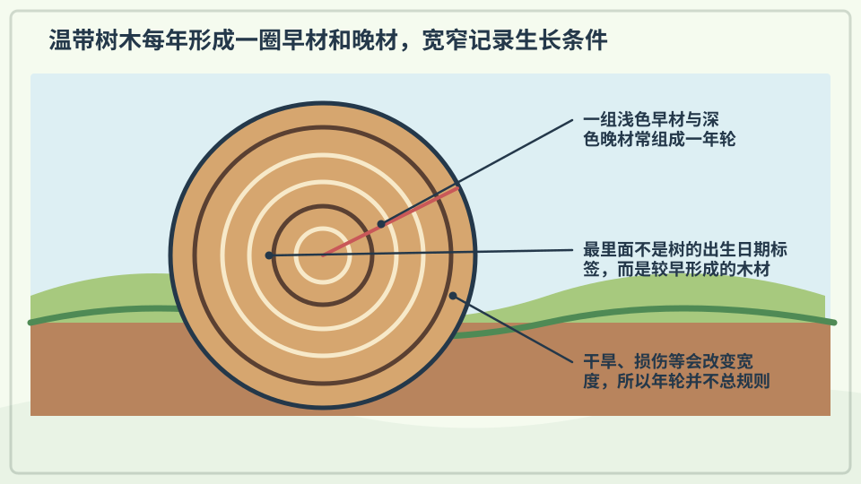

许多树每年会长出一层新的木材。生长快慢不同，木材颜色和密度也会有变化，于是横切面上出现一圈圈年轮。年轮能帮助科学家研究树的过去。

**再想一步：** 温带树木的早材常生长快、细胞较大，晚材较密，于是形成明显边界。年轮宽窄受水、温度、竞争和损伤等多种因素影响，不能只用一圈简单讲完一年天气。

**把知识连起来：** 在有明显季节的地方，形成层每年产生的新木质部在生长快慢变化下留下宽窄和密度不同的带。许多树的一组早材与晚材可对应一个生长年，但干旱、火灾、虫害和树种特性都会改变纹理。年轮像记录环境影响的档案，却需要专业校准。

**再往外看：** 树轮年代学会把活树和古木的纹理相互对齐，建立跨越很长时间的年表，用于研究过去气候、火灾和建筑年代。

**容易弄混：** 不能只数照片里的每一条深线就断定树龄，也不是所有热带树木都有清楚的一年一圈。分叉、损伤和缺失轮都可能让简单计数出错。

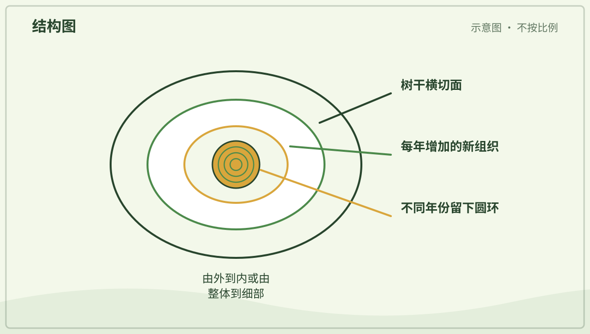

*图解：形成层每年增加新组织；生长快慢不同会留下可辨认的年轮。*

**一起看看：** 只观察已经切好的木片，不伤害活树。

---

### 第 077 问｜树皮有什么用？

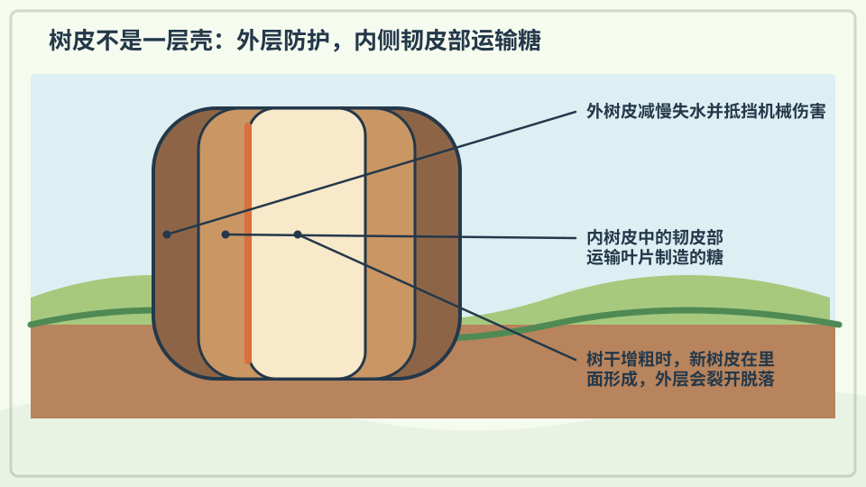

树皮包在树干和树枝外面。它能减少水分流失，也帮助抵挡碰撞、病菌和一些小动物。不同树的树皮会光滑、粗糙、开裂或一片片脱落。

**再想一步：** 树皮包括外侧保护组织和内侧参与运输的组织。树干变粗时，外层若不能同步伸展就会裂开，并由新的保护组织继续覆盖。

**把知识连起来：** 树皮包含外层死亡组织和较内侧的活组织。外层能减缓水分散失、温度变化和机械损伤，内层韧皮部则运输叶制造的糖等物质。树干增粗时，旧外皮会开裂、脱落并由新组织补充。

**再往外看：** 不同树种的树皮厚度、纹理和耐火性差别很大，也为苔藓、昆虫和微生物提供微型栖息地。

**容易弄混：** 树皮不是树的全部“皮肤”，也不是剥一点一定无害。环状破坏韧皮部会切断运输，严重时可使根得不到有机物。

**一起摸摸：** 轻碰两棵常见树的树皮，不撕也不刻字。

---

### 第 078 问｜有些树为什么秋天落叶？

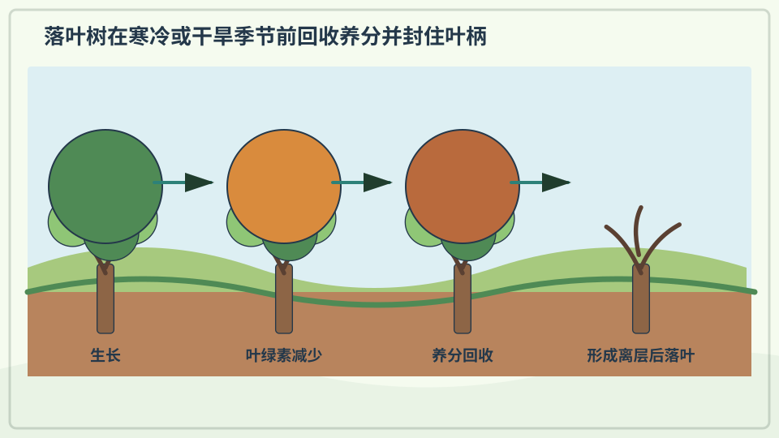

冬季寒冷或干旱将到来时，一些树会回收叶片里的有用物质，再让叶子脱落。这样能减少水分散失，也避免薄叶受冻。春天条件合适时会长出新叶。

**再想一步：** 叶柄基部会形成离层，使输送逐渐停止，最后让叶片脱落。叶绿素分解后，原有的黄色色素显现，有些树还会制造红色色素。

**把知识连起来：** 冬季或旱季到来前，一些树会回收叶里的部分养分，并在叶柄基部形成离层。落叶减少蒸腾和冻伤风险，也把养分与有机物送回土壤食物网。温度、日长和水分共同参与启动过程。

**再往外看：** 落叶层能保湿、缓冲温度并为分解者提供食物；森林中的“掉叶子”同时是树的季节策略和生态系统的物质循环。

**容易弄混：** 叶子落下不表示树已经死了，也不是单由冷风吹掉。活树在落叶前会进行受调控的组织变化，常绿植物也会换叶，只是时间不同。

**一起看看：** 收集地上的落叶，按颜色或形状排一排。

---

### 第 079 问｜松树冬天为什么还是绿的？

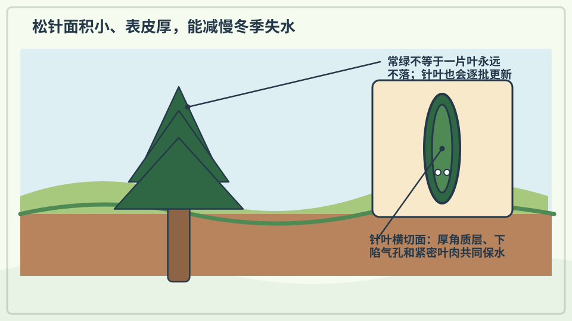

松树的针叶细小，表面有保护层，不容易丢失太多水。它不会在同一时间掉光全部针叶，所以冬天常看起来绿色。老针叶也会一批批脱落。

**再想一步：** 针叶面积较小、角质层较厚，气孔也常藏得较深，能减慢蒸腾。常绿并不表示叶子永不脱落，只表示叶片寿命跨过多个季节且分批更新。

**把知识连起来：** 许多松树针叶表面积较小、角质层较厚，气孔位置也能减少水分散失；细胞中的物质还帮助组织耐受低温。叶片能使用多年，使树在短暂合适天气里迅速开始光合作用。保留叶片与制造和维护叶片的成本相互平衡。

**再往外看：** 常绿策略不仅出现在寒冷地区，也见于一些贫瘠或季节性干旱环境。不同常绿植物的阔叶、针叶和寿命差别很大。

**容易弄混：** “常绿”不等于同一片叶永远不掉，也不表示冬天一直高速生长。叶片会分批更新，低温和缺水时光合作用往往明显减慢。

**一起看看：** 在树下找掉落的旧针叶，别用手去抓尖端。

## 追问链 10.2｜干旱、湿地、攀援与向光

表面、储水组织和生长方向帮助植物取得光并管理水分。

### 第 080 问｜仙人掌怎样住在干旱地方？

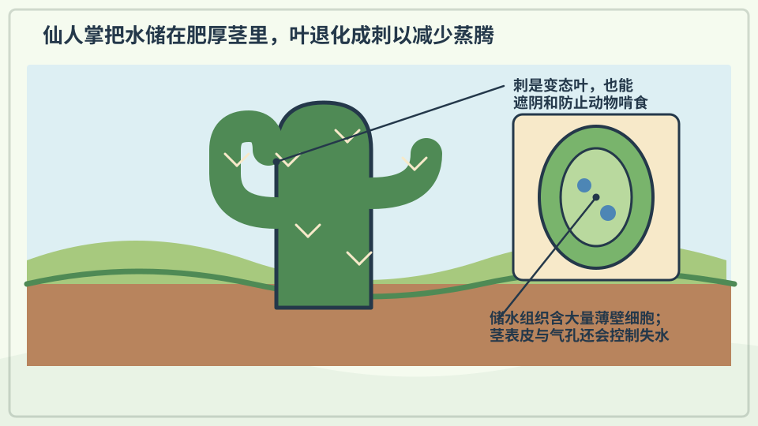

许多仙人掌用肥厚的茎储水。叶子变成刺，能减少水分散失，也有保护作用。它们的根会抓住难得的雨水，但不同仙人掌的办法并不完全相同。

**再想一步：** 许多仙人掌夜里打开气孔吸收二氧化碳，白天关闭气孔减少失水，再利用储存的二氧化碳进行光合作用。这叫景天酸代谢，是节水适应之一。

**把知识连起来：** 仙人掌的肉质茎储水并承担大部分光合作用，叶演化成刺可减少表面积，也能提供一定遮阴和防护。表面蜡质层、浅而广的根系以及夜间开放气孔的代谢方式共同节水。任何一个特征单独都不能解释它的耐旱。

**再往外看：** 多肉植物在不同植物家族中多次独立演化出储水外形，这是相似环境产生相似功能方案的例子。

**容易弄混：** 驼峰状茎里不是无限水箱，刺也不是为了扎人才出现。仙人掌仍会失水、受冻或烂根，不是放在任何干燥处都能生存。

**一起看看：** 只观察不触摸，找找仙人掌的茎和刺在哪里。

---

### 第 081 问｜荷叶上的水为什么滚成珠？

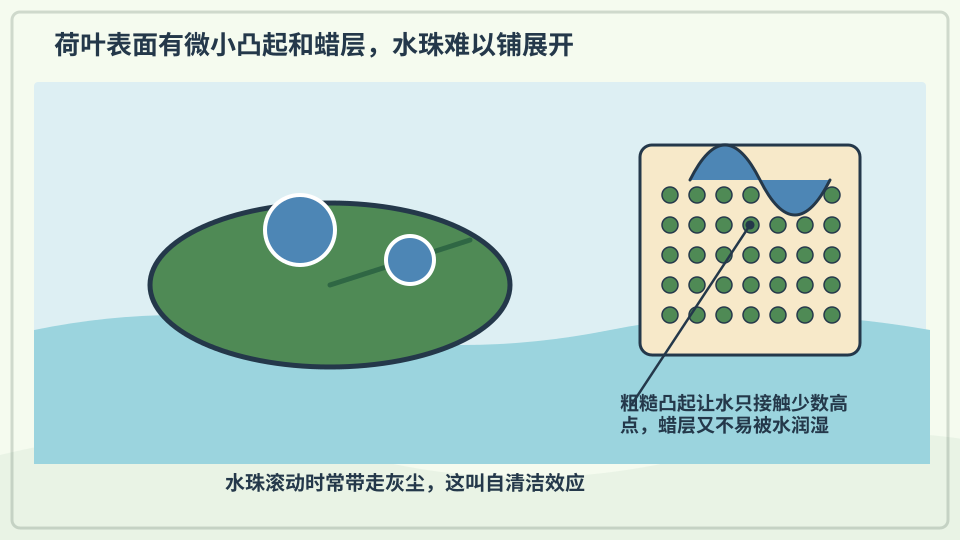

荷叶表面有许多很小的凸起和蜡质层，水不容易摊开。水滴会缩成接近圆球，滚动时还能带走一些灰尘。这种表面叫很难被水润湿的表面。

**再想一步：** 微小凸起让水滴下方夹着空气，真正接触叶面的面积变少，接触角变大。科学家把这种强疏水和自清洁现象称作“荷叶效应”。

**把知识连起来：** 荷叶表面有微小凸起，并覆盖疏水蜡质。水与叶面的真实接触面积较小，表面张力便让水收成近似球形；水珠滚动时还能带走一部分松散灰尘。微观粗糙和化学性质要一起作用。

**再往外看：** 仿荷叶表面被用于研究自清洁涂层、防水织物和减少结冰，但耐久、安全和环境影响仍需工程测试。

**容易弄混：** 水珠滚动不是因为荷叶抹了油，也不是任何粗糙表面都会防水。若表面结构受损或沾有表面活性剂，水滴形状会明显改变。

*图解：荷叶表面的微小凸起和蜡质层减少水的贴附，水便聚成圆珠滚走。*

**一起看看：** 雨后远看荷叶上的水珠，不到水边独自玩耍。

---

### 第 082 问｜藤为什么要爬架子？

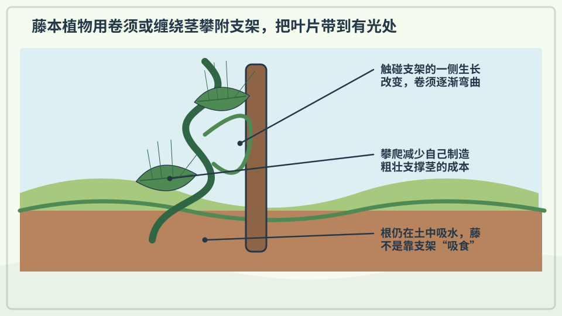

一些藤本植物的茎很长，却不够硬，不能自己高高站立。它们用卷须、缠绕的茎或小吸盘抓住支撑物，向有光的地方生长。这样可以少造粗树干。

**再想一步：** 卷须碰到支架后会出现接触向性，两侧生长速度改变，使它弯曲并缠紧。植物把较少材料用于支撑，就能更快把叶片送到高处。

**把知识连起来：** 藤本植物把较少资源用于粗壮自立的木质支架，而用卷须、缠绕茎、吸盘或钩刺抓住已有支撑。这样能较快把叶片送到光线更好的位置。支撑物的位置和触碰信号会改变生长方向。

**再往外看：** 攀援方式可以用来比较植物如何感受接触；农业中的架子也利用这些生长习性改善通风和采收。

**容易弄混：** 藤不是看见架子后主动决定爬，也不是都用同一种器官。卷须可能来自叶、茎或其他结构，必须观察具体植物。

**一起看看：** 找找藤是绕着、钩着，还是贴着支架向上。

---

### 第 083 问｜植物为什么会朝窗户弯？

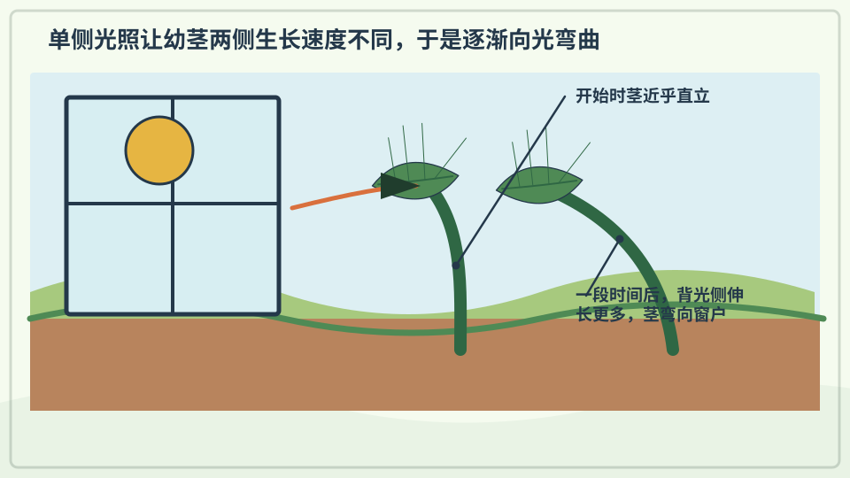

许多幼苗会感受到光从哪边来。背光一侧的细胞常伸长得更多，茎就向光弯曲。这叫向光性，能帮助叶子得到光。

**再想一步：** 植物激素生长素会因光的方向重新分布，改变细胞伸长。向日葵幼株的生长部位可随日照方向变化，但成熟花盘并不会永远整天追着太阳转。

**把知识连起来：** 单侧光照会让幼茎两侧的生长调节物分布不同，背光侧细胞常伸长更多，茎便逐渐弯向光。弯曲改变了叶片接到的光，又会影响后续生长，是一个不断反馈的过程。根对光和重力的反应可能不同。

**再往外看：** 达尔文父子曾用遮住幼苗不同部位的方法研究向光性；现代研究进一步追踪受光蛋白、激素运输和基因活动。

**容易弄混：** 植物朝窗弯不是因为它有眼睛或心里想晒太阳，也不是整株同时被拉弯。主要变化发生在生长区域两侧细胞伸长速度不同。

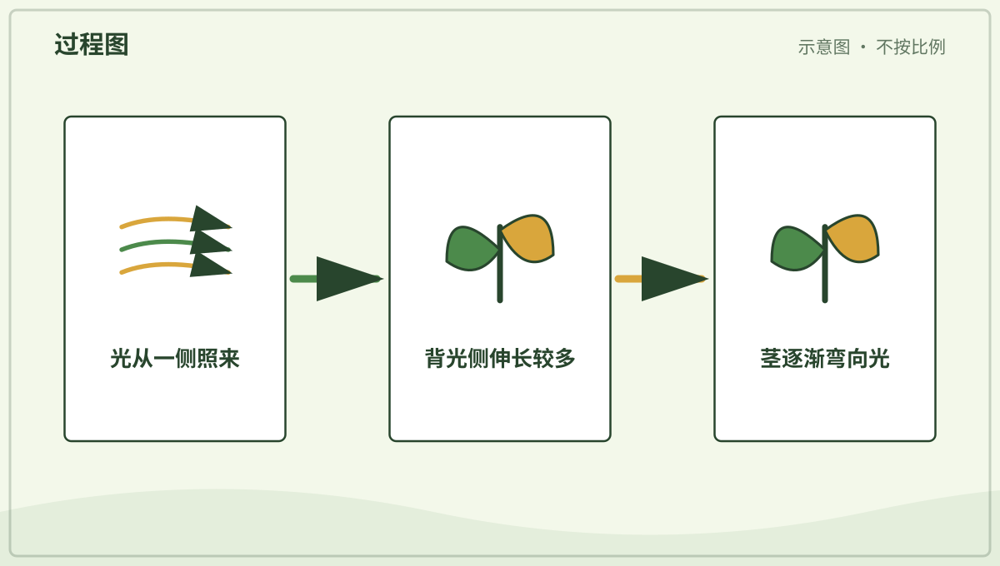

*图解：单侧光照使茎两边伸长程度不同，生长差异让茎弯向光源。*

**一起看看：** 每天从同一方向拍一盆植物，不要频繁转动它。

## 追问链 10.3｜真菌、无花植物与花园网络

蘑菇不属于植物；孢子、地下储藏器官和生物互作展示多样生命史。

### 第 084 问｜蘑菇是植物吗？

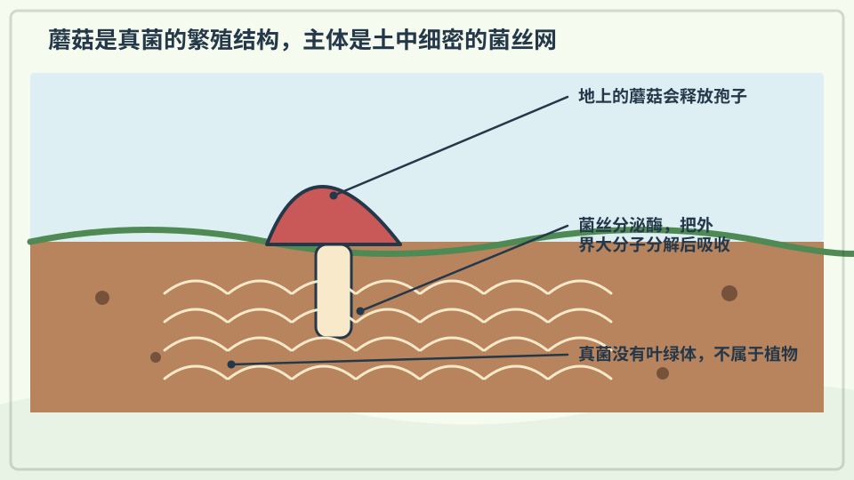

蘑菇不属于植物，而属于真菌。它们没有叶绿素，不能像绿色植物那样用光制造糖。我们看见的蘑菇只是一些真菌长出的繁殖结构。

**再想一步：** 真菌靠释放酶分解周围有机物，再吸收小分子养分。地下或木头里的菌丝网络才是主体，蘑菇像短暂长出的“结果”部分，会产生孢子。

**把知识连起来：** 真菌从周围材料中分泌酶，再吸收分解后的小分子；地下或基质中的菌丝网络才是身体的重要部分，蘑菇多是产生孢子的结构。真菌没有叶绿体，不能像绿色植物那样依靠光合作用制造有机物。它们在分解和共生中连接生态系统。

**再往外看：** 菌根真菌与植物根交换矿物质和有机物，酵母用于发酵，另一些真菌会致病或制造药物。真菌这个类群远比餐桌上的蘑菇广。

**容易弄混：** 蘑菇不是植物的花，也不能因为一种蘑菇可食就品尝野外相似个体。物种鉴定需要专业证据，儿童观察只看不摸不尝。

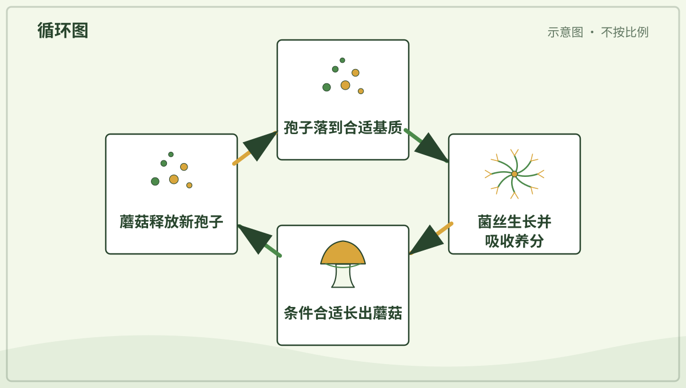

*图解：孢子在合适基质中长成菌丝网络；条件合适时长出蘑菇，再释放新孢子。*

**一起记住：** 野外蘑菇只看不摸不尝，有些会让人生病。

---

### 第 085 问｜苔藓为什么喜欢湿地方？

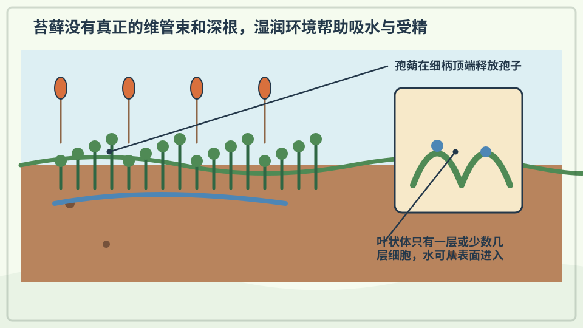

苔藓通常矮矮的，没有像大树那样复杂的运水管道。它们容易从身体表面吸水。繁殖也常需要水，所以许多苔藓喜欢潮湿、背阴的地方。

**再想一步：** 苔藓没有真正的根，常用假根固定自己。它们体形小，水和物质能在较短距离内移动，这也限制了多数苔藓长得很高。

**把知识连起来：** 苔藓没有像高大维管植物那样发达的输水管道和真正根系，水常从表面吸收并在短距离内移动。潮湿能帮助细胞维持水分，也让游动精子到达卵细胞完成有性生殖。矮小形态减轻了远距离运输的限制。

**再往外看：** 苔藓能在岩面和土壤表面截留水与颗粒，为微小动物提供栖息地，也常被用作环境变化的指示生物。

**容易弄混：** 喜欢湿不等于必须一直泡在水里，苔藓也不是一层没有结构的绿色污渍。许多种能暂时干燥后恢复，但持续条件仍因物种而异。

**一起看看：** 用放大镜观察苔藓像不像一片小森林，不把它揭下来。

---

### 第 086 问｜蕨类没有花，怎样有小宝宝？

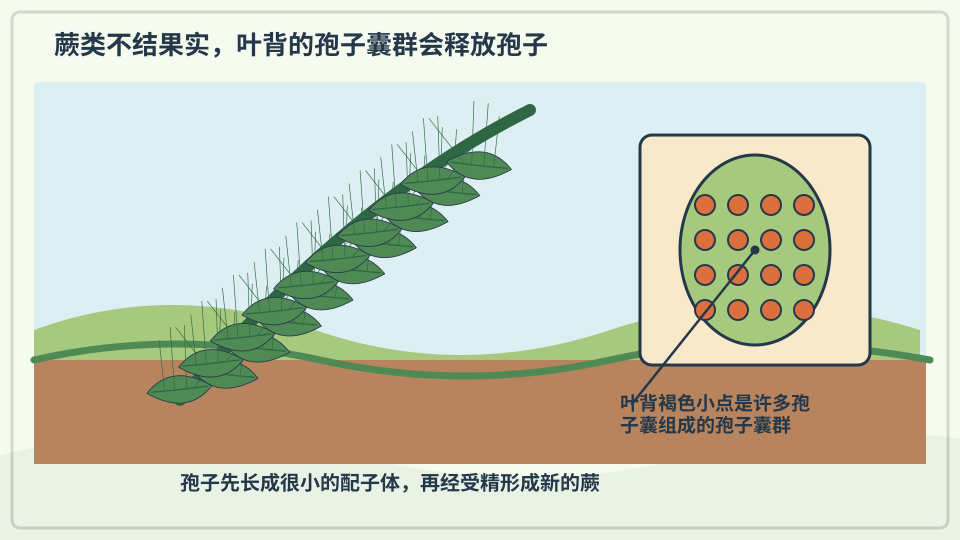

蕨类通常不结花和种子。它们会制造很小的孢子，常藏在叶片背面的孢子囊里。孢子落到合适的湿地方，会经历几个阶段长成新蕨类。

**再想一步：** 孢子先长成很小的配子体，再经过受精形成我们熟悉的大蕨株。蕨类的生活史在两个不同形态的世代之间交替。

**把知识连起来：** 蕨类能产生孢子，孢子长成微小的配子体；受精后，新的蕨类孢子体才从中长出。我们常见的大叶片只是生命周期中的一个阶段。这个过程没有花和种子，却仍包含遗传物质组合与世代交替。

**再往外看：** 石松、苔藓和蕨类的生命周期各有差别，古代大型蕨类近亲还参与形成了一些煤层。观察叶背孢子囊可以进入植物演化史。

**容易弄混：** 叶背的褐色小点通常是成组孢子囊，不是昆虫卵的统一标志，也不是蕨类直接生出的“小宝宝”。孢子还要经过另一个微小世代。

**一起看看：** 只观察蕨叶背面整齐的小点，不用手刮。

---

### 第 087 问｜竹子是树还是草？

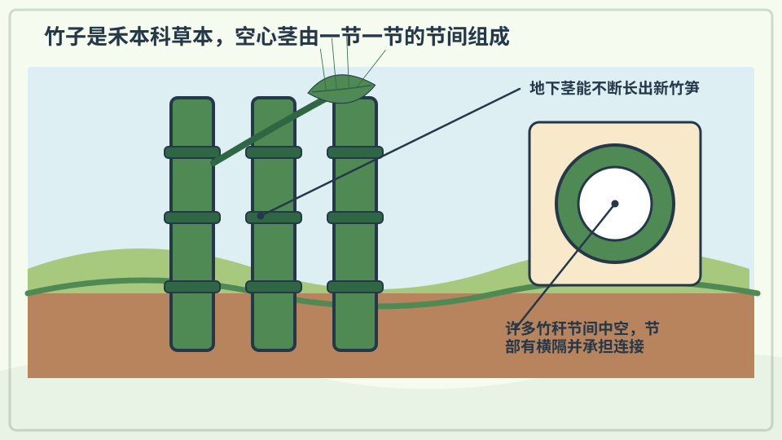

竹子属于禾本科，和许多草是亲戚。它的茎能变得又高又硬，看起来像树干，却有明显的节。不同竹子的大小和生长速度差别很大。

**再想一步：** 竹秆的生长主要集中在节附近，许多竹种还能用地下茎扩展。竹子会开花结种，但有些种类相隔很多年才大规模开花一次。

**把知识连起来：** 竹子属于禾本科，和草有共同的节、叶鞘与花部特征；它的茎却会木质化，形成高而硬的竹秆。地下根茎能不断长出新笋，使一片竹林中的许多竹秆可能属于相连的克隆。分类看亲缘和结构，不只看高矮。

**再往外看：** 某些竹种隔很多年才大规模开花，开花周期和开花后的命运仍是生态研究的重要问题。竹材的纤维排列也使它成为有用工程材料。

**容易弄混：** 像树一样高不等于植物学上就是树，叫“草”也不表示柔软矮小。日常外形词与演化分类使用的证据不同。

**一起看看：** 找找竹竿一节一节的分界线。

---

### 第 088 问｜土豆是植物的根吗？

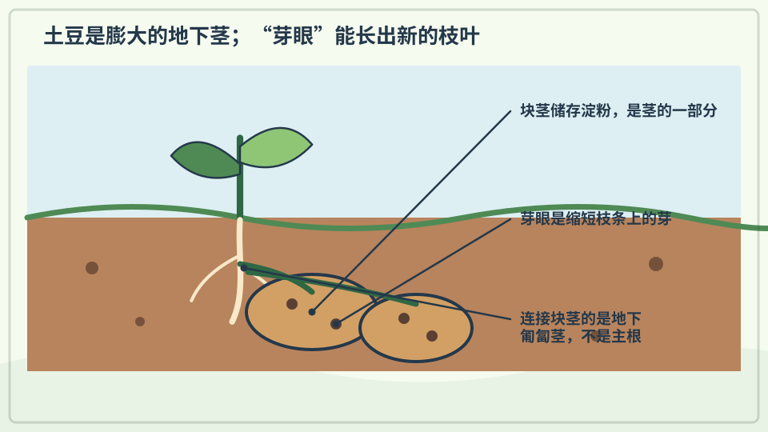

土豆主要是地下茎膨大形成的块茎，不是根。表面的小“眼睛”其实是芽，条件合适时能长出新枝叶。植物把一部分食物存在块茎里。

**再想一步：** 判断地下器官是茎还是根，可以找芽、节和叶痕等结构。土豆块茎储存很多淀粉，为新芽早期生长提供能量。

**把知识连起来：** 土豆块是膨大的地下茎，表面的“芽眼”是能长出新枝的芽；它储藏淀粉，为后续生长提供原料。地下茎通过茎与母株相连，位置在土下并不会自动把器官变成根。观察芽、节和连接方式有助于判断。

**再往外看：** 姜、藕、洋葱和红薯也储藏养分，但分别涉及根茎、块茎、鳞茎或块根等不同器官。餐桌上相似的用途可能来自不同植物结构。

**容易弄混：** 土豆不是植物的果实，也不是普通根。发绿或发芽土豆可能积累较多有毒糖苷，是否食用和处理应由大人遵循食品安全建议。

**一起看看：** 请大人找一颗土豆，观察“眼睛”，不要生吃发绿土豆。

---

### 第 089 问｜胡萝卜为什么长在土里？

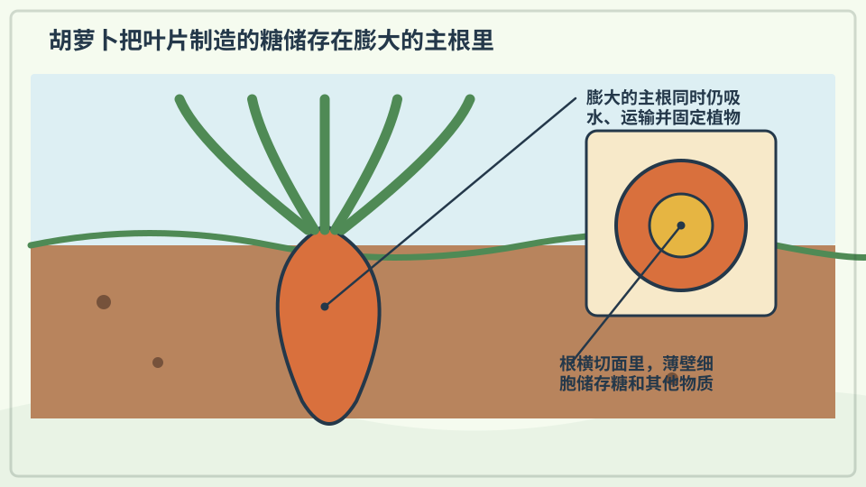

我们吃的胡萝卜主要是植物变粗的根。它在地下固定植物、吸水，还储存许多糖和其他物质。叶子在地上接阳光，根在地下慢慢长胖。

**再想一步：** 胡萝卜的橙色主要来自类胡萝卜素，其中有些可在人体内转化为维生素 A。不同品种也可能是紫、黄、红或白色。

**把知识连起来：** 胡萝卜的主根和相邻胚轴会膨大，储藏叶片制造的糖等有机物，帮助植株越过不适合开花的时期。下一生长季，这些储藏物可支持抽薹、开花和结种。地下生长既提供储藏空间，也使组织避开部分地表变化。

**再往外看：** 甜菜、萝卜和甘薯也有膨大的地下储藏器官，但来源和内部结构并不完全相同。切面与生长连接处能提供判断证据。

**容易弄混：** 胡萝卜从土里吸收的不是现成糖，橙色也不是土染出来的。糖主要由叶片光合作用制造，颜色来自组织中的类胡萝卜素。

**一起看看：** 洗净一根胡萝卜，分清上面的叶痕和下面的细根。

---

### 第 090 问｜花园里谁在互相帮忙？

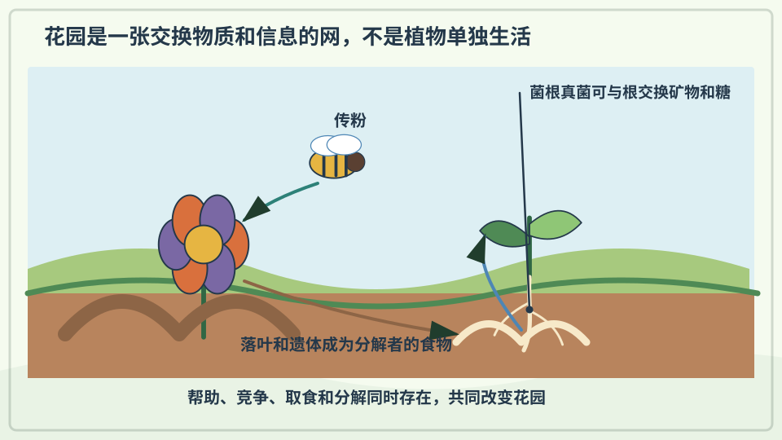

花给传粉动物花蜜和花粉，动物帮一些花传粉。落叶被真菌和小动物分解，养分回到土里。花园不是一排孤单的植物，而是许多生物共同生活的地方。

**再想一步：** 生物与阳光、水、空气和土壤共同组成生态系统。食物关系、传粉、分解和竞争彼此连接，改变其中一部分，其他部分也可能受到影响。

**把知识连起来：** 花园里，植物提供花蜜、花粉、叶片和庇护，传粉者与食草动物取得资源，捕食者控制部分种群，真菌和细菌分解残体并归还矿物质。关系既有互利、取食和竞争，也会随季节改变。把这些连起来，花园才从物种清单变成生态网络。

**再往外看：** 科学家用访花记录、食物残迹、摄像机和环境 DNA 研究网络；移走一种生物后，影响可能沿多条关系传播。

**容易弄混：** “互相帮忙”是幼儿入口，不表示每段关系都对双方有利或生物出于善意合作。生态作用看资源和繁殖结果，不能只用好坏评价。

**一起看看：** 安静观察一分钟，数数花园里有几种会动和不会动的东西。

## 单元综合观察｜画一张花园关系网

在不触碰未知生物的前提下，记录一个小区域里的植物、昆虫、落叶、土壤和真菌迹象。用线表示传粉、取食、遮阴或分解，并给不确定关系标问号。
