# 兴趣单元 11｜昆虫的身体与行为

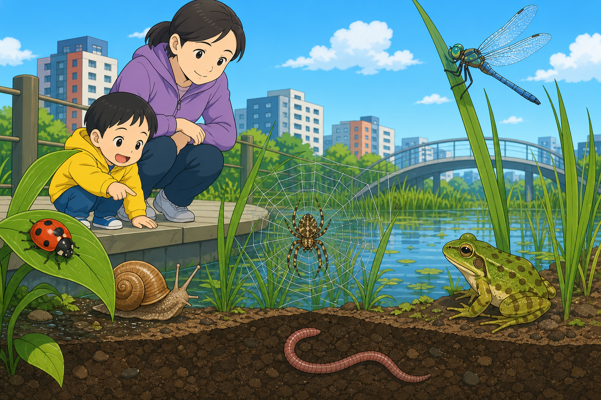

> **探索领域 04：** 昆虫与微型栖息地
>
> **核心问题：** 怎样用身体结构认出昆虫，并解释它们的取食、成长、发声、飞行和伪装？

先用头胸腹与六条足建立分类证据，再比较蚂蚁、蜜蜂、蝴蝶、甲虫、萤火虫、蚊和多种会跳会鸣的昆虫。

## 怎样沿着本单元的追问链阅读

分类看共同身体结构，行为看肌肉、感官、生命周期和群体信息，两类证据不要混为一谈。

## 追问链 11.1｜昆虫分类与蚂蚁社会

身体结构帮助分类，信息素和分工帮助蚂蚁群体协作。

### 第 091 问｜怎样认出一只昆虫？

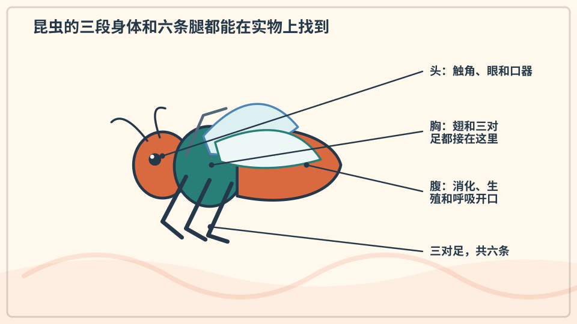

成年的昆虫有六条腿，身体分成头、胸、腹三部分。它们通常有一对触角，许多种类还有翅膀。蜘蛛、蜈蚣和蜗牛都不是昆虫。

**再想一步：** 昆虫没有体内骨骼，身体外面有坚硬的外骨骼，既支撑身体也减少水分流失。翅和腿都连接在胸部，这是辨认昆虫的重要线索。

**把知识连起来：** 昆虫成体的身体分为头、胸、腹三部分，三对足连接在胸部；触角、复眼、翅和口器则提供更细分类证据。幼虫外形可能与成虫很不一样，所以辨认还要结合生命周期。分类不是凭大小或会不会飞，而是比较一组共同结构。

**再往外看：** 甲虫、蝴蝶、蚂蚁和蜻蜓都属于昆虫，却把同一基本身体方案改造成不同口器、翅和行为。博物馆标本与清楚照片能让这些细节同时可见。

**容易弄混：** 不是所有小虫都是昆虫，昆虫也不一定有可见翅膀。蜘蛛、蜈蚣、潮虫和蚯蚓属于其他类群，不能只因身体小就放进同一类。

**一起看看：** 远远观察一只小虫，试着数腿，不用手抓。

---

### 第 092 问｜蜘蛛为什么不是昆虫？

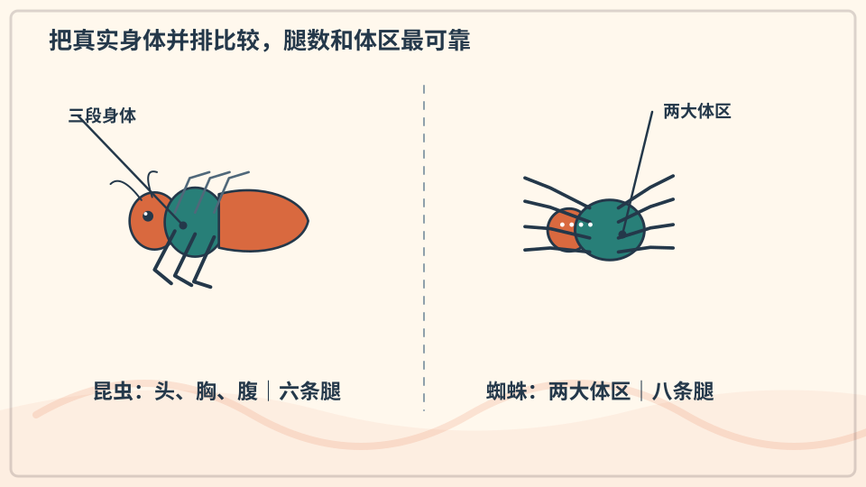

蜘蛛通常有八条腿，没有触角，身体主要分成前体和腹部两大部分。昆虫成体有六条腿，身体分三部分。它们都是节肢动物，却属于不同的类群。

**再想一步：** 分类不是只看“都很小”或“都会爬”，而是比较许多稳定的身体特征。蝎子、蜱和螨也比昆虫更接近蜘蛛。

**把知识连起来：** 蜘蛛有头胸部和腹部两大体区、四对步足，没有昆虫那样的一对触角；它们和蝎、螨同属蛛形纲。昆虫与蜘蛛都属于节肢动物，因此又共享外骨骼和分节附肢等更大层级特征。分类像一棵有远近分支的树。

**再往外看：** 比较身体分区和附肢数，是学习用可重复证据分类的好方法。幼蛛或缺足个体可能让简单计数变难，还需看其他结构。

**容易弄混：** 八条腿并不自动证明眼前动物一定是蜘蛛，也不能把蜘蛛叫作“八脚昆虫”。分类要综合身体结构，而不是只记一个数字。

**一起看看：** 在图片上分别圈出蜘蛛和昆虫的腿从哪里长出。

---

### 第 093 问｜蚂蚁为什么排成一条线？

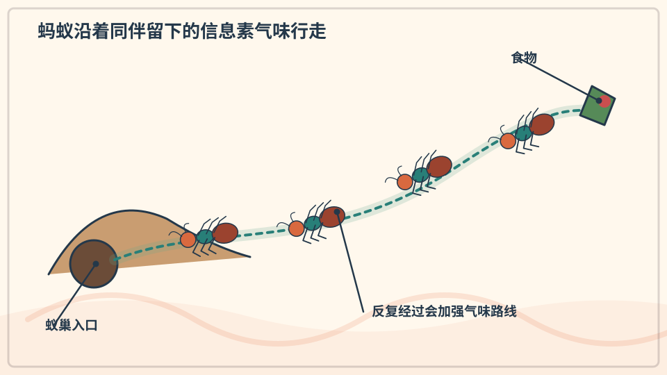

许多蚂蚁会在地面留下气味信号，叫信息素。后面的蚂蚁用触角闻到路线，便容易跟着走。通向好食物的气味小路还会被更多蚂蚁加强。

**再想一步：** 单只蚂蚁只遵循附近的简单信号，许多蚂蚁却能共同形成整齐路线，这叫群体行为。路线也会随食物消失、气味挥发或障碍出现而改变。

**把知识连起来：** 找到食物的蚂蚁回巢时可留下信息素，同伴沿气味浓度较高的路径前进，又在路上补充信号。较短或食物较好的路线得到更多往返，会被更快加强；食物消失后，气味挥发，队伍也会改变。蚁路是许多个体局部行为形成的群体图案。

**再往外看：** 这种不靠中央指挥形成路线的机制启发了网络优化算法。科学家也研究风、地面材料和不同蚂蚁物种怎样改变信息素使用。

**容易弄混：** 蚂蚁排队不是因为一只队长在前面发命令，也不表示它们永远走同一条线。气味、接触、障碍和新信息会不断重塑路线。

**一起看看：** 不放食物引诱，只观察蚂蚁队伍在哪里转弯。

---

### 第 094 问｜蚁巢里谁在做什么？

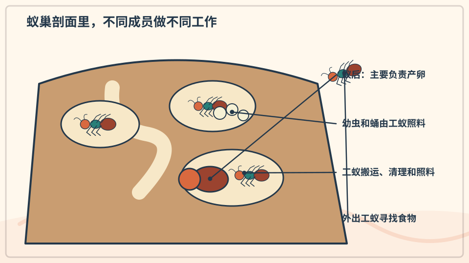

蚂蚁是社会性昆虫。一个蚁群里常有负责产卵的蚁后，还有照顾幼虫、寻找食物和维护巢穴的工蚁。不同种类的蚂蚁分工并不完全一样。

**再想一步：** 分工会随年龄、身体结构和巢群需要变化，不像人类每天固定领一份工作。蚁群通过触碰、气味和食物交换传递信息。

**把知识连起来：** 蚁后主要承担繁殖，工蚁会育幼、取食、维护巢穴或防御；同一工蚁的任务还可能随年龄和群体需要改变。个体通过气味、触碰和食物交换取得信息，群体分工因而能动态调整。社会结构是许多互动的结果。

**再往外看：** 不同蚂蚁物种的群体大小、蚁后数量和分工方式差别很大。标记个体并长期观察，才能知道谁在什么时候做什么。

**容易弄混：** “蚁后”不是像人类君王一样管理每只蚂蚁，工蚁也没有每天固定不变的职业表。名称描述主要功能，不表示有人的制度和想法。

**一起看看：** 从安全距离找找搬东西的蚂蚁和空手走的蚂蚁。

## 追问链 11.2｜飞行、取食、变态与发光

翅、口器、外骨骼和生命周期让昆虫以不同方式利用环境。

### 第 095 问｜蜜蜂为什么嗡嗡响？

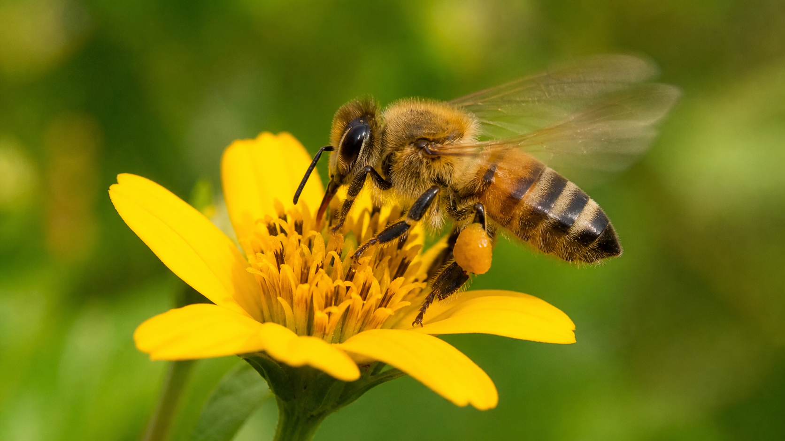

*写实观察图：可辨认蜜蜂的头、胸、腹、触角、足和翅；翅快速振动推动空气，因此会产生嗡嗡声。*

蜜蜂飞行时，翅膀快速拍动，让周围空气振动。振动传到耳朵，就成了嗡嗡声。不同大小和飞行状态的蜜蜂，声音也会有差别。

**再想一步：** 声音来自物体振动，振动越快，音调通常越高。蜜蜂还会振动飞行肌肉来取花粉或调节巢内温度，不是所有嗡声都只为向前飞。

**把知识连起来：** 蜜蜂飞行肌肉使翅膀快速往复，推动周围空气形成压力波；振翅、胸部振动和蜂巢活动都可能产生声音。频率和音量会随飞行状态、体型与行为改变。耳朵听到的嗡声，是机械振动通过空气传来的结果。

**再往外看：** 蜜蜂还会用振动交流，例如某些舞蹈把方向信息与巢脾振动结合。研究声谱能在不抓取个体的情况下观察蜂群活动。

**容易弄混：** 嗡声不是蜜蜂用嘴一直唱歌，也不能只凭声音判断它一定要攻击。声音说明身体或翅在振动，行为意图还需结合距离和情境。

**一起听听：** 隔着安全距离听昆虫飞过，绝不靠近蜂巢。

---

### 第 096 问｜蝴蝶用什么喝花蜜？

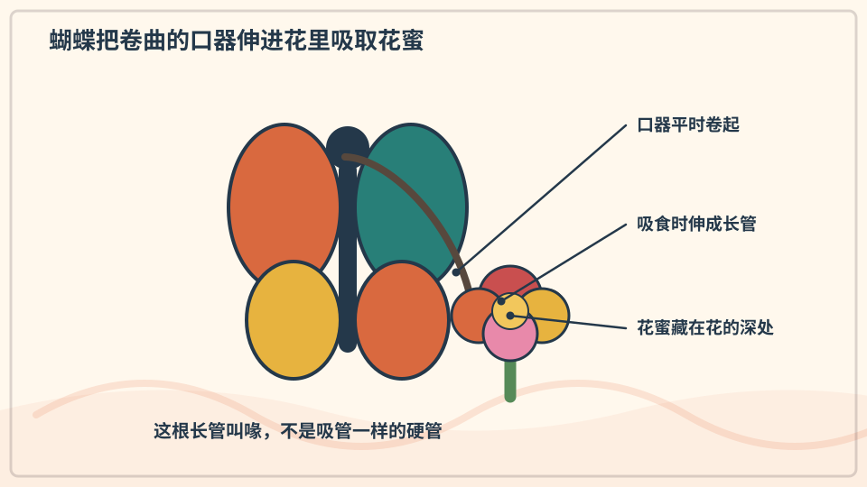

许多蝴蝶有一根能卷起来的口器，叫喙。停在花上时，喙伸开，液体沿细小通道进入口中。不用时，它又像卷尺一样收起来。

**再想一步：** 蝴蝶并不是用喙像吸管那样只靠“吸”，液体运动还受到毛细作用、肌肉和压力变化影响。不同蝴蝶取食的液体也不只花蜜。

**把知识连起来：** 蝴蝶的口器由细长结构组成，平时卷起，取食时伸开并依靠液体压力、肌肉和毛细作用吸取花蜜等液体。足和口器上的化学感受器还能帮助判断食物。不同蝴蝶的口器长度与常访问的花形会相互匹配。

**再往外看：** 蛾、蚊和其他昆虫也有由相似基本部件改造出的不同口器，比较它们可以理解结构如何随食物来源分化。

**容易弄混：** 蝴蝶不是用口器像吸尘器一样主动抽出所有花蜜，也不是完全不用足来“尝”。液体移动和食物判断由多种结构共同完成。

**一起看看：** 从远处观察蝴蝶停下时，口边有没有细细的卷管。

---

### 第 097 问｜毛毛虫怎样变成蝴蝶？

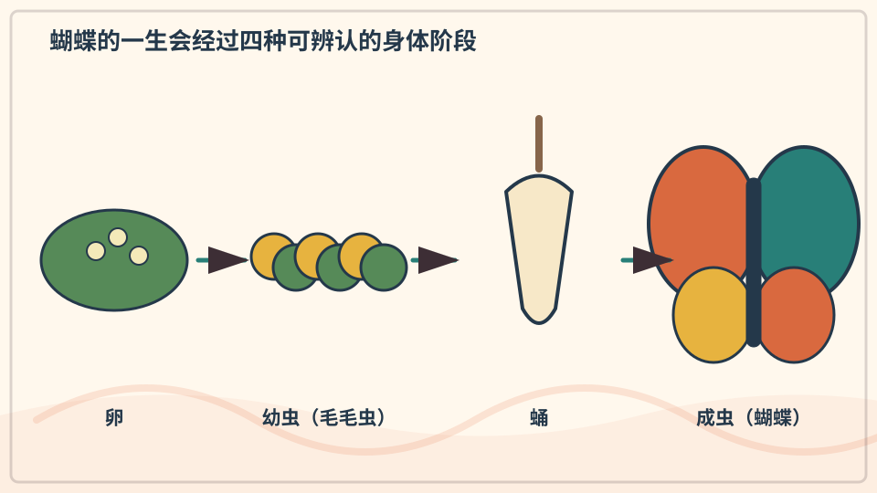

蝴蝶一生会经过卵、幼虫、蛹和成虫。毛毛虫主要吃和长大，进入蛹后，身体内部重新组织，最后成为有翅的成虫。这个过程叫完全变态。

**再想一步：** 蛹里不是一团没有结构的“汤”，许多组织会被保留、改造或新建。激素控制蜕皮和变态的时机，让不同生命阶段适合不同任务。

**把知识连起来：** 毛毛虫主要取食和生长，多次蜕皮；进入蛹期后，许多幼虫组织被重组，成虫的翅、复眼和生殖结构逐渐形成。身体不是在蛹里完全化成无结构的汤，部分组织和细胞群会保留并指导重建。完全变态把取食期与繁殖扩散期分开。

**再往外看：** 甲虫、苍蝇和蜜蜂也经历卵、幼虫、蛹、成虫，蜻蜓和蚱蜢则没有同样的蛹期。生命周期是昆虫分类和生态的重要线索。

**容易弄混：** 毛毛虫不是死掉后被另一只蝴蝶替换，也不是每种昆虫都会结蛹变成有翅成虫。变态类型必须按具体类群判断。

**一起看看：** 用四张纸画出卵、毛毛虫、蛹和蝴蝶，再按顺序排好。

---

### 第 098 问｜甲虫背上的硬壳是什么？

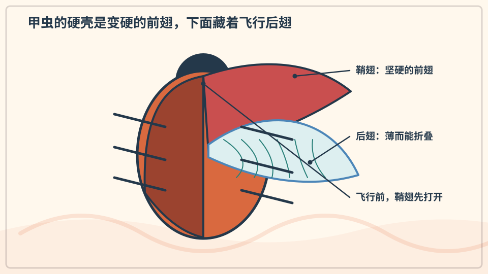

甲虫前面一对翅变成硬硬的鞘翅，像两扇保护门。飞行时，鞘翅打开，下面较薄的后翅展开并拍动。落地后，后翅再折回去。

**再想一步：** 鞘翅能保护飞行翅和腹部，也减少身体失水。甲虫因此能适应许多环境，但不同甲虫的鞘翅形状和飞行能力差别很大。

**把知识连起来：** 甲虫前翅变成坚硬的鞘翅，合拢时覆盖较柔软的后翅和腹部；飞行时鞘翅抬起，后翅展开拍动。硬壳同时提供防护并改变空气动力和体重分配。甲虫巨大的多样性部分来自这种可保护身体又保留飞行的结构组合。

**再往外看：** 有些甲虫鞘翅融合，已经不再飞行；另一些水生甲虫还能在鞘翅下携带空气。相同结构会因生活环境承担新功能。

**容易弄混：** 背上的硬片不是另外套上的外壳，也不是甲虫全部外骨骼。它主要是改造后的前翅，身体其他部位同样有外骨骼。

**一起看看：** 在清楚照片里找甲虫背上的中间缝和展开的薄翅。

---

### 第 099 问｜瓢虫有几个点就是几岁吗？

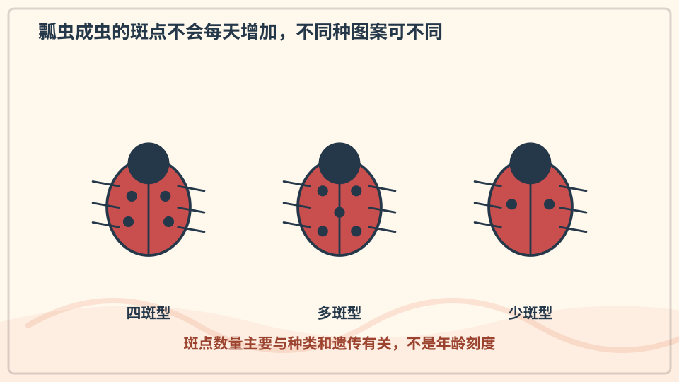

不是。瓢虫斑点的数量和花纹主要由种类和遗传决定，不能用来数年龄。有些瓢虫有很多点，有些没有明显斑点，也不一定都是红色。

**再想一步：** 醒目的红、黄、黑色常是警戒色，提醒捕食者它可能不好吃。分类时科学家会同时比较花纹、身体结构、生活史和遗传信息。

**把知识连起来：** 瓢虫鞘翅上的斑点数量和形状主要由物种与遗传决定，个体成熟后不会每年增加一个。鲜明红黑图案常能警告捕食者它味道不好或含防御化学物。年龄要通过生命周期阶段等其他证据判断。

**再往外看：** 世界上有许多瓢虫物种，颜色可为红、橙、黄甚至黑，斑点也可能很少、很多或没有。图鉴辨认要综合胸部花纹和体形。

**容易弄混：** 不能数点判断瓢虫几岁，也不能因为叫“七星”就认为每只都有七点。名称常指某一物种的典型外观，不是年龄刻度。

**一起看看：** 在不同瓢虫图片中找颜色和点数的变化。

---

### 第 100 问｜萤火虫为什么会发光？

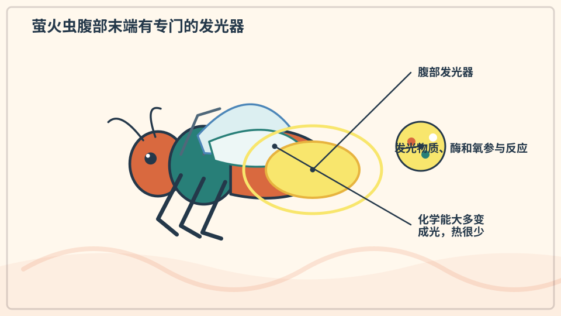

萤火虫腹部有能发光的器官。里面的物质在酶帮助下与氧气反应，把化学能变成光。它产生的热很少，所以常被叫作冷光。

**再想一步：** 不同萤火虫用特定闪光节奏寻找同类或传递信号，幼虫发光也可能警告捕食者。光不是储存在身体里的“小灯泡”，而是持续化学反应的结果。

**把知识连起来：** 萤火虫发光器中的荧光素在荧光素酶、氧气和细胞能量参与下反应，把较多能量转成光、较少变成热。神经和气体供应能控制闪光节律。不同物种用特定闪光模式寻找同类或交流。

**再往外看：** 海洋生物、真菌和细菌也独立演化出多种生物发光化学。冷光机制启发了医学成像和基因活动标记。

**容易弄混：** 萤火虫不是肚子里装着小灯泡，也不是所有阶段、所有物种都会以同样方式闪。发光是细胞内受控制的化学反应。

**一起看看：** 夜间只在大人陪同下远看，不捕捉也不装进瓶子。

## 追问链 11.3｜叮咬、转弯、跳跃、鸣叫与伪装

器官形状、肌肉运动和自然选择共同解释多样行为。

### 第 101 问｜为什么有的蚊子会叮人？

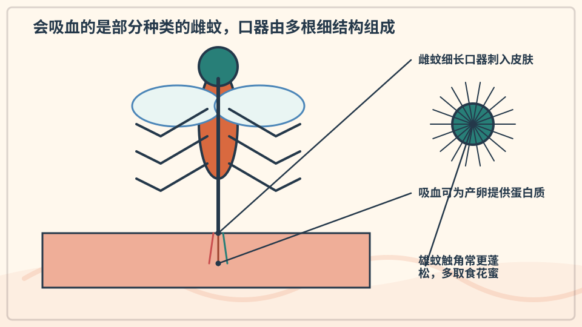

许多蚊种的雌蚊需要从血液中得到制造卵所需的营养，因此会寻找人或其他动物。雄蚊通常不吸血，主要取食花蜜等糖分。并不是每种蚊子都爱叮人。

**再想一步：** 蚊子能感受呼出的二氧化碳、体温和气味，口器由多根细小结构组成。叮咬后的痒主要与身体对蚊子唾液的免疫反应有关。

**把知识连起来：** 许多蚊种中，雌蚊需要血液里的蛋白质等营养来形成一批卵；雌雄成虫平时都可从花蜜等来源获得糖。口器刺入皮肤后注入的唾液会帮助取食，也可能引起免疫反应和瘙痒。是否传播病原体取决于蚊种、地区和病原循环。

**再往外看：** 清除积水、使用合适纱网和遵循当地公共卫生建议，比追打一只蚊子更能降低某些风险。科学家还研究蚊的嗅觉和生命周期来设计控制方法。

**容易弄混：** 不是所有蚊子都会叮人，也不是叮人的都一定带病。雄蚊通常不吸血，风险判断不能只看到一个小包就下结论。

**一起记住：** 不抓挠叮咬处；很肿或不舒服时告诉大人。

---

### 第 102 问｜蜻蜓为什么能突然转弯？

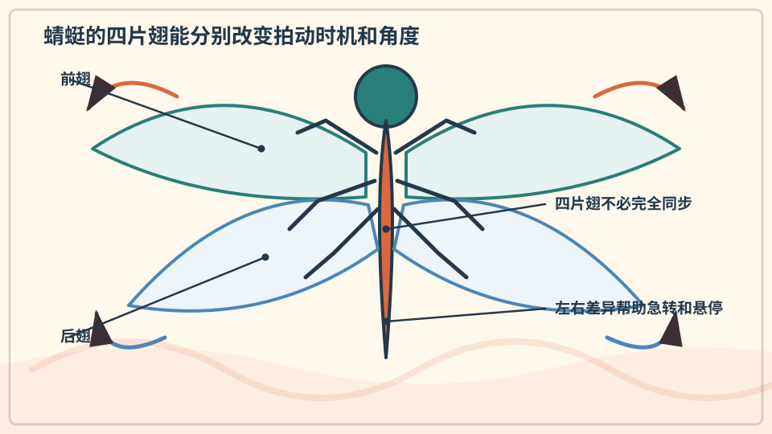

蜻蜓有两对长翅，能分别控制拍动的时间和角度。它可以悬停、倒退和迅速转弯，在空中追逐小虫。大大的复眼也帮助它发现移动目标。

**再想一步：** 每只复眼由许多小眼组成，对快速变化特别敏感。翅膀制造的升力和推力不断调整，四翅配合让蜻蜓拥有很强的机动性。

**把知识连起来：** 蜻蜓的两对翅能在一定程度上独立调节拍动相位和角度，改变升力、推力与转动力矩。复眼提供宽广视野，神经系统快速估计目标运动；身体和腹部姿态也帮助转向。灵活飞行来自感知与四翼控制的闭环。

**再往外看：** 高速摄影和气流可视化揭示翅周围不断形成和脱落的涡旋，也启发小型飞行器设计。

**容易弄混：** 蜻蜓急转并不是翅膀像直升机螺旋桨一样整圈旋转，也不只靠尾巴当方向舵。四片翅和身体姿态共同改变空气作用力。

**一起看看：** 在水边以外的安全空地远看蜻蜓怎样改变方向。

---

### 第 103 问｜蚱蜢为什么跳得远？

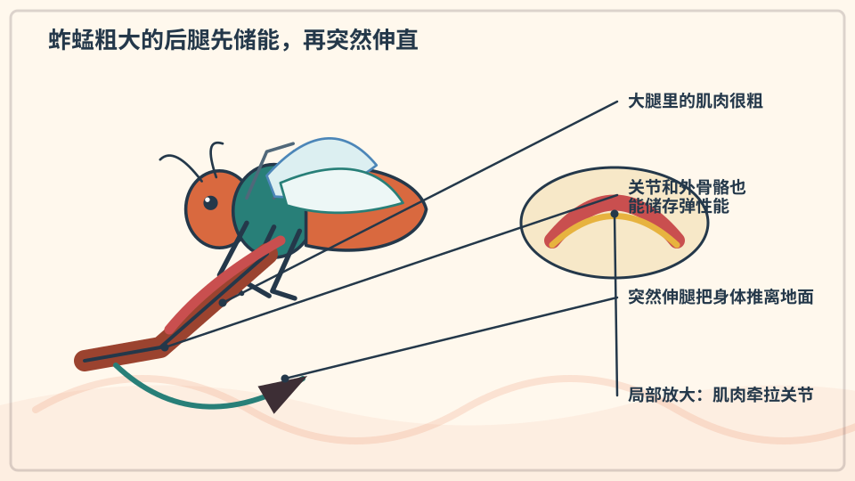

蚱蜢的后腿又长又粗，里面有强壮肌肉。起跳前，腿部结构会储存弹性能量。后腿突然伸直时，能量快速释放，把身体推离地面。

**再想一步：** 这像先弯曲再弹开的弹簧，但真正参与的是肌肉、关节和外骨骼。轻小的身体也让同样的推力产生更明显的加速度。

**把知识连起来：** 蚱蜢粗大的后腿包含长杠杆和能储存弹性能的外骨骼结构。肌肉较慢地把结构拉到蓄力状态，锁定释放后，能量在很短时间内推动腿伸直。把储能和释放分开，能产生超过肌肉即时输出的功率。

**再往外看：** 跳蚤、蝉和螳螂虾也利用不同弹性结构放大快速动作，生物力学家据此研究小型跳跃机器人。

**容易弄混：** 跳得远不只是因为肌肉“特别有力”，也不是腿越长必然越远。杠杆比例、弹性储能、起跳角度和空气阻力都参与结果。

**一起看看：** 只观察蚱蜢起跳前后腿怎样折叠，不追赶它。

---

### 第 104 问｜蟋蟀怎样“唱歌”？

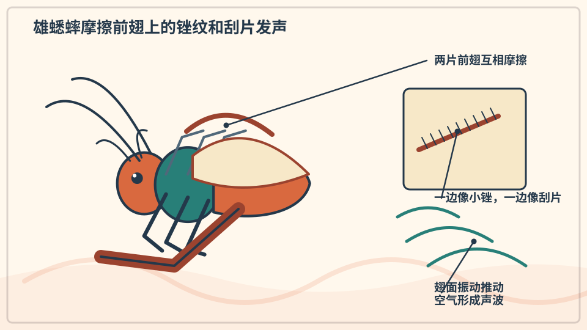

许多雄蟋蟀会摩擦两片前翅上的特殊结构，让翅膀振动发声。这叫摩擦发音。它们用不同节奏吸引同类或警告别的雄虫。

**再想一步：** 蟋蟀鸣叫的快慢常受温度影响，因为肌肉和神经活动会随温度变化。声音是行为信号，不是蟋蟀用嘴唱出的歌。

**把知识连起来：** 许多蟋蟀用一侧前翅上的锉状结构摩擦另一侧的刮片，周期振动再由翅面共鸣区放大。雄虫常用鸣声吸引配偶或与其他雄虫互动，温度会影响肌肉动作和鸣叫节律。声音的频率和脉冲模式具有物种信息。

**再往外看：** 录音后查看声谱，可以比较人耳难以分辨的节律；生态学家还用自动录音监测昆虫群落变化。

**容易弄混：** 蟋蟀通常不是用嘴唱歌，也不是所有听到的夜间虫声都来自蟋蟀。蝉、螽斯和蛙有不同发声器官。

**一起听听：** 安静听一会儿，试着模仿一段重复节奏。

---

### 第 105 问｜螳螂为什么把前腿举起来？

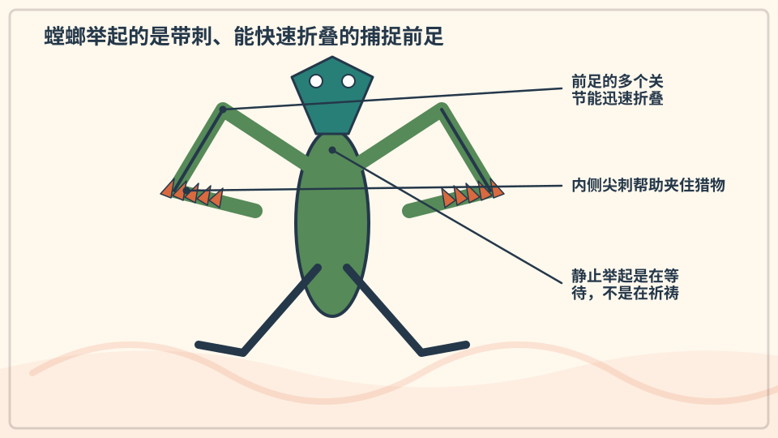

螳螂的前足像带刺的折叠夹子，适合迅速抓住猎物。等待时，它把前足收在胸前，看起来像举着手。头部还能转动较大角度来观察周围。

**再想一步：** 抓捕时，视觉先估计目标距离，肌肉再让前足快速弹出。伪装、耐心等待和突然攻击共同组成它的捕食策略。

**把知识连起来：** 螳螂前足演化成带刺的捕捉足，收拢时像折叠杠杆，出击时快速伸展并夹住猎物。大复眼和可转动头部帮助估计方向与距离，静止伏击则减少被发现。姿势是取食结构的待机状态。

**再往外看：** 不同螳螂会模拟叶、花或枯枝，展示捕食与避免被捕食可以同时影响体色和姿态。

**容易弄混：** 举起前腿不是在祈祷或向人打招呼，也不表示它随时都会攻击人。拟人化名称容易遮住真实的捕捉功能。

**一起看看：** 从远处找螳螂身体颜色和叶子、树枝像不像。

---

### 第 106 问｜竹节虫为什么像树枝？

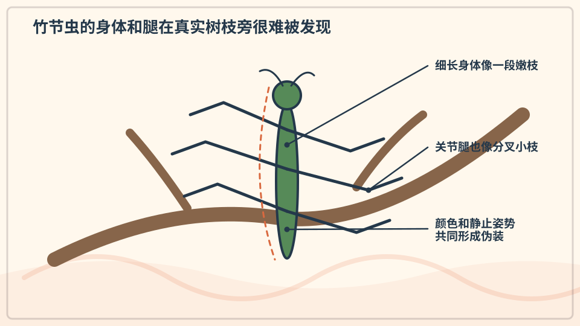

竹节虫细长的身体、颜色和姿势很像枝条。有些还会随着风轻轻摇摆，让自己更不显眼。这种减少被发现机会的办法叫伪装。

**再想一步：** 更像环境的个体较可能躲过捕食并留下后代，许多代后相关特征会变得常见，这是自然选择的一种结果。伪装并不保证永远不被发现。

**把知识连起来：** 竹节虫细长身体、分节腿和颜色使轮廓接近枝条，有些还会随风轻轻摇摆。较难被捕食者发现的个体更可能存活并留下后代，经过许多代，相关特征会在种群中增加。伪装是变异、遗传和筛选共同形成的结果。

**再往外看：** 伪装效果取决于背景和观察者视觉；对人眼像树枝，不一定对鸟类的颜色视觉同样完美。实验会在不同背景比较被发现概率。

**容易弄混：** 竹节虫不是努力练习后把自己变成树枝，也不是每只个体都完全隐形。自然选择作用于世代间的差异，不是单个动物按需要改造身体。

**一起看看：** 在照片里先看三秒，再指出竹节虫藏在哪里。

## 单元综合观察｜做一张不抓虫的昆虫证据卡

用清楚照片观察一只昆虫，标出头、胸、腹、足和可见的翅；看不清的部分写“不确定”。不碰蜂巢，不徒手抓陌生昆虫。
