# 十一月：家里藏着科学

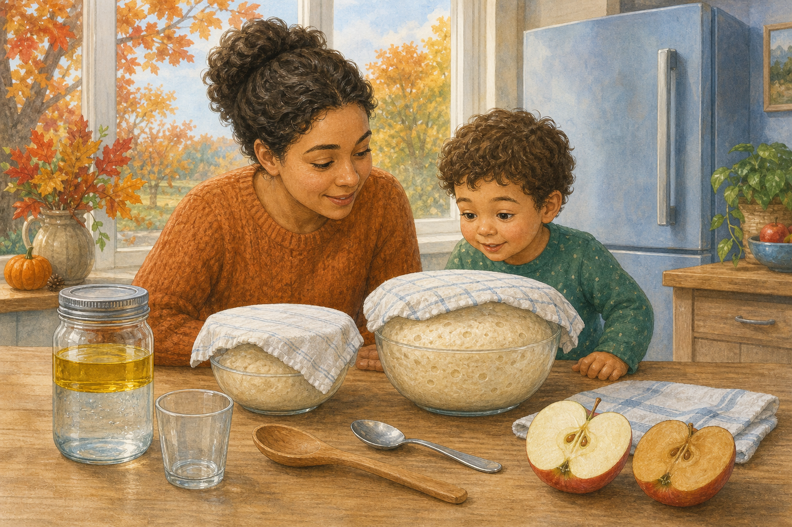

## 第 305 天｜固体、液体和气体哪里不同？

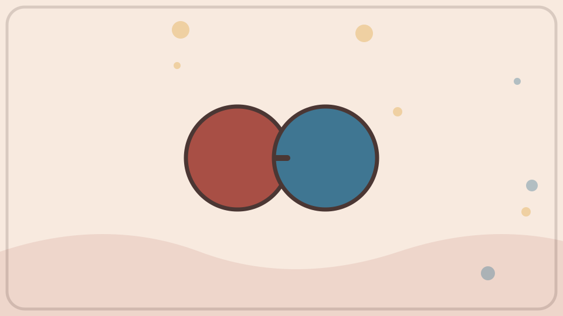

固体通常保持自己的形状，液体会流动并贴合容器，气体会扩散并充满可到达的空间。水可以是冰、液态水和水汽。物质状态会随温度和压力改变。

**再想一步：** 三种状态里的粒子都在运动，只是排列、距离和相互吸引不同。还有等离子体等其他状态，所以“三态”是日常环境中最常见的入门分类，不是全部。

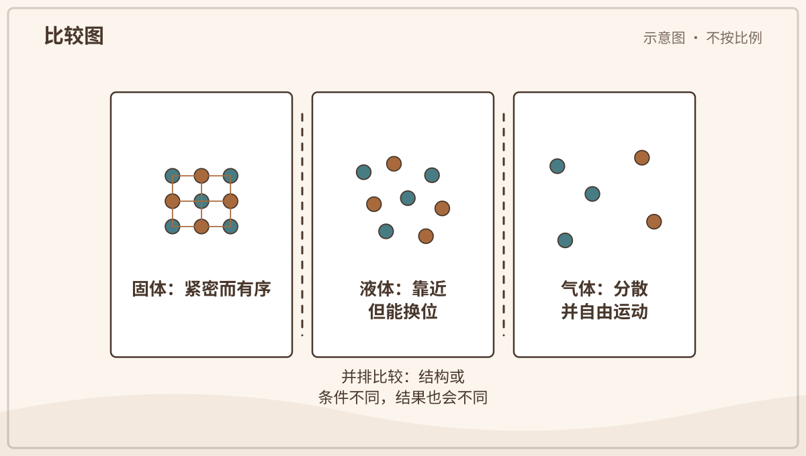

*图解：固体粒子多在固定位置附近振动；液体能换位流动；气体相距更远。*

**一起看看：** 找一件固体、一杯液体和装着空气的封口袋来比较。

---

## 第 306 天｜东西真是由小粒子组成的吗？

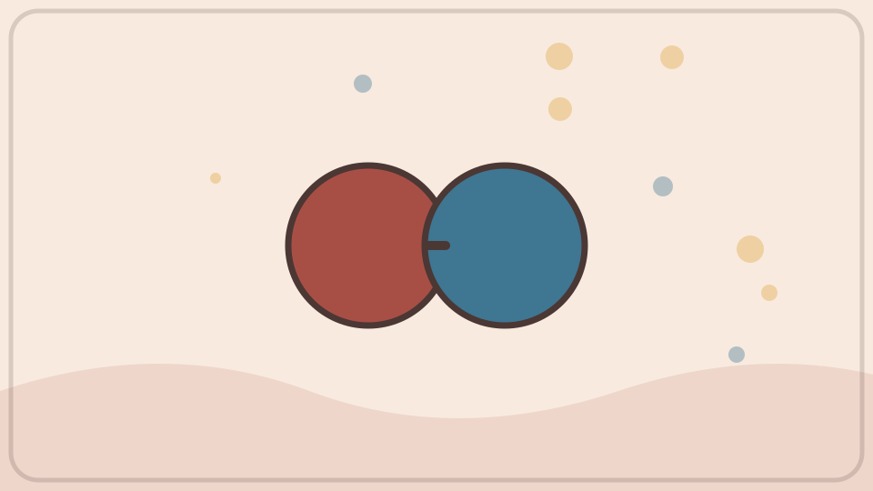

我们周围的物质由原子组成，许多原子结合成分子。它们小得不能用普通眼睛或放大镜直接看见，却能用实验和特殊仪器研究。不同排列会形成不同物质。

**再想一步：** 原子又含原子核和电子，但示意图里的彩球并非真实颜色和比例。科学模型挑出重要关系来解释现象，不等于给微观世界拍了一张普通照片。

**一起想想：** 一张地图不等于城市本身，原子模型与真实原子也有什么相似关系？

---

## 第 307 天｜冰融化后还是原来的水吗？

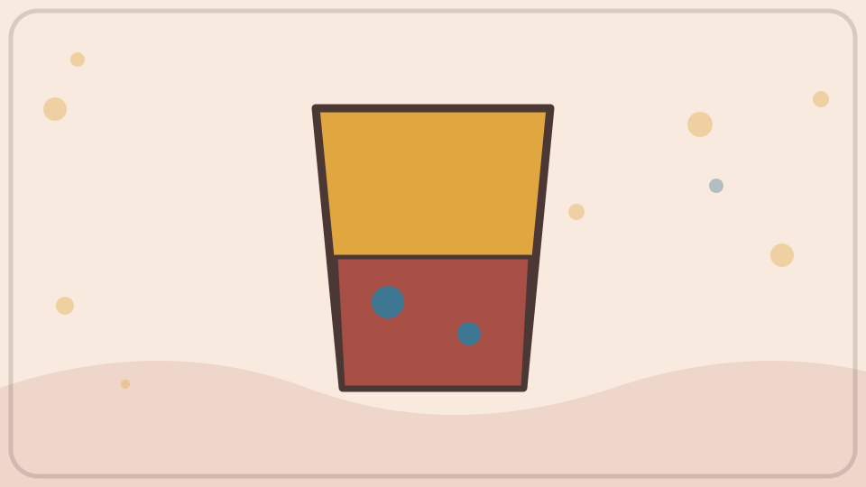

是。冰融化时，水分子的排列和运动方式改变，但每个水分子的组成没有变。这叫物理变化。若物质变成新分子，例如铁生锈，就是化学变化。

**再想一步：** 物理变化和化学变化不是只凭能不能倒回去判断；有些物理变化难恢复，有些化学反应可逆。关键是物质的化学组成是否发生变化。

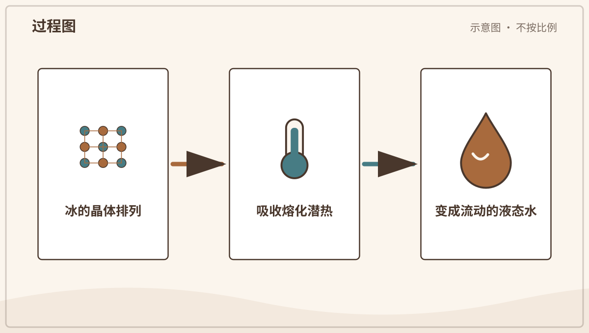

*图解：冰在熔点附近吸收能量，较整齐的晶体结构被破坏，分子仍是水分子。*

**一起看看：** 比较融冰、撕纸和烤面包，先猜哪些产生了新物质。

---

## 第 308 天｜水滴为什么喜欢变圆？

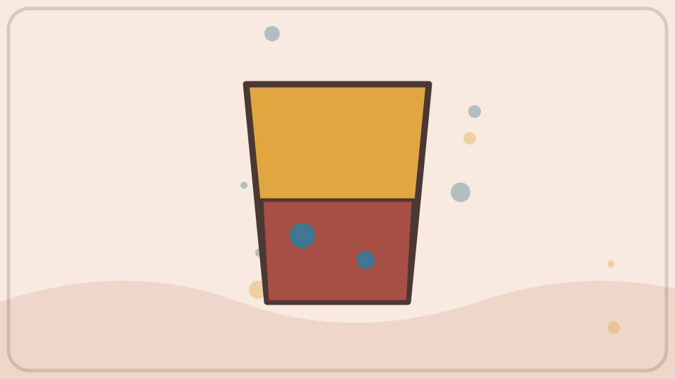

水分子彼此吸引，表面的分子受到向内的拉力，水面像一层有张力的薄皮。相同体积下，球形表面积最小，所以小水滴倾向变圆。重力会把大水滴压扁。

**再想一步：** 这种现象叫表面张力。肥皂会改变水分子在表面的相互作用，降低表面张力，让水更容易铺开并进入细小缝隙。

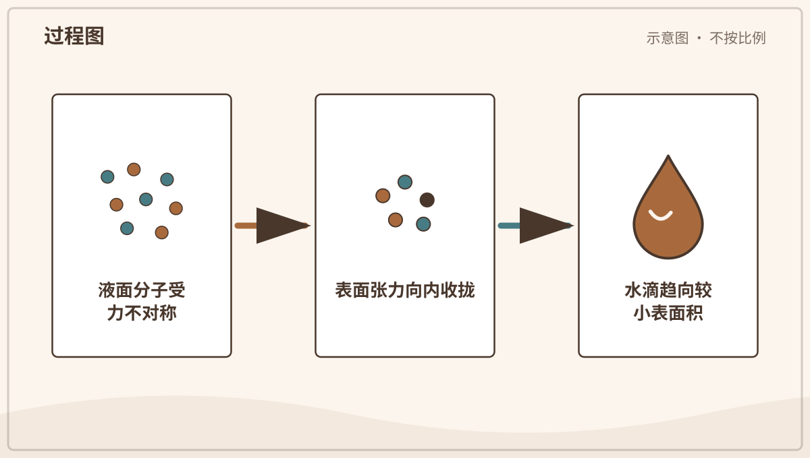

*图解：液面分子受力不对称，表面张力倾向缩小表面积，小水滴因此接近球形。*

**一起试试：** 用滴管在防水盘上放大小水滴，由大人保管滴管。

---

## 第 309 天｜油和水为什么会分层？

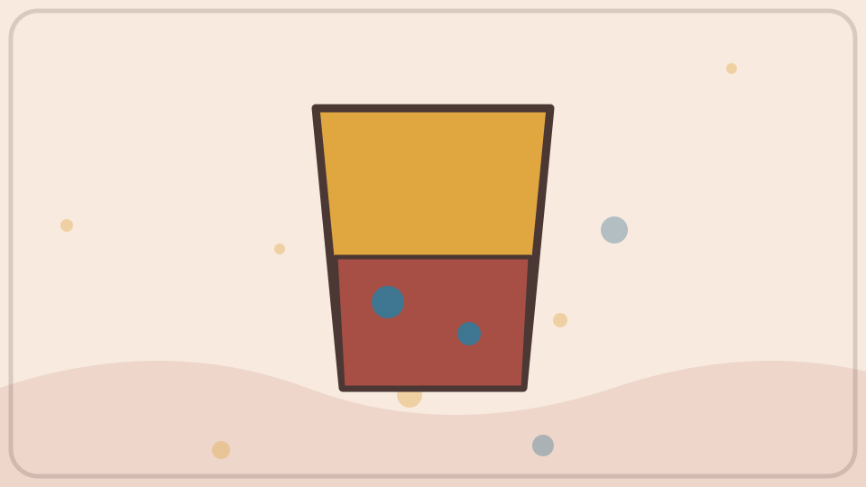

水分子彼此吸引的方式和油分子不同，两者不容易均匀混合。多数食用油密度又比水小，因此聚成一层浮在上面。摇晃后的小油滴会慢慢重新合并。

**再想一步：** 能让油水较稳定混合的物质叫乳化剂，它的一端亲水、一端亲油。蛋黄中的卵磷脂可帮助做蛋黄酱，洗涤剂则帮助水带走油污。

*图解：水分子彼此吸引，油分子也更愿与油相聚；密度差又决定哪层在上。*

**一起看看：** 由大人在密封瓶装水和少量油，摇匀后静置观察。

---

## 第 310 天｜盐放进水里去哪儿了？

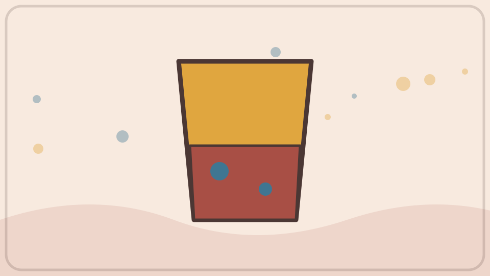

盐晶体接触水后，会分开成带电的钠离子和氯离子，被水分子包围并散开。眼睛看不见单个离子，盐却仍在水中。水蒸发后，盐可以重新结晶。

**再想一步：** 溶解不是把物质变成“什么都没有”，总质量仍保存。水能溶多少盐有上限，达到饱和后，再加的盐会留在底部。

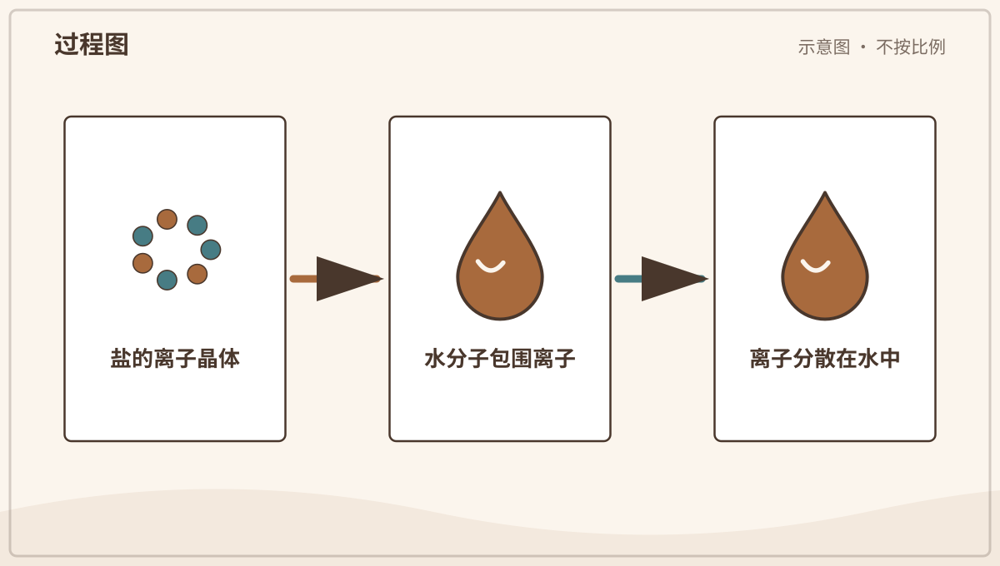

*图解：盐晶体进入水后分成带电离子，水分子包围离子并把它们分散开。*

**一起看看：** 由大人配一小杯盐水并蒸发在安全处，不品尝实验液体。

---

## 第 311 天｜糖溶了，为什么还能尝到甜？

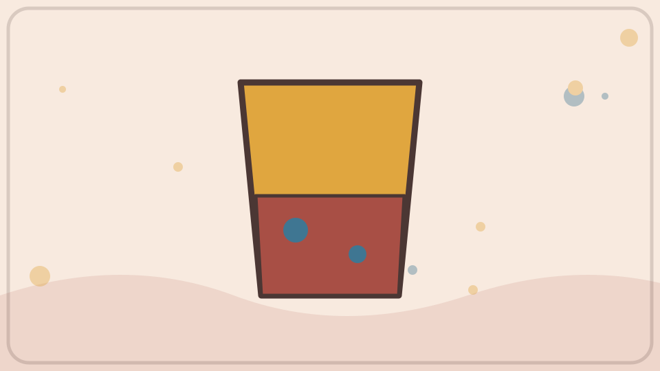

糖晶体在水中分散成单个糖分子，太小而看不见。喝入口中时，糖分子仍能碰到味觉受体，所以水有甜味。透明不等于里面没有溶解物。

**再想一步：** 糖溶解时分子本身通常没有被拆成离子，和食盐的溶解方式不同。测量溶液质量或蒸发水，都能证明糖仍然存在。

**一起想想：** 还有哪些看不见却能用味道、气味或测量发现的东西？

---

## 第 312 天｜为什么温水常让糖溶得更快？

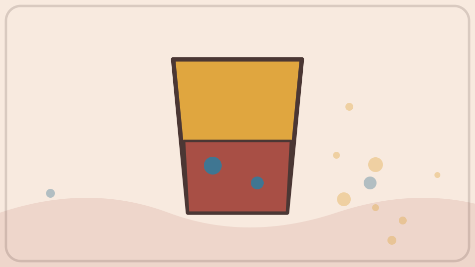

温度较高时，水分子运动更快，碰撞糖晶体并带走糖分子的速度通常增加。搅拌也会把已含很多糖的水移开，换来新水接触晶体。因此溶解更快。

**再想一步：** “溶得更快”和“最终能溶更多”是两个问题。许多固体在热水中溶解度更高，但不是所有物质都这样，气体在热水中反而常较难保持溶解。

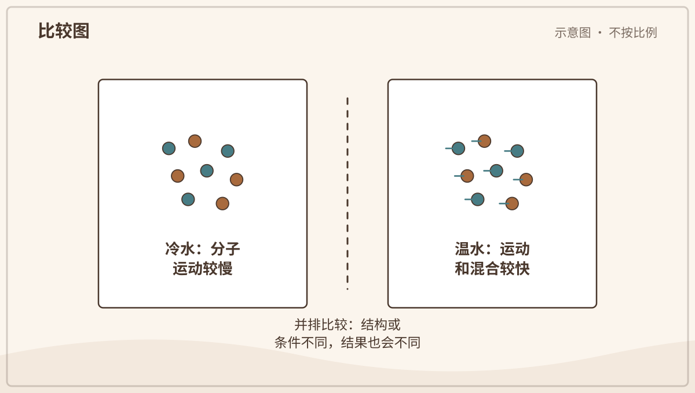

*图解：温水中的分子通常运动更快，碰撞和混合更频繁，许多固体便溶得更快。*

**一起试试：** 只用冷水和温水，由大人确认不烫，比较同量糖消失速度。

---

## 第 313 天｜牛奶为什么是白色的？

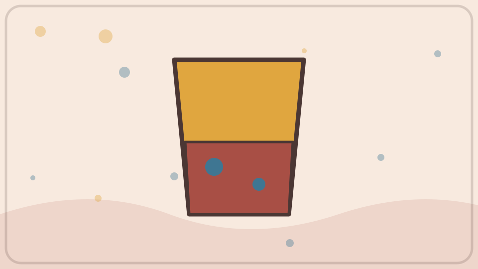

牛奶里有水、脂肪小滴、蛋白质、乳糖和矿物质。脂肪滴与蛋白质颗粒把许多颜色的光向四周散射，混在一起看起来白。脂肪多少会影响颜色和口感。

**再想一步：** 牛奶是一种胶体和乳状液，颗粒比分子大，却小到不容易迅速沉降。均质处理把大脂肪滴打成小滴，减少奶油浮到上层。

**一起看看：** 在光线下比较牛奶和清水的透光，不喝放久的实验牛奶。

---

## 第 314 天｜面包里的小洞是谁吹的？

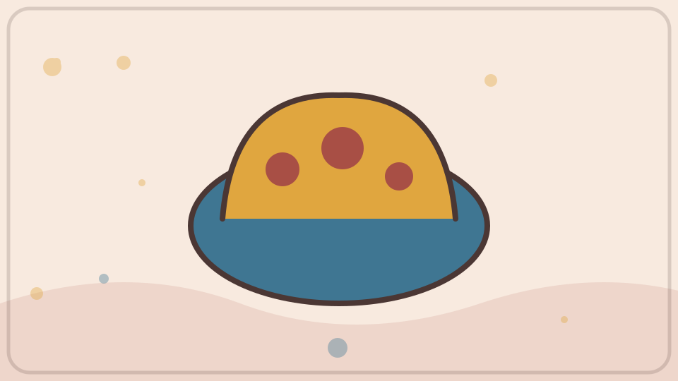

酵母吃面团里的糖，通过发酵产生二氧化碳和其他物质。气体被有弹性的面筋网络困住，形成许多气泡。烘烤时气泡膨胀并固定成孔洞。

**再想一步：** 酵母是真菌，发酵在缺氧条件下把糖的一部分能量转成可用形式。温度太低反应慢，太高会伤害酵母；盐、糖和面团结构也影响发酵。

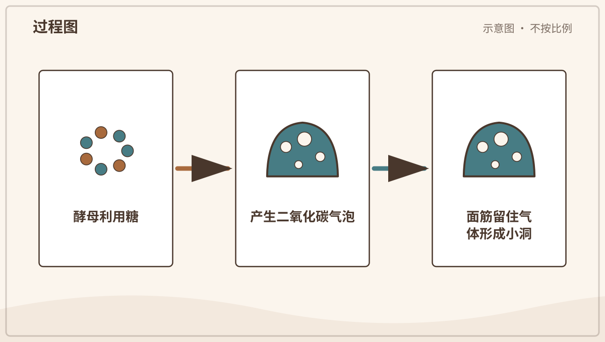

*图解：酵母分解面团里的糖，产生二氧化碳；有弹性的面筋网络把气泡留住。*

**一起看看：** 由大人切开不同面包，比比孔洞大小和分布。

---

## 第 315 天｜揉面为什么越揉越有弹性？

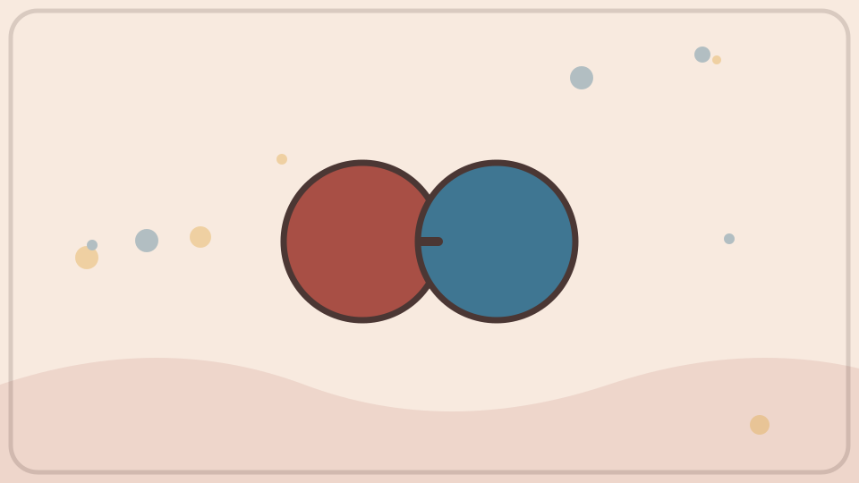

小麦粉加水后，其中一些蛋白质形成面筋网络。揉面让蛋白质更充分接触、拉伸并连接，面团就能延展又回缩。网络还能兜住发酵产生的气体。

**再想一步：** 面筋不是一根现成橡皮筋，而是麦谷蛋白和醇溶蛋白等共同形成的动态网络。水量、揉制、静置、盐和面粉种类都会改变质地。

**一起试试：** 和大人揉一小团可食用面团，前后各拉一次比较。

---

## 第 316 天｜鸡蛋加热后为什么变硬？

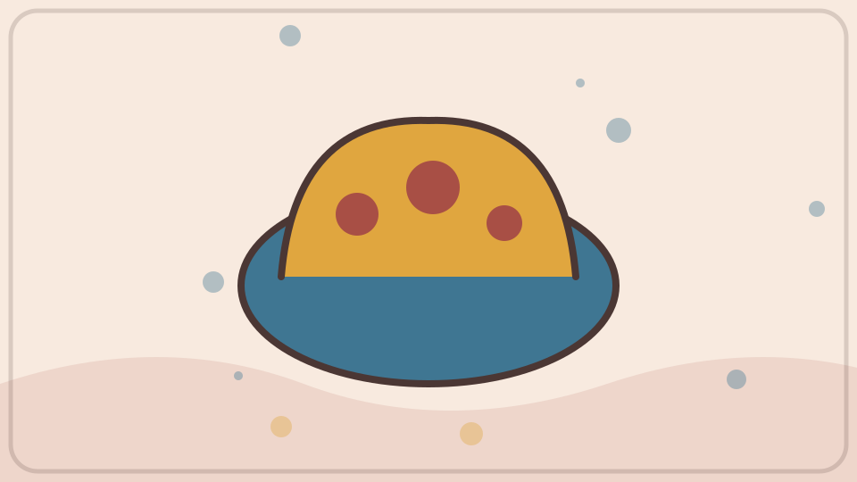

生鸡蛋里的蛋白质折叠成特定形状，分散在水中。加热让它们展开并互相连接，形成网状结构，把水困住，蛋白便从透明流体变成白色固体。

**再想一步：** 这种形状改变叫蛋白质变性，连接成网络叫凝固。它通常难以恢复，因为许多新相互作用已经形成；酸和搅打也能让蛋白质结构变化。

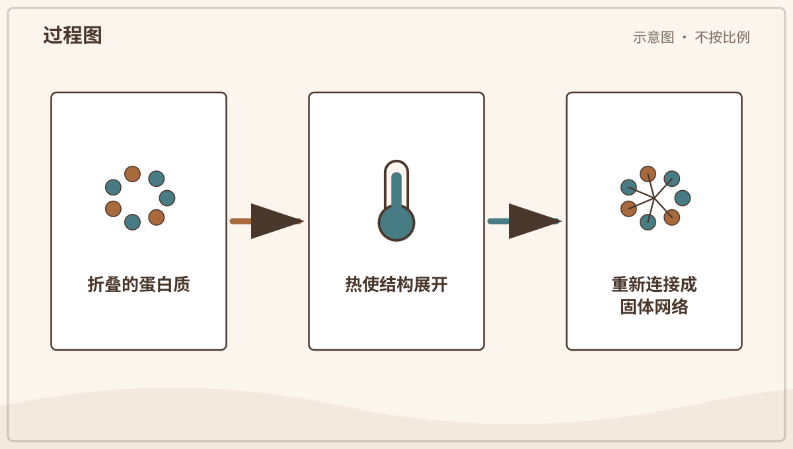

*图解：加热使蛋白质展开，展开的分子互相连接成网络，蛋液便由流动变为凝固。*

**一起看看：** 烹饪只由大人完成，孩子比较冷却后的熟蛋白和蛋黄。

---

## 第 317 天｜苹果切开为什么会变褐？

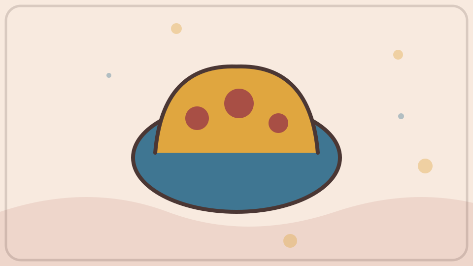

切开苹果会破坏细胞，让酶、含酚物质和空气中的氧接触。酶帮助它们发生反应，形成褐色物质。低温、酸或减少接触空气能减慢变化。

**再想一步：** 这叫酶促褐变，不等于苹果立刻腐烂或生锈。柠檬汁的酸性和抗氧化物质会影响反应，但食物是否安全仍要看储存时间、气味和卫生。

**一起看看：** 由大人准备两片苹果，一片涂少量柠檬汁，比较颜色。

---

## 第 318 天｜玉米粒为什么会“砰”地开花？

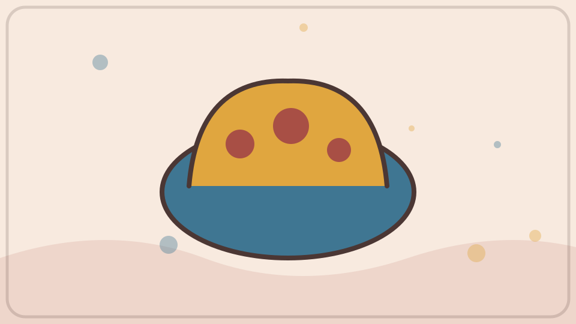

爆米花玉米有坚硬外壳，内部含少量水和淀粉。加热时水变成高压水汽，压力撑破外壳；热软的淀粉迅速膨胀，冷却后变成白色松脆结构。

**再想一步：** 只有水分、外壳强度和淀粉结构合适的玉米品种容易爆开。没爆的“老头豆”可能因裂缝漏气或含水量不合适。

**一起记住：** 加热与开盖由大人操作，远离热锅、热油和蒸汽。

---

## 第 319 天｜冰箱怎样把食物变凉？

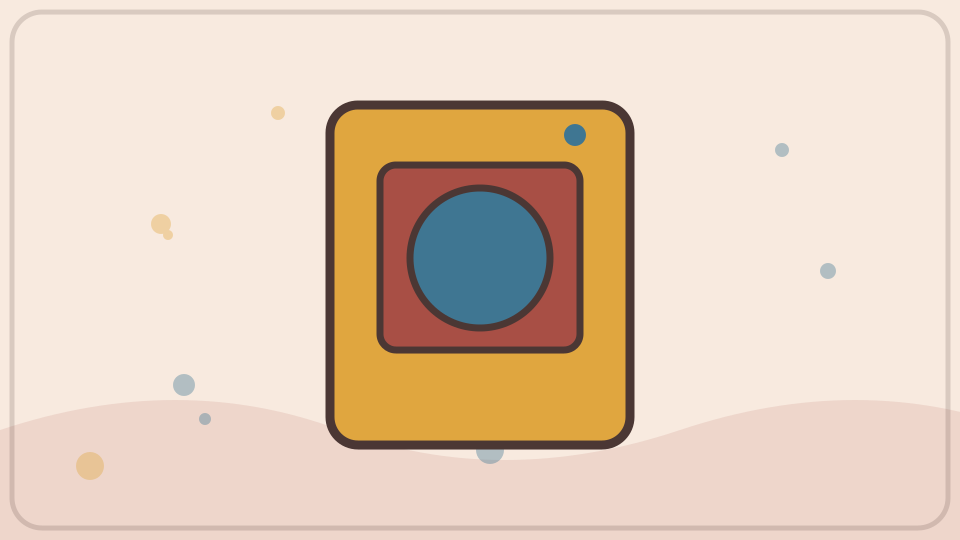

冰箱让制冷剂在管路中蒸发和压缩。制冷剂在箱内蒸发时吸收热量，压缩机把它送到箱外，冷凝时把热放进房间。冰箱是在搬热，不是在制造“冷”。

**再想一步：** 压力改变制冷剂的沸点，使它能在箱内低温蒸发、箱外较高温冷凝。门开太久，房间热空气进入，压缩机就要做更多功。

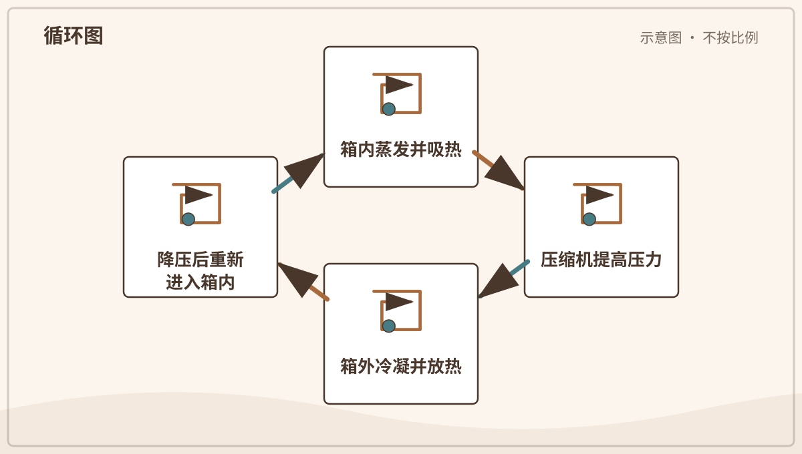

*图解：制冷剂在冰箱内蒸发吸热，在外部压缩并冷凝放热，再循环回来。*

**一起看看：** 摸冰箱外壳大人允许的位置，可能比房间略暖，不碰后部设备。

---

## 第 320 天｜冰箱冷冻室为什么会结霜？

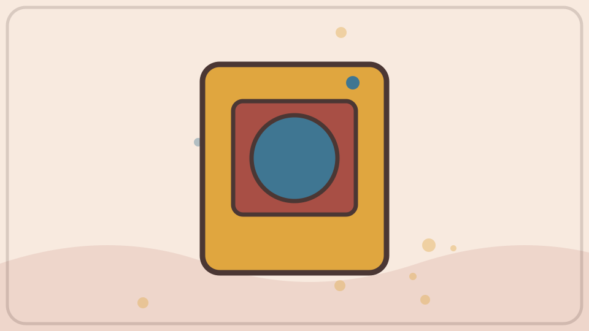

开门时，潮湿空气进入冷冻室。水汽碰到很冷的表面，会凝华或先凝结再冻结，逐渐形成霜。门封不严会让更多湿气进入。

**再想一步：** 无霜冰箱会定时加热蒸发器融霜，再把水排走，并不表示里面永远没有任何冰晶。厚霜会阻碍空气流和热交换，增加能耗。

**一起记住：** 除霜由大人按说明完成，不用刀或尖物凿冰。

---

## 第 321 天｜微波炉怎样把食物加热？

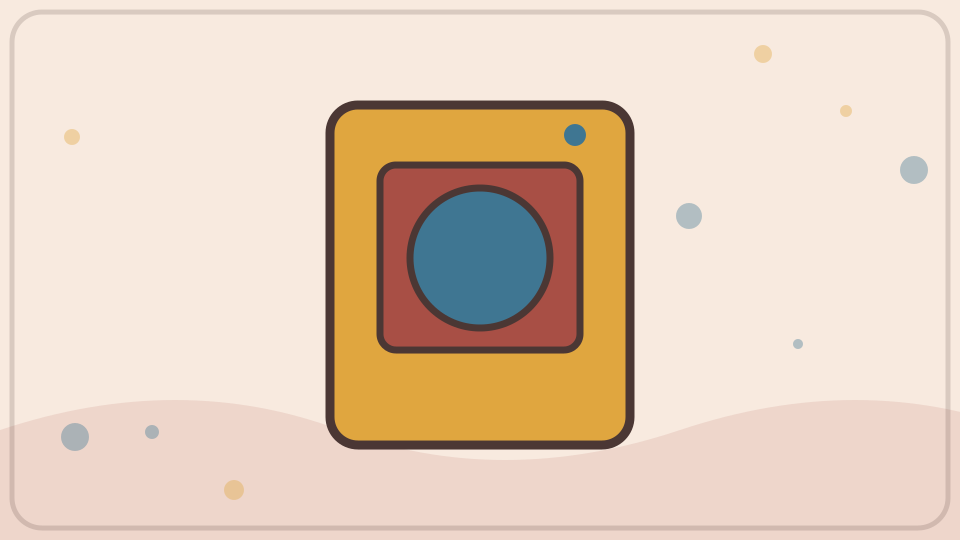

微波炉产生快速变化的电磁场，让食物中的极性分子，特别是水分子，反复改变取向。吸收的电磁能转成分子的无规则运动，食物温度便会上升。加热常不均匀，所以需要静置和搅拌。

**再想一步：** 微波不是从食物最中心统一向外加热，能量穿入深度有限，还会形成强弱分布。容器形状、含水量和食物厚度都会造成热点。

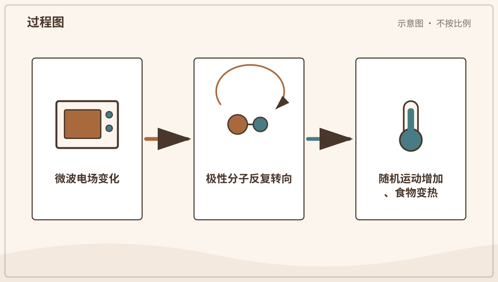

*图解：变化的电场让极性分子不断调整方向，吸收的电磁能转成无规则分子运动。*

**一起记住：** 微波炉只由大人操作，出炉食物和容器可能局部很烫。

---

## 第 322 天｜平底锅怎样把食物煎熟？

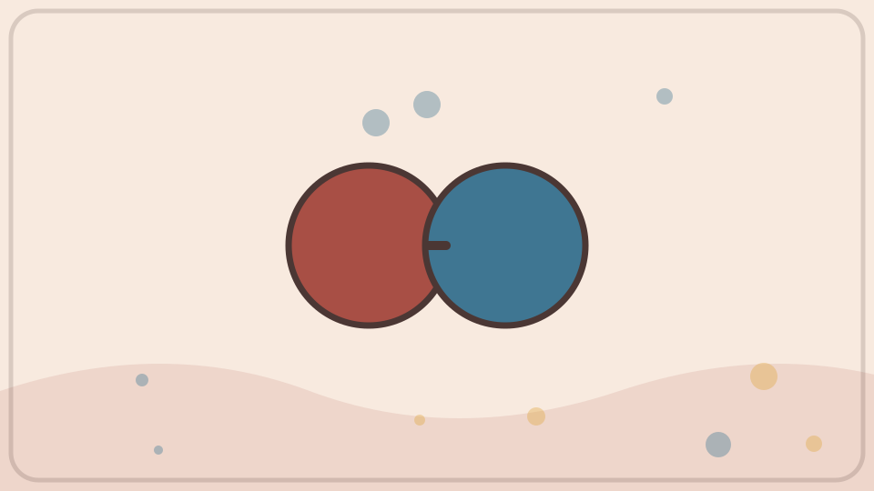

炉具先把能量传给锅底，金属再通过导热把热送到食物接触处。食物内部还靠导热和水分流动慢慢升温。油能填补小缝并帮助热量均匀接触表面。

**再想一步：** 高温下蛋白质、糖和水发生多种变化，表面可能出现美拉德反应，产生褐色和香味。锅底过热会使油和食物分解，烹饪需要控制温度。

**一起记住：** 炉火、锅柄、热油和刚关火的锅都由大人处理。

---

## 第 323 天｜保温杯怎样留住热？

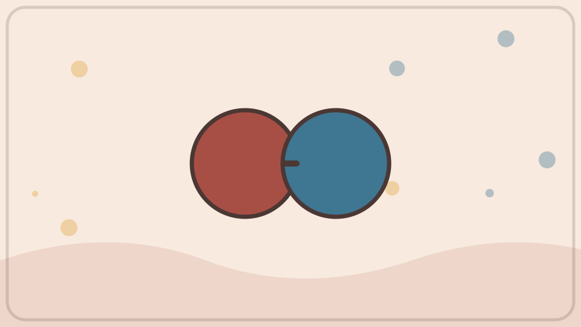

保温杯常有双层壁，中间接近真空，减少导热和对流。发亮表面能减少热辐射，密封盖阻止热空气和水汽跑出。这些办法一起减慢热量交换。

**再想一步：** 保温杯不能让温度永远不变，杯口、支撑点和材料仍会传热。它同样能减慢冷饮从外界吸热，所以“保温”也包括保冷。

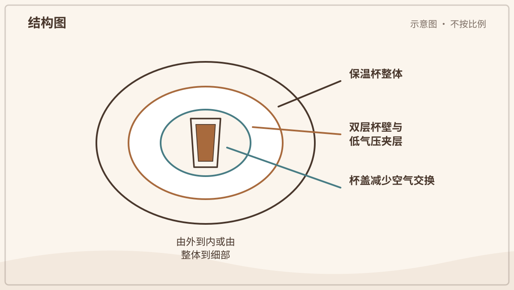

*图解：双层杯壁、真空或隔热层和严密杯盖分别减弱传导、对流和蒸发。*

**一起看看：** 只观察空杯剖面图；热饮温度必须由大人检查。

---

## 第 324 天｜木头为什么常能浮在水上？

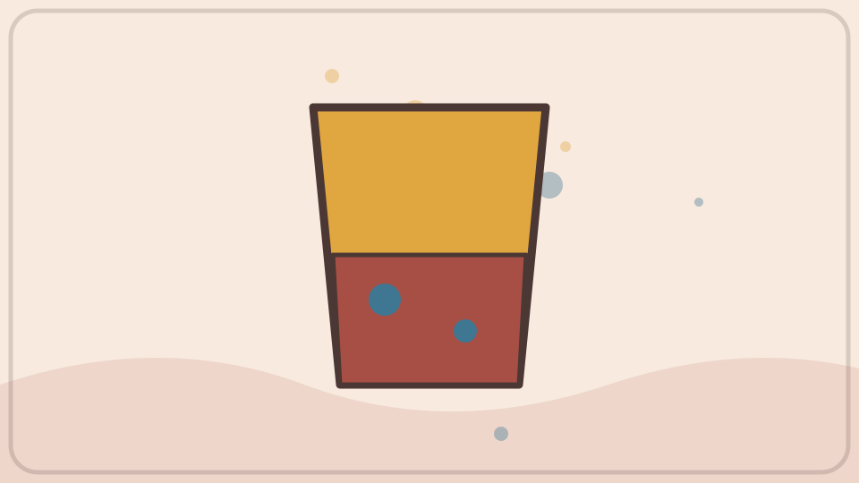

许多木材内部有细胞孔隙和空气，平均密度比水小，所以浮力能托住它。吸水、木种和形状会改变浮沉。乌木等某些木材也可能沉水。

**再想一步：** 是否浮起看物体平均密度与液体密度的比较，不只看材料硬不硬或物体大不大。钢船能浮，是因为空心船体连同空气的平均密度足够小。

**一起试试：** 由大人在水盆放软木和湿木片，水上活动全程陪同。

---

## 第 325 天｜纸为什么会吸水？

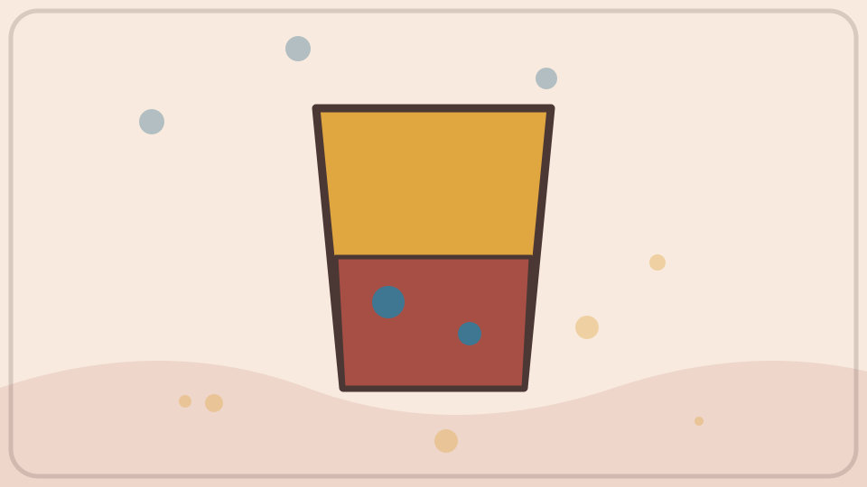

纸由交错的植物纤维组成，纤维之间有很多细小孔道。水与纤维相互吸引，会沿孔道向前爬，这叫毛细作用。纸湿后，纤维间连接改变，强度常会下降。

**再想一步：** 毛细上升由水对壁面的附着、分子间内聚和表面张力共同产生。孔越细，上升高度可能越高，但流动速度、纸张涂层和纤维方向也重要。

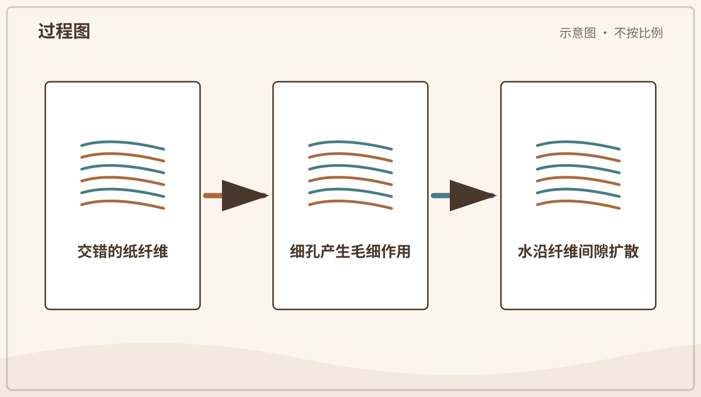

*图解：水对纸纤维的附着和细孔中的表面张力共同作用，把水拉进纸内。*

**一起试试：** 把纸巾一角碰到有色水，由大人使用食用色素并防止误饮。

---

## 第 326 天｜纸为什么横着竖着不一样好撕？

造纸时，许多纤维会更偏向机器运行的方向排列。沿纤维方向，裂口较容易走直；横过许多纤维时，撕裂路线更曲折。不同纸张的差别大小不同。

**再想一步：** 材料在不同方向性质不同叫各向异性。木材、织物和复合材料也常有方向性，工程师会按受力方向安排纤维。

**一起试试：** 由大人给两条废纸，从两个方向慢慢撕，比较边缘。

---

## 第 327 天｜玻璃很硬，为什么容易碎？

玻璃表面很硬，不容易被软物划伤，却缺少让裂纹停下的内部结构。小缺口受力时会集中应力，裂纹迅速扩展，玻璃就脆裂。硬度和韧性不是一回事。

**再想一步：** 钢化玻璃通过表面压应力提高抗裂能力，碎时常成小颗粒；夹层玻璃用薄膜粘住碎片。不同安全玻璃针对的风险也不同。

**一起记住：** 破玻璃不靠近、不触碰，立刻叫大人处理。

---

## 第 328 天｜铁为什么会生锈？

铁与氧和水发生化学反应，会形成含水氧化铁等锈蚀产物。盐能让电化学过程更快，所以海边铁件更易锈。锈层疏松，不能一直保护下面的铁。

**再想一步：** 涂漆、镀锌、加铬制成不锈钢或保持干燥，都能用不同方法减慢腐蚀。锈蚀是材料与环境之间的电子转移反应。

**一起看看：** 比较有漆和掉漆铁栏的表面，不摸尖锐锈片。

---

## 第 329 天｜塑料都是同一种东西吗？

塑料是一大类由高分子组成的材料，不是一种单独物质。不同分子链和添加剂让塑料变硬、变软、透明、耐热或有弹性。回收方法也因种类而异。

**再想一步：** 热塑性塑料受热可重新软化，热固性塑料形成交联网络后不易再熔。材料标记帮助分类，却不保证当地都能回收，仍要按本地规则处理。

**一起看看：** 和大人查看包装材料标记，不把塑料袋套在头上。

---

## 第 330 天｜橡胶为什么能拉长又回来？

橡胶由卷曲的长分子链组成，链之间还有一些连接点。拉伸时链被拉直并排列，放手后又倾向回到弯曲混乱的状态。连接点防止它们完全滑散。

**再想一步：** 天然橡胶常经硫化形成交联，提高弹性、强度和耐温。温度太低会变硬，氧和阳光也会让分子链老化、开裂。

**一起看看：** 轻拉厚而完整的安全橡胶件，不使用细小皮筋弹射。

---

## 第 331 天｜陶瓷为什么要放进窑里烧？

湿黏土由细小矿物颗粒和水组成，能塑形。干燥先去掉孔隙中的水，高温烧制再让颗粒发生化学和结构变化、彼此结合，变成坚硬陶瓷。烧成后不能加水变回泥。

**再想一步：** 烧结会减少孔隙，釉料熔化后形成玻璃质表面。升温太快或厚薄不均会让水汽和热应力造成裂纹，所以窑烧要按材料控制温度过程。

**一起看看：** 比较未烧黏土和成品陶杯，只触摸已经冷却的安全物件。

---

## 第 332 天｜一根根线怎样变成布？

织布时，一组经线纵向绷紧，另一组纬线横向穿过，交错锁在一起。针织则让线圈一个套一个。纤维、纱线和结构共同决定布的软硬、弹性与透气。

**再想一步：** 棉、羊毛、丝和合成纤维的表面、吸水和强度不同；同一种纤维换织法也会产生完全不同的布。材料性质来自尺度层层组合。

**一起看看：** 用放大镜观察毛巾、T 恤和毛衣，找交叉线或线圈。

---

## 第 333 天｜洗衣机为什么要转来转去？

洗衣机让衣物在水和洗涤剂中翻动，弯折、碰撞和水流帮助污物松开。漂洗换走含污物的水，脱水高速旋转，让水穿过滚筒小孔离开衣物。

**再想一步：** 旋转中的衣物需要向心力才能沿圆周走，滚筒壁提供这个力；水若不再被充分约束，会沿切线和孔道离开。衣物分布不均会造成震动。

**一起记住：** 不攀爬、不钻入洗衣机，运行和开门都听大人安排。

---

## 第 334 天｜吸尘器怎样把灰尘收进去？

电动机带动风扇，让机内一处压力降低，周围空气便从吸口流入。高速气流带着灰尘进入集尘袋或尘盒，过滤材料留下颗粒，空气再排出。

**再想一步：** 吸力受压力差、气流量、管道阻力和密封影响；滤网堵塞会让流量下降。细颗粒需要合适过滤，不能只看大灰尘是否被捡起。

**一起看看：** 只观察大人清洁后的空尘盒结构，远离插头和旋转刷头。
