# 十二月：一起做小小科学家

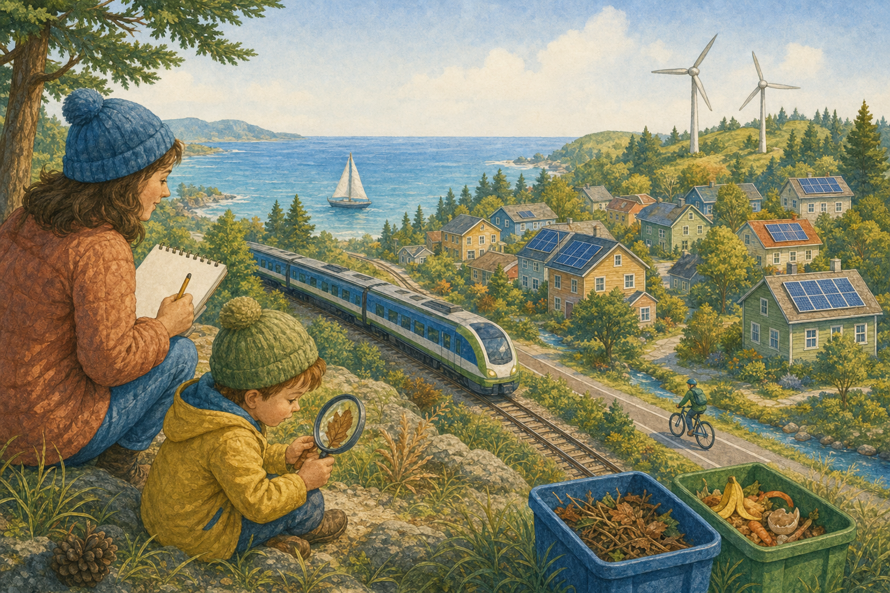

## 第 335 天｜走路时为什么不会一直倒下？

走路其实是一连串受控制的向前倾倒。身体重心移到支撑脚前方，另一只脚及时迈出接住身体。眼睛、内耳、神经和肌肉不断修正平衡。

**再想一步：** 地面对脚的支持力和摩擦力让我们能向前推，手臂摆动帮助抵消腿部旋转。刚学走路的孩子步子宽、手臂高，是在用更大支撑范围提高稳定性。

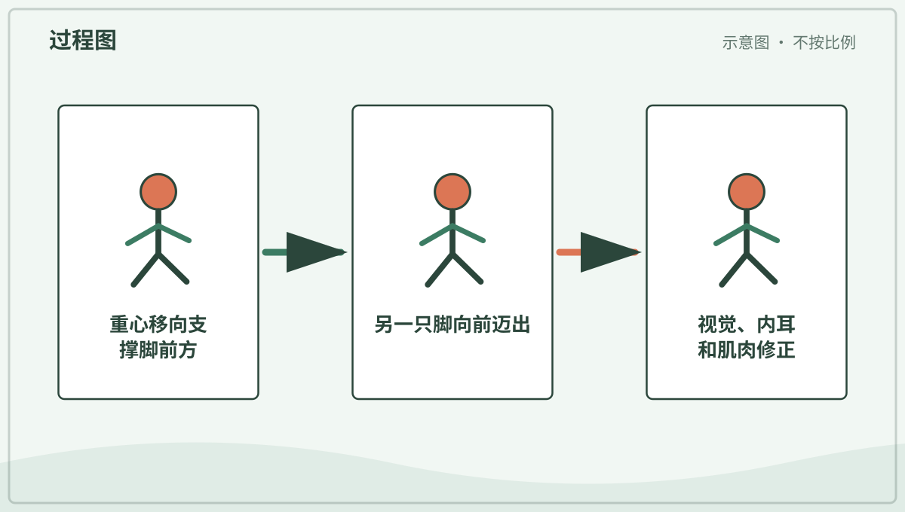

*图解：身体重心越过支撑脚后，另一只脚向前接住；感官和肌肉持续修正。*

**一起走走：** 在安全直线上慢走、快走各几步，比较步幅和手臂。

---

## 第 336 天｜自行车只有两个轮子，为什么不倒？

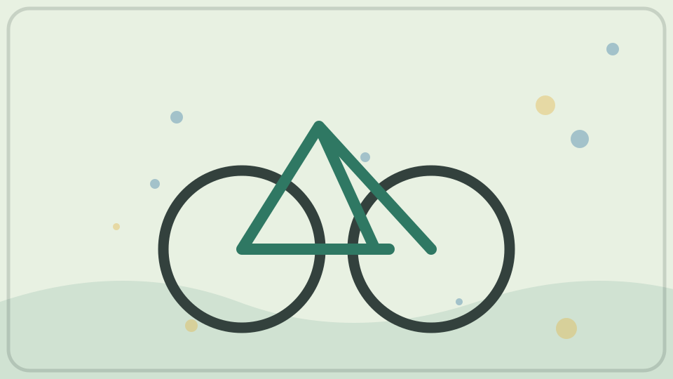

骑车人和车会不断做小小的转向，把车轮移到重心下方。车轮旋转和前叉几何也帮助转向稳定，但不是只靠“陀螺力”。车停得很慢时，更难及时修正。

**再想一步：** 自行车平衡是人、速度、转向和车架共同形成的动态控制。向左倾时略向左转，支撑点移到左边，便能产生扶正效果。

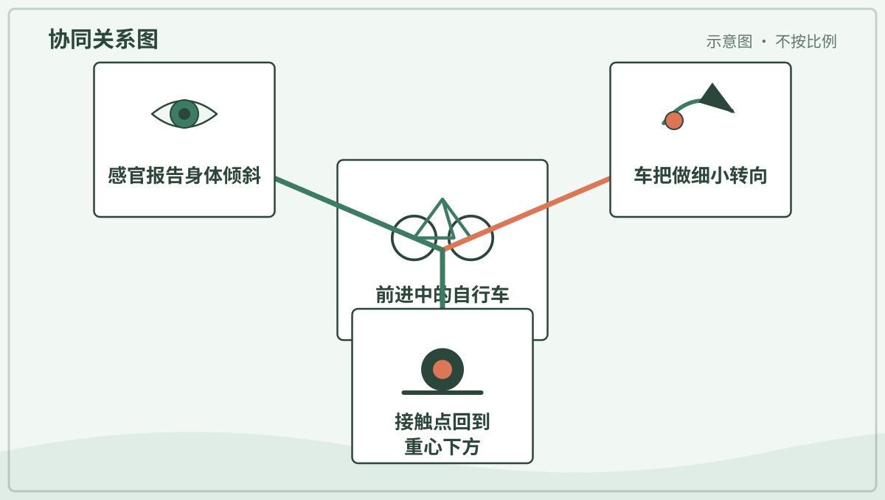

*图解：骑行者通过细小转向把轮胎接触点移到重心下方，持续恢复平衡。*

**一起记住：** 学骑车戴合适头盔，在封闭安全场地由大人陪同。

---

## 第 337 天｜汽车怎样让轮子转起来？

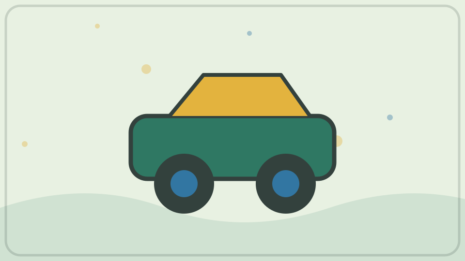

燃油车的发动机把燃料化学能经燃烧变成轴的转动，电动车的电机把电能变成转动。传动系统把转矩送到驱动轮，轮胎向后推地面，地面摩擦力把车向前推。

**再想一步：** 车并不是轮子直接“抓住空气”向前。静摩擦在轮胎不打滑时传力；加速所需能量还要克服滚动阻力、空气阻力并增加车辆动能。

**一起看看：** 只在停车安全处由大人指认轮胎和驱动系统，不钻车底。

---

## 第 338 天｜刹车怎样让车停下？

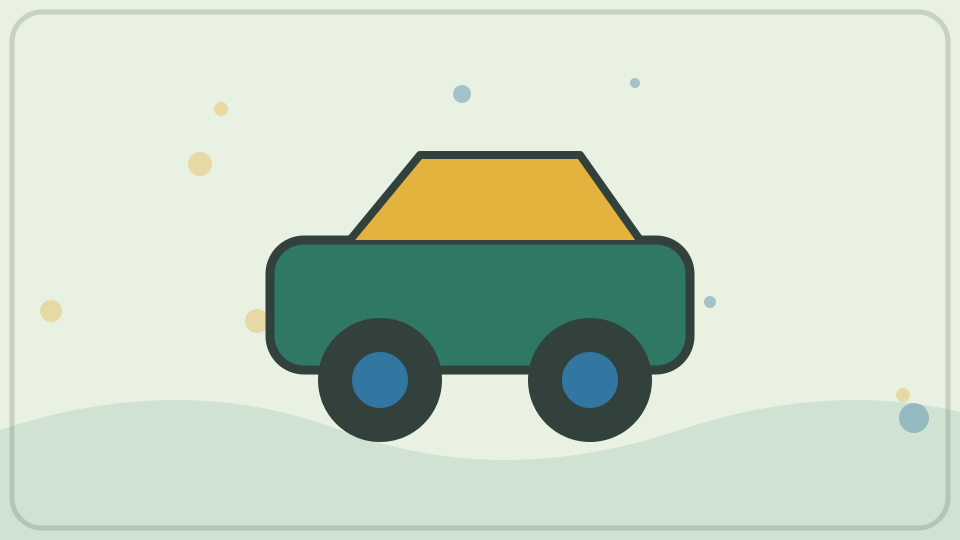

刹车片夹住刹车盘，摩擦把车轮的运动能量转成热。轮胎再靠与地面的摩擦减慢车辆。路面湿滑时能提供的摩擦较小，停车距离会变长。

**再想一步：** 防抱死系统快速调节制动力，避免车轮完全锁死，帮助保留转向和有效摩擦。车辆速度越高，动能按速度平方增加，所以多一点速度会增加很多制动能量。

**一起记住：** 过马路不能用耳朵猜车能马上停，始终按交通规则和大人指引。

---

## 第 339 天｜安全带为什么能保护人？

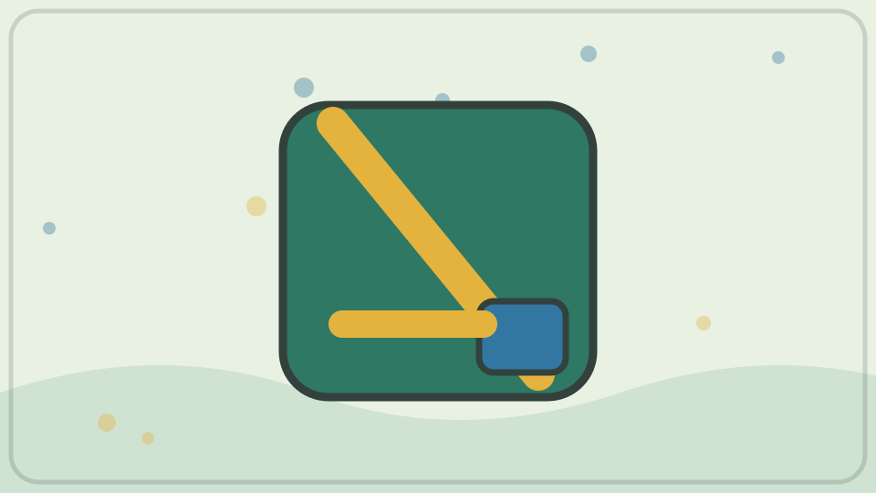

车突然停下时，身体因惯性仍想继续向前。安全带把停下的力分散到胸部和骨盆较结实部位，并延长减速时间。儿童还需要与身高体重相配的安全座椅。

**再想一步：** 同样的速度变化若用更长时间完成，平均加速度和力会较小。安全气囊是补充装置，不能代替安全带；错误坐姿会削弱保护。

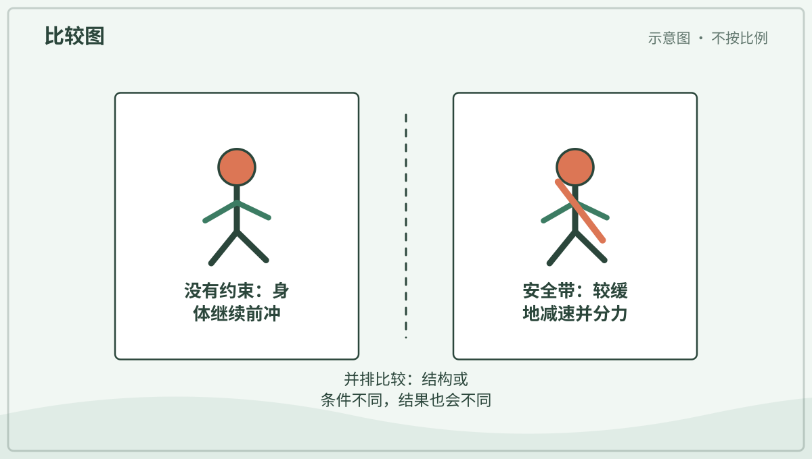

*图解：急停时身体因惯性继续向前；安全带延长减速时间，并把力分散到较强部位。*

**一起记住：** 每次乘车都由大人检查安全座椅和安全带，不自行解开。

---

## 第 340 天｜红绿灯怎么知道该换颜色？

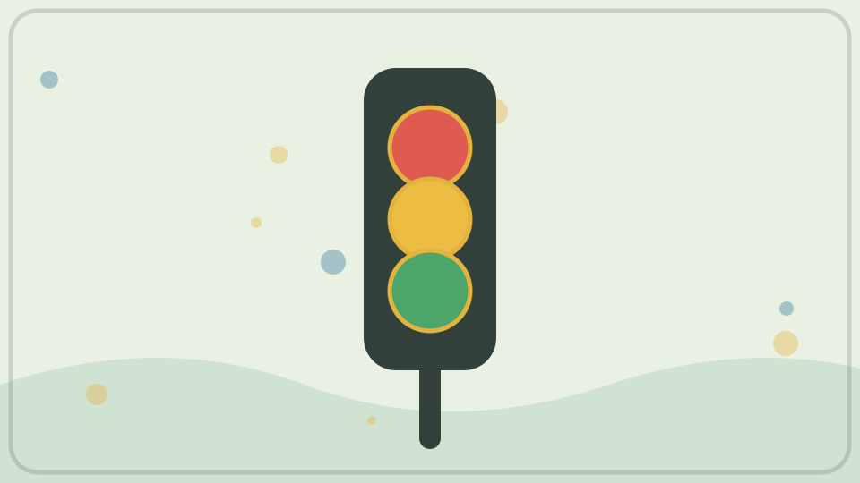

有些信号灯按预先设置的时间循环，有些还用地面线圈、摄像头或按钮检测车辆和行人。控制器协调不同方向，避免冲突车流同时通过。颜色是大家共同遵守的信号。

**再想一步：** 交通控制要在安全、等待时间和道路容量之间平衡，复杂路口还会联网调整。传感器也可能看漏或故障，所以规则、观察和维护同样重要。

**一起看看：** 在安全位置和大人数完整个信号周期，不因绿灯就立刻冲出。

---

## 第 341 天｜火车为什么爱走钢轨？

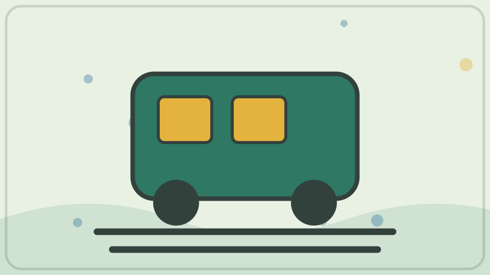

钢轮在钢轨上变形较小，滚动阻力低，能用较少能量拉动很重的列车。轮缘和轮面形状帮助车辆沿轨道前进。轨道也把载荷分给枕木和地基。

**再想一步：** 低阻力让火车高效，却也使制动距离较长，无法像汽车随意绕开障碍。车轮略带锥度，左右偏移时滚动半径差会帮助列车回到中间。

*图解：钢轮在钢轨上滚动阻力较小；轮缘和略带锥度的轮面帮助列车沿轨道。*

**一起记住：** 铁轨和站台边缘都是危险区域，只在规定地点听从大人。

---

## 第 342 天｜地铁从哪里得到电？

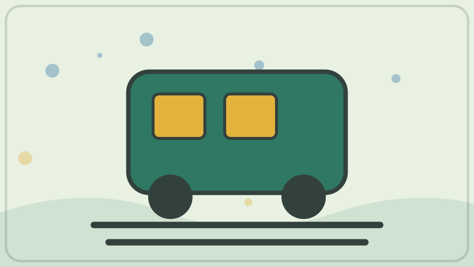

电气化列车从第三轨或架空线取得电能，变流设备调节后送给牵引电动机。电机带动车轮，列车便前进。车站照明、通风和信号也需要电。

**再想一步：** 刹车时，一些列车让电机反过来像发电机，把部分运动能量送回电网或供其他设备使用，这叫再生制动。仍有能量会变成热。

**一起记住：** 不触碰轨道、电线或设备柜，站在安全线内等车。

---

## 第 343 天｜钢做的大船为什么能浮？

船壳虽然由密度比水大的钢制成，内部却有大量空气。整艘船的平均密度可以小于水，并排开足够重量的水，浮力便托住它。装货太多会让船下沉更深。

**再想一步：** 阿基米德原理说，浮力等于物体排开流体的重量。船体形状还要保持稳性，让倾斜后浮力作用位置产生扶正力矩。

*图解：空心船体排开大量水；排水产生的浮力等于船重时，大船便稳定漂浮。*

**一起试试：** 用同量黏土先捏实球再捏空碗，由大人在水盆比较浮沉。

---

## 第 344 天｜帆船怎样迎着风前进？

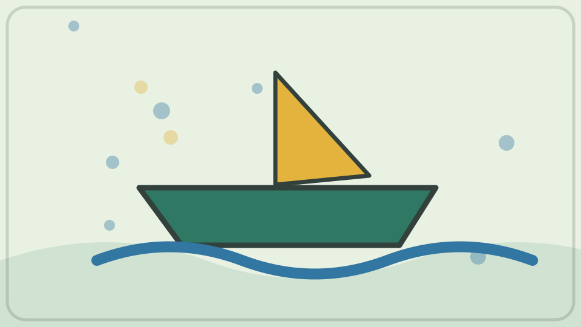

帆像翼一样改变气流，产生不只顺风方向的力。船底的龙骨或稳向板抵抗侧滑，把一部分力变成向前运动。帆船不能正对风直行，却能斜着走“之”字。

**再想一步：** 帆两侧压力差和气流转向共同产生空气动力，水下结构提供相反侧向力。改变帆角和航向，就是调整两种流体里的受力平衡。

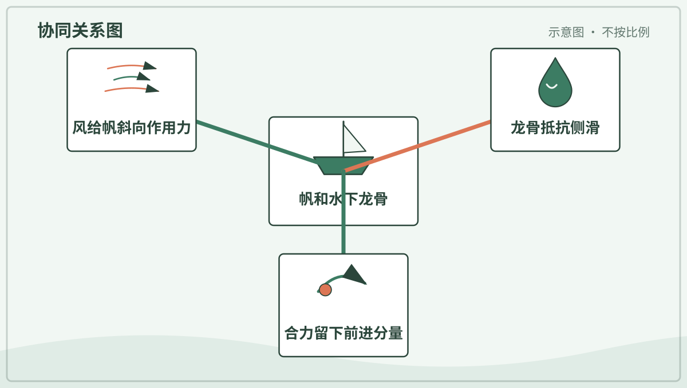

*图解：斜着的帆受到空气合力，水中的龙骨抵抗侧滑，剩下的分力推动船前进。*

**一起看看：** 在图上画出风向，再画帆船左右交替的之字路线。

---

## 第 345 天｜飞机那么重，怎样离开地面？

发动机提供推力，让机翼快速穿过空气。机翼的形状和迎角把空气向下偏转，同时形成压力分布，产生向上的升力。升力大到足以克服重量，飞机便起飞。

**再想一步：** 不能只用“上面路长，所以空气必须同时到达”解释升力；空气并没有这种同时到达规则。牛顿动量变化和压力场是同一受力过程的两种描述。

*图解：机翼改变空气的速度和方向；压力分布与向下偏转的气流共同产生升力。*

**一起看看：** 观察飞机起飞时襟翼、速度和抬头角度怎样变化。

---

## 第 346 天｜直升机为什么能停在空中？

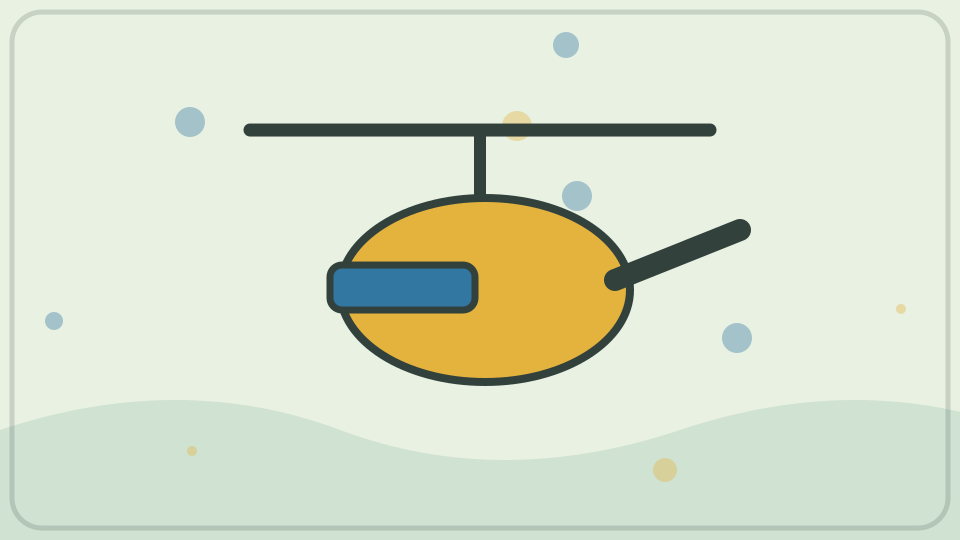

直升机的旋翼像不断转动的长机翼，把空气向下加速，产生向上升力。改变每片桨叶角度，可以上升、下降或向某方向倾斜飞行。尾桨或其他旋翼抵消机身扭转。

**再想一步：** 主旋翼受发动机转矩时，机身会受相反转矩；单旋翼直升机用尾桨提供反扭矩。悬停持续需要功率，因为空气必须不停获得向下动量。

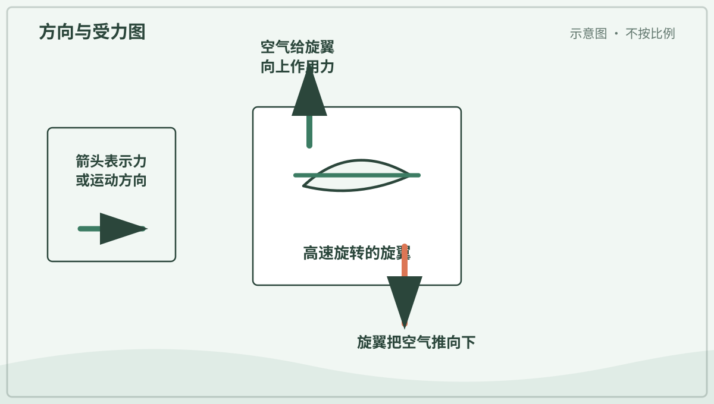

*图解：旋翼像不断旋转的机翼，把大量空气加速向下，反作用力托起直升机。*

**一起记住：** 远离起降区，旋翼转得快时可能几乎看不清，仍极危险。

---

## 第 347 天｜热气球为什么会上升？

加热球囊里的空气后，空气膨胀，一部分从开口流出，囊内平均密度变小。热气球排开的外界空气比自身总重量更重，净浮力就让它上升。

**再想一步：** 冷却或放出热空气会降低浮力。热气球主要随不同高度的风移动，驾驶员通过升降寻找方向合适的风层，不能像飞机一样自由朝任意方向飞。

*图解：球囊里的热空气密度较低；排开冷空气产生的浮力超过总重量时便上升。*

**一起看看：** 比较热气球、氦气球和普通吹气气球，浮力来源哪里不同。

---

## 第 348 天｜潜水艇怎样沉下去又浮上来？

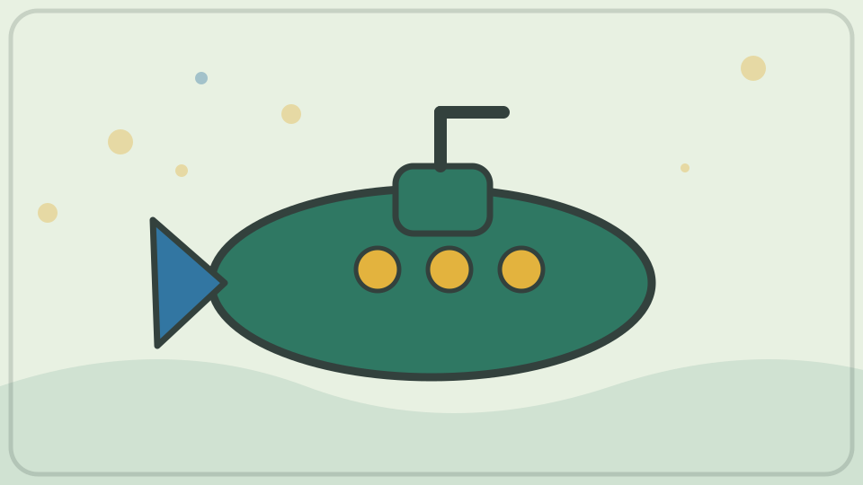

潜艇有压载舱。让海水进入时，总质量增加，平均密度变大，潜艇下潜；用压缩空气排出水后，质量减小，就能上浮。水翼帮助在前进中控制深度和姿态。

**再想一步：** 潜艇还用调节水舱精确达到近似中性浮力，让浮力与重量接近。坚固耐压壳承受深水压力，形状和材料都有严格限制。

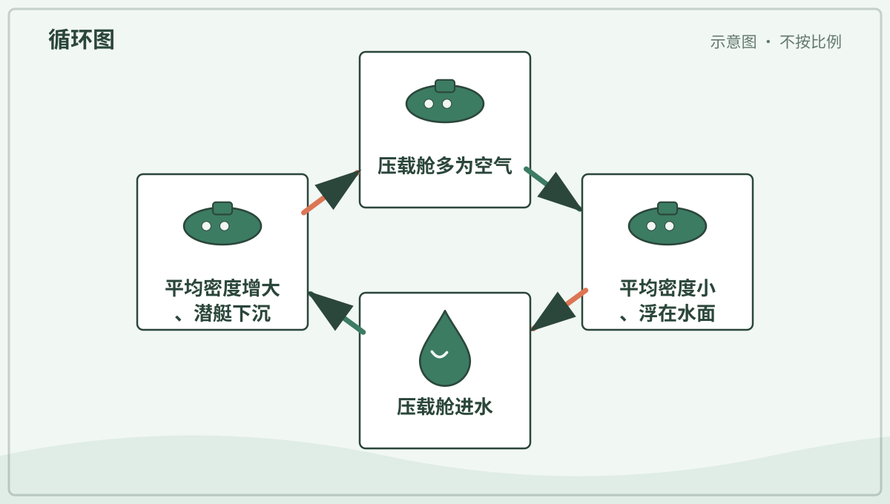

*图解：压载舱进水会增加潜艇平均密度使其下沉；排水充气则使它上浮。*

**一起看看：** 用有盖塑料滴管做安全浮沉子实验，由大人全程操作小物件。

---

## 第 349 天｜能源会不会用完？

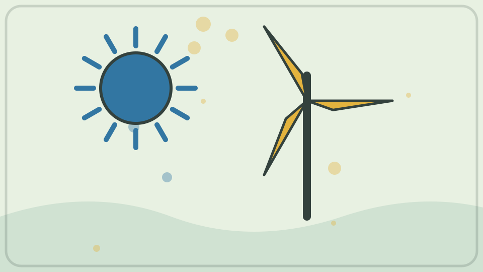

煤、石油和天然气形成极慢，人类使用速度远快于补充，叫不可再生能源。阳光、风和流水会持续得到自然补充，叫可再生能源。所有能源设施都需要材料和土地。

**再想一步：** 能量不会凭空消失，但会转成更分散、较难再利用的形式；真正会短缺的是方便取得的能源资源和转换能力。比较能源要看全生命周期、可靠性与环境影响。

**一起看看：** 找出家中三件用电物品，想想电在到家前可能从哪里来。

---

## 第 350 天｜太阳能板怎样把光变成电？

太阳能电池通常用半导体制成。光子把材料中的电子推到较高能量状态，内部电场把电荷向不同方向分开；接上回路后就形成电流。这叫光伏效应。

**再想一步：** 面板不能把全部阳光变成电，一部分被反射或变成热。光照角度、温度、遮挡、逆变器和储能都会影响系统输出。

*图解：半导体吸收光子后分离电荷，电极收集电荷并让电流流过外部电路。*

**一起看看：** 观察安全小太阳能玩具在明处和阴影中的速度变化。

---

## 第 351 天｜风力发电机为什么有长叶片？

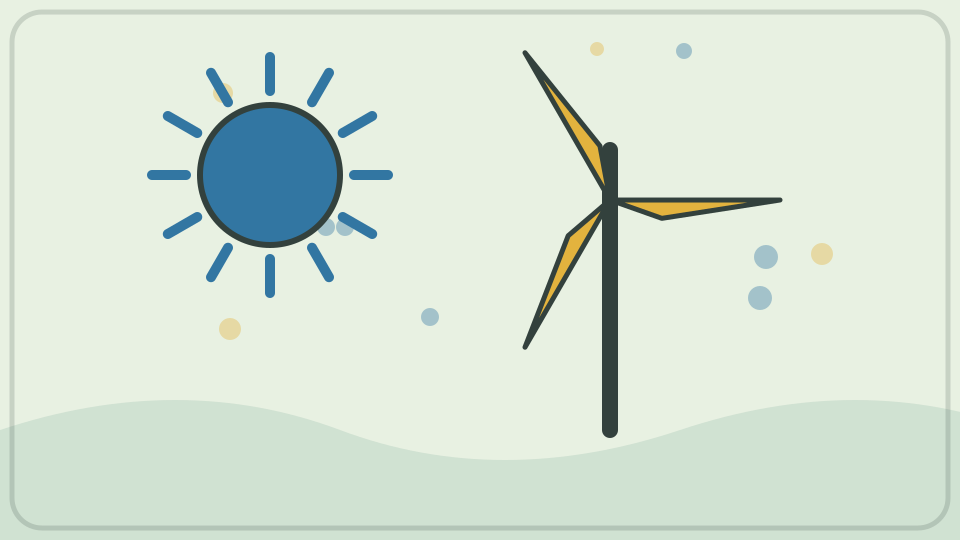

风经过叶片时产生升力，让转子转动，发电机把机械能变成电能。长叶片扫过更大面积，能接触更多流动空气。控制系统会调整叶片角度和机舱方向。

**再想一步：** 风中可利用功率随风速大约按三次方增加，但太强风会超过结构安全范围，需要停机。叶尖速度、噪声、鸟类迁徙和电网接入都要评估。

**一起看看：** 观察远处风机，比较三片叶在一圈中速度是否相同。

---

## 第 352 天｜流水怎样发电？

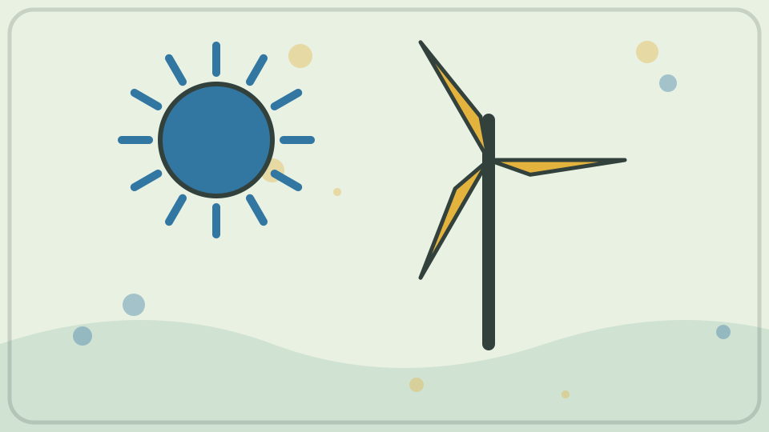

高处水具有重力势能，流向低处时推动水轮机旋转，发电机再产生电。水坝可以储水并形成高度差，也有电站利用天然河流而少建大水库。

**再想一步：** 可发功率与水流量、高度差和效率有关。水电运行时碳排放较低，但水坝会改变鱼类迁徙、泥沙、河流生态和居民生活，选址需要权衡。

**一起看看：** 在图上沿“水库—水管—水轮机—发电机—河流”走一遍。

---

## 第 353 天｜电怎样从发电站来到家里？

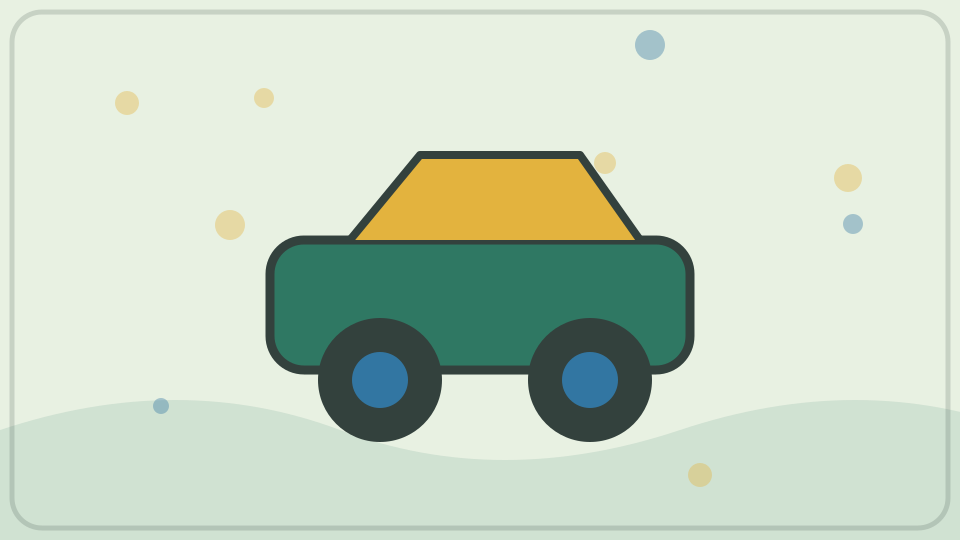

发电机产生电能后，变压器把电压升高，通过输电线送很远。靠近城市后再逐级降压，配电线路把电送到建筑。电网要让发电与用电时时接近平衡。

**再想一步：** 同样功率用较高电压输送，电流较小，导线发热损失会减少。太阳风能变化、用电高峰和设备故障需要调度、储能与互联网络共同处理。

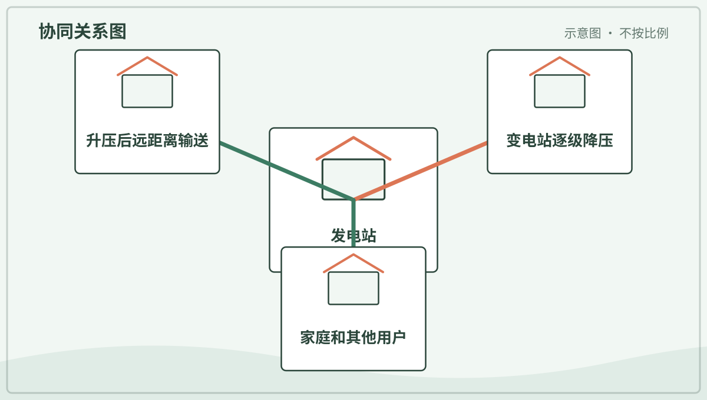

*图解：电网先升高电压远距离输电，再逐级降压，把电能分配到不同用户。*

**一起记住：** 电线、变电站和配电箱只远观，掉落电线绝不靠近。

---

## 第 354 天｜LED 灯为什么省电？

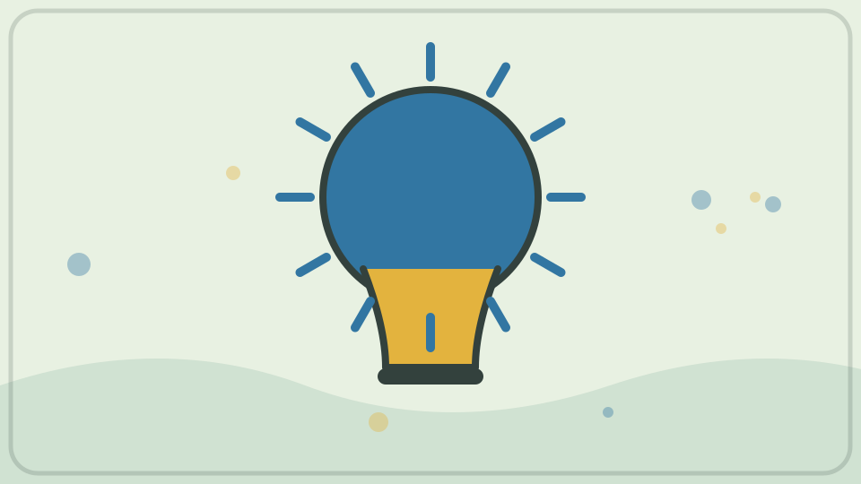

LED 是发光二极管。电流通过半导体时，电子与空位重新结合，把一部分能量直接变成光。它比白炽灯少把电能先变成高温，因此同样亮度通常更省电。

**再想一步：** 半导体材料的能带差决定发出的光子能量和颜色。白光 LED 常用蓝光芯片激发荧光材料，混合成眼睛看到的白光；驱动电路也会消耗能量。

**一起看看：** 比较不同色温灯光下白纸的样子，不拆灯泡。

---

## 第 355 天｜房子怎样少跑掉一点热？

墙和屋顶里的保温材料留住小空气层，双层窗减少导热和对流，密封缝隙阻止空气漏进漏出。遮阳和通风也能减少夏天过热。设计要适合当地气候。

**再想一步：** 建筑热量通过传导、对流、辐射和空气渗透移动。增加保温并非越多越好，还要管理湿气、室内空气质量、采光和材料安全。

**一起看看：** 和大人找门窗边有没有能感觉到的漏风，不自行封堵通风口。

---

## 第 356 天｜回收以后，旧东西会变成原来的吗？

有些玻璃和金属可熔化制成新物品，纸纤维会随回收变短，塑料则要按种类处理。回收常得到性质不同的新材料，不一定变回原物。先少用和重复使用也很重要。

**再想一步：** 回收需要收集、分拣、清洗、运输和再加工，也会消耗能量。材料混杂、污损和缺少市场都会降低回收效果，所以应遵守本地分类规则。

**一起行动：** 和大人查本地规则，给三件干净废物找到正确去处。

---

## 第 357 天｜菜叶怎样变成堆肥？

细菌、真菌和小动物会分解菜叶、果皮和枯叶，把复杂有机物变成较简单物质。合适的水分、空气和碳氮比例让过程顺利，并产生热。最后得到较稳定的堆肥。

**再想一步：** 有氧分解与缺氧腐败产生的气味和气体不同。肉、病株、宠物粪便和可堆肥包装能否加入，要按设施规则，家庭堆肥并非什么都收。

**一起看看：** 只和大人观察成熟堆肥的颜色与质地，之后认真洗手。

---

## 第 358 天｜树怎样把碳留在身体里？

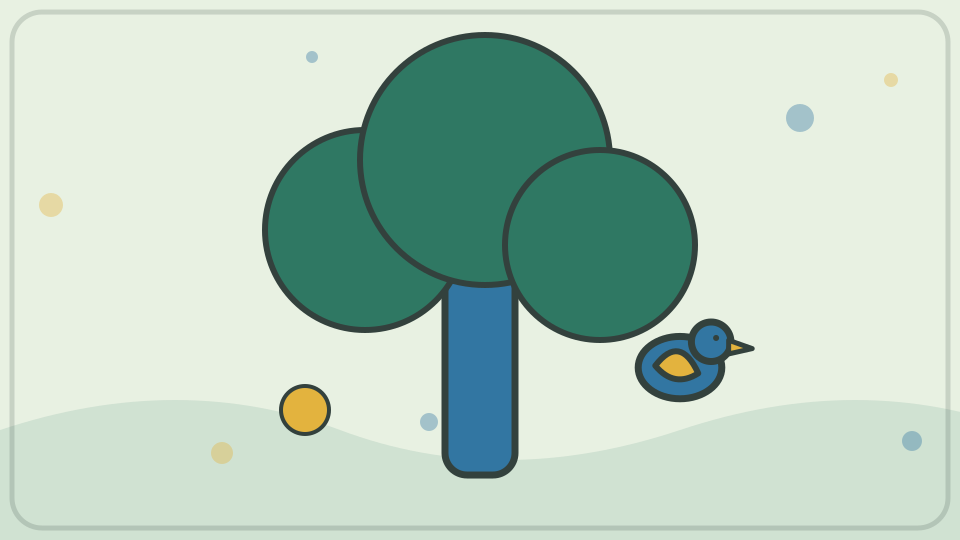

树用光合作用吸收空气中的二氧化碳，把碳做进糖、木材、根和叶。树生长时储存碳，落叶和死亡后，一部分碳进入土壤，另一部分被分解者释放回空气。

**再想一步：** 森林碳循环包含吸收与释放，不能把一棵树当成永久封闭盒。保护老森林、恢复生态和减少化石燃料排放的作用不同，不能只靠种树替代所有减排。

**一起看看：** 在树的叶、枝、干和根示意图上找碳可能待在哪里。

---

## 第 359 天｜大气为什么像一床会调温的被子？

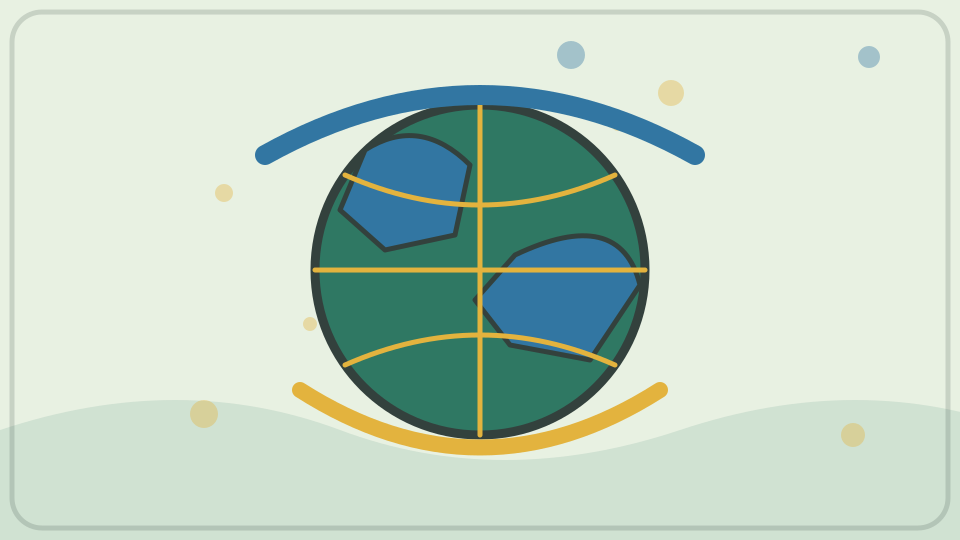

阳光加热地表，地表再发出红外辐射。水汽、二氧化碳和甲烷等气体会吸收并向各方向发射部分红外，使地表比没有这些气体时温暖。这是自然温室效应。

**再想一步：** 人类燃烧化石燃料和改变土地，增加温室气体，打破原有能量平衡，造成全球长期变暖。它不是大气像玻璃把热简单“锁死”，而是辐射传输高度和速度改变。

**一起想想：** 天气一天会变，为什么研究气候需要很多年的全球数据？

---

## 第 360 天｜为什么需要许多不同的生物？

基因、物种和生态系统的多样性合称生物多样性。不同生物参与传粉、分解、食物网、土壤形成和水循环。多样系统面对变化时常有更多响应办法。

**再想一步：** 不能把每个物种只按“对人有什么用”来评价，生物之间还有尚未发现的关系与自身存在价值。栖息地丧失、污染、过度利用、入侵种和气候变化会共同造成压力。

**一起看看：** 在附近安全绿地数不同叶形和鸟声，不采集生物。

---

## 第 361 天｜观察和猜想有什么不同？

观察是用感官或工具记录看到、听到和测到的事情；猜想是对原因或接下来会怎样的解释。好科学会把两者分开，再找证据检验猜想。猜错并不丢脸。

**再想一步：** 观察也会受工具、角度和期待影响，所以要记录条件并让别人复查。猜想若能提出可能被证据否定的预测，才更容易被科学检验。

**一起试试：** 看一只封闭盒，先写“我看到”，再写“我猜里面有”。

---

## 第 362 天｜为什么要用尺子和秤？

“大一点”“重很多”会因人而不同，尺子和秤把比较变成共同单位的数字。测量让不同时间和不同人得到的结果可以比较。工具也有精度限制。

**再想一步：** 每次测量都含不确定度，来自刻度、校准、读数和被测物变化。重复测量并报告合理位数，比写很多看似精确的小数更诚实。

**一起量量：** 用尺量同一本书三次，看看结果是否完全一样。

---

## 第 363 天｜怎样做一次公平的实验？

想知道一个条件的作用，可以让两组尽量相同，只改变要研究的那一项。重复多次并记录结果，避免一次巧合骗过我们。这叫控制变量和重复实验。

**再想一步：** 真正系统里变量常互相影响，完全控制并不总可能，还要随机分组、盲法或统计分析。公平实验不是保证答案正确，而是减少其他解释。

**一起试试：** 两块同样湿纸巾放在有风和无风处，只比较干燥快慢。

---

## 第 364 天｜科学模型会不会错？

模型是用图、物体、数学或电脑抓住现实的一些关系。地球仪适合看大陆位置，却不能画出每栋房子；原子球模型也不是原子照片。模型有用途，也有边界。

**再想一步：** 科学家比较模型预测与新数据，发现偏差后会修改或换模型。模型不必复制一切才有用，关键是对问题保留了什么、忽略了什么、误差多大。

**一起想想：** 今天读过的哪一张图是模型？它故意省略了什么？

---

## 第 365 天｜问完 365 个为什么，就都知道了吗？

当然没有。每个答案都能长出新问题：我们怎样知道？换个地方还一样吗？有没有例外？科学不是装满答案的盒子，而是一种不断观察、猜想、检验和修正的方法。

**再想一步：** 可靠知识来自许多人公开方法与证据、互相检查、重复研究，也来自承认不确定和改正错误。今天最好的解释将来可能更精确，但这不表示所有说法都同样可靠。

**一起开始：** 选今天身边的一件小事，提出第 366 个问题。
